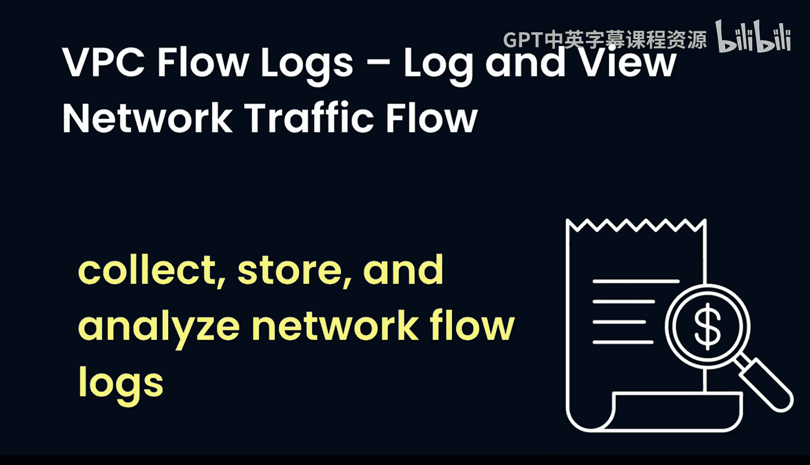
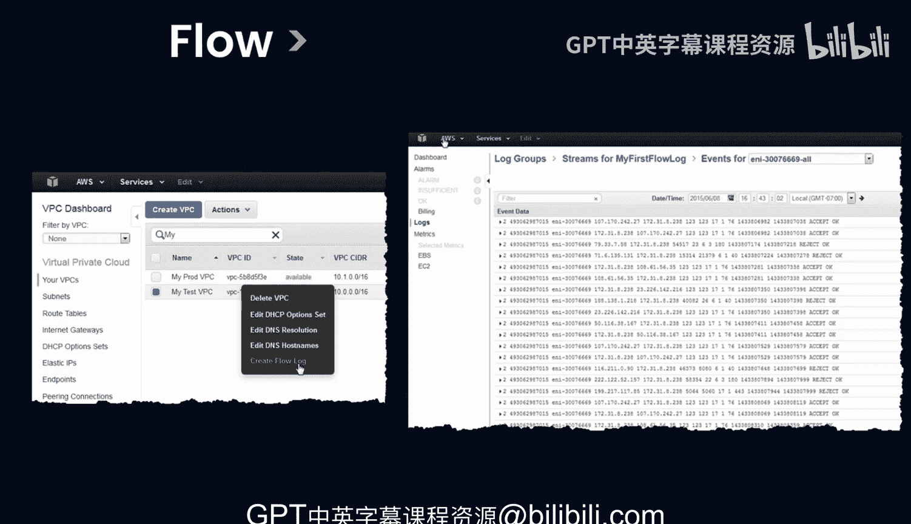

# Rust编程4-5（Linux命令行工具、LLMOps）：11：审计网络安全 🔍

在本节课中，我们将学习如何审计组织内的网络流量，以识别恶意攻击或配置不当的内部行为。我们将重点介绍使用**VPC流日志**这一工具来实现网络流量的记录、查看与分析。

---

## 概述

审计网络流量对于维护组织安全至关重要。它帮助我们识别潜在的恶意攻击，并检查内部网络行为是否存在错误配置。一种有效的方法是使用**VPC流日志**。通过记录和查看网络流量，我们可以收集、存储和分析网络流日志，进而排查包括安全问题在内的各种故障，确保网络按预期运行。

---

## 使用VPC流日志审计网络

上一节我们介绍了审计网络流量的重要性。本节中，我们来看看如何使用VPC流日志这一具体工具来实现审计。

在AWS环境中，过去可能需要借助代理等工具来完成网络流量审计。现在，我们可以直接使用VPC流日志功能。

以下是创建和查看VPC流日志的基本步骤：

1.  首先，进入AWS管理控制台的VPC服务。
2.  选择需要监控的VPC，然后创建VPC流日志。
3.  创建后，系统将开始记录并展示该VPC内的所有网络连接。

VPC流日志界面会实时显示网络连接流，我们可以清晰地看到哪些连接被**接受**，哪些被**拒绝**。这为后续分析提供了直观的数据基础。

---

## 集成告警系统

在成功收集到网络流日志数据后，下一步是建立监控和告警机制，以便在出现异常时及时响应。

VPC流日志提供了一个良好的数据接口，我们可以利用它来创建告警。例如，可以将流日志数据发送到**Amazon CloudWatch**，利用其监控和告警功能。此外，也可以集成到其他第三方安全信息和事件管理（SIEM）系统中。

通过设置合理的告警规则（如检测到大量来自异常IP的拒绝连接），我们可以在潜在安全事件发生时立即获得通知。

---

## 总结

本节课中，我们一起学习了网络流量审计的重要性以及如何使用**VPC流日志**这一工具。我们了解到，通过启用VPC流日志，可以实时监控网络连接状态（接受或拒绝），并利用其数据接口与CloudWatch等系统集成，构建自动化的安全告警机制，从而有效提升网络的安全性和可观测性。