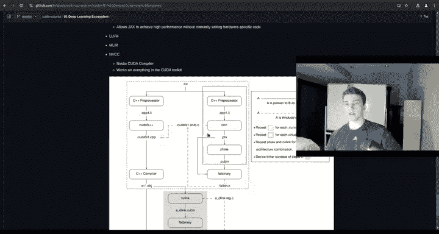
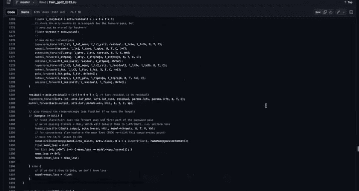
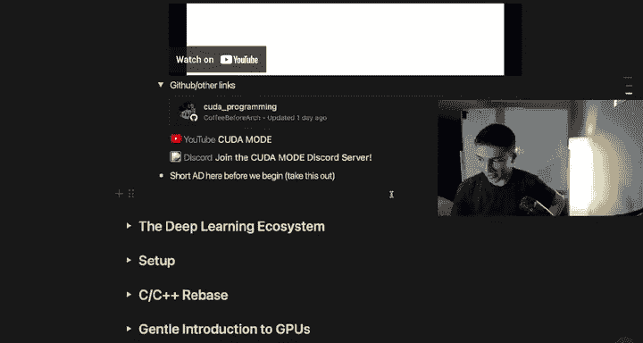

# 0：课程介绍 🚀

在本节课中，我们将一起了解这门CUDA编程课程的全貌。课程将引导你学习如何利用GPU进行高性能计算，涵盖从基础概念到实际应用的全过程。

## 课程概述

欢迎来到这门CUDA编程课程。你将学习如何利用GPU进行高性能计算。课程从深度学习生态系统的概述开始，指导你完成CUDA环境的设置，并回顾必要的C和C++概念。你将探索GPU架构，并编写你的第一个CUDA内核。高级主题包括优化矩阵乘法，以及通过实际应用（如为MNIST数据集实现一个多层感知机）来扩展PyTorch。

本课程由Elliot Olridge创建。

## 什么是CUDA？

那么，什么是CUDA？CUDA是英伟达推出的“统一计算设备架构”。我的名字是Elliot。我是freeCodeCamp平台的一名讲师，同时也是一名攻读计算机科学学位的学生。在这门课程中，我将为你带来面向深度学习的CUDA知识。但如果你不从事深度学习，请不要因此却步，因为我们仍将涵盖大量通用内容。

以及并行编程的许多其他领域。因此，本课程虽然更偏向于深度学习，但并非专门针对它。这里将涵盖很多内容。

## 课程最终项目

首先，我将展示最终项目是什么，让你能提前预览我们课程结束时将要构建的内容。然后，我们再从头开始。

在开始任何复杂内容之前，我需要包含一个免责声明。当你观看本课程时，它可能不是完全最新的。如果你在我发布课程十年后才观看，情况可能已大不相同。可能会有更新，新的计算能力可能强大得多，可能发生了许多变化。我不太确定十年后生态系统会变成什么样。但截至2024年，这几乎是你能找到的最好的内容。我尽量让所有内容不完全围绕特定时间点，这样你可以回到这个版本或特定的代码版本，重现所有相同的内容。只是如果你在很久以后观看，操作上可能会有些许不同。

## 创建课程的初衷

那么，我究竟为什么要创建这门课程呢？首先，许多性能和内核工程岗位需要大量知识和行业经验。要达到能够与顶尖性能工程师竞争的水平非常困难。这些人负责编写像GPT-4、GPT-5等大型模型的训练流程。要优化在大型数据中心或计算集群上进行的大规模神经网络训练和推理，需要大量技能。

本课程旨在减少你手动摸索的部分，虽然仍鼓励你独立探索，但避免了你从零开始、独自深入研究的那种高强度劳动。这是我创建课程的原因之一。

另一个原因是，一般来说，编写GPU内核或在GPU上进行任何编程的目的都是为了让某些东西运行得更快。如果你有一个嵌套循环，例如 `for i in range(4): for j in range(4): for k in range(4): ...`，并行编程和CUDA允许我们展开这些循环。举例来说，对于 `for i in range(4)`，你可以将循环中的每个小任务分配到不同的CUDA核心上执行。因此，如果你有10000个CUDA核心，并且你的循环有10000次迭代，那么你可以在GPU上通过单个指令或单个线程有效地完成每次迭代。这就是它允许我们做的事情之一。

你将运用在本课程中学到的GPU架构知识、内核启动配置以及其他很酷的东西，来使代码尽可能快地运行。

最后一个原因是，如今数据量非常庞大。人们常说我们有太多数据，但经过清洗的数据却很少。我汇集了所有其他视频课程、互联网和YouTube上的内容，并将它们整合到一门课程中。我过滤掉了很多无用的、过时的内容，以及一些可能未被充分涵盖的新内容，并将精华提炼到这门杰作中。这包括付费课程涵盖的主题。我虽然没有实际付费，但我查看了它们涵盖的章节，并将其中一些重要概念纳入本课程。

我提供了YouTube视频和所有这些资源的链接，我只筛选了高质量的内容。我浏览了很多这些视频和资源，它们都将放在描述中的GitHub链接里。因此，你需要的所有内容都会在那里，我把所有链接都集中放在了那个链接里。

## CUDA的应用场景

那么，CUDA和并行GPU编程有哪些应用场景呢？首先，是图形和光线追踪。你在电子游戏中看到的计算机图形、用户界面等都属于此类。其次，是流体模拟，用于物理和建模，例如引擎动力学。第三，是视频编辑。我现在编辑这个视频就在使用并行计算进行渲染。第四，是加密货币挖矿，很多人可能已经在做了，这会利用你的GPU硬件及其优势来解决挖矿问题。然后是像Blender这样的3D建模软件。当你有很多不同的点需要处理并渲染物体时，本质上与视频编辑类似，只是从2D变成了3D。

最后一个，你可能已经猜到了，就是深度学习。目前CUDA最主要的应用场景，也是本课程将主要涵盖的内容，就是深度学习。我们不会像讲解卷积那样深入，但为了理解如何优化像矩阵乘法这样的算法，我们会进行相当深入的探讨。

## 课程要求与前提

现在你可能会问，Elliot，这门课程有什么要求或先决条件？有些是学术知识上的，有些则不是。

首先，本课程严格针对英伟达GPU。如果你没有，可以考虑在云上租用最便宜的型号。我建议你在明确拒绝某些云GPU的定价前，先了解一下价格。起初，我对一些云实例（尤其是那些对计算要求不高的实例）的低成本感到惊讶。因此，如果你只有CPU或内存密集型机器，其成本可能远低于带有GPU的机器。GPU实例仍然非常便宜。你可以使用像vast.ai这样的服务，我稍后会详细介绍。你可以用它来获得非常便宜的消费级硬件，通过SSH连接到云端，然后在那上面进行所有实验并完成课程。

你可以继续使用任何英伟达GTX、RTX或数据中心级GPU。基本上所有英伟达显卡都支持，也许那些15年前的低端型号不行，但一般来说，如果你有像GTX 1660这样的显卡，那就没问题。

关于课程先决条件：Python编程知识会有所帮助，因为我们会在底层语言中实现，所以理解整个编程概念才是真正需要的。重申一下，所有这些不同的语言只是语法上的变化。我们将使用基本的微分和向量微积分，如果你已经了解，会使学习更容易。这主要是为了理解反向传播背后的直觉，以及我们从头构建神经网络将用到的一些东西。线性代数肯定会让你的生活更轻松，因为你不需要从头学习基本算法。如果你对矩阵乘法还没有直观理解，或者没有深入接触过，可能跟上进度会有点困难。但矩阵乘法其实很简单，回想起来非常容易理解，只是其中的直觉和优化技巧，如果你之前没有大量实践，可能会有点困难。

如果你真的很在意，我建议你复习一下矩阵转置、矩阵乘法、微积分中的链式法则，以及梯度和导数之间的区别。可能还有我遗漏的一些点，但这些是你入门需要掌握的大致概念。

另外请注意，如果你使用的是Windows机器，可能会稍微困难一些。我确实有一个关于Windows硬件的简短设置指南，但我在这里的所有操作都是在Ubuntu Linux上完成的。这就是我在本地机器上运行的系统，也是我们将用来完成课程的系统。你可以在Windows上使用WSL来模拟Linux系统，或者使用Docker。Docker是一个很棒的工具，可以让你在Windows的终端中启动一个模拟的Linux小机器，并通过它完成所有操作。我认为它通过Windows直接支持英伟达GPU，我不完全确定，还没有测试过。但如果你使用的是Windows机器，我推荐WSL或Docker。

## 遇到问题怎么办？

如果你在整个过程中遇到错误或问题，我建议你查看GitHub、Stack Overflow、英伟达开发者论坛、PyTorch文档。如果你的问题与任何课程材料相关。因此，如果你需要解决课程材料中未出现的错误，你手头有很多资源。你还可以使用非常强大的语言模型。最近发布了很多语言模型，它们非常擅长解决和处理编码问题。因此，如果其他方法都失败了，我建议你尝试一下。

## 代码与资源

本课程的所有代码和笔记都保存在描述中的Git仓库里。生态系统会不断变化。因此，如果这个视频不是最新的，GitHub仓库将会是，因为我可以推送并实际进行更改。所以，如果这里有些内容过时了，你可能需要去仓库查看实际的样子，以便正确编写代码，也许那里有更优化的版本。情况会变化，但你明白我的意思。

我建议跟随该仓库，以保持结构化的学习方法。我使用Excalidraw绘制图表，这将有助于说明高层次的概念、我们处理问题的方法，以及如何进行内核级别的优化——从上到下，涵盖所有内容。Excalidraw对于图示说明非常棒，而且完全免费。所有图表都将包含在GitHub仓库和课程中。

你可以随时通过我的Discord服务器联系我，链接也会在GitHub仓库中。你可以通过那里联系我并与社区交流。将会有很多其他学生在学习，会有专门为此设置的频道。因此，如果你遇到困难、想讨论某事，或者只是想在该服务器中进行很酷的聊天，你完全可以加入。

## 课程范围说明

我想提前说明，本课程不仅仅关于CUDA。我会涵盖一些CUDA之外的内容，包括PyTorch扩展、深入Triton，以及不包含CUDA的C和C++内容，以帮助说明算法原始版本的工作原理。所以，一方面是代码方面。另一方面，我也会提供一些先决条件，或者更确切地说，是对整个深度学习生态系统的良好理解。实际上，下一章的内容之一就是关于整个生态系统如何运作，以及我可以在哪里应用CUDA。如果我只告诉你如何优化内核使其在你的硬件上运行得非常快，却没有给你一些坚实的应用案例，那会有点愚蠢。你可能已经知道应用场景，但如果你只是想学习CUDA，并且可能想了解一些可以应用它的方式，我也会提供这些资源。

## 课程核心收获

剧透警告，但从本课程中你可能获得的一些收获是：通过实验和研究，你会发现GPU性能的主要瓶颈是内存带宽。在深度学习中，我们有这些巨大、难以理解的矩阵，无法一次性放入芯片上的内存。想象一下，如果你有一个巨大的GPU集群，每个GPU都有非常快的张量核心（这些核心针对深度学习中的张量操作进行了超级优化）。但如果你在多个GPU上进行这些操作，你必须在它们之间交换、混合和管理信息。因此，你最终需要将电子从一个节点发送到另一个节点，再到另一个节点，这中间会有大量的通信发生。所以，你从芯片内部的计算中获得了巨大的速度提升，但当涉及到通信时，实际上存在一个相当大的瓶颈。这是你可能从中学到的一点。

此外，还有芯片上的限制。例如，你有GPU显存，它实际上比芯片上的东西要慢。显存位于实际的核心等组件之外，它必须与核心、芯片上所有共享内存以及所有寄存器进行通信。这最终也会成为一个瓶颈。因此，瓶颈不仅出现在跨多个GPU通信的巨大矩阵上，实际上很多芯片内的通信也是瓶颈。会出现多个瓶颈，但这些只是你稍后通过优化会遇到并能够解决的问题。

另一个关键收获是，能够获取现有的实现并使其更快。很多时候，你会看到一篇新的研究论文发布，里面有一个很酷的算法，但你可能不完全知道它是如何工作的。或者，也许你知道它如何工作，只是想让它更快，并想将其集成到PyTorch中。例如，这实际上是我们将在本课程中做的事情。我们将构建一个算法，优化它，然后将其移植到PyTorch扩展中，以便你可以在Python中调用它，这非常酷。学习如何将自己的研究成果集成到事物中，使其更快，并使其在生产规模下运行，这些都是你将必须做的一些非常重要的事情。

当你开始非常深入地使用CUDA时，另一件事是：Karpathy的`llm.c`。你们很多人可能听说过这个。如果你在谷歌（不是YouTube）上搜索`llm.c`，你会找到一个名叫Andrej Karpathy的人，他几乎用C语言从头构建了一个巨大的GPT-2训练流程。它使用了C和CUDA等。内容非常明确。起初我觉得很难理解，对于一个不是超级资深、没有像做了20年CUDA那样经验丰富的人来说，一开始理解起来有点困难。因此，拥有像本课程这样非常好的基础，让你真正理解如何使用CUDA、它的真正优势在哪里以及如何使用它，将使你能够更好地阅读和理解Karpathy的`llm.c`。这实际上是我创建这门课程的原因之一，为了让人们更容易进入`llm.c`并理解其中发生的事情。

## 额外资源

在我的GitHub仓库的Notion文档和GitHub链接中，你会在介绍部分看到这些内容。里面有很多关于CUDA如何工作、Transformer如何工作的酷炫视频，以及一些非常有趣、能让你对所有这些内容保持动力和兴奋的视频。所以，我们有一些技术性的东西，也有一些由Fireship制作的趣味视频。

一般来说，这些是一些很酷的资源。CUDA编程、CUDA模式是一个非常好的服务器，我强烈建议你加入。这只是一个Discord社区，里面有很多真正对CUDA感兴趣的人。我相信Andrej Karpathy也在里面，还有很多很酷的知名程序员和工程师，他们在这里讨论如何让某些内核工作，以及一般的CUDA内容，所以它才叫“CUDA模式”。非常酷的服务器，我强烈建议你也加入那个服务器，以及我的服务器（链接也在GitHub仓库中）。

---

本节课中，我们一起了解了CUDA编程课程的总体框架、学习目标、应用场景以及所需的基础知识。我们明确了课程将引导你从环境搭建开始，逐步深入到GPU内核编写与优化，最终完成一个实际的深度学习项目。准备好开始你的高性能计算之旅了吗？让我们在下一节中正式启程。