# 1：深度学习生态系统概述 🧠

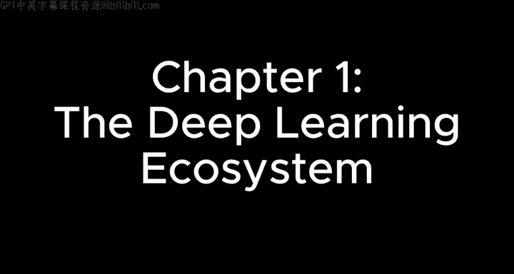

在本节课中，我们将概览当前的深度学习生态系统。了解这个全景图有助于你将后续学到的具体技术（如CUDA）与实际应用场景连接起来，明确学习目标，并知道如何将所学技能付诸实践。

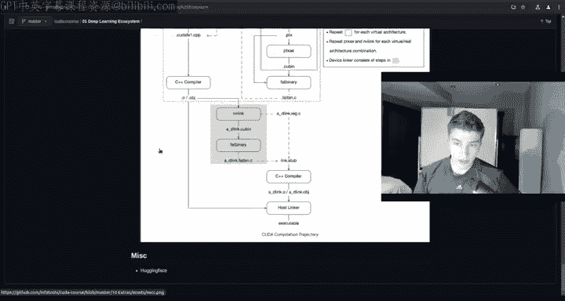

上一节我们介绍了课程的整体方向，本节中我们来看看构成现代深度学习世界的各个关键部分。请注意，生态系统的具体工具和技术会快速演变，以下内容旨在为你提供一个理解框架和起点。

## 研究与应用框架 🧪

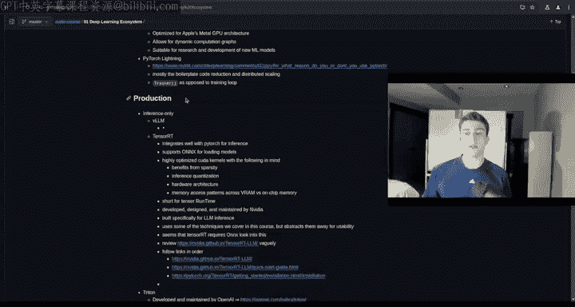

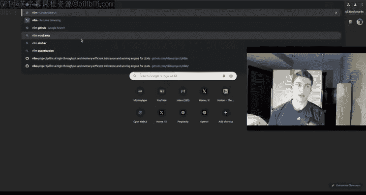

我们从最上层、最易用的框架开始。这些是进行深度学习研究和开发的主要工具。

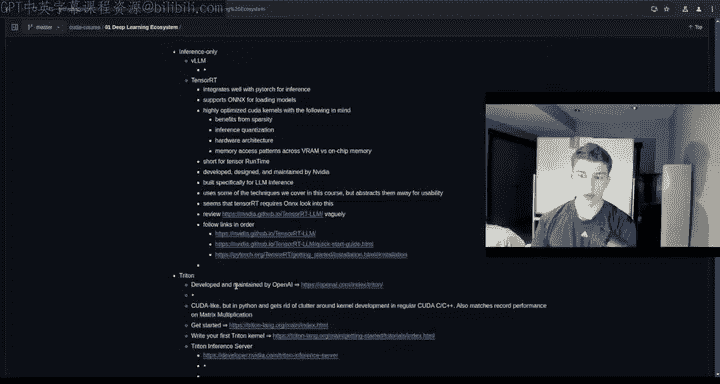

以下是几个核心框架：
*   **PyTorch**： 由Meta（原Facebook）开发，以其动态计算图和Pythonic的接口而广受欢迎，是当前学术研究和许多工业应用的首选。
*   **TensorFlow**： 由Google开发，拥有强大的生产部署工具链和广泛的社区支持。
*   **JAX**： 同样由Google开发，专注于函数式编程和自动微分，在高性能计算和研究中越来越受关注。
*   **MLX**： 由Apple开发，专为Apple Silicon设备优化的开源框架。

此外，还有一些旨在简化开发的工具：
*   **PyTorch Lightning**： 一个基于PyTorch的轻量级封装，旨在减少样板代码。例如，设置`TF32`精度以启用张量核心计算这类优化操作，在PyTorch Lightning中会被自动处理。

## 生产与推理优化 🚀

当模型需要部署到实际环境中提供服务时，就进入了生产阶段。这主要涉及训练和推理两个环节，有些工具同时支持两者，有些则专门优化其一。

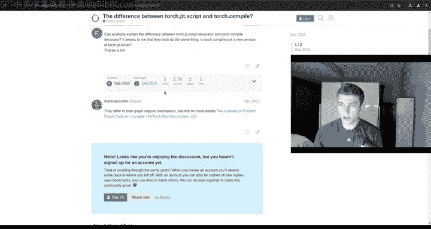

以下是生产与推理环节的关键工具：
*   **vLLM**： 一个专为大型语言模型（LLM）推理设计的高吞吐量、内存高效的服务系统。它在性能基准测试中常与TensorRT-LLM进行比较。
*   **TensorRT / TensorRT-LLM**： NVIDIA推出的高性能深度学习推理SDK和运行时。TensorRT-LLM专门针对LLM推理进行了大量底层GPU硬件优化。
*   **Triton**： 由OpenAI开发，后来开源。它是一个用于编写高效GPU内核的编程语言和编译器。其核心思想源于论文《Triton: An Intermediate Language and Compiler for Tiled Neural Network Computations》中提出的**分块计算**。公式上，这类似于将大矩阵乘法 `C = A @ B` 分解为多个小块的并行计算，以充分利用GPU的并行架构。
*   **`torch.compile`**： PyTorch 2.0引入的特性。只需一行代码 `model = torch.compile(model)`，即可将PyTorch的动态图转换为静态图，并应用内核融合等优化，通常能带来显著的性能提升。
*   **TorchScript**： PyTorch的早期静态图导出工具，用于将模型转换为可在非Python环境中运行的格式。
*   **ONNX Runtime**： 建立在ONNX格式之上的高性能推理引擎。ONNX（Open Neural Network Exchange）是一个开放的模型格式标准，允许你在不同框架（如PyTorch, TensorFlow）间转换和运行模型。导出ONNX模型的代码示例如下：
    ```python
    # PyTorch 导出 ONNX
    torch.onnx.export(model, dummy_input, "model.onnx")
    ```
*   **Detectron2**： 由Meta（原Facebook）开发的计算机视觉库，提供了目标检测、图像分割等任务的先进算法实现。

## 底层硬件编程 ⚙️

这是本课程的核心领域，涉及直接与GPU硬件交互的编程。

以下是主要的底层编程平台：
*   **CUDA**： 全称Compute Unified Device Architecture，是NVIDIA推出的并行计算平台和编程模型。它是我们本课程的重点。
*   **ROCm**： AMD推出的开源软件平台，为AMD GPU提供类似CUDA的生态支持。
*   **OpenCL**： 一个开放的、跨厂商的通用并行计算框架，支持CPU、GPU、DSP等多种硬件。

## 边缘计算与嵌入式系统 📱

边缘计算指的是在数据产生的源头（如物联网设备、自动驾驶汽车）进行本地计算，而非全部上传到云端。

以下是适用于边缘设备的工具：
*   **TensorFlow Lite**： TensorFlow的轻量级版本，专为移动和嵌入式设备设计。
*   **PyTorch Mobile**： PyTorch针对移动端的优化版本。
*   **Core ML**： Apple的机器学习框架，用于在Apple设备（iOS, macOS, watchOS等）上集成模型。

## 易用性与工具链 🛠️

这部分包含了一些能极大提升开发效率的库和服务。

以下是一些提高易用性的工具：
*   **Fast.ai**： 一个旨在让深度学习更易用的库，建立在PyTorch之上，提供了高级API和最佳实践。
*   **Weights & Biases**： 一个实验跟踪工具，可以方便地记录和可视化训练过程中的指标（如损失、准确率），帮助管理机器学习项目。
*   **云服务提供商**： 提供强大的计算资源，是开发生态的重要组成部分。
    *   **AWS**： 提供EC2实例（通用虚拟机）和SageMaker（集成的ML平台，支持从数据标注、训练到部署的全流程）。
    *   **Google Cloud**： 提供Vertex AI和Compute Engine VM。
    *   **Microsoft Azure**： 提供Azure Machine Learning等服务。
    *   **RunPod / Lambda Labs**： 提供按小时租用GPU的服务器，通常比大型云厂商更具价格优势，适合需要特定GPU（如RTX 4090, H100）的用户或初创公司。

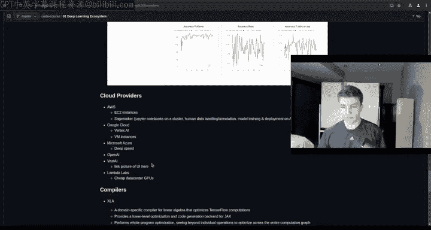

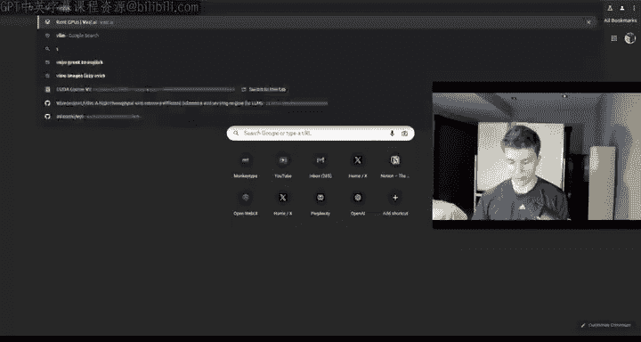

## 编译器基础设施 🏗️

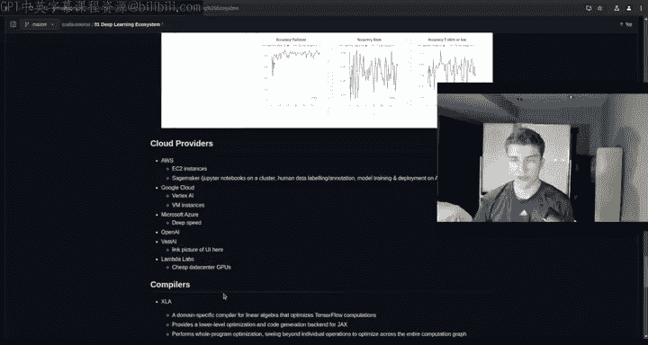

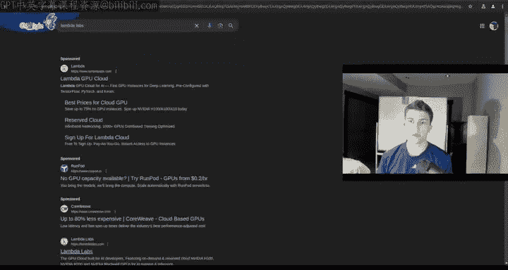

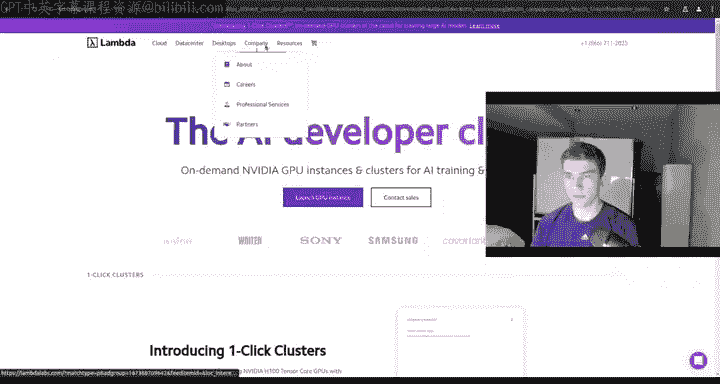

编译器在将高级代码转换为高效机器指令的过程中扮演着关键角色。

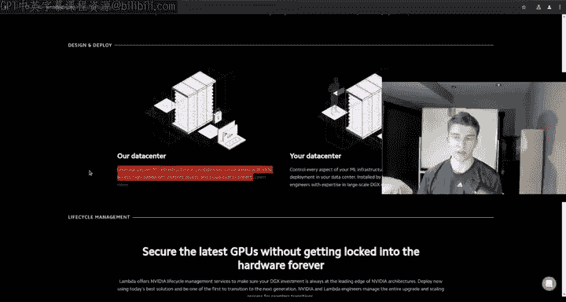

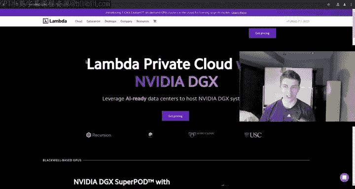

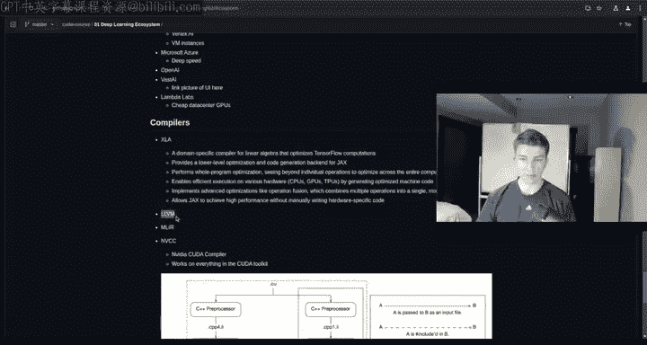

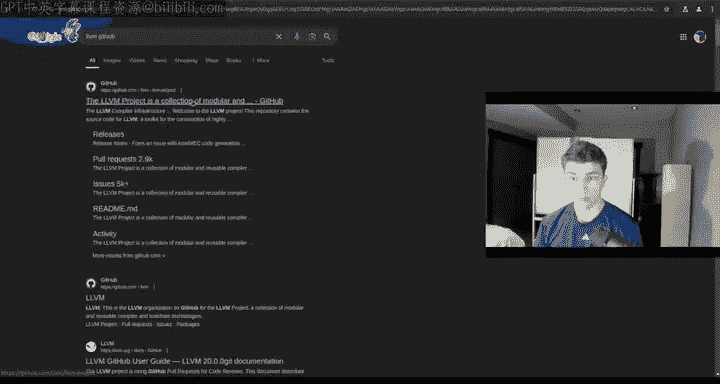

以下是深度学习领域重要的编译器项目：
*   **LLVM**： 一个模块化、可重用的编译器及工具链集合。许多现代编译器（包括CUDA的NVCC）都使用或借鉴了LLVM的技术。
*   **MLIR**： 多级中间表示，是LLVM项目的一部分，旨在解决构建领域特定编译器（如AI编译器）的复杂性。由Chris Lattner（也是Swift和LLVM的创建者）等人推动。
*   **NVCC**： NVIDIA CUDA Compiler，是编译CUDA C/C++代码的工具。
*   **XLA**： 加速线性代数，是TensorFlow和JAX使用的编译器，用于优化线性代数计算。

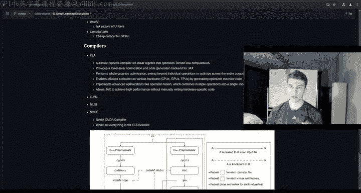

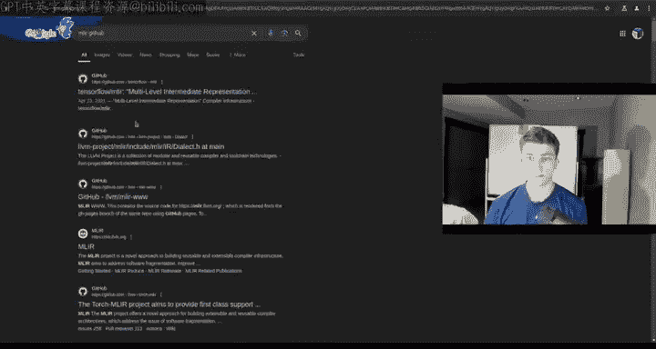

## 模型与数据集社区 🤗

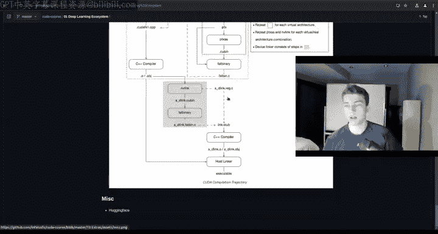

最后，但绝非最不重要的，是模型和数据的集散地。

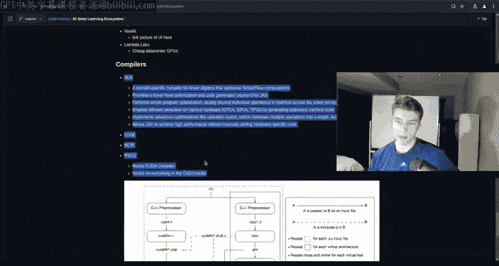

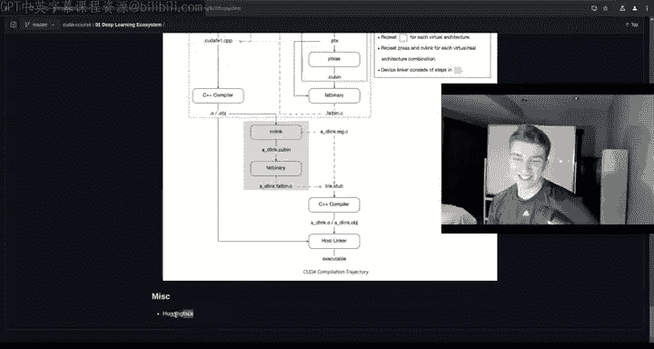

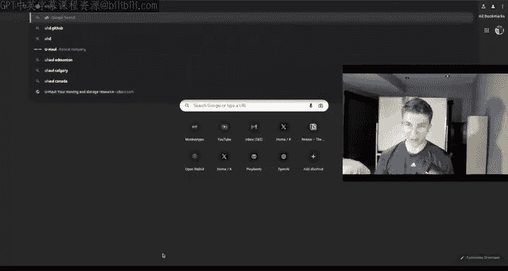

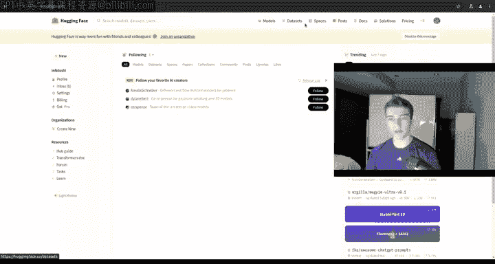

以下是Hugging Face平台的核心组成部分：
*   **Models**： 托管了数以万计的开源预训练模型，涵盖自然语言处理、计算机视觉、音频等多个领域。
*   **Datasets**： 提供了大量公开可用的数据集，用于训练和评估模型。
*   **Spaces**： 允许用户轻松部署和分享机器学习演示应用。

---

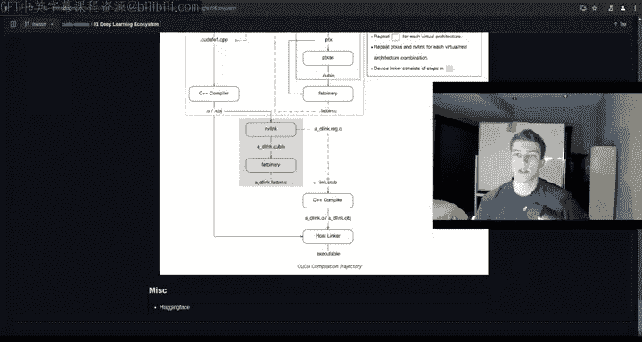

本节课中我们一起学习了深度学习生态系统的全貌，从高层的易用框架（如PyTorch），到生产部署的优化工具（如TensorRT, vLLM），再到本课程的核心——底层CUDA编程。我们还了解了边缘计算、云服务、编译器以及Hugging Face这样的核心社区。理解这个生态系统将帮助你在后续深入学习具体技术时，始终保持清晰的视野和明确的目标。下一节，我们将开始深入CUDA编程的具体细节。