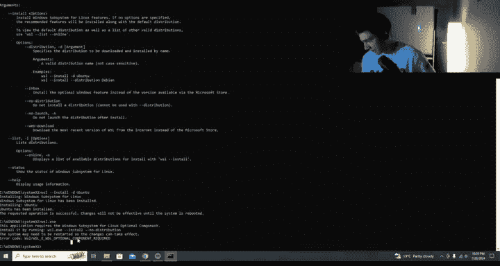
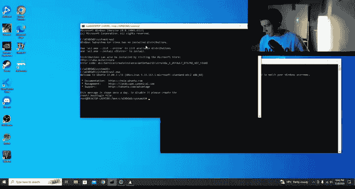
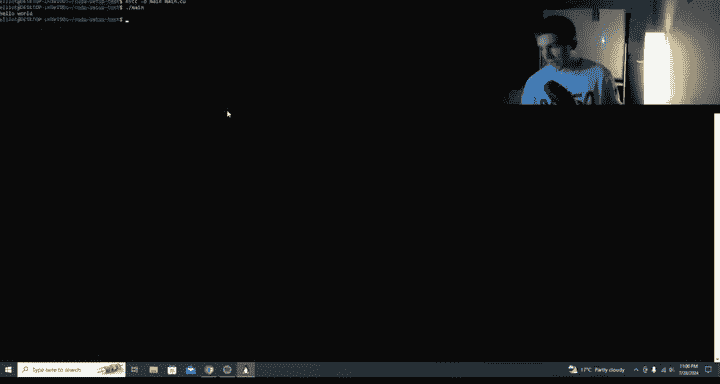
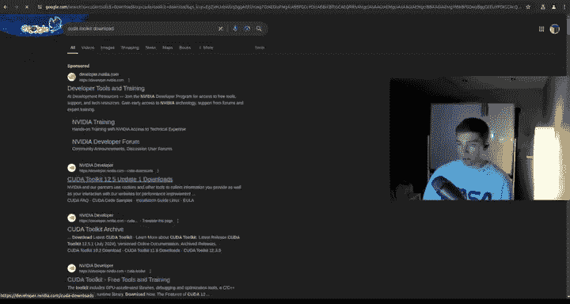
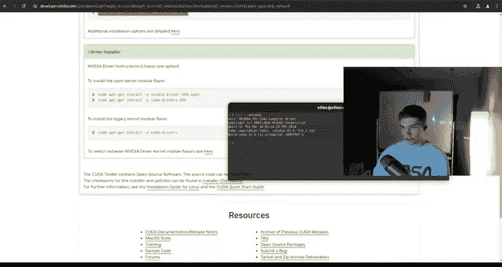

# 2：CUDA环境搭建 🛠️

在本节课中，我们将学习如何在Windows和Ubuntu系统上搭建CUDA编程环境。我们将分步完成系统配置、必要组件的安装以及CUDA工具包的设置，并最终运行一个简单的测试程序来验证环境是否配置成功。

---

## Windows系统配置

上一节我们介绍了课程概述，本节中我们来看看如何在Windows系统上开始配置CUDA环境。

首先，我们需要在Windows上启用几个关键功能。以下是具体步骤：

1.  以管理员身份打开终端。
2.  导航到“启用或关闭Windows功能”设置。
3.  在列表中，找到并勾选“Hyper-V”。
4.  继续找到并勾选“虚拟机平台”。
5.  确保“适用于Linux的Windows子系统”也已勾选启用。





为了确保这些功能正常工作，您可能需要在计算机的BIOS/UEFI设置中启用虚拟化技术。

---

## 安装WSL与Ubuntu

完成Windows功能启用后，下一步是安装WSL（Windows Subsystem for Linux）和一个Linux发行版。

在管理员终端中，输入以下命令来安装WSL：
```bash
wsl --install
```
系统会列出可用的Linux发行版。我们可以选择安装Ubuntu：
```bash
wsl --install -d Ubuntu
```
安装过程可能需要一些时间。安装完成后，系统可能会提示您重启计算机以使更改生效。

重启后，您可能会看到一个命令行界面。按照提示设置您的用户名和密码。成功登录后，您就进入了一个模拟的Linux环境。

---

## 配置Ubuntu环境

现在我们已经进入了WSL下的Ubuntu环境，接下来需要更新系统并安装一些必要的软件包。

首先，运行以下命令来更新软件包列表并升级所有已安装的软件：
```bash
sudo apt update && sudo apt upgrade -y
```
这个过程可能需要一些时间。更新完成后，安装一些后续会用到的工具，如 `wget`、`curl` 和 `git`：
```bash
sudo apt install wget curl git -y
```
接着，安装Python 3和pip，这对于许多开发任务都是必需的：
```bash
sudo apt install python3 python3-pip -y
```

---

## 下载并安装CUDA工具包

系统基础环境准备就绪后，我们就可以安装核心的CUDA工具包了。

打开浏览器，搜索“CUDA Toolkit download”，进入NVIDIA官方网站。选择与您的系统匹配的最新版本（例如12.5或12.6）。对于WSL环境，请选择：
*   操作系统：Linux
*   架构：x86_64
*   发行版：WSL-Ubuntu
*   安装类型：runfile（本地）

页面上会提供下载和安装命令。通常包括两个步骤。首先，使用 `wget` 下载安装文件：
```bash
wget https://developer.download.nvidia.com/compute/cuda/12.5.0/local_installers/cuda_12.5.0_555.42.02_linux.run
```
然后，运行下载的 `.run` 文件进行安装：
```bash
sudo sh cuda_12.5.0_555.42.02_linux.run
```
在安装向导中，您只需选择安装“CUDA Toolkit”即可，驱动部分通常不需要在WSL内单独安装。

---

## 配置环境变量

安装完成后，安装程序会提示需要将CUDA路径添加到环境变量中。我们需要手动配置。

使用文本编辑器（如vim或nano）打开用户主目录下的 `.bashrc` 文件：
```bash
vim ~/.bashrc
```
在文件末尾添加以下几行，请根据您安装的CUDA版本（例如12.5）修改路径：
```bash
export CUDA_HOME=/usr/local/cuda-12.5
export PATH=$CUDA_HOME/bin:$PATH
export LD_LIBRARY_PATH=$CUDA_HOME/lib64:$LD_LIBRARY_PATH
```
保存并退出编辑器。然后，让配置立即生效：
```bash
source ~/.bashrc
```

---

## 验证安装

环境变量配置好后，我们可以验证CUDA是否安装成功。

首先，检查NVIDIA CUDA编译器 `nvcc` 的版本：
```bash
nvcc --version
```
如果成功，会显示版本信息。接着，运行 `nvidia-smi` 命令来查看GPU状态：
```bash
nvidia-smi
```
这个命令会显示显卡驱动版本、CUDA版本以及GPU的详细信息。如果这两个命令都能正常运行，说明CUDA环境基本配置成功。

---



## 编写并运行测试程序

最后，我们通过一个简单的“Hello World”程序来测试整个开发链路是否通畅。

创建一个测试目录并进入：
```bash
mkdir cuda_setup_test && cd cuda_setup_test
```
创建一个名为 `main.cu` 的CUDA源文件：
```bash
vim main.cu
```
在文件中输入以下测试代码：
```cpp
#include <iostream>
#include <cuda_runtime.h>

int main() {
    std::cout << "Hello World from CUDA!" << std::endl;
    return 0;
}
```
使用 `nvcc` 编译器编译这个文件，生成可执行文件：
```bash
nvcc -o main main.cu
```
运行生成的可执行文件：
```bash
./main
```
如果终端成功输出“Hello World from CUDA!”，则证明您的CUDA开发环境已经完全配置成功，可以开始进行CUDA编程了。

---

## Ubuntu原生系统安装（补充说明）



上一节我们详细介绍了在Windows WSL下的安装过程，本节中我们简要看看在原生Ubuntu系统上的安装有何不同。

对于原生Ubuntu系统，步骤更为直接。您同样需要访问NVIDIA CUDA Toolkit下载页面。根据您的Ubuntu版本（如22.04）和架构选择对应的deb（网络）安装包。



页面上会提供类似以下的安装命令，通常包含下载、安装密钥、更新仓库和安装工具包几个步骤：
```bash
wget https://developer.download.nvidia.com/compute/cuda/repos/ubuntu2204/x86_64/cuda-keyring_1.1-1_all.deb
sudo dpkg -i cuda-keyring_1.1-1_all.deb
sudo apt update
sudo apt install cuda-toolkit-12-5
```
安装完成后，同样需要配置环境变量（步骤与WSL中相同），并运行 `nvcc --version` 和 `nvidia-smi` 进行验证。如果遇到问题，重启系统通常是有效的解决方法。

---

本节课中我们一起学习了在Windows（通过WSL）和Ubuntu系统上搭建CUDA编程环境的完整流程。我们从系统基础配置开始，逐步完成了WSL启用、Ubuntu安装、系统更新、CUDA工具包下载安装、环境变量配置，并最终通过编译和运行一个测试程序验证了整个开发环境。现在，您已经拥有了一个可以开始高性能GPU编程的工作环境。