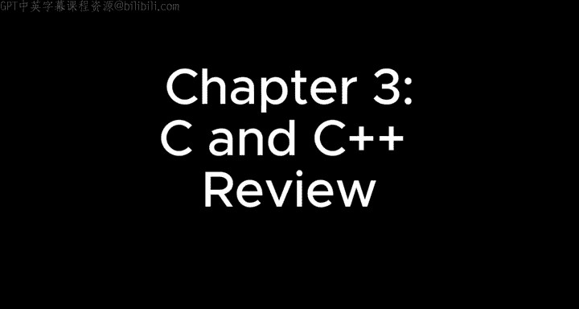
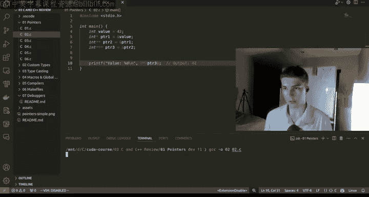

# 3：C/C++ 语言回顾



在本章节中，我们将回顾C和C++编程语言的核心概念，为后续的CUDA编程打下坚实基础。理解这些基础概念，特别是内存管理和指针，对于高效地进行GPU编程至关重要。

## 概述

为了真正理解如何使用CUDA，我们首先需要掌握C和C++。本节课程并非专门教授C/C++，而是提供关键知识点的回顾和资源指引。我们将从指针开始，逐步深入到自定义类型、类型转换、宏、编译器和调试器等主题。

## 学习资源

对于C和C++的初学者，以下是一些推荐的学习资源：

*   **Learn C++**：网站 `learncpp.com` 提供了结构化的C++学习路径。
*   **《C Programming: A Modern Approach》**：这是一本广受好评的、适合初学者的C语言教材。
*   **freeCodeCamp**：该平台提供了大量关于C和C++编程的免费博客和教程。
*   **W3Schools**：提供了易于阅读和理解的C和C++语法介绍及示例。

建议新手逐一学习这些资源中的主题，并完成相关的练习。即使某些内容在本课程中不会直接使用，掌握这些底层知识也能帮助你更好地分析和解决未来可能遇到的复杂问题。

上一节我们介绍了学习资源，本节中我们来看看C/C++中一个核心且强大的概念：指针。

## 指针

指针是存储变量内存地址的变量。理解指针对于管理内存和构建高效的数据结构至关重要。

### 示例 1：基础指针



以下是一个简单的指针示例：

```c
int x = 10; // 变量 x 存储数据 10
int *pointer = &x; // 指针变量 pointer 存储 x 的内存地址
printf("内存地址: %p\n", (void*)pointer); // 打印指针（地址）
printf("存储的值: %d\n", *pointer); // 解引用指针，获取地址处的值（10）
```
*   `&` 运算符用于获取变量的地址。
*   `*` 在声明中表示指针类型，在表达式中表示解引用操作（获取指针指向地址的值）。

### 示例 2：多级指针

指针可以指向另一个指针，形成多级间接引用。

```c
int value = 42;
int *pointer1 = &value; // pointer1 指向 value
int **pointer2 = &pointer1; // pointer2 指向 pointer1
int ***pointer3 = &pointer2; // pointer3 指向 pointer2
printf("值: %d\n", ***pointer3); // 三级解引用，最终得到 42
```
每一级指针都存储着下一级指针（或最终数据）的地址。解引用操作（`*`）用于逐级向下访问。

### 示例 3：Void 指针

Void 指针 (`void*`) 是一种通用指针类型，可以指向任何数据类型的数据，但在使用前必须进行类型转换。

```c
int num = 10;
float f_num = 3.14;
void *void_ptr;

void_ptr = &num; // void_ptr 指向整数
printf("整数值: %d\n", *((int*)void_ptr)); // 转换为 int* 后解引用

void_ptr = &f_num; // void_ptr 现在指向浮点数
printf("浮点数值: %f\n", *((float*)void_ptr)); // 转换为 float* 后解引用
```
`malloc` 函数就返回一个 `void*` 指针，调用者需要将其转换为具体的指针类型。

### 示例 4：NULL 指针

NULL 指针不指向任何有效的内存地址。检查指针是否为 NULL 可以避免程序崩溃（如段错误）。

```c
int *ptr = NULL; // 初始化为 NULL

if (ptr == NULL) {
    printf("指针为 NULL，无法解引用。\n");
}

ptr = (int*)malloc(sizeof(int)); // 动态分配内存
if (ptr != NULL) {
    *ptr = 42; // 安全地使用指针
    printf("值: %d\n", *ptr);
    free(ptr); // 释放内存
    ptr = NULL; // 再次设为 NULL，避免“释放后使用”错误
}
```

### 示例 5：指针与数组

数组名在大多数情况下可以视为指向其第一个元素的指针。

```c
int array[] = {12, 23, 34, 45, 56};
int *ptr = array; // ptr 指向数组首元素

printf("第一个元素: %d\n", *ptr); // 解引用得到 12

for (int i = 0; i < 5; i++) {
    printf("值[%d]: %d, 地址: %p\n", i, *ptr, (void*)ptr);
    ptr++; // 指针算术：移动到下一个整数（地址增加 4 字节）
}
```
指针递增 (`ptr++`) 会根据指针类型的大小移动。对于 `int*`，每次增加 4 字节（假设 `int` 为 32 位）。

### 示例 6：指针数组（模拟矩阵）

可以使用指针数组来模拟二维数据结构。

```c
int array1[] = {1, 2, 3, 4};
int array2[] = {5, 6, 7, 8};
int *matrix[] = {array1, array2}; // matrix 是指针数组

for (int i = 0; i < 2; i++) {
    for (int j = 0; j < 4; j++) {
        printf("%d ", *(matrix[i] + j)); // 等价于 matrix[i][j]
    }
    printf("\n");
}
```
`matrix` 存储了两个一维数组的起始地址，通过它可以访问所有元素。

上一节我们深入探讨了指针，本节中我们将了解如何创建和使用自定义数据类型。

## 自定义类型

C语言允许使用 `typedef` 关键字创建自定义的数据类型别名，这能提高代码的可读性和可维护性。

### 示例：自定义 `size_t` 和结构体

标准库定义了 `size_t` 类型，通常用于表示对象大小或数组索引。它是一个无符号长整型，确保能容纳大尺寸对象。

```c
#include <stdio.h>
#include <stddef.h> // 包含 size_t 的定义

int main() {
    int array[] = {10, 20, 30, 40, 50};
    size_t array_length = sizeof(array) / sizeof(array[0]); // 计算数组长度
    printf("数组长度: %zu\n", array_length); // 使用 %zu 格式化 size_t
    printf("size_t 的大小: %zu 字节\n", sizeof(size_t));
    return 0;
}
```
我们也可以定义自己的结构体类型：

```c
typedef struct {
    float x;
    float y;
} Point; // 定义了一个名为 Point 的新类型

int main() {
    Point p = {3.5, 2.8};
    printf("点坐标: (%.1f, %.1f)\n", p.x, p.y);
    printf("Point 类型大小: %zu 字节\n", sizeof(Point)); // 通常是 8 字节 (两个 float)
    return 0;
}
```

上一节我们创建了自定义类型，本节中我们来看看如何在不同类型之间进行转换。

## 类型转换

类型转换允许你将一种数据类型的值转换为另一种类型。在C++中，有几种不同的类型转换运算符，`static_cast` 是最常用且最安全的一种。

```cpp
#include <iostream>
int main() {
    float f = 69.69f;
    int i = static_cast<int>(f); // 将 float 转换为 int，小数部分被截断
    std::cout << "浮点数: " << f << std::endl;
    std::cout << "转换为整数: " << i << std::endl; // 输出 69

    int num = 69;
    char c = static_cast<char>(num); // 将 int 转换为 char (ASCII 码)
    std::cout << "整数: " << num << std::endl;
    std::cout << "转换为字符: " << c << std::endl; // 输出 'E' (ASCII 69)
    return 0;
}
```

上一节我们进行了类型转换，本节中我们来看看如何使用宏和全局变量来简化代码。

## 宏与全局变量

宏 (`#define`) 是预处理器指令，用于定义常量或简单的函数式代码片段，在编译前进行文本替换。

```c
#include <stdio.h>

#define PI 3.14159
#define AREA(r) (PI * (r) * (r)) // 带参数的宏，计算圆面积

#ifndef RADIUS // 如果 RADIUS 未定义，则定义它
    #define RADIUS 7
#endif

int main() {
    int radius = RADIUS;
    printf("半径为 %d 的圆面积: %.2f\n", radius, AREA(radius));
    return 0;
}
```
宏有助于减少魔法数字，并使全局常量的修改变得容易。但要注意，带参数的宏可能因运算符优先级导致意外结果，所以参数通常用括号括起来。

上一节我们使用了宏，本节中我们简要了解一下代码是如何从文本变成可执行文件的。

## 编译器简介

编译器（如 GCC 和 G++）负责将人类可读的C/C++源代码翻译成机器可执行的二进制指令。这个过程大致包括：预处理（处理宏等）、编译（生成汇编代码）、汇编（生成目标文件）、链接（合并库文件和目标文件，生成最终可执行文件）。

理解编译过程有助于调试，但编写功能代码通常不需要深入了解其内部数学原理。我们主要通过命令行调用编译器。

上一节我们提到了编译器，本节中我们来看看如何利用 `make` 工具自动化编译过程。

## Makefile

Makefile 是一个包含构建规则的文件，用于自动化编译过程。它定义了目标、依赖项和生成命令。

一个简单的 Makefile 示例：

```makefile
CC = gcc
CFLAGS = -Wall
TARGET = myprogram
SRC = main.c utils.c

$(TARGET): $(SRC)
	$(CC) $(CFLAGS) -o $(TARGET) $(SRC)

clean:
	rm -f $(TARGET)
```
*   `CC` 和 `CFLAGS` 是变量。
*   `$(TARGET): $(SRC)` 表示目标 `myprogram` 依赖于 `main.c` 和 `utils.c`。
*   下一行缩进的是生成目标的命令。
*   `clean` 是一个伪目标（通常用 `.PHONY: clean` 声明），用于清理生成的文件。

使用命令 `make` 会默认构建第一个目标，`make clean` 会执行清理操作。Makefile 能极大提升多文件项目的管理效率。

上一节我们自动化了编译，本节中我们介绍最后一个重要工具：调试器。

## 调试器 (GDB)

调试器（如 GDB）允许你逐步执行程序、检查变量状态、设置断点，是比插入大量 `printf` 语句更强大的调试工具。

一些常用的 GDB 命令包括：

*   `gdb ./program`：启动 GDB 并加载可执行文件。
*   `break main` 或 `b main`：在 `main` 函数开头设置断点。
*   `run` 或 `r`：开始运行程序。
*   `next` 或 `n`：执行下一行代码（不进入函数内部）。
*   `step` 或 `s`：执行下一行代码（会进入函数内部）。
*   `print variable` 或 `p variable`：打印变量的值。
*   `continue` 或 `c`：继续运行直到下一个断点或程序结束。
*   `backtrace` 或 `bt`：显示函数调用栈。
*   `quit` 或 `q`：退出 GDB。

掌握 GDB 的基本用法能显著提高定位和修复代码逻辑错误或内存问题的效率。

## 总结

本节课中我们一起回顾了CUDA编程所需的C/C++核心知识。我们从指针的基础概念和多级应用开始，学习了如何管理内存地址。接着，我们探讨了自定义数据类型的创建，以及如何进行安全的类型转换。我们还了解了如何使用宏来定义常量和小型代码块，并简要介绍了编译器的工作流程。最后，我们掌握了使用 Makefile 自动化编译过程以及使用 GDB 调试器进行代码调试的基本方法。这些概念和工具是进行高效、可靠的CUDA编程的重要基石。