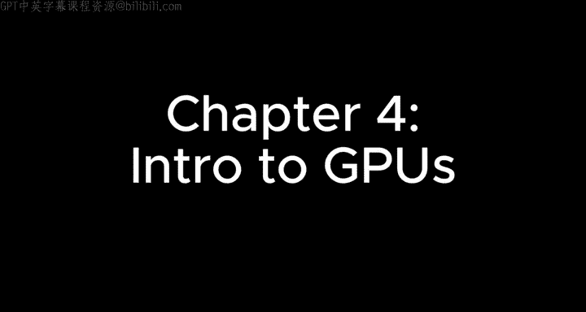
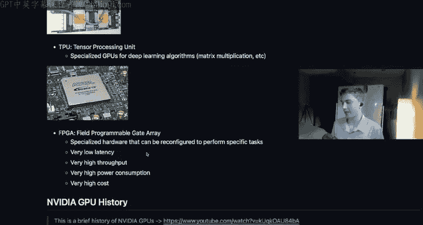
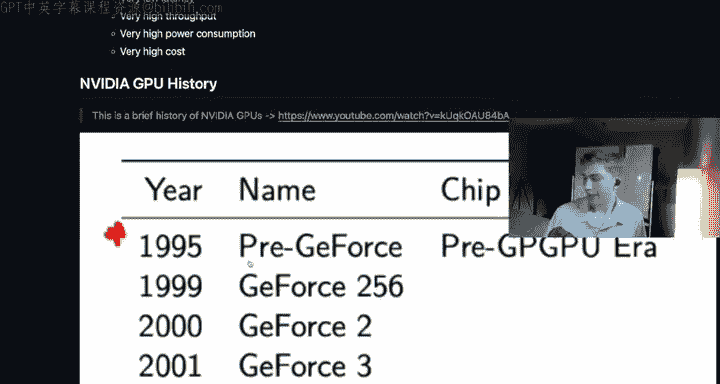
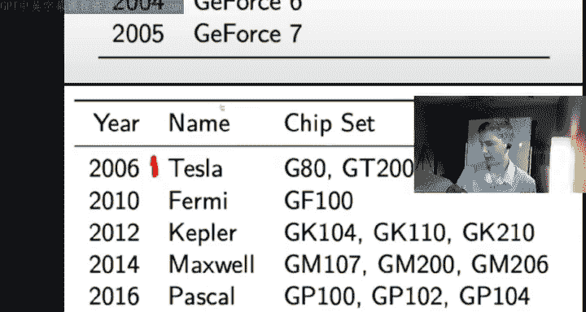
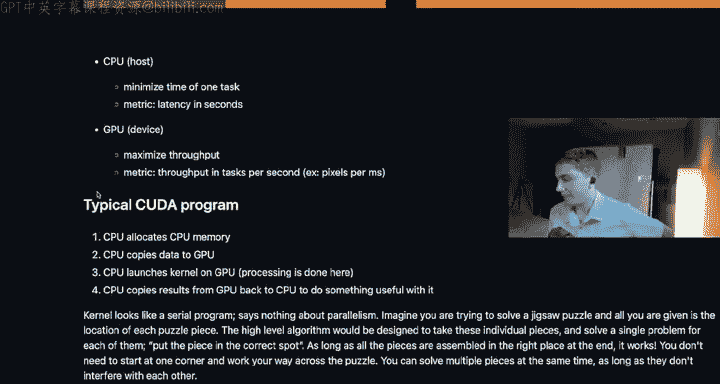

# 4：GPU硬件入门 🚀

在本章中，我们将了解不同类型的计算硬件，特别是CPU与GPU的区别，以及GPU为何在并行计算任务中如此高效。我们还将介绍一些CUDA编程的基本术语和概念。

---

## 硬件类型概述

首先，我们来比较几种主要的计算硬件：CPU、GPU、TPU和FPGA。

以下是它们的主要特点：

*   **CPU (中央处理器)**
    *   **用途**：通用计算。
    *   **核心**：数量少，但每个核心的**时钟频率**很高。
    *   **片上内存**：缓存容量大，用于预加载数据以减少访问主内存的延迟。
    *   **特点**：**延迟低**，旨在以最快速度完成单个任务并返回结果。
    *   **吞吐量**：相对较低，每秒能处理的操作数（OPS）有限，尤其是在处理简单数学运算（如矩阵乘法）时。

*   **GPU (图形处理器)**
    *   **用途**：专用并行计算。
    *   **核心**：数量极多，但每个核心的时钟频率较低。
    *   **片上内存**：缓存较小，但拥有专用的**显存 (VRAM)**，访问带宽极高（可达每秒数百GB）。
    *   **特点**：**延迟较高**，但**吞吐量巨大**，专为同时处理海量简单任务而优化。
    *   **速度优势**：核心数量远超CPU，因此在并行任务上速度极快。例如，若有12000个任务，6000个GPU核心只需2轮操作，而4个CPU核心则需要3000轮。

*   **TPU (张量处理器)**
    *   **用途**：专为现代深度学习设计，高效执行张量运算（线性代数、矩阵乘法）。
    *   **特点**：速度极快，但价格昂贵且高度专业化，通常不是消费级硬件。

*   **FPGA (现场可编程门阵列)**
    *   **用途**：可通过编程定制硬件逻辑，实现特定任务的极致优化。
    *   **特点**：提供精细的控制，**延迟极低，吞吐量极高**，但价格昂贵，具备模块化特性。

---

## GPU发展简史

上一节我们介绍了各类硬件，本节中我们来看看GPU的发展历程。了解其演进有助于理解当前架构的设计思路。

GPU性能的提升主要依赖于核心数量的不断增加以及架构的持续优化。从早期的GeForce系列，到Tesla、Fermi、Kepler架构，再到后来的Maxwell、Pascal，性能逐步提升。从Volta架构开始，GPU在深度学习领域的计算能力（如浮点运算性能）实现了飞跃。随后的Turing、Ampere（当前主流架构，如RTX 30/40系列）、Hopper（如H100）以及最新的Blackwell架构，性能更是达到了新的高度。

例如，Volta架构已能提供约6 TFLOPs的双精度计算能力，而现代的Ampere架构显卡在CUDA核心上进行单精度矩阵乘法（通过cuBLAS库）时，可达到约20 TFLOPs以上的性能。

---

## GPU为何适合深度学习？

我们已经看到GPU拥有海量核心，但为何这种架构特别适合深度学习等任务呢？关键在于其设计哲学。

CPU的设计目标是快速完成复杂、串行的任务。其芯片上大部分面积被大型控制单元和缓存占据，留给计算核心的空间有限。

相比之下，GPU的设计目标是高吞吐量。其芯片上大部分面积是大量简单的计算核心，以及为这些核心服务的高速缓存和显存控制器。控制单元相对简单小巧。

这就像一个拼图游戏：
*   **CPU** 如同几个高手，一次只能拼几块，但能处理复杂的拼图策略（复杂指令）。
*   **GPU** 如同成千上万的工人，每人一次只拼简单的一小块（简单指令），但可以同时进行，最终快速完成整幅拼图。

深度学习中的许多运算（如矩阵乘法和卷积）正是这种可以高度并行化的“拼图”任务，因此GPU能发挥巨大优势。

---

## CUDA编程核心概念

了解了硬件背景后，我们现在进入CUDA编程的核心概念。这些术语将贯穿整个学习过程。

以下是CUDA编程中的基本术语：

*   **主机 (Host) 与设备 (Device)**
    *   **主机 (Host)**：指**CPU**及其内存。负责运行常规的C/C++函数。
    *   **设备 (Device)**：指**GPU**及其显存。负责运行并行计算函数（内核）。
    *   性能关注点：主机关注**延迟**（完成任务的速度），设备关注**吞吐量**（单位时间完成的任务量，如每秒渲染的像素数）。

*   **内核 (Kernel)**
    *   这是在GPU上执行的**并行函数**。在代码中，通过 `__global__` 关键字来定义。
    *   一个内核看起来像一个串行程序，但它会被成千上万个线程同时执行。
    *   **注意**：此处的“内核”不同于操作系统内核、卷积核或玉米粒，特指GPU上的并行函数。

*   **线程层次结构：Thread, Block, Grid**
    *   这是CUDA并行编程模型的核心，我们将在下一章详细展开。简单来说：
        *   **线程 (Thread)**：最基本的执行单元。
        *   **线程块 (Block)**：一组线程的集合，块内的线程可以协作。
        *   **网格 (Grid)**：由多个线程块组成。
    *   当启动一个内核时，你需要指定执行这个内核的**网格**和**线程块**的维度。

*   **通用矩阵乘法 (GEMM)**
    *   这是深度学习等领域的核心运算。其公式比简单的矩阵乘法更通用：
        `C = α * (A * B) + β * C`
        其中 `α` 和 `β` 是标量，`A`, `B`, `C` 是矩阵。
    *   **SGEMM** 特指单精度浮点数 (`float`) 的GEMM运算。此外还有半精度 (`FP16`)、双精度 (`FP64`) 等版本。

---

## 典型的CUDA程序流程

最后，我们来看一个典型的CUDA程序是如何工作的。这将把前面所有的概念串联起来。

一个典型的CUDA程序遵循以下流程：
1.  **主机端内存分配**：在CPU内存中使用 `malloc` 或 `new` 分配空间。
2.  **数据拷贝至设备**：将数据从主机内存复制到GPU显存。
3.  **启动内核**：在GPU上调用内核函数，指定网格和线程块的配置，执行并行计算。
4.  **结果拷贝回主机**：将计算结果从GPU显存复制回CPU内存。
5.  **后续处理**：在CPU上对结果进行进一步处理或输出。

这个流程可以反复迭代，形成复杂的工作流：CPU准备数据 -> GPU高速计算 -> CPU处理结果。

---

## 本章总结

在本节课中，我们一起学习了：
1.  **硬件对比**：了解了CPU（低延迟、通用）、GPU（高吞吐量、并行）、TPU（专用张量计算）和FPGA（可编程硬件）的特点。
2.  **GPU优势**：明白了GPU通过海量简单核心实现高并行度，特别适合矩阵运算等任务，因此成为深度学习的首选硬件。
3.  **核心术语**：掌握了CUDA编程的基础概念，包括**主机/设备**、**内核**、**线程/块/网格**层次结构以及**GEMM**运算。
4.  **编程流程**：熟悉了典型的CUDA程序从数据准备、传输、并行计算到结果回收的基本步骤。

接下来，我们将进入实践环节，开始编写第一个简单的CUDA内核（例如向量加法），亲身体验这些概念是如何在代码中实现的。