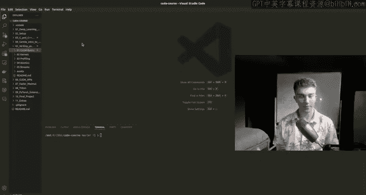
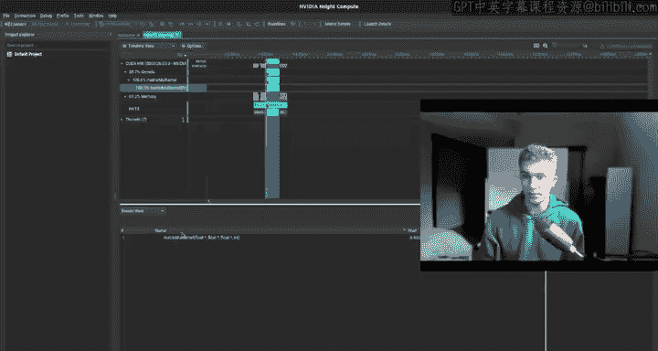
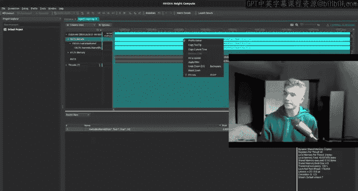
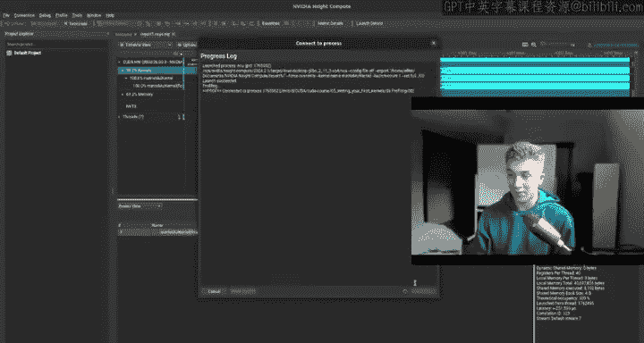
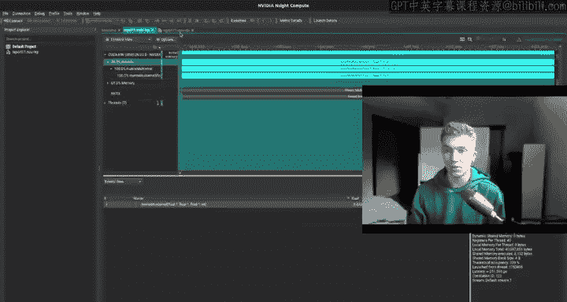
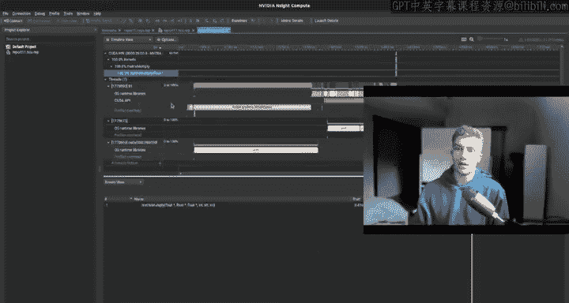
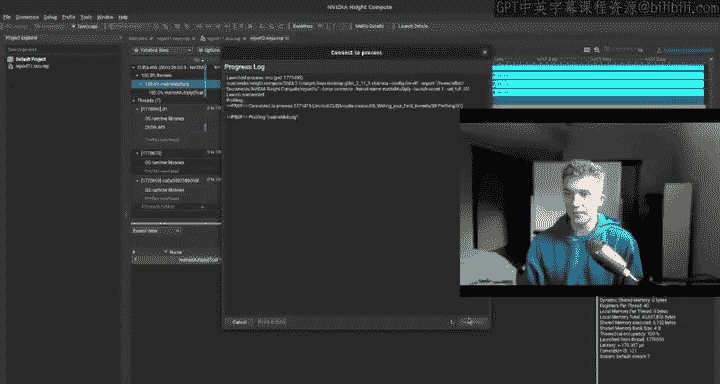
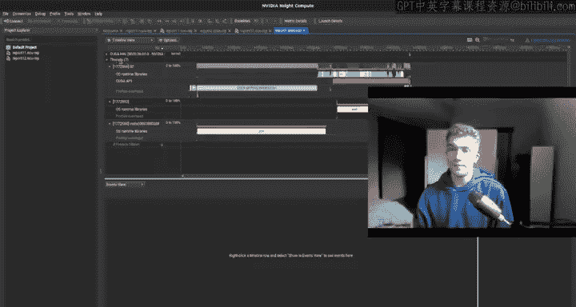
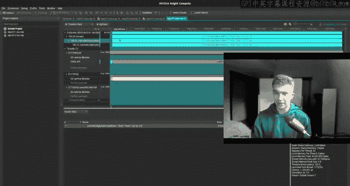
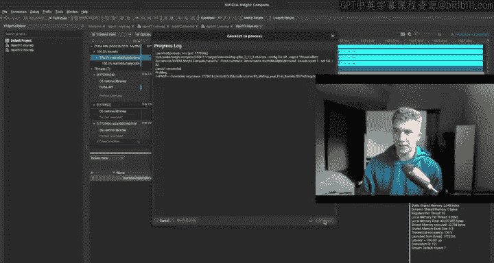

# 5：编写你的第一个内核 🚀


在本节课中，我们将学习CUDA编程的核心概念，包括如何编写和启动你的第一个CUDA内核。我们将从了解GPU硬件规格开始，逐步深入到CUDA的软件抽象层次、内存管理、内核编写以及性能分析工具的使用。




## 概述：从硬件规格到软件抽象

上一节我们介绍了GPU的基本概念。本节中，我们来看看如何获取和理解你GPU的具体规格，这是编写高效CUDA代码的第一步。

你可以通过查阅维基百科或使用CUDA工具来获取GPU的详细信息。例如，Pascal架构用于GTX 1080/1070，Ampere架构用于RTX 30系列，而最新的Blackwell架构则代表了最先进的技术。了解你的GPU的计算能力（Compute Capability，如8.6）至关重要，因为它决定了支持哪些CUDA功能。

在终端中，你可以通过编译并运行CUDA样例中的`deviceQuery`程序来获取本地GPU的详细信息。

```bash
cd /usr/local/cuda/samples/1_Utilities/deviceQuery
sudo make
./deviceQuery
```

输出会显示GPU型号、驱动版本、计算能力等关键信息。计算能力是一个核心指标，你可以在CUDA官方文档的“Compute Capability”章节查询特定功能（如线程块簇）所需的最低版本。

## CUDA基础：运行时与内存模型

了解了硬件后，我们来看看CUDA编程的基本运行时流程。

典型的CUDA程序流程如下：
1.  在主机（CPU）内存中定义和初始化数据。
2.  在设备（GPU）内存中分配空间。
3.  将数据从主机内存复制到设备内存。
4.  在GPU上启动内核（Kernel）执行计算。
5.  将结果从设备内存复制回主机内存。
6.  释放设备内存。

以下是相关的命名约定和关键函数：

*   **变量命名**：通常使用`h_`前缀表示主机变量，`d_`前缀表示设备变量。例如：`h_matrixA`, `d_matrixA`。
*   **函数限定符**：
    *   `__global__`：定义内核函数，由CPU调用，在GPU上执行。
    *   `__device__`：定义设备函数，由内核或其他设备函数调用。
    *   `__host__`：定义主机函数（通常省略）。
*   **设备内存管理**：
    *   `cudaMalloc(&d_ptr, size)`：在GPU上分配内存。
    *   `cudaMemcpy(dst, src, size, kind)`：在主机与设备间复制数据。`kind`可以是`cudaMemcpyHostToDevice`、`cudaMemcpyDeviceToHost`或`cudaMemcpyDeviceToDevice`。
    *   `cudaFree(d_ptr)`：释放GPU内存。

CUDA代码通过NVCC编译器编译。主机代码被编译为CPU指令，而设备代码（内核）则被编译为PTX（并行线程执行）指令，最终在GPU上转换为特定硬件的着色器汇编指令。

## CUDA层次结构：网格、块与线程 🧱

CUDA使用一个分层的软件抽象来实现大规模并行。理解这个层次结构是编写内核的关键。

你可以将CUDA的执行模型想象成一个三维的网格（Grid）。网格中包含许多线程块（Block），每个线程块又包含许多线程（Thread）。线程是执行计算的基本单位。

这个层次结构通过以下内置变量在核函数中访问：
*   `gridDim`：网格的维度（每个维度上有多少个块）。
*   `blockIdx`：当前线程块在网格中的索引（坐标）。
*   `blockDim`：线程块的维度（每个维度上有多少个线程）。
*   `threadIdx`：当前线程在线程块中的索引（坐标）。

一个线程在整个网格中的全局ID可以通过这些变量计算得出。例如，在一维情况下：
```cpp
int global_id = blockIdx.x * blockDim.x + threadIdx.x;
```

线程被分组为**线程束（Warp）**，通常是32个线程一组。线程束是GPU调度和执行的基本单位。一个块内的线程可以通过**共享内存（Shared Memory/L1缓存）** 进行快速通信，其带宽远高于全局内存（GPU显存）。整个网格中的所有线程都可以访问**全局内存**。

## 实战：向量加法内核 ✨

现在，我们将理论付诸实践，编写一个简单的向量加法内核，并比较CPU和GPU的实现。

CPU版本的向量加法使用循环顺序处理每个元素：
```cpp
for (int i = 0; i < n; i++) {
    c[i] = a[i] + b[i];
}
```

GPU内核版本则“展开”这个循环，让每个线程处理一个独立的加法操作：
```cpp
__global__ void vectorAdd(const float* a, const float* b, float* c, int n) {
    int i = blockIdx.x * blockDim.x + threadIdx.x;
    if (i < n) {
        c[i] = a[i] + b[i];
    }
}
```
内核启动配置计算了所需的块数：
```cpp
int blockSize = 256;
int numBlocks = (n + blockSize - 1) / blockSize; // 确保覆盖所有元素
vectorAdd<<<numBlocks, blockSize>>>(d_a, d_b, d_c, n);
```
`if (i < n)` 是必要的边界检查，因为线程总数可能略大于向量长度。

在性能对比中，即使是这个简单的内核，GPU也能带来上百倍的加速。需要注意的是，使用三维索引的内核可能会因为更复杂的索引计算而比一维内核稍慢，因此应仅在算法需要时使用多维索引。

## 深入：矩阵乘法内核 ⚡





矩阵乘法是许多科学计算和机器学习应用的核心。我们首先实现一个基础（朴素）版本。





一个 M x K 的矩阵 A 与一个 K x N 的矩阵 B 相乘，得到一个 M x N 的矩阵 C。CPU的朴素实现使用三层嵌套循环：
```cpp
for (int i = 0; i < M; i++) {
    for (int j = 0; j < N; j++) {
        float sum = 0;
        for (int k = 0; k < K; k++) {
            sum += a[i * K + k] * b[k * N + j];
        }
        c[i * N + j] = sum;
    }
}
```











对应的GPU内核让每个线程计算输出矩阵C中的一个元素：
```cpp
__global__ void matrixMultiplyNaive(float* a, float* b, float* c, int M, int N, int K) {
    int row = blockIdx.y * blockDim.y + threadIdx.y;
    int col = blockIdx.x * blockDim.x + threadIdx.x;
    if (row < M && col < N) {
        float sum = 0.0f;
        for (int k = 0; k < K; k++) {
            sum += a[row * K + k] * b[k * N + col];
        }
        c[row * N + col] = sum;
    }
}
```
内核启动时，我们使用二维的网格和块来映射输出矩阵的行和列：
```cpp
dim3 threadsPerBlock(16, 16);
dim3 numBlocks((N + threadsPerBlock.x - 1) / threadsPerBlock.x,
               (M + threadsPerBlock.y - 1) / threadsPerBlock.y);
matrixMultiplyNaive<<<numBlocks, threadsPerBlock>>>(d_a, d_b, d_c, M, N, K);
```
这个朴素内核虽然直观，但效率不高。后续优化的关键思想是**分块（Tiling）**，即将矩阵分成小块，利用共享内存来减少对全局内存的访问，从而极大提升性能。

## 性能剖析：使用Nsight Compute 🔍

编写内核后，我们需要工具来分析和优化其性能。NVIDIA Nsight Compute 是一个强大的GPU内核性能分析器。

首先，我们可以使用NVTX（NVIDIA Tools Extension）在代码中标记范围，以便在时间线上直观看到不同阶段（如内存分配、拷贝、内核执行）的耗时。
```cpp
#include <nvtx3/nvtx3.hpp>
...
nvtxRangePushA("Memory Allocation");
// ... 内存操作
nvtxRangePop(); // Memory Allocation
nvtxRangePushA("Kernel Execution");
myKernel<<<...>>>(...);
cudaDeviceSynchronize();
nvtxRangePop(); // Kernel Execution
```
使用`nsys`命令行工具生成性能分析报告：
```bash
nsys profile -o my_report ./my_cuda_program
```
然后使用Nsight Compute GUI打开生成的`.nsys-rep`文件。在“CUDA HW”视图中，你可以看到内核和内存拷贝的时间线。点击某个内核，选择“Profile Kernel”并进行“PM Sampling”（性能指标采样），可以获取详细的硬件性能指标，如：
*   **计算吞吐量**与**内存吞吐量**的百分比（接近100%为佳）。
*   **内存带宽利用率**（GB/s）。
*   **L1/L2缓存命中率**。

通过比较朴素矩阵乘法和优化后的分块矩阵乘法，可以观察到后者具有显著更高的内存吞吐量，这是性能提升的直接体现。

## 高级概念：原子操作与流 ⚛️

最后，我们介绍两个高级概念：原子操作和CUDA流。

**原子操作**确保对同一内存地址的读-修改-写操作作为一个不可分割的整体执行，防止多线程同时访问导致的数据竞争（Race Condition）。例如，多个线程同时递增一个计数器时，使用原子操作能保证结果的正确性。
```cpp
// 非原子操作，结果可能小于实际线程数
__global__ void nonAtomicIncrement(int* counter) {
    int old_val = *counter;
    *counter = old_val + 1;
}
// 原子操作，结果准确
__global__ void atomicIncrement(int* counter) {
    atomicAdd(counter, 1); // 原子加
}
```
原子操作会序列化对内存的访问，可能降低性能，但保证了正确性。

**CUDA流**用于实现操作间的并发，隐藏数据传输延迟。默认情况下，CUDA操作在默认流（0流）中顺序执行。创建多个流可以实现：
*   **并发数据传输与内核执行**：当一个流在执行内核时，另一个流可以同时进行数据拷贝。
*   **并发内核执行**：多个内核在不同流中可能同时执行（如果硬件支持）。
```cpp
cudaStream_t stream1, stream2;
cudaStreamCreate(&stream1);
cudaStreamCreate(&stream2);
// 在流1中异步拷贝数据A并执行内核A
cudaMemcpyAsync(d_a, h_a, size, cudaMemcpyHostToDevice, stream1);
kernelA<<<..., stream1>>>(d_a, ...);
// 在流2中异步拷贝数据B并执行内核B（可能与流1的操作并发）
cudaMemcpyAsync(d_b, h_b, size, cudaMemcpyHostToDevice, stream2);
kernelB<<<..., stream2>>>(d_b, ...);
// 等待所有流完成
cudaStreamSynchronize(stream1);
cudaStreamSynchronize(stream2);
cudaStreamDestroy(stream1);
cudaStreamDestroy(stream2);
```
结合**事件（Event）** 和**回调（Callback）**，可以更精细地控制流间的依赖关系和执行时机，这对于构建高效、复杂的数据处理流水线至关重要。

## 总结

本节课中我们一起学习了CUDA编程的核心实践。我们从查询和理解GPU硬件规格出发，深入探讨了CUDA的网格-块-线程层次结构。我们动手编写了第一个向量加法和矩阵乘法内核，并学习了如何使用Nsight Compute工具来剖析内核性能。最后，我们介绍了用于保证数据安全访问的原子操作和用于提升并发性能的CUDA流。掌握这些基础知识，是进行高性能GPU编程和后续更深入优化的关键。