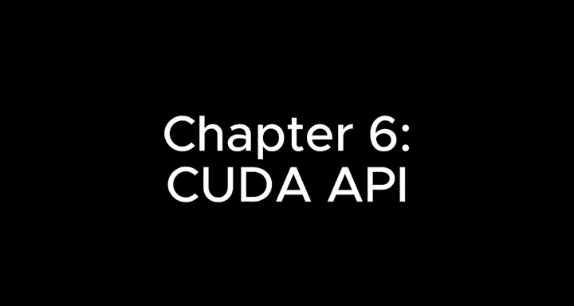
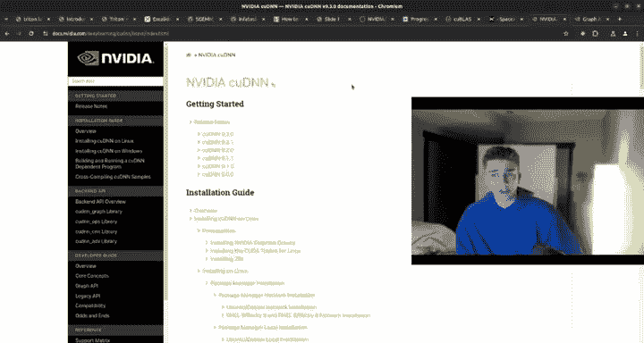
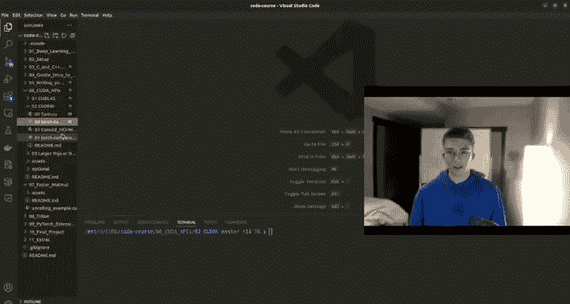
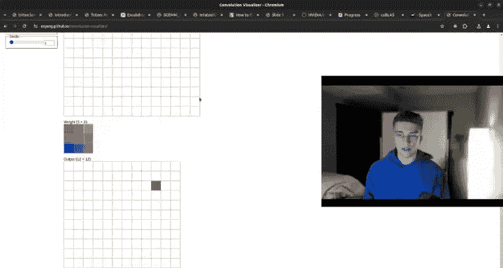
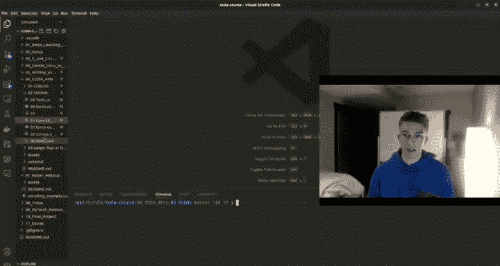

# 6：CUDA API 🚀



在本章中，我们将学习CUDA API的核心组成部分，特别是cuBLAS和cuDNN库。这些库提供了高度优化的函数，是GPU加速计算，尤其是深度学习领域的关键。我们将了解它们的基本概念、使用方法，并通过代码示例进行对比。

---

## 概述 📋

上一章我们深入探讨了CUDA的内存模型和内核执行。本节中，我们将转向更高级别的编程接口——CUDA API。这些API封装了复杂的底层操作，使我们能够轻松调用经过极致优化的GPU计算例程，从而显著提升应用程序性能。

我们将重点介绍两个核心库：
1.  **cuBLAS**：用于执行基础线性代数运算，如矩阵乘法。
2.  **cuDNN**：专为深度神经网络设计的库，提供卷积、池化、激活函数等操作。

理解这些API是构建高效GPU应用，特别是深度学习框架（如PyTorch）底层实现的关键。

---

## 访问官方文档 🔍

学习CUDA API的最佳起点是官方文档。你可以访问 `docs.nvidia.com/cuda`。这个网站提供了丰富的资源，包括：
*   **安装指南**：适用于Windows和Linux系统。
*   **编程指南与最佳实践**：涵盖从Maxwell到Hopper的各种架构。
*   **PTX参考**：CUDA编译后的汇编指令。
*   **API参考**：包括运行时API、驱动API和数学API。
*   **工具**：如用于调试CUDA程序的`cuda-gdb`，以及我们之前用过的`nsight-compute`。

对于我们本章的内容，主要关注的是 **cuBLAS** 和 **cuDNN** 的API参考。

---

## 理解“不透明结构类型” ⚫

cuBLAS和cuDNN中的函数并非我们手动编写内核。它们更像是“黑盒”函数，你调用它们，它们则在硬件上执行预编译好的、高度优化的代码。这些函数使用所谓的 **不透明结构类型**。

这意味着你看不到其内部实现代码（因为它们已被编译成人类难以阅读的二进制格式），只能通过文档中描述的结构和函数接口来调用它们。通常，这些由NVIDIA提供的API函数在大多数情况下都是最快的选择。

---

## 错误检查宏 🛡️

在调用CUDA API时，进行错误检查至关重要。我们通常会定义一些宏来包装函数调用。例如，对于cuBLAS函数：
```c
#define CHECK_CUBLAS(err) do { \
    cublasStatus_t err_ = (err); \
    if (err_ != CUBLAS_STATUS_SUCCESS) { \
        printf("cuBLAS error at %s:%d code=%d\n", __FILE__, __LINE__, err_); \
        exit(EXIT_FAILURE); \
    } \
} while (0)
```
当调用一个cuBLAS函数（如 `cublasSgemm`）后，使用 `CHECK_CUBLAS(...)` 来检查是否返回错误。如果出错，它会打印错误信息和行号。对于cuDNN函数，我们也需要类似的检查宏。这能确保程序在出现意外时能清晰地报告问题。

---

## cuBLAS：CUDA基础线性代数子程序 🧮

cuBLAS是 **CUDA Basic Linear Algebra Subprograms** 的缩写。顾名思义，它用于线性代数运算，其中最核心的就是矩阵乘法。例如，`Sgemm` 代表 **单精度通用矩阵乘法**。

在深度学习（如Transformer或MLP）中，矩阵乘法是关键算法。为了获得最快的推理速度，我们需要消除瓶颈。使用cuBLAS中的子程序通常能获得接近硬件极限的性能。

### cuBLAS的不同版本

cuBLAS有几个变体，针对不同场景进行了优化：

以下是主要版本及其特点：

1.  **标准 cuBLAS**：最易用、最通用的起点，支持基本的FP32和FP16矩阵乘法。
2.  **cuBLASLt**：cuBLAS的轻量级扩展，提供更灵活的API，主要针对特定工作负载提升性能。它尤其擅长处理**大矩阵**和**低精度**计算（如FP16, FP8），在这些情况下可能比标准cuBLAS更快。
3.  **cuBLASXt**：此版本支持在多个GPU和CPU之间互联以解决问题。它适用于那些因矩阵过大而无法完全放入单个GPU显存的大规模计算。**但需要注意**，由于CPU和GPU之间的内存带宽限制，跨设备计算可能会带来显著的性能开销。
4.  **cuBLASDx**：此版本在主机端运行，其文档和优化可能不如其他版本完善。在Transformer等需要融合操作（如矩阵乘后接激活函数）的场景中，我们可能更倾向于使用在设备端执行完整内核的库。
5.  **CUTLASS**：这是一个模板库，不属于官方cuBLAS，但值得了解。它允许开发者组合和定制高度优化的线性代数内核，实现操作融合（例如，将矩阵乘法、偏置加和激活函数融合为一个内核）。著名的`Flash Attention`论文实现就是手工编写融合内核的典范，能带来5-10倍的性能提升。CUTLASS为这类优化提供了工具。

### 代码示例：cuBLAS Sgemm 和 Hgemm

让我们通过一个具体例子来理解如何使用cuBLAS。以下代码演示了单精度(`Sgemm`)和半精度(`Hgemm`)矩阵乘法。

首先，包含必要的头文件和定义宏：
```c
#include <cublas_v2.h>
#include <cuda_fp16.h>
#define M 3
#define K 4
#define N 2
// ... 错误检查宏 CHECK_CUBLAS ...
```
初始化矩阵（在CPU上）：
```c
float h_A[M * K] = {1,2,3,4,5,6,7,8,9,10,11,12};
float h_B[K * N] = {1,2,3,4,5,6,7,8};
float h_C_cpu[M * N] = {0}; // CPU结果
float h_C_cublas[M * N] = {0}; // cuBLAS单精度结果
__half h_C_cublas_half[M * N]; // cuBLAS半精度结果
```
创建cuBLAS句柄（用于管理上下文）：
```c
cublasHandle_t handle;
CHECK_CUBLAS(cublasCreate(&handle));
```
执行单精度矩阵乘法。**关键点在于处理列主序**：cuBLAS默认使用列主序存储矩阵，而我们通常使用行主序。一种技巧是通过交换参数来“欺骗”cuBLAS，使其按我们的意图计算：
```c
float alpha = 1.0f, beta = 0.0f;
CHECK_CUBLAS(cublasSgemm(handle,
    CUBLAS_OP_N, CUBLAS_OP_N, // 操作：不转置
    N, M, K, // 注意维度顺序：N, M, K 而非 M, K, N
    &alpha,
    d_B, N, // 设备B矩阵，领先维度N
    d_A, K, // 设备A矩阵，领先维度K
    &beta,
    d_C, N // 设备C矩阵，领先维度N
));
```
执行半精度矩阵乘法，需要先将数据转换为`half`类型：
```c
__half alpha_half = __float2half(1.0f);
__half beta_half = __float2half(0.0f);
CHECK_CUBLAS(cublasHgemm(handle,
    CUBLAS_OP_N, CUBLAS_OP_N,
    N, M, K,
    &alpha_half,
    d_B_half, N,
    d_A_half, K,
    &beta_half,
    d_C_half, N
));
```
最后，将结果拷贝回主机并打印验证。运行代码后，可以看到CPU计算结果、cuBLAS单精度结果和转换回浮点数的半精度结果都是一致的。

### cuBLASLt 注意事项

使用cuBLASLt时，有一个重要限制：矩阵的维度（M, N, K）以及领先维度必须是4的倍数。例如，3x4的矩阵将无法成功运行，而4x4或12x16的矩阵则可以。因此，在处理大矩阵时，将维度设置为4096这类值是很好的实践。

### 性能对比实验

我们编写了一个基准测试脚本，比较不同方法处理大矩阵（4096x1024 * 1024x4096）的性能：
*   **Naive内核**：28毫秒
*   **cuBLAS FP32**：2.5毫秒
*   **cuBLASLt FP32**：2.8毫秒
*   **cuBLASLt FP16**：0.63毫秒



可以看到，cuBLASLt FP16的速度极快，相比Naive内核有巨大提升。而cuBLASXt由于涉及CPU-GPU通信，在相同规模计算下耗时约3.5秒，远慢于纯GPU计算，这凸显了注意数据位置的重要性。

---

## cuDNN：CUDA深度神经网络库 🧠

如果说cuBLAS负责基础的矩阵运算，那么cuDNN则专注于深度学习中的其他核心操作。当你执行 `pip install torch` 时，cuDNN就是其底层依赖之一。

cuDNN覆盖了除矩阵乘法外的大部分常用深度学习操作：
*   卷积（Convolutions）
*   池化（Pooling）
*   激活函数（如Softmax, ReLU, Tanh）
*   丢弃层（Dropout）
*   批归一化（Batch Normalization）
*   张量变换（如重塑、连接）
*   层归一化（Layer Norm）

### cuDNN的架构：图API与融合引擎

cuDNN的强大之处在于其**图API**和**融合引擎**的概念。在深度网络中，我们经常按顺序执行多个操作，例如“卷积 -> 加偏置 -> ReLU激活 -> 最大池化”。传统上，每个操作都需要单独的函数调用和内存读写。

cuDNN允许我们将这些操作融合成一个计算图。在这个图中，节点代表操作（如卷积、偏置加法），边代表流动的数据（张量）。然后，cuDNN可以对这个图进行整体优化，并选择或编译一个高效的“融合引擎”来执行，从而减少内核启动开销和内存访问，极大提升性能。

cuDNN提供几种类型的引擎：
1.  **预编译单操作引擎**：针对单一操作（如特定卷积）高度优化，速度快但不灵活。
2.  **通用运行时融合引擎**：能在运行时动态融合多个操作，灵活性高，但性能可能不如特化版本。
3.  **特化运行时融合引擎**：针对特定操作模式（如“卷积+激活函数”）优化，兼顾灵活性和性能。
4.  **预编译序列引擎**：针对固定操作序列预编译，能获得与单操作引擎相近的高性能。

### 代码示例：cuDNN Tanh激活函数

让我们看一个使用cuDNN执行Tanh激活函数的例子。虽然这是一个简单操作，但能展示基本流程。


首先，创建cuDNN句柄和描述符：
```c
cudnnHandle_t cudnn_handle;
CHECK_CUDNN(cudnnCreate(&cudnn_handle));

cudnnTensorDescriptor_t tensor_desc;
CHECK_CUDNN(cudnnCreateTensorDescriptor(&tensor_desc));
// 设置张量描述符：格式为NCHW，数据类型为单精度浮点数
CHECK_CUDNN(cudnnSetTensor4dDescriptor(tensor_desc,
                                        CUDNN_TENSOR_NCHW,
                                        CUDNN_DATA_FLOAT,
                                        batch_size, channels, height, width));

cudnnActivationDescriptor_t activation_desc;
CHECK_CUDNN(cudnnCreateActivationDescriptor(&activation_desc));
// 设置激活描述符：模式为Tanh
CHECK_CUDNN(cudnnSetActivationDescriptor(activation_desc,
                                          CUDNN_ACTIVATION_TANH,
                                          CUDNN_NOT_PROPAGATE_NAN,
                                          0.0));
```
然后，调用前向传播函数：
```c
float alpha = 1.0f, beta = 0.0f;
CHECK_CUDNN(cudnnActivationForward(cudnn_handle,
                                    activation_desc,
                                    &alpha,
                                    tensor_desc, d_input,
                                    &beta,
                                    tensor_desc, d_output));
```
在这个例子中，我们创建了一个很大的张量（约1.6GB）并进行Tanh计算。有趣的是，基准测试发现，一个手写的简单Naive CUDA内核（仅逐元素计算Tanh）比调用cuDNN的 `cudnnActivationForward` 略快一点（约1.3%）。

这可能是因为：
1.  cuDNN函数是不透明的黑盒，内部可能包含我们未知的额外开销。
2.  cuDNN API支持`alpha`和`beta`参数，即使我们设为1和0，也可能引入微小开销。
不过，这点性能差异在实际生产环境中几乎可以忽略。**但对于更复杂的操作（如卷积），cuDNN的优势将非常明显**。

### 代码示例：cuDNN卷积

卷积是cuDNN的强项。以下示例展示了如何设置并执行一个2D卷积，并与PyTorch的结果进行对比。

设置卷积描述符和过滤器描述符：
```c
cudnnConvolutionDescriptor_t conv_desc;
CHECK_CUDNN(cudnnCreateConvolutionDescriptor(&conv_desc));
// 设置2D卷积描述符：填充、步长、膨胀等
CHECK_CUDNN(cudnnSetConvolution2dDescriptor(conv_desc,
    pad_h, pad_w, stride_h, stride_w, dilation_h, dilation_w,
    CUDNN_CROSS_CORRELATION, CUDNN_DATA_FLOAT));

cudnnFilterDescriptor_t filter_desc;
CHECK_CUDNN(cudnnCreateFilterDescriptor(&filter_desc));
// 设置过滤器描述符：格式为输出通道x输入通道x高度x宽度
CHECK_CUDNN(cudnnSetFilter4dDescriptor(filter_desc,
                                        CUDNN_DATA_FLOAT,
                                        CUDNN_TENSOR_NCHW,
                                        out_channels, in_channels, kernel_h, kernel_w));
```
为卷积操作选择算法。cuDNN提供了多种算法（如`IMPLICIT_GEMM`, `FFT_TILING`等），我们可以让cuDNN自动寻找最佳算法，也可以手动遍历选择：
```c
cudnnConvolutionFwdAlgo_t algo;
CHECK_CUDNN(cudnnGetConvolutionForwardAlgorithm(cudnn_handle,
                                                 tensor_desc_input,
                                                 filter_desc,
                                                 conv_desc,
                                                 tensor_desc_output,
                                                 CUDNN_CONVOLUTION_FWD_PREFER_FASTEST,
                                                 0, // 无内存限制
                                                 &algo));
```
执行卷积前向传播：
```c
CHECK_CUDNN(cudnnConvolutionForward(cudnn_handle,
                                     &alpha,
                                     tensor_desc_input, d_input,
                                     filter_desc, d_kernel,
                                     conv_desc,
                                     algo,
                                     d_workspace, workspace_size,
                                     &beta,
                                     tensor_desc_output, d_output));
```
在这个例子中，我们使用一个较小的输入（4x4图像）和卷积核（3x3）进行测试，以确保逻辑正确并与PyTorch结果匹配。对于小问题，cuDNN可能由于设置开销而比Naive内核慢。



但是，当我们进行大规模卷积的**性能对比**时（例如，批大小4，通道32/64，图像224x224，卷积核11x11），结果截然不同：
*   **Naive卷积内核**：82毫秒
*   **cuDNN卷积**：14.8毫秒



cuDNN带来了超过**5.5倍的性能提升**！这充分展示了为何PyTorch等框架要依赖cuDNN——它能够以惊人的速度执行极其复杂的计算。

---

## 大规模计算：cuBLASMg， NCCL 与 MIG 🖥️

当你的工作负载扩展到多GPU甚至GPU集群时，还需要了解其他一些工具。

以下是用于大规模计算的关键技术：

1.  **MIG**：**多实例GPU**技术。它允许将一块强大的数据中心GPU（如A100）分割成多个独立的、更小的GPU实例。每个实例可以安全地运行不同的工作负载，提高大卡的利用率和隔离性。
2.  **NCCL**：**NVIDIA集体通信库**。它是用于多GPU和多节点间高性能通信的库。它不进行计算，而是负责在集群中高效地**分发、收集和同步数据**，操作包括`All-Reduce`、`Broadcast`、`Gather`、`Scatter`等。在PyTorch中，`DistributedDataParallel`就建立在NCCL之上。
3.  **cuBLASMg**：专为**分布式密集线性代数**设计的库。如果你需要在多个GPU上进行张量或矩阵运算，cuBLASMg可以处理这种分布式的计算任务。

对于大多数使用PyTorch等框架的用户，`DistributedDataParallel`已经封装了底层的分布式通信和计算。但如果你需要深入构建或优化数据中心级的基础设施，理解cuBLASMg和NCCL将非常有用。



---


## 总结 🎯

本节课中，我们一起深入探讨了CUDA API的核心部分。

我们首先了解了如何利用官方文档来学习和查找API。然后，重点学习了两个最重要的库：
*   **cuBLAS**：用于加速线性代数运算，特别是矩阵乘法。我们比较了其不同版本（标准版、Lt、Xt）的适用场景，并通过代码示例掌握了如何使用`Sgemm`和`Hgemm`函数，其中特别需要注意**列主序**存储格式的处理技巧。
*   **cuDNN**：专为深度学习设计的库。我们理解了其**图API**和**融合引擎**如何通过将多个操作合并执行来大幅提升性能。通过Tanh激活函数和卷积的例子，我们学习了cuDNN的基本调用方法，并亲眼见证了其在复杂操作（如卷积）上带来的巨大性能优势。

最后，我们简要介绍了用于大规模集群计算的**NCCL**和**cuBLASMg**，以及用于GPU虚拟化的**MIG**技术，为你未来的扩展学习指明了方向。

掌握这些CUDA API，意味着你能够更直接地驾驭GPU的强大算力，并为理解和优化高级深度学习框架打下坚实基础。