# 7：更快的矩阵乘法 🚀

## 概述
在本节课中，我们将深入学习如何优化CUDA中的矩阵乘法（MatMul）核心。矩阵乘法是深度学习等高性能计算领域的基石算法。我们将从最基础的实现开始，逐步引入一系列优化技术，最终达到接近NVIDIA cuBLAS库的性能水平。本教程将遵循Simon Boehm的“SGEMM CUDA”仓库和博客文章的思路，通过多个优化步骤，让初学者也能理解如何编写高效的CUDA内核。

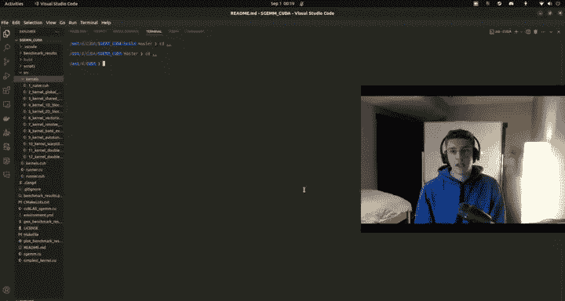

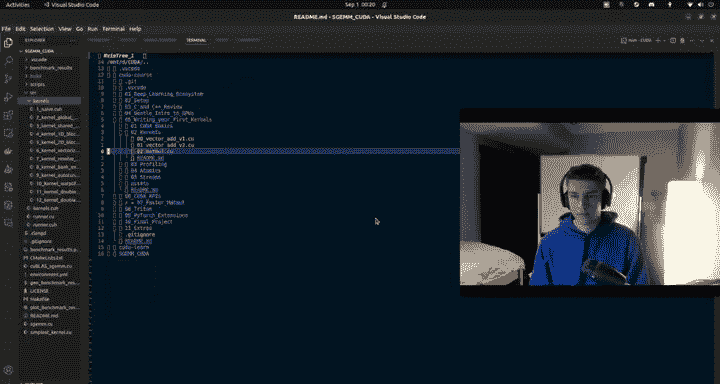

---

## 7.1 基础实现与性能基准

如果你已经坚持学习到这里，值得为自己鼓掌。到目前为止，我们已经涵盖了大量内容。现在，我们将进入课程中技术性更强的部分：矩阵乘法及其优化。

这将是技术性最强的部分之一，因为我们将关注底层优化，探究如何在硬件上真正加速计算。这不再仅仅是理解其工作原理的通用概念，我们将运用已有的知识以及即将分享的新知识，使基础的矩阵乘法算法变得非常、非常快。这个算法在深度学习中无处不在，因此我认为教授如何优化内核的最佳方式就是以此为例。

幸运的是，我们有一个由Simon Boehm创建的仓库。他目前在Anthropic担任性能或内核工程师，经验丰富。他创建了一个名为“SGEMM CUDA”的酷炫仓库以及配套的博客文章。我将跟随他的思路进行讲解。本教程的目标是逐步优化，最终达到接近甚至超越cuBLAS性能的水平（具体取决于你的硬件）。

如果你已经看过那篇文章但觉得太难，别担心，我将详细讲解，我们会深入到非常底层的细节。完成这部分学习后，你将清楚地理解如何优化CUDA内核。

我们不会在主要的CUDA课程仓库中进行这部分操作。我会在README文件中提供链接，方便你跟随学习。现在，我将克隆Simon的仓库到主目录。

首先，删除旧版本（如果有的话），然后克隆新仓库。
```bash
git clone https://github.com/simonboehm/sgemm-cuda.git
```
克隆完成后，在VS Code中打开这个新仓库。

首先，查看README文件中的构建说明。通常需要创建一个`build`目录，然后使用`cmake`和`make`进行构建。
```bash
mkdir build
cd build
cmake ..
make
```
构建过程需要一点时间。构建完成后，我们将运行一系列基准测试，依次展示每种优化后的性能，从最基础的实现开始，逐步到最复杂的优化，并与cuBLAS的性能进行对比。

---

## 7.2 朴素（Naive）实现

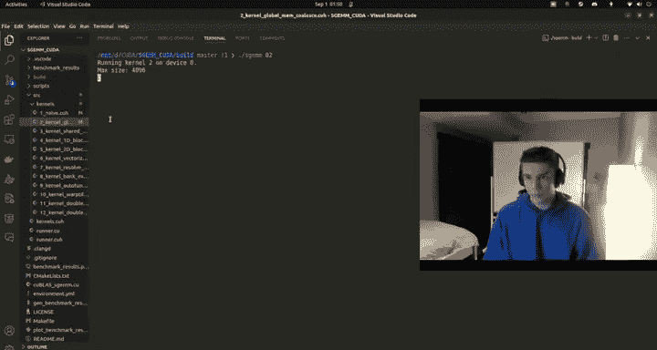

让我们从朴素实现开始。实际上，我们在之前的课程中已经实现过朴素的矩阵乘法内核。

回顾一下我们之前编写的内核：它接收矩阵A、B、C以及参数alpha和beta。它执行的操作类似于cuBLAS中的SGEMM：计算`alpha * (A * B) + beta * C`。我们主要关注计算`A * B`的矩阵乘法核心部分。

在朴素实现中，我们定义了矩阵的维度：A的形状是`M x K`，B的形状是`K x N`，输出C的形状是`M x N`。

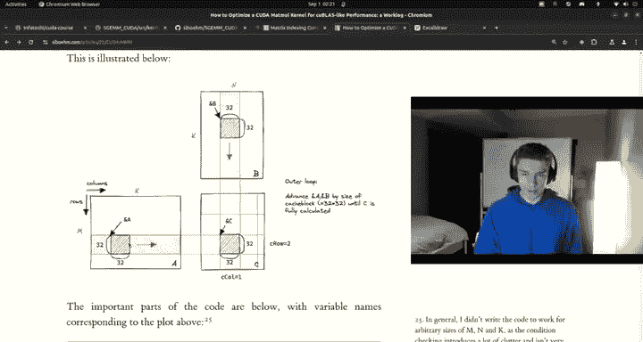

在内核中，我们通过`threadIdx`和`blockIdx`计算出当前线程负责的C矩阵中的元素坐标`(row, col)`。然后，我们使用一个循环遍历K维度，累加A的一行和B的一列的点积结果。

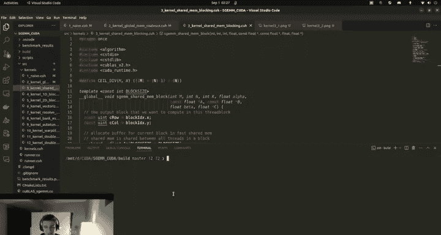

核心计算循环如下：
```cpp
float sum = 0.0f;
for (int i = 0; i < K; ++i) {
    sum += A[row * K + i] * B[i * N + col];
}
C[row * N + col] = alpha * sum + beta * C[row * N + col];
```
这就是朴素的矩阵乘法。现在，让我们运行这个内核的基准测试。

进入构建目录，运行对应的可执行文件（例如`sgemm_naive`）。
```bash
./sgemm_naive
```
输出会显示不同矩阵大小（如128, 256, 512, 1024, 2048, 4096）下的性能，单位是GFLOPS（每秒十亿次浮点运算）。

例如，在4096x4096的矩阵上，朴素内核可能达到约166 GFLOPS。这听起来很高，但实际上相对于硬件潜力来说非常低。随着优化，这个数字会大幅提升。

请注意，在4096大小上运行50次迭代，朴素内核可能耗时约0.83秒。我们将看到优化如何显著减少这个时间。

---

## 7.3 全局内存合并访问优化

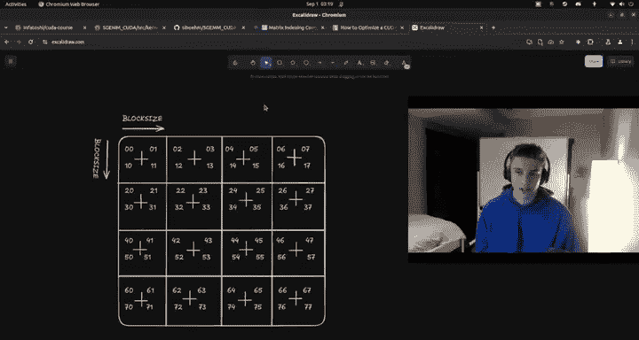

上一节我们介绍了朴素的实现，其性能有巨大的提升空间。本节中，我们来看看第一个关键优化：**全局内存合并访问**。

首先，理解内存布局至关重要。在内存中，一个`M x N`的矩阵是按行优先顺序连续存储的，即第一行之后紧跟着第二行，以此类推。

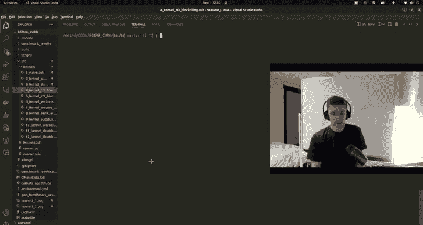

在朴素内核中，当线程计算点积时，对矩阵A的访问是连续的（沿着行），但对矩阵B的访问是不连续的（沿着列）。这导致了非合并的内存访问，严重降低了带宽利用率。

CUDA架构中，一个Warp（32个线程）内的内存访问如果满足特定模式（例如访问连续的内存地址），硬件可以将这些访问合并为一个或少数几个内存事务，从而极大提高效率。

**优化思路**：改变线程到数据映射的索引方式，确保每个Warp内的线程访问连续的内存地址。

在优化后的内核中，我们调整了`row`和`col`的计算方式：
```cpp
int row = blockIdx.y * blockDim.y + threadIdx.y;
int col = blockIdx.x * blockDim.x + threadIdx.x;
// 但为了合并访问，我们可能交换或修改索引计算
// 一种常见技巧是：
int row = (blockIdx.y * blockDim.y + threadIdx.y);
int col = (blockIdx.x * blockDim.x) * ELEMENTS_PER_THREAD + threadIdx.x; // 假设每个线程处理多个元素
```
更具体的实现可能涉及将线程ID的X维度用于列索引，并确保相邻线程访问相邻的列元素。

Simon的代码中，通过以下计算实现了合并访问：
```cpp
int row = blockIdx.y * blockDim.y + threadIdx.y;
int col = blockIdx.x * blockDim.x + (threadIdx.x / ELEMENTS_PER_THREAD); // 示例
```
其核心是让`threadIdx.x`对应连续的内存地址。这样，当Warp中的线程`threadIdx.x = 0, 1, 2, ...`执行时，它们访问的全局内存地址是连续的。

**性能提升**：运行这个优化后的内核（例如`sgemm_coalesced`），在4096矩阵上，性能可能从166 GFLOPS跃升至约1183 GFLOPS，提升了约7倍。每次运行的耗时也从0.83秒降至约0.12秒。

这个优化清晰地展示了内存访问模式对CUDA内核性能的巨大影响。

---

## 7.4 共享内存缓存分块（Tiling）

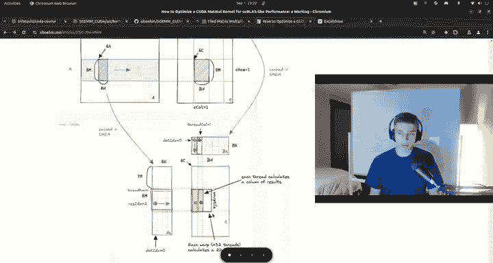

上一节我们通过合并内存访问获得了显著的性能提升。本节中，我们引入一个更强大的概念：**使用共享内存进行缓存分块**。

目前，我们的内核直接从全局内存（VRAM）读取数据，其带宽虽然高（例如约700 GB/s），但延迟也高。GPU上每个流多处理器（SM）都有自己的一小块**共享内存**（SRAM），其带宽极高（例如超过1 TB/s），且延迟极低。

**优化思路**：与其让每个线程在每次计算时都从全局内存读取数据，不如让一个线程块（Block）协作，将一小块（Tile）数据从全局内存加载到共享内存中。然后，线程块内的所有线程可以高速、重复地访问共享内存中的这块数据进行计算。处理完当前数据块后，再加载下一块。

这个过程称为**分块（Tiling）**。我们将大的矩阵乘法分解为许多小的矩阵乘法。每个线程块负责计算输出矩阵C中的一个子块。为了计算这个子块，它需要从A加载若干行块，从B加载若干列块。

**内核结构变化**：
1.  在共享内存中声明两个数组：`__shared__ float As[TILE_SIZE][TILE_SIZE];` 和 `__shared__ float Bs[TILE_SIZE][TILE_SIZE];`。
2.  计算线程块对应的输出子块在C中的起始位置。
3.  在一个外层循环中，迭代K维度（A的列/B的行）。每次迭代：
    a. 线程块协作，将A和B的相应数据块从全局内存加载到共享内存`As`和`Bs`中。
    b. 调用`__syncthreads()`确保所有线程都完成加载。
    c. 每个线程使用共享内存中的`As`和`Bs`计算其负责的部分点积，并累加到本地寄存器变量中。
    d. 调用`__syncthreads()`确保所有线程完成计算，然后再加载下一个数据块。
4.  循环结束后，将寄存器中累加的结果写回全局内存的C矩阵。

**索引计算**：这是最复杂的部分。需要仔细计算每个线程应该加载`As`和`Bs`中的哪个元素，以及如何将共享内存中的索引映射到全局内存。

以下是一个简化的加载步骤示例：
```cpp
// 假设 TILE_SIZE = BLOCK_SIZE
int tx = threadIdx.x;
int ty = threadIdx.y;

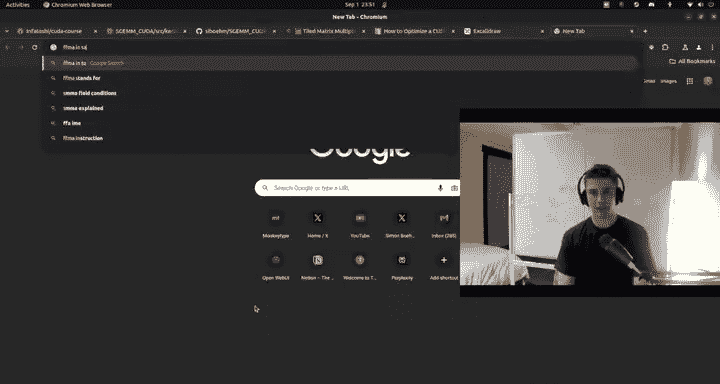

// 加载 A 的 tile
int aRow = blockIdx.y * TILE_SIZE + ty;
int aCol = k * TILE_SIZE + tx; // k 是外层循环索引
if (aRow < M && aCol < K) {
    As[ty][tx] = A[aRow * K + aCol];
} else {
    As[ty][tx] = 0.0f;
}

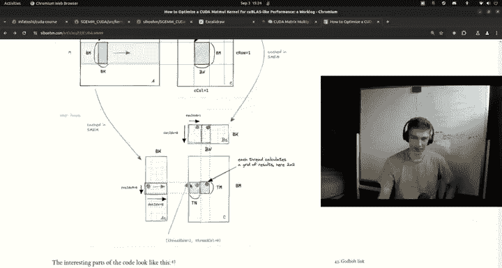

// 加载 B 的 tile
int bRow = k * TILE_SIZE + ty;
int bCol = blockIdx.x * TILE_SIZE + tx;
if (bRow < K && bCol < N) {
    Bs[ty][tx] = B[bRow * N + bCol];
} else {
    Bs[ty][tx] = 0.0f;
}
__syncthreads();
```
**性能提升**：运行共享内存分块内核（例如`sgemm_tiled`）。在4096矩阵上，性能可能从1183 GFLOPS进一步提升至约1600 GFLOPS。这证明了利用更快的内存层次结构的好处。

**注意**：这个实现是“分块”的一种形式，但每个线程仍然只计算输出C中的一个元素。接下来，我们将让每个线程计算多个元素，以进一步提高效率。

---

## 7.5 一维块分块（1D Block Tiling）

上一节我们利用共享内存减少了全局内存访问。本节中，我们通过**一维块分块**来增加每个线程的计算量，从而提升**算术强度**。

在之前的共享内存内核中，每个线程只负责输出矩阵C中的一个元素。这意味着，如果输出矩阵很大，就需要启动大量的线程。虽然GPU线程很轻量，但启动和调度它们仍有开销。更重要的是，每个线程只执行很少的计算（一个点积），相对于内存操作（加载数据到共享内存）的比例较低，这被称为算术强度低。

**优化思路**：让一个线程计算输出子块中的**多个元素**（例如一列）。这样，每个线程需要加载的数据量（特别是从共享内存）与其执行的计算量之比增加，能更好地隐藏内存延迟，提高硬件利用率。

**内核变化**：
1.  **线程块结构**：线程块的大小（`blockDim`）可能变小，但每个线程的任务变多。
2.  **输出子块**：每个线程块现在计算C中一个更大的矩形区域（例如 `BM x BN`）。
3.  **每个线程的任务**：每个线程计算该矩形区域中的一小列（大小为 `TM`）。`TM` 是一个调优参数（例如8）。
4.  **寄存器使用**：每个线程使用一组寄存器（例如 `float reg_M[TM]`）来累加这一列中每个元素的部分和。
5.  **计算循环**：在外层循环遍历K维度的数据块时，内层循环遍历 `TM`，计算每个元素的部分点积。

**索引计算变得更加复杂**：需要计算：
-   `thread_row`：线程在块内负责的输出区域的起始行。
-   `thread_col`：线程在块内负责的输出区域的起始列（在一维分块中，通常线程负责一列，所以`thread_col`是固定的）。
-   在共享内存中加载数据时，需要根据`thread_row`和循环索引`k`来计算偏移。

核心计算部分伪代码示意：
```cpp
float reg_C[TM] = {0}; // 每个线程计算TM个结果
for (int k_offset = 0; k_offset < K; k_offset += TILE_SIZE_K) {
    // 1. 协作加载 As 和 Bs 的 tile 到共享内存 (As[TILE_SIZE_K][BM], Bs[TILE_SIZE_K][BN])
    // 2. __syncthreads()
    
    // 3. 每个线程从共享内存加载数据到寄存器并计算
    for (int i = 0; i < TILE_SIZE_K; ++i) {
        float reg_A = As[i][thread_local_row]; // 加载A的一个元素
        for (int j = 0; j < TM; ++j) { // TM是线程计算的行数
            float reg_B = Bs[i][thread_local_col + j]; // 加载B的一列中的TM个元素（需要仔细索引）
            reg_C[j] += reg_A * reg_B;
        }
    }
    // 4. __syncthreads()
}
// 5. 将 reg_C[TM] 写回全局内存
```
**性能提升**：运行一维块分块内核（例如`sgemm_1d_block`）。在4096矩阵上，性能可能从1600 GFLOPS提升至约4800 GFLOPS。这是一个巨大的飞跃，主要归功于每个线程计算量的增加，更好地利用了核心的计算单元。

---

## 7.6 二维块分块（2D Block Tiling）

上一节中，每个线程计算一列（1D）元素。本节中，我们进一步扩展，让每个线程计算一个**小的二维块**（2D Tile），这被称为**二维块分块**。

一维分块中，线程计算一列，对共享内存中B矩阵的访问是连续的（合并的），但对A矩阵的访问可能不是最理想的。二维分块旨在更平衡地利用内存带宽和计算资源。

**优化思路**：每个线程计算输出子块中一个更小的二维矩形区域（例如 `TM x TN`，如 `8x8`）。这样，线程需要从共享内存中加载A的一小列（`TM`个元素）和B的一小行（`TN`个元素），然后计算它们的并积（outer product），更新线程本地存储的 `TM x TN` 个累加器。

**优势**：
-   **计算与内存访问比更高**：加载 `TM + TN` 个数据，进行 `TM * TN` 次乘加运算。
-   **更好的指令级并行**：循环展开和软件流水线更容易优化。

**内核变化**：
1.  **线程块结构**：线程块大小根据 `(BM/TM) * (BN/TN)` 计算，确保每个输出子块（`BM x BN`）被合理分配。
2.  **寄存器使用**：每个线程声明一个寄存器数组 `float thread_results[TM][TN]` 或展开成一维数组 `float reg_C[TM*TN]`。
3.  **核心计算循环**：在外层循环加载数据块到共享内存后，内层是一个双重循环（或展开）：
    ```cpp
    for (int k_inner = 0; k_inner < TILE_SIZE_K; ++k_inner) {
        // 从共享内存 As 加载 TM 个元素到寄存器 reg_A[TM]
        // 从共享内存 Bs 加载 TN 个元素到寄存器 reg_B[TN]
        for (int i = 0; i < TM; ++i) {
            for (int j = 0; j < TN; ++j) {
                thread_results[i][j] += reg_A[i] * reg_B[j];
            }
        }
    }
    ```
4.  **索引计算**：需要仔细计算每个线程在加载`As`和`Bs`、以及写入最终结果时的位置。

**性能提升**：运行二维块分块内核（例如`sgemm_2d_block`）。在4096矩阵上，性能可能从4800 GFLOPS进一步提升至约9100 GFLOPS。这使我们离cuBLAS的性能（约11500 GFLOPS）更近了一步。

---

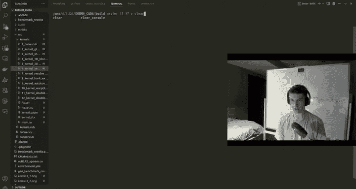

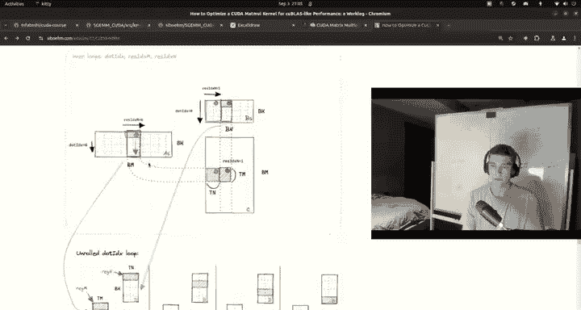

## 7.7 向量化内存访问

上一节我们通过二维分块大幅提升了性能。本节中，我们进行最后一项关键优化：**向量化内存访问**，以最大化内存带宽利用率。

即使在使用共享内存之后，从全局内存加载数据到共享内存，以及从共享内存加载数据到寄存器，仍然是性能瓶颈。CUDA支持向量数据类型，如`float4`（包含4个float）。使用这些类型可以进行**向量化加载/存储**。

**优化思路**：将多个标量内存访问合并为一个向量内存访问指令。例如，一次加载一个`float4`（128位）而不是四次单独的`float`（32位）加载。这减少了指令数量，提高了内存事务的效率，并有助于实现更宽的内存合并。

**实施步骤**：
1.  **数据类型**：在全局内存和共享内存的加载/存储操作中使用`float4`。
2.  **指针转换**：使用`reinterpret_cast<float4*>`将普通的`float*`指针转换为`float4*`指针。这向编译器表明数据是128位对齐的，允许生成向量加载指令（如`LDG.E.128`）。
3.  **索引调整**：因为一次操作处理4个元素，所以循环步长和索引计算需要相应调整。例如，原来循环步长为1，现在可能步长为4。
4.  **转置共享内存布局**：为了确保从共享内存到寄存器的加载也是合并的，有时需要改变共享内存中数据的布局（例如，将A tile存储为转置形式）。这样，当线程读取一列数据（在转置后是连续存储的）时，访问是连续的。

**代码示例（全局内存加载到共享内存）**：
```cpp
// 假设每个线程负责加载一个 float4（4个float）
int load_idx = ... // 计算全局内存索引
float4* A_vec = reinterpret_cast<float4*>(&A[load_idx]);
float4 loaded_val = *A_vec; // 一次向量加载

// 将 loaded_val 的四个分量 (x, y, z, w) 存储到共享内存的适当位置
__shared__ float As_tile[TILE_SIZE][TILE_SIZE];
int tile_row = ...;
int tile_col = ...;
As_tile[tile_row][tile_col] = loaded_val.x;
As_tile[tile_row][tile_col+1] = loaded_val.y; // 注意列索引+1
// ... 存储 z 和 w
```
**性能提升**：运行向量化内核（例如`sgemm_vectorized`）。在4096矩阵上，性能可能从9100 GFLOPS提升至约10800 GFLOPS。这已经达到了cuBLAS性能（~11500 GFLOPS）的94%左右，是一个巨大的成功！

**验证**：我们可以使用`nvcc -ptx`和`cuobjdump`工具来查看生成的PTX和SASS汇编代码，确认确实生成了`LDG.E.128`这样的向量加载指令，而不是大量的`LDG.E.32`指令。

---

## 7.8 总结与进阶方向

本节课中，我们一起学习了如何逐步优化CUDA矩阵乘法内核：

1.  **朴素实现**：基础功能，性能低下（~166 GFLOPS）。
2.  **全局内存合并**：通过调整索引实现合并访问，性能提升约7倍（~1183 GFLOPS）。
3.  **共享内存分块**：利用高速SRAM缓存数据，减少全局内存访问（~1600 GFLOPS）。
4.  **一维块分块**：增加每个线程计算量，提高算术强度（~4800 GFLOPS）。
5.  **二维块分块**：让每个线程计算一个小矩阵块，进一步优化计算与内存访问比（~9100 GFLOPS）。
6.  **向量化访问**：使用`float4`进行向量加载/存储，最大化内存带宽利用率（~10800 GFLOPS，接近cuBLAS）。

通过这些步骤，我们见证了性能从百GFLOPS级别提升到万GFLOPS级别，深刻理解了内存层次结构、访问模式、算术强度以及指令优化对GPU内核性能的决定性影响。

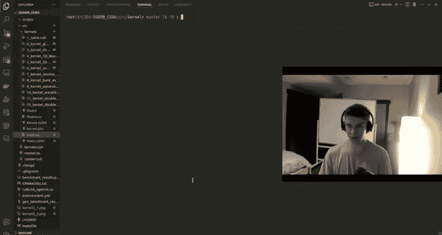

**进阶方向**：
-   **自动调优**：像实际库一样，对块大小（BM, BN, BK, TM, TN等）进行自动搜索，找到特定硬件上的最优配置。
-   **张量核心（Tensor Cores）**：现代GPU（Volta架构及以后）配备了专门用于矩阵乘法的张量核心，可提供极高的吞吐量（用于FP16, BF16, INT8等精度）。CUDA提供了`wmma`（Warp Matrix Multiply Accumulate）命名空间来编程使用张量核心。这可以将性能再提升一个数量级。
-   **异步拷贝与屏障**：利用CUDA 11+的异步内存拷贝和屏障特性，进一步重叠计算与内存传输。
-   **多级分块**：结合寄存器、共享内存、L2缓存进行更复杂的分块策略。

希望本教程为你提供了优化CUDA内核的坚实基础和清晰路线图。鼓励你继续探索，尝试实现更高级的优化技术！