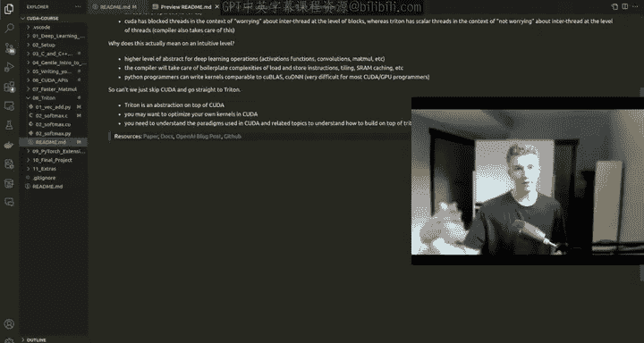

# 8：Triton入门 🚀


在本节课中，我们将学习Triton，这是一个基于Python的高级编程语言和编译器，旨在简化GPU编程。它将我们从繁琐的CUDA底层细节中解放出来，让我们能够用更简洁的语法实现高性能计算，例如之前学习的矩阵乘法分块优化。我们将通过向量加法和Softmax两个核心例子，来理解Triton的基本工作原理和语法。

## Triton简介与设计哲学

上一节我们完成了矩阵乘法的核心优化。本节中，我们来看看Triton如何将这些优化抽象化，让我们用更简单的Python语法实现。

Triton与CUDA不同。安装PyTorch时，你会看到它包含了Triton。PyTorch在底层使用Triton来加速计算。Triton和CUDA一样快，但设计哲学有根本区别。

访问Triton官网或GitHub，可以看到完整的文档，其中最重要的是“Triton语言”部分，它列出了所有可用的操作。

Triton的设计灵感来源于一篇关于分块神经网络计算的论文。其核心思想可以概括为一个对比：
*   **CUDA**：标量程序，块级线程。你编写的内核（kernel）运行在单个线程（标量）级别，但必须显式地处理线程间的通信与协作（例如共享内存）。
*   **Triton**：块级程序，标量线程。你编写的程序运行在线程块（block）级别，而所有线程级别的操作和优化都由Triton编译器自动处理，你无需关心线程间如何通信。

这意味着Triton编译器为我们处理了大量底层细节。那么，我们能否跳过CUDA直接学习Triton？答案是否定的。Triton是构建在CUDA之上的抽象层，它利用了CUDA提供的底层优化。要确保正确应用优化或构建自己的高级抽象，理解CUDA的底层机制仍然是必要的。Triton帮助我们减少样板代码，而非取代对硬件执行模型的理解。

简而言之，Triton实现了与CUDA、CuBLAS相近的性能，但代码更简洁。接下来，我们将通过实例学习Triton的基础。



## 向量加法示例 ➕

现在，我们通过一个向量加法的例子，来具体看看如何在Triton中编写内核。与CUDA版本对比，你会发现它简洁许多。

首先，我们导入必要的库并设置环境。

```python
import torch
import triton
import triton.language as tl
import random

# 设置随机种子以确保结果可复现
torch.manual_seed(123)
random.seed(123)

# 定义向量大小（约3300万个元素）
SIZE = 2 ** 25
n_elements = SIZE
```

我们创建两个随机初始化的向量 `x` 和 `y`，并准备一个输出张量 `output`。

```python
# 在GPU上创建输入向量
x = torch.randn(n_elements, device='cuda')
y = torch.randn(n_elements, device='cuda')
# 创建输出张量
output = torch.empty_like(x)
```

以下是使用PyTorch进行向量加法的基准测试，作为性能对比的参考。

```python
# PyTorch基准测试
def add_pytorch(x, y):
    return x + y
```

现在，我们来看核心的Triton内核函数。`@triton.jit` 装饰器告诉Triton编译这个函数。

```python
@triton.jit
def add_kernel(
    x_ptr,  # 输入x的指针
    y_ptr,  # 输入y的指针
    output_ptr,  # 输出指针
    n_elements,  # 向量总元素数
    BLOCK_SIZE: tl.constexpr,  # 每个块处理的元素数，编译时常量
):
    # 获取当前程序（块）在网格中的索引
    pid = tl.program_id(axis=0)
    # 计算当前块负责的数据起始索引
    block_start = pid * BLOCK_SIZE
    # 生成当前块内所有线程的偏移量 (0, 1, ..., BLOCK_SIZE-1)
    offsets = block_start + tl.arange(0, BLOCK_SIZE)
    # 创建掩码，防止访问超出数组边界的数据
    mask = offsets < n_elements
    # 从全局内存加载数据到快速内存（由Triton优化）
    x = tl.load(x_ptr + offsets, mask=mask)
    y = tl.load(y_ptr + offsets, mask=mask)
    # 执行逐元素加法（由Triton优化）
    output = x + y
    # 将结果存回全局内存
    tl.store(output_ptr + offsets, output, mask=mask)
```

为了启动这个内核，我们需要配置执行网格。以下是一个辅助函数。

```python
def add_triton(x, y):
    output = torch.empty_like(x)
    n_elements = output.numel()
    # 定义网格大小：需要多少个块来覆盖所有元素
    grid = lambda meta: (triton.cdiv(n_elements, meta['BLOCK_SIZE']),)
    # 启动内核
    add_kernel[grid](x, y, output, n_elements, BLOCK_SIZE=1024)
    return output
```

最后，我们验证Triton的结果与PyTorch是否一致。

```python
# 验证结果
output_triton = add_triton(x, y)
output_pytorch = add_pytorch(x, y)
print(f"最大差异: {torch.max(torch.abs(output_triton - output_pytorch))}")
# 输出: 最大差异: 0.0
```

在这个例子中，我们看到了Triton内核的关键部分：`tl.program_id` 获取块ID，`tl.arange` 生成偏移，`tl.load`/`tl.store` 处理内存，以及使用掩码进行边界检查。所有线程级别的协同和内存优化都由Triton在幕后完成。

## Softmax函数实现 🔥

理解了向量加法后，我们来看一个更复杂的例子：Softmax函数。这能展示Triton处理归约操作的能力。

首先，我们回顾Softmax的数学公式和数值稳定性的重要性。

Softmax函数将一个向量转换为概率分布，公式为：
**`softmax(x_i) = exp(x_i) / sum(exp(x_j))`**，对所有的 `j` 求和。

直接计算可能导致数值溢出（例如 `exp(1000)`）。因此，通常采用稳定版本：
**`softmax(x_i) = exp(x_i - max(x)) / sum(exp(x_j - max(x)))`**。

我们先在纯Python/C中理解其步骤：
1.  找到向量中的最大值 `max_val`。
2.  对每个元素计算 `exp(x_i - max_val)`。
3.  计算所有 `exp(x_i - max_val)` 的总和 `sum_exp`。
4.  每个元素的结果为 `exp(x_i - max_val) / sum_exp`。

在深度学习中，我们通常处理一个批次（batch）的向量，对每一行独立进行Softmax。接下来，我们看Triton如何实现。

我们设置输入，一个形状为 `(batch_size, n)` 的张量。

```python
import torch.nn.functional as F

@triton.jit
def softmax_kernel(
    output_ptr, input_ptr, input_row_stride, output_row_stride, n_cols,
    BLOCK_SIZE: tl.constexpr
):
    # 行ID：每个块处理一行
    row_idx = tl.program_id(0)
    # 计算当前行在内存中的起始位置
    row_start_ptr = input_ptr + row_idx * input_row_stride
    # 计算输出行的起始位置
    output_row_start_ptr = output_ptr + row_idx * output_row_stride
    # 生成列偏移量
    col_offsets = tl.arange(0, BLOCK_SIZE)
    # 计算输入指针，准备加载数据
    input_ptrs = row_start_ptr + col_offsets
    # 掩码：确保不越界
    mask = col_offsets < n_cols
    # 将整行数据加载到快速内存
    row = tl.load(input_ptrs, mask=mask, other=-float('inf'))
    # 1. 求行最大值（归约操作）
    row_minus_max = row - tl.max(row, axis=0)
    # 2. 计算指数
    numerator = tl.exp(row_minus_max)
    # 3. 计算分母（指数和）
    denominator = tl.sum(numerator, axis=0)
    # 4. 计算Softmax输出
    softmax_output = numerator / denominator
    # 将结果存回输出内存
    output_ptrs = output_row_start_ptr + col_offsets
    tl.store(output_ptrs, softmax_output, mask=mask)
```

以下是启动内核和验证的函数。

```python
def softmax(x):
    n_rows, n_cols = x.shape
    # 计算大于等于n_cols的最小的2的幂，作为块大小
    BLOCK_SIZE = triton.next_power_of_2(n_cols)
    # 限制最大块大小，并调整BLOCK_SIZE为2的幂
    num_warps = 4
    if BLOCK_SIZE >= 2048:
        num_warps = 8
    if BLOCK_SIZE >= 4096:
        num_warps = 16
    BLOCK_SIZE = min(BLOCK_SIZE, 1024)
    # 网格配置：每个行一个块
    grid = (n_rows,)
    # 分配输出内存
    y = torch.empty_like(x)
    # 启动内核
    softmax_kernel[grid](
        y, x,
        x.stride(0), y.stride(0),
        n_cols,
        num_warps=num_warps,
        BLOCK_SIZE=BLOCK_SIZE,
    )
    return y

# 测试与验证
torch.manual_seed(0)
x = torch.randn(1823, 781, device='cuda')
y_triton = softmax(x)
y_torch = torch.softmax(x, axis=1)
print(f"最大差异: {torch.max(torch.abs(y_triton - y_torch))}")
# 输出应为一个极小的数，例如 5.960464477539063e-08
```

在这个内核中，我们看到了Triton如何优雅地处理归约操作（`tl.max`, `tl.sum`）。我们以“行”为块单位，每行数据由一个线程块处理，Triton编译器自动处理了块内线程的协作以完成归约。

## 总结 📚

本节课中我们一起学习了Triton的基础知识。我们从Triton的设计哲学讲起，理解了它作为“块级程序，标量线程”的抽象，如何将开发者从繁琐的CUDA线程管理细节中解放。随后，我们通过**向量加法**和**Softmax**两个实例，逐步剖析了Triton内核的编写方法：
*   使用 `@triton.jit` 装饰器定义内核。
*   利用 `tl.program_id`、`tl.arange` 管理数据索引。
*   通过 `tl.load` 和 `tl.store` 高效搬运数据，并用掩码处理边界。
*   依赖Triton内置操作（如 `tl.max`、`tl.sum`、`tl.exp`）简洁地实现复杂计算。

Triton让我们能够用更接近Python思维的方式编写高性能GPU代码，同时保留了接近CUDA的性能。掌握它，你就能在保持开发效率的前提下，充分挖掘GPU的并行计算潜力。