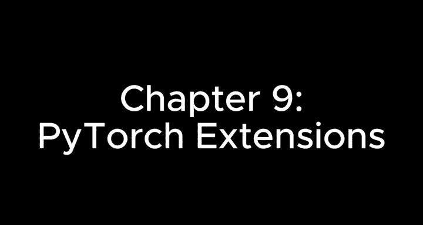
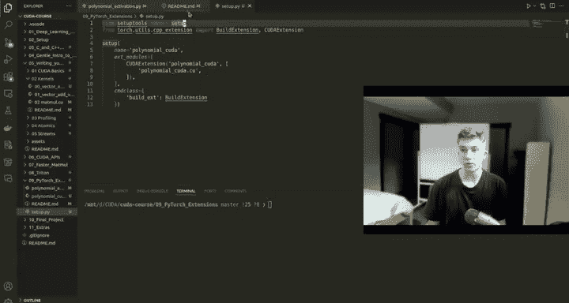

# 10：PyTorch扩展



## 概述
在本节课中，我们将学习如何为PyTorch创建自定义的CUDA扩展。我们将通过一个简单的多项式激活函数示例，展示如何编写CUDA内核，将其编译为Python模块，并与PyTorch集成，最终对比其与原生PyTorch实现的性能差异。

---

## 扩展的必要性
上一章我们完成了Tri部分。现在我们将更深入地探讨Python和PyTorch方面。为PyTorch添加自定义CUDA扩展，可以针对特定用例提升运算速度。

## 项目文件结构
以下是本示例项目包含的文件及其简要说明。

*   **README.md**：包含关于不同类型、名称的描述以及我们将要查看的直观示例。
*   **setup.py**：用于编译独立PyTorch扩展的脚本。
*   **polynomial.cu**：包含我们将用于执行多项式运算的独立函数的CUDA内核代码。
*   **polynomial.cpp**：负责编译并将扩展绑定到PyTorch的脚本，以便在Python中使用。
*   **benchmark.py**：Python脚本本身，用于与原生PyTorch实现进行性能对比。

我们实现的操作非常简单：`x² + x + 1`。

---

## 解析CUDA内核 (`polynomial.cu`)

### 模板与限制符
首先查看CUDA内核文件。顶部有一个新概念：**模板**。在之前的Mamal部分曾简要提及。

**模板** 本质上允许我们编写通用代码。在调用内核时，我们指定 `scalar_t` 类型。这意味着PyTorch将确保输入`x`和输出`y`属于此类型。PyTorch会自动识别并处理`float`、`double`或`FP16`等类型，并相应地进行编译。这是PyTorch内置的自定义类型，是此处最简便的默认选择。

接下来是 **`restrict`** 关键字。简而言之，它意味着内存访问不会重叠。我们在这里有输入`x`和输出`y`。我们只对`x`进行操作，然后将结果存储在`y`中。我们没有在相同内存位置进行混合操作或存储。因此，我们可以使用`restrict`，这将允许编译器对二进制代码进行积极的优化。

### 内核实现
在内核函数内部，我们简单地遍历x维度，使用典型的内核索引。然后执行平方、相加、再加一的操作。内核本身非常简单，主要是一些需要注意的新颜色和关键字。

```cpp
template <typename scalar_t>
__global__ void polynomial_activation_kernel(
    const scalar_t* __restrict__ x,
    scalar_t* __restrict__ y,
    int n) {
    int idx = blockIdx.x * blockDim.x + threadIdx.x;
    if (idx < n) {
        scalar_t val = x[idx];
        y[idx] = val * val + val + 1;
    }
}
```

---

## 解析C++绑定代码 (`polynomial.cpp`)

### 自动类型推断与内核配置
向下滚动，我们看到一些C++语法。这里使用了 **`auto`** 关键字，它可以自动推断变量的类型。它会识别出这是一个PyTorch张量类型。`auto`让代码看起来更简洁。

然后是线程配置，我们使用每个块1024个线程，这是典型的最大值。接着计算块的数量：`(numel + threads - 1) / threads`。这些内容之前已经讲过，应该非常简单。

### 函数封装与Python绑定
接下来是关于如何调用内核的一些额外设置，即我们向它传递哪些参数。基于这些参数，我们返回一个输出。

最后是Python绑定部分。不必过于担心细节，相信这个过程即可。

*   **`PYBIND11_MODULE`**：这是一个宏，定义了Python模块的入口点。
*   **`TORCH_EXTENSION_NAME`**：这是PyTorch定义的宏，用于扩展模块的名称，通常由`setup.py`文件定义。
*   **`m.def()`**：此方法向模块添加一个新函数。第一个参数`"polynomial_activation"`是Python中函数的名称。第二个参数是指向要调用的C++函数的指针。最后一个参数是函数的文档字符串。

这是完整的CUDA脚本，本质上已经是最简单的形式，可以作为模板使用。

---

## 解析Python集成与基准测试 (`benchmark.py`)

### 自定义Autograd函数
在Python脚本中，我们导入编译好的`polynomial_cuda`函数。我们定义了一个类，使用`torch.autograd.Function`。默认情况下，当我们创建一个autograd函数时，必须包含`forward`和`backward`方法，两者都应为静态方法。我们添加装饰器`@staticmethod`。

在`forward`方法中，我们调用编译好的`polynomial_activation`函数。在`backward`方法中，我们暂时不支持，因此直接抛出`NotImplementedError`。

### 模块定义与实现选择
在主要的模块定义中，我们进行初始化。在`forward`方法中，我们根据`implementation`参数决定使用PyTorch原生实现还是我们的CUDA扩展。如果未指定实现，则提示错误。

### 基准测试逻辑
在主函数中，我们设置随机种子，在指定设备上创建正态分布的随机张量。我们分别使用PyTorch实现和CUDA扩展实现，并将它们移动到设备上。

基准测试的过程是：记录开始时间，运行指定次数的函数，使用`cuda.synchronize()`确保所有操作完成，记录结束时间，然后计算平均耗时（毫秒）。



---

## 编译与运行

### 编译扩展
要编译此扩展，只需运行`python setup.py install`。这将使用Ninja进行构建，并在当前目录下创建一个`build`文件夹。

### 执行与性能对比
编译完成后，我们可以运行Python脚本。它将打印出输入张量、CUDA扩展的输出结果，以及两种实现的平均运行时间。

例如，PyTorch内置函数可能平均耗时约10.47毫秒，而CUDA扩展可能仅需约0.243毫秒。通过计算 `10.47 / 0.243 ≈ 43.1`，我们得到了约43倍的加速比，这对于大型张量来说是非常显著的性能提升。

如果尝试调用`.backward()`方法，CUDA扩展版本会抛出错误，因为我们尚未实现反向传播，此时会回退到前向传播。

---

## 总结
本节课我们一起学习了如何为PyTorch创建自定义CUDA扩展。我们从编写一个简单的多项式激活函数CUDA内核开始，然后使用C++和pybind11将其绑定到Python，最后在PyTorch模块中集成并进行了性能基准测试。这个过程展示了如何通过自定义CUDA代码来显著提升特定运算的性能。你可以自由地以此模板为基础，添加自己的自定义研究代码，使其易于自己、他人或组织使用。这是我能找到的最简单易懂的编写和解释示例。

接下来，我们将进入一个最终项目，该项目将非常令人兴奋，帮助你从头理解神经网络，以及如何为性能优化它们，例如添加数据加载器等多种优化，以进行真实世界的训练运行。