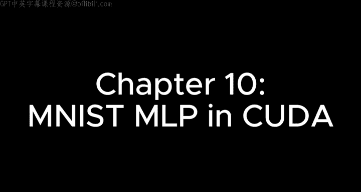
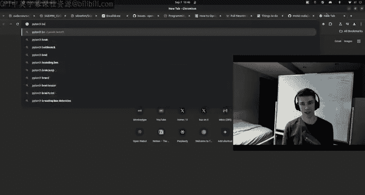
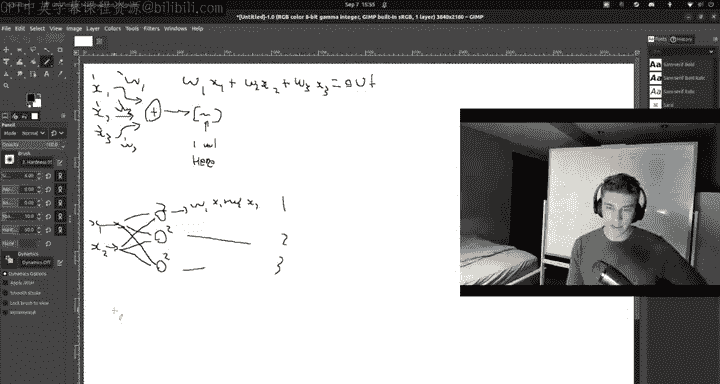
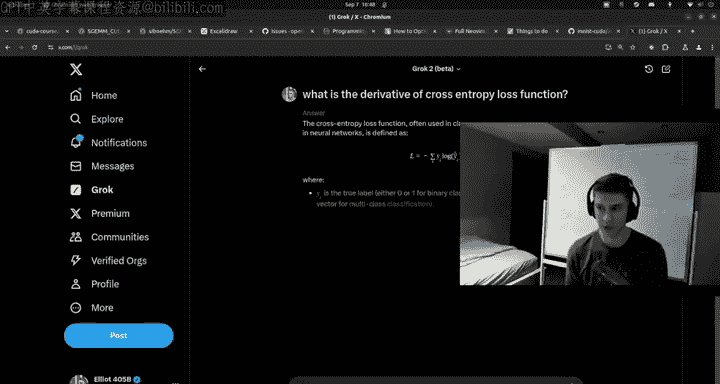
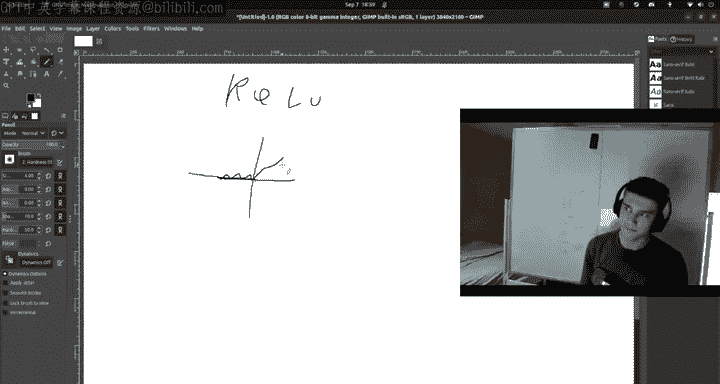
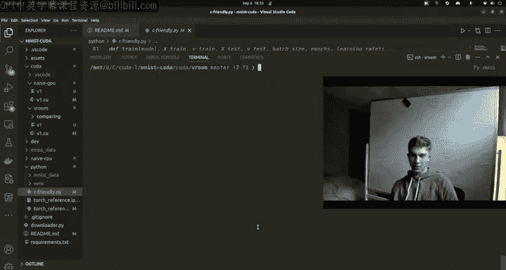

# 11：第10章 (MNIST多层感知机) 🚀



## 概述
在本节课中，我们将学习如何从零开始训练一个MNIST多层感知机（MLP）。我们将从Python和PyTorch开始，逐步深入到NumPy，然后将其移植到C语言，最后利用CUDA进行加速。通过这个过程，我们将深入理解神经网络的前向传播、反向传播以及梯度下降等核心概念。

---

## 从PyTorch开始 🐍

上一节我们介绍了课程的整体结构，本节中我们来看看如何使用PyTorch快速搭建并训练一个MNIST MLP。

我们首先导入必要的库，并设置超参数。



```python
import time
import numpy as np
import torch
import torch.nn as nn
import torch.optim as optim
from torch.utils.data import DataLoader
from torchvision import datasets, transforms

# 超参数
learning_rate = 1e-3
batch_size = 4
num_epochs = 3
train_size = 10000
```

接着，我们设置数据目录并初始化数据集和数据加载器。



```python
# 设置数据目录
data_dir = './python/data'

# 启用TF32以使用张量核心加速
torch.backends.cuda.matmul.allow_tf32 = True

# 数据预处理
transform = transforms.Compose([
    transforms.ToTensor(),
    transforms.Normalize((0.1307,), (0.3081,))
])

# 初始化数据集
train_dataset = datasets.MNIST(root=data_dir, train=True, download=True, transform=transform)
test_dataset = datasets.MNIST(root=data_dir, train=False, download=True, transform=transform)

# 初始化数据加载器
train_loader = DataLoader(train_dataset, batch_size=batch_size, shuffle=True)
test_loader = DataLoader(test_dataset, batch_size=batch_size, shuffle=False)
```

然后，我们定义神经网络模型的结构。

```python
class MLP(nn.Module):
    def __init__(self, input_size=784, hidden_size=256, output_size=10):
        super(MLP, self).__init__()
        self.fc1 = nn.Linear(input_size, hidden_size)
        self.relu = nn.ReLU()
        self.fc2 = nn.Linear(hidden_size, output_size)

    def forward(self, x):
        x = x.view(x.size(0), -1)  # 展平输入
        x = self.fc1(x)
        x = self.relu(x)
        x = self.fc2(x)
        return x
```



我们将模型转移到CUDA设备上，并定义损失函数和优化器。

```python
# 初始化模型、损失函数和优化器
model = MLP().cuda()
criterion = nn.CrossEntropyLoss()
optimizer = optim.SGD(model.parameters(), lr=learning_rate)
```

最后，我们编写训练循环。

```python
# 训练循环
for epoch in range(num_epochs):
    model.train()
    running_loss = 0.0
    correct = 0
    total = 0

    for batch_idx, (data, target) in enumerate(train_loader):
        data, target = data.cuda(), target.cuda()

        # 前向传播
        output = model(data)
        loss = criterion(output, target)

        # 反向传播和优化
        optimizer.zero_grad()
        loss.backward()
        optimizer.step()

        # 统计
        running_loss += loss.item()
        _, predicted = output.max(1)
        total += target.size(0)
        correct += predicted.eq(target).sum().item()

    # 打印每个epoch的统计信息
    print(f'Epoch [{epoch+1}/{num_epochs}], Loss: {running_loss/len(train_loader):.4f}, Accuracy: {100.*correct/total:.2f}%')
```

运行此脚本，我们可以在三个epoch后获得约90%的准确率。

---



## 深入NumPy实现 🔍

上一节我们使用PyTorch的高层API快速实现了训练，本节中我们来看看如何使用NumPy从零实现相同的网络，以理解其底层原理。

以下是核心步骤的概述：

1.  **初始化参数**：随机初始化权重和偏置。
2.  **前向传播**：计算线性变换和激活函数。
3.  **计算损失**：使用交叉熵损失。
4.  **反向传播**：计算梯度。
5.  **更新参数**：使用梯度下降。

以下是关键函数的代码示例：

**前向传播（线性层）**
```python
def linear_forward(x, w, b):
    return np.dot(x, w) + b
```

**ReLU激活函数**
```python
def relu_forward(x):
    return np.maximum(0, x)
```

**Softmax函数**
```python
def softmax(x):
    exp_x = np.exp(x - np.max(x, axis=1, keepdims=True))
    return exp_x / np.sum(exp_x, axis=1, keepdims=True)
```

**交叉熵损失**
```python
def cross_entropy_loss(y_pred, y_true):
    m = y_true.shape[0]
    log_likelihood = -np.log(y_pred[range(m), y_true])
    loss = np.sum(log_likelihood) / m
    return loss
```

**反向传播（线性层梯度）**
```python
def linear_backward(dout, x, w):
    dw = np.dot(x.T, dout)
    db = np.sum(dout, axis=0, keepdims=True)
    dx = np.dot(dout, w.T)
    return dx, dw, db
```

通过实现这些函数并组合成训练循环，我们可以用纯NumPy复现PyTorch的训练过程，准确率同样能达到约90%。

---

## 移植到C语言 ⚙️

上一节我们在NumPy中理解了所有操作，本节中我们将其移植到C语言，为后续的CUDA加速做准备。

C语言实现需要手动管理内存和循环。以下是核心数据结构和函数：

**定义神经网络结构体**
```c
typedef struct {
    float* weights1;
    float* bias1;
    float* weights2;
    float* bias2;
    float* grad_weights1;
    float* grad_bias1;
    float* grad_weights2;
    float* grad_bias2;
    int input_size;
    int hidden_size;
    int output_size;
} NeuralNetwork;
```

**矩阵乘法函数**
```c
void matmul(float* a, float* b, float* c, int m, int n, int k) {
    for (int i = 0; i < m; i++) {
        for (int j = 0; j < n; j++) {
            float sum = 0.0f;
            for (int p = 0; p < k; p++) {
                sum += a[i * k + p] * b[p * n + j];
            }
            c[i * n + j] = sum;
        }
    }
}
```

**前向传播函数**
```c
void forward(NeuralNetwork* net, float* input, float* hidden, float* output, int batch_size) {
    // 第一层: input -> hidden
    matmul(input, net->weights1, hidden, batch_size, net->hidden_size, net->input_size);
    add_bias(hidden, net->bias1, batch_size, net->hidden_size);
    relu_forward(hidden, batch_size * net->hidden_size);
    
    // 第二层: hidden -> output
    matmul(hidden, net->weights2, output, batch_size, net->output_size, net->hidden_size);
    add_bias(output, net->bias2, batch_size, net->output_size);
    softmax(output, batch_size, net->output_size);
}
```

**反向传播和参数更新**
反向传播需要计算每一层的梯度，并按照链式法则传递。参数更新则遵循梯度下降公式：`weight = weight - learning_rate * gradient`。

通过完整的C语言实现，我们可以在CPU上运行MNIST训练，虽然速度较慢，但为理解CUDA并行化打下了坚实基础。

---

## 使用CUDA加速 ⚡

上一节我们完成了CPU上的C语言实现，本节中我们利用CUDA将其加速。

CUDA实现的核心是将计算密集的操作（如矩阵乘法）移植到GPU上并行执行。我们主要修改以下部分：

1.  **设备内存管理**：使用`cudaMalloc`和`cudaMemcpy`在主机和设备间传输数据。
2.  **核函数编写**：为矩阵乘法、ReLU、Softmax等操作编写并行核函数。
3.  **启动配置**：合理设置线程块和网格大小以最大化GPU利用率。

**一个简单的矩阵乘法核函数示例**
```cpp
__global__ void matmul_kernel(float* a, float* b, float* c, int m, int n, int k) {
    int row = blockIdx.y * blockDim.y + threadIdx.y;
    int col = blockIdx.x * blockDim.x + threadIdx.x;
    
    if (row < m && col < n) {
        float sum = 0.0f;
        for (int i = 0; i < k; i++) {
            sum += a[row * k + i] * b[i * n + col];
        }
        c[row * n + col] = sum;
    }
}
```

**主机端调用**
```cpp
// 设置启动配置
dim3 blockDim(16, 16);
dim3 gridDim((n + blockDim.x - 1) / blockDim.x, (m + blockDim.y - 1) / blockDim.y);

// 启动核函数
matmul_kernel<<<gridDim, blockDim>>>(d_a, d_b, d_c, m, n, k);
```

通过将前向传播、反向传播和参数更新中的所有关键操作都实现为CUDA核函数，我们可以显著提升训练速度。在相同的超参数下，CUDA版本可以在更短的时间内达到与CPU版本相近的准确率（约90%）。

---

## 总结 🎯

本节课中我们一起学习了如何从零开始实现并训练一个MNIST多层感知机。

我们首先使用**PyTorch**快速搭建了模型，理解了高级API的便捷性。然后，我们深入**NumPy**，从零实现前向传播、损失计算、反向传播和梯度下降，揭示了神经网络训练的核心原理。接着，我们将算法**移植到C语言**，处理了内存管理和循环优化，为性能提升做准备。最后，我们利用**CUDA**进行并行加速，将计算密集型任务分配给GPU，实现了显著的性能提升。



通过这个完整的项目，我们不仅掌握了MNIST分类任务，更深入理解了从高级框架到底层硬件加速的完整深度学习流水线。你可以在此基础上尝试优化CUDA核函数、调整网络结构或探索其他数据集。