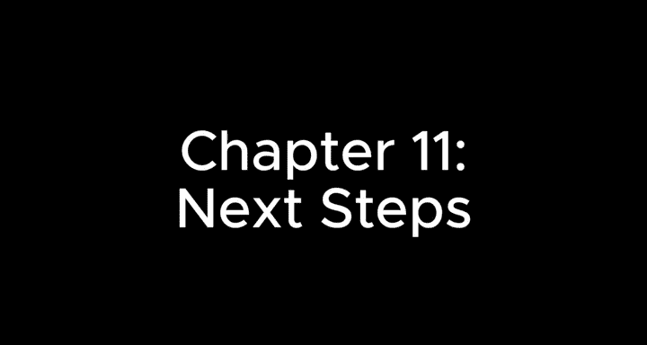
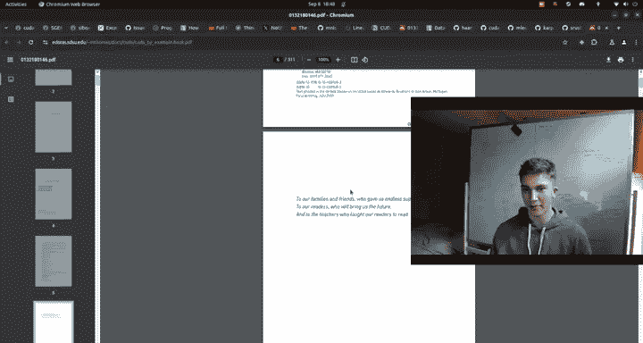
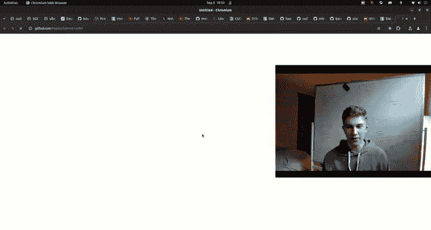
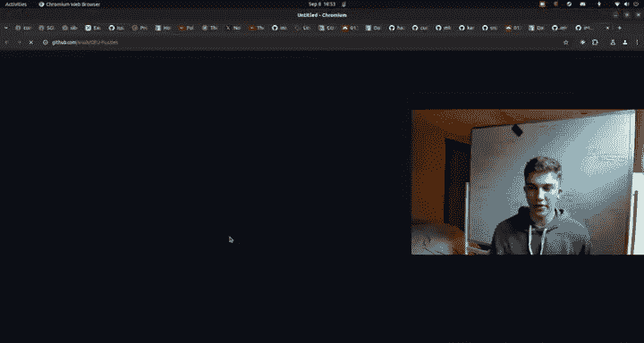
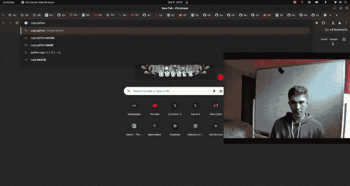

# 12：下一步方向 🚀

在本节课中，我们将总结整个课程，并为希望继续深入学习的你指明方向。我们将介绍一些高级优化概念、推荐学习资源以及活跃的社区，帮助你进一步提升CUDA和GPU编程技能。

---

如果你已经坚持学到这里，请给自己一些鼓励。这基本上就是本课程的终点了。你做到了，做得很好。

我们接下来将快速浏览一些提示，为你指明继续深入的方向。你可能很难完全掌握所有内容，这完全可以理解。但如果你希望继续，这里有一些额外的资源可以支持你。

在课程的README文件中，有一个关于统一内存和内存架构的章节，我认为这很有用，你可能会感兴趣。但此刻我想主要介绍的是“深入探索”部分。如果你想更进一步，真正了解如何在CUDA和GPU编程（尤其是在深度学习领域）应用深度优化和先进技术，你可以这样做。

以下是几个关键方向：

## 量化技术

量化是指从高精度数据类型（如FP32）转换到低精度数据类型（如FP16或INT8）的过程。即使从FP32降到INT8，模型仍能保持相当好的性能和精度质量。实现这一点有一些特定的技巧。

很多技巧与数值范围有关。例如，如果你的数值范围被限制在-10到10之间，你就不必担心很多指数值的问题。如果权重初始化稳定且训练过程中数值不会超出这个范围，你可以直接将其作为精度上限，这将是它能达到的最大值。量化本质上就是这种将高精度数字转换为低精度数字的艺术，然后利用这些低精度数字进行非常快速的操作。

INT8运算比FP32快得多，不仅仅是四倍。我们在比较`kblas`与`kblas_lt`的32位与16位性能时已经看到了显著的提升。你可以想象INT8会更快，因为它只涉及整数运算，无需担心浮点数或小数点。

量化技术很酷，被广泛应用于当前模型中，例如GPT-4或Llama 4/5B。很多模型实际上都使用了量化，很可能是BF16、FP8甚至Float4。这很酷。

## 张量核心

张量核心非常棒。我虽然已经提到过，但不能不提。我之所以没有在本课程中详细覆盖，是因为这更像是一个入门课程。我试图在有限的课时内塞入尽可能多的内容，以便你能消化。如果你想继续深入，张量核心显然是下一步。

## 稀疏性

稀疏性是一个很酷的概念。你可以这样理解稀疏性：假设我有一个数组，它可能像这样：`[0, 0, 0, 0, -7, 0, 0, 0, 0, 0, 0, 6, 0, 0, 0, 0]`。这就是稀疏的含义：存在大量零值，偶尔出现一些代表重要信息的大数值。

这里的核心思想是，你可以用更少的内存来存储这些数据。这更多是关于内存和计算性能的优化，而不仅仅是质量提升。我们可以使用两个矩阵：一个存储非零值（如`[-7, 6]`），另一个存储这些值对应的坐标（如`[4, 11]`）。这样，我们只需要存储4个整数，而不是原来的16个整数，大大减少了存储需求。

想象一下，当你扩展到2D或3D结构时，你将节省数个数量级的内存，这可以非常高效。因此，在设计高性能神经网络时，需要考虑是否能利用稀疏性。如果外部编写神经网络架构的人（例如使用PyTorch时）鼓励稀疏性，并且模型在这方面运行良好，那么这对你来说就非常有利，会让你的工作更轻松。稀疏性是一种性能优化技巧，有机会就应该采用。

## 推荐资源与项目

上一节我们介绍了一些高级优化概念，本节中我们来看看一些具体的学习资源和实践项目，它们能帮助你巩固知识并探索更广阔的领域。

以下是几个值得探索的资源：

*   **《CUDA by Example》**：这是一本通用GPU编程入门书籍。我通过谷歌搜索找到了它，它就像一个电子书网站。里面包含了很多内容，例如GPU计算的崛起、CUDA架构等。本课程压缩了其中的许多重要部分，但显然不是全部。我本人没有读过这本300页的书，但你会发现书中的很多内容都被浓缩到了本课程中。

*   **分布式训练文章**：这是Anthropic公司的Simon撰写的一篇关于深度学习模型数据并行分布式训练的文章。在我们之前讨论如何让大型算法在多个实例上训练的章节中，这是一个很好的例子。分布式训练目前是一个大问题，涉及将数据中心整合到一个紧凑的空间。这方面有相关研究致力于减少分布式方面的开销。当你拥有一个包含大量模型的大型数据中心，并且需要让许多GPU（或者说，让模型以特定方式相互通信）时，这很困难。这篇文章深入探讨了这一点。我不会通读全文，但它确实涉及更多性能优化，例如用于实际优化过程的`all-reduce`操作。这里有很多需要考虑的因素，但我甚至没有集群来训练这个，所以我无法真正教授这部分内容。

*   **MNIST CUDA项目**：这是一个很酷的小项目，名为`mnist-cuda`，它使用CUDA和cuDNN在MNIST数据集上进行训练。我相信它使用了卷积神经网络。如果你在Windows上，这可能更容易上手。例如，你可以查看网络部分的C++文件。我不会深入挖掘这个项目，但它是我在GitHub搜索`mnist-cuda`时发现的一个很酷的小项目，你可以随意使用它。

*   **Micrograd CUDA**：这与`micrograd`（或`micropathy`）非常相似。这是我之前提到过的东西，你应该重点复习或理解反向传播等机制是如何工作的。它本质上就像一个非常微型的PyTorch Autograd。如果我们查看它的文件，里面有一个引擎。例如，有用于数值操作的类，当你使用双星号`**`进行幂运算时，它会调用`__pow__`方法；加法操作会调用`__add__`方法。在引擎之外，还有实际的神经网络Python代码，它抽象了从神经元到层的过程。例如，一个具有一组权重的单一神经元，接收所有不同的X值，进行点积运算，然后输出一个值。这就是一个神经元。然后，有一个层，它包含一堆神经元。接着是多层感知机，即多个这样的层堆叠在一起。而`micrograd-cuda`就是将其用CUDA实现。肯定有人这么做，所以你可以随意探索并从中获得乐趣。它应该更快，可以帮助你在计算统一设备架构的层面上理解事物。它包含了所有CUDA操作，例如移动到GPU的`malloc`和`memcpy`。你可以想象PyTorch与此类似，可能性能更优。你肯定不希望每次移动数据或使用数据时都进行原生的`malloc`、`memcpy`或编写朴素的内核。总之，这是一个很酷的项目。

*   **GPU Puzzles**：这是我发现的另一个有趣的项目，排名第二。你可以使用`cupy`库。CuPy是一个开源的使用Python进行GPU加速计算的库，本质上就是CUDA，但你可以通过Python接口使用它，这非常棒。它的GitHub页面上有很多很酷的东西。你只需要导入它，然后就可以创建形状并进行操作，类似于PyTorch或NumPy。这些GPU谜题就像解决逻辑问题，我们之前用内核解决问题，但这里提供了很多不同的例子。除了矩阵乘法，里面还有很多其他内容，你可能会觉得练习起来很有趣。

## CUDA Mode 社区

最后，我决定压轴介绍的是`cuda-mode`。他们有自己的GitHub、YouTube频道和Discord服务器。这里包含的很多材料都超出了我的课程范围。我的课程更偏向视频辅助，但`cuda-mode`背后的社区非常棒。这里有真正优秀的工程师和研究人员，不断构建酷炫的东西，社区成员也非常活跃。这是一个绝佳的地方，我绝对推荐你去看看。他们有很多章节，例如Flash Attention、Cutlass、Triton、BEED Kernels、数据处理、张量核心等等。我推荐你加入他们的Discord服务器，你可以在这里找到。里面有很多很酷的小组，例如`#beginners`频道。超级活跃，比如今天的最后一条消息甚至是几小时前发布的，而这只是一个频道。往下翻，最后一条消息可能就在一小时前。

---

本节课中我们一起学习了CUDA编程课程的总结与进阶方向。我们回顾了量化、张量核心和稀疏性等高级优化概念，并介绍了《CUDA by Example》、分布式训练文章、MNIST CUDA、Micrograd CUDA、GPU Puzzles以及活跃的CUDA Mode社区等宝贵的学习资源和实践项目。希望这些内容能为你继续探索高性能GPU计算世界提供坚实的基础和明确的方向。