# Engineering Clinic《网络模拟器3教程｜Network Simulator 3 Tutorial Series》中英字幕deepseek翻译 p03 -03-NS3 Installation in Ubuntu Step By Step  - -BV1aQmtYZEPr_p3-

Good evening， friends。 I am Praip Kummar here。 I am going to tell you about the installation of network simulator 3 in open to operating system 16。

04。 So this video I am recording in March 2018。 So if you are。

 if you will be waiting for another month， you will be getting an open to 18。04。

 which is the long term support。 So anyhow I am just installing this in open to 16。04。

So I have two windows side by side， one window being the text editor where I will be typing the information when I record another window will be I'm just doing the exact operations that perform for installing this network sim 3。

So， what I do is。So the very first command is I will be adding through app update。

 so assuming that I have installed wouldoo for the first time。I'll be issuing this command。

 So always what you do is just use this command pseudo app update。So since I am using U to 16。04。

 so U to 16。04 has a facility that you need not give so the app to get update So this also is it correct to use but you need not provide app to get we can simply use app update。

So the very first command is have to update。

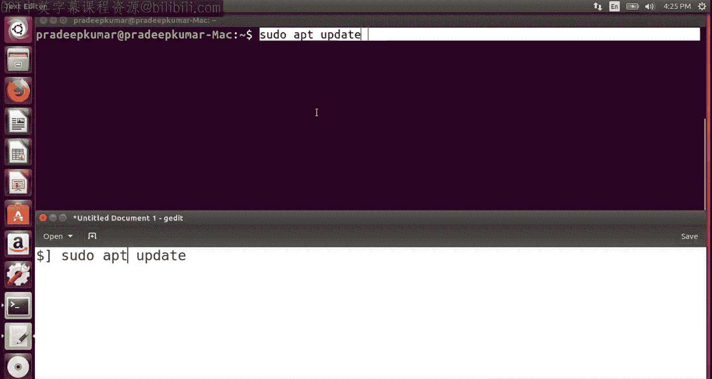

So if it is anything any suggestion is there for upgrading your operating system it will suggest you。

 but in my voice it given that all packages are up to date the next command is if at all if you have to upgrade something we can directly give pseudo after upgrade。

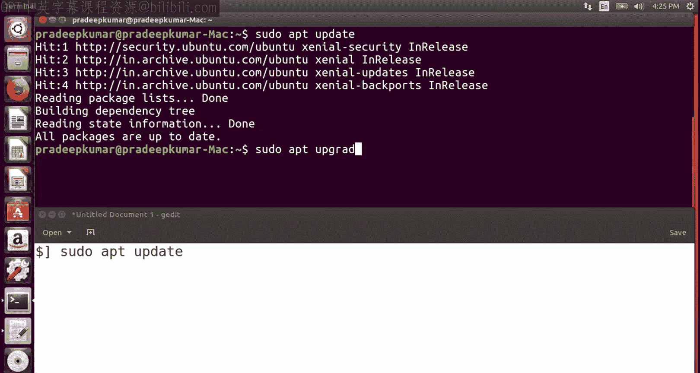

So this also been upgraded since I have used this voice。 This also been upgraded。

So I need not upgrade it again。So this is the second commander。So you can refer my website www。

t nsN dot co N N do com for copying and pasting these instructionss。

 I will be posting these instructions in my website there。So next command is such a very big command。

So this is actually industry needs so many libraries。So N3 needs developmental libraries。 N3 needs。

So many developmental libraries。W it needs to be installed， which needs to be。Inster now。Ins3。

 So there is a huge list of package list available for installing before you install In 3。

 So even after before if you want to install industry3 directly without installing these packages。

 you might be getting some errors or warnings from the networks in N3 software So it is always better to install those packages before if you install NS S3。

So here is the command。I'm just clicking it here。Paste， so I already pasted this here。

 So if you see there's a huge list of software。 So let me tell you what are the things it is visible essentially。

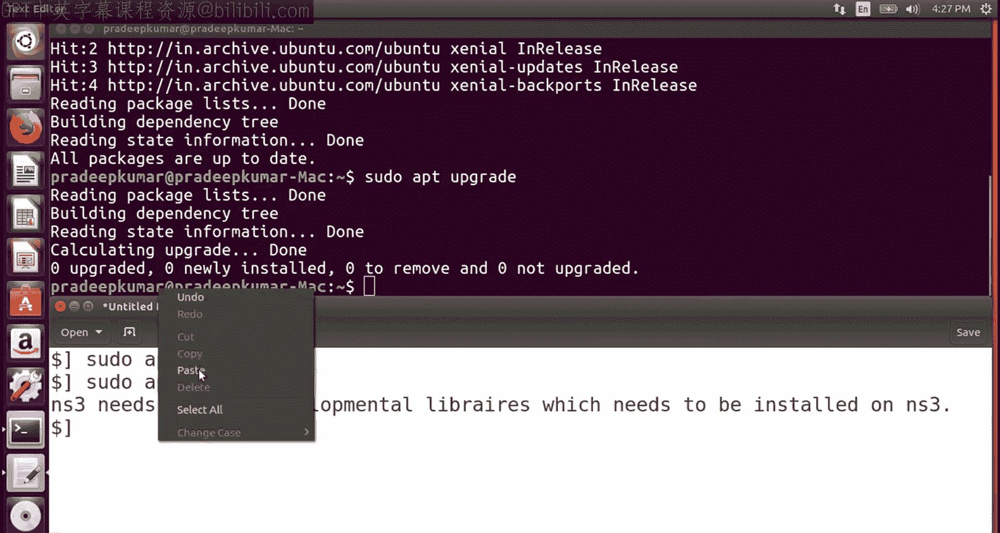

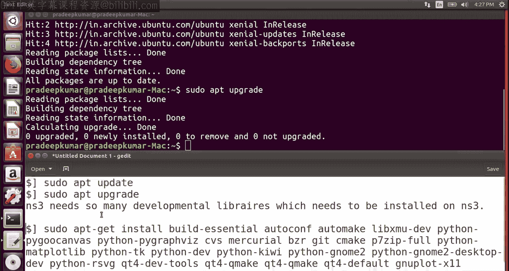

So it is nothing but building the entire libraries like developmental libraries like T C LT K or C plus plus all these things。

 the auto configuration， then auto make then X level libraries for GY So then Python per libraries or Python Python graphical views and concurrent person system Merrcurial is a kind of a build system for N S3 and B that are then Github you know then C make P00bits for compression decompression and there are so many Python libraries and  Q T4 is for Gy So you need to install all these things before you want to coincide the installation of N S3 So what I do is I just copy it again and then I paste it here in the tab。

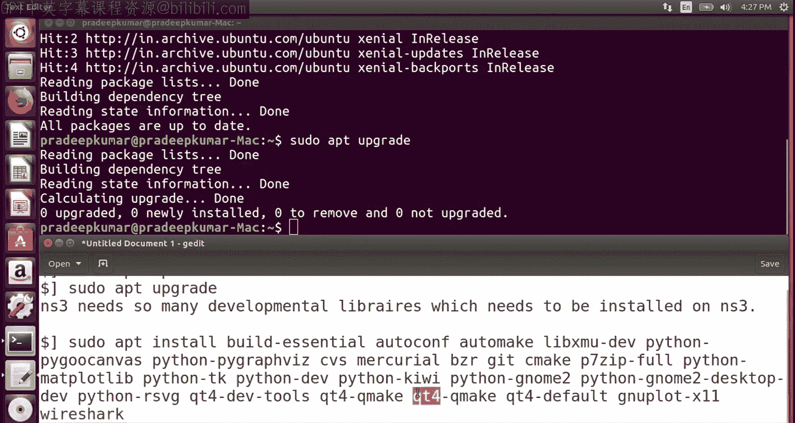

So， this will be installing。Around a 223 MBF archives。

 So Im just pressing it yes so that we install all the packages。

 So let me not run the video for the complete installation Once installation is over。

 Ill come back to this video。Yes， thank you。 And it got installed。 can see this。

 There are so many packages up 223 M B have been installed here。

1 one warning you may be getting in between that is by wire shark。

 So wireshark usually have a permission to run the wireshark only on a normal user mode。

 So it won't be allowed to run an G in route user or super user mode it will ask whether you want to run it1 wire shark normal user mode it can make it as yes rather than no it can make it as select as yes。

 So only that when there is only alert box， it will be giving you So other than that。

 it doesn't ask you anything And it will be getting a turned like this。

 So now I just go to the installation of N3 So anyway just check it here。

 So I am in my home now So to check what is my home I use the command E home that is to check what is a home So I am in home number slash slash command。

 So this is my home here。 So what do I do Ill just go inside my home command for doing this is E dollar capital home。

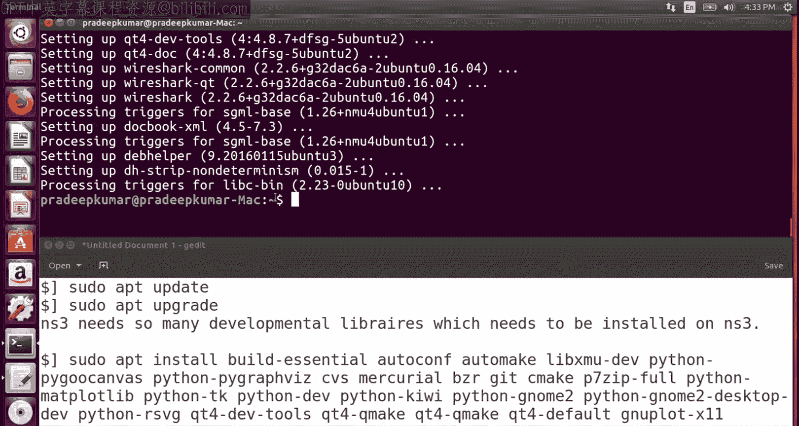

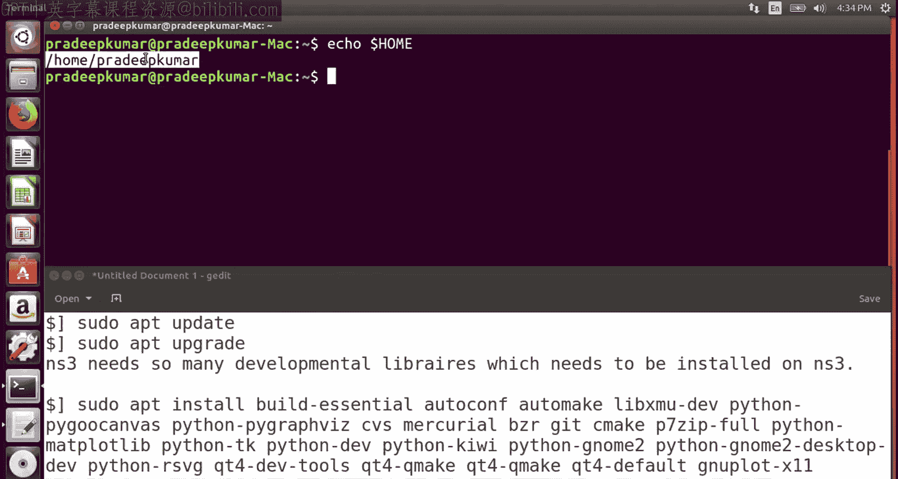

So I just check in my home whether the NSS3 software is there， so I have already downloaded NSsal13。

27 dot b2 so this software I already downloaded from the website NSsam dot co or G So that I have downloaded it so what you can do is you can instead we have to install this software now So again so the command is so there are two two methods available So open this software in Gi and I click over it and extract So that is one method other method is using through terminal because the installation needs through terminal you cannot install it through Gi so I have to install it through the terminal So if you want to use the terminal。

Let let me go with the terminal command here。 So since I deal with the command。

 so I just give this command here。嗯。So we will just do it first here。 So tar。J E X， C F Li the。

J for extracting from B is Z2 x for extract v for ver mode when it is when the software is been uninstal or I mean when the software is been unzipped。

 you will be getting what kind of file file is being unzipped and if is for force。So copy this。

I'm wased here。 So tar J X we fund this。So what it is done now。

W says this permission is denied because I have copied from a route user。

 So let me change file permission and then come back。

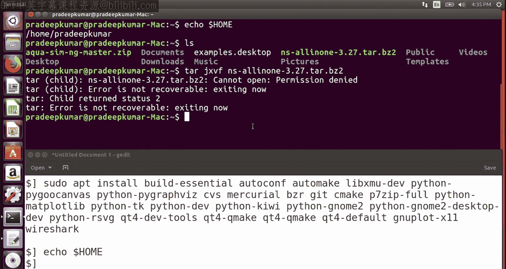

Yes， I am back now。 So what do I do is I'll just。Use this command。Tar Jx P F。

 so you can see that the software is been extracted。

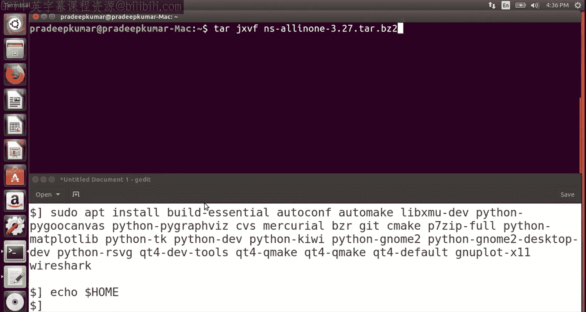

So the software has been accepted， so the extraction will take only less number of time。

So after this is been extracted， we have to install it， or we have to call us build it。

 So we will be building the entire N S3 libraries。Okay， so once it is done。

 So in case if you get any errors like the card previously， So you had to solve those errors。

 So if you don't get any errors or any as it shows here in the screen。 So you need not。

 you will go to the next。 So now when we have seen that file folder has been created with the name Nhen3。

2 So by the time of this there is another version of N3 is N3。

28 So whenever you prefer for renewal version if you are working on softwares are set of libraries。

 then you can prefer the latest version。 So for example Wiifi internet of things then wireless personal networks。

 So these networks every day there is a change in there is a change in specifications and architecture。

 So the recent softwares are the recent versions also bring in all the changes So if you want to prefer the latest state of our technologies latest updates in the architecture and the protocol applications。

 So you can use the latest version So anyway 3。2son also being the latest。

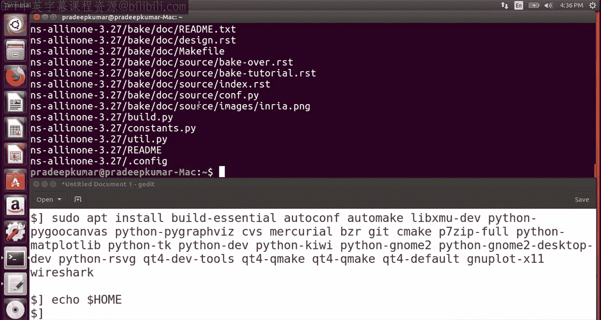

Ssum this year。So let me go inside the folder N1 3。27。 So after that I checked it here。

 So there is you can see that there is a file in green color that builded r P So I'm going to build using this file only So please remember N3 uses two languages C plus and Python。

 So if you are aware of N2 n2 uses two languages Tcl and C plus So the front end will be taken care by the t and the back end will be algorithms running in the back end C plus So you need both languages for doing a full fled research。

 here in N3 either you need Python or you need c plus you might not need both of the languages even instead of time。

 So if you know only Python you can play around only with Python without bothering about c plus if you know c plus plus you can play around only with c plus need not bother about the python。

 So that's added advantage that N3 have So now I am going to build this。

 So directly you can use dot bided rp So dot plus within the current error。

D slice is a is a simple command that indicates it is a current directory So within the current day I have a x double file colors builder P and if you want to enable all the examples double hyphen enable。

Examples。Then enable if you want to enable all the test that NS3 provides。

 then you can use it So please see this dot slash builder at Py enable examples and enable test。

 So Python syntax indicates that So you need to have enable before enable you can see there is a double hyphen and after there is a single hyphen。

 So this is how the Python installular variable will show it off So let me paste it here So you can use this。

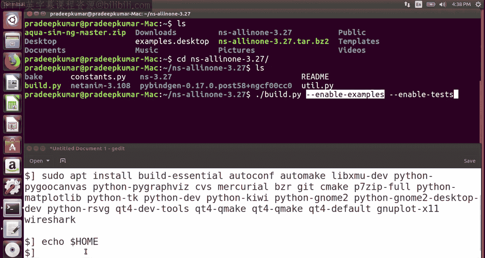

And。

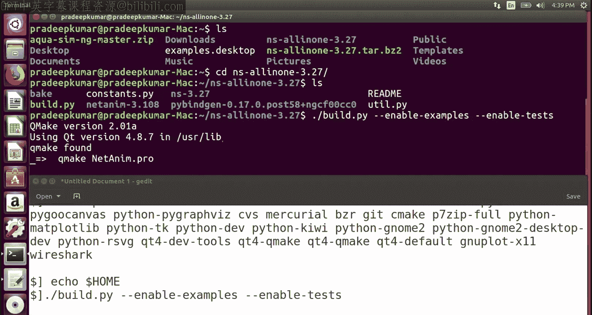

Once it is done， it starts comp the complete it starts building the complete NS3 modules。

But here the time taken will be more time it will take because I am just running this Udo is on a virtual machine I am running so that has just 1 gbM but my hard disk is on a solid straight drive SSD So it should be equivalently fast but when the software is been installed it takes much time I only tried it it take much time because running on a VM So even for a conventional machine if you are installing for the first time this NS3 will take at least 15 to 25 minutes it takes for the complete installation of NS3 So we have to be patient enough so。

What I do is Ill be showing you how many packages it will be installing so shortly you will get the number on the screen that these many packages will be installed So it takes some time so till the time I won't be running this video or I won't be running this record I'll be switching of this record So after the complete installation Ill come back with the recording option so let me。

S you。What。How many number of packages did the industry uses。So， industry builds。So many package。H会。

Mty in the elbow commander。So I am telling you since I'm running the virtual machine。

 So if you are preferring virtual machine over the conventional machine。

 you will be struggling a lot when you want to build your industry for the first time a subsequent time when you want to redo the process so you always advise you to go for a full fl device if you work on a research so don't think that it will be losing your windows so you can install in Linux parallel along with the windows on learning and do so here comes so we can see that there are totally 2704 package will be installed and this package will be built one by one。

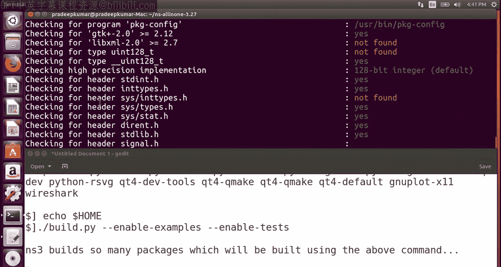

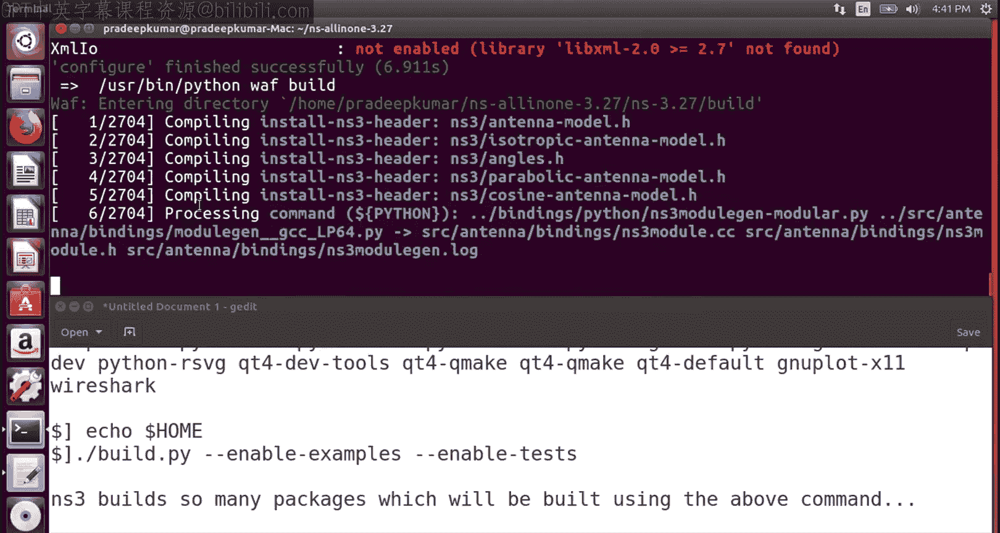

So it takes， as I said earlier， it takes around 20 to 30 minutes。

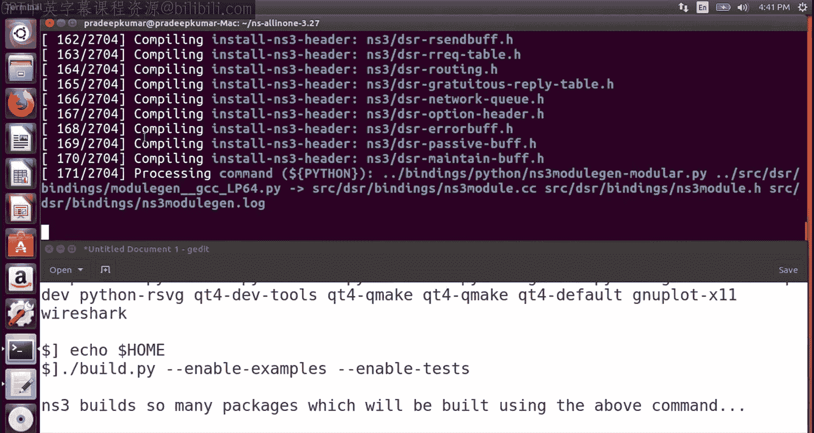

To your next on AVM。 So let me come back afterwards。 Thank you。系。说。

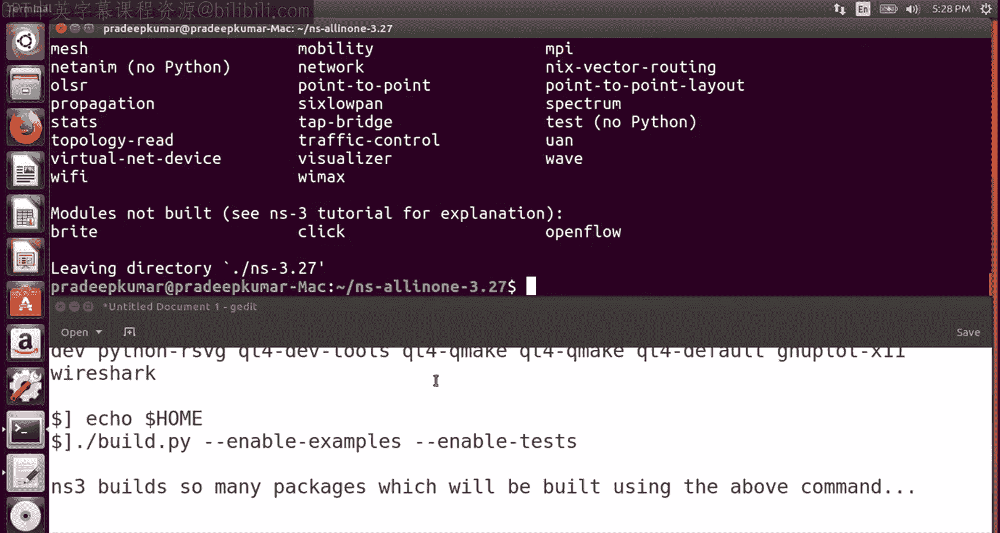

NS3 is installed successfully here， so you can able to see this here then is list of models builds that on the bridge the code the DSDV or D。

 So whatever the models of built everything will be shown here at NS3 So this indicates that the complete buildup all the packages in NS3 have been successfully done and there are some models which are not been built the forizable bright click and openflow So if you are planning to work your research on software defined networking and network function visualization。

 then you can prefer to go for openflow of the third party tool that you can configure it for N3 that's a separate instruction available you can refer w do NSs name do co and click is on of software model or router that also can be built separately and B is from university that they have developed a package for。

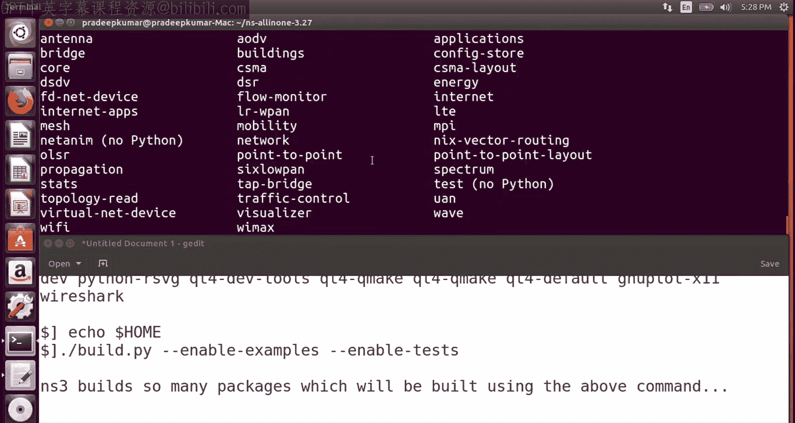

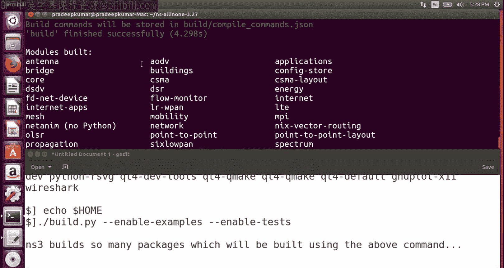

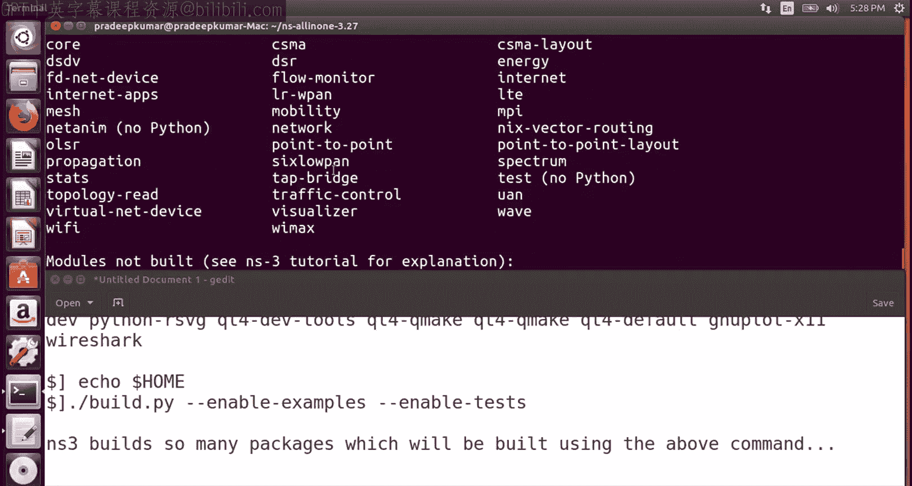

N S 3。 So now this is done。 now to check whether my applications are working or not。

 So I have some applications。 So what we do is we just go to N S 3。27。

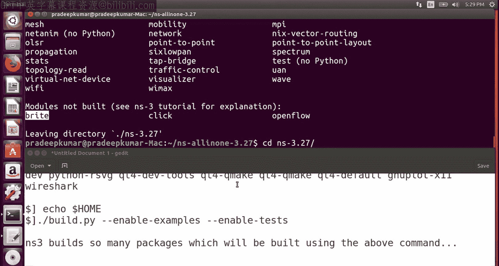

So this is the folder structure you can see this here so I have installed in home Predumma is my home folder in this in this I have unzipped this folder all in one 3。

27 inside then I have N 3。27 is directory So inside that only I have all this source everything available so this is a folder where we have SRC means it is a source folder where all the source algorithms protocols everything will be available inside the source folder。

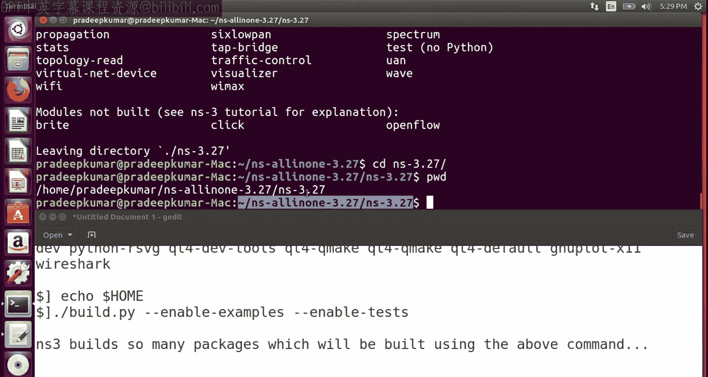

And there is examples available here So in the example there are some basic tutorials available。

 you can try this and there's a folders called a scratch So whatever application you develop in NS3 if you want to run it if you want to run it or see the output of it or get get the performance of it you have to move the corresponding file to scratch folder only then it will be simulated because the scratch folder have a special permission in NS3 that whatever you put inside this can be executed so far example。

Now you do an application。 So W。 So this is the W is one of the built method available for running all the applications。

 Since though it is having a dot CC file， we do not have any a or out or anything。

 So NS3 uses a different application framework call v framework。 So dot slash w。Double hephone run。

Scratch。So maybe I can use and without this。Pelloered。

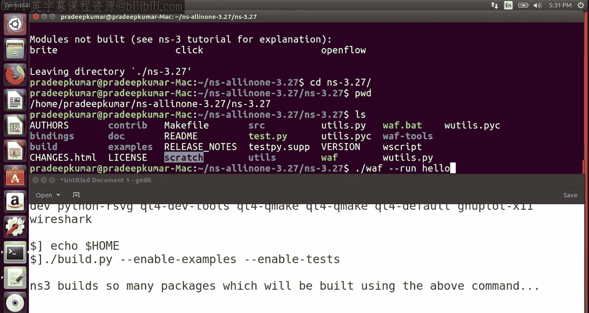

hellello Sulator。 I think let me check it。

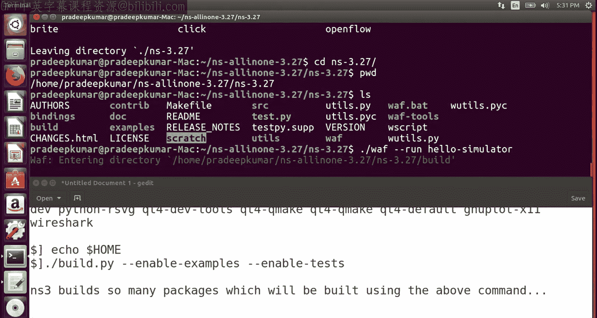

Yes， so ho simulator。 So now this is a simple file that says that when I want to run this example。

 double hyphen run ho simulator is one of the name of the application that to check whether it is working or not So it the build finished successfully So it shows that it is hal simulator。

 So that means the application of NS3 is itself successfully and there is an application also been an example also been executed for example there is a folder called as examples。

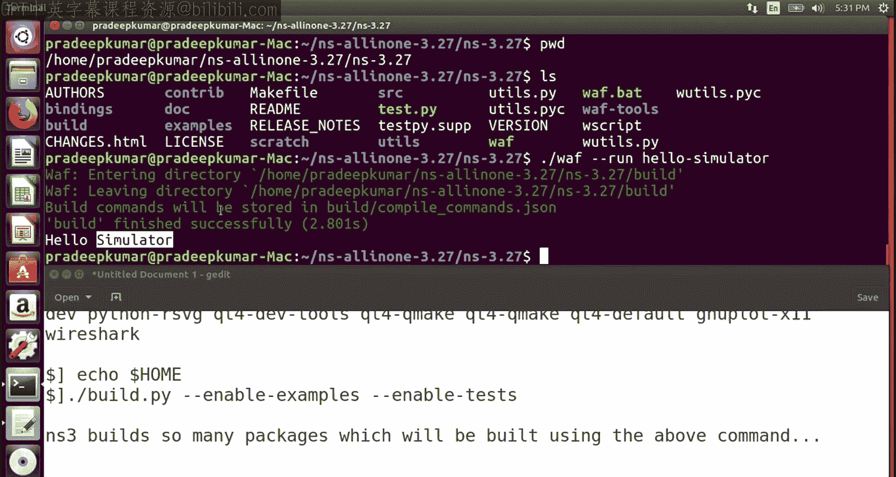

Under examples， we have a filing other tutorial。In the folder is So in the folder。

 we have some examples， we can see first startcc， second Rcc，7 Rcc。

 third there are up to seven examples， and there are some examples on pythons So first R P。

 third R P second R P。 So we have some pythons available。

 So what I do is I move this file first startcc。And first at Py into the scratch folder。

 So what do I do is I'll just move this。CP first dot star。Both the python on the C file。

Previous folder， previous folder， scratch。 So I move both the files to scratch folder。

 So in this scratch folder。 So when I want to run it， Ill just， I just have to come to this N S 3。

2 zone folder。 Now， you might be annoying that we I am using this N S 3。2 zone folder frequently。

 This is a place that we can able to run our examples。 Now， for example， to run。

C plus plus file and a Python file。 we have different syntax So far I am running a C plus plus file now。

这没有雷D铁。啊。主人呢。Dot CC file。Here's the commander。The command is。Dot slash W， double hypphone run。

 scratch A C R A T C， H， slash the name of the file。So you need not specific with extension。

 No one need to。Sp that。X正程。So this is what the command。 So now I write it here， run。Scratch， first。

So when I end this。So it will be compelling because these values is running for the first time。

 it will compel the corresponding。Fs available in NS S3 repository。

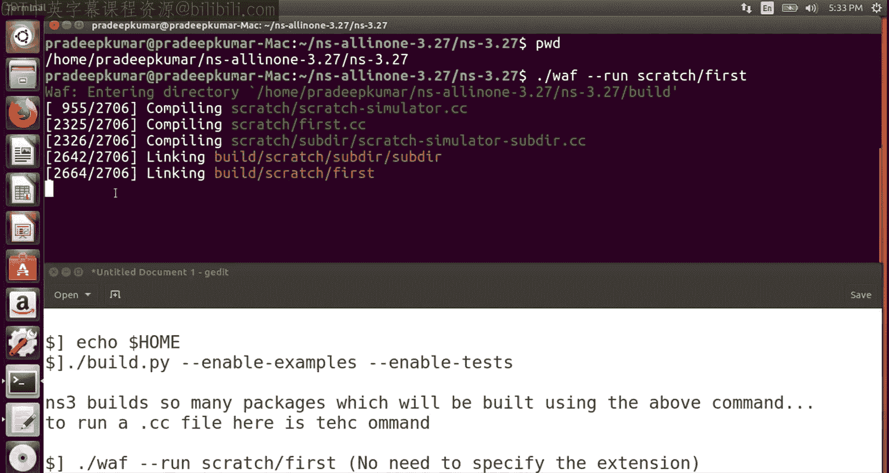

So after it is done now we can see this here at time to against clients and this many bytes to port number at time this many received from this port under client so it is a two nodes node0 node one they are changing some information between them it is a peer to peer network。

So an application is being shown here。 And this is what the output of the the typical network application。

 So this is for running C plus plus5。 So now the same thing to run。

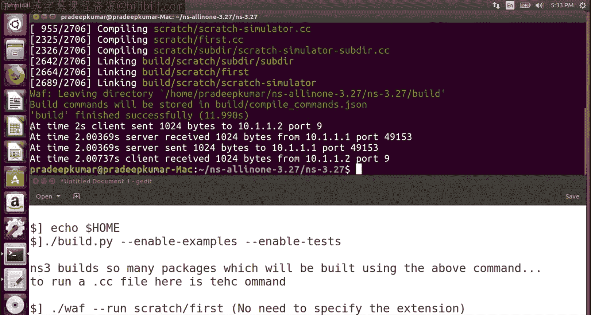

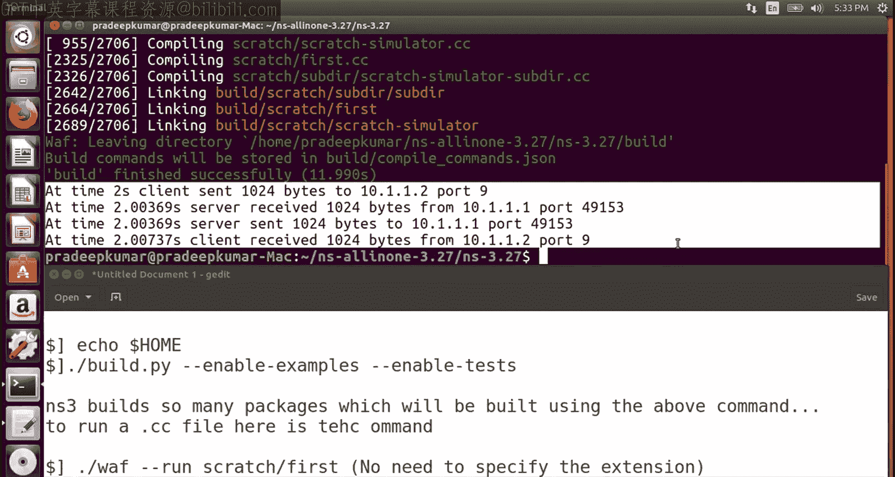

你摆单肥。The command is slightly in different double i v I mean do slash wave double i pyon。

 so pyon is for Python run。Scratch， slash。First to not P。 So here we have the specify extension。So。

We need to。Specificallyec the exson。

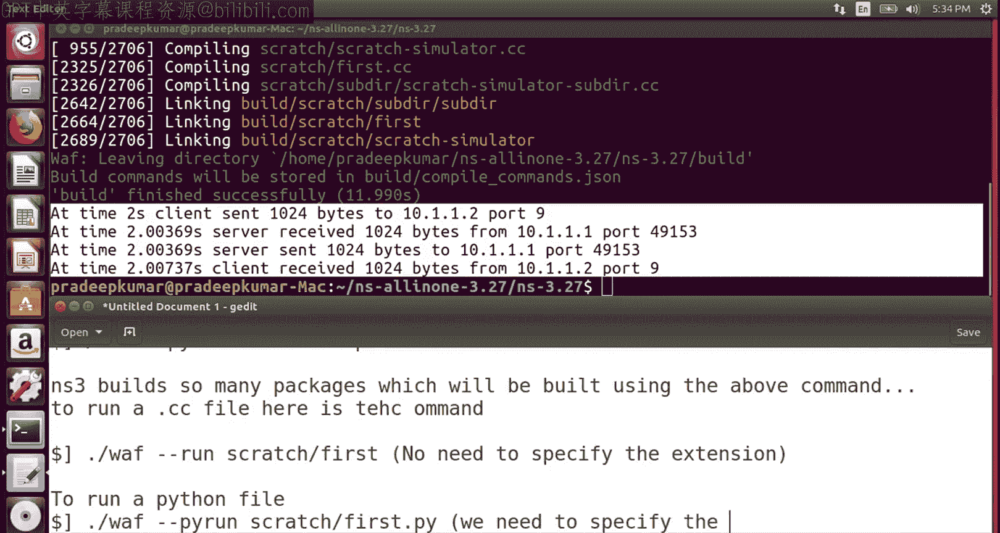

So let me run it here the same example because they have given how C plus Pthon differs the same example you can see in not slash wave。

Wle 바이라는。Scratch， faster R。

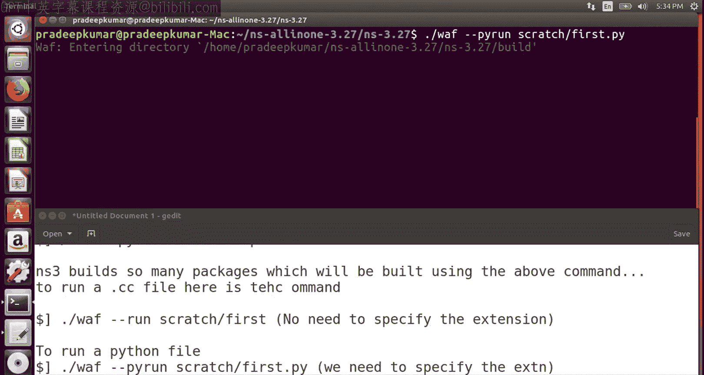

Yes， no， the same example。 Now， it is running in Pycon。

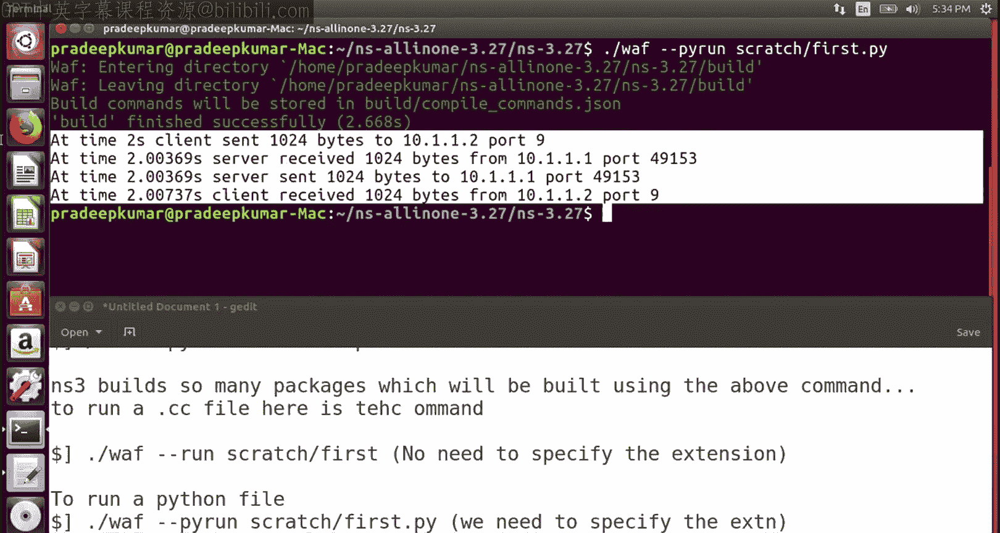

Okay， so this is a difference。 But for example， if I try something wrong here in web A A fund run。

 scratch first to dot C。When type first at CC here rather than without I need not specifying any extension here。

 but I am specifying it so you will be shown an error like this So see that it shows a massive error。

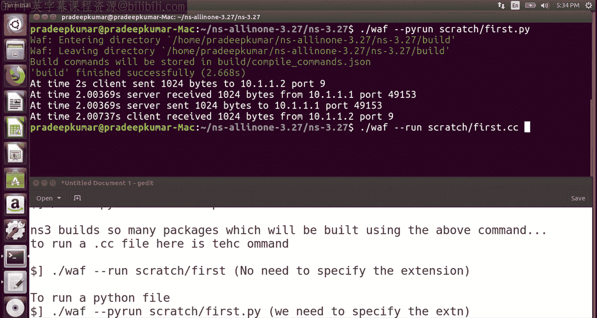

But you cannot。Recollect it。 So assume if you get an error like this in that color。

 you understand that you provided something wrong in the command。

 so try to change the command similarly。First in now for dot P， I' am not giving dot P。

Hiss Python Pran， but only first。In this case also it is saying error the user bin Python cannot open file scratch first because it needs a file with the name a dot P so if it doesnt provide then it will give a code like this so please remember for C plus+ you need not provide any extension but for Python you should provide extension the running command is Pyon and here there it is run。

说。That's all about the basic installation of。Industry， So industry installation is over。So。

 please defer。My websites。In us name dot com for more details。Also。Subscribe to my channel。

YouT dot com slash t。 So this is my channel。 You can subscribe for it。

 So you have any queries you can always ping me either through my blog or through my website。

 So thank for giving your time。 Thank you very much。

