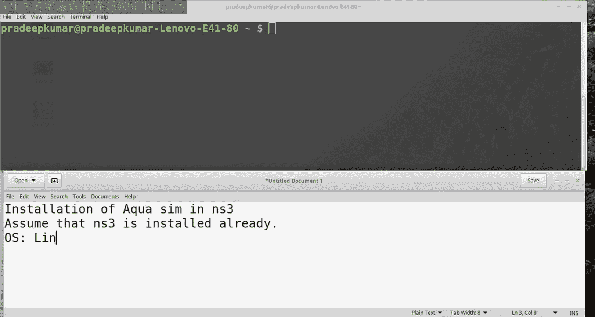
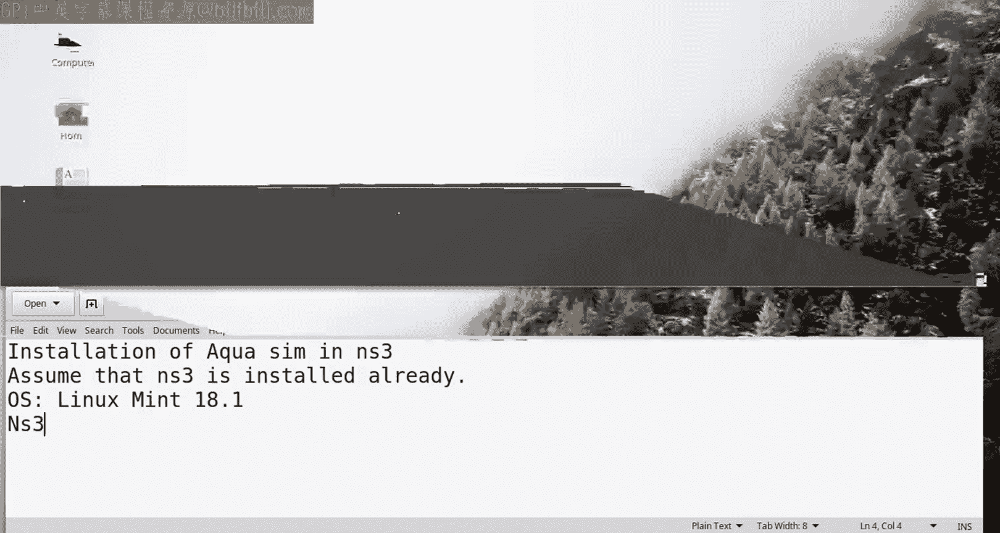
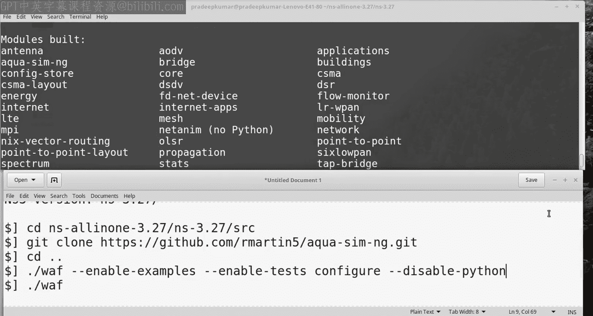
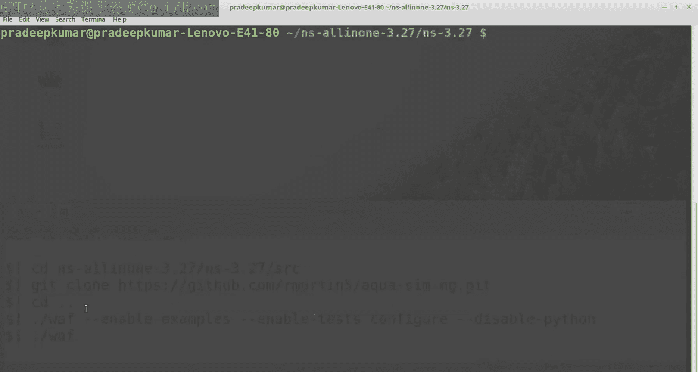
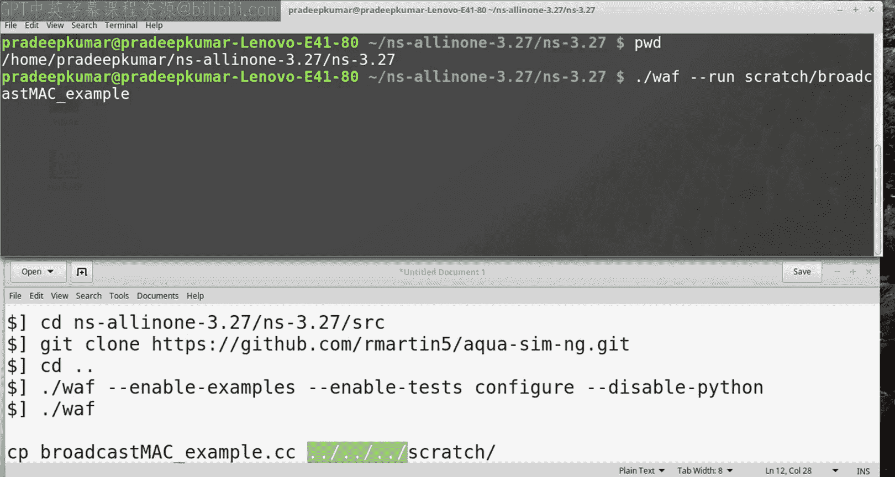

# NS3教程：04：在NS3中安装与使用AquaSim-NG水下网络模拟器 🐠

## 概述
在本节课中，我们将学习如何在网络模拟器3（NS3）中安装AquaSim-NG，这是一个专门用于模拟水下传感器网络的扩展模块。我们将从安装步骤开始，逐步介绍如何配置、编译并运行一个简单的水下网络广播示例。

---

## AquaSim-NG简介与背景
上一节我们介绍了NS3的基本安装，本节中我们来看看AquaSim-NG。AquaSim最初是为NS2开发的，主要用于水下传感器网络研究，支持**二维**和**三维**模型。由于操作系统更新，原版AquaSim在Ubuntu、Linux Mint等系统中兼容性不佳。近年来，AquaSim-NG作为新一代版本被开发出来，专为NS3设计，支持多种介质访问控制协议和基于向量的转发算法。





---

## 安装前提条件
在安装AquaSim-NG之前，必须确保NS3已经正确安装在系统中。本教程基于**NS3版本3.27**，在Ubuntu 16.04或Linux Mint 18.1系统中测试通过。虽然最新版NS3 3.28尚未官方测试，但通常也能正常工作。

---

## 安装步骤
以下是安装AquaSim-NG的具体步骤：

### 1. 进入NS3源代码目录
首先，打开终端并进入NS3的源代码目录。假设NS3安装在用户主目录下：
```bash
cd ~/ns-3.27/ns-3.27/src
```

### 2. 克隆AquaSim-NG仓库
使用Git克隆AquaSim-NG的源代码仓库。**必须确保文件夹名称为`aqua-sim-ng`**，否则可能导致编译错误：
```bash
git clone https://github.com/martinif/aqua-sim-ng.git
```

### 3. 配置与编译
返回NS3主目录并运行配置脚本。如果遇到Python绑定错误，可以添加`--disable-python`选项：
```bash
cd ~/ns-3.27/ns-3.27
./waf --enable-examples --enable-tests configure
```
如果出现错误，尝试以下命令：
```bash
./waf --disable-python --enable-examples --enable-tests configure
```

### 4. 编译模块
运行编译命令。如果NS3已预先安装，此过程将较快完成：
```bash
./waf
```
编译成功后，终端会显示`aqua-sim-ng`模块已成功构建。



---



## 运行示例程序
AquaSim-NG提供了多个示例程序。以下是如何运行一个简单的广播MAC层示例：

### 1. 复制示例文件
进入AquaSim-NG的示例目录，将广播示例复制到NS3的`scratch`文件夹：
```bash
cd ~/ns-3.27/ns-3.27/src/aqua-sim-ng/examples
cp broadcast-mac-example.cc ../../scratch/
```



### 2. 运行示例
返回NS3主目录并运行示例程序：
```bash
cd ~/ns-3.27/ns-3.27
./waf --run scratch/broadcast-mac-example
```
程序运行后，终端会显示节点创建、位置初始化及广播过程。这是一个基础的水下网络广播示例，展示了节点如何在水下环境中通过广播建立网络连接。

---

## 总结
本节课中我们一起学习了如何在NS3中安装和配置AquaSim-NG水下网络模拟器。我们从背景介绍开始，逐步完成了环境准备、源代码克隆、模块编译和示例运行。AquaSim-NG为水下传感器网络研究提供了强大的**三维模拟**支持，适用于各种介质访问控制和路由协议测试。

通过本教程，你应该能够成功安装AquaSim-NG并运行基础示例。后续课程中，我们将深入探讨更复杂的水下网络模拟场景和性能分析方法。