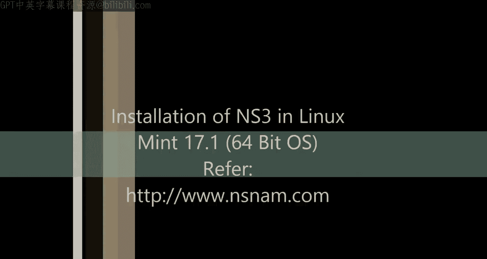
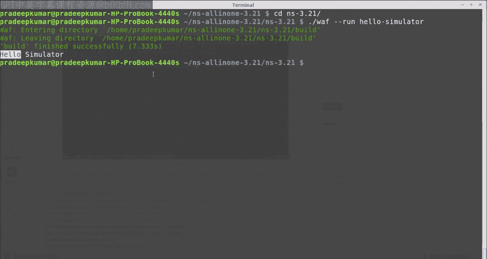

# NS3教程系列：1：在Linux Mint中安装NS3 🖥️



在本教程中，我们将学习如何在64位的Linux Mint 17操作系统中安装网络模拟器NS3。NS3是一款使用C++和Python编程的软件，用于模拟或仿真特定的网络，例如有线网络、无线网络、4G/LTE网络、3G蜂窝网络等，适用于多种网络应用场景。

## 概述 📋

开始工作前，首先需要更新系统。如果这是您首次安装Linux，使用更新命令可以确保所有包管理器得到更新。根据您的网络带宽和速度，此过程可能需要一到两分钟。

更新完成后，需要安装一些基础软件包。以下是安装NS3所必需的核心包。

## 安装必备软件包 🔧

首先，我们需要安装包含完整配置、GCC编译器、X11图形界面编辑器以及开发工具的基础包。随后，安装NS3所需的特定软件包。

以下是需要安装的软件包列表：

*   mercurial
*   bzr
*   gdb
*   valgrind
*   gsl-bin
*   libgsl2
*   libgsl-dev
*   flex
*   bison
*   libfl-dev
*   tcpdump
*   sqlite
*   sqlite3
*   libsqlite3-dev
*   libxml2
*   libxml2-dev
*   libgtk2.0-0
*   libgtk2.0-dev
*   vtun
*   lxc
*   libc6-dev
*   libc6-dev-i386
*   libcli-dev
*   libssl-dev
*   libssl0.9.8
*   libssl1.0.0
*   libsctp-dev
*   libsctp1
*   lksctp-tools
*   git
*   cmake
*   libc6-dev-i386
*   libstdc++6
*   g++-multilib
*   python-dev
*   python-pygraphviz
*   python-kiwi
*   python-pygoocanvas
*   python-gnome2
*   python-rsvg
*   python-setuptools
*   autoconf
*   automake
*   libtool
*   pkg-config
*   libboost-all-dev
*   libboost-filesystem-dev
*   libboost-program-options-dev
*   libboost-system-dev
*   libboost-thread-dev
*   libxmu-dev
*   libxmu-headers

这些软件包总计下载量约为8MB，解压后约为40.3MB。使用以下命令进行安装：

```bash
sudo apt-get install mercurial bzr gdb valgrind gsl-bin libgsl2 libgsl-dev flex bison libfl-dev tcpdump sqlite sqlite3 libsqlite3-dev libxml2 libxml2-dev libgtk2.0-0 libgtk2.0-dev vtun lxc libc6-dev libc6-dev-i386 libcli-dev libssl-dev libssl0.9.8 libssl1.0.0 libsctp-dev libsctp1 lksctp-tools git cmake libc6-dev-i386 libstdc++6 g++-multilib python-dev python-pygraphviz python-kiwi python-pygoocanvas python-gnome2 python-rsvg python-setuptools autoconf automake libtool pkg-config libboost-all-dev libboost-filesystem-dev libboost-program-options-dev libboost-system-dev libboost-thread-dev libxmu-dev libxmu-headers
```

## 下载并解压NS3 📦

所有必备软件安装完成后，现在可以安装NS3本身。我们将使用最新的稳定版本ns-3.21。

使用以下命令下载并解压NS3压缩包：

```bash
wget https://www.nsnam.org/release/ns-allinone-3.21.tar.bz2
tar -xjvf ns-allinone-3.21.tar.bz2
```

## 构建NS3 🛠️

解压完成后，进入解压后的目录并开始构建过程。构建过程会启用示例和测试。

```bash
cd ns-allinone-3.21
./build.py --enable-examples --enable-tests
```

此过程需要一些时间，系统会预先检查所有必需的软件。大约有224个主要软件包将被安装和配置。整个构建过程大约需要11分16秒，请耐心等待。

构建完成后，您可能会看到一些模块（如网络可视化器`visualizer`）未被构建，但核心的网络模块（如`aodv`、`csma`、`dsdv`、`energy`、`internet`、`wifi`、`wimax`、`lte`等）应该都已成功构建。

## 验证安装 ✅

为了验证NS3是否安装成功，我们可以运行一个简单的示例程序。

首先，清理终端屏幕，然后进入ns-3.21目录下的示例文件夹：

```bash
clear
cd ns-3.21
```

运行一个基础的示例脚本，例如`hello-simulator`：

```bash
./waf --run hello-simulator
```

该示例基于Python绑定运行。执行后，如果终端显示“Hello Simulator”等相关输出，则表明NS3安装成功。




## 总结 🎯


在本节课中，我们一起学习了在Linux Mint 17系统中安装NS3网络模拟器的完整步骤。我们从系统更新和安装必备开发工具开始，然后下载并解压了NS3的源代码包。接着，我们通过构建命令编译了NS3的核心模块，并最终通过运行一个简单的示例程序验证了安装是否成功。现在，您的环境已经准备就绪，可以开始探索NS3提供的各种网络模拟示例和功能了。