# Engineering Clinic《网络模拟器3教程｜Network Simulator 3 Tutorial Series》中英字幕deepseek翻译 p19 -19-Dynamic source routing (DSR) _ Week 6.zh_en -BV1aQmtYZEPr_p19-

Yeah。Hi learners， welcome to engineeringer Clinic the elements of network simulation。

So in this session， we are going to see a protocol called us dynamic source root。

 The name of the protocol is。Dynamic。搜拾饼。In short， we call it as T SR protocol。

So this protocol have these facilities， number one is。It is self organizing。Number two。

 it is a reactive routing protocol， so reactive routing means whenever the route is have to be created。

 it will select a route according to the nearby nodes。Number 3 is it is for multihub networks。

It different notes， it will just go。Then。It has two methods， on this。ro discovery。

The other is route maintenance。It maintains the road into different methods。

 around discovery and road maintenance。Road maintenance， usually。

 it will take care of the lu free roing。This is what it will be doing in the route for road maintenance。

 the route discovery it will compute the route。

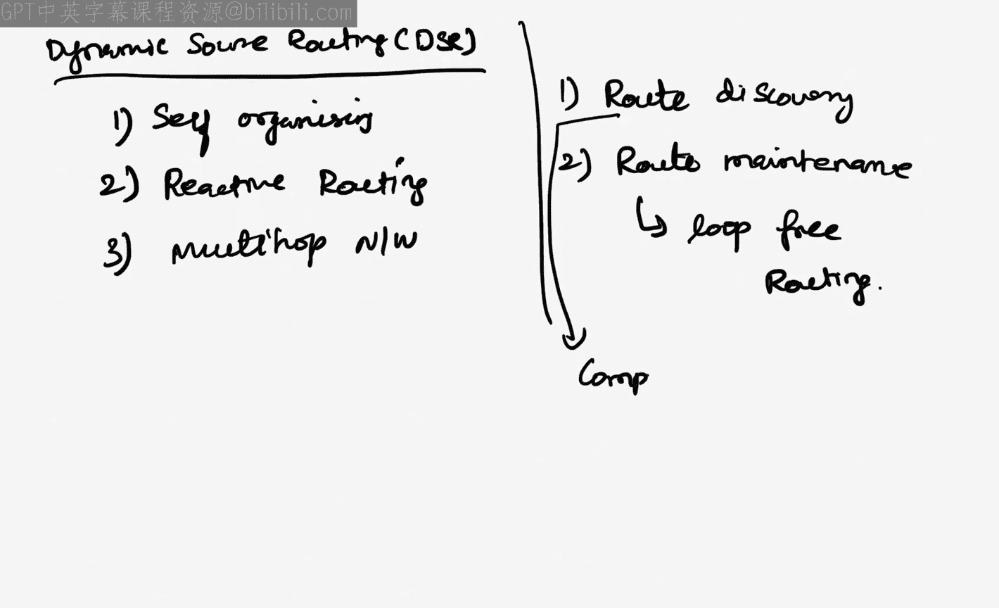

Computer。Okay， now in this case， let's say the scenario will see how the DSR works。

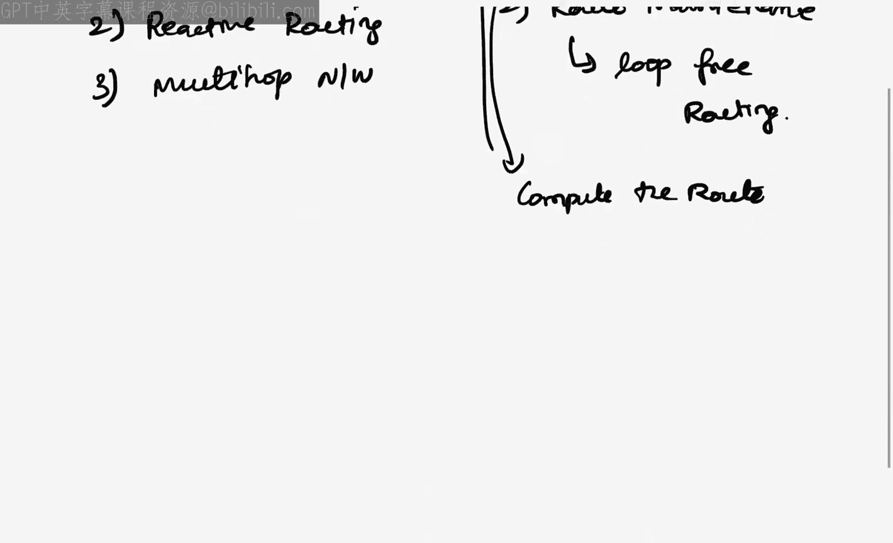

Okay， so in the DSsR， what it will do is let's say I have a note number 0。I have no number 2。

I have note number  three， let's say note number 4。Note number 5。Note number 6。Note number 7。

And note number 8。Hd number 9。H down number 1。Lets say I want to fix that d as a destination and the node0 is a source snow。

So this is how the way the packet has to be transmitted。So， what I do is。

I will select the packets here accordingly， So now since it is all the nodes are been organized the packet should be going from is to D or another way we have go from0 to 6 the path has to be compute from0 to 6 okay so which hour path will be finding out So first the source node will feel that it doesn't know that the value so it will send three values Okay so it will send value to node2。

Not for。Un node 8。 So all the three node are nearby notes。 it will send three packets。

So the packet contains the data like this。So data will be having unique I。

The source node that the destination of unique IDd is let say take assembled of 5 as the unique IDd that is a notice 086。

Similarly， this also gets 5，0，6。Then 5，0，6。So this is how the way all the three nodes will be getting the packet Now。

 once node number two receive， it will just check who is a reation it is 6 and what is the source node it is 0。

 So this packet is calledless。あらい曲。We called us a route request。So route re is a packet。

 which is been sent like this。Okay， now what happens。

 this note number two will send a packet to its destination。 I mean， it is near neighbor node。

We'll send the packet here。And there are only two nodes， so5 is maybe far away from node to2。

 so it may not be so in this case the packet whatever receive will be again the same unique kd5。Now。

 the destination is same6， but the path will be 0 co 2。So0 comato2 means it went0 here， it2 here。

 So0 comato2， Similarlyly， this node also receives a packet in this case now here。Fei。

That destination is 6 here， 0 comma。2 will be received here。

 Now this packet will be discard because already it has another packet with the same I number 5。

 if both are equal， then one of the packet will be discard。 So this packet will be discard Now again。

 note 4 also will send a packet to note number 5。 it will send a packet to note number 8。

So in node number  eight， it will send a packet like this again， the same I 5。Now， in this case。

 it will be 0 comma 4 and 6， it will be sending a packet similarly here。呃肥。0ero comma4 and 6。 Now。

 this node will be sent back here in this case， it will be finding out5。0，4，6， and 6。

 so when one distance these are equal。 it will fix as one of the roots。 So route number one is ready。

So the road number only is， but whereas in road number 3 and 7 and road number 3 and 6 also now3 and 3 and6 is equal。

 I mean， they are in range with each other， so 5。0 comma，2 comma 3。Then6。 So this case。

It will reach the packet。 Similarlyly，7 also will be sending a packet here one more packet this seven packet will be like this。

诶肥。0ero comma，2 comma， 3 comma 7。And six so this way the packet is base。

 So when all these packets are received that the node D will be having three things。

 So S2 D will be having as of now three roots we have computer。 So one thing is。

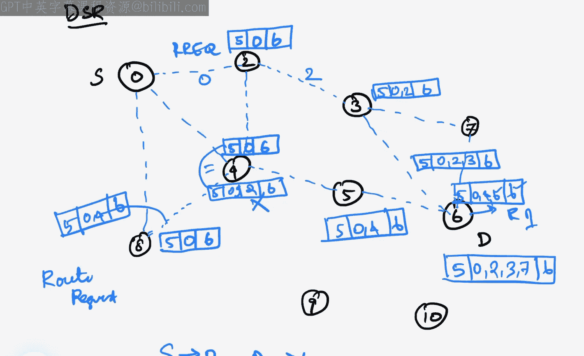

0。I mean。读。3。And 6。0，4。

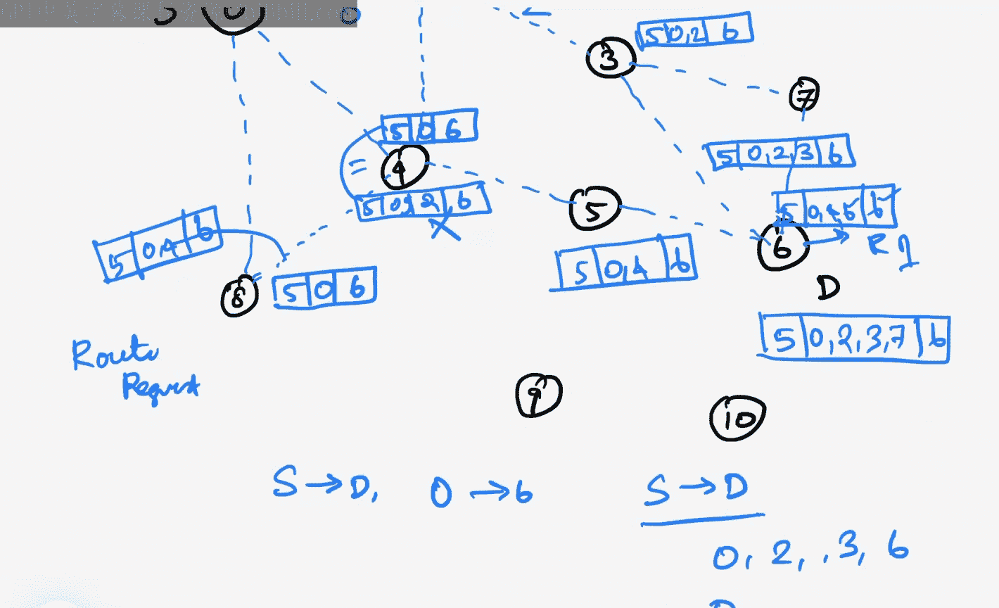

0，4，5，6，0，4。

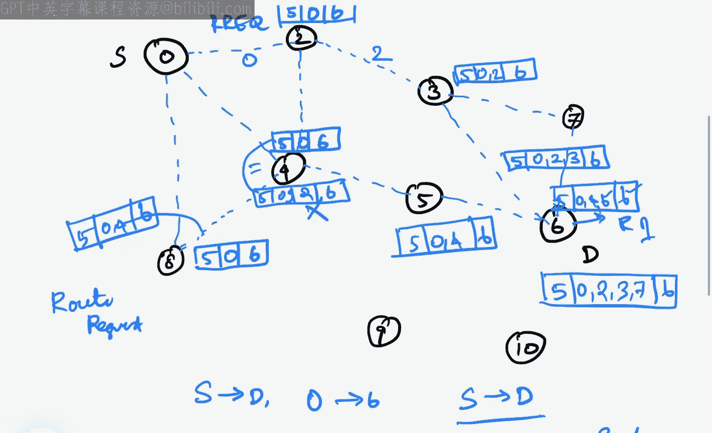

5 comma 6， then。0，2，3。7 and 6。Now， this is the way all the three routes are being computed。So。

 in this case what happens so either this route will be fixed or this route will be fixed。

 but in the DSR programming what happens in DSr it stores the all routes。

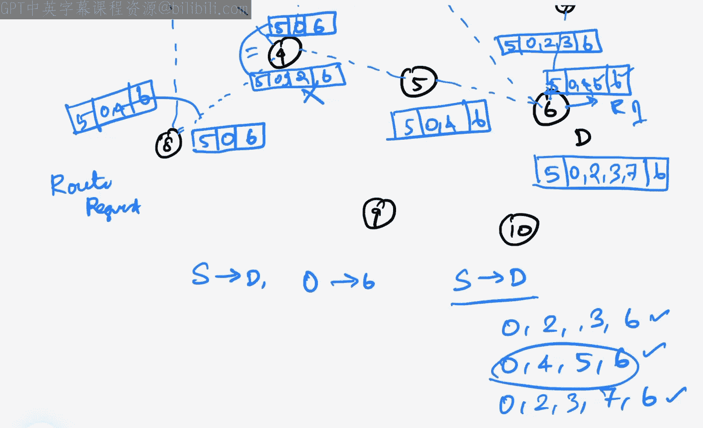

It stores。All routes are paths。We call it as roots our parts will be stored where it will be stored。

 it will be storing in a memory call as cache memory。So we have root cash and part cash available in。

Dr。So both will be stored so in the next point of time， for example。

 if this node number 5 is moving away from node 4 to 6 in that case the link between4 to 6 will be broken so in that case it will be alternatively taking this route as a second road。

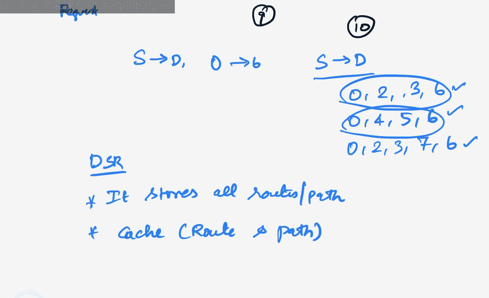

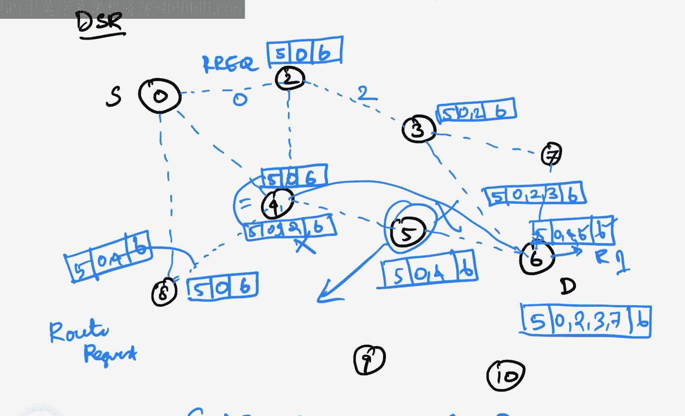

So always， the route will be fetch from the root cache。So， roots will be。Fed from the cash。

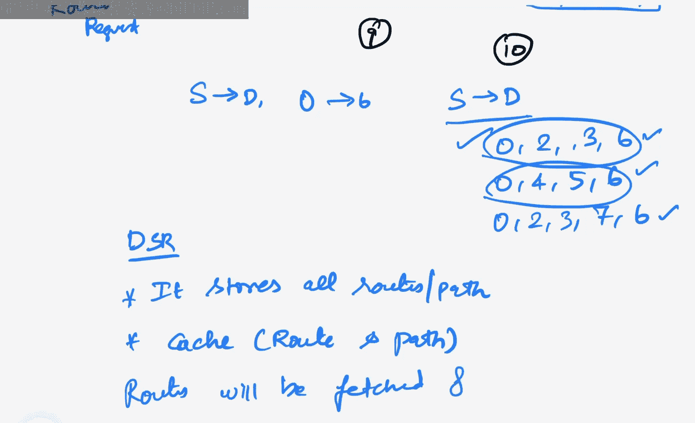

So this is why the DSsR is so complex because of the cache memory involved it is complex and complicated。

But。It is powerful protocol since it is reactive， the route discovery will be happening。

The next time when it is happening。Only when。All roots fell。Between a source and destination。Okay。

 so this is the simple explanation of how DSR will be working。 Okay。

 so thank you for watching this video。 Thank you very much。

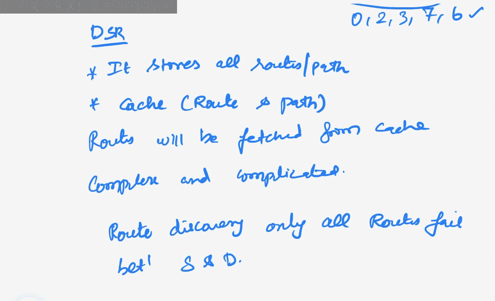

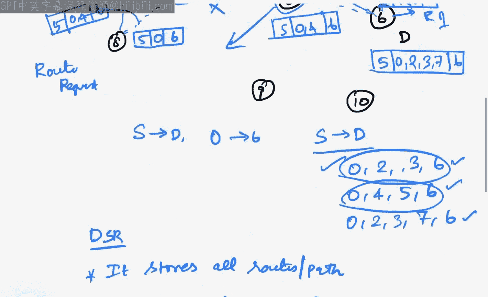