# 网络模拟器3教程：20：无线自组织网络

## 概述

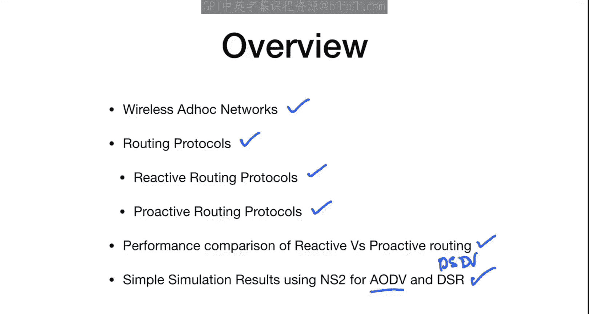

在本节课中，我们将学习无线自组织网络。我们将了解其定义、不同的路由协议分类、反应式与主动式路由协议的区别，并对AODV和DSDV协议进行性能比较和简单的模拟结果分析。

---

## 什么是无线自组织网络？🤔

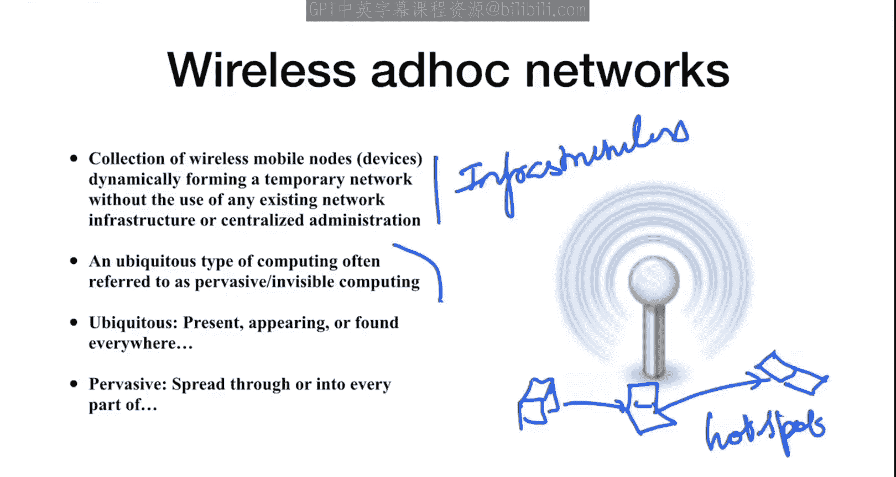

无线自组织网络是由无线移动节点动态形成的临时网络集合，无需使用任何现有的网络基础设施或集中式管理。

这意味着此类网络是无基础设施的。一个很好的例子是：你有一台笔记本电脑，其他几台笔记本电脑也带有Wi-Fi驱动。仅使用这几台笔记本电脑，无需任何接入点或路由器，它们就能形成一个网络。这就是我们所说的自组织网络。如何形成这种网络以及路由协议背后的挑战，正是无线自组织网络的核心。

这种无处不在的计算类型通常被称为普及或隐形计算。这种网络无处不在。一个现代的例子是使用手机热点。你可以使用Wi-Fi设备共享热点，这种热点网络也属于无线自组织网络的范畴。

---

## 自组织网络的特性 📡

自组织网络具有以下特性：

*   **自主协作**：设备需要在没有用户干预的情况下自主协作。网络中的所有节点都将自主运行。
*   **快速自组织**：如果特定节点出现故障，它们会自动形成替代路径或另一个网络。
*   **独立于基础设施**：如前所述，不需要接入点。没有接入点时，所有节点自行组成网络。
*   **异构性与自适应性**：节点可能来自不同制造商，具有不同的能量水平、介质访问控制协议，但它们仍然可以相互通信，并能适应网络行为的变化。

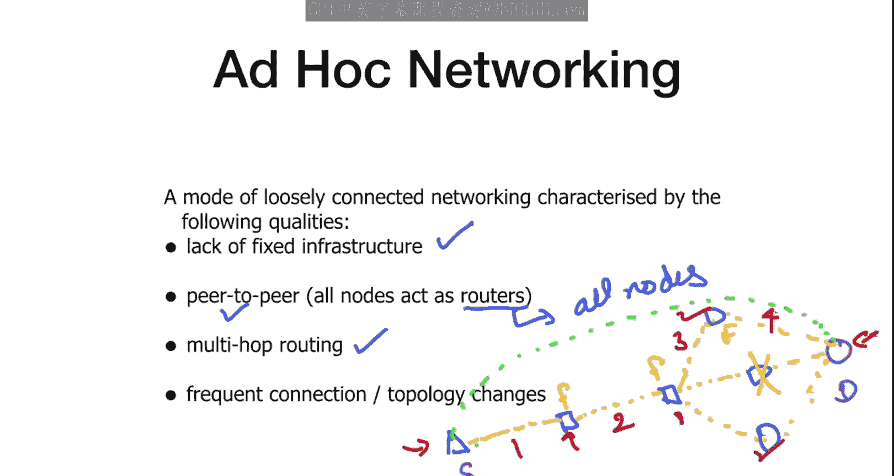

---

## 自组织网络面临的挑战 ⚠️

自组织网络设计面临多项挑战：

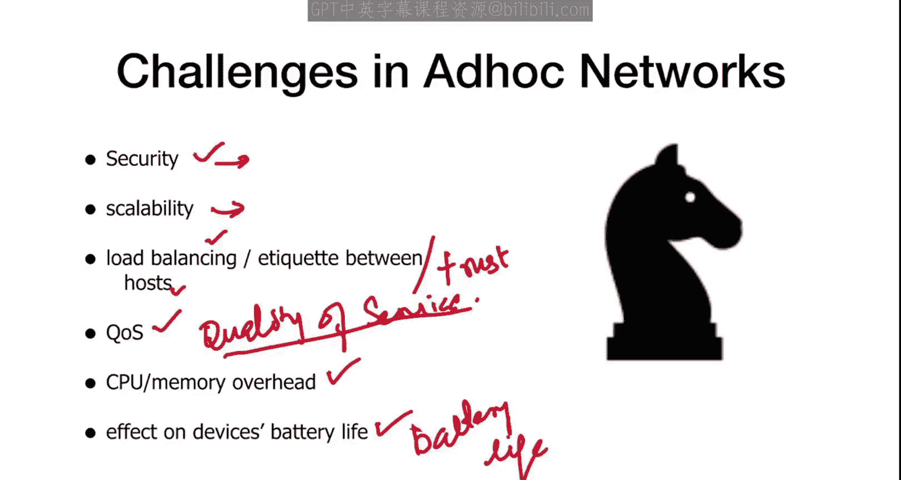

*   **安全性**：无论是信息安全还是网络安全，都是一个重大挑战。
*   **可扩展性**：随着网络中节点数量的增加，如何处理可扩展性问题。
*   **负载均衡**：主机之间的连接如何交换数据包。
*   **信任机制**：每个节点都有一个信任值。信任值高的节点会转发数据包，信任值低的则不会。
*   **服务质量**：无线网络通常服务质量较低，如何确保QoS是一大挑战。
*   **资源开销**：通常设备的CPU和内存资源有限。
*   **电池寿命影响**：设备电池能维持多久是至关重要的问题。

---

## 协议设计要点 🛠️

设计路由协议时必须考虑以下几点：

*   **分布式运行**：整个网络是分布式的，协议必须在分布式环境中运行。
*   **无环路路由**：源节点和目的节点之间的路径不应形成环路，数据包不应在环路中循环。
*   **支持多路径**：协议应能计算多条路由。
*   **快速建立路由**：协议应能快速找到有效路由。
*   **最小化开销**：在拓扑变化时，其通信开销应尽可能小。

---

## 主要路由协议分类 📊

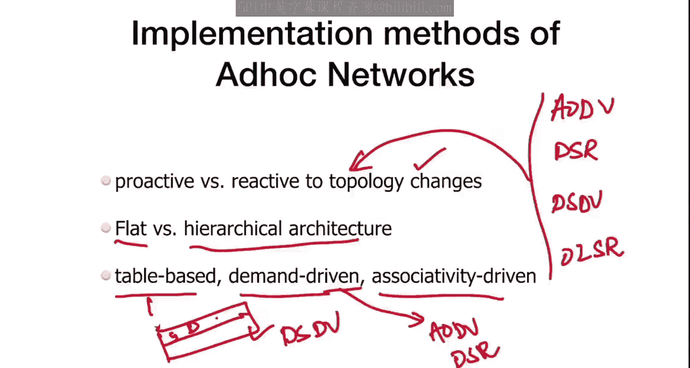

本课程主要考虑以下四种协议：**AODV**、**DSR**、**DSDV** 和 **OLSR**。我们将对这四种协议进行比较。

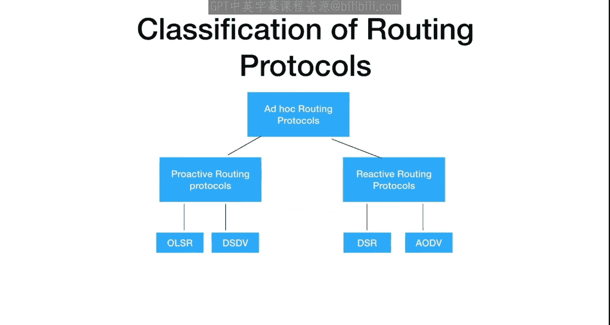

路由协议可以根据不同方式分类：
*   **对拓扑变化的反应方式**：主动式路由协议与反应式路由协议。
*   **网络架构**：平面架构与分层架构。
*   **驱动方式**：基于表驱动、按需驱动或关联性驱动。

例如，DSDV是基于表驱动的，而AODV和DSR是基于按需驱动的。

---

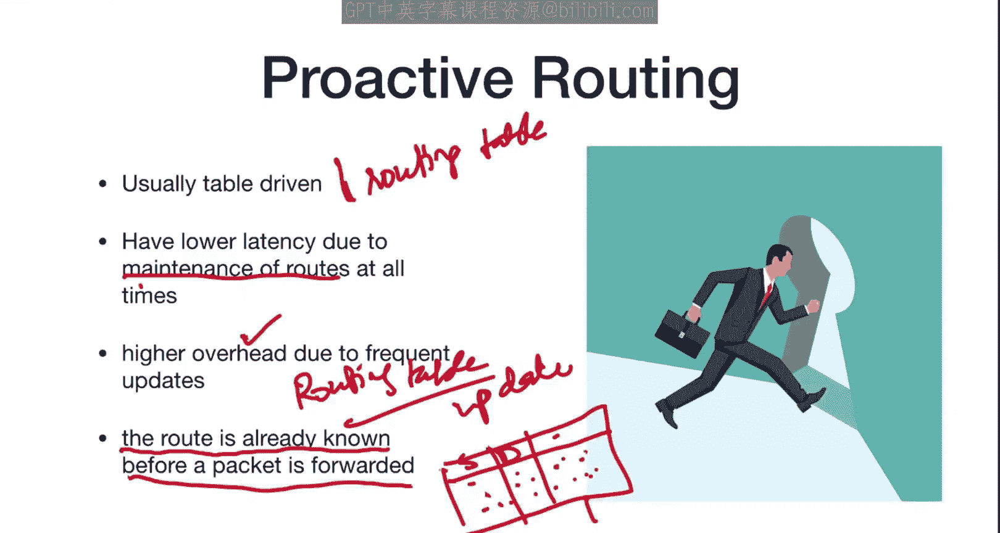

## 路由协议分类详解

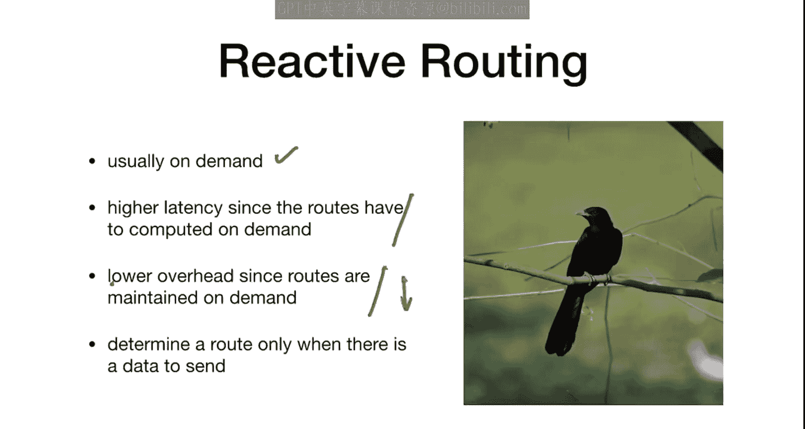

在分类中，**主动式路由协议** 包括OLSR和DSDV；**反应式路由协议** 包括DSR和AODV。接下来几周，我们将重点评估这四种协议。

---

## 主动式路由协议 🔄

主动式路由协议通常是**表驱动**的。这意味着数据包的转发基于预先计算好的路由表。

*   **路由预先计算**：在数据包需要转发之前，路由已经根据各种参数计算好并填入路由表。
*   **维护开销高**：由于需要维护和定期更新所有节点的路由表（例如当节点失效时），会产生较高的开销。
*   **延迟较低**：因为路由始终处于维护状态，所以数据转发延迟较低。

---

## 反应式路由协议 ⚡

反应式路由协议通常是**按需驱动**的。这意味着只有在有数据传输需求时才会计算路由。

*   **按需计算路由**：仅在需要发送数据时才确定路径。
*   **延迟较高**：由于需要临时计算路由，初始延迟较高。
*   **开销较低**：因为只在需要时才维护路由，所以开销相对较低。

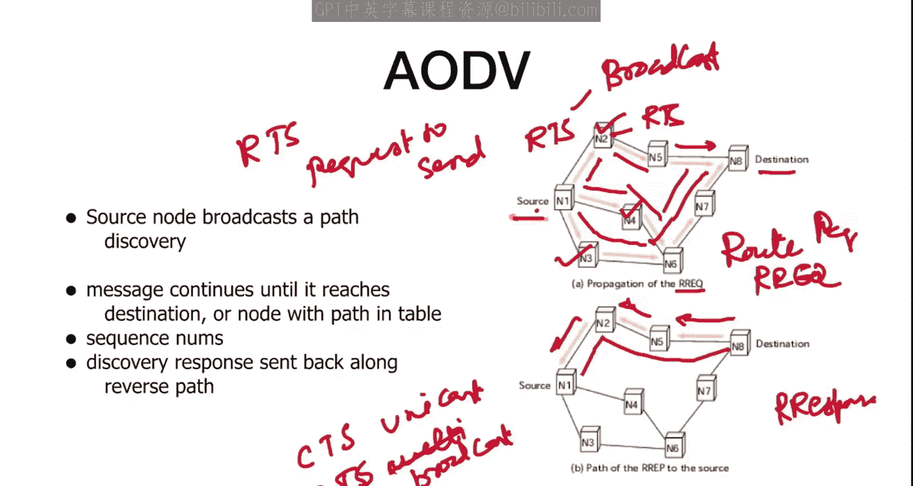

---

## 协议对比：AODV 与 DSDV

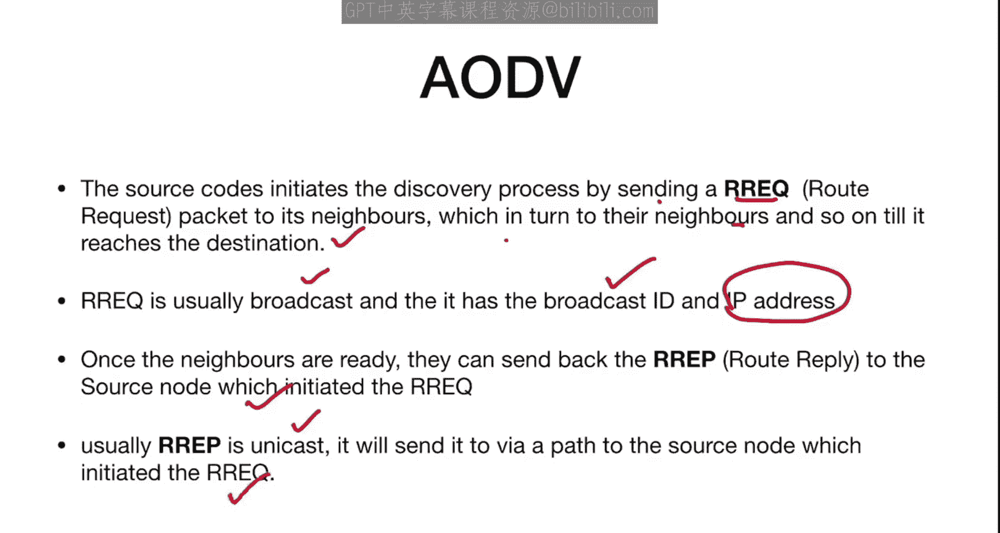

理解了主动式和反应式的区别后，我们可以更好地比较AODV和DSDV。DSDV是**目标序列距离矢量算法**，属于主动式路由。AODV是**按需距离矢量路由算法**，属于反应式路由。

此外，我们还有**动态源路由协议**和**最优链路状态路由协议**。我们将一起评估这四种协议的性能。

---

## AODV 协议工作原理

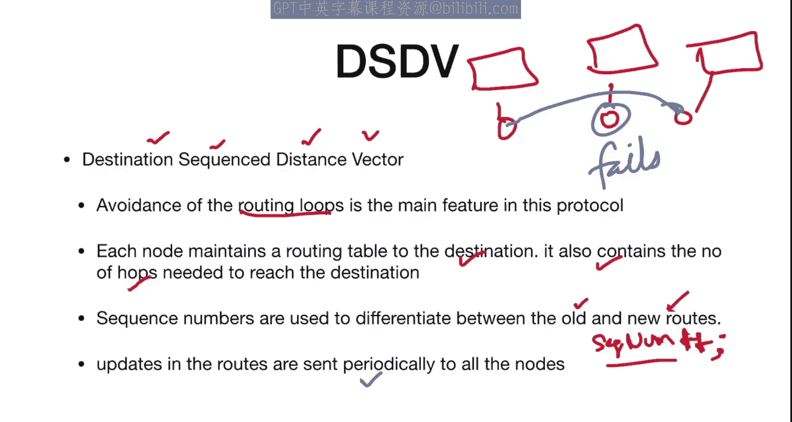

AODV完全是按需的、反应式的。在需要之前不会确定路由。每个节点都包含一个路由表，记录如何到达其他节点的下一跳信息。

**路由发现过程**：
1.  当源节点需要向目的节点发送数据但无可用路由时，会发起路由发现。
2.  源节点广播一个**路由请求** 数据包。
3.  邻居节点收到RREQ后，继续广播，直到到达目的节点。
4.  目的节点或中间节点（如果有到目的节点的有效路由）会沿着反向路径单播一个**路由应答** 数据包回源节点。
5.  源节点收到RREP后，便建立了到目的节点的路由。

RREQ使用广播，而RREP使用单播。路由选择通常基于最短路径或特定服务质量参数。

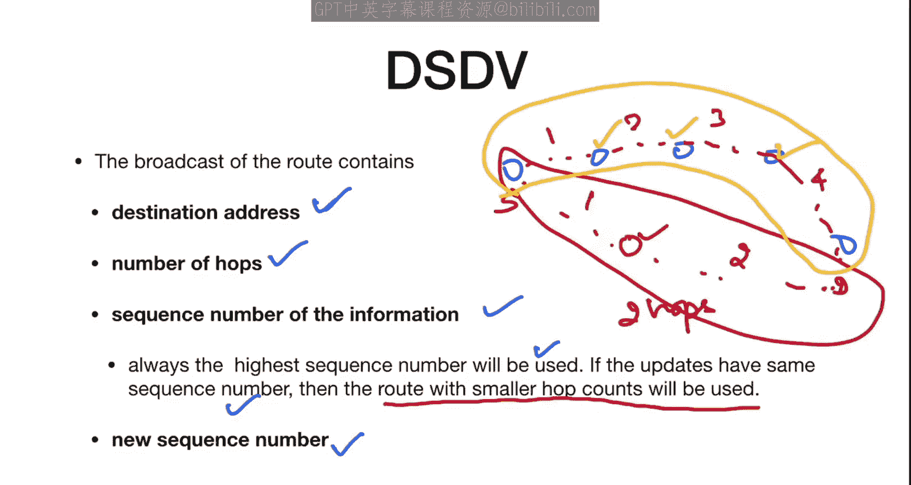

---

## DSDV 协议工作原理

DSDV是一种主动式路由协议，全称是**目标序列距离矢量**。它基于距离矢量算法，主要特点是**避免路由环路**。

*   **维护路由表**：每个节点维护一个到达所有目的地的路由表，包含所需跳数。
*   **序列号**：使用序列号来区分新旧路由，避免环路。序列号随更新递增。
*   **定期更新**：路由更新会定期广播给所有节点，以保持路由表的一致性。当节点失效时，更新信息会传播开来，但更新过程需要时间。

**路由选择**：广播更新包含目的地地址、跳数、序列号。优先使用序列号最高的路由；如果序列号相同，则使用跳数最少的路由。

---

## 性能比较 📈

我们将使用NS3详细进行性能比较。这里先概述一些性能特征。比较通常在10到100个节点的规模下进行，评估指标包括：

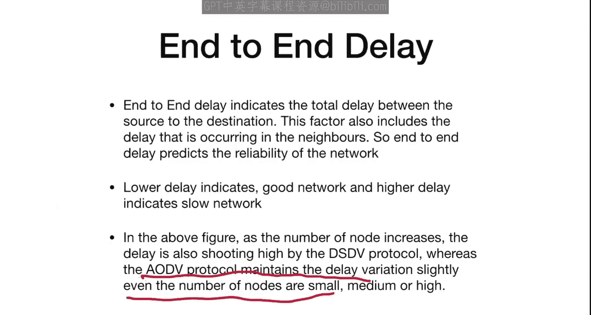

1.  **分组投递率**
2.  **平均吞吐量**
3.  **端到端延迟**
4.  **路由开销**

以下是AODV与DSDV的简要比较结果（假设图中红色代表AODV，绿色代表DSDV）：

*   **分组投递率**：AODV的PDR通常高于DSDV。高PDR意味着更高的网络可靠性。
    *   `PDR = (接收的数据包数 / 发送的数据包数)`
*   **平均吞吐量**：AODV的吞吐量（比特/秒）在多数情况下也优于DSDV，尽管在某些节点数量下可能存在波动。
*   **端到端延迟**：AODV的平均延迟显著低于DSDV。延迟应尽可能小。
*   **路由开销**：AODV的路由开销与PDR表现类似，在某些情况下可能略优于DSDV，但差异可能不大。路由开销指发送和接收数据包所产生的额外开销。

---

## 总结

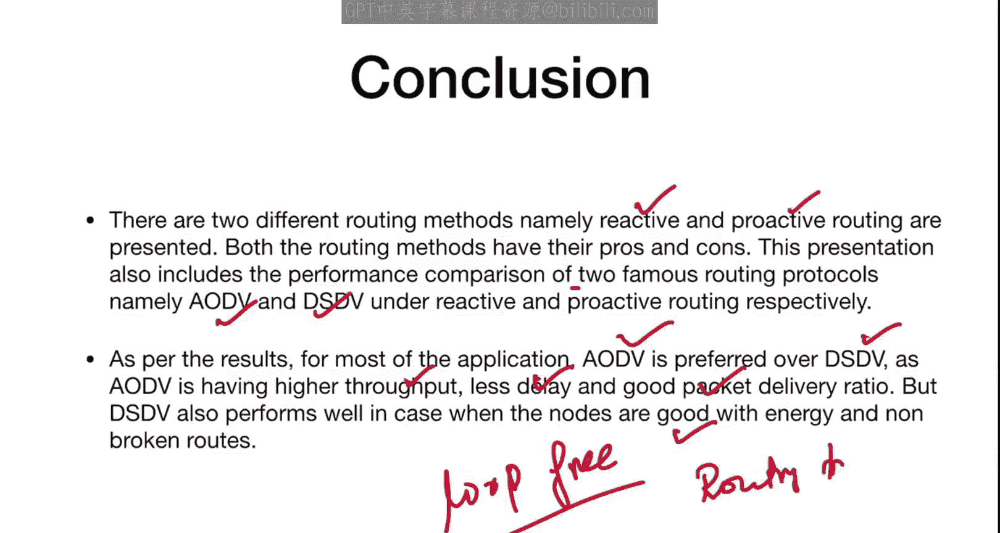

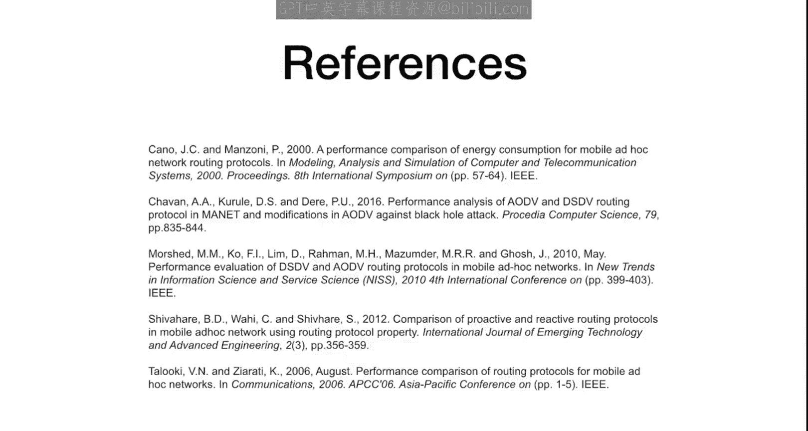

本节课我们一起学习了无线自组织网络的基本概念、特性以及面临的主要挑战。我们深入探讨了路由协议的设计要点，并将协议分为主动式（如DSDV）和反应式（如AODV）两大类。通过分析AODV和DSDV的工作原理及性能比较，我们发现对于大多数应用场景，AODV在吞吐量、延迟和分组投递率方面通常优于DSDV。当然，DSDV在路由无环路、路由表稳定方面也有其优势，适用于节点能量充足、拓扑相对稳定的环境。在接下来的课程中，我们将使用NS3对所有四种协议进行更全面的性能评估。