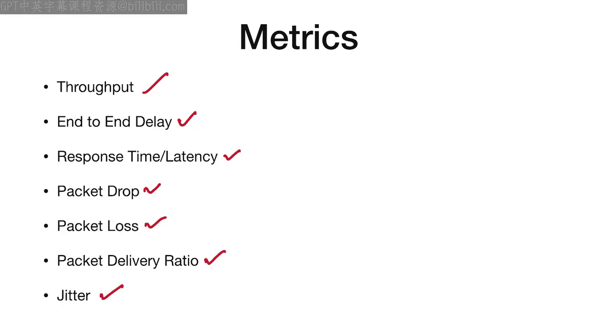
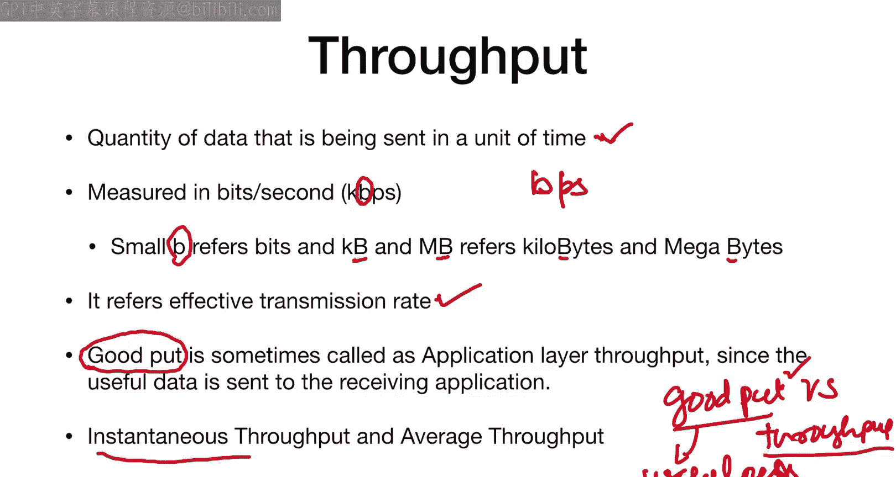
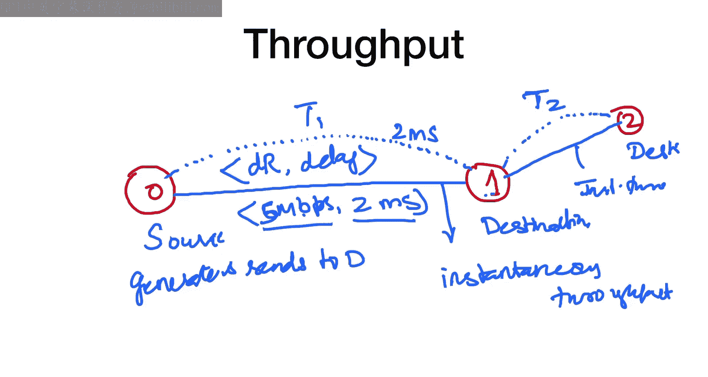
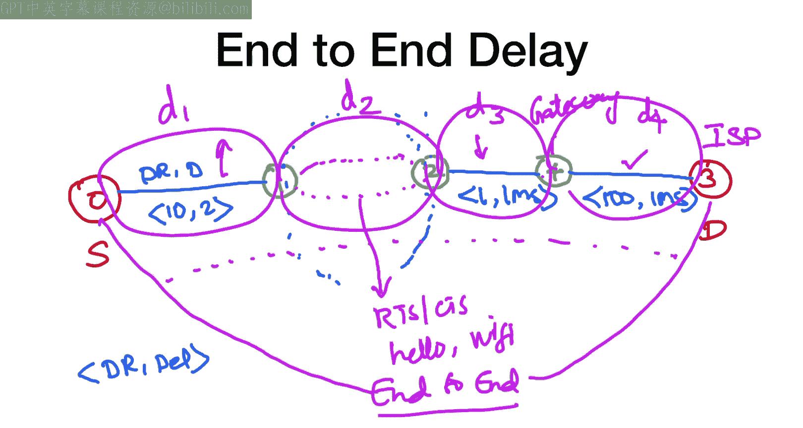
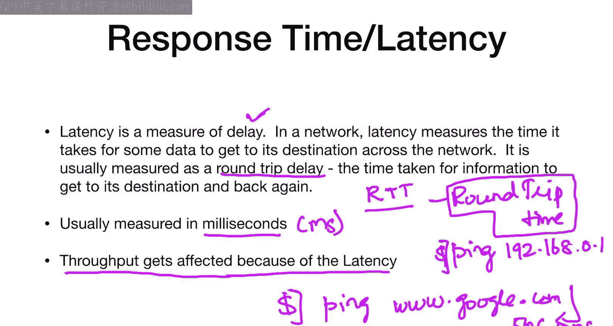
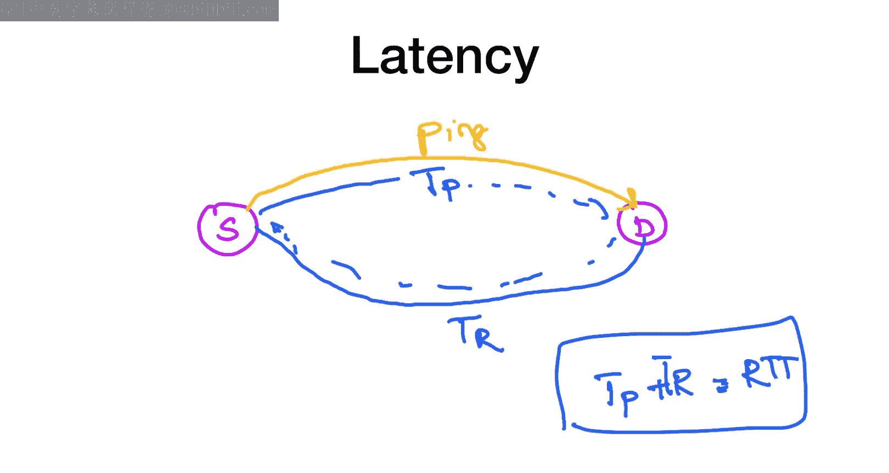
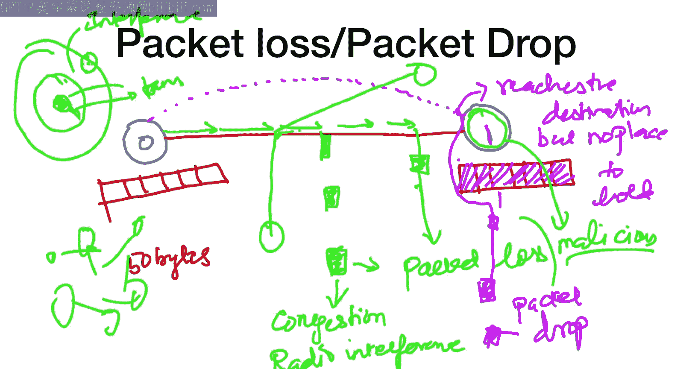
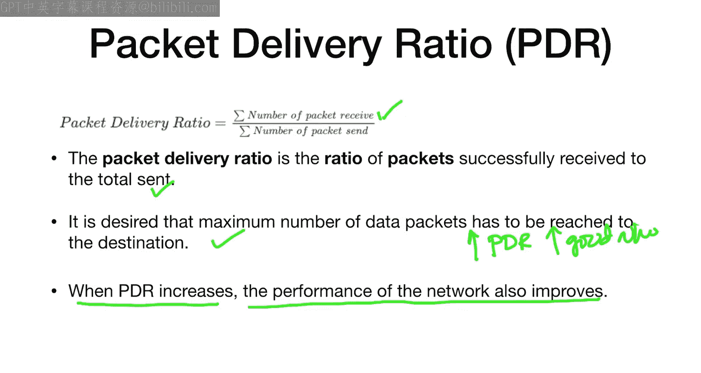
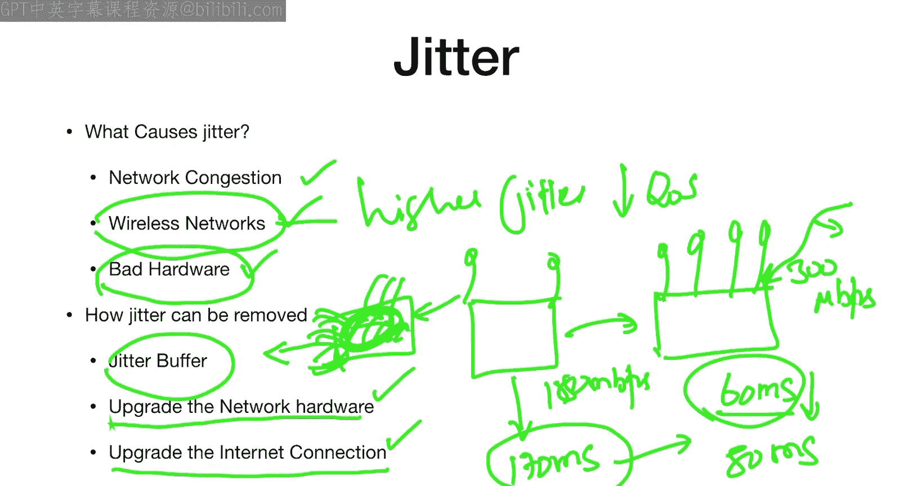

# 网络模拟器3教程：第4周：网络性能指标 🚀

在本节课中，我们将学习网络性能指标。这些指标是评估任何网络（无论是有线还是无线）性能的关键工具。我们将讨论其背后的理论概念，并在本周后续课程中基于这些指标进行大量实例分析。请仔细观看所有视频，以便更好地理解网络性能背后的各项指标。

我们将要学习的指标包括：吞吐量、端到端延迟、响应时间与延迟、丢包与分组丢失、分组投递率以及抖动。

## 吞吐量 📈

上一节我们介绍了本课程的目标，本节中我们来看看第一个核心性能指标：吞吐量。

吞吐量是指在单位时间内通过网络成功传输的数据量。具体来说，它衡量的是在给定时间内，网络中两个不同计算机或节点之间发送的数据量。吞吐量通常以比特每秒（bps）为单位进行测量。小写“b”代表比特，大写“B”代表字节。吞吐量指的是有效传输速率，即数据包在网络中成功传输的速率。

与吞吐量相关的另一个概念是“有效吞吐量”。有效吞吐量指的是对接收应用程序有用的数据量，有时也称为应用层吞吐量。两者的区别在于，吞吐量可能包含网络各层（如网络层、传输层）的所有数据包，而有效吞吐量主要关注应用层的有用数据。

吞吐量还可以分为瞬时吞吐量和平均吞吐量。

### 吞吐量计算示例

以下是理解吞吐量计算的一个简单示例：

假设有两个有线节点：节点0和节点1。它们之间有一条物理链路，我们通常用两个参数来描述这条链路：数据速率（例如 5 Mbps）和延迟（例如 2 ms）。数据速率（或称带宽）表示链路的最大传输能力，延迟表示数据包在该链路上传输所需的时间。

如果节点0是源节点，节点1是目的节点，节点0生成数据包并发送给节点1。数据包以链路的最大速度（5 Mbps）传输，并经历2ms的延迟。到达节点1的数据包数量与时间的比率，就是节点0到节点1的**瞬时吞吐量**。

现在，假设节点0还要向另一个节点（节点2）发送数据。节点0到节点2的路径可能经过节点1，形成一条多跳路径。在这种情况下，我们可以计算节点0到节点1（T1）和节点1到节点2（T2）的瞬时吞吐量。那么，从节点0到节点2的**平均吞吐量**可以近似为 (T1 + T2) / 2。

吞吐量是衡量任何网络性能的基础且至关重要的指标。它主要受到延迟、网络拥塞以及缺乏拥塞控制等因素的影响。

## 端到端延迟 ⏱️

上一节我们介绍了吞吐量，本节中我们来看看另一个关键指标：端到端延迟。

端到端延迟是指数据包从源节点传输到目的节点所经历的总时间。它是路径上所有链路和中间节点延迟的总和。延迟通常由两部分构成：传输延迟和传播延迟。

*   **传输延迟**：指在链路上发送数据包所需的时间。如果发送 B 比特的数据，链路数据速率为 R bps，则传输延迟为 **B / R**。
*   **传播延迟**：指信号在物理介质中传播所需的时间。它取决于链路的长度（例如电缆长度）以及信号在介质中的传播速度（例如光速）。

### 端到端延迟计算示例

考虑一个从源节点 S 到目的节点 D 的网络路径，中间经过节点1、2、4。假设链路特性如下：
*   S 到 1：有线连接，数据速率 10 Mbps，延迟 2 ms。
*   1 到 2：无线连接，延迟可变（受无线环境因素影响）。
*   2 到 4：有线连接，数据速率 1 Mbps，延迟 1 ms（低速链路）。
*   4 到 D：有线连接，数据速率 100 Mbps，延迟 1 ms（高速链路，可能连接互联网网关）。

那么，从 S 到 D 的端到端延迟就是这四条链路延迟之和：`延迟(S->D) = 延迟(S->1) + 延迟(1->2) + 延迟(2->4) + 延迟(4->D)`。

需要注意的是，如果节点是移动的（例如无线网络中的节点1和2），由于移动性，延迟可能会增加。端到端延迟是衡量网络响应速度的重要指标。

## 响应时间与延迟 🔄

接下来我们探讨响应时间和延迟，这两个术语在网络环境中经常互换使用。

在网络中，**延迟** 衡量的是数据从源到达目的地所需的时间。它通常以**往返时间**（RTT）来度量。RTT 是指从发送数据包到接收到该数据包的确认（或回应）所经过的总时间。

一个常见的例子是使用 `ping` 命令。当你在终端输入 `ping www.google.com` 时，你的计算机会向 Google 服务器发送一个探测包，服务器会回应。命令输出的时间（例如 “time=5ms”）就是该次探测的 RTT，它反映了你到 Google 服务器的网络延迟。

较低的延迟值意味着网络连接质量较好。高延迟会影响用户体验，尤其是在实时应用（如在线游戏、视频通话）中。网络拥塞是导致高延迟的主要原因之一。

### 延迟计算

延迟（通常指RTT）可以简单表示为：
`RTT = T_transmit + T_propagate + T_process + T_return`
其中 `T_transmit` 和 `T_propagate` 是往返路径上的传输和传播时间，`T_process` 是目的地的处理时间，`T_return` 是返回路径的时间。在简化模型中，我们常关注总时间。

## 分组丢失与丢包 📉

网络性能的另一个重要方面是数据包的可靠性，即分组丢失与丢包。这两者有所区别。

*   **分组丢失**：指数据包在网络传输过程中未能到达目的地。这可能由于链路拥塞、无线电频率干扰（无线网络）、信号衰减或物理链路故障等原因造成。
*   **丢包**：通常指数据包到达了目的节点，但由于某种原因被该节点主动丢弃。常见原因包括：
    *   **队列溢出**：每个网络接口都有一个缓存队列（FIFO）。如果队列已满，新到达的数据包无处存放，就会被丢弃。
    *   **恶意节点**：网络中可能存在恶意节点，其目的就是丢弃经过它的所有或部分数据包。

### 示例说明

假设节点0向节点1发送数据包。
*   **分组丢失场景**：数据包在传输路径上（例如由于严重的无线干扰）被损坏或完全丢失，根本未能到达节点1。
*   **丢包场景**：数据包成功到达节点1的网络接口，但此时节点1的接收队列已满，因此尽管数据包“到了门口”，还是被丢弃了。

理解分组丢失和丢包的原因对于诊断和优化网络至关重要。

## 分组投递率 ✅

分组投递率是衡量网络可靠性的一个直接指标。

分组投递率是指成功接收的数据包数量与发送的数据包总数之比。其公式为：
`PDR = (Σ 接收的数据包数量) / (Σ 发送的数据包数量)`

一个高性能的网络追求尽可能高的 PDR 值，理想情况下接近 1（或 100%）。PDR 越高，表明网络传输数据越可靠。

## 抖动 📶

最后，我们讨论抖动，这是实时通信（如网络电话、视频会议）中的一个关键指标。

**抖动** 是指数据包到达时间间隔的变化。在稳定的网络中，数据包应以均匀的间隔到达。然而，由于网络拥塞、路由变化或排队延迟，数据包的到达时间会产生波动，这种波动就是抖动。

抖动对语音 over IP（VoIP）和流媒体等实时应用尤其有害。高抖动会导致语音断断续续、视频卡顿。

*   **典型值**：通常，抖动量应低于 40 毫秒才能保证良好的语音质量。
*   **产生原因**：网络拥塞、无线网络干扰、服务质量（QoS）配置不当或硬件性能不佳都可能导致高抖动。
*   **缓解方法**：
    *   升级网络硬件（如路由器）。
    *   提高互联网连接带宽和质量。
    *   使用**抖动缓冲区**。这是一个在接收端设置的缓存区，它会暂存到达的数据包，然后以恒定速率播放出来，从而平滑因抖动带来的不均衡，但会引入额外的延迟。

## 总结 🎯

本节课中，我们一起学习了评估网络性能的核心指标：
1.  **吞吐量**：单位时间内成功传输的数据量，是网络能力的根本体现。
2.  **端到端延迟**：数据包从源到目的的总时间，影响网络响应速度。
3.  **延迟（RTT）**：数据包往返所需时间，是衡量网络“延迟”的常用方式。
4.  **分组丢失与丢包**：区分了数据包未能到达和被丢弃的不同情况，关乎网络可靠性。
5.  **分组投递率**：成功投递的数据包比例，是可靠性的量化指标。
6.  **抖动**：数据包到达时间的变化，对实时应用质量至关重要。

理解并监控这些指标，是分析、诊断和优化任何有线或无线网络性能的基础。在接下来的课程中，我们将利用这些指标进行实际的网络模拟与分析。