# Engineering Clinic《网络模拟器3教程｜Network Simulator 3 Tutorial Series》中英字幕deepseek翻译 p23 -23-External Tools for Network Simulator 3 _ Week 3 _ -BV1aQmtYZEPr_p23-

us， welcome to elements of network simulation。In this session。

 we are going to see the network ign tools that are list of。Third party tools。

For network simulator 3 so that is what we be seeing please listen to this carefully some of these tools will be helpful for the rest of your life and some tools will be only for this simulation。

Now， in this， there are so many tools available， for example， via shark。

So this wire circle cases third body that bind is completely external netanm comes with。

Along with NS3 so internal output I trace matrix。 it the software comes external。Haky race。

 is part of internal。Pick up fields， again， internal。

Flow monitor again its internal G plot it is external and visual laser it is internal。So。

 for example， so  one，2，3， so totally there are three softwares that is coming completely external。

 so remaining things are internal to NS3 so these are these tools that we are going to see in this session。

So first thing is wire shark。 So wire shark， we simply call it as it is a packet analyzer or a packet tracer。

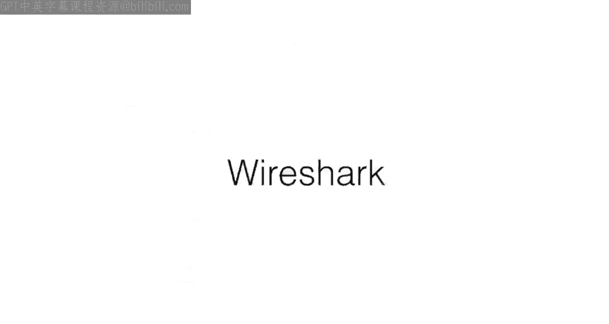

So wire service a network packet analysis。 we can analyze various packets。给你能不能。

So if you want to design your own protocol and if you have own packet structure。

 that also can wise or able to analyze So one good example is TB。U哩逼。His some D p。SNmp， so Imp。

 So there are so many other packet sectors that Y shall and able to process it。

So a network packet analyze will try to capture network packets and tries to display the packet data as detailed as possible。

 so as detailed as possible means even to the bit level detailed information。

This wire sha will give you so why wire shark is included in NS3s。

 usually wire sha process a type of file called us Pir capture fits simply we call us Pcap。

The shortcut of Pap is packet captured。 So that's why we call Pcap。

 So these Pcap files can be processed in two different sectors。 One is wire。 Another is TP dump。

So TCP dump under H shop these are the two software that can process the Pcap files so NSS3 can generate backer capture files through their simulations so those files can be processed using wire sharp so we will see an example also Ill just put an example in the laboratory section of how versar can be so far they。

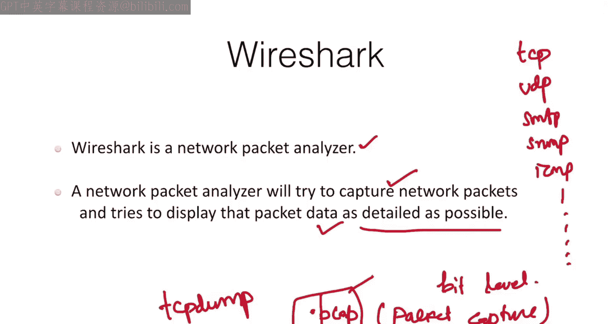

Simulation。So now well see that are what are the different things so it can create various statistics。

 It can colorize packets， search for packets on many criteria， filter packets on many criteria。

 it can filter， it can export some of these things。

 it can able to save it can save it can display packets import packets that our import display。

 save export filter search colorize create。 So there are so many things that packet capture can do It is available for Linux any operating system it is available。

So you need not bother robot。 So which voice it has， even Macs it has Linux。

 it has all Linux families， then Windows it has。

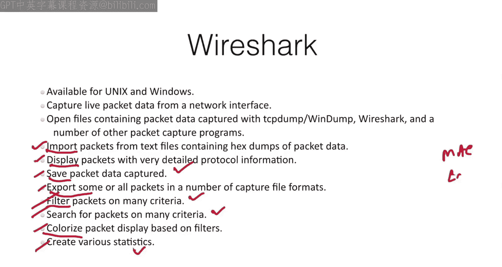

So to install this on various distributions， so how we can install this the main the good example here is u on Linux mi。

 you can use this commander so app space install space wire shark， So this is the easiest command。

In feddera， so either you can use Ym install or you can use DnF install。

In case if you want to install， you can use install DnF install。W sir。So we can use this commander。

 their commander。Okay， so that's what we'll be doing in wire shark。

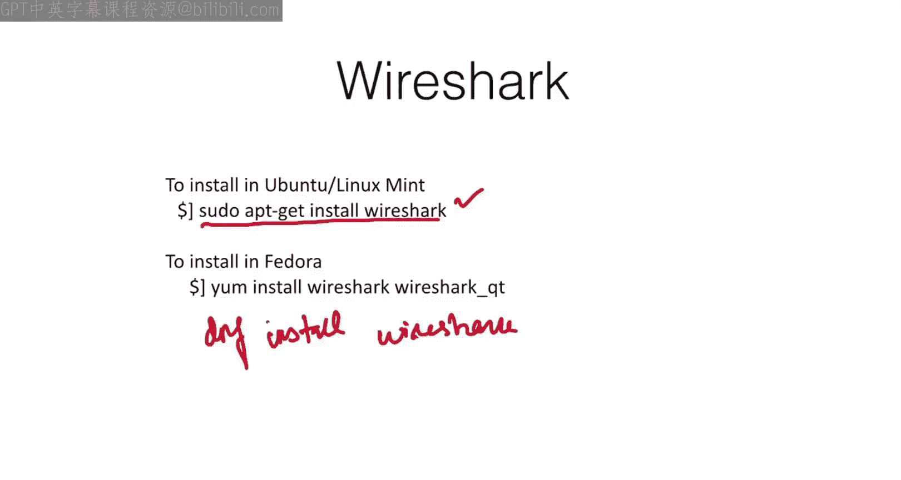

So how this we can able to， this is for how we can。

Be operated by all users of a particular Linux machine。

 so usually wire all the interfaces can be visible only to the pseudoors。So。

 we called the super userss。Super usersers for ordinary users。

 you have to enable this format to make the ordinary user also to access the interfaces。

 so that is what this command here is for mainly for Ubu2。Okay， so。

In case if you want to check it for Uto， we can just。

Check it how the Vi can be helpful for any users in U do to access the interfaces So interfaces as this name says。

 I already told you in an example called us IF configurefi it will display all the interfaces。

 One example is E H0。Thenhan the wireless0 for this wireless。 and this is Ethernet。

If you are using internet directly you can use the interface to monitor using Yshark directly you can give so whatever web pages you are browsing whatever whatever you see you and email checking YouTube or anything whatever you see every packet will be captured using Yshark and you can analyze the number of various statistics in this software。

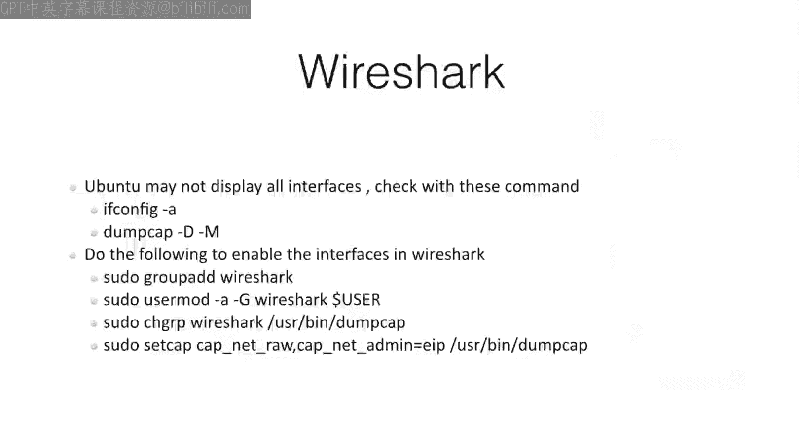

So next thing is Natanium， as the name says that the Indian capital letter and E also in capital letter。

So both are in upper case letters。 So the command is also useful。

The same way we have to use it on N E D A and IM at anium。

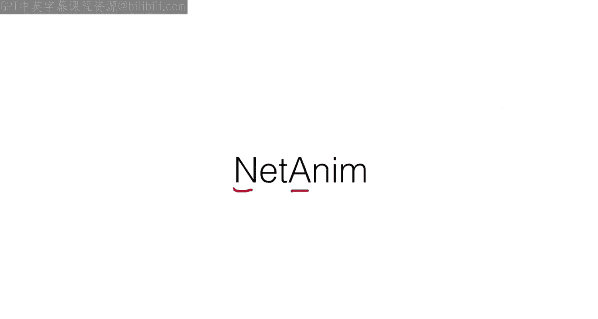

So。G k in case netanium is the shortcut of network animator in case if you want to install netanium through a package coming along with the Linux operating system so you can simply use a command call pseudo。

At install。Neium so we can directly like write like this so this method may not be working out when NS3 generates a X file for processing the network animation so don't use this method always follow the method which is given in the complete slide。

Okay， so what you do is first you give this pseudo app to get update。

Afterwards Q T4 Q make Q T4 developmental tools Q T4 default now Q T 5 is also there if Q T4 is not working you can try with Q T5 so QT is a kind of G Uy kind of system developed by Nokia and still it been used so in our example I already installed nettanim in the Vm what I given you nettanm is working perfectly fine so you did not install it comes along with it in case if you are trying on your own machine。

If nearium is not there， you place in it as per the procedure given below so each line corresponds to。

1 terminal prompt。So I can give this one time little prompt。Okay， so that's how this nettanium。

 So when you run the command， you can run the command using like this dot slash。

Net an so that means that this is a command that you have to run it for network animation you can check that inside this net turning 3。

10 right folder check whether a binary file called us net an is there if it is there that means your software is installed if it is not there then。

He had to install it， as per the procedure given here。

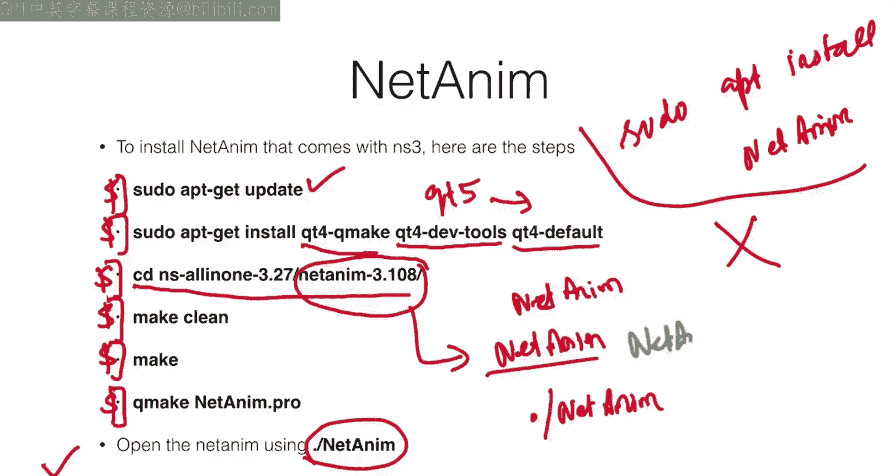

So for enabling nettanium in the source code so by default all the source code they may not be having nettanium relevant source codes we have to write it so how the process starts so first thing is it has to have include n3 slash nettanium hyphen modular H so this is in the header section。

Afterwards， before the simulator run function， so I mean this this line will be at the end of this source file before this function。

You have to call animation interfaceface an third or xm。

 So here the name an is nothing but the name of the。Object name。

 so you can have any name instead of this an。 you can have it。 And now the set constant position。

 What is the position in that animation， So which position you want to fix the notess So you can give a location of x and Y。

 So each node can be represented away Yeah x come away。So that's what this shakes and this way。

 And this is the name of the no。You can see there are so many nodes。

 so even if you don't give all these links， still network animation will handle the default locations。

For those notes now this， this generates nettanium generates Xml file。

 So that Xml file will be processed using net animation window。

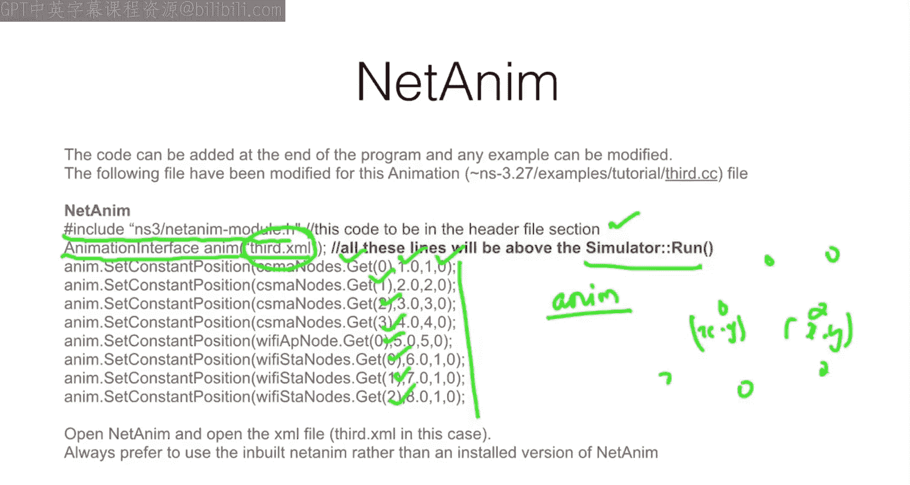

So you can check the demo in the laboratory features。So next thing is trace matrix。

 So this software is。Trismetric software。So tracematic is a third party software again。

Download the latest version of trace matrix from trace matrixnet or source forge So this website is I think already down so better you can use this source for software I mean website to download this software So the command for running trace matrix is Java hyphen jar trace matrix so this is a command So usually what happens is in Windows operating system we can double click this jar file。

To open the Ja file， but in Linux and the Mac operating system you have to write the command in a terminal mode。

 So that's how you have to do it。Okay， so that is what。This trace matrix will be done。

Now what this trace text processor trace text will process the trace file dot T file。

 so usually the dot Tr file will be a thing askki trace format。

So that means it will contain only as key trace format it contains this trace will contains only those things will be processed in the trace matrix。

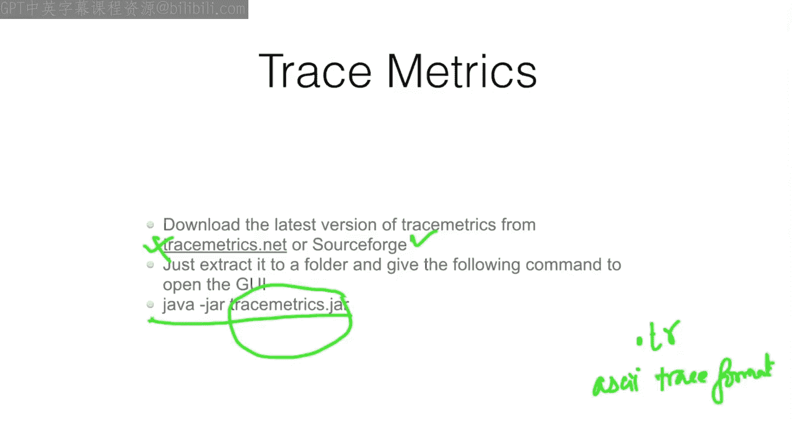

So again， the line this code will be written above the simulator run function。

 so how we can write the code has key trace helper ask key， so see this is a class name。

And this is an object name the object name can be anything as as as far as you like and here we have an object called a CSMA we have object called PH so this is for the physical layer of Wifi this is a CSMA layer CSMA helper so ASI can be enabled mainly for the helper classes so please understand that so only for the helper classes this ASQ to be enabled。

So enable ASI all that means enable ASI for all the CSM channels are the helpers。

 then create a file stream right every the every data or2。This file third CSM at here。

 similarly PY you can add third Wifi att so accordingly you will be getting do two trace files。

 one third CSM another is one third wfi two files you will be getting so to process these two file use this software to open it each chapter to open you can open tracematic X opening these files。

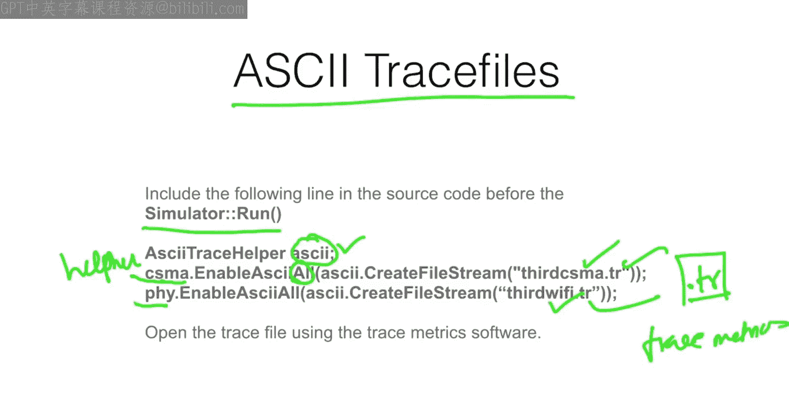

Next thing is packet capture so similar like ASI trace we call something called packet capture I already told you that packet capture can be processed using where Srk so how we can enable packet capture is so this is again helper class point to point。

PHY and csma now here we don't use any dot extension because the dot is by default we know that it is Pcap so only thing is we have to use the name so what name the file has to be generated so enable Pcap all means so for all the interfaces in point to point you have to enable the so we are given third again for P also we are given third for cme also we are given third in case if you want to give some different names you can give it but the file name will be like this third hyphen 0 hyphen 0 dot pcap。

Then third hyphen 0。1 dot p cap， then third hyphen 3 to 0 do p cab like you will get the packet caps file for each and every interfaces that you have sub over here。

So this is how the way the packet capture file will be generated。 We will write in clearly。Third。

IPhhen 3， hyphen 0 dot。Pcap this is one kind of file。 So likewise。

 it will create multiple files according to the number of interfaces that CSM P and point to point channel have。

In case before White was introduced our inventor it was developed。

Network administrators were using a command colors tCP dump so using this tCP dump disk command double hyphen double andhen double t and hyphen T filed are Pcap so this can be processed the packet can be analyzeded and traced。

For various statistics， so thats how the way the tCP dump is useful。

 so in case if you are really interested on TCP dump you can understand about tCB dump protocols。

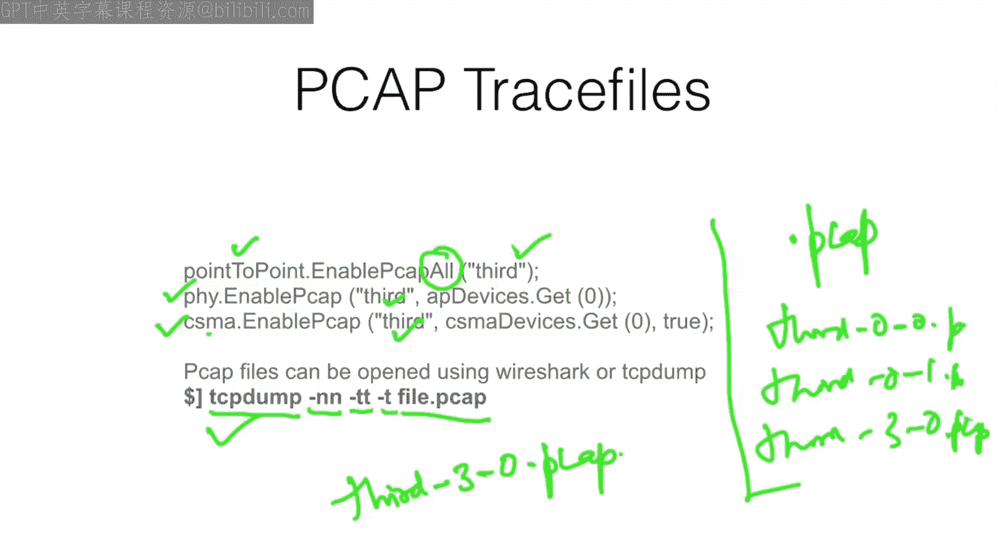

So flow monitor is one of the powerful software of N3。So it is very powerful。

 so even none of the simulators are having such kind of utility like this flow monitor。

 so flow monitor can able to give you information about packet loss。Then packet drop。

 then transmission energy， receiving energy， then transmitting packets， receiving packets。

 and lot of things it will just give you。 So all these things will be captured in a flow of packets。

 So that means that the packet flow。 It will compute the number of not number of packet。

 but number of packet。

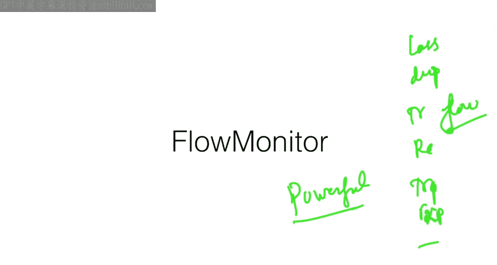

不ロ。How it will happen is again， we have to have Ns3 slash flow monitor helper dot header file we have to use it in the source code。

Then we have to use a pointer here pointer flow monitor flow monitor helper flow helper flow flow helper install and simulateim above the simulator and re it So all these lines of code will be written above the simulator and function after the simulator run function we have to use a C to Xml file that being said again this also generating an Xml file as an output So using this the passing this Xml file we can get so many relevant information about packet loss and other things even the port on which port number the protocol act upon So all this data will be getting it So only because after the every s gets over the entire data will be returned to an Xml file So that's why we use。

Only that line alone will be useful after the simulator color run function。So again， so in this case。

 we will be getting two x file。 So one example file will be for。Neanim。

Another Xl file will be for flow monitor， so we will have two things so flow monitor is a very big area。

 maybe I will just put you a video on how to use flow monitor for all other applications we will see that。

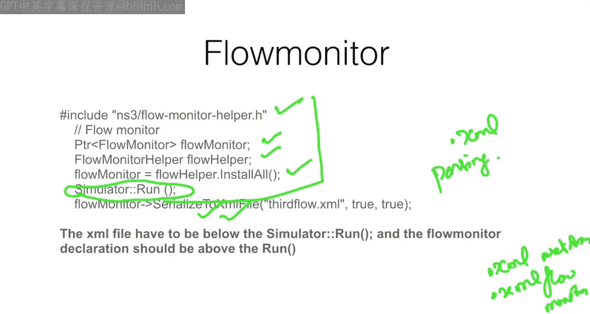

Then visual laser so visual laser is outdated concept because of a package is been removed from the Ubu to library so usually we have a package for installing visual laser for enabling visual laser but that package was been removed so visual laser was not at all working in NSs3 but now recently Ubu to have come with a different kind of packages for handling this kind of Gi so maybe it may be working but in the Vm image what I have given you it will not work so visual laser is similar like nettanium but nettanium is part of third party but the bundle is there in NS3 but visual laser is in part of NSs3 so here what happens so you know how to run it dot s graph。

Space double if and run， scratch first， then。After that。

 we give a space and we can use double hyphen via S， or we can use double hyphen， visually said。

So we can either we can use this or this command to open。

 So after you run this automatically a video I mean window will be open in the window you can able to configure all the notes。

说的。You can visualize what's happening in there。Network animation。

 so that's what the visual laser is working。

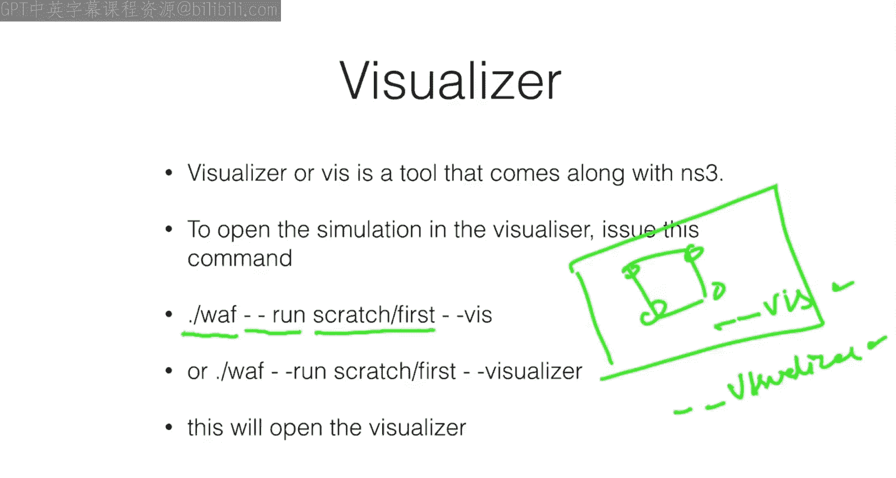

Next thing is uni plot as I told you that there are some concepts。You can learn for the life。

 so this is one such concept， So so far we will be using spreadsheets what spreadsheet application will be using so mainly for plotting the character will be mainly using Excel。

 So mostly Indians we prefer to use a Microsoft Excel。

The reason being it is very powerful or it comes from a Microsoft and we have been practiced in using it。

 but we never thought of what a different kind of thing that we can try up。

 So G N plus software he can work on Windows Linuxux Mac anyway this Gpl supports G N plus completely free and open source。

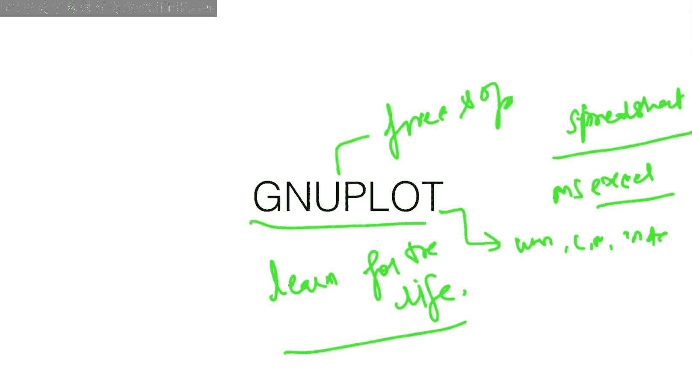

So you need not pay and get in。 It is completely free and open source。

So what G plot do so we have to write a code for plotting the characteristics so Gpl is a powerful open source graphing software that is very neat and professional so most of the 90 percentage of the journal publications。

The graphs which are published in any publications， they are coming with the help of GNU plot。

So even if you take Matplot I mean Matplot libraries used by Python and Matlab is there for graph plotting solutions our statistics tool is there most of these tools they follow a graphing solution that is powered in the back end mainly by GNU plot so GN plot is very powerful you can think of you have already have in V3 we have two videos on a GN plot one for a basic data plotting another for histograms plotting so please go through those two videos you can learn it for the learn for the life so that means said you never forget about how to use GNU plot in your carrier。

But here how we can write a code。 So yeah we have a Ccept terminal P and G P and G means the name of the。

PNG will be getting output in a P G file。 So let's say size is 600 comma for80。

 That means we'll get a graph like the 60 comma 400。Next output is field PN G。

 the title of the graph so I use the title of the graph as title of the graph so there bin in the top will you get take this title of。

Graph you will get it then plot file that data So if we have some data in the file。

 let's say you have three columns column number one column number two column number three Now in this case what is using one column two means column number one and column number two So column number one in the x axis is column number two in the Y axis Also x axis is 1。

2，3，4，5，6， for example。Then accordingly， I have a point。So I have some points here。

 so that's how the way I can able to join the particular point， okay。

So I can use these points like this so that means there is a legend call us this line legend it will be called as congestion so as the name says congestion here the title is congestion lets say I want to plot one more characteristics one column 3 so comm I can put field or data and one column 3 so I want to use another characteristics colors us。

A star。In that case， what I do is。I'll be plotting the characteristics like this。

So using lines point that means lines and points both。

 So this is the graph I' will be getting in one single image you will get both the characteristics have been plotted in case if you want to have a Pd file then you can use P so P doesn't indeed any size so not enough including size here simply Pdf and the name of the file could be filed P or any name P we can give So this way the entire output can be converted into a Pd file so we can get So this is how the G plot can be helpful and even whatever code you write you can write the entire code in one single file so that means you can carry one single file for plotting even 10000 graphs so that is the power of this G plot and even there are a subscription superscript So so many things we can able to do using this G plot not  3 d graphs So anything we can able to do on G plot even it can be processing the formal also let's say I want to use X square plus 2 x plus one。

If you want a blood， simply you can use plot。X square plus 2 x plus one。

 thats it it will directly plot what is a curve for x square plus22 x plus one。

 You can even gen plot understand formula。 So it know only two variables x and y。Okay。

 so that is how the way G plot can be programmed。

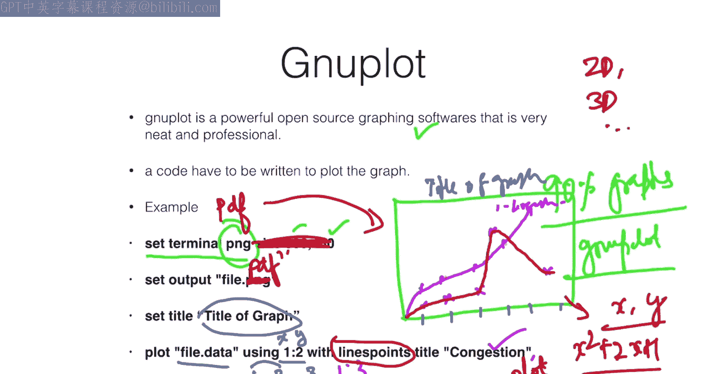

So having said there are all these tools like Vi or G plot。

 trace matrix askP cap and visual laser are all these things so please learn it so most of these tools you can learn within a day or within a day。

 thank you for listening。

