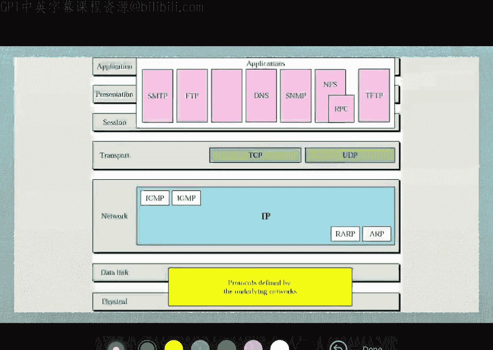
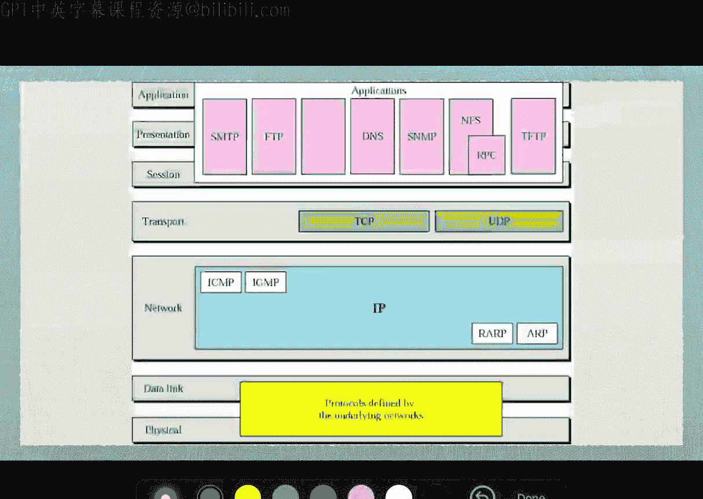

# Engineering Clinic《网络模拟器3教程｜Network Simulator 3 Tutorial Series》中英字幕deepseek翻译 p24 -24-Functions of OSI Layer _ Week 1 _ Lecture 2 _ -BV1aQmtYZEPr_p24-

Come to elements of network simulation。 So this is the next lecture called as functions of Y SI layers。

 So already， we have seen a first lecture on introduction to computer networks and topologies。 Now。

 this is the next topic that functions of Y SI layers。

So Yl is the very basic fundamental behind computer networking。

So we have totally seven layers so the learners are requested to keep in touch with the basics of networking because this will be the fundamental key aspects of cloud computing internet testing sensor networks so anything when you start to learn that the fundamentals will be the voiceA layers。

So there are seven YA layers， so the first layer is the physical layer。

 the second layer is data link layer， the third is network layer， the fourth is transport layer。

 the 50 session layer， the6th Pre layer and the 70th application layer。So here。

 voice means open system interconnection is the model and IO is an international standard organization。

 So it is one of the organization that frames the guidelinesline further of open system interconnection lab。

There are totally seven layers。 The headers and trailers are added at each layers。

 So headers are added to the data at the layer 6，5，4，3。

2 and trailers are added usually at the layer number two。 So only in this layer。

 the headers and trailers both are being added。 So from here to here there are headers are being added。

 So what happens is when a source node is trying to send the packet to a destination mode。

There will be the packet will be transmitting towards each and every layer whenever it crosses each layer。

 each layer will be adding a header and trailer to it。 Similarly， the receiver end。

 the headers and trailers are removed one by one when it encounters in each and every layer。

 So this is how the way the networking works。So here you can see this to make it easy for you to understand。

 So we have a device number a。And the device number B are two devices。

 So device a is sending a packet to device number B， So for example。

 the packet will be sent like this。But in between， there are two intermediate nodes also。

 So two intermediate node means a device A will be sending to a packet of destination is device B sources device A。

 But in between these two nodes， there are two different intermediate node。

 So why are this intermediate node， the packet will be reaching the destination。

 So it be called as multihub networking。 So now in this case， what happens So the first device A。

 it send by application presentation， session transport network and physical。And once it grows there。

 so in the intermediate node these four layers are not needed there。

 this is only intermediate up to the network layer because the packet is not deined for these two node。

 So thats why there is the top layers are not getting affected。

 So when physical deing a network and physical deling network。

 So after it reaches crosses the intermediate node then it reaches the destination note from there the packet will take a transition like this So from here it will be coming like this。

And the destinationation note the packet will go in this。 So from here to 7 to one。

 the headers and the trailers are added。 So headers will be added Traers。 So headers will be added。

 headers will be added。 headers will be added and data link headers and trailers will be added Similarlyly here。

😊，The headers and trailers will be removed， the headers will be removed so everywhere the headers will be removed finally it reaches the destination so this is how the weight the all the sal layers works when a packet is been transmitted from a source to destination。

Now， how this data is been added here。 So we can see L7 data， It's a plane data。

 which is sent by the sum layer application layer。 Now header is added here。

 So this is the presentation layer。 Now again， there is session layer H5 is added transport layer network layer data link there are trailers and head both are added。

 this is a physical layer。 So you can see physical layer deals with only with0 and one。

 So once the transmission medium。 So this transition medium we already seen that it could be wired or it could be wireless。

 So that's what the transmission medium after it reaches here。 So again。

 this is a physical layer Now here t2 and H2 will be removed H3 will be removed H4 H5 h。

 finally that will be received by the destination So this is how the way the actual。😊。

Data transmission happened between two different nodes。So now in the physical layer。

 So what happens in the physical layer。 So physical layer is an actual hardware。

 So that's why we all does it physical。 So complete， if you take wireless， it could be radio waves。

 it could be a electro magnetic waves。 it could be cellular signals。 It could be any signal 8 not 2。

11，8 not 2。15。4。 So anything you can say。 So that's way here we can call it as 8 not 2。3。😊。

This is Ethernet。He turn 2。11 is wfi。It not 2。15。1 is Bluetooth like the8 or2。16 is y max。

 So like this all these things are ir standards。 we will be having a separate topic on these topics too So but to this are basics of it。

 So here this is where the zeros and one。Happens here。 So everything will be 0 and1。

 So that's why we call this as a physical layer。Next thing is the physical layer。

 What are the properties of physical layer。 So moving bits from one to next。

 So it's only moving them bits。Physical characteristics of interfaces and media。

 representation of bids。Data transmission， synchronization of bits， line configuration。

 physical topology and transmission mode。 So all these parameters are been handled here。

 So individually， we can discuss more about each and every component of this physical layer。

 but please have an understanding there the physical layers representing everything in bits  zeros and once and it also decide that data rate。

 So data admits let's say it will take wfi use let's say 150 MB。 So this。Data rate。

 So this way we can able to fix the data rate。Now next thing is data。 as we know the data。

 it adds a frame at the header as well as the trailer。 So header H2 and P2 for trailer。 Okay。

 so it will be。 So now the physical layer it it will be bits Now in the data link， it called frames。

 So number of bits become frames。 a group of bit br frames。

 That's say we call everything has a framing here。😊。

So this is a data link layer again the data link also we have all these things8 not 2。38 or 2。

118 not 2。15。1 co4 etc cetera then 8 or 2。16 etc cea so all these things here come the medium access control so data links also called as Mac layer that is medium access control layer So everything will be dealing in frames。

So that is what here So it is to the physical layer here to the network layer。

 So either from the network layer to the physical layer from here it is physical to。

Data link to network layer。 So that is what next。What it is responsible for the data link layer is make the rot trans link to label link。

 it call a framing。 So from bits to frames， physical addressing。 So we can view the physical address。

 So for example， if you take any machine， have a Mac address。So Mac address。

 every machine can have a Mac address， or we call it physical address。So how it looks like。

 for example， a0 colon 3 e， 4 f， 2，3。5932， for example。 So this is a Mac address。

 So even you can see your mobile phone， you will be having a Mac address for your wfi for your Bluetooth。

 you have a separate Mac address。 So this is what the medium access control。

 So this is a physical address。 So each and every physical is unique in the entire world。

 So that's what yeah this link layer is responsible for this thing also it has flow control error control and access control。

 So access control means who have given to access So sometimes we can use Mac page access。

 So only only for this Mac address， the internet connection will be enabled。 we call control。

 flow control means According to the receiver's capacity， the source node will adjust its flow。

 So but the receivers very small enough to handle only less amount of packets。

 the source will adjust its speed to send only less amount of packets。

 if the destination is very huge or very powerful node。

 then the source will also will be sending huge number of packets。

 That's what the flow control error control means whenever the frames are been sent any wrong frames the frames have not been sent the error。

😊，Will be handled by the layer itself。NowNext thing is network layer。 So network layer， again。

 the header3 is been added here。 And here， the header3 will be removed here from the source destination。

 So network layer is usually responsible for source to destination delivery of packets。

 logical addressing a roing。 So network layer， what we can say is 192。168。1。0。

 So this is one of a logical address。 So this we call us logical address。

 That is a local address R 182。132 point。32。8 something else。

 So these are all logical adjustment and Routing also happens at this layer。

So let's say we have the protocols called us I and。4 right years and6。

 all this stuff will be handling at this location。 So logical address will be there。

 as well as routing will be handled at this way。 This is the red pop。

Next thing is the transport layer。 So transport layer mainly happen with the help agents。

 So here you can see the header number  four is been removed here。

 here header number four will be added here。 So this is the source and this is a destination as we see So in the transport layer we have three protocols。

 usually namely TP UDP and ACTP。 So these are the three protocol。

 So in this TP and UDP are very been used used for longer period time ATV now recently have been introduced for stream control for multimedia data transmission。

So what a transport layer will do is responsible for a process to process delivery of inter message。

Service point addressing segmentation and reasse。 So now the packets become segments here。

So it becomes segments here so segmentation and reasselies that means individual segments will be sent on by one that the receiver end they will be joined together so that so the segmentation happens at this particularassely connection control so it will maintain the connection between two different nodes。

 the resource on the destination maintain the connections That's what the transport layer will be very。

Flow control happens into end rather than processing single link。 So again， flow control also here。

 the transport agent will be responsible for handling the smallest client and the powerful client。

 Thats what have flow control。 Similarlyly error control as we seen in the previous layer。

 error control also handle this particular transport layer。

So next thing is session layer so session layers is to maintain the session layer so again here we can say sync packets are been added here I will be more here so synchronization packets means so it is trying to maintain the session between one packet to another packet this session layer will be helpful for this。

Now， in this layer will be handled establishes maintain some synchronized interaction between communicating system。

 dial control and synchronization。 So checkpoints。 So checkpoints spins at each and every checkpoints will just verify whether the packets are in impact or if there any error in a particular checkpoint can stop it and bring trans might be happening。

 So this kind of things will be done by there。啊，谢谢们有。😊，Then presentation layer。

 So presentation layer you can see encoded， encrypted and compressed data。

 decoded decpted decompressed data。 So this is what happened in the presentation layer。

 So presentation layer means how suppose we are sending a huge amount of packet。

 So usually the entire web the most of the packet will be sent the web will be having a compression and it will be decom the destination site usually whenever we browse in internet given a simple Google search engine when we browse it。

It comes from the Google service， it comes as compressed form at our location and the destination location it will be decompressed so thats how the compress decom decom will be handling at the packet level and that is what happens at the presentation layer so encoded encrypted and compressed data here decod decrypted and decompressed data will be happening at the presentation layer。

So deals with the syntax and semantics of the information exchange between two systems。

 encryptryion is happening。 compression happening， translation， Interoperability between the systems。

 So now we know every system， whether it could be a laptop or it could be desktop or mobile device everything we are telling that not interoperable。

 but sometime back when Apple was introducing their own networking like Apple talk and their own protocols other thing。

 So the existing voicea have to talk to the other protocols as well。

 So for that this presentation will be doing the translation。

 So these things will be under presentation there。Finally， application layer。

 So this is application layer where the actually， what we were using is application layer。

 So in the browser， we type H G T P colon slash s。😊，WWW do C。 So in that case， what is a H T TP。

 So it is one of a protocol in application layer。 And when I want to download any let's say I want to download a particular software for my So in that case I use FTP protocol file transfer protocol。

 So that is that is also there in application layer。

 Let's say I'm checking my email So when the email is been delivered to my email box I open the email。

 So what protocol is used there its usingP。 So we have H T TP， then we have TP transfer protocol。

 then file transfer protocol。 So all this protocol。

 what we experience available in the application layer。So this is the generated data。

Now in this case， what happens is it is a file transfer access and management， email services。

 directory services and network virtualual table， So enable the user are software to access the network。

 so enable any user to access our。The use to access the software。 So that's what。

This application layer， So human beings we experience everything。

 the entire networking only via the application layer protocols。

 So only the application layer protocols are visible to the outside world。

 but all the other layers are been invisible to us。

 So it will be happening internally within the particular systems。So summary of this layers。

 now we can see the summary here， physical layers transmit bits over a medium。

And data link convert into frames。A network layer becoming a packets and a transport layer again。

 these also packets， but some we call it a segments too， So there is segments。

And the session is to maintain and terminate sessions or establish sessions。

 and this is for compress encryption decomp an application layer except file access。

So you can see bits， frames， packets， segments， sessions， compresss。

Acces So this is summary of this layer。 Now we have another slate。

 possibly there what are the different protocols available in a particular layer。 So。

 but you can see that physical data link layer in the bottom of layer protocol defined by the underlying networks and in the I layer we have ICM IGMPRP ARP。

 So these are the I Internet protocol So we can have I 4 and I 6 we have these two address resolution protocol reverse address resolution protocol group messaging protocol and internet control messaging protocol。

 And here we have TCP UDP And here we have simple mail transfer FTP domain naming service network management network file system。

 remote procedure called trivialL file transfer protocol and these protocols are been allocated in the。

😊。

3 layers， application presentation and session date。So with this。

 the basics of voiceL A is been completed here。 So please try to listen to the complete lecture so that you can really understand the。

Beauty of this voice As。So thank you very much。 Thank you listen us and learn us。

