# 网络模拟器3教程：1：计算机网络入门 🖥️

在本节课中，我们将要学习计算机网络的基础知识。这是网络模拟学习的第一个主题。在深入模拟之前，我们需要了解一些关于计算机网络的基本概念。如果你已经是一名学生并掌握了网络基础知识，可以跳过此部分，以便更专注于网络的实际模拟。本节我们将介绍什么是计算机网络、不同的网络拓扑结构以及OSI模型各层的功能。

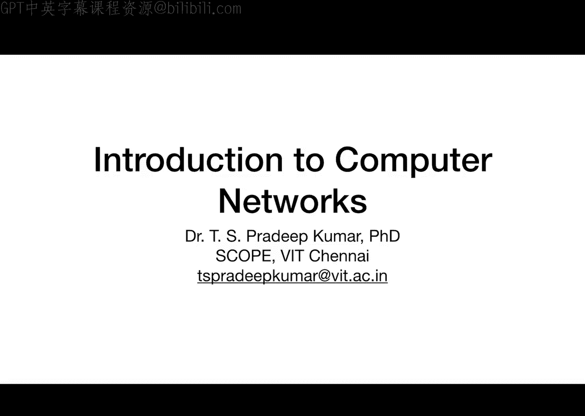

## 数据通信基础

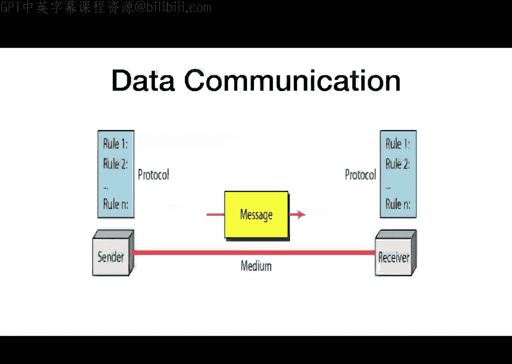

上一节我们介绍了课程概述，本节中我们来看看数据通信是如何工作的。数据通信是网络的基础，它描述了源（发送方）和目的地（接收方）之间如何交换数据包。

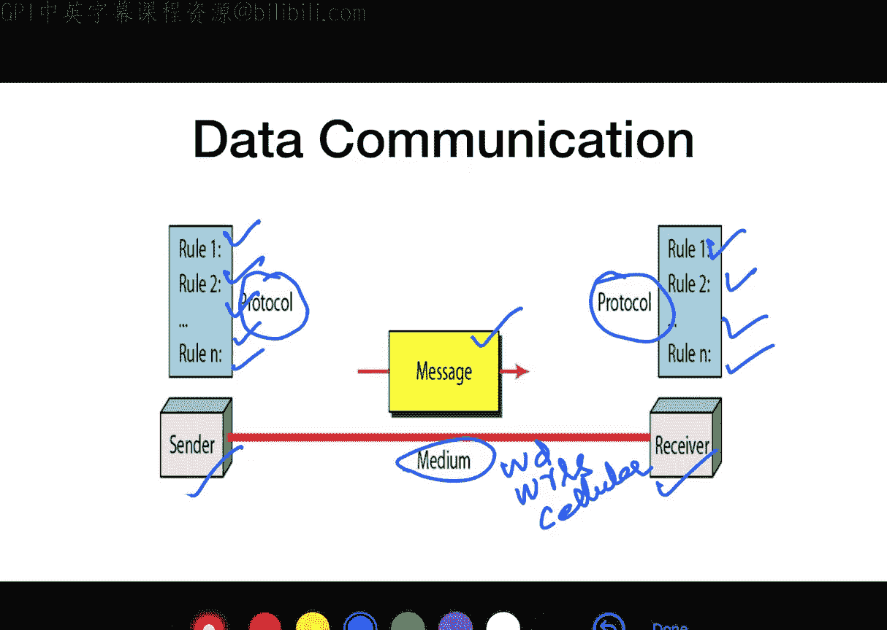

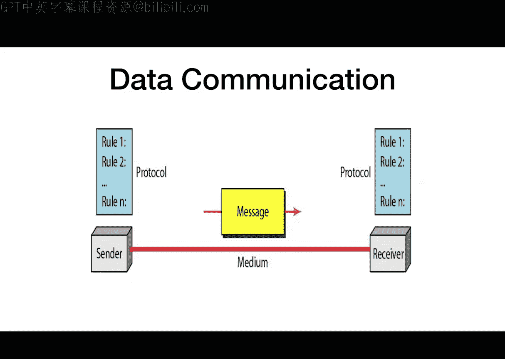

数据通信涉及五个基本组件：**消息**、**发送方**、**接收方**、**传输介质**和**协议**。

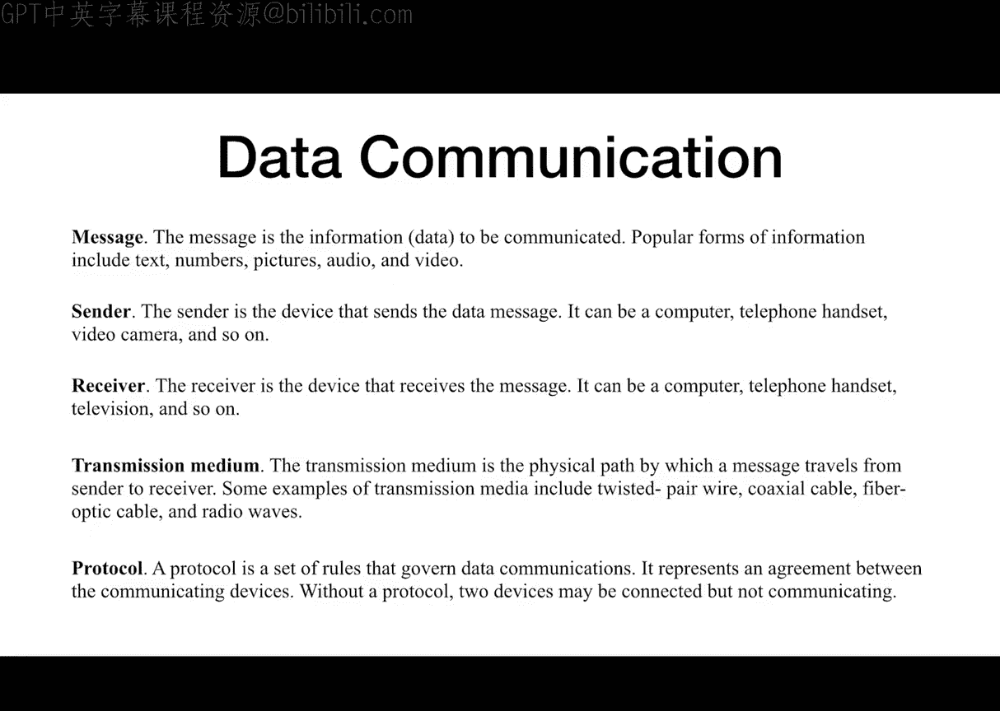

以下是这五个组件的详细说明：
*   **消息**：指需要被传递的信息。常见形式包括文本、数字、图片、音频和视频。
*   **发送方**：指发送数据消息的设备。它可以是计算机、电话、无线电或摄像机等。
*   **接收方**：指接收消息的设备。
*   **传输介质**：指消息传输的路径。它可以是有线的（如以太网、光纤、双绞线），也可以是无线的（如无线电波、蜂窝网络）。
*   **协议**：指管理数据通信的一套规则。它代表了通信设备之间的约定。没有协议，两台设备可能连接在一起，但无法进行通信。

## 数据流方向

了解了数据通信的基本组件后，我们来看看数据流动的方向。数据流方向有三种基本模式：单工、半双工和全双工。

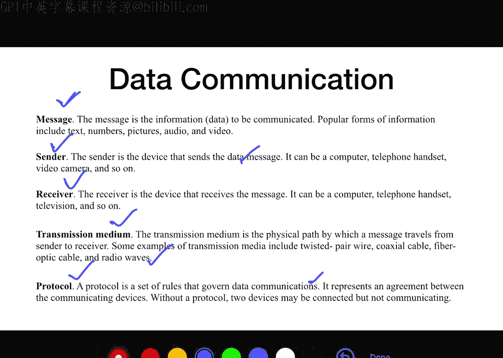

以下是三种模式的说明：
*   **单工**：通信只能在一个方向上进行，反向通信不可能。一个典型的例子是大型机计算机，数据流方向是单向的。
*   **半双工**：在任何一个给定的时间点，只能进行单向通信。在第一个时间段，消息从A流向B；在下一个时间段，消息可以从B流向A。在给定时刻，双方不能同时传输数据包。
*   **全双工**：源和目的地可以在同一时间点交换数据包，双方能够同时进行通信。

## 网络拓扑结构

接下来，我们将探讨网络拓扑结构。拓扑结构是指所有链路和节点之间关系的几何表示，它定义了网络节点如何相互连接。

主要有四种类型的拓扑结构：网状拓扑、星型拓扑、总线拓扑和环型拓扑。

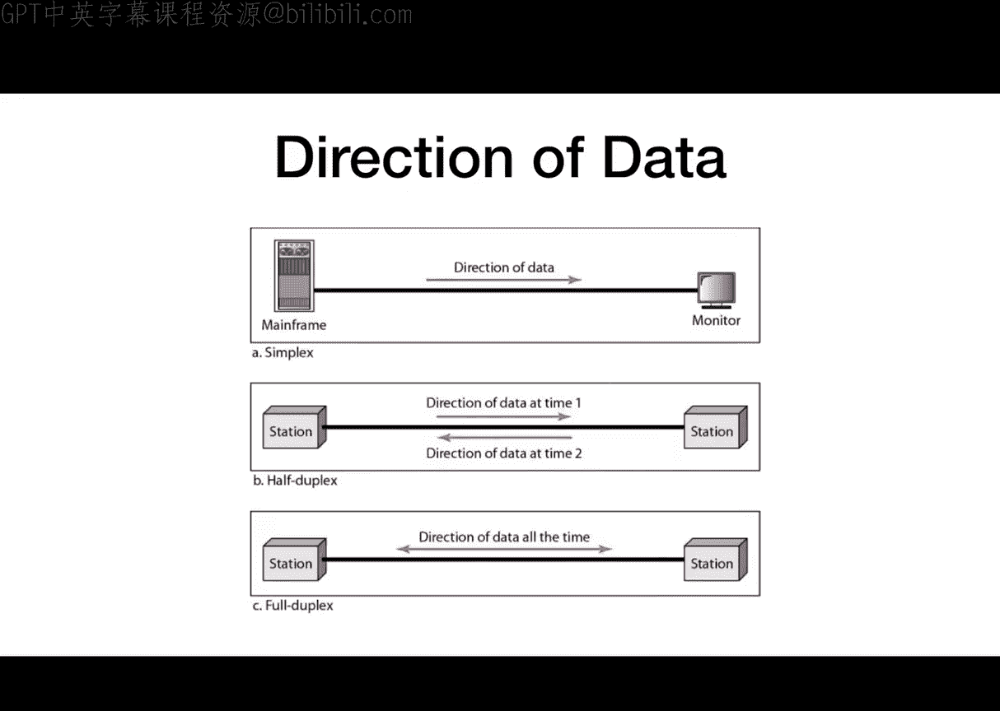

### 网状拓扑

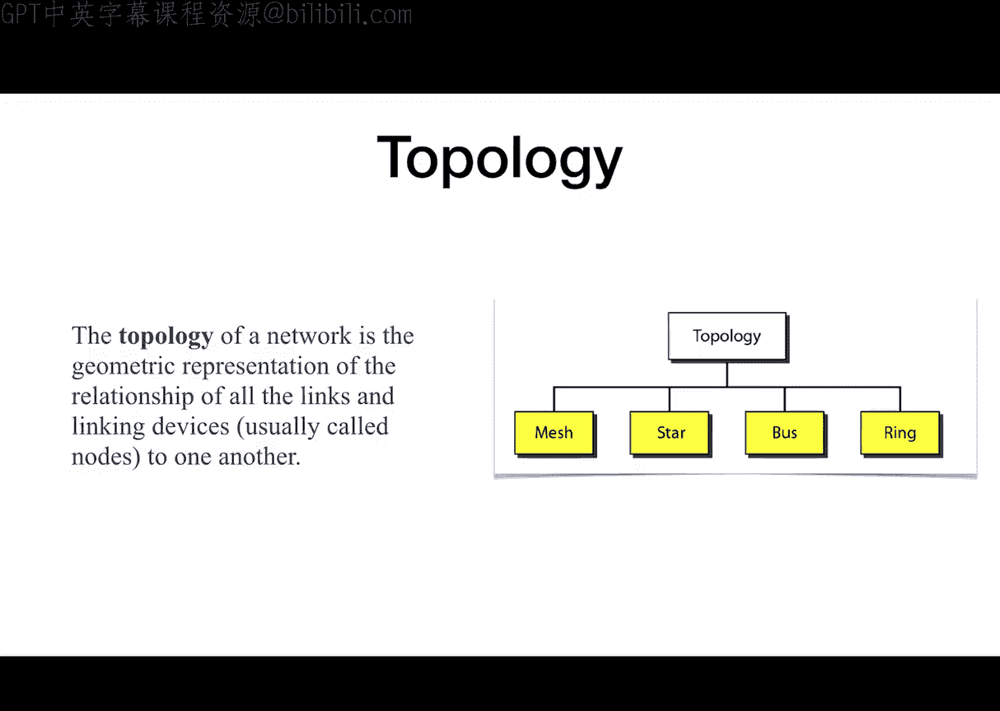

在网状拓扑中，你可以看到这里有五个站点（节点），它们彼此直接相连。例如，节点1连接到节点2、3、4、5。这意味着每个节点都与其他每个节点有专用连接。

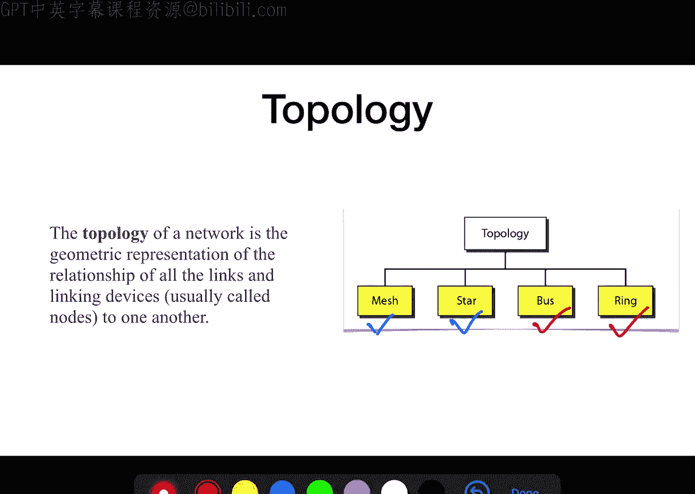

网状拓扑的特点是：每个设备都有一条到其他所有设备的专用点对点链路。该链路只承载它所连接的两个设备之间的流量，通常使用全双工模式。

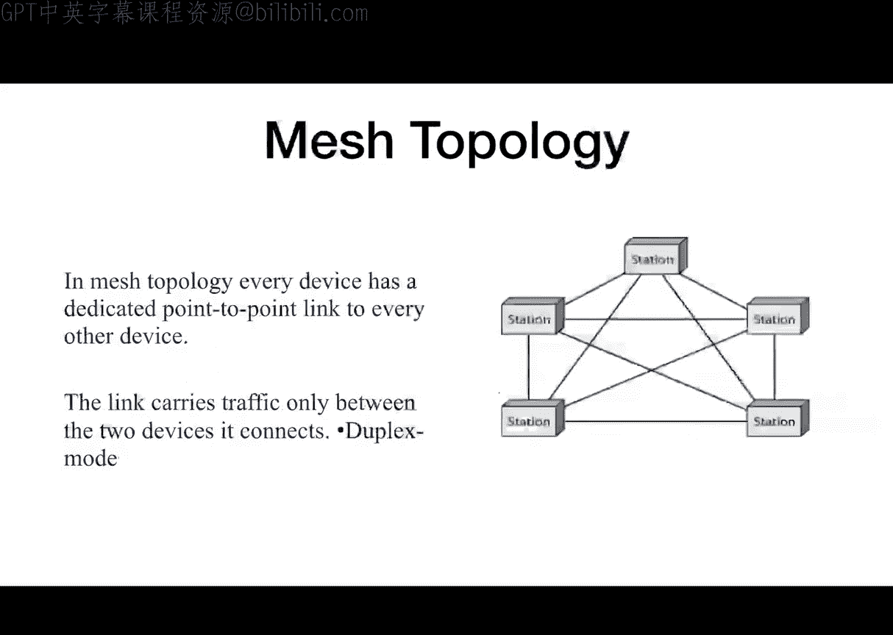

### 星型拓扑

星型拓扑意味着我们有一个集线器或交换机。就像大多数校园网络一样，每个实验室的计算机都连接到一个位于房间角落的集线器或交换机。

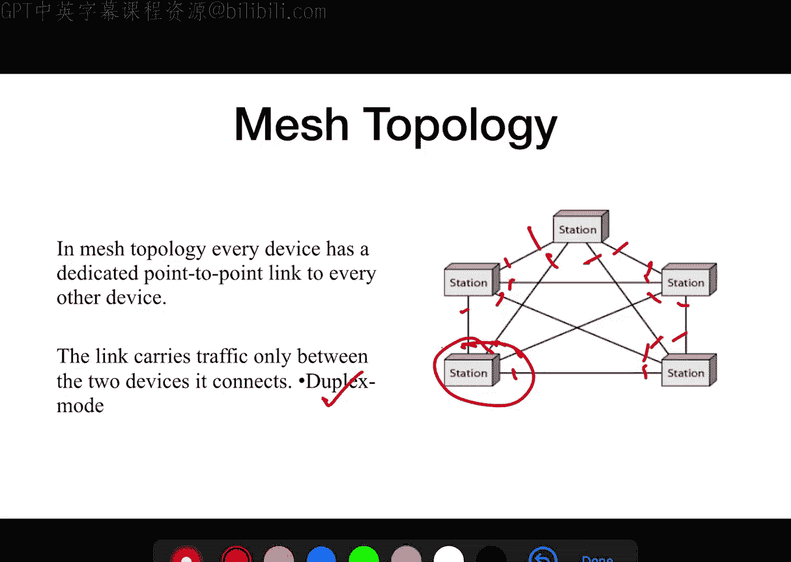

在星型拓扑中，每个设备都有一条专用的点对点链路，仅连接到一个称为集线器（或交换机）的中心控制器。控制器充当交换站。如果一个设备想向另一个设备发送数据，它会将数据发送给控制器，然后控制器将数据中继到另一个连接的设备。所有通信都通过这个中心控制器（交换机）进行。

### 总线拓扑

第三种是总线拓扑。总线拓扑是多点连接的。你可以看到这里有一个抽头，那里有一个抽头，还有电缆末端。节点像这样连接在一条总线上。

总线拓扑的特点是：一条长电缆充当主干，链接所有设备。网络节点通过引入线（抽头和分支线）连接到总线电缆。每个站点通过引入线连接到总线。

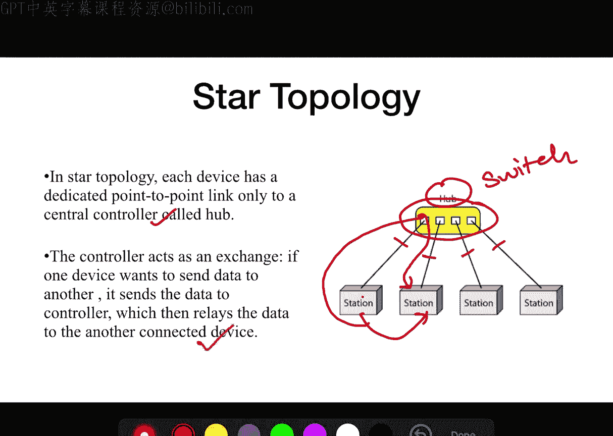

### 环型拓扑

环型拓扑连接成一个环。在环型拓扑中，每个设备仅与其两侧的两个设备有点对点连接。信号沿环单向从一个设备传递到另一个设备，直到到达目的地。

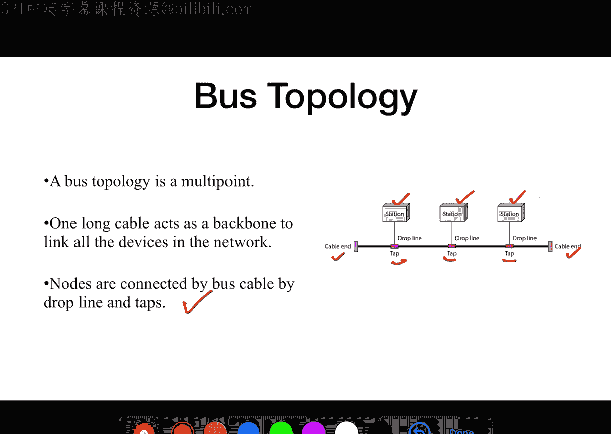

环型拓扑在容错方面非常有优势。如果任何一个特定站点发生故障，你仍然能够通过邻近的站点传输数据。因此，环型拓扑在高强度网络互连中非常有利。

## 思考与练习

现在，我们来看一些供学习者思考的问题。

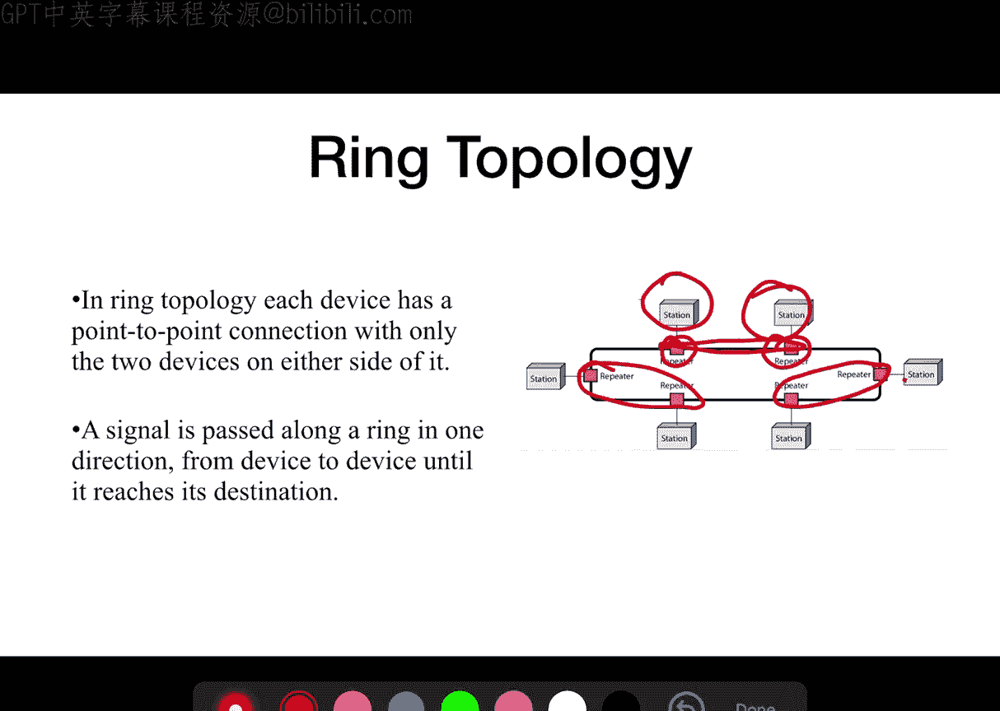

以下是两个思考题：
*   我们的Wi-Fi网络遵循哪种网络拓扑？
*   宽带网络遵循哪种拓扑？如果你家中有宽带连接，可以检查你的宽带路由器信息，或询问你的互联网服务提供商他们遵循哪种网络结构。

感谢各位听众和学习者。这是第一个基础主题。如果你已经熟悉计算机网络，可以跳过这部分内容。

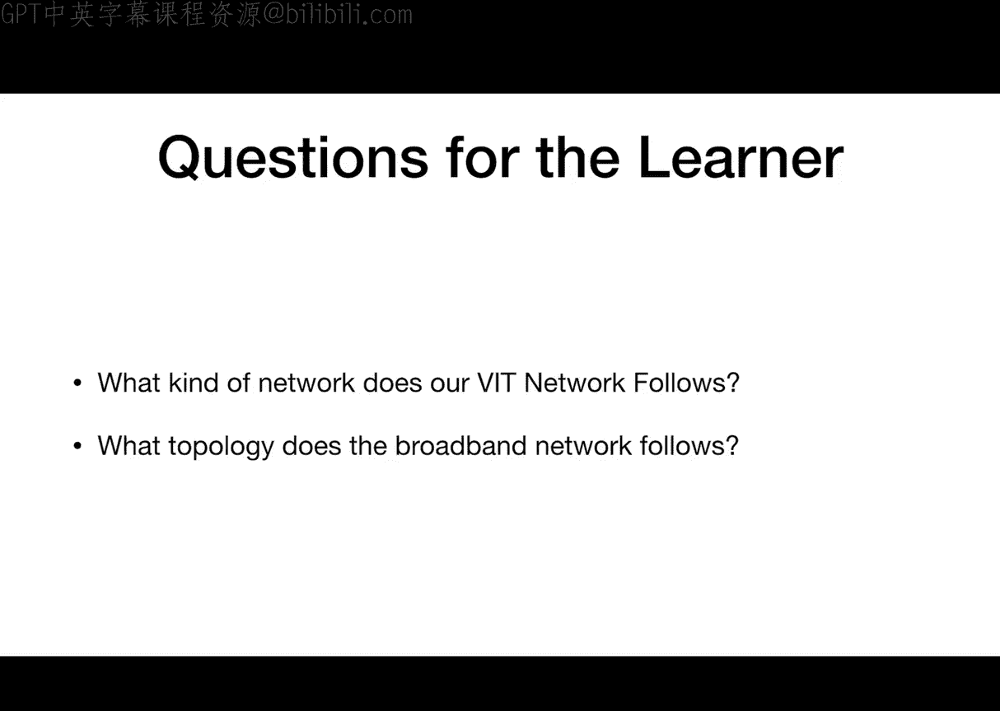

本节课中我们一起学习了计算机网络的基本概念，包括数据通信的五个组件、三种数据流方向（单工、半双工、全双工）以及四种主要的网络拓扑结构（网状、星型、总线、环型）。这些基础知识是后续进行网络模拟的重要前提。