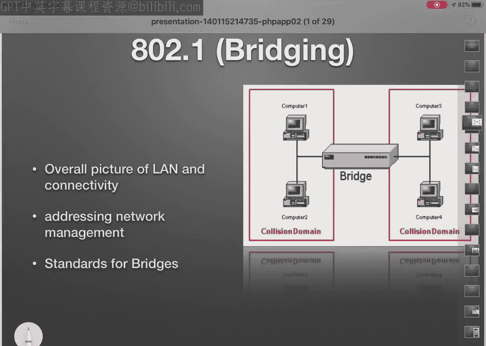

# 网络模拟器3教程：第1章：IEEE标准与标准化的必要性 🏗️

在本节课中，我们将学习网络标准化的核心概念，特别是IEEE 802系列标准。我们将探讨为什么需要标准化，并详细介绍从有线到无线网络的各种关键标准。

## 概述

标准化是网络技术发展的基石。它确保了不同厂商生产的设备能够相互通信和协作。本节课将重点介绍IEEE 802标准系列，这是定义局域网和城域网技术的主要标准。

## 为什么需要标准化？

上一节我们概述了标准化的意义，本节中我们来看看标准化的具体必要性。标准化主要解决以下核心问题：

以下是标准化的主要目的：

1.  **互操作性**：确保不同厂商生产的网络设备（如交换机、路由器、集线器、网关）能够相互通信和协作。
2.  **厂商独立性**：在设计和制造产品时，所有厂商必须遵循共同的标准。这为产品设计提供了一个共同的基础，确保所有新产品都遵守既定的标准化建议。

## 主要标准组织

在了解了标准化的必要性后，我们来看看制定这些标准的主要组织。主要有两个标准组织与网络技术密切相关：

以下是两个关键的标准组织：

*   **国际标准化组织**：该组织制定了著名的**OSI参考模型**。此外，ISO的成员**ANSI**负责制定从编程语言到磁盘驱动器的标准，例如C++语言标准。
*   **电气和电子工程师协会**：这是我们今天重点讨论的标准组织。IEEE拥有超过30万名会员，其计算机学会的会员就超过10万。IEEE 802系列是局域网和城域网的主要标准。

## IEEE 802标准详解

现在，让我们深入探讨IEEE 802系列中的具体标准。我们将逐一介绍从传统有线网络到现代无线网络的关键协议。

以下是IEEE 802系列的主要标准：

1.  **IEEE 802.1 - 网桥**
    *   该标准涉及局域网的整体架构、网络寻址、网络管理以及网桥标准。网桥用于连接多个网络段。

2.  **IEEE 802.2 - 逻辑链路控制**
    *   LLC是数据链路层的子层，与介质访问控制协同工作，负责设备间的数据包通信。

3.  **IEEE 802.3 - 以太网**
    *   这是应用最广泛的有线局域网标准。它采用**带冲突检测的载波侦听多路访问**技术。初始速度为10 Mbps，现已发展到10 Gbps甚至更高。
    *   代码示例：`if (collision_detected) { backoff_and_retransmit(); }`

4.  **IEEE 802.4 & 802.5 - 令牌总线和令牌环**
    *   这些是早期的局域网技术（如令牌环，速度4/16 Mbps），现已基本被淘汰。

5.  **IEEE 802.11 - 无线局域网**
    *   这就是我们熟知的**Wi-Fi**标准。它适用于手机、笔记本电脑、智能家居设备等。该标准家族经历了多次演进：
        *   **802.11a/b/g**：早期标准，工作在2.4 GHz免费频段，速度较慢（如11 Mbps, 54 Mbps）。
        *   **802.11n**：引入了**多输入多输出**技术，速度提升至最高600 Mbps，同时支持2.4 GHz和5 GHz频段。
        *   **802.11ac**：进一步提升了速度和容量，支持多用户MIMO，速度可达千兆级别。
        *   其他相关标准：`802.11e`（服务质量）、`802.11i`（安全增强）等。

6.  **IEEE 802.15 - 无线个域网**
    *   该系列标准用于短距离设备互联。
    *   **802.15.1**：**蓝牙**技术的基础。
    *   **802.15.4**：适用于物联网和无线传感器网络，如**Zigbee**协议。

7.  **其他IEEE 802标准**
    *   `802.16`：无线城域网。
    *   `802.21`：支持不同网络间切换的移动性协议。
    *   `802.22`：无线区域网。

## 总结与思考

本节课中，我们一起学习了网络标准化的必要性以及IEEE 802标准系列的核心内容。从确保互操作性的以太网到定义现代无线连接的Wi-Fi和蓝牙，这些标准构成了我们日常使用网络的基础。

最后，请思考一个问题：**您的手机或笔记本电脑支持哪些具体的IEEE 802.11标准（例如802.11ac, 802.11ax）？** 了解设备支持的标准有助于理解其网络性能。