# NS3教程：5：详解third.cc文件

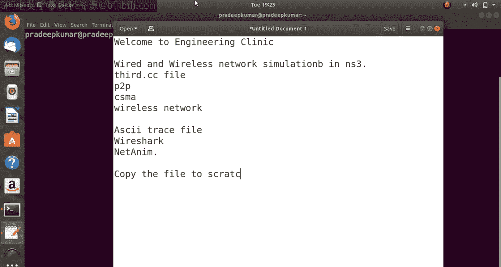

在本节课中，我们将学习NS3中一个名为`third.cc`的示例程序。该程序集成了点对点网络、CSMA局域网和无线网络三种网络拓扑，并演示了如何使用Wireshark、Trace Metrics和NetAnim等工具进行网络模拟分析。

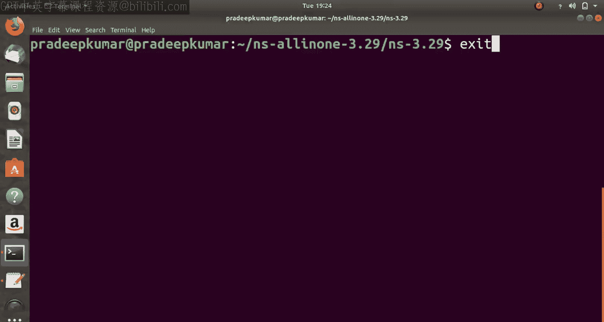

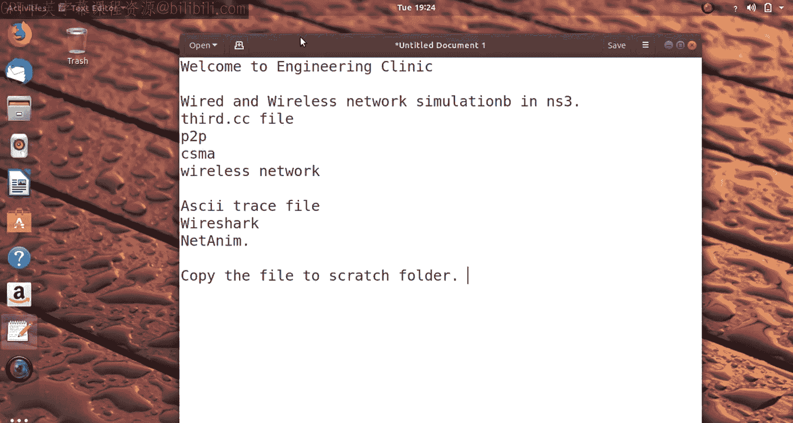

## 概述

`third.cc`是NS3自带的一个综合示例，它在一个模拟场景中同时创建了三种不同类型的网络节点：点对点节点、CSMA总线节点和无线节点。通过这个例子，我们可以学习如何配置复杂的网络拓扑、安装协议栈、设置应用程序以及生成和分析网络流量数据。

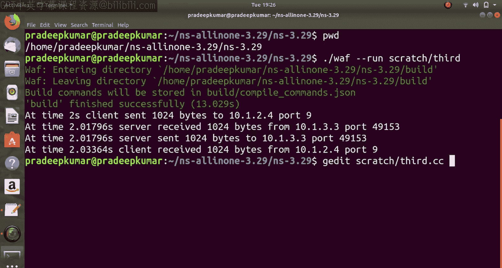

上一节我们介绍了基础的网络模拟，本节中我们来看看如何构建一个包含多种网络类型的综合场景。

## 准备工作

首先，我们需要将示例文件复制到NS3的`scratch`目录下，这是运行自定义脚本的标准位置。

```bash
cp examples/tutorial/third.cc scratch/
```

完成复制后，我们可以进入NS3的根目录，使用以下命令编译并运行该脚本：

```bash
./waf --run scratch/third
```

首次运行可能需要一些编译时间。运行成功后，终端会输出模拟过程的信息，例如在特定时间点发送了多少字节的数据包。

## 代码结构解析

现在，让我们深入查看`third.cc`文件的内容，理解其各个组成部分。

### 头文件与全局声明

程序开头包含了NS3各个模块所需的头文件。

```cpp
#include "ns3/core-module.h"
#include "ns3/point-to-point-module.h"
#include "ns3/network-module.h"
#include "ns3/applications-module.h"
#include "ns3/mobility-module.h"
#include "ns3/csma-module.h"
#include "ns3/internet-module.h"
#include "ns3/yans-wifi-helper.h"
#include "ns3/ssid.h"
```

接下来，在`main`函数中定义了一些控制模拟行为的变量。

```cpp
bool verbose = true;
uint32_t nCsma = 3;
uint32_t nWifi = 3;
bool tracing = false;
```
*   `verbose`: 控制是否输出详细日志。
*   `nCsma`: 定义CSMA网络中的节点数量（不包括与P2P网络共享的节点）。
*   `nWifi`: 定义无线网络中的站点节点数量。
*   `tracing`: 控制是否启用数据包追踪以生成PCAP文件。

### 创建网络节点

程序创建了三种网络的节点容器。

1.  **点对点节点**：创建了两个节点（n0, n1）。
2.  **CSMA节点**：创建了`nCsma`个节点，并将P2P节点中的n1也加入其中，因此CSMA总线上一共有`nCsma + 1`个节点。
3.  **无线节点**：创建了`nWifi`个站点节点（如n5, n6, n7）和一个接入点节点（AP）。接入点节点由P2P节点中的n0担任。

这构成了一个互联的网络拓扑：P2P网络连接n0和n1；n1同时属于CSMA网络；n0同时作为无线网络的接入点。

### 配置网络设备与信道

对于每种网络，都使用对应的`Helper`类来配置设备属性和安装网络设备。

*   **点对点网络**：使用`PointToPointHelper`设置链路的数据速率和延迟。
    ```cpp
    PointToPointHelper pointToPoint;
    pointToPoint.SetDeviceAttribute("DataRate", StringValue("5Mbps"));
    pointToPoint.SetChannelAttribute("Delay", StringValue("2ms"));
    ```
*   **CSMA网络**：使用`CsmaHelper`设置总线的数据速率和延迟。
    ```cpp
    CsmaHelper csma;
    csma.SetChannelAttribute("DataRate", StringValue("100Mbps"));
    csma.SetChannelAttribute("Delay", TimeValue(NanoSeconds(6560)));
    ```
*   **无线网络**：配置稍复杂，需要设置物理层、MAC层和移动模型。
    *   使用`YansWifiChannelHelper`和`YansWifiPhyHelper`配置无线信道和物理层。
    *   使用`WifiMacHelper`为站点节点和接入点节点分别设置MAC层参数，例如SSID。
    *   使用`MobilityHelper`为无线站点节点设置移动模型（如`RandomWalk2dMobilityModel`），为接入点节点设置固定位置模型。

### 安装协议栈与应用

在所有节点上安装Internet协议栈（TCP/IP）。

```cpp
InternetStackHelper stack;
stack.Install(p2pNodes);
stack.Install(csmaNodes);
stack.Install(wifiStaNodes);
stack.Install(wifiApNode);
```

然后，为节点分配IP地址。

```cpp
Ipv4AddressHelper address;
address.SetBase("172.11.1.0", "255.255.255.0"); // P2P网络
address.Assign(p2pDevices);
address.SetBase("172.11.2.0", "255.255.255.0"); // CSMA网络
address.Assign(csmaDevices);
address.SetBase("172.11.3.0", "255.255.255.0"); // 无线网络
address.Assign(staDevices);
address.Assign(apDevices);
```

接着，创建了一个UDP回声服务器应用，安装在CSMA网络的最后一个节点（n4）上。

```cpp
UdpEchoServerHelper echoServer(9);
ApplicationContainer serverApps = echoServer.Install(csmaNodes.Get(nCsma));
serverApps.Start(Seconds(1.0));
serverApps.Stop(Seconds(10.0));
```

同时创建了一个UDP回声客户端应用，安装在无线网络的最后一个站点节点（n7）上，并让它向服务器发送数据包。

```cpp
UdpEchoClientHelper echoClient(csmaInterfaces.GetAddress(nCsma), 9);
echoClient.SetAttribute("MaxPackets", UintegerValue(1));
echoClient.SetAttribute("Interval", TimeValue(Seconds(1.0)));
echoClient.SetAttribute("PacketSize", UintegerValue(1024));
ApplicationContainer clientApps = echoClient.Install(wifiStaNodes.Get(nWifi - 1));
clientApps.Start(Seconds(2.0));
clientApps.Stop(Seconds(10.0));
```

### 启用追踪与运行模拟

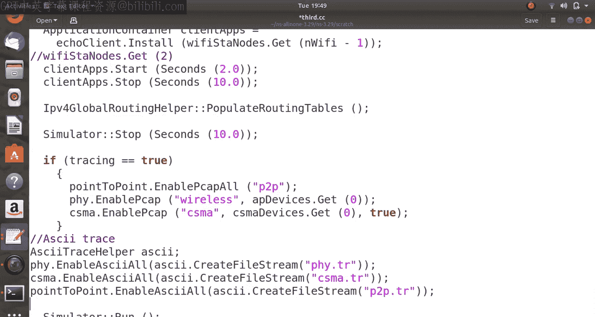

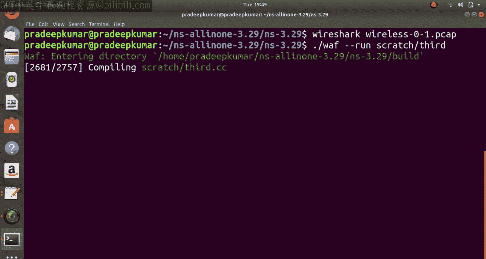

如果`tracing`变量设为`true`，程序会启用PCAP文件追踪，这将生成可供Wireshark分析的数据包捕获文件。

```cpp
if (tracing) {
    pointToPoint.EnablePcapAll("third");
    phy.EnablePcap("third", apDevices.Get(0));
    csma.EnablePcap("third", csmaDevices.Get(0), true);
}
```

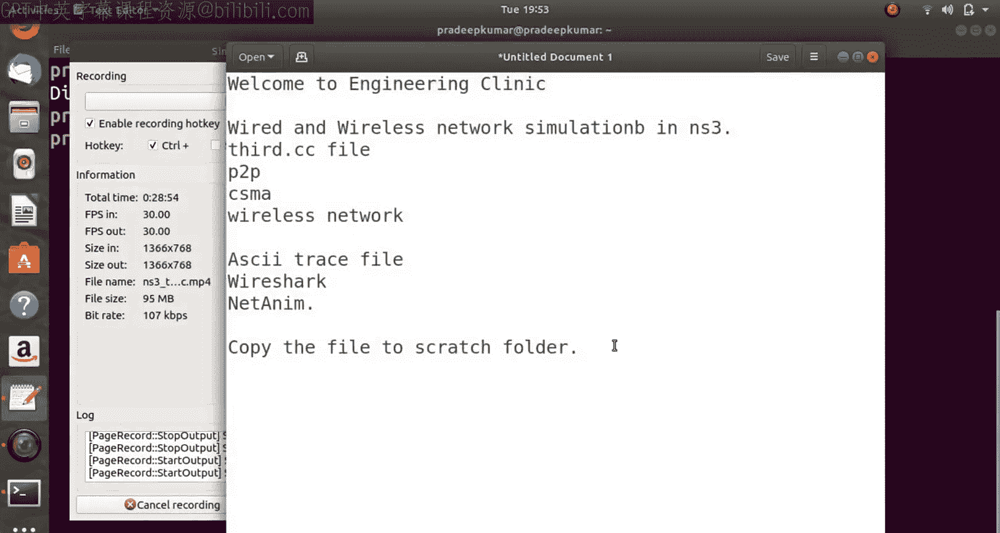

最后，设置模拟的起止时间并运行。

```cpp
Simulator::Stop(Seconds(10.0));
Simulator::Run();
Simulator::Destroy();
```

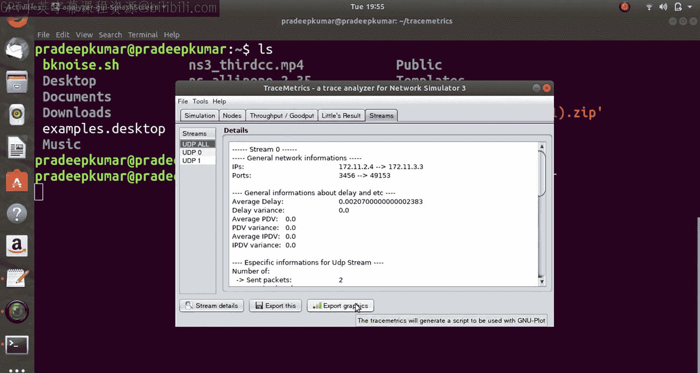

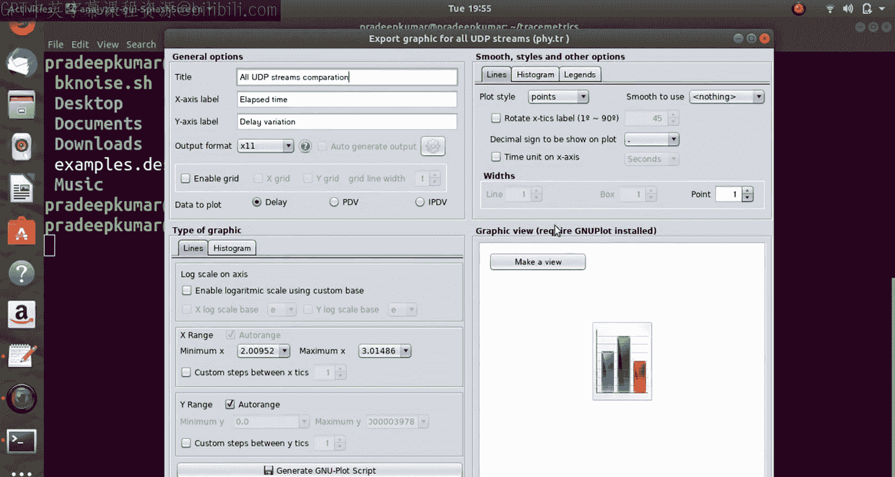

## 使用分析工具

运行模拟后，我们可以利用多种工具分析结果。

### Wireshark分析

当启用追踪后，会生成`.pcap`文件。使用Wireshark打开这些文件（例如`third-0-0.pcap`），可以直观地查看数据包的详细内容，如源/目的地址、协议类型、时序等。对于无线网络数据包，还可以分析信标帧等信息。

### Trace Metrics分析

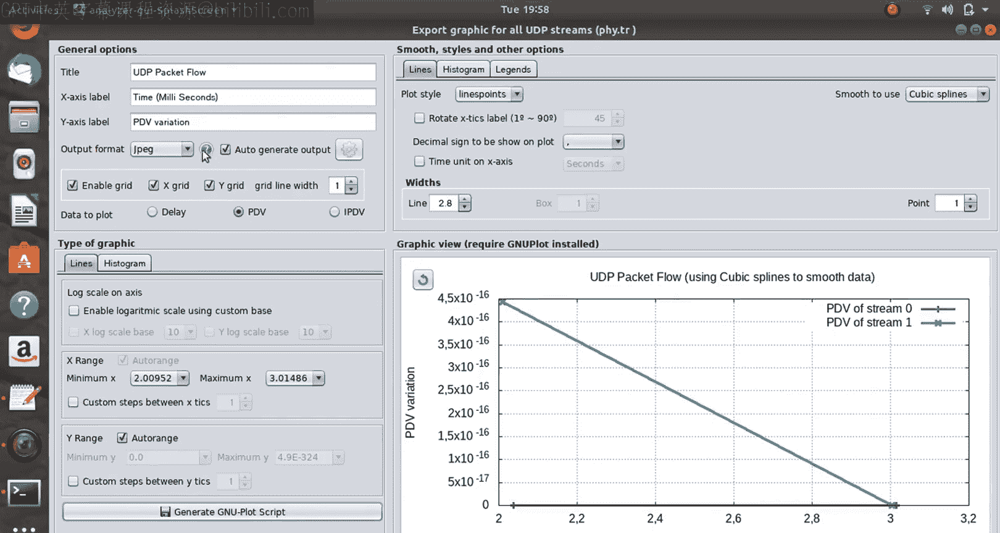

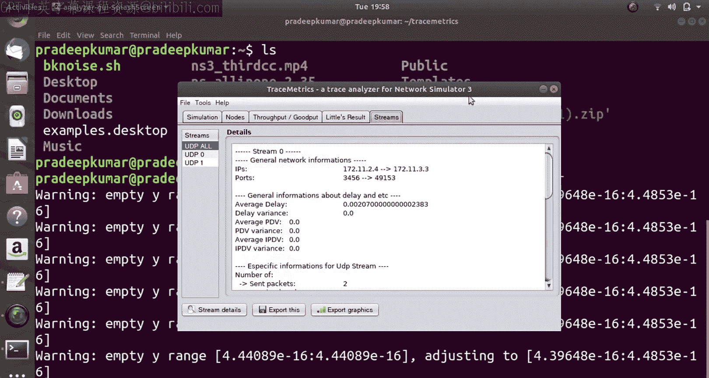

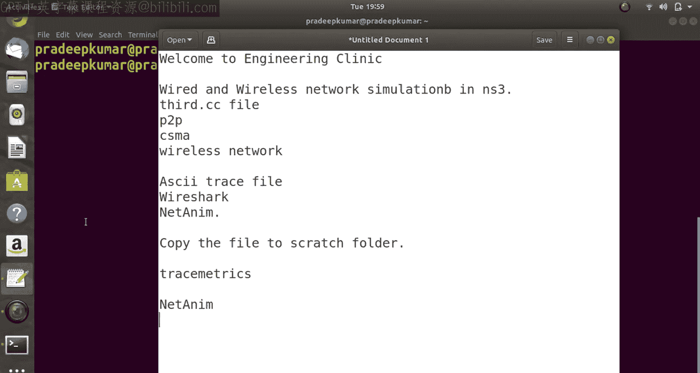

除了PCAP文件，我们还可以生成ASCII格式的追踪文件进行更灵活的分析。以下是创建追踪流的示例代码：

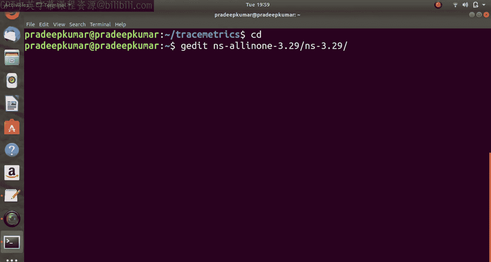

```cpp
AsciiTraceHelper ascii;
pointToPoint.EnableAsciiAll(ascii.CreateFileStream("third-p2p.tr"));
csma.EnableAsciiAll(ascii.CreateFileStream("third-csma.tr"));
phy.EnableAsciiAll(ascii.CreateFileStream("third-wifi.tr"));
```

使用`Trace Metrics`工具（一个Java应用程序）可以处理这些`.tr`文件。它能提供丰富的统计信息，如总发送/接收包数、吞吐量、端到端延迟等，并支持将数据图表化导出。

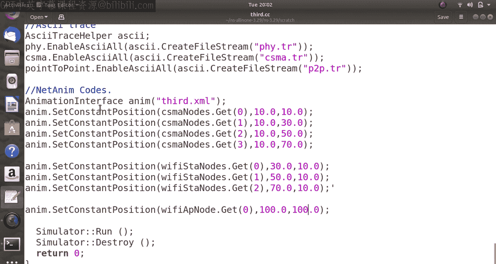

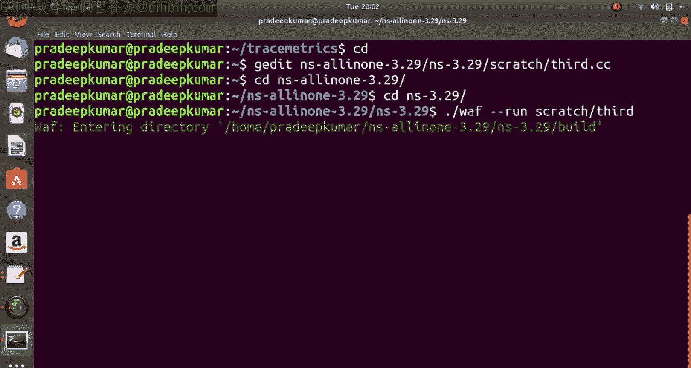

### NetAnim网络动画

为了可视化网络拓扑和节点间的数据流，我们可以使用NetAnim工具。这需要在代码中添加NetAnim模块头文件并配置节点位置。

```cpp
#include "ns3/netanim-module.h"
...
AnimationInterface anim("third.xml");
anim.SetConstantPosition(csmaNodes.Get(0), 10.0, 10.0);
anim.SetConstantPosition(wifiStaNodes.Get(0), 30.0, 50.0);
// ... 为其他节点设置位置
```

运行模拟后会生成`third.xml`文件，使用NetAnim打开该文件，即可看到一个动态的网络模拟动画，可以观察节点的移动和数据包的传输过程。

## 总结

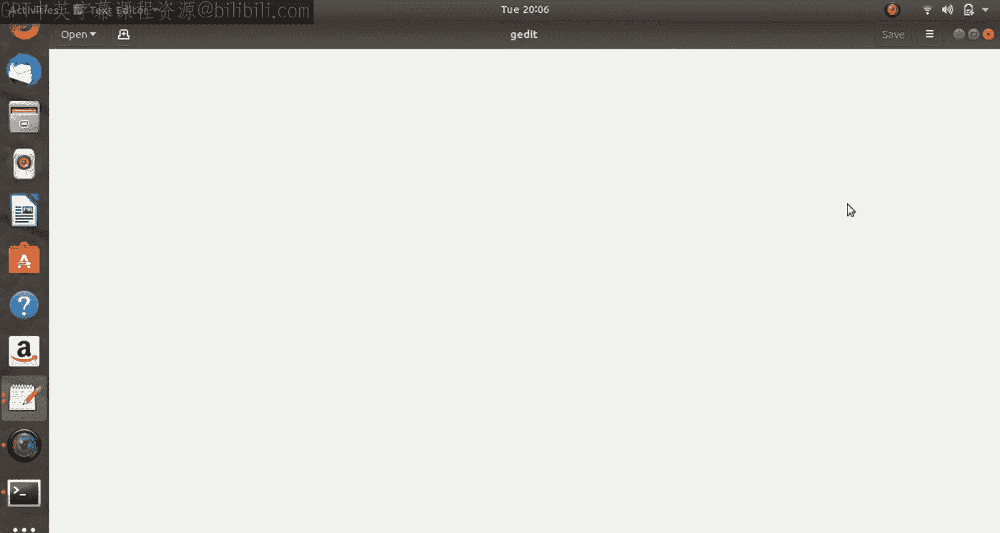

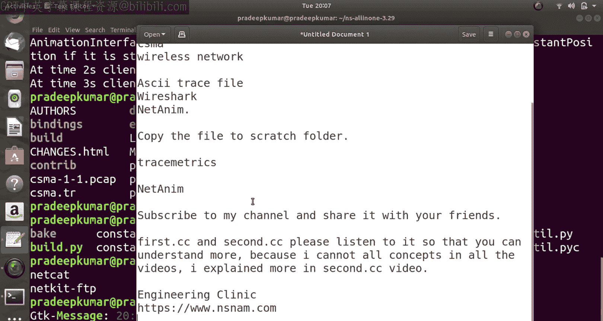

本节课中我们一起学习了NS3的`third.cc`综合示例。通过这个例子，我们掌握了如何构建包含点对点、CSMA和无线网络的混合拓扑，如何配置节点属性、安装协议栈和应用，以及如何利用Wireshark、Trace Metrics和NetAnim这三种强大的工具来捕获、统计和可视化网络模拟数据。这些技能是进行复杂网络协议研究和性能评估的基础。建议学习者尝试修改代码中的参数（如节点数量、IP地址、数据速率等），并观察模拟结果的变化，以加深理解。