# Engineering Clinic《网络模拟器3教程｜Network Simulator 3 Tutorial Series》中英字幕deepseek翻译 p29 -29-NS3.31 Installation in Ubuntu 20.04  _ Step by Step Instructions -BV1aQmtYZEPr_p29-

Hi， good evening， France。 Welcome to engineeringering Clinic。 This is D Pradip Kumma。And today。

 we are going to see。How to install Ns 3。31 U to 20。

0 for 64 bit operating system so there are so many questions and so many comments and given some personal messages also asking for the was some issue in NSS3。

31， particularly for U to 20。0 for ways， please help us in solving this error。

So because of those users I am just recording this video and then give it to you so in case of generalized NSS3 installation。

 you can use my other video as well。So first thing is now since Python。

 they are just stopping Python2 version。Is being stopped。You can still use it。

 but you need to go for Python 3， so wherever you come across Python。

 Python will just replace it to Python 3。So first time when assuming that you have a fresh installation of Uunto。

That installation of U to O。So first of what I do is first always， you do this pseudo app。Update。

So this is the first one you have to always do after you do that you do this package。

 a so app install。Build essential， so。Whatever software that are needed for the building any applications。

 those things are included。Auto configuration。Autoomic。Then Lib X M U， hyphen D。

So this is for library the thex libraries so any GY graphical performance or anything。

 so those things the development libraries will be coming along with this so please see that these two lines is mandatory。

For doing anything。So first to install this then afterwards I have some list of packages install all the packages so just copy paste given the description link just copy paste this so let me go to my window so what I am going to do so I just already pasted it here I will clear the screen。

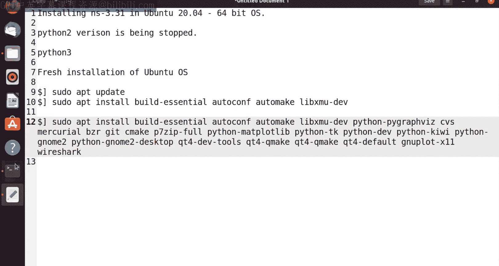

You can't see。 So wire shark。

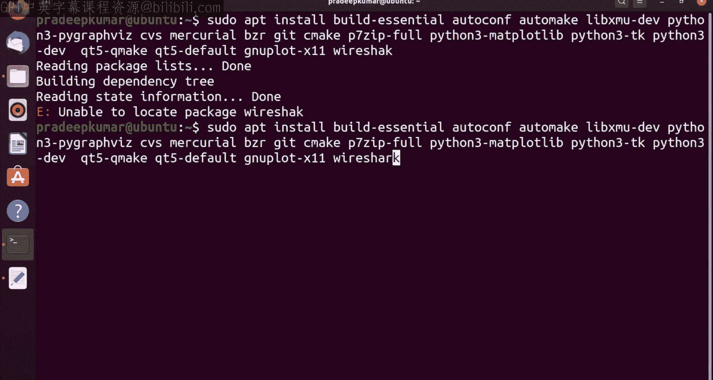

So now totally it will be needing 92 Mmb， totally 442 M of additional display space put yes。

Un click kiss。So it will be taking time according to an internet speed because I am just downloading directly from the internet the package as a downloader。

 so actually I am working on a virtual machine， which is inside my MacBook Pro。

I am just using a MacBook Pro， so we'll say that we have a virtual machine so we can see this here。

And wire shark， they wont use non super usersers to be able to capture packets。

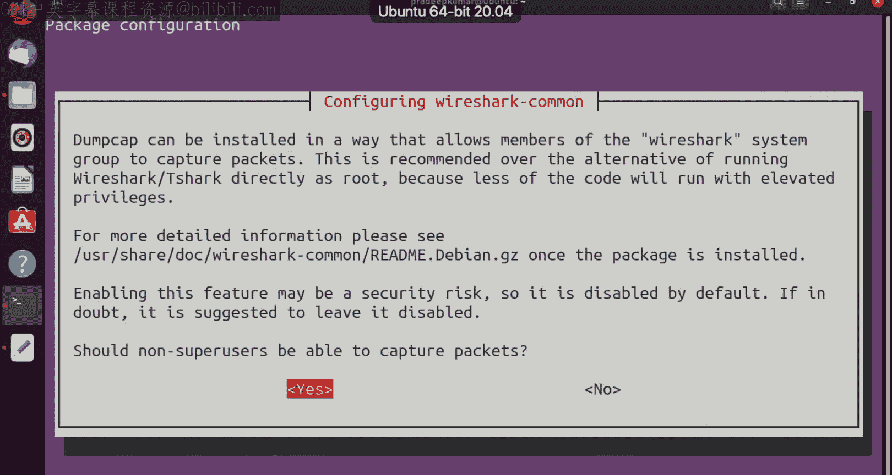

So in that case click a bias。So now installation is going on。

So I have already downloaded in the meantime， I have downloaded the industry3 software。

So home downloads， I already have this N S 3，3。31 dot dot dot b02， so what you do is just copy this。

And past it to home。Yes you do in case of if you want to unzip this， just click it。

Right click and extract here there is an obstacle lets extract here， please see this。So click this。

 So once you do this。Aomaically， you can see there an extraction is going on， preparing to extract。

So either you can use through terminal mode or you can use through。Graphal mode。

 So if you are comfortable in graphics， you can use graphical mode。So。Extracting this youngister。Yes。

 so extraction is done because there is a tick mark included it is done so now this is a folder that what we got Ns 3。

31 and Ns 3。31 so this is where the entire build libraries will be there so now in this case now this also get installed so we have installed all the software maybe try on more time。

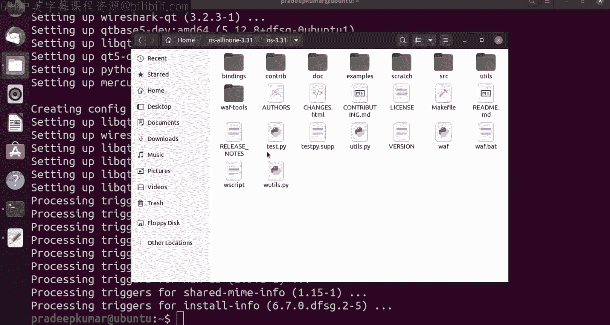

So it everything is in。So now I will go to Enna sallioma 3。3。

So here only I am going to install this so we have a file called us builded at Py so in this we are going to do something like this Ill just add it on。

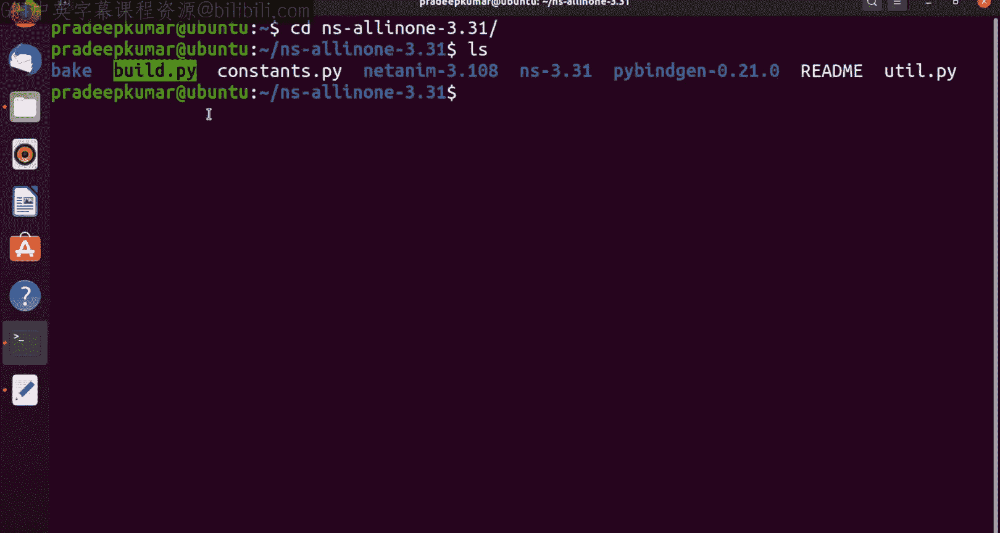

So， next command is。Extract。To home folder。 So in my case， the home folder is。Home or the coma。

 So Uni case find out what is the name of the home folder in case to a find out can use a code dollar home。

 So what is a home it will be showing。

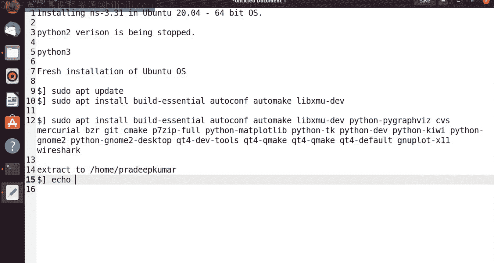

I will just show you that。

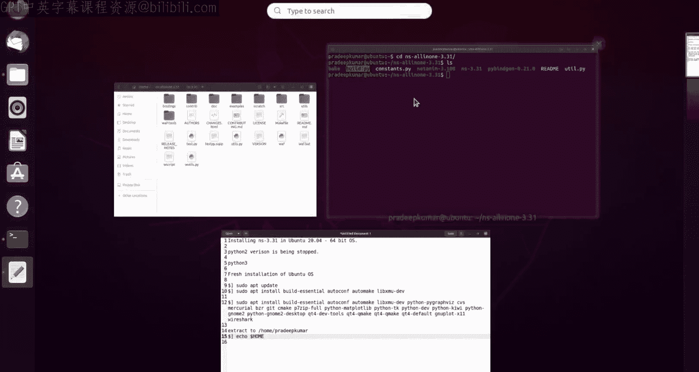

Eco dollar hope。So this is my home， so the similarly in your case also it will be telling you what is your home folder。

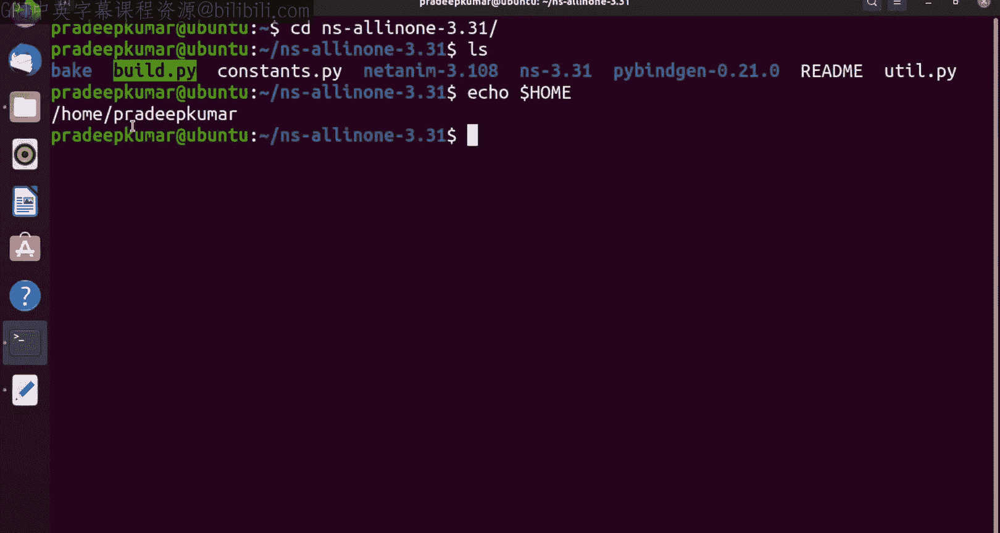

Okay， so now I'll be going and installing this。Silly， Yness， Ha fun。All in one hyphen 3。31。

Scralash them。Dot build。Sorry， build dark Py。Trlash enable。Hphone examples。Enable还有。

So this is a command that we will be using it。

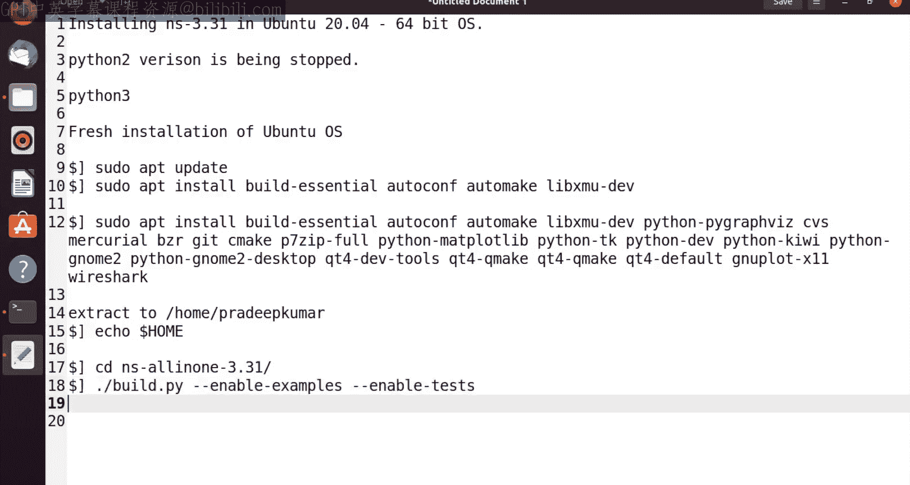

I will show you that build or P by。Enableable。Havean examples。Enable。So NS 3。

31 is recently launched similarly U to 20。0 for also recently six months back it launched。

 so both have the perfect compatibility of all the prerequisite libraries like CC++ and Python。

 all other softwares。So let us use that also， and lets see if it install successfully。

 so it will take。So冇 update。So。Willll wait。So I think now it will be coming。Yes。

 now you can see totally there are 2841 packages need to be installed。

So some the installation will take 10 minutes， sometimestime it takes 20 minutes according to the number of packages so now see that the packages are very slowly。

Movinging so what I do is Ill just stop the video here after the installation successful。

I'll switch on in case if I get DNA， also I'll switch on this video。

Hi friends welcome back so now we have installed this2852 packages totally out of all packages we have installed so now these are the models built so we got this message like this and these are the models that were built and nonbu models are bright click MP。

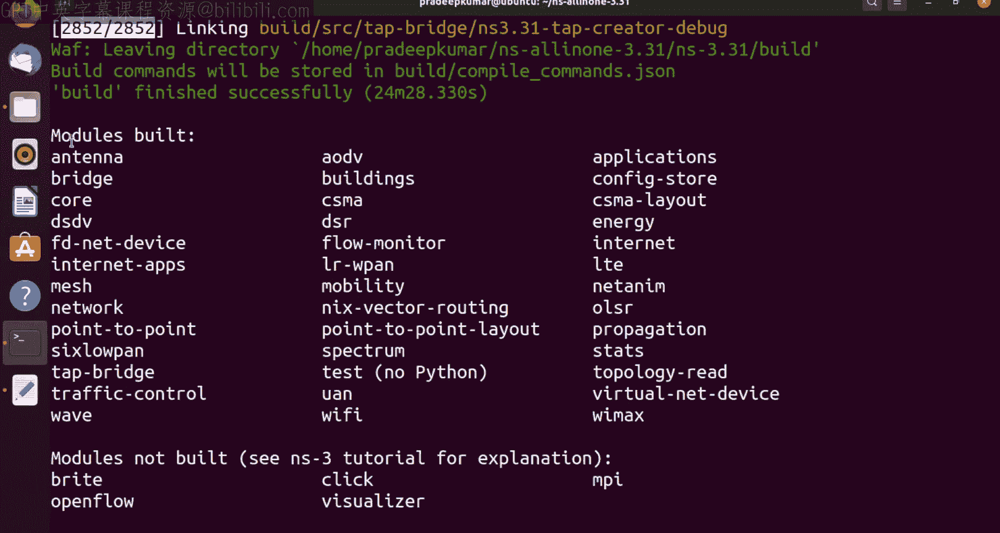

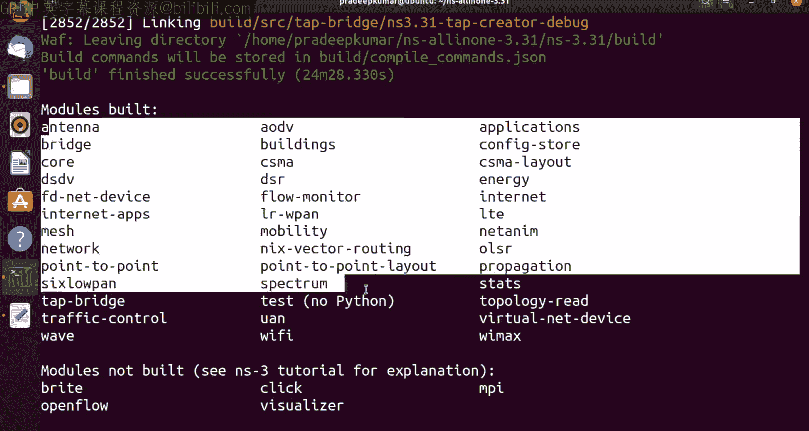

Visual laser and open flow so these five models are not being built so visual is the inbuilt animation comes along with the Ns3 open flow for software defined networking and this is a click modular router and multi programming multi processor and bright is a kind of a。

External per software so based on the software， we are going to do some where so many examples we will be doing it and this other the way we can install N3。

The folder。Ns 3。 31。The command here isva。E hellello， St。 Ho， hyphen St。So， once you run this。

You should not get any error。 And here we got the hellimulator， so it will be。

Displaying Ho simulator。 So this is a basic example that we can think of。

But in case we want to go with more examples， C D examples tutorial。

And can have an example as well as first do C。Second dotcc like that。 So copy the first dotcc。

second and。

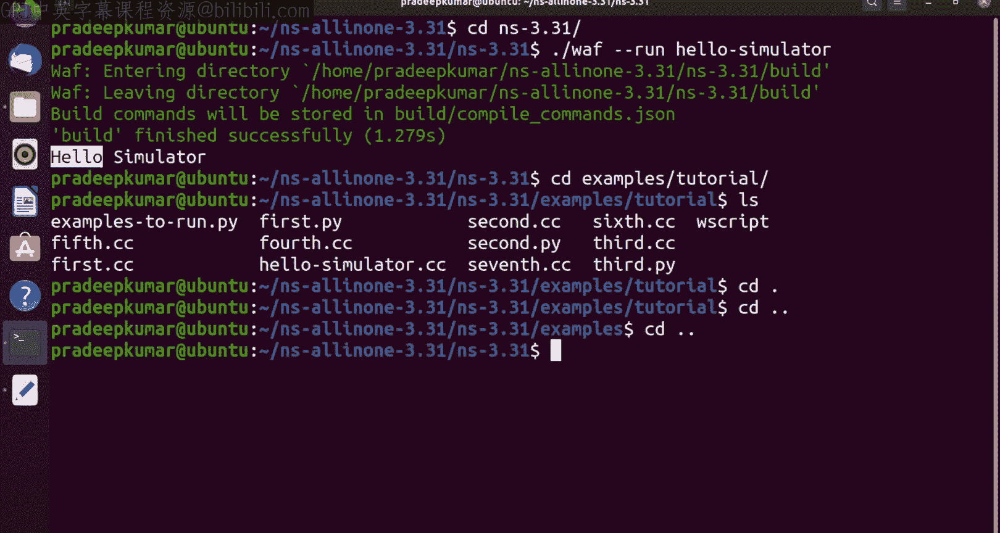

OfF， double H and then。啊。So no dot extension， simply use first so when you write first here。

 so we have seen this example。If you want to know more about this example。

 you can just refer to my other video on explaining Fast startcc example so you can able to check it I just click it in the top。

So this out the way we can install ins 3 so I have done a fresh installation of Uber2 20。

04 I have not installed any other software earlier it's a fresh installation so this is a method to install ins 3。

31 on a fresh installation of Uber2 20。04 so thanks for watching so please subscribe to my channel and please share it to your friends you thank you very much。

