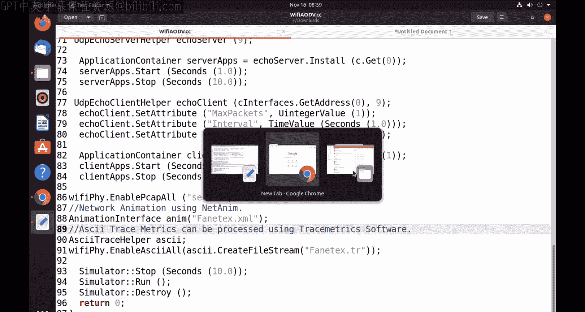
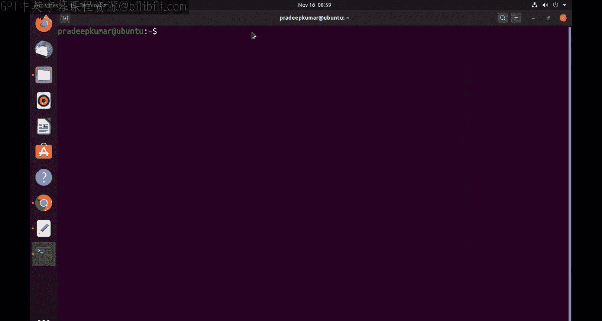
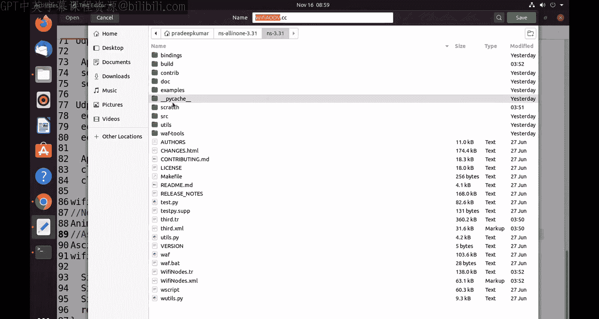
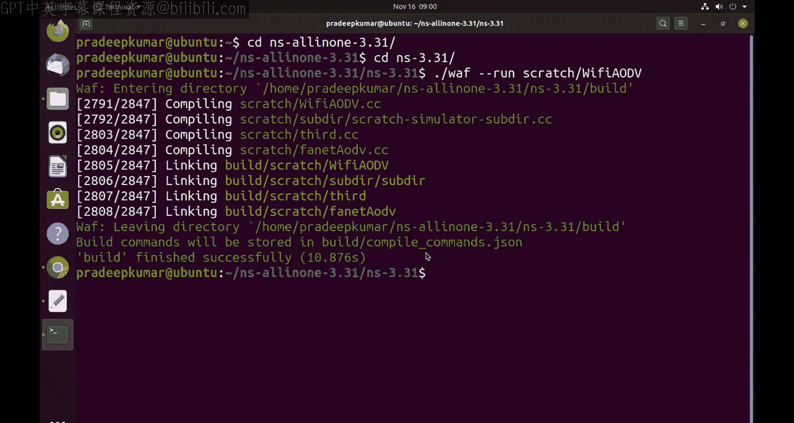
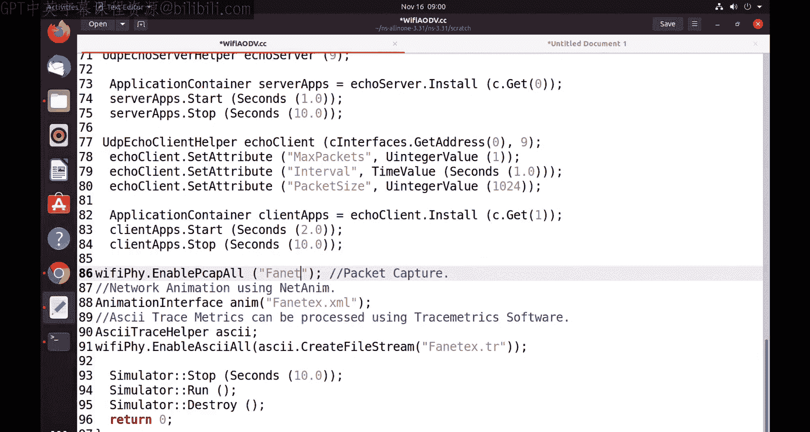
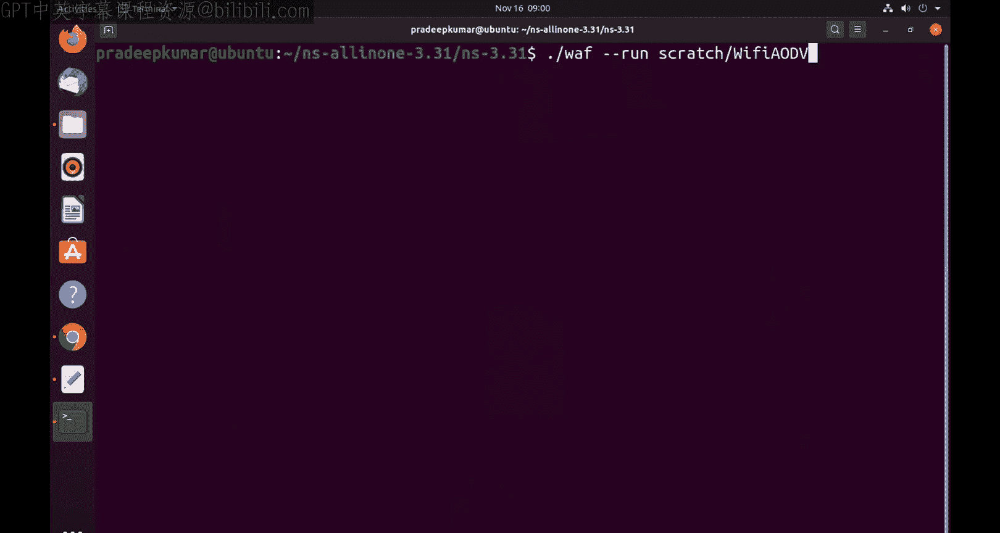
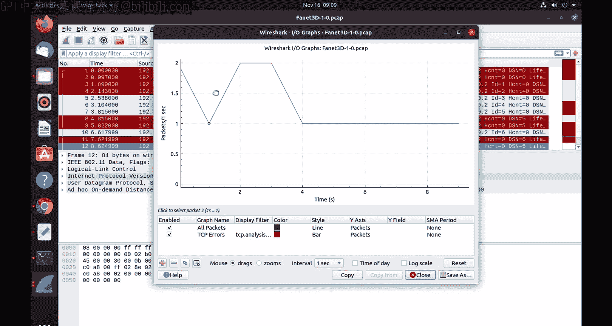
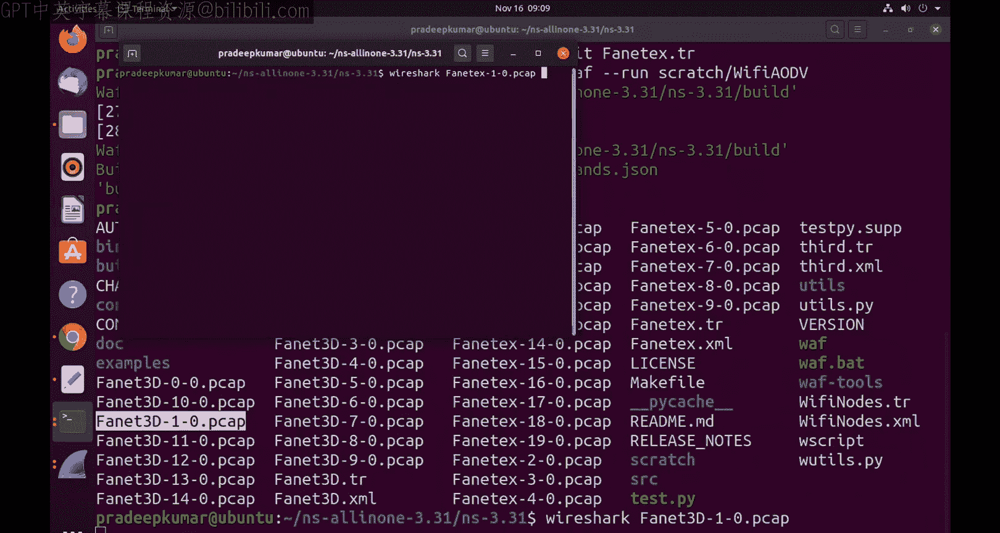
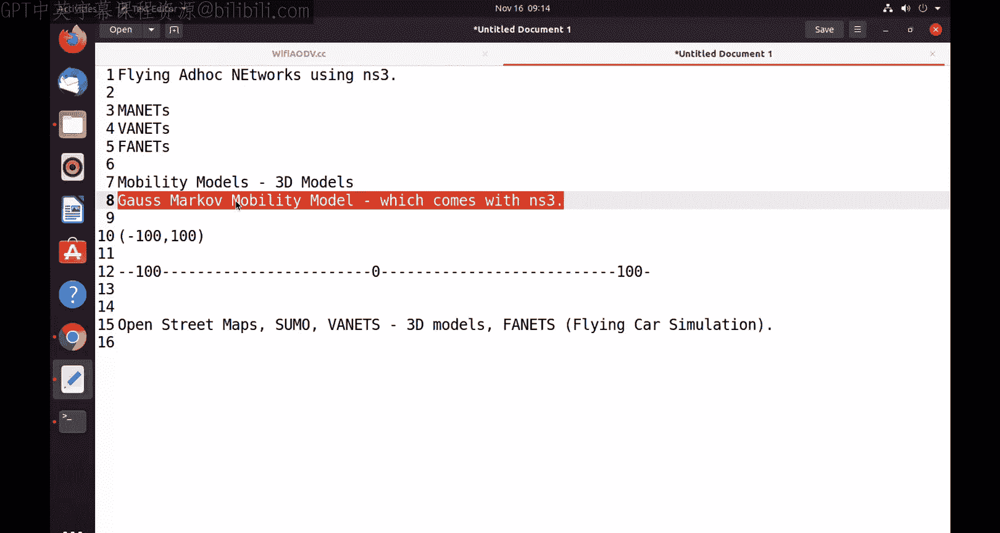

# 网络模拟器3教程：30：使用Ns3进行FANET模拟与3D移动模型 🚁

在本节课中，我们将学习如何使用网络模拟器3（Ns3）来模拟飞行自组织网络（FANET）。我们将重点介绍如何使用Ns3内置的3D移动模型——Gauss-Markov移动模型，来模拟无人机等飞行节点的三维运动。

## 概述

飞行自组织网络是移动自组织网络的一种特殊形式，其节点是无人机等飞行器。模拟这类网络的关键在于准确地模拟节点在三维空间中的移动。Ns3提供了Gauss-Markov移动模型来支持这种3D移动模拟。本节教程将指导你如何设置一个包含20个无线节点的FANET场景，配置3D移动模型，并运行模拟以生成网络流量和动画。

## 代码结构与配置

以下是构建FANET模拟的核心代码结构。我们将使用802.11b标准，并配置Ad-hoc模式的Wi-Fi MAC层，因为FANET中的节点需要直接相互通信。

**网络设备与协议配置：**
```cpp
// 创建20个节点
NodeContainer c;
c.Create(20);

// 配置Wi-Fi标准、MAC和物理层
WifiHelper wifi;
wifi.SetStandard(WIFI_STANDARD_80211b);
WifiMacHelper mac;
mac.SetType("ns3::AdhocWifiMac"); // 使用Ad-hoc模式
YansWifiPhyHelper wifiPhy;
YansWifiChannelHelper wifiChannel = YansWifiChannelHelper::Default();
wifiPhy.SetChannel(wifiChannel.Create());

// 安装网络设备
NetDeviceContainer devices = wifi.Install(wifiPhy, mac, c);
```

上一节我们介绍了网络的基本配置，本节中我们来看看如何设置路由和IP地址。

**路由与IP地址分配：**
我们使用AODV路由协议，并为所有节点分配IP地址。
```cpp
// 启用AODV路由协议
InternetStackHelper internet;
AodvHelper aodv;
internet.SetRoutingHelper(aodv);
internet.Install(c);

// 分配IP地址
Ipv4AddressHelper ipv4;
ipv4.SetBase("192.168.1.0", "255.255.255.0");
Ipv4InterfaceContainer interfaces = ipv4.Assign(devices);
```





## 配置3D移动模型





接下来是核心部分：配置3D移动模型。我们将使用Gauss-Markov模型，它允许节点在三维空间中以随机速度和方向移动。





以下是配置Gauss-Markov 3D移动模型的关键参数：
```cpp
MobilityHelper mobility;
mobility.SetMobilityModel("ns3::GaussMarkovMobilityModel",
                          "Bounds", BoxValue(Box(0, 100, 0, 100, 0, 100)), // 三维空间边界 (x, y, z)
                          "TimeStep", TimeValue(Seconds(0.5)),             // 时间步长
                          "Alpha", DoubleValue(0.85),                      // 记忆参数
                          "MeanVelocity", RandomVariableValue(UniformVariable(80, 200)), // 平均速度范围
                          "MeanDirection", RandomVariableValue(UniformVariable(0, 6.2831853)), // 平均方向
                          "MeanPitch", RandomVariableValue(UniformVariable(0, 0.05)),    // 平均俯仰角
                          "NormalVelocity", StringValue("ns3::NormalRandomVariable[Mean=0.0|Variance=0.0|Bound=0.4]"),
                          "NormalDirection", StringValue("ns3::NormalRandomVariable[Mean=0.0|Variance=0.0|Bound=0.4]"),
                          "NormalPitch", StringValue("ns3::NormalRandomVariable[Mean=0.0|Variance=0.0|Bound=0.4]"));

// 设置节点的初始位置分配器（在100x100x100的立方体内随机分布）
mobility.SetPositionAllocator("ns3::RandomBoxPositionAllocator",
                              "X", StringValue("ns3::UniformRandomVariable[Min=0|Max=100]"),
                              "Y", StringValue("ns3::UniformRandomVariable[Min=0|Max=100]"),
                              "Z", StringValue("ns3::UniformRandomVariable[Min=0|Max=100]"));

// 将移动模型安装到所有节点上
mobility.Install(c);
```

## 应用层与数据捕获

配置好移动性后，我们需要为节点生成流量，并设置工具来捕获和分析模拟数据。

**UDP应用生成：**
我们设置一个UDP客户端-服务器应用，其中节点0作为服务器，节点1作为客户端。
```cpp
// 创建UDP回声服务器（端口9）
UdpEchoServerHelper echoServer(9);
ApplicationContainer serverApps = echoServer.Install(c.Get(0));
serverApps.Start(Seconds(1.0));
serverApps.Stop(Seconds(10.0));

// 创建UDP回声客户端
UdpEchoClientHelper echoClient(interfaces.GetAddress(0), 9);
echoClient.SetAttribute("MaxPackets", UintegerValue(100));
echoClient.SetAttribute("Interval", TimeValue(Seconds(1.0)));
echoClient.SetAttribute("PacketSize", UintegerValue(1024));
ApplicationContainer clientApps = echoClient.Install(c.Get(1));
clientApps.Start(Seconds(2.0));
clientApps.Stop(Seconds(10.0));
```

**数据捕获与分析工具：**
为了观察和分析模拟结果，我们启用数据包捕获（PCAP）和网络动画。
```cpp
// 启用PCAP捕获（用于Wireshark分析）
wifiPhy.EnablePcap("fanet3d", devices);

// 启用ASCII跟踪（用于自定义分析）
AsciiTraceHelper ascii;
wifiPhy.EnableAsciiAll(ascii.CreateFileStream("fanet3d.tr"));

// 启用NetAnim动画
AnimationInterface anim("fanet3d.xml");
```





## 运行模拟与结果分析

完成代码编写后，在Ns3环境中编译并运行脚本。模拟结束后，你会得到以下文件：
*   `.pcap` 文件：可用Wireshark打开，进行数据包级别的协议分析（如吞吐量、延迟统计）。
*   `.tr` 文件：ASCII格式的跟踪文件，记录了每个数据包的发送、接收、丢弃等事件。
*   `.xml` 文件：NetAnim动画文件，可以直观地看到20个节点在三维空间中的移动和通信过程。

通过比较使用2D随机移动模型和3D Gauss-Markov模型的模拟结果，你可以观察到节点移动模式对网络连接性和数据流产生的不同影响。在3D模型中，节点在高度上的变化使得网络拓扑更加动态。

## 总结

本节课中我们一起学习了如何在Ns3中构建一个FANET模拟场景。核心内容包括：
1.  配置基于802.11b的Ad-hoc无线网络。
2.  使用AODV路由协议。
3.  重点配置并应用了**Gauss-Markov 3D移动模型**来模拟飞行节点的运动。
4.  设置了UDP应用层流量。
5.  利用PCAP、ASCII跟踪和NetAnim工具来捕获和分析模拟结果。



通过本教程，你掌握了使用Ns3进行三维移动网络模拟的基本方法，为研究无人机网络、飞行汽车通信等前沿课题打下了基础。你可以尝试修改移动模型参数、节点数量或通信协议，来探索不同场景下的网络性能。