# 网络模拟器3教程：第33-34课：在Ubuntu 20.04中安装ns-3.34 🛠️


## 概述
在本节课中，我们将学习如何在Ubuntu 20.04操作系统上，一步一步地安装网络模拟器ns-3的最新版本ns-3.34。我们将涵盖从系统更新、依赖包安装到编译ns-3.34源码，并最终运行一个示例程序来验证安装是否成功的全过程。

---

## 准备工作与系统更新
首先，我们需要确保系统是最新的，并安装所有必要的依赖包。这是安装任何软件前的好习惯，可以避免潜在的兼容性问题。

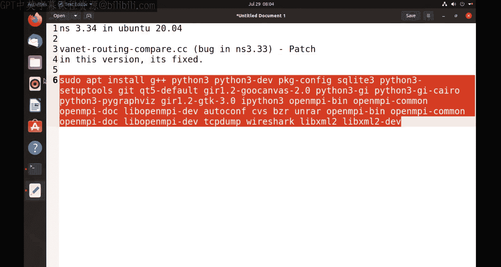

打开一个终端，执行以下命令来更新软件包列表：
```bash
sudo apt update
```

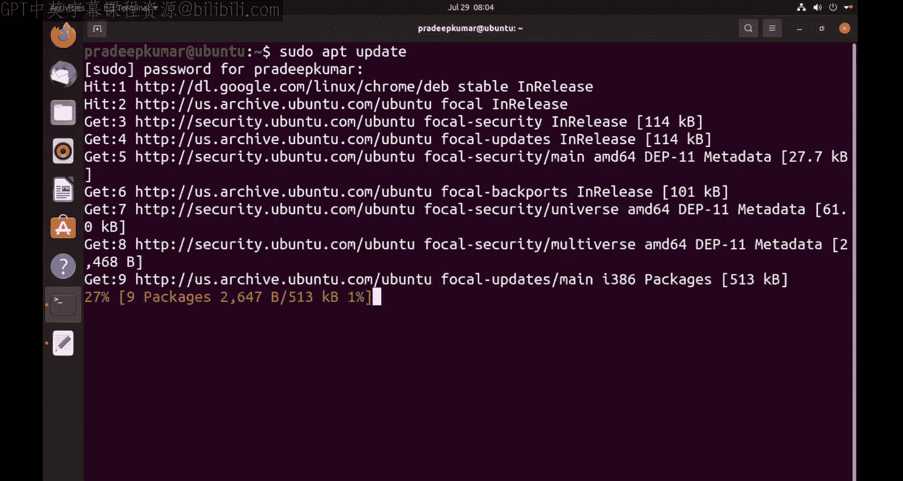

更新完成后，我们将安装ns-3.34运行所需的一系列依赖包。以下是需要执行的命令，它会下载并安装大约152MB的软件包：
```bash
sudo apt install -y g++ python3 python3-dev pkg-config sqlite3 cmake python3-setuptools git qtbase5-dev qtchooser qt5-qmake qtbase5-dev-tools gir1.2-goocanvas-2.0 python3-gi python3-gi-cairo python3-pygraphviz gir1.2-gtk-3.0 ipython3 openmpi-bin openmpi-common openmpi-doc libopenmpi-dev autoconf cvs bzr unrar gdb valgrind uncrustify doxygen graphviz imagemagick texlive texlive-extra-utils texlive-latex-extra texlive-font-utils dvipng latexmk python3-sphinx dia gsl-bin libgsl-dev libgslcblas0 tcpdump sqlite sqlite3 libsqlite3-dev libxml2 libxml2-dev libgtk-3-dev vtun lxc uml-utilities libboost-all-dev
```

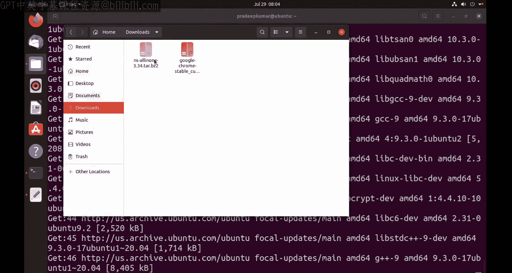

在安装依赖包的同时，我们可以去下载ns-3.34的源代码。

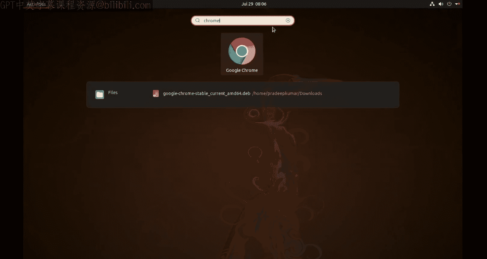

---

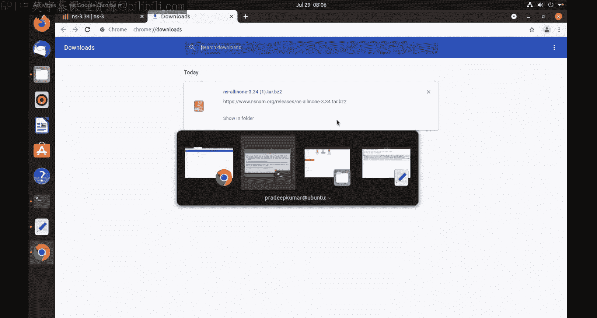

## 下载ns-3.34源代码
上一节我们准备好了系统环境，本节我们来获取ns-3.34的源代码。

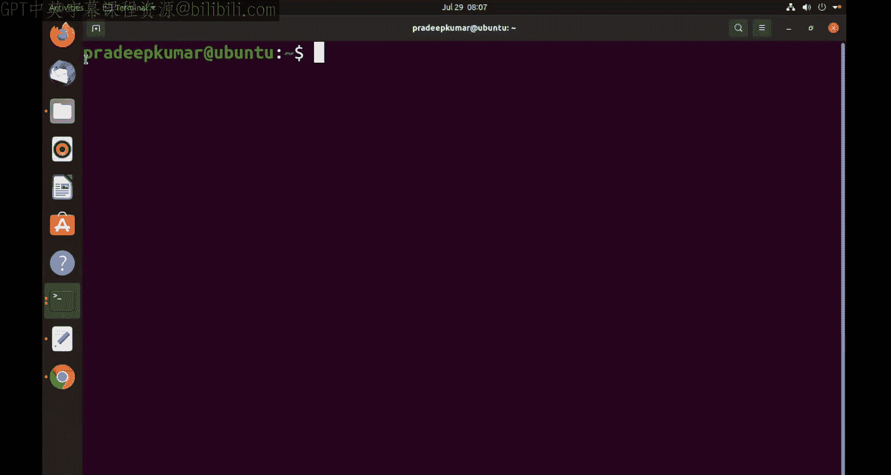

访问ns-3的官方网站（https://www.nsnam.org/），找到下载页面，选择最新的ns-3.34版本进行下载。你也可以直接使用wget命令下载。下载完成后，你通常会得到一个名为 `ns-allinone-3.34.tar.bz2` 的压缩包。

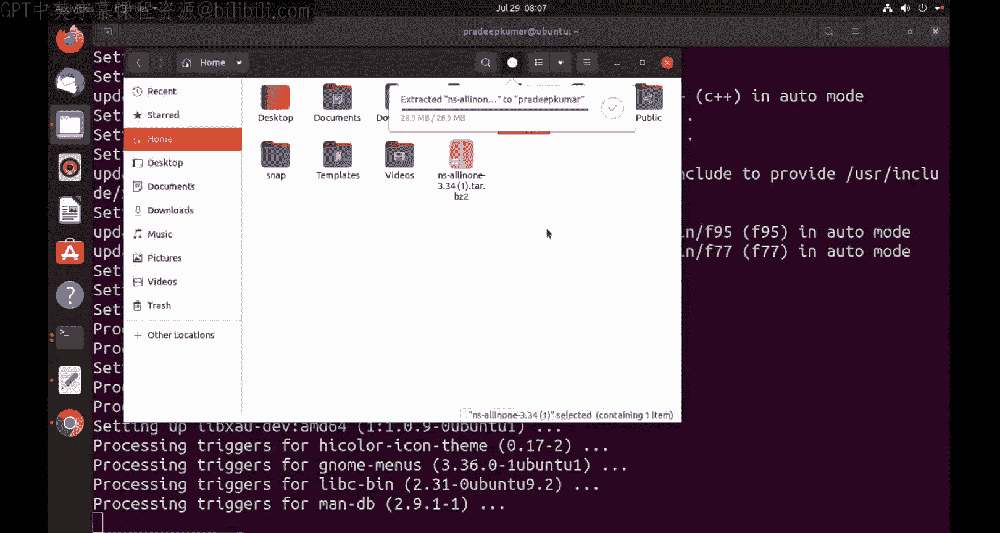

将下载的压缩包移动到你的主目录（`/home/你的用户名/`）下，然后解压：
```bash
tar -xjvf ns-allinone-3.34.tar.bz2
```
解压后会生成一个名为 `ns-allinone-3.34` 的文件夹。为了简化路径，我们可以将其重命名为 `ns3`：
```bash
mv ns-allinone-3.34 ns3
```

---

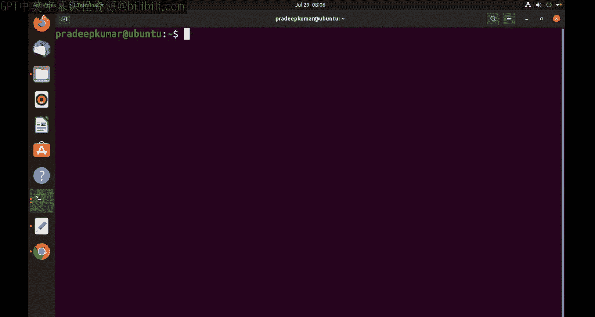

## 配置与编译ns-3.34
现在我们已经有了源代码，接下来进入最关键的配置和编译阶段。这个过程会将源代码构建成可执行的程序。

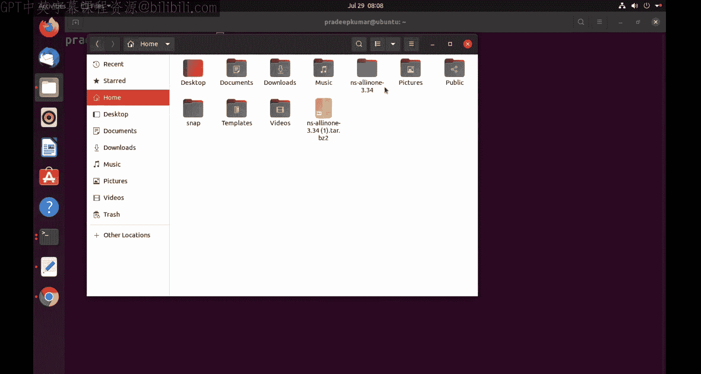

首先，进入ns3目录：
```bash
cd ns3
```

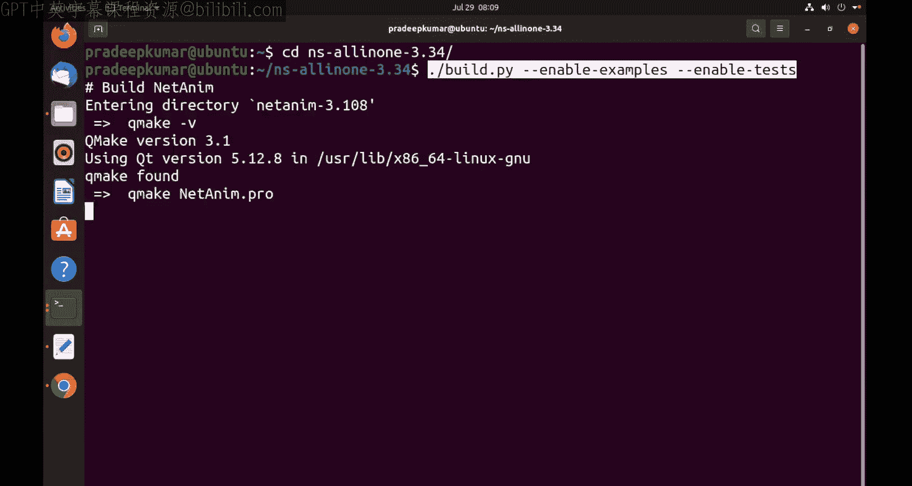

然后，使用 `./waf` 工具进行配置和编译。我们启用测试和示例程序，这对于学习和调试非常有帮助。执行以下命令：
```bash
./waf configure --enable-tests --enable-examples
```
这个命令会检查系统环境并配置编译选项。配置成功后，开始编译：
```bash
./waf build
```

编译过程会安装包括网络可视化工具（NetAnim）、Python绑定、Wireshark集成以及各种核心模块（如网络、路由、移动模型等）在内的多个组件。整个过程可能会持续较长时间（例如一小时左右），具体取决于你的电脑性能。

编译完成后，终端会显示成功构建的模块列表。可能会有一小部分可选模块（如OpenFlow、DPDK）因缺少依赖而未被构建，但这通常不影响ns-3的核心功能。

---

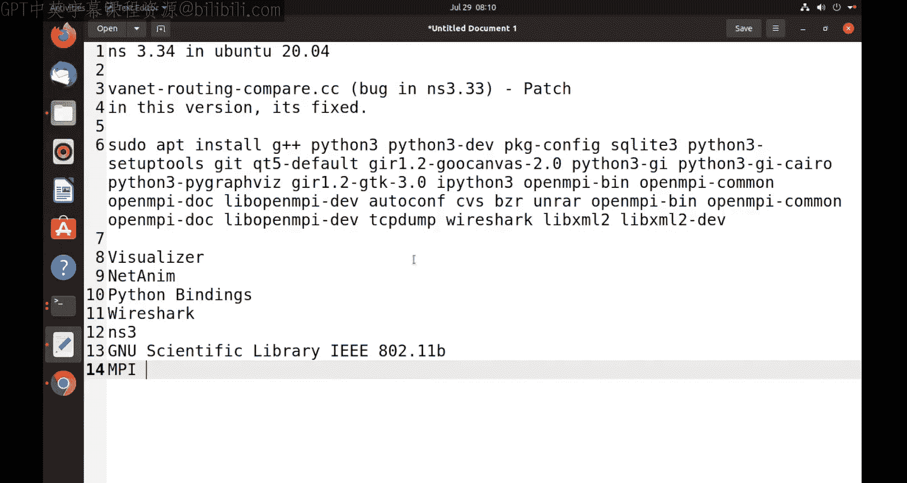

## 验证安装与运行示例
编译完成后，我们需要验证ns-3.34是否安装成功。一个很好的方法是运行一个自带的示例程序。

ns-3.34修复了之前版本中 `vanet-routing-compare.cc` 示例文件的一个编译错误。我们将运行这个示例来测试安装。

首先，进入示例文件所在的目录：
```bash
cd src/cvanet/examples
```

然后，将该示例程序复制到ns-3的临时运行目录（scratch）下：
```bash
cp vanet-routing-compare.cc ../../../scratch/
```

返回ns3主目录，并运行该程序：
```bash
cd ../../../
./waf --run scratch/vanet-routing-compare
```

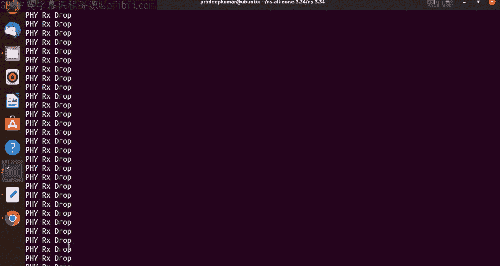

如果安装成功，程序将开始运行。你会在终端看到模拟过程的输出信息，包括数据包的发送、接收和丢包统计。程序运行一段时间后，会输出诸如**包投递率（PDR）**和**有效吞吐量（Goodput）**等性能指标。这证明ns-3.34已经成功安装并可以正常工作。

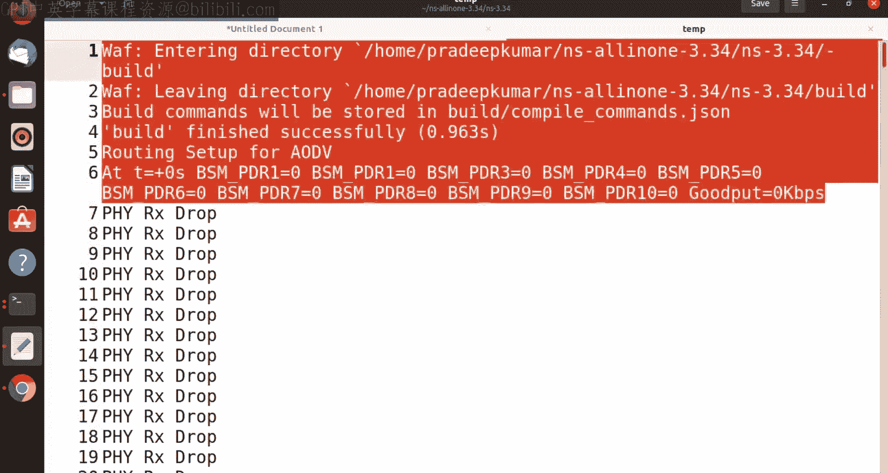

你也可以将输出重定向到一个文件以便查看：
```bash
./waf --run scratch/vanet-routing-compare > output.txt 2>&1
```

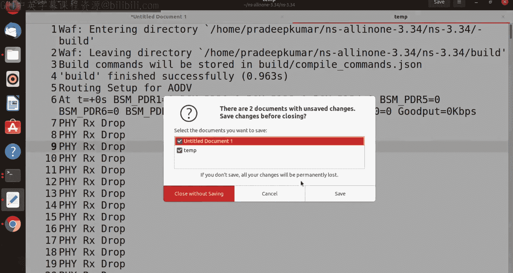

---

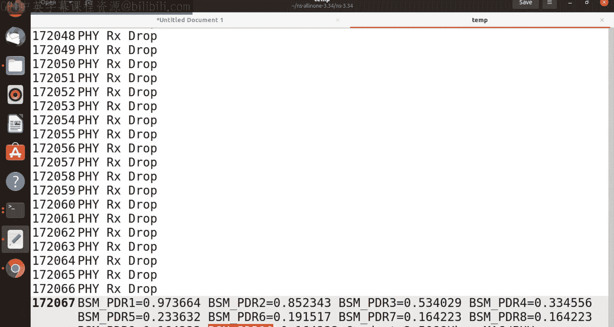

## 总结
本节课中，我们一起完成了在Ubuntu 20.04上安装ns-3.34的全过程。我们首先更新了系统并安装了所有必要的依赖包，然后下载并解压了ns-3.34的源代码。接着，我们使用waf工具配置和编译了整个项目。最后，通过成功运行 `vanet-routing-compare` 示例程序，我们验证了安装是正确且可用的。

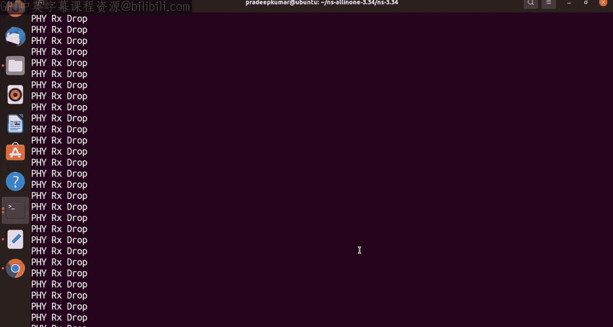

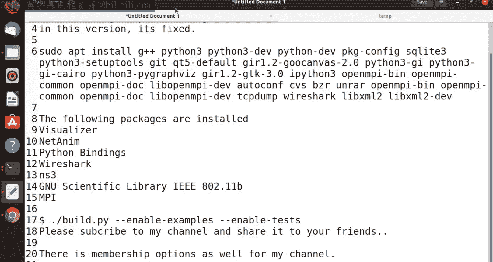

现在，你已经拥有了一个可以运行网络模拟实验的ns-3.34环境，可以开始探索更多的示例和创建你自己的仿真项目了。