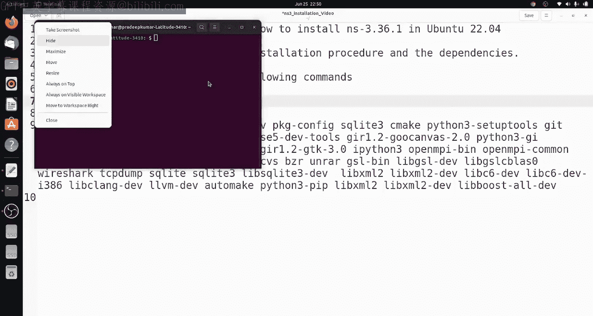
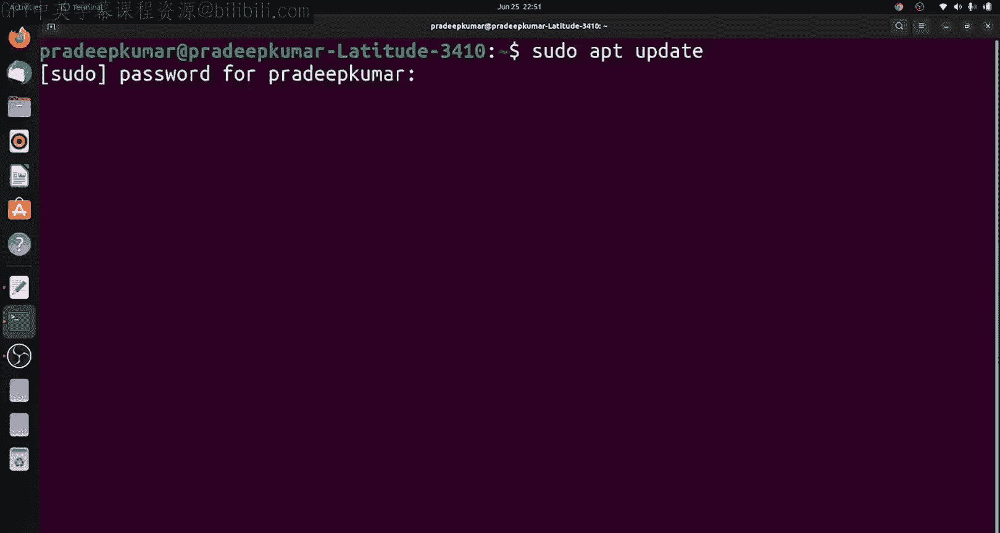
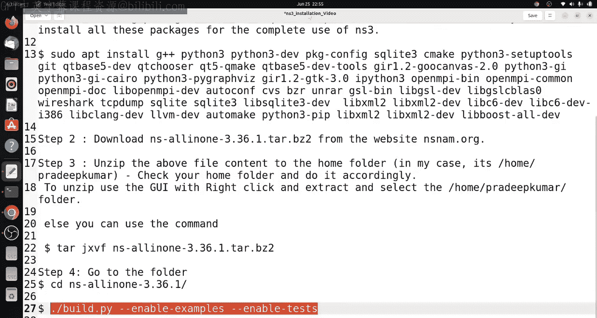
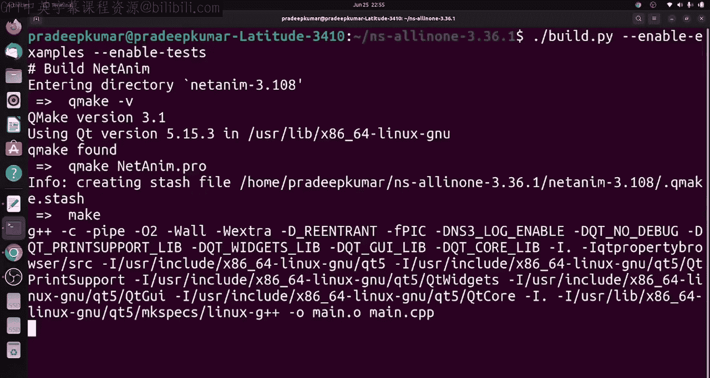
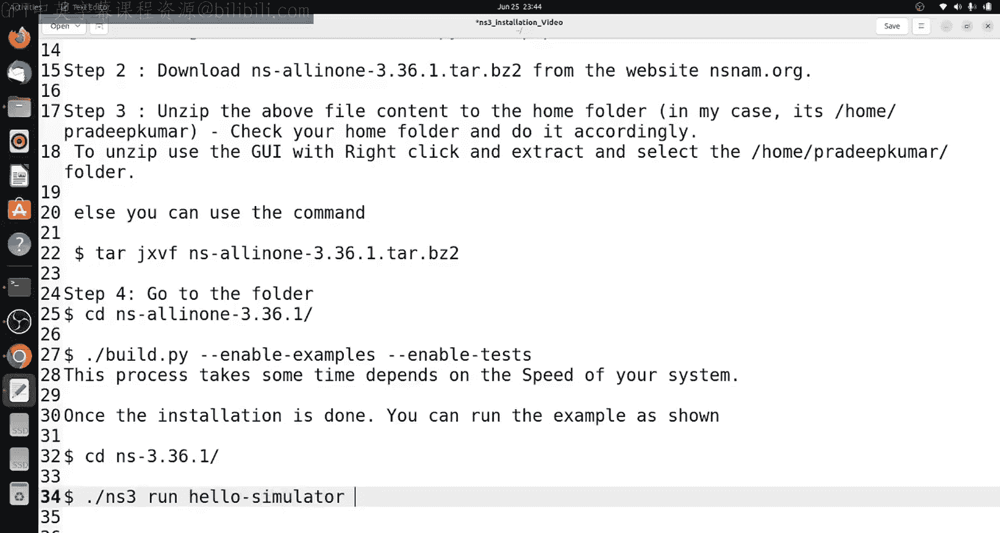
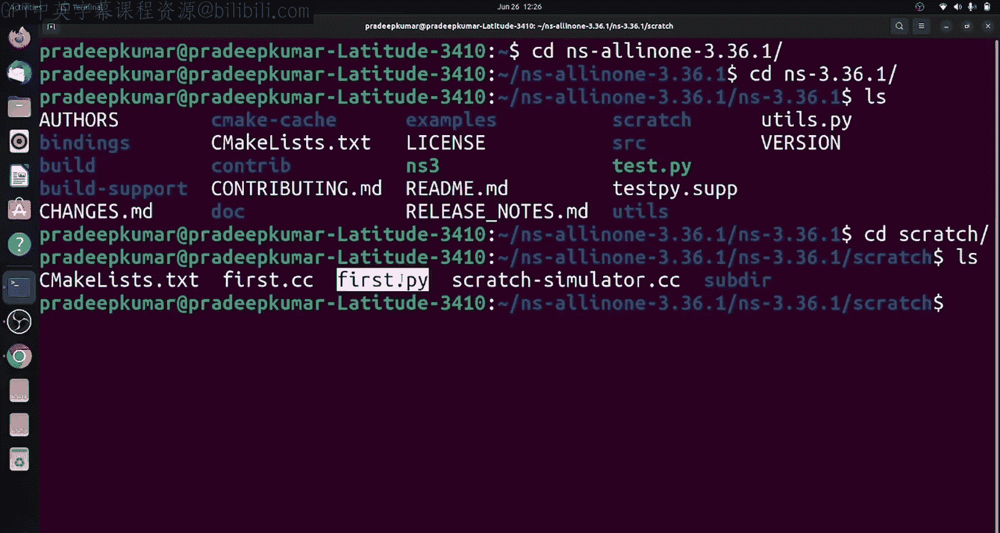
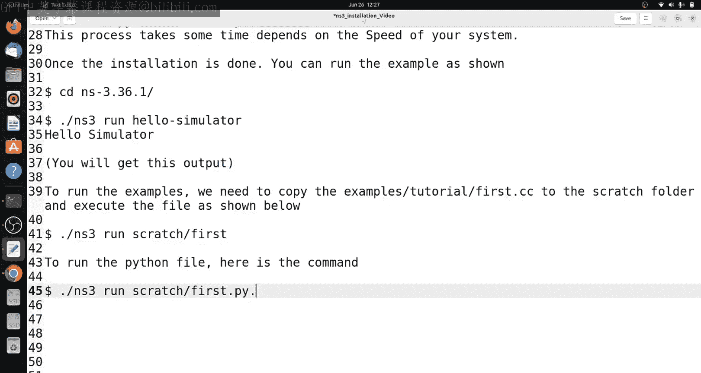
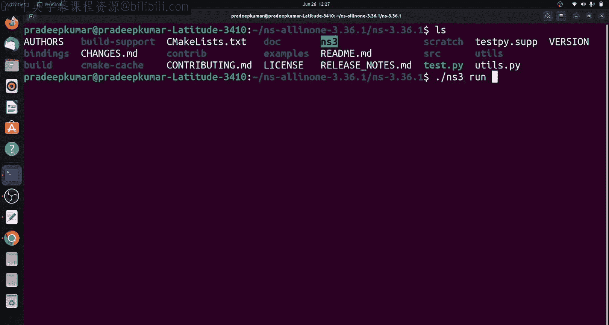
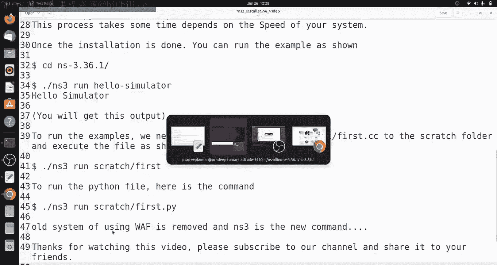

# Engineering Clinic《网络模拟器3教程｜Network Simulator 3 Tutorial Series》中英字幕deepseek翻译 p34 -35-NS3 installation in Ubuntu _ Complete Instructions.zh_en -BV1aQmtYZEPr_p34-

Hi， friends， welcome to engineeringer Clinic。 In this video。

 we are going to see the installation of N S 3。361。In U2 22。04。

 so both operating systems as well as N S 3。36 are new and this time N S 3。36 have some changes。

 so they have removed the W system and include the C make system。

 So slightly the compilation process is different as well as the running of scripts also different。

So we will be seeing how to do the installation on N S 3。36。1。

 So since I didn't follow any methods in the website when I tried it。

 there was no w and even some of the comments also received from a subscribers that the w is not existing。

 So instead of W。They have included something else NS S3 so you have to use here after dot slash ns3 so dot slash n3 space run a name of the file。

 so likewise we have to do so to start with the installation first we have to give the pseudo app update so first always try this command pseudo UP update so once it is done so the update package manager will be done and for understanding what I have given is I have just given all the packages it is required to install the complete package of Ns3 so you need not need any other new software so you can try installing all these things。

So once the installation is done。So then we need to download the NS 3。36。1 from the Ns NM。

org website。So that is what we'll be doing it now so you'll be downloading from their website Ns 3。

36。1 so please remember they have other older releases also so those older releases you have to still they are following still the W system so wF system but if you are comfortable with the new system you can always go with the new system so N3 So then finally you have to after downloading the package you just unzip it are decompress it to your home folder so in my case the home folder is slash form s deepcom so in your case just check out what is your home folder so in the home folder you can just unzip this package so you can extract this package so you can right click over the file and extract and click extract to and give the location of the home folder in case if you want to do in the command line mode so I'm just giving the command line mode as well here directly。

So the command is star J X Vf NSSol in 1 hyphen 3。36。

1 dott dot b02 so once you give this command automatically the file will be extracted so this way you can enable so now our installation of the all the packages is then so then you can go inside the NSS all in 13。

36 folder inside that you have to give the command dot slash builder r double hyphen enable hyphen examples and double hyphen enable hyphen tests so this is your usual command for installing NS3。

So then it will be taking some time for it test to install。 So in my machine， since it is an SSD。

 it takes around 10 to 15 minutes。 So if you are using a virtual machine or if you are using a hard disk drive the time might be taking more time。

 So in case in between if it is stops again， you can reiterate it in virtual machine。

 if it is stop it so you can increase the Ram at least for the installation later on and again。

 you can。

Decrease the Ram。 So that way you can able to install this process completely。 So once it is done。

 So then we have to test the。Scrt， whether it is executive or not。

 Ha I already told you that the ex script exhibition is something。

Different from the previous version。 So we need to use the command colorss N S 3。

So now the installation is done So next we will be going inside the folder Nshen 3。36。

1 where all the source files are available so there will be running a command Ns3 dot slash so dash flashlash indicates is the current director So in the current director we have a executable file called us Ns3 So you have to give ns3 space run and hello hyphen simulator so hello hyphen simulator this is to check whether your installation is successful or not So in case if this command has to be executed so you will get an output as hello hyphen hello simulator so you will get an output so once this output is there then you have installed it successfully so then later on we can able to test some network scripts so that we will able to do it。

So now you are getting the Alberts hello heaven simulator。

 So next thing is we'll be testing on the networking script。 So for example。

 we have an example slash tutorial folder where we have fastcc second dot like that we have dot CC files and dot python files。

 So we can copy those files with scratch folder。 So as you all know that the scratch folder is one folder where we can able to copy all the files for running in NS3 So simple procedure we can carry it here。

 Now once we run this command dot slash n3 run fast so for a dotcc file there is a c plus plus file you did not specify any extension but for python file you need to specify the extension So you can able to use this file。

 So now we can see I am using a fasted P that is a python file。

So for this， the command will be dot slash ns3 run。Then scratch the name of the folder s first dot P。

 So that means you need to give the specific way the extension of the file。 Now。

 we can check the output there。 So since first dot Py and first dot CC operation was both are same。

 but only is returning in Python are returning。

C plus plus so the command here I'm just using is dot slash n3 and scratch slash for So all these command I am just giving it below the description window as soon as you can refer my blog as well So this is how the way we got the output So now in the NS3。

36。1 onwards the old system of Wf is removed and see make system is been used for that we have to use the comment NSS3 dot slash n3 instead of dot slash So hope you might have like this video So thanks for watching in case if if your friends are interested。

 please share this video to them Also subscribe to my channel for more such kind of videos。

 So thank you very much Thanks for watching。

