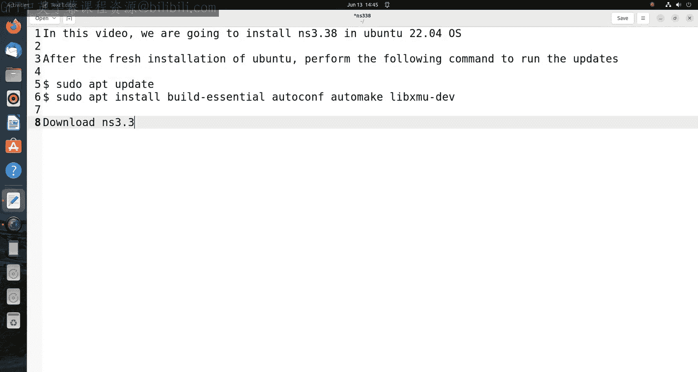
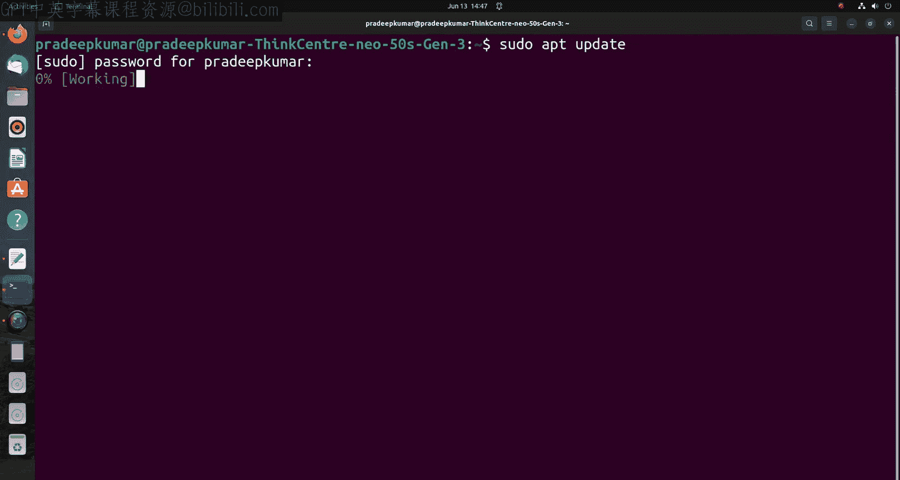
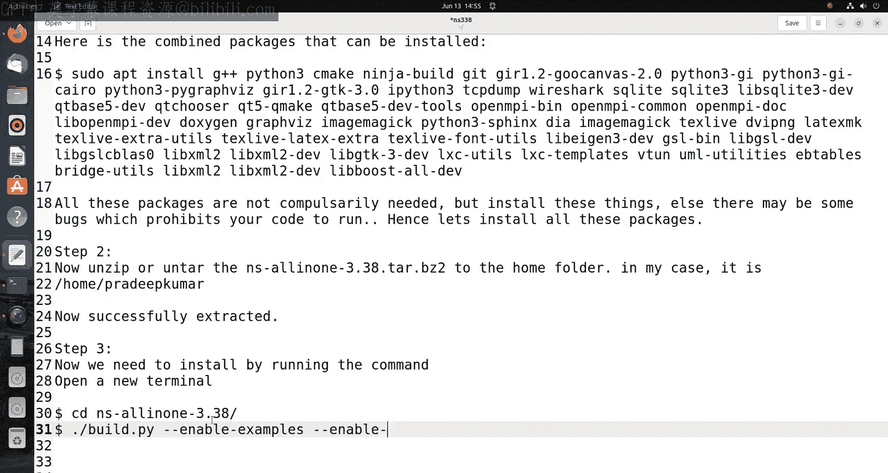
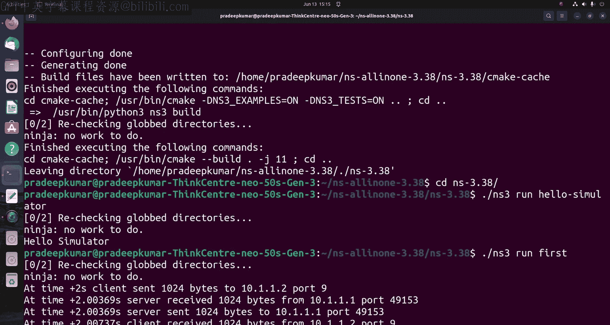

# Engineering Clinic《网络模拟器3教程｜Network Simulator 3 Tutorial Series》中英字幕deepseek翻译 p36 -37-How to install ns3 in Ubuntu _ NS-3.38.zh_en -BV1aQmtYZEPr_p36-

Hi friends， welcome to engineeringering Clinic In this video we are going to install NS 3。

38 in Uto 22。04。O system。 So what I have done is I have created a new first installation of over to 22。

04。 and I am just giving you the section from the beginning。

So always you can try with pseudo app update and pseudo app install buildes Autocon Autoomic and Lib XMU hyphen D Ev。

 So these are the packages mandatory to be installed after the fresh installation of Ubuto。

 So lets do this in the terminal。

Yes， pseudo app update。

Then give the password and then press enter。the packages get installed one after the other。

Afterwards， suru app install， build essential。Hhen autocon。Hyhen， Autoomic。Then hyphen Li X M U。

 hyphen D V。So once it is done， then you go and download Ns 3。38 the package。

 so go to this website nsname。 org and click the latest link， the latest one being Ns 3。38。

 please download。I道。Keep it。 So now the download is started。

And it now some additional packages need to be installed。

 you can copy these package commands directly from my description window。Below this video。

 you can copy this and then you paste it here。Now afterwards。

 some additional packages also need to be installed like wireshock then a netanim then visual laser so there are many packages that can be installed along with NSS3 so all these packages NSS3 website gives the documentation in the documentation they are provided all the command or all the packages that need to be installed。

See sometimes what happens is you may get some bugs because of unavailability of a package so to make it easier what I have given is I have given the extensive command where the complete command you can make use of and copy and paste after the after the first installation of Uunto so that all the packages will be installed in your Linux operating system so here is the extensive list of command。

 what I have given just you can copy and then you can paste it in the terminal to download all the packages it may take some time based on your speed of your computer。

Anyway， I have just stopped the video somewhere here， so I passed the video and then I just。

Cut some portions of the video。Two methods of decompressing one through the terminal another through the GUI so for easier understanding many of you might be fresh users are the new users so I can give them give you a method of using GI in case if you want to use a terminal mode installation then you can follow my previous video where I have given the terminal mode of unzippping or decompressing。

Now this is the step number two。Now unzip are anar。

 so that is what we call un because the name of the Ph enter tape or cave thats say we call it as an unarari okay so now that is what we are going to do in GV mode。

Now， whenever you want zip it always give it the home folder。

 So I am just going to give it in my home folder for unziping it。

 So now we can see that in the downloads I have just selected right click extract。So extract here。

 so click this extract， so it will be showing you。What is the content。

 then I click and extract and give it to the home folder。

 So always give it to the home folder so that。Whenever you search for the directory you can able to find it in the home folder so after the unzippping or compression is over decompression is over。

Then we can run two command so successfully it is extracted now you open a terminal。

After opening a terminal。In a new terminal。You can go to the folder ns only in one 3。

38 folder and inside that we need to give a command so the command I just given in the video here。

So you can give C， N S， iPhone all in1 iPhone。3。38 slash， then you can give dot slash build dot py。

Space double hyphen enabled hyphen examples， then double hyphen enable hyphen tests。

So when you install this command， all the packages will be installed by default anywhere。

Mine or N S 3 will be installed。 This may take around 10 to 15 minutes for building the complete packages。

For building this N S3。Now this is the command we can input so now this will go on for 10 to 15 minutes anyway I just pass the video for the complete installation and I will show you the end screen so what happens at the end so that I can able to show you in this video。

So if you have a new subscriber or if you are just now started a journey in network simulator 3。

 we have lot of videos available there you can make use of these videos for your research and do project work for your higher education。

And you can always subscribe to my channel and then inform about our channel to your friends and your acquaintances and to your colleagues as well as your students if you are a faculty。

Now we will test whether NS S3 installs successfully or not。

 further that we have one example to run the hello simulator。

 so dot slash ns3 run ho hyphen simulator。So， once you run it。

 if you get a hollow simulator value there so that indicates that the NSS3 was installed successfully。

Now there are two more examples we can try the Ns3 run first。And second， So there are two examples。

 and the many examples are there。 we can try one after that。

