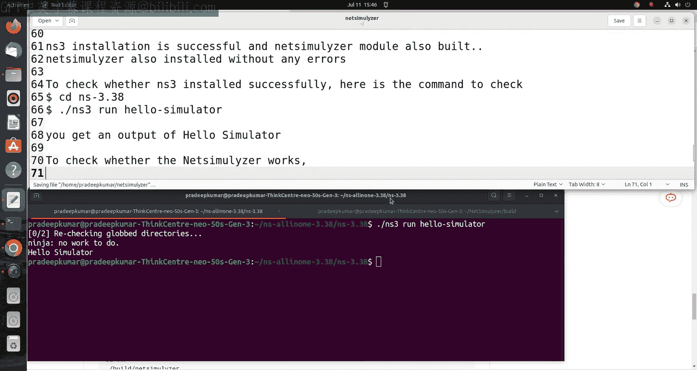
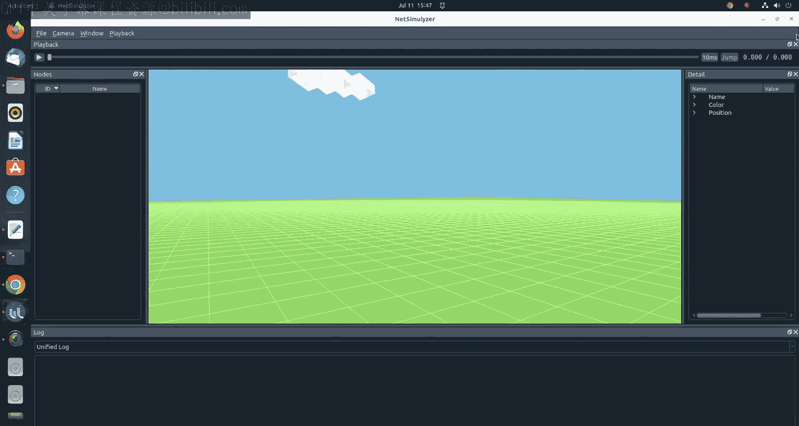
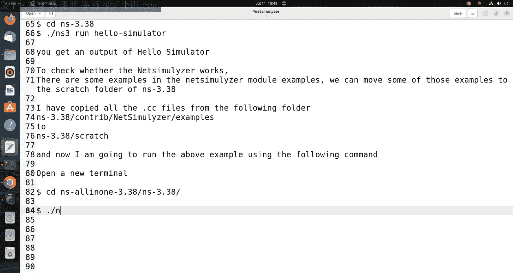
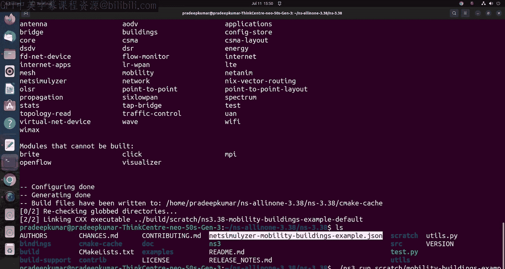
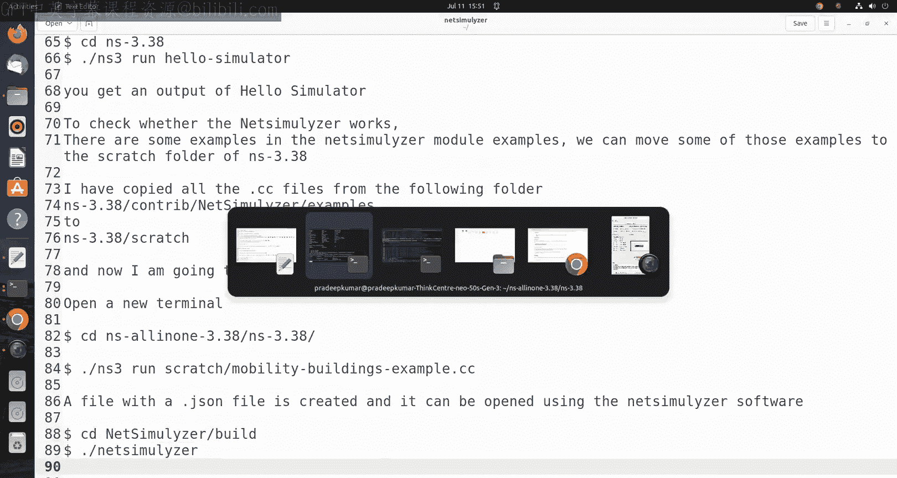
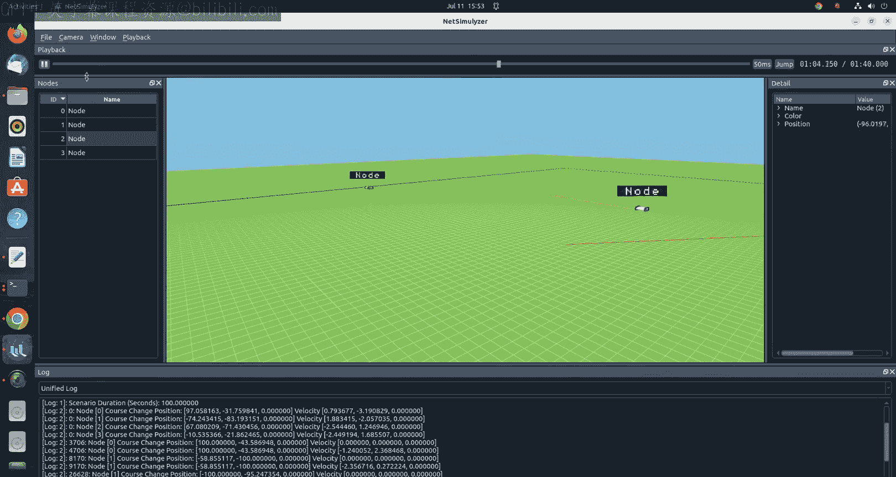
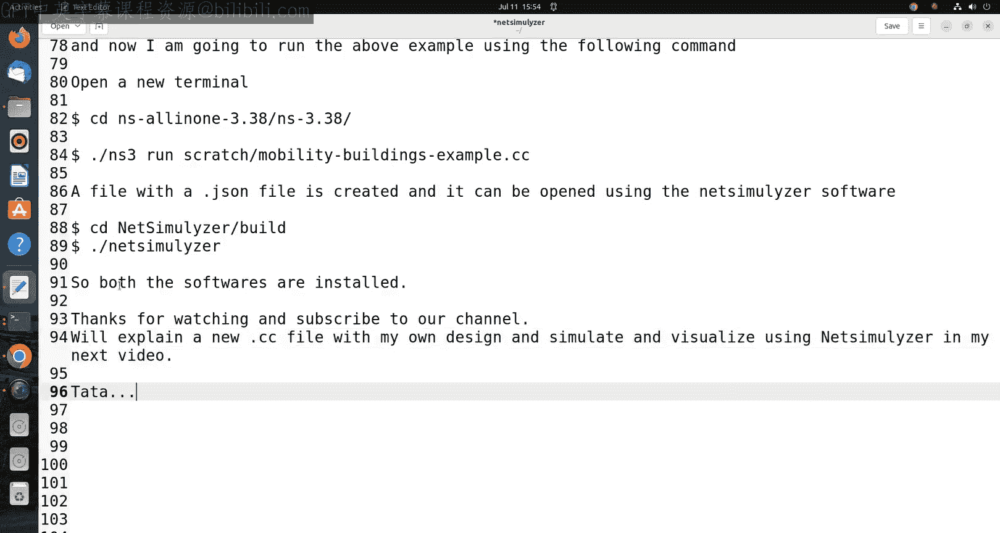

# Engineering Clinic《网络模拟器3教程｜Network Simulator 3 Tutorial Series》中英字幕deepseek翻译 p37 -38-NetSimluyzer  - 3D visualizer for NS3 #ns3.zh_en -BV1aQmtYZEPr_p37-

Hi friends， welcome to engineering clinic Today we are going to see how to install a software called net Simizer for N S 3。

 which is a pre dimensionsional simulator。F next scenarios。

So you can visualize all the nodes in three dimensional with the buildings also included in it。

 So whether it be a wireless not or wireless wired or not everything we can able to use。

 we can use a JSN file also in N3 will generate a JN file。

 So through the JN file this net simulation will open it。

So the prerequisite see this is we are going to use U2 22。0 for operating system in S version 3。

38 net simizer version 1。0。7 So there are many voltage versions also available in net simizer are U2 so you can try out that。

 So for the all the subscribers here I am just giving you an option for installing in another 22。

0 for the latest Y and the latest net sizer 1。0。7 that's what we are going to see。

So this net simulation is one of a powerful software for visualizing the three dimensional views of N S3 simulations。

 So the examples and I will be showing you in the next video where I will explain the source code。

 how we can able to write it。 and I can able to show you a complete demonstration here。😊。

So to start with what I'm doing is I am going to do NS3。

3 along with net s laser module to be installed。 So we need to install three things here。

 first thing is NS 3。3 we have to install that the NSs3。

3 has to identify the net s module also So net s as a module we need to install it within NS3。

38 as well as we have a separate software net s software a 3 dimension software there can be installed separately in Ubu2 or Windows or any voice we can install So once you open that software it will ask you to open a Jsson file once you give the Jsson file it will be processing it suppose if net s is not install within Ns3 as a module then Ns3 does not know what is net s A so that's why we need to install this thing。

 So this first step process will be a complicated one because NS3。

3 has to support the net s So that's what we are going to do with the first step here。

So the step here is installation of Ns3。38 along with net simizer。Okay。

 so now first thing what they can do is you can use a command pseudo app update。 So always。

 whenever you install Linux operating system， the very first thing you have to do is you can put pseudo app update。

 But in case if you want to see only N S 3。38 installation I already published on video I just given the link at the。

Comment section， you can able to check it there。 Now， afterwards。

 you can copy the entire package libraries like this。 What I mentioned here， you can copy it here。

So it will be taking some 10 to 50 minutes time to download and install so。

 but since I have already installed it， so that's why。No packages to be installed。 So anyway。

 in case if you are doing for the first time， you may expect some 20 minutes time to install。

 download all the packages。So now what we do is we have to unzip the CNN S all 3。

38 so for that I use a terminal base command you can simply open the file in GY right click and extract So whatever I do I just do it in the home folder。

So that's what I have just did here。 Now， afterwards， now， the important step here is。

Inside N S volume 3。38 then inside 3。38 we have to create on folder colors contri or already a con folder will be there。

 you can go to the control folder once go inside inside the country folder you can just copy the get doublemins you can able to download the file through the terminal commander doublemins downloading from the internet so this command you can just put it there so that this net simr for Ns 3 will be installed that model will be installed in the country folder。

So once it is done in the country folder， we have to unzip that asal because it is a zip file。

 So once it is unzipped， then the next command you can copy and then paste it here to make it to one single folder they call us net simulation Now the net simulation is done Now NS3。

3 also done。 So now our job is to install the Ns3。38 from the beginning。

 So we have to go use this command dotslash builder R Py。Double hyphen enable examples。

 double hyphen enable test。 so you can see here。Now I am just giving this unzip model here。

So after unziping it。You can give this command。 So then you can。Go to the Ns all in one 3。

38 folder After going there， you can use the builded R PV and double hyphen enable examples。

 double hyphen enable test。So once it is done this fill。

 this process also will take some 10 to 20 minutes according to your Ram and CPU of your computer。

So till the time you ought to be waiting， but in case let the mean let the process goes on so we will be installing the net sim package for Ubu2 this package will be opening the G Y so for that we use a separate net sim software here。

 So let the installation goes on in the meantime we can able to install this net sim。Okay。

So now open a new terminal。And we will be installing this net simulator software so we can directly clone it from the Github so we can use this command here what I have given there。

So this will be downloading。Into the home folder。 So again we come to the plane folder and I will install it and after that we will make C D net simizer。

Then we create a folder colours build a folder。 So M K D B A U， B Y， L D。

So we will just create a build folder。 So I got this is the website that I have just referred for。

Same caR build， then C D build。So once it is done the build folder is scattered。

 so go and the build folder and just two lines of command we need to give。

So only is C make hyphen DCc make a build type so you can just copy paste from the description window I've just given you just copy paste it here。

So once it is done。The installation will go on。Now。

 after there one more command is that a parallel command is there this parallel command will make your system to hang。

 so I have tried multiple times it get hanged so I just without using any parallel I just did that。

So now we can see that C make a double I build star。 So once you do that。

This will take slowly it will do the installationsulation， but anyway no issues you can wait。

So now in the meantime， this N S3 was installed successfully so I can see that netub laserer model was built。

So now N S 3 understand the net s A P codes。 So that's why the way that we have installed it。

 So now the installation of N S3 with the net simulation is successful。

So now we need to install net simulator， so net simulator after 100 percent days it got installed。

So now net simulation also installed ourub2， as well as NS3。

 along with the netimulator module also installed。 So now we can able to。

Easly check whether NS S3 install successfully or not， so to check N S 3。38 to be installed。

 we have to use the command dot slash nS3 run ho hyphen simulator。So in that case。

 if you it will be returning a h simulator， so that means the output is successful that means the installationulation is successful。

 you get an output of h simulator。So this is one thing to check whether this net simulator what works here or not。

 So far that net simulator model have some examples like it will be showing a drone land based to drone a smartphone in the simulator。

 So these things been shown in that particular example。

 Now this is how the way we use the net simulator software you can see here。

So there is a sun here and it will be always showing in day daytime mode。

 So the green color is the complete canvas so you can able to use all the nodes here。

 So now there are some examples given in the modern net sim module。

 So those examples we move to the scratch folder of N3 where we run all the examples of In 3。

So this is where we are going。So this graph， So I'm just doing through G Y。

 So next to my laser examples。 and I am just copying all the dot CC files so that。

And move it to everything to scratch folder in only1 3。38 scratch folder。

Now you can see that I am just taking this example as one of the example。So a drone mobile app。

 you can see that at the land based drone， I am just using it here。And that example only。

 so I will be explaining this complete source code in my next video so that you can really understand how really we can able to do that。

So now I have copied all the dot CC files from the following folder So which folder is N S3。

38 slash con slash net sizer slash examples and all the dot CC files from where I am just doing Ns3。

3 slash scratch folder so to this folder I' am just copying everything。

And now I am going to run the above example using the following command So the command is again you open a new terminal for any non confusionfu。

 so go to C D NS all in one。3。38 less 3。38。Then dot slash n 3。

I run scratch slash。 So one application I will be copying here is。Scratch。

 you can see here I'm a mobility buildings example dot CC。 So that file I am just doing。

So once it is done， it is compiled。 now it will be creating on file call as a JSon file。

 You can see the JS on file call created。 So this file we are going to run using。

Net simulator。 So this is what we are going to do。Now we can see here here file width。

Adjacent file is created。And。It can be opened using the net simizer software。

So C D in symbol slash build。Then thats less net simulator。 So once your write command。

 a net simulator window gets opened。

You can see this is the window。 So now click load and give the JSson file once the Json file you can see that this is a node number 0。

 node number one node number2 and node number 3。 So node number 2 and 3 are just there are land based land drones There is a drone running in the two dimensional space so Ill be showing you three dimensional space also where the drones will be flying in the air at a particular height。

 All these things we can control through N3 So that example I will be showing you in my。

Our next video。Now this now this simulation， we can run it so we can increase a simulation time to 50 milliseconds by default。

 it will be 10 milliseconds。 we can write it at 50 milliseconds and we can able to run the simulation。

😊，So this is how the way the nodes can。 you can see the nodes are moving。

 So as per the simulation of what we have done in the N S3。

 there can be visualized in three dimension here。So this way we can able to do all the three dimensional visual laser in net s software。

So now we have installed both these softwares N S 3。38 as well as an netumizer。

So now we can able to simulate any NS3 network with the net S APIs and that can be opened using the3 dimensional visual lasers。

So thanks for watching this video in case if you have not subscribed to my channel you please subscribe so only limited number of people across the globe publisherlishs video on Ivo NS2 NSS3 so my channel is one among those so please subscribe to it and keep watching Thank you very much bye。

