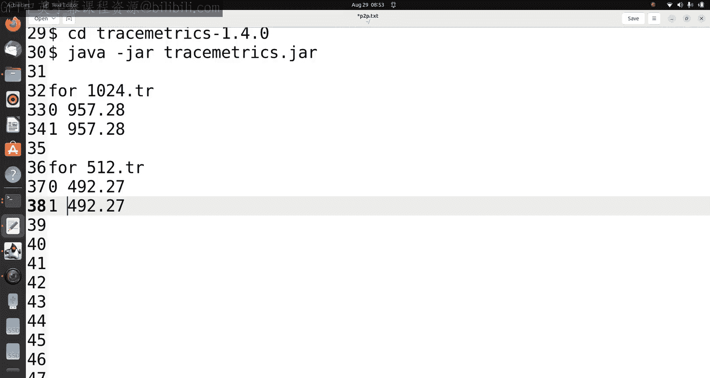
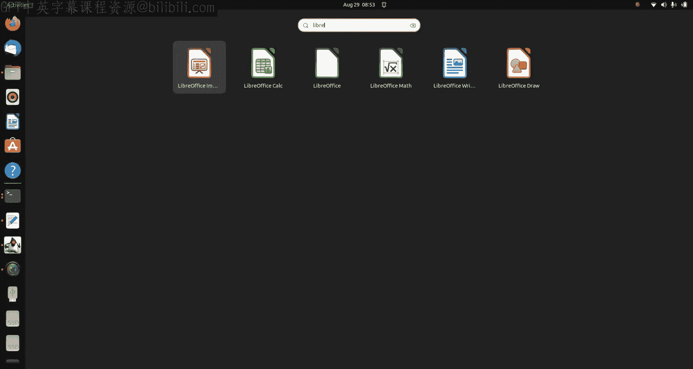
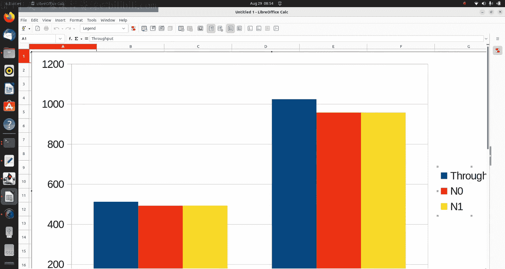
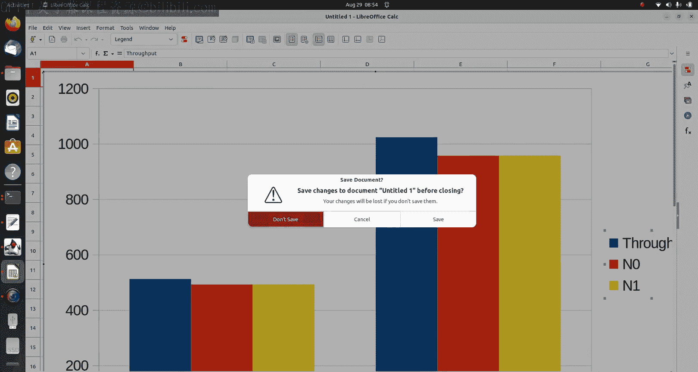
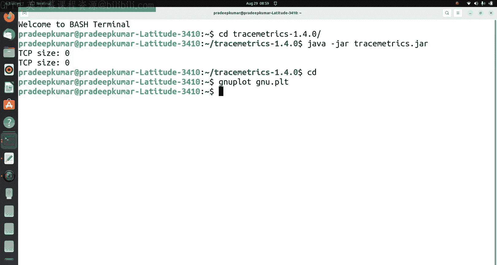

# NS3教程：1：在NS3中构建点对点网络 🖧

在本节课中，我们将学习如何在NS3网络模拟器中构建一个简单的点对点网络。我们将创建两个节点，通过一个具有特定带宽和延迟的物理链路连接，并模拟它们之间的数据包交换。课程内容包括网络动画演示、网络吞吐量计算以及使用图表工具进行结果可视化。

## 概述

我们将基于一个给定的实验问题来构建网络。该问题要求设计一个点对点网络，连接两个节点，链路数据速率为50 Mbps，延迟为5毫秒。其中一个节点作为服务器，另一个作为客户端，在20秒的总模拟时间内交换至少10个数据包。我们将分别测试最大数据包大小为1024字节和512字节的情况，并计算每个节点的吞吐量。

## 代码准备与解释

首先，我们需要一个基础代码文件。我们将使用NS3安装目录中自带的示例文件 `first.cc`。

以下是操作步骤：
1.  找到 `first.cc` 文件，其路径通常为 `ns-allinone-3.38/ns-3.38/examples/tutorial/first.cc`。
2.  将此文件复制到 `ns-allinone-3.38/ns-3.38/scratch/` 目录下。
3.  在文本编辑器中打开 `scratch/first.cc` 文件进行修改。

接下来，我们将逐部分解释并修改源代码，以满足实验要求。

### 核心代码结构

代码始于必要的命名空间和头文件声明。

```cpp
using namespace ns3;
```

主函数 `main` 是程序的入口点。我们首先设置时间分辨率为纳秒级。

```cpp
Time::SetResolution (Time::NS);
```

### 创建节点与链路

我们使用 `NodeContainer` 类创建两个网络节点。

```cpp
NodeContainer nodes;
nodes.Create (2);
```

接着，使用 `PointToPointHelper` 类来配置点对点链路属性。根据实验要求，我们将数据速率设置为50 Mbps，延迟设置为5毫秒。

```cpp
PointToPointHelper pointToPoint;
pointToPoint.SetDeviceAttribute ("DataRate", StringValue ("50Mbps"));
pointToPoint.SetChannelAttribute ("Delay", StringValue ("5ms"));
```

然后，将配置好的链路安装在两个节点上，形成一个网络设备容器。

```cpp
NetDeviceContainer devices;
devices = pointToPoint.Install (nodes);
```

### 配置网络协议栈与IP地址

为了让节点能够进行网络通信，需要为它们安装互联网协议栈。

```cpp
InternetStackHelper stack;
stack.Install (nodes);
```

之后，为链路上的设备分配IP地址。我们设置基础网络地址为 `10.1.1.0`。

```cpp
Ipv4AddressHelper address;
address.SetBase ("10.1.1.0", "255.255.255.0");
Ipv4InterfaceContainer interfaces = address.Assign (devices);
```

### 设置应用层通信

我们将使用UDP回声应用来模拟数据包交换。`UdpEchoServerHelper` 用于创建服务器端应用，并安装在第一个节点（n0）上，监听8080端口。

```cpp
UdpEchoServerHelper echoServer (8080);
ApplicationContainer serverApps = echoServer.Install (nodes.Get (0));
serverApps.Start (Seconds (1.0));
serverApps.Stop (Seconds (20.0));
```

`UdpEchoClientHelper` 用于创建客户端应用，安装在第二个节点（n1）上。客户端将向服务器（10.1.1.1）发送10个数据包。

```cpp
UdpEchoClientHelper echoClient (interfaces.GetAddress (0), 8080);
echoClient.SetAttribute ("MaxPackets", UintegerValue (10));
echoClient.SetAttribute ("Interval", TimeValue (Seconds (1.0)));
echoClient.SetAttribute ("PacketSize", UintegerValue (1024)); // 第一次模拟用1024
ApplicationContainer clientApps = echoClient.Install (nodes.Get (1));
clientApps.Start (Seconds (2.0));
clientApps.Stop (Seconds (20.0));
```

### 启用数据追踪与动画

为了分析网络性能，我们需要启用ASCII数据包追踪功能。

```cpp
AsciiTraceHelper ascii;
pointToPoint.EnableAsciiAll (ascii.CreateFileStream ("1024.tr"));
```

为了直观展示网络动态，我们启用NetAnim动画接口。首先需要在文件开头包含头文件 `#include "ns3/netanim-module.h"`。

```cpp
AnimationInterface anim ("p2p-animation.xml");
```

## 运行模拟与结果分析

代码修改完成后，即可编译并运行模拟。

### 编译与执行

在终端中，进入NS3目录并运行以下命令来执行第一次模拟（数据包大小1024字节）。

```bash
cd ns-allinone-3.38/ns-3.38
./ns3 run scratch/first.cc
```

模拟完成后，会生成追踪文件 `1024.tr` 和动画文件 `p2p-animation.xml`。

接着，修改 `first.cc` 文件中客户端数据包大小的属性为512，并更改追踪文件名。

```cpp
echoClient.SetAttribute ("PacketSize", UintegerValue (512));
...
pointToPoint.EnableAsciiAll (ascii.CreateFileStream ("512.tr"));
```

再次运行模拟，生成 `512.tr` 追踪文件。

### 查看网络动画

使用NetAnim工具可以可视化数据包交换过程。

```bash
cd ns-allinone-3.38/netanim
./NetAnim
```
在NetAnim中打开生成的 `p2p-animation.xml` 文件，点击播放按钮即可观看模拟动画。

### 计算吞吐量



我们使用TraceMetrics工具来分析追踪文件中的吞吐量数据。



1.  启动TraceMetrics。
    ```bash
    cd ns-allinone-3.38/tracemetrics
    java -jar tracemetrics.jar
    ```
2.  在软件界面中，依次打开 `1024.tr` 和 `512.tr` 文件。
3.  执行分析后，在“吞吐量”结果中，记录下节点0和节点1的吞吐量值（单位：比特/秒）。





### 结果可视化

将得到的数据整理成表格，例如：

| 节点 | 1024字节包吞吐量 (bps) | 512字节包吞吐量 (bps) |
| :--- | :--- | :--- |
| n0 | 957.28 | 492.27 |
| n1 | 957.28 | 492.27 |

你可以使用任何熟悉的图表工具（如LibreOffice Calc, Microsoft Excel, Gnuplot）来绘制柱状图或折线图，对比不同数据包大小下的节点吞吐量。

以下是一个使用Gnuplot绘制简单折线图的脚本示例 `plot.gp`：

```gnuplot
set terminal pdf
set output "throughput.pdf"
set title "吞吐量 vs. 数据包大小"
set xlabel "节点"
set ylabel "吞吐量 (bps)"
plot "data.txt" using 1:2 with linespoints title "1024 Bytes", \
     "data.txt" using 1:3 with linespoints title "512 Bytes"
```

其中 `data.txt` 文件内容格式如下：
```
0 957.28 492.27
1 957.28 492.27
```

运行 `gnuplot plot.gp` 即可生成PDF格式的图表。

## 总结



本节课我们一起学习了在NS3中构建点对点网络的全过程。我们从修改基础示例代码开始，配置了链路的带宽和延迟参数，设置了UDP回声客户端和服务器应用，并启用了数据追踪和网络动画功能。通过运行两次模拟，我们获得了不同数据包大小下的网络性能数据。最后，利用TraceMetrics工具分析出节点的吞吐量，并使用图表工具将结果可视化。这个过程涵盖了NS3仿真的基本步骤：建模、模拟、分析和可视化，是进行更复杂网络研究的基础。