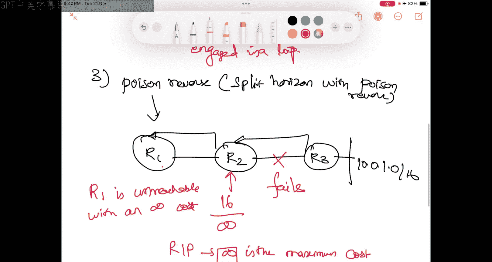
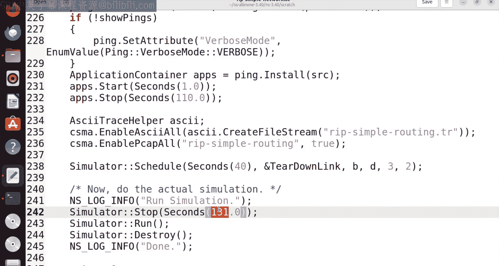
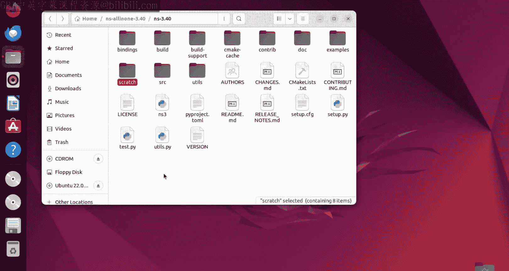
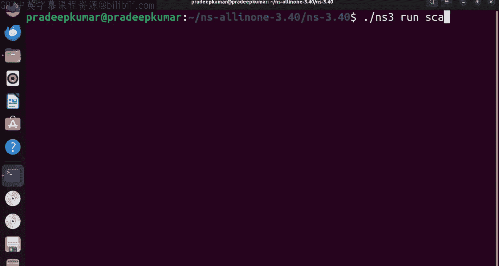
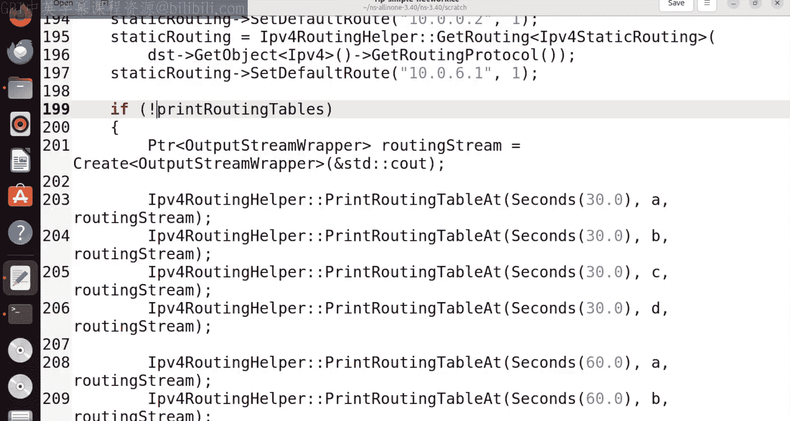
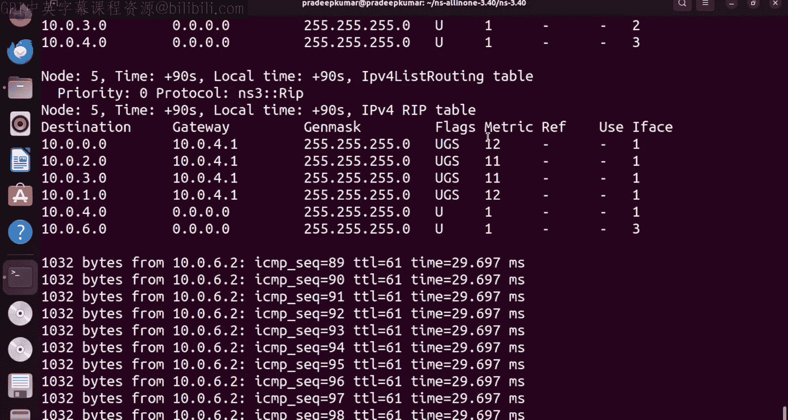
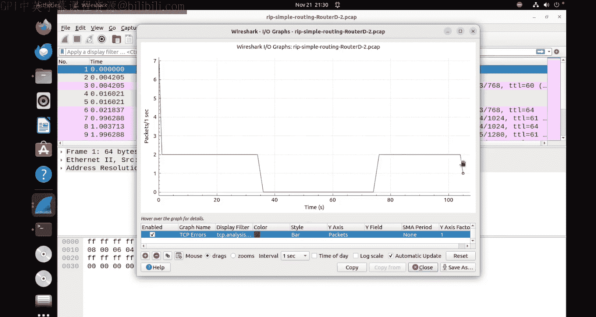

# Engineering Clinic《网络模拟器3教程｜Network Simulator 3 Tutorial Series》中英字幕deepseek翻译 p39 -40-Routing Information Protocol using NS3.zh_en -BV1aQmtYZEPr_p39-

Hi friends， today we are going to see a protocol called us RIP that is routing information protocol。

Which is belonging to a category of distance vector routing。 So distance vector routing means。

Each node will be transferring its own routing table to only to the nearest neighbors so the nearest neighbors in turn transfer their routing tables to their nearest neighbors likewise it will be a chain of network so here what happens is all the nodes in the network will have incomplete information but as a whole of a network together everyone will have a complete information about the entire network so this is what this distant vector routing so one of the example protocol is the RA that is a routing information protocol so in this simulation we have seen。

We are going to see on network simulator 3 how RAP is implemented with the three options called as split horizon。

 no split horizon and Pyson rivers， how that is enabled and through the routing tables we could be able to find out how these three things have occurred in the RP protocol now over to the simulations。

Hi， friends。 So now we are going to check about。L to horizon。No split horizon。And。Poiseison rivers。

In RP， this is what we are going to see。In this lectures， so let's say we have a router R1。

Here router are 2。And a router are3。So I assume that all are connected to each other。

And here is there。One IP address 10。0。1。0 slash 16， so this is an IP address this is server okay。

So now， in this case。Now， this is how the way the thing works。 Now， in case the faster condition is。

No split horizon。No split horizon the first condition， what happens here is。Now。

 from this information， the packet comes here。Now this R3 will send the packet here。

And R two will send the packet here for example， if this packet comes like this。R 3 sends to r2。

 r2 sends to r1 now because of some reason。This packet got broken so this packet from r 2 to r 3 got broken。

 so now what have happens is R1 will be having a routing table update to r 2。So routing update。

Croouting update to R2， similarly。Again， R2 will be sending the routing update。

Roouting update so because of this packet failed this this link failed。

 the R and R will be engaging in the infinite loop。Infinite look。In RP。

 so this is the problem with the no split horizon。So this is the issue with no split or reason。

So this case is infinite loop， this is one of a normal condition where it can able to engage in an infinite loop without giving any useful information to the rest of the network now in case of second condition here is。

Split horizoniz。Sp it for reason。 So how here it happens is。Now again。

 we will take the same thing R1。A2。And R 3。 And here is the network here。

Now here this how the it glucose okay， so now from this 10。0。1。0 slash 16。

 so from this the routing updates comes here。Okay， so from this the routing update comes here and from this the routing update comes here now for again the same condition this link fills so this link fills now in this case this r1。

If it is enabled with split horizon， if this split horizon， if it enables R1。

Does not send anything to our2 because it indicates that because already the link is broken if it is split horizon is been maintained here。

 this packet won't be there and this won't be engaging in a loop。Wn't be。Enggaged in a look。

If split horizon is enabled okay so， but in the no split horizon what happens is the splitting wont happens here so because of that there will be a infinite loop。

 this is on split horizon so third condition here is we call something or less。Poison rivers。

 So this is something or less。Poison rivers， otherwise。

 we called this split horizon with the poison river。Split horizontal width。Poison rivers。So。

 how here it happens is now here that interesting thing here in this case again， we have R1。

We have R 2。And we have R three。Okay， now this thing network here， this thing here。So 10。0。1。

0 is last 16 Okay so now， for example， this routing update comes here to r 2 and from r 1。

 the routing update comes here Okay， so now the split or is enabled here now this link got failed So this link fails here now in this case when it fails。

What happens is。After it is failed， this will become。16，16 means the infinity。

 So in RP in RP protocol。Infinity is the maximum。Cast。Maximum cost。In really。So。

 the maximum cost is infinity here， so that means 16。

 so in RP 16 is the maximum cost between any toollings which will be considered as infinity。So。

 R 1 is unreachable to the node r 2 because the link will become 16 that means the link cost will be 16。

 so which is unreachable。So in that case， the Pyson reverse will ensure that。

The loop should not happen between the router R1 and R so that is why it is Pyson river。

 so to recap we have no split horizon that means it will goes involved in an infinite tube split horizon there could be a chance from R1 R2 but split horizon with the pythson rivers Pyson rivers will never happen because of the cast involved either。

clinic。Today we are going to see one protocol called this routing information protocol。

 which we shortly call as RP， which is based on distance vector routing protocol。Okay。

 so we have some theoretical concepts so we will be seeing in between how the theoretical concepts have been implemented and now we will go into the source code which is in Ns3。

 so we are going to define using descendsent this network using network sim 3 pro network smulator 3。

So now consider this example where we have SRC node is a source node。

And DST is a destination network and we have three routeors four rotors a B C okay now all the networks have cost 1 cost1 means between year 2 B year 2 c B2 c and B2 d we have the cost 1 except the direct link C2 d which has cost 10 so C2 D is 10 as we know that distance vector the routing protocol the shortest path only it will be followed so based on the distance。

The shortest distance， the row source will be routing the package to the destination。Now。

 in case if SRC to destination， the what is optimal parts will be yeah SRC， Y C。

D and destination in case c to d is 10， so which is the total path will be 1。10 and 11 12。

 so it will be 12， so it won't be so instead the path will be。Eエ C 예ービ。B。

 so that's how the way the path will move。So there are two parts here。So two parts， namely。

SRC will be1。连一。人比。Then B， so this will be if you see the cast here， S C2 a will be 1。Plus。

 year2 B will be1。Plus B2 D will be 1， so which will be equal to3 just3 a cast。

So in case another path。So SFC。Then嘢。人士。Then the。Then finally DST。

 so in this case when we see the path Src 2 a is 1。Le a2 C is 1。

Plus E to D is 10 then to the destination， so D2 destination is also one then so totally if you see the parts will be equal to 12 so this is how the way thing goes so always the R network will always follow the shutest to path okay。

Now in this case what happens is A BC D are the RAP in next generation routers A and D are configured with the static addresses and SRC and DST will exchange packets so source and destination that is what we have SRC and DSSD now in this network what what we are going to do is after about three seconds the topology is built and a core reply will be received after 40 seconds the link between B and D will break so for example B and D will break that bins this B and D path will be broken in that case causing a root failure after since RAP the route the failure will be I mean recovered after some point of time so after 4 seconds that is at 44 seconds from the failure。

The routers will recover from the failure so in that case we use the split horizoning should affect the recovery time。

 but it is not see the manual we will see that what is the split horizon So what does it mean now in this case after some point after what happens since B and D is broken so obviously SRC A B sorry a C D will be the packet will be the transmit transmission of the data from the source of the destination so in that case obviously the C2 d has to be built for。

10 so the cast will be 10 so that's how the way they it for cool。

 Now let us see how this has been implemented。Now as usual we have this core module here as a a module all these modules have implemented now we have the tier down link so tier down link first thing is we have a tier down link so that means the the down link so we have a function is a function the function will be called so what the parameters are pointer to node a pointer to node B interface a and interface B so based on this the set down set down means interface A and interface B will be shut down that means what between node a to node B whatever the interface A and B that will be。

Set down， set down means the link will be down， so this will be called at the 40 seconds as per the program。

So now we have a main function， so we have this bull verbo equal to false so this verbo will make it true and then see how the pink packets are working and print the routing table so we can print the routing tables also so by default is given us false so whenever we want to make it through then we can do that and show pink so pink packets we want to show true or false by all these things by default they are given us false。

Now the split horizon Pson Pyson river so as we have seen what is the split horizon so we are using a method called Pythson river so we have three methods here。

 no split horizon Pyson rivers and split horizon with Pyson rivers so that is what we are using these three things。

Now we have add value here， so ver mode， if you want enable， we can use ver mode。

Then print roing tables we can enable then shows we can enable and split horizon strategy。

 so three split horizon strategy we can make use of。🤧Okay。So we have no split origin。

Split horizon and Py on these are the three things that we can make use of So we will see how to use all these things So now log component enables so what are the different logging we are going to enable in this so we are going to enable lock RP simple routing R IP version 4 interface ICmp version 4 L4 protocol that is under the layer number4 which is nothing but a。

Tranport layer then IP and 4 L3 protocol which the network layer here Pc address resolution protocol and pink all these things we are going to enable the locks。

Okay， now we have the macros here， so if split horizon equal to no split horizon then we are recalling this no split horizon as one of the enumated values or the macros and similarly you split horizon equal to split horizon will be calling the split horizon so this is part of the RP next generation。

Similarly， if we use not splitation or no splitation or split or region。

 then we go for a Pyson river so this is what we are going to use in case of Pyson rivers。

So now as usual we are going to create the node so how many nodes we will be creating we will be creating a source node destination note router A router B。

 router C and router D， so we are totally creating Src， dST A B c。

Now we are going to as per the routing table of the RAP so we are connecting SRC 2 E then E 2 B E2 C B2 C C2 d B2 D and D2 DSSD you can see here as per this same thing SRC 2 E is connected E2 B connected E 2 C connected B2 C connected B2 D connected and C2 D connected and D2 DSSD connected so all these links have been connected here。

Now after the connection so we are just creating a routers ABcD and we are getting nodes source and destination so source and destination are the nodes but ABC are the routers that is why they wrote the packets based on the lowest costtrometric possible okay now we are going for creating a channel here so now seems it is CSma we are going to have a carrier since multiple access so because it is between routers to routers we want to establish a higher data rate channel so we use a cM helper so here we are using5Gbps and 2 millisecond delay。

The data rate and the delay Now we are going to define a network device net device container so as what if you don't know what is net device container please follow me some of the other videos that what is a net device container have explained detail in the in those sessions Maybe I'll just give the video link in the description window。

Now we create net waste container NDC 12，3，45，67 so further we create the net 1 net 2 net 3 net4 so that means what net1 means so this is net1 so between source to the router yeah we are creating one net waste container NDc1 similarly for net2 between year2 B we create NDc2 likewise up to NDc 7 we just create totally7 net waste container1 to 7 Now we just go for Rp routing here so in the RAp routing we exclude some interfaces so the router number a the first thing is excluded the interface excluded and router number D the third interface is excluded just just to exclude not all the ports to be included some interfaces we can exclude also so we just exclude and if you want to set the interface here interface metric for node number c it is 3 and 10 and for node number D it is1 and 10 as we have seen that the cost between C2 d we want to make it instead of1 we want to make it as 10 so that's why then。

Interface for c is number 3 at the cost of 10 and the interface of number D is1 at the cost of 10。

Now we use the routing helper here。So list RH routing helper so we use RAP routing0 here and we just set the internet stacker that means for all the routeors we want to provide the network connectivity further we written object call as internet so in the internet we just create IP and6 false that means we are going to focus only on the IP for resing Similarlyly in this internet asset routing helper list R we just use we just sent the list routing helper to all the routers thats what we are installing everything on the rotors。

Now in case internet nodes， so this is the internet stacker now in the internet nodes here we use install it on the nodes here。

 so we are installing it in the routers now we are installing on the node routers means ABCD nodes means SRC and the DSD。

 the is source on the destination。So now we are assigncing the IP and 4 addresses so we just create an object for IP and 4 addresses helper so where we have we can see that  n。

0。0。01。02。03。04。5。 and 6。0 now in everywhere you can see that this NDc1 we set the IP does NDc2 we set the IP does NDc 3 NDc4 like that so NDc 1 is between sourced to the node number this is for NDc1。

And finally， N Dc 7 is 10。0。 6。0。 So this N Dc 7 here is。Between D2 DSst there is a destination。

 so this is what NDc 7 okay so this given 6。0 whereas in this case here。I mean。

 this case here is SRC2 node here。So sorry I wrote here so this is what this 10。0。0。

0 So now we are going to focus only on this IP address as well as this IP address so these two only we are going to focus on now we are we have already mentioned in the problem that we are going to have a static routing and the static addresses that the nodes are using so we can see that the routing protocol here the default root given us the cost is110。

0。0。2 it is one that means this is from SRC2 here and 0。6。

1 this is from D2 dSt which is also the cost is1 so this this static addressing cost is only1 that is what here is given here as a static ro。

Now if print routing tables does that means if we enable print routing tables。

 which is by default value as false that means it is a false value。

 but if if I want to give a true value there I can enable to enable in case we want to make it true I can use this way so this becomes true now because not a false will be true so in their case I can make it true now by default it is false so this way in case if I want to print then the routing table aBC will be printed at the time number 30 seconds。

After 30 seconds。Again the ABC will be printed at 60 seconds then again at 90 seconds it will be printed way it is printed is you can check the routing table that how the routing table changes after the link is failure because we are going to have a link failure between B2D the link is going to be failed during after failure how the system recovers from the failure and how it takes alternative part that is what we are going to show you on the RAP。

Okay， so further that we can enable the 30 and 60 you can see that it will be a normal routing table but whereas in the seconds。

 90 seconds the routing table will be completely changed because the I mean the link got failed and after that the link got reestablished and the cost becomes instead of three or four the cost becomes 12 so that we will be seeing it。

Then finally we are creating an application with a packet size of 1 kilobyte there is 1024 bytes and we are going to have a pink application with a pink i and 4 address address and again show pinks also we are given us false but in case we wont enable true then we can so let me make it true here true means not of true not of false will be true so I will be giving the true value here so that it can enable the her mode。

Then we start the pink dot install in the Src and start from one to 110 seconds so totally I want to run the simulation for 110 seconds then we establish the routing the trace file that is ASI routing again if you want to know about this ASI all these things I have just given a video below you can check it。

Similarly packet capture is for wire shark so we want to create wire shark for all the routers and the notes so that also we can able to print it now finally at schedule 40 seconds at 40 seconds tear down link that means we call the function tier down link which we already given in the beginning。

Between node B and D on the interfaces， So B interfaces is 3 and d interfaces is 2。

 so that is what it will be。Now we' run the simulation desktop time。

simulationulator need be stopped at on 31 seconds so yeah very detailed application here。

 So we are just going to run this example， so lets say how to run this example。

So I'm just opening from the beginning， so I've just open a。

啊。Eminal here。So what do I do is C Ns all in one hyphen 3。40。Slash Enna hyp 3。40。 So now here。

I have the obligation。So now I have just opened a new terminal and I am running the command dot slash industry run scratch or haven simple network dotcc。

 So now once you see that。

We have the pink application installed there， so the pink packets have been shown here。

And see the total packetlashes 1 and percentage packet loss where 66 received。

 So inside of our program we have made the link or down So during the downtime there was the packet loss because the pink packets were never working because there was a failure there actually RP network doesn't come a record from a failure So now what we do is we print the routing table there。

 So we have one。A placela where we have a print rout tables is disabled， so we will enable that。So。

 what we do is here here are the print ro tables so this value is declared as false so we will make it true by adding a exclamatory mark so there is a knot of false will be true so now we will be running the program again。

So when I run this。嗯。You can see there the routing table got printed up there。

So you can see the first routing table so the routing tables are printed for A BCD routers only so the nodes were not printed only the ABD routers you can see that node number two is the router number yeah you can see the metric is the metric parameters you can see 322211 like that so between the destination to the gateway and we have the metric is 3 so maximum link is 3 only that is a maximum cost is3 and similarly for node number three you can see yeah B node number3 is B the B router。

Can see that is also 2，22，1 only and similarly we can see node number 4 that is a router number c that is also 2 and node number 5 that is a router number d that is also true。

Now after that again we have some pink packets then again we have node 23 because we are printing the routing table three times 30 seconds。

 60 seconds， 90 seconds now the 60 seconds again there also you can see the matrix has this 2221 that is not number 2。

And node number three also 2，2，11 and not number4 also22。

211 and node number 5 also1 and1 okay now afterwards again that thing happens now we can see this is the 90 seconds now not number two the node number two you can see the cast here is2 so now we here what happens means is the link is cut down the link failure because of the link failure the RPP network follows the C2 d part c2 d is nothing but the cast is 10。

Already one plus one so that 12 path is followed there。 So this is far not number two。 So10。0。6。

0 to 10。0。2。2 is 2。2 is nothing but not number。A B A isB and 6 is node number。

The destination so that is how the way2 packets I means tool is the path similarly for node number3 you can see there is a router number B again it follows2 path2 and somewhere it can see the 16 also there so the metric is 16 and similarly for node number 4 the metric you can see 11。

And see the node number 5 because yr d only all the packets goes so you can see that how the connectivity 2 d。

 everything is 12，11，11，12 so that is how the way the router from C2 d the path is with the heavy packet。

は。So now we understand why there is a 38 percentage packet loss because of the Rp network down。

There was a packet loss involved in it。

So now we can able to prove this through our。This routing table now we can able to prove that through our Vichar also。

So now let me open some of the wire shark Packer capture files。 you can see I've just opened on。

Well here， this is the destination node。If you see the statistics there。

 so you can see up to some point of time that is up to 60 somewhere around 40。

The packet got down and because of the tearered down link or the link is down。

So after some point of time， it regains because the path alternate part C2 d is established。

So this is for one of the packet captures that we can able to check it。Similarly， if you go with the。

Note number。So route a source node， this is source node。You can see the statistics here。

So this is what the statistics， so source not generates the packet， so we have。

Some additional values over there。Have the packet start with one and then you can see that again。

 there is a downtime there。Because of the issue。So now it just open it。 and now we will go to the。

Not number router number C， so we will open the router number c because y are router c and D only the packets of gone so we will go with the router number c but in C there are three things that this interface012 so0 wont be the always be the loop back will will go with the one first。

And router C1， I graph。So nothing was there here， so it is a normal packet transmission。

 so let us close this and go with the router number see with second interface。

So when you go the second interface you can see the Iograph here。

 so via the second interface only you can see somewhere at the particular time duration after time duration number 70 or 80 you can see that there was a slight bge in the packets there so that means that during the downtime I mean the other link downtime so the c D loop over and then there was some packet exchange in this particular router C so this can be verified with the router number D as well。

So router D also will be having the same kind of benefits of what we can expect。

So let us go into router number D with the first interface router D。

The second interface will likely go to the second interface。See the packets there。

So here also you can see that there was some from 80 to I mean from 40 to somewhere around 80。

 we can see that there was a b there and downtime after the downtime we can see that 110 the simulation gets over。

So that indicates that this routing information protocol which is belonging to distance vector routing。

 which we have seen through the routing tables and through their wiresR packet capture。

So that's all on this network。 So thanks for watching if you just like this video， please subscribe。

