# 01：解析second.cc与ASCII追踪及NetAnim

在本节课中，我们将学习NS3网络模拟器中的`second.cc`示例文件。我们将探讨其如何结合点对点网络和CSMA网络进行工作，并学习如何使用ASCII追踪文件和NetAnim工具来可视化和分析模拟结果。

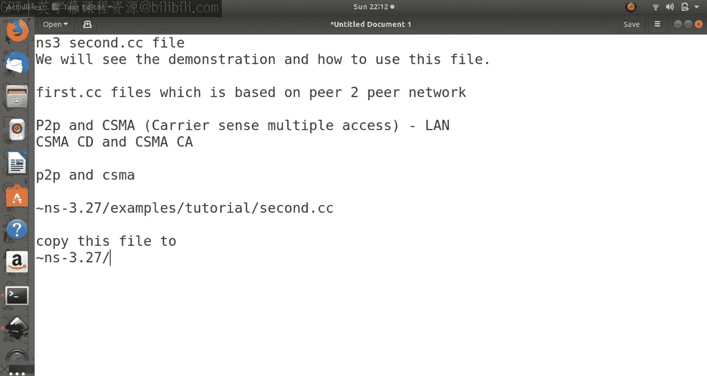

## 概述

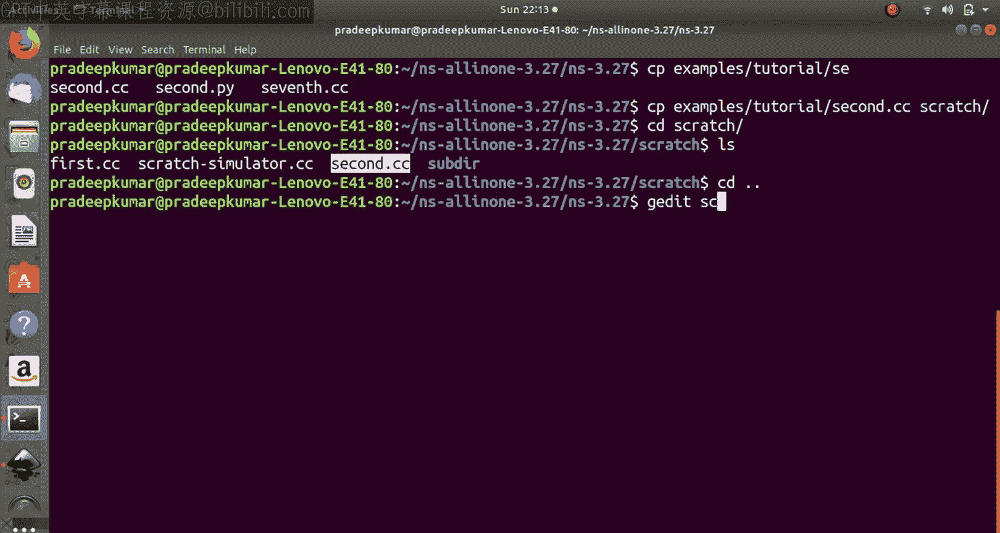

`second.cc`示例构建了一个包含点对点链路和CSMA总线网络的混合拓扑。一个节点通过点对点链路连接到CSMA网络，并向网络中的服务器节点发送数据包。我们将通过修改代码参数、运行模拟、分析数据包捕获文件以及使用网络动画来深入理解其工作原理。

## 代码结构与解析

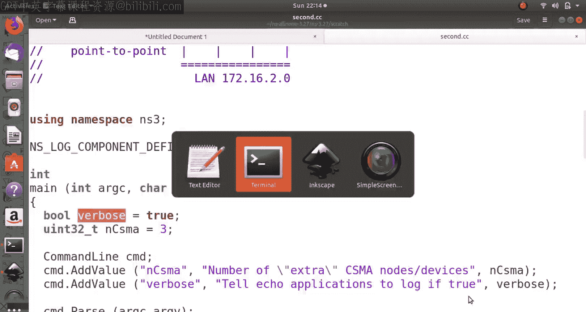

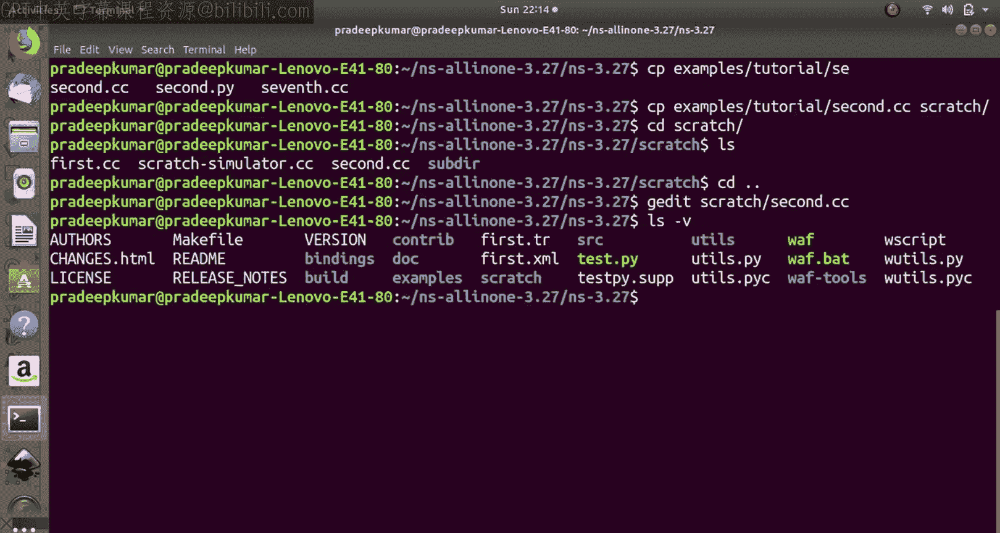

上一节我们概述了示例的目标，本节中我们来看看`second.cc`脚本的具体代码结构及其关键组成部分。

首先，脚本定义了网络拓扑：包含两个点对点节点和多个CSMA节点。核心变量`nCsma`定义了额外的CSMA节点数量，默认为3。

```cpp
uint32_t nCsma = 3;
```

命令行参数可以修改此值。`verbose`布尔变量用于控制是否输出应用程序的日志信息。

```cpp
bool verbose = true;
```

以下是节点创建与拓扑构建的主要步骤：

1.  **创建节点容器**：分别为点对点链路和CSMA网络创建节点容器。
    ```cpp
    NodeContainer p2pNodes;
    p2pNodes.Create(2);

    NodeContainer csmaNodes;
    csmaNodes.Add(p2pNodes.Get(1));
    csmaNodes.Create(nCsma);
    ```
    注意，`p2pNodes.Get(1)`同时被添加到了`csmaNodes`容器中，作为连接两个网络的桥梁。

2.  **安装网络设备与信道**：使用`PointToPointHelper`和`CsmaHelper`为节点安装网络设备并设置信道属性（如带宽、延迟）。
    ```cpp
    PointToPointHelper pointToPoint;
    pointToPoint.SetDeviceAttribute("DataRate", StringValue("5Mbps"));
    pointToPoint.SetChannelAttribute("Delay", StringValue("2ms"));
    NetDeviceContainer p2pDevices = pointToPoint.Install(p2pNodes);

    CsmaHelper csma;
    csma.SetChannelAttribute("DataRate", StringValue("100Mbps"));
    csma.SetChannelAttribute("Delay", TimeValue(NanoSeconds(6560)));
    NetDeviceContainer csmaDevices = csma.Install(csmaNodes);
    ```

3.  **安装协议栈与分配IP地址**：为所有节点安装互联网协议栈，并为两个子网分配IP地址。
    ```cpp
    InternetStackHelper stack;
    stack.Install(p2pNodes.Get(0));
    stack.Install(csmaNodes);

    Ipv4AddressHelper address;
    address.SetBase("172.16.1.0", "255.255.255.0");
    Ipv4InterfaceContainer p2pInterfaces = address.Assign(p2pDevices);
    address.SetBase("172.16.2.0", "255.255.255.0");
    Ipv4InterfaceContainer csmaInterfaces = address.Assign(csmaDevices);
    ```

4.  **设置应用层通信**：配置一个UDP回声服务器和客户端。服务器位于CSMA网络中的最后一个节点，客户端位于点对点网络的第一个节点。
    ```cpp
    UdpEchoServerHelper echoServer(1234);
    ApplicationContainer serverApps = echoServer.Install(csmaNodes.Get(nCsma));
    serverApps.Start(Seconds(1.0));
    serverApps.Stop(Seconds(10.0));

    UdpEchoClientHelper echoClient(csmaInterfaces.GetAddress(nCsma), 1234);
    echoClient.SetAttribute("MaxPackets", UintegerValue(3));
    echoClient.SetAttribute("Interval", TimeValue(Seconds(1.0)));
    echoClient.SetAttribute("PacketSize", UintegerValue(2048));
    ApplicationContainer clientApps = echoClient.Install(p2pNodes.Get(0));
    clientApps.Start(Seconds(2.0));
    clientApps.Stop(Seconds(10.0));
    ```

5.  **启用数据包捕获**：启用指定链路的PCAP文件记录，便于后续使用Wireshark等工具分析。
    ```cpp
    pointToPoint.EnablePcapAll("second");
    csma.EnablePcap("second", csmaDevices.Get(1), true);
    csma.EnablePcap("second", csmaDevices.Get(3), true);
    ```

6.  **运行模拟**：启动模拟器。
    ```cpp
    Simulator::Run();
    Simulator::Destroy();
    ```

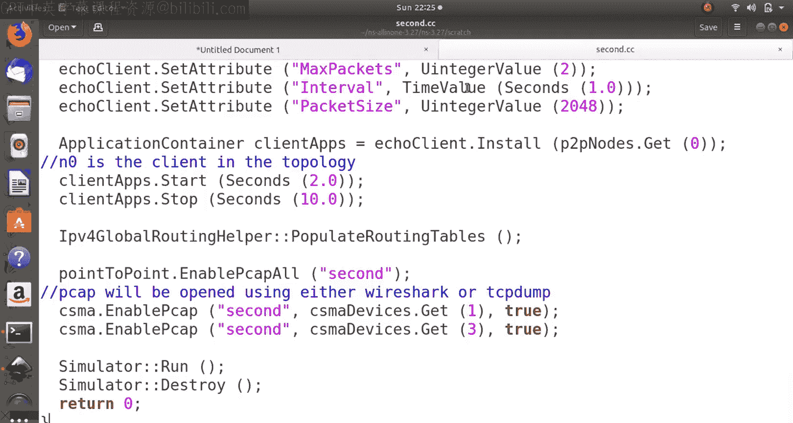

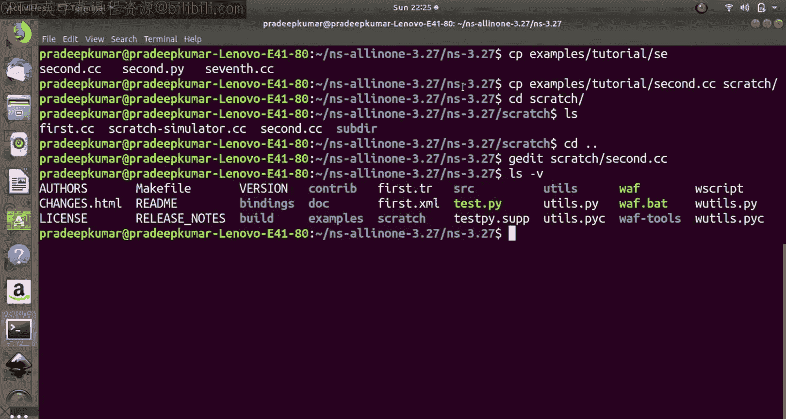

## 运行模拟与基础分析

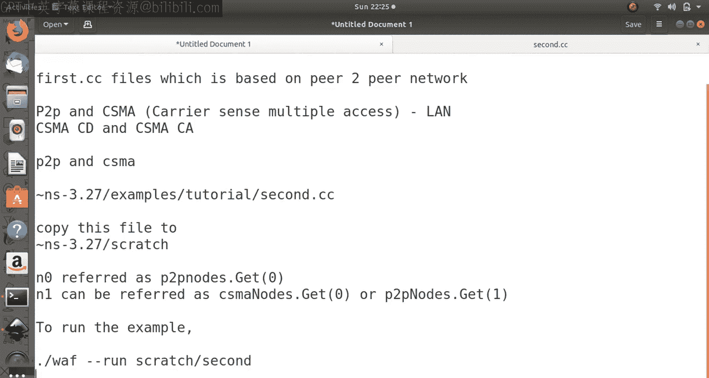

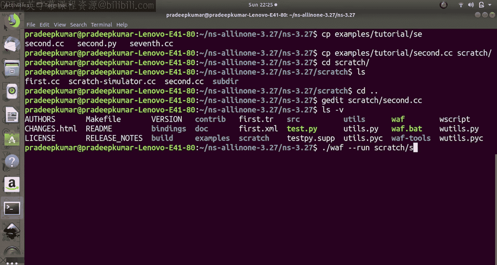

理解了代码结构后，本节中我们来看看如何编译、运行这个脚本并观察其基本输出。

使用以下命令在`scratch`目录下编译并运行脚本：
```
./waf --run scratch/second
```

模拟运行时，控制台会输出数据包发送和接收的日志（如果`verbose`为真）。通过修改代码中的参数，如IP地址、数据包数量、大小、发送间隔等，初学者可以直观地观察网络行为的变化。

模拟结束后，会在当前目录生成`.pcap`数据包捕获文件。可以使用Wireshark或`tcpdump`命令打开并分析这些文件，查看协议头细节、数据流向等信息。

## 使用NetAnim进行可视化

除了分析数据包，我们还可以直观地观察网络动态。本节介绍如何使用NetAnim工具为模拟添加动画效果。

首先，需要在`second.cc`文件开头包含NetAnim头文件，并在`main`函数中添加动画设置代码：

```cpp
#include "ns3/netanim-module.h"
...
AnimationInterface anim("second.xml");
anim.SetConstantPosition(p2pNodes.Get(0), 10.0, 10.0);
anim.SetConstantPosition(csmaNodes.Get(0), 20.0, 20.0);
anim.SetConstantPosition(csmaNodes.Get(1), 30.0, 30.0);
anim.SetConstantPosition(csmaNodes.Get(2), 40.0, 40.0);
anim.SetConstantPosition(csmaNodes.Get(3), 50.0, 50.0);
```

重新编译并运行脚本后，会生成`second.xml`文件。使用NetAnim工具打开此文件：
```
./netanim-3.108/NetAnim second.xml
```

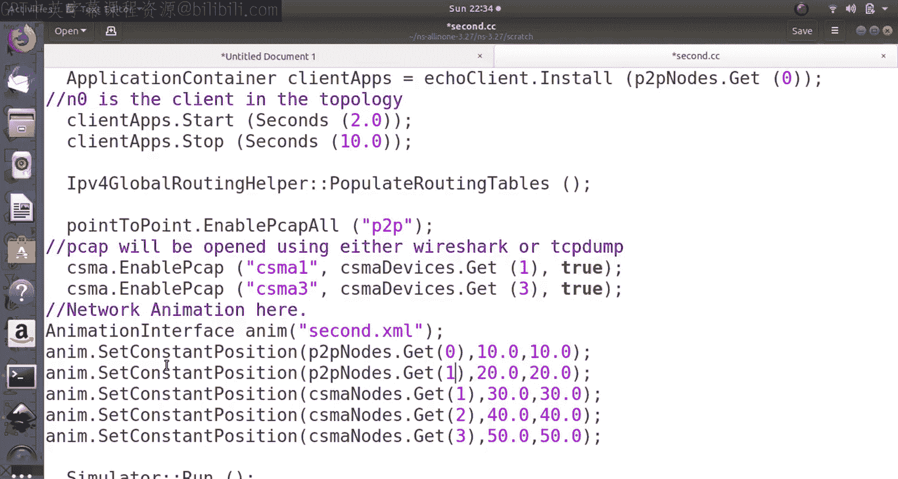

在NetAnim界面中，可以播放模拟动画，观察数据包从客户端节点发出，经点对点链路到达网关节点，再通过CSMA总线广播，最终被服务器节点接收并回复的全过程。界面中的统计信息还可以展示节点间数据包交换的详细记录。

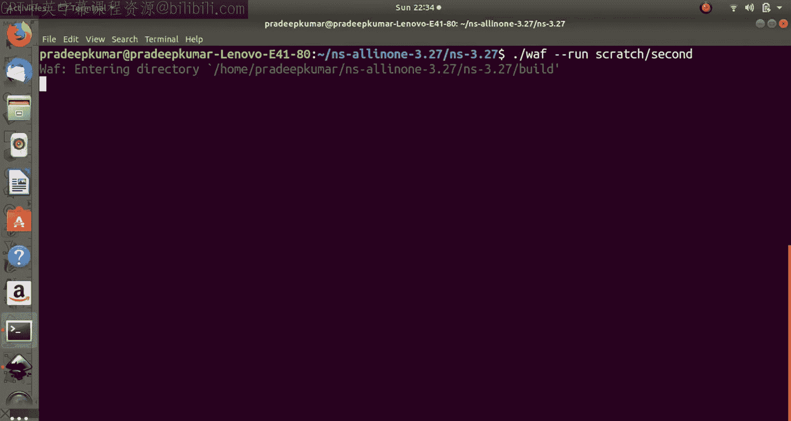

## 使用ASCII追踪与TraceMetrics分析

为了进行定量分析，例如计算吞吐量，我们可以启用ASCII格式的追踪。本节介绍如何配置并使用TraceMetrics工具。

在`second.cc`的`main`函数中，在启用PCAP的代码附近，添加ASCII追踪的代码：

```cpp
AsciiTraceHelper ascii;
pointToPoint.EnableAsciiAll(ascii.CreateFileStream("p2p.tr"));
csma.EnableAsciiAll(ascii.CreateFileStream("csma.tr"));
```

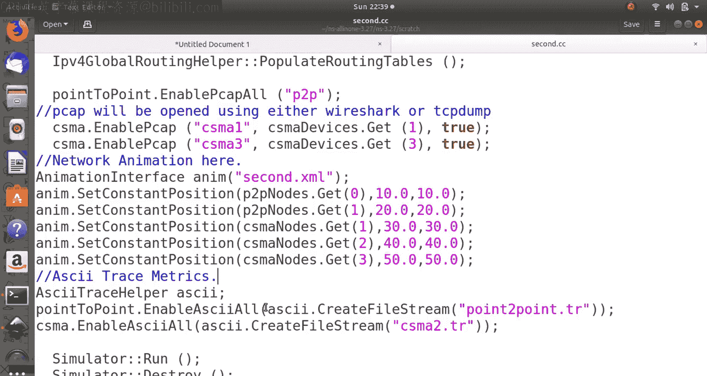

重新运行模拟后，会生成`p2p.tr`和`csma.tr`两个ASCII追踪文件。我们可以使用NS3自带的`traceMetrics`工具（一个Java JAR程序）来分析这些文件，特别是CSMA网络的性能。

运行以下命令启动分析工具：
```
java -jar traceMetrics.jar
```

在工具界面中加载`csma.tr`文件，选择要分析的节点（例如作为网关和服务器的那两个活跃节点），执行分析。工具会提供吞吐量、延迟等指标的统计结果，帮助我们理解网络在负载下的表现。

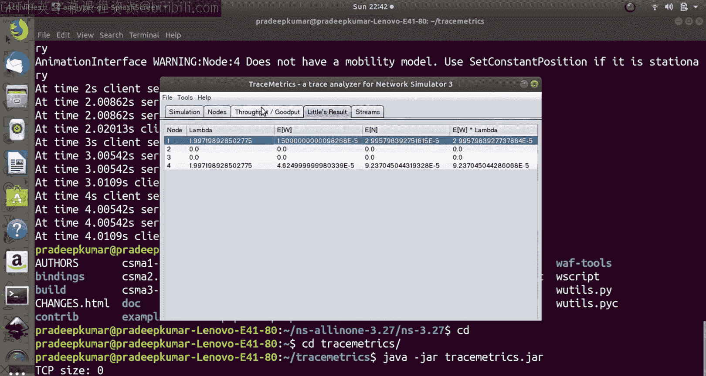

## 总结

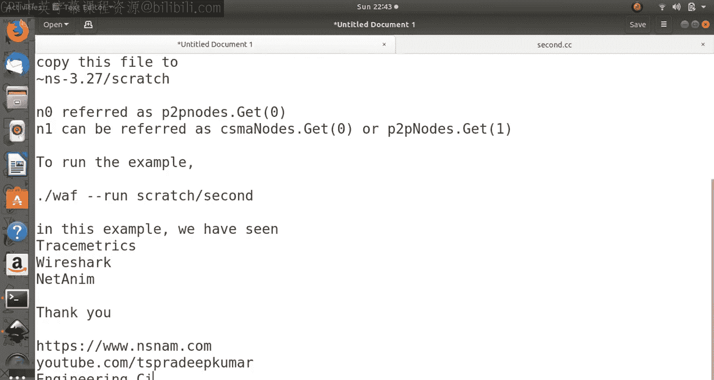

本节课中我们一起学习了NS3的`second.cc`示例。我们从分析其混合网络拓扑的代码开始，学习了如何设置点对点和CSMA网络、配置UDP应用、启用数据包捕获。接着，我们运行了模拟，并使用Wireshark分析网络流量。然后，我们通过集成NetAnim模块，实现了模拟过程的可视化动画。最后，我们启用了ASCII追踪，并利用TraceMetrics工具对网络性能进行了定量分析。这个示例综合运用了NS3的多种功能，是深入学习网络协议和模拟分析的良好起点。