# 02：详解first.cc与ASCII追踪及NetAnim 🖥️

在本节课中，我们将学习NS3网络模拟器的入门知识，重点分析一个名为`first.cc`的示例程序。我们将了解其源代码结构，并学习如何集成ASCII追踪和NetAnim网络动画工具来可视化模拟过程。

## 概述

对于任何网络模拟器的初学者，首要问题通常是“从哪里开始”以及“如何开始”。NS3提供了丰富的示例代码，其中`first.cc`是一个演示点对点网络通信的经典入门程序。本节我们将逐行解析此代码，并演示如何为其添加网络动画和包追踪功能，以便更直观地理解模拟过程。

## 源代码结构与解析

上一节我们介绍了NS3的基本概念和安装。本节中，我们来看看`first.cc`这个基础示例的代码结构。

首先，程序包含了必要的头文件：

```cpp
#include "ns3/core-module.h"
#include "ns3/network-module.h"
#include "ns3/internet-module.h"
#include "ns3/point-to-point-module.h"
#include "ns3/applications-module.h"
```

使用`ns3`命名空间，并定义一个日志组件用于文档记录：

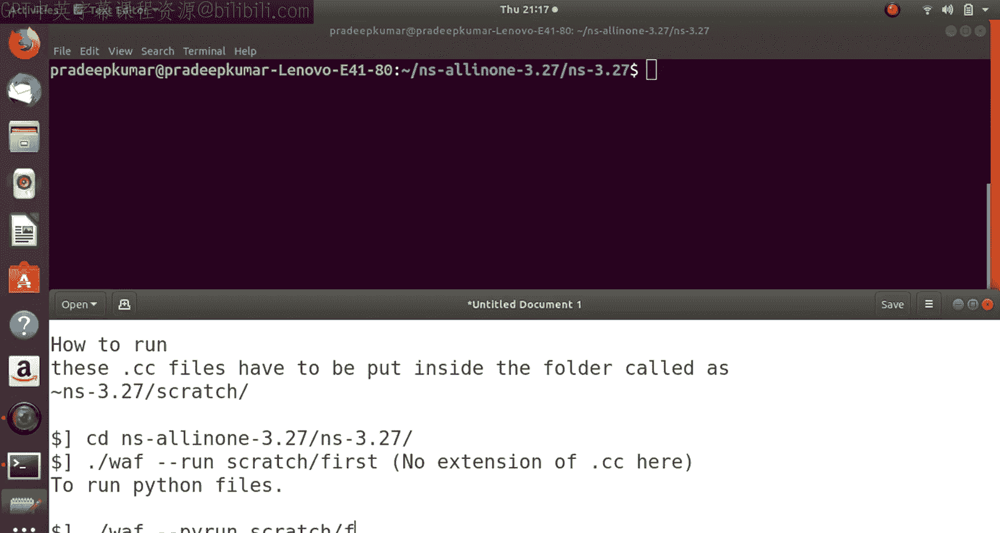

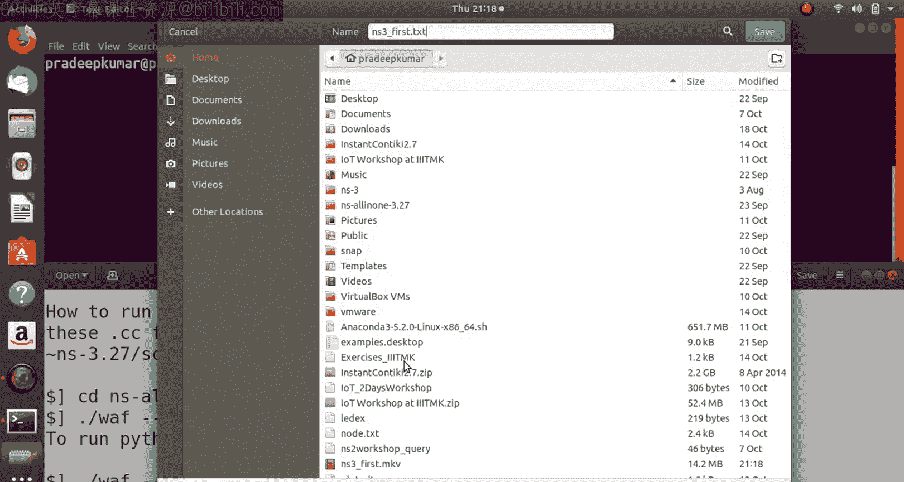

```cpp
using namespace ns3;
NS_LOG_COMPONENT_DEFINE ("FirstScriptExample");
```

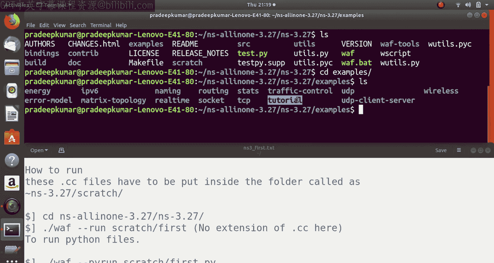

程序的主函数开始，并处理命令行参数。设置时间分辨率为纳秒：

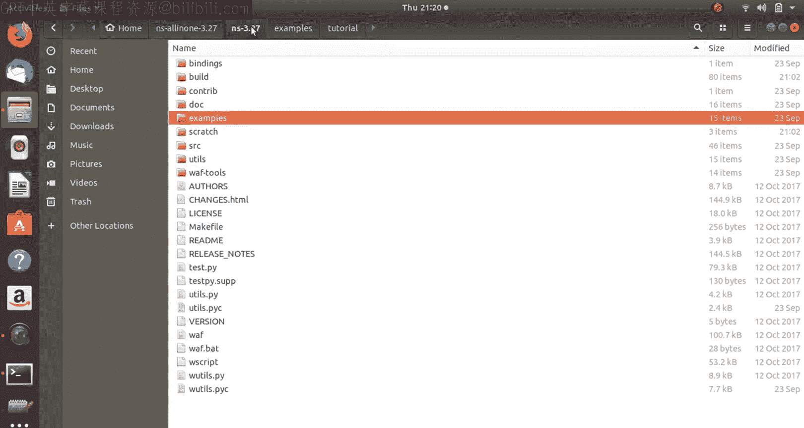

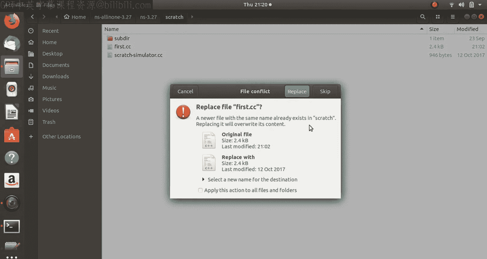

```cpp
int main (int argc, char *argv[]) {
    Time::SetResolution (Time::NS);
    LogComponentEnable ("UdpEchoClientApplication", LOG_LEVEL_INFO);
    LogComponentEnable ("UdpEchoServerApplication", LOG_LEVEL_INFO);
```

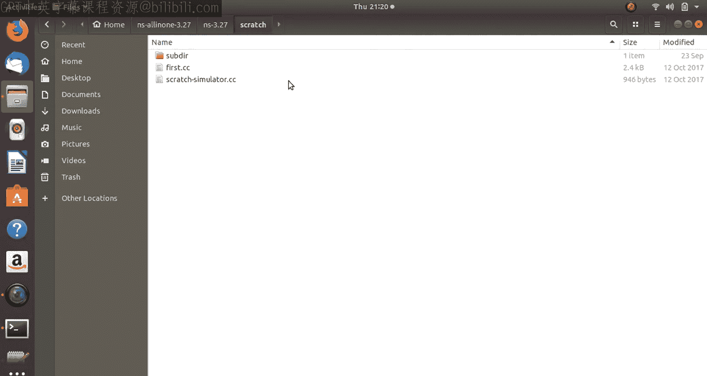

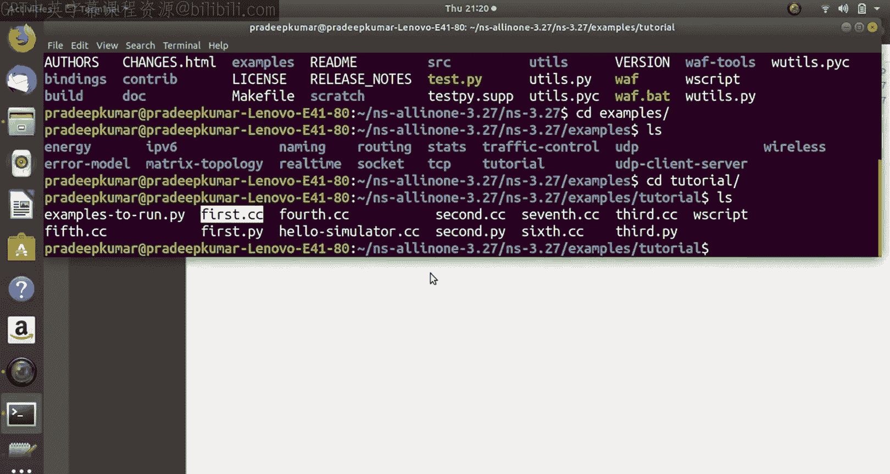

### 创建网络节点与设备

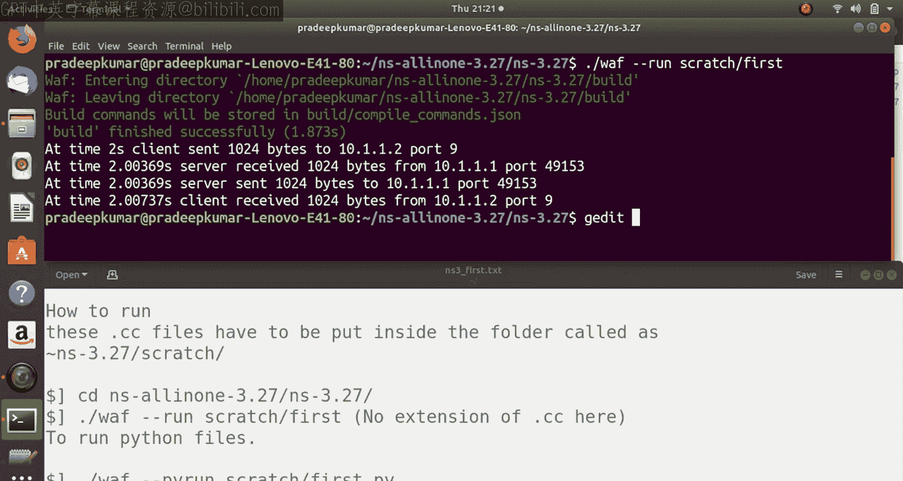

以下是创建两个网络节点并配置点对点连接的步骤：

1.  **创建节点**：使用`NodeContainer`创建两个网络节点。
    ```cpp
    NodeContainer nodes;
    nodes.Create (2);
    ```

2.  **配置点对点链路**：使用`PointToPointHelper`设置链路的数据速率和延迟。
    ```cpp
    PointToPointHelper pointToPoint;
    pointToPoint.SetDeviceAttribute ("DataRate", StringValue ("5Mbps"));
    pointToPoint.SetChannelAttribute ("Delay", StringValue ("2ms"));
    ```

3.  **安装网络设备**：将点对点设备安装到节点上，形成`NetDeviceContainer`。
    ```cpp
    NetDeviceContainer devices;
    devices = pointToPoint.Install (nodes);
    ```

### 配置网络协议栈与IP地址

节点创建完成后，需要为其安装网络协议栈并分配IP地址。

1.  **安装协议栈**：使用`InternetStackHelper`为所有节点安装TCP/IP协议栈。
    ```cpp
    InternetStackHelper stack;
    stack.Install (nodes);
    ```

2.  **分配IP地址**：使用`Ipv4AddressHelper`为点对点设备分配IP地址。
    ```cpp
    Ipv4AddressHelper address;
    address.SetBase ("10.1.1.0", "255.255.255.0");
    Ipv4InterfaceContainer interfaces = address.Assign (devices);
    ```

### 创建服务器与客户端应用

网络基础设施搭建好后，我们需要在上面运行应用程序。以下是创建UDP回声服务器和客户端的步骤：

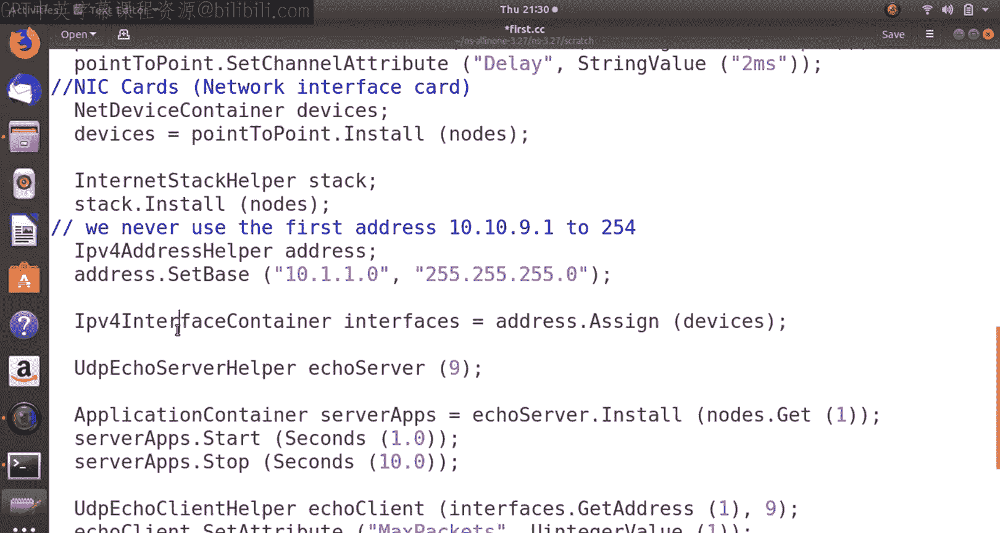

1.  **创建UDP回声服务器**：在第二个节点（索引1）上监听端口9。
    ```cpp
    UdpEchoServerHelper echoServer (9);
    ApplicationContainer serverApps = echoServer.Install (nodes.Get (1));
    serverApps.Start (Seconds (1.0));
    serverApps.Stop (Seconds (10.0));
    ```

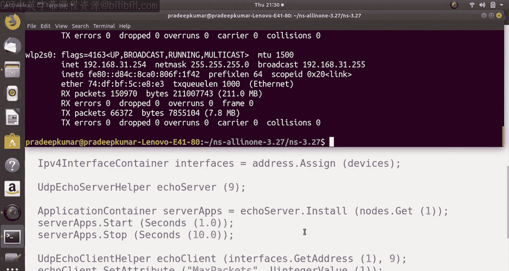

2.  **创建UDP回声客户端**：在第一个节点（索引0）上配置，使其向服务器的IP地址和端口发送数据包。
    ```cpp
    UdpEchoClientHelper echoClient (interfaces.GetAddress (1), 9);
    echoClient.SetAttribute ("MaxPackets", UintegerValue (1));
    echoClient.SetAttribute ("Interval", TimeValue (Seconds (1.0)));
    echoClient.SetAttribute ("PacketSize", UintegerValue (1024));
    ApplicationContainer clientApps = echoClient.Install (nodes.Get (0));
    clientApps.Start (Seconds (2.0));
    clientApps.Stop (Seconds (10.0));
    ```

### 运行与销毁模拟器

最后，启动模拟器并在完成后进行清理：

```cpp
Simulator::Run ();
Simulator::Destroy ();
return 0;
```

编译并运行此程序，将在终端看到类似如下的输出，显示客户端与服务器之间数据包的发送与接收：

```
At time 2s client sent 1024 bytes to 10.1.1.2 port 9
At time 2.00369s server received 1024 bytes from 10.1.1.1 port 49153
At time 2.00369s server sent 1024 bytes to 10.1.1.1 port 49153
At time 2.00737s client received 1024 bytes from 10.1.1.2 port 9
```

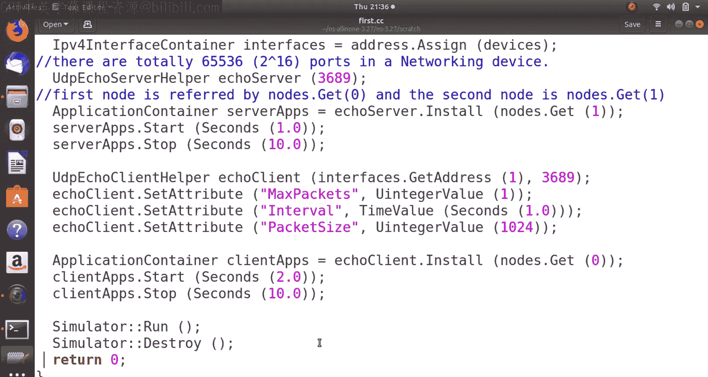

## 集成NetAnim网络动画

为了更直观地观察数据包的流动，我们可以为`first.cc`添加NetAnim支持。

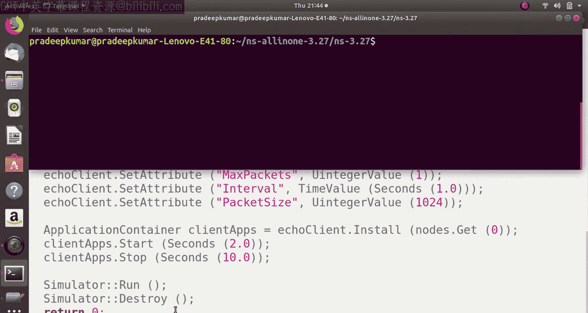

首先，在源代码中包含NetAnim模块的头文件：

```cpp
#include "ns3/netanim-module.h"
```

然后，在`Simulator::Run()`语句之前，添加以下代码来创建动画接口并设置节点位置：

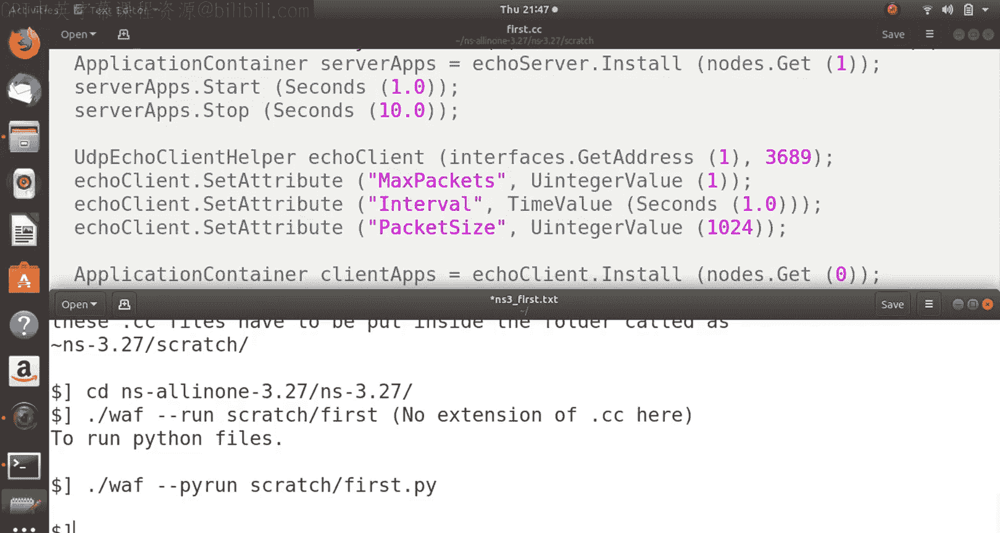

```cpp
AnimationInterface anim ("first.xml");
anim.SetConstantPosition (nodes.Get (0), 10.0, 10.0);
anim.SetConstantPosition (nodes.Get (1), 20.0, 20.0);
```

重新编译并运行程序后，会生成一个`first.xml`文件。使用NS3自带的NetAnim工具打开此文件：

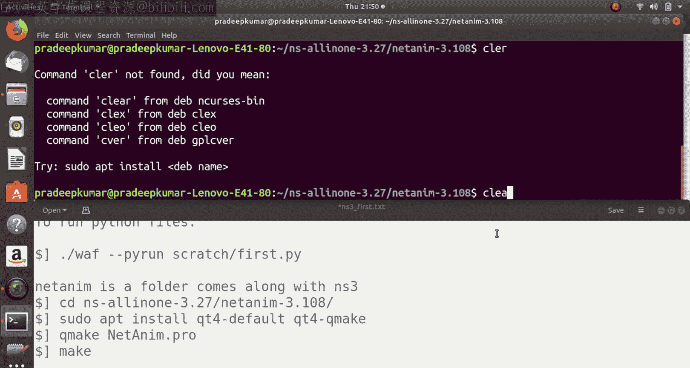

```bash
cd netanim-3.108
./netanim
```

在NetAnim界面中打开`first.xml`文件，即可播放模拟动画，看到数据包在两个节点间传输的可视化效果。

## 启用ASCII追踪

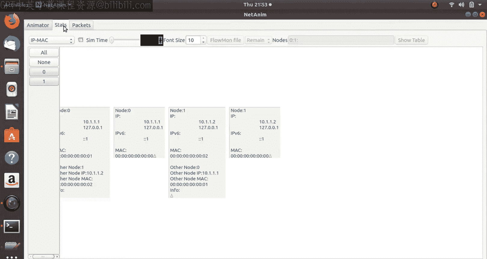

除了图形化动画，我们还可以生成ASCII格式的包追踪文件，用于详细分析每个数据包。

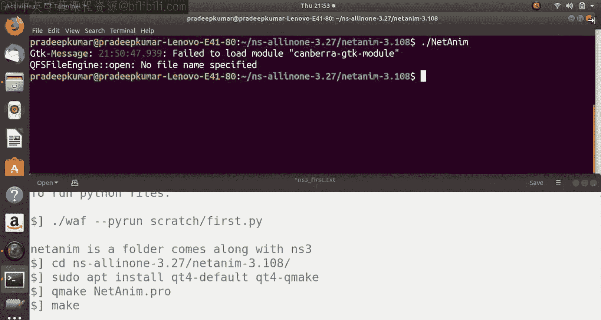

在`Simulator::Run()`语句之前，添加以下代码启用ASCII追踪：

```cpp
AsciiTraceHelper ascii;
pointToPoint.EnableAsciiAll (ascii.CreateFileStream ("first.tr"));
```

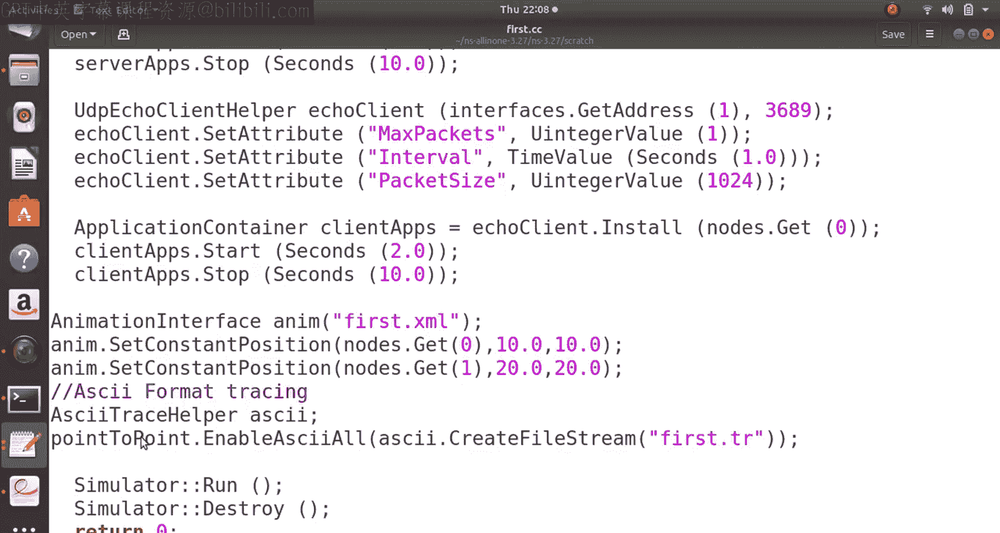

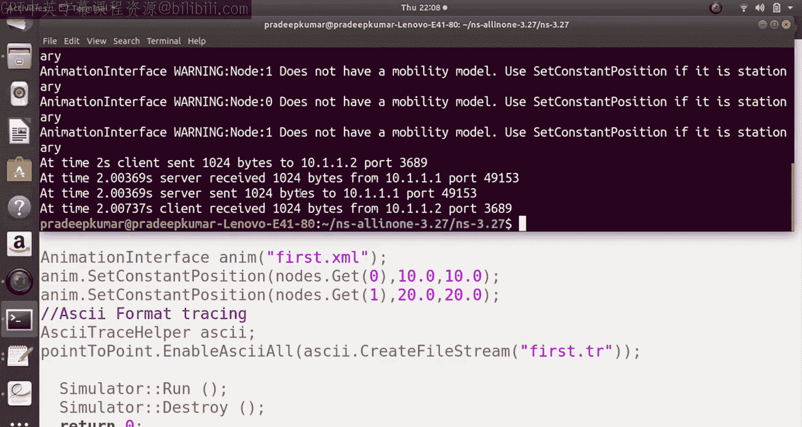

重新运行程序后，会生成一个`first.tr`文件。该文件以文本形式详细记录了模拟过程中每个数据包在队列中的进入、离开、丢弃等事件。

## 使用TraceMatrix分析追踪文件

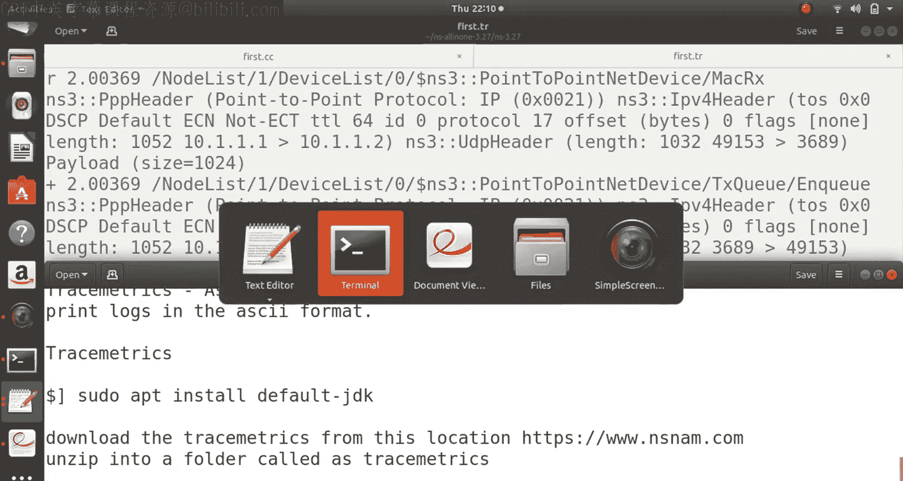

`first.tr`文件可以被TraceMatrix工具进一步分析。TraceMatrix是一个基于Java的图形化分析工具。

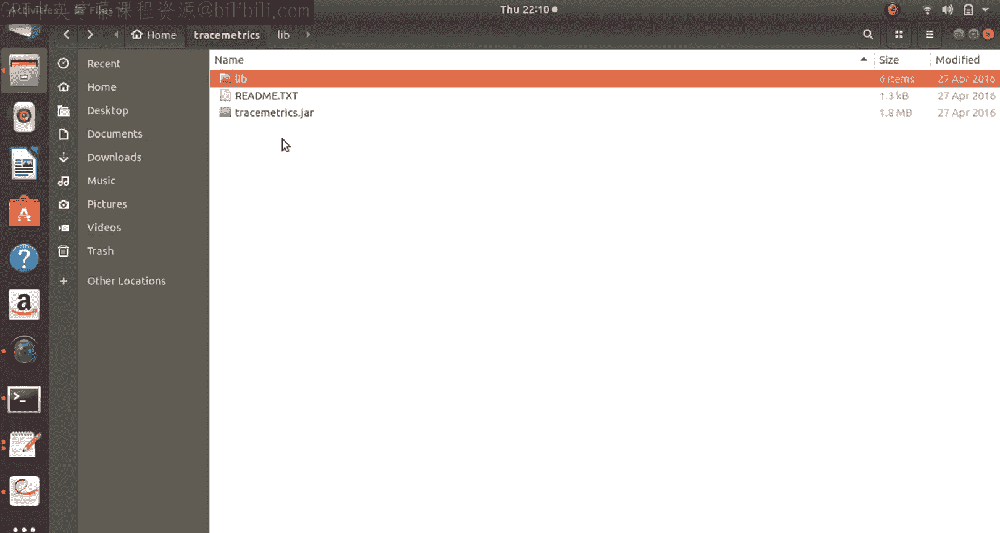

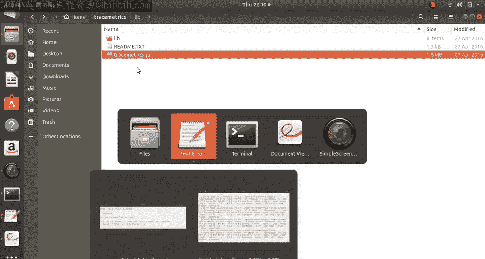

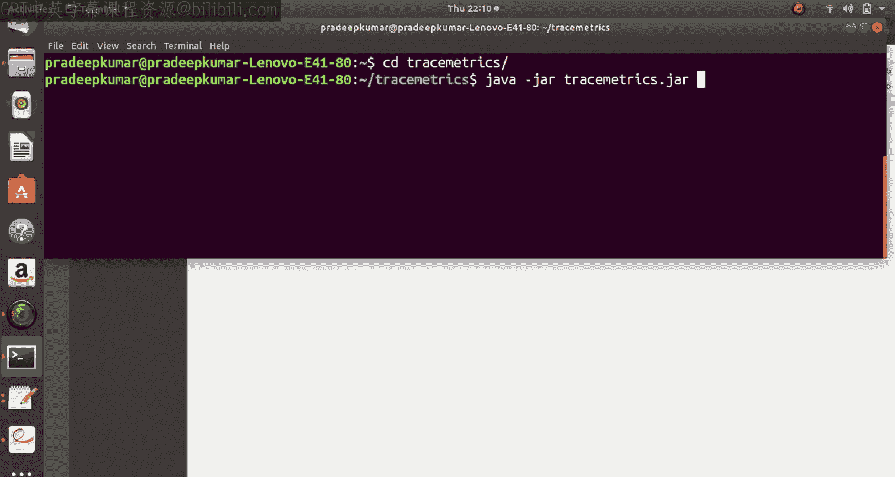

1.  确保系统已安装Java。
2.  下载并解压TraceMatrix软件包。
3.  在TraceMatrix目录下，运行以下命令启动工具：
    ```bash
    java -jar trace-compass.jar
    ```
4.  在TraceMatrix界面中，打开生成的`first.tr`文件。

工具将提供模拟的统计摘要，包括总包数、发送/接收包数、吞吐量、端到端延迟等信息，并以图表形式展示节点间的数据流。

## 总结

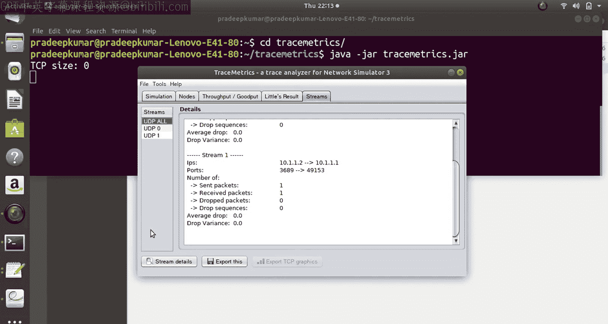

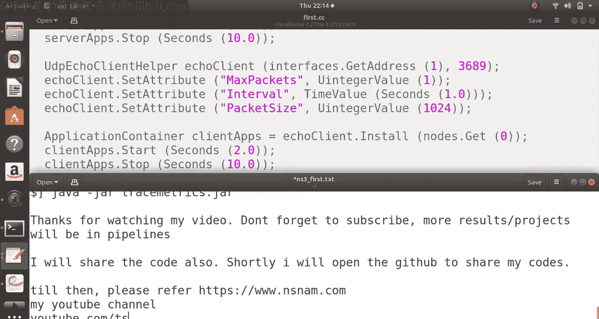

本节课我们一起学习了NS3入门程序`first.cc`的完整代码结构。我们从创建节点、配置链路、分配IP地址，到部署UDP回声应用，逐步构建了一个简单的点对点网络模拟。此外，我们还学习了如何集成NetAnim来可视化模拟过程，以及如何使用ASCII追踪和TraceMatrix工具来记录和分析数据包的详细传输情况。掌握这个基础示例是理解更复杂NS3模拟的关键第一步。