# 10：使用ns3进行VANET路由 - 第一部分 🚗

在本节课中，我们将学习如何使用ns-3模拟器来研究车载自组织网络中的路由协议。我们将重点分析一个名为 `vanet-routing-compare.cc` 的示例，该示例允许我们比较不同的路由协议在车辆网络环境中的性能。

## 概述

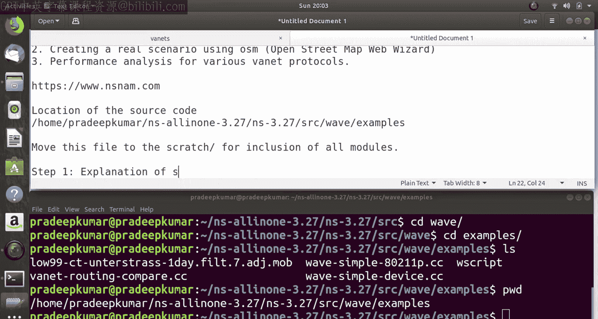

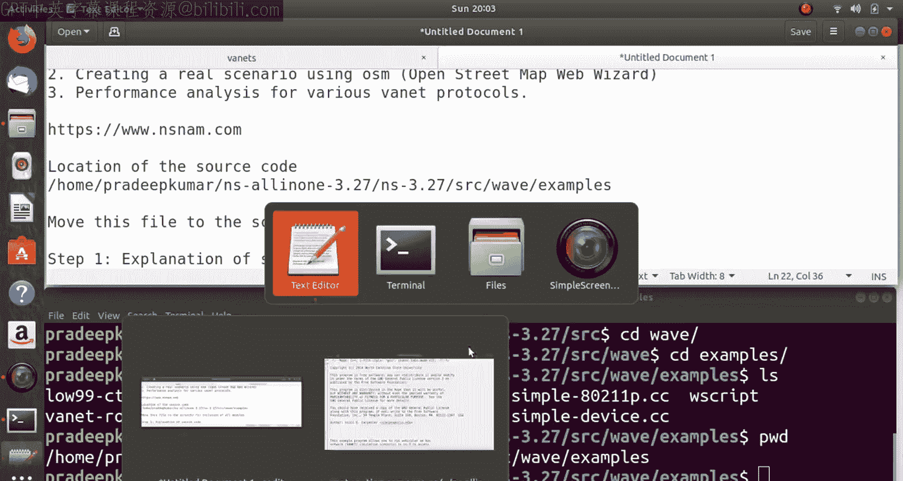

本教程将分为三个主要步骤。首先，我们将详细解释源代码的结构和功能。其次，我们将学习如何利用OpenStreetMap创建一个真实的交通场景。最后，我们将对多种路由协议进行性能分析。本示例代码超过1500行，我们将分块进行讲解，以便于理解。

## 源代码解释

上一节我们介绍了本教程的整体结构，本节中我们来看看源代码的具体实现。

源代码位于 `ns-3.27/scratch/` 目录下的 `vanet-routing-compare.cc` 文件。为了确保所有模块都能正确加载，建议将此文件移动到 `scratch` 文件夹中运行。

该示例用于运行车辆自组织网络仿真场景。它使用了802.11p MAC层协议，这是一种专为车联网设计的无线接入标准。传播损耗模型支持自由空间、双射线地面和ITU模型。应用层流量使用基本安全消息（BSM），我们可以观察安全消息的包投递率。路由协议方面，可以比较DSDV、AODV、OLSR和DSR。默认情况下，程序使用AODV协议。

仿真场景可以是使用随机路点移动模型生成的合成高速公路场景，也可以是通过回放移动轨迹文件（.tcl文件）创建的真实场景。脚本允许修改许多参数，例如，一个场景可以运行10秒，包含40个节点，以20米/秒的速度在300x1500米的区域内移动，Wi-Fi使用10MHz的控制信道。

### 核心类与函数

以下是源代码中定义的主要类及其功能：

*   **RoutingStats类**：用于统计路由信息，例如接收/发送的字节数和包数。其构造函数将所有计数器初始化为0。
    ```cpp
    RoutingStats::RoutingStats ()
      : m_RxBytes (0),
        m_cumulativeRxBytes (0),
        m_RxPkts (0),
        ...
    {
    }
    ```
*   **RoutingHelper类**：帮助安装和配置路由协议。它可以根据参数安装不同的协议（1=OLSR， 2=AODV， 3=DSDV， 4=DSR）。
*   **WifiPhyStats类**：用于收集Wi-Fi物理层的统计信息，如丢包数。
*   **VanetRoutingExperiment类**：继承自 `WifiApp` 类，是主要的实验类。它包含了设置节点、信道、设备、移动性、应用程序、跟踪以及运行仿真的所有函数。

### 关键配置参数

在 `VanetRoutingExperiment` 类的构造函数中，设置了许多默认参数：
*   `port`: 9
*   `CSVfileName`: "vanet-routing-output.csv"
*   `nSinks`: 10
*   `protocol`: 2 (代表AODV)
*   `traceMobility`: false
*   `lossModel`: 3
*   `phyMode`: "OfdmRate6MbpsBW10MHz"
*   `80211Mode`: 1 (代表802.11p)
*   `nNodes`: 156
*   `totalTime`: 300 秒
*   `rate`: "2048bps"
*   `nodeSpeed`: 20 m/s
*   `nodePause`: 0
*   `wavePacketSize`: 200 字节

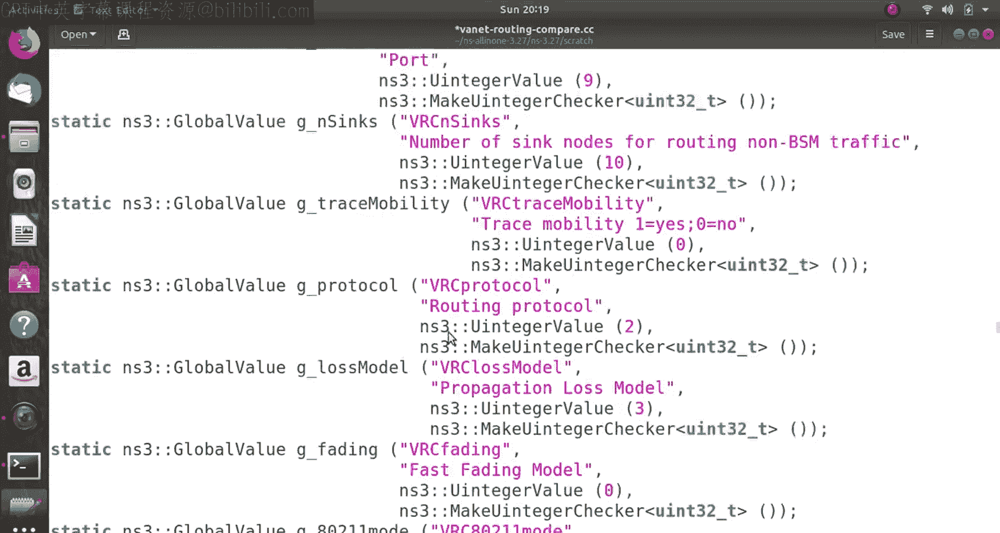

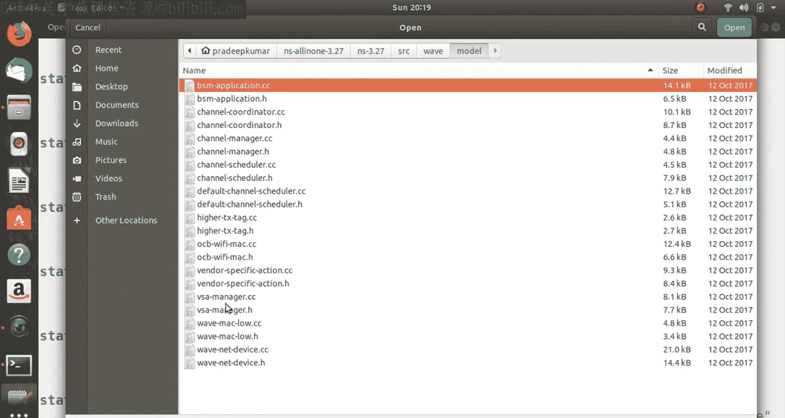

此外，还定义了安全消息的传输范围（50米到500米，每50米一个间隔），用于计算不同距离下的包投递率。

### 命令参数覆盖

程序支持通过命令行参数覆盖默认值，这为灵活实验提供了便利。例如：
*   要改变仿真总时间：`--TotalTime=10`
*   要改变使用的路由协议：`--protocol=4` (使用DSR)
*   要改变节点数量：`--nNodes=50`

## 运行示例与初步分析

上一节我们剖析了代码结构，本节中我们来看看如何运行示例并进行初步结果分析。

首先，将 `vanet-routing-compare.cc` 文件复制到 `scratch` 目录并编译运行。默认情况下，它使用AODV协议运行一个10秒的简短场景。

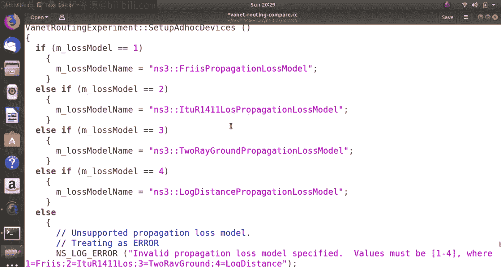

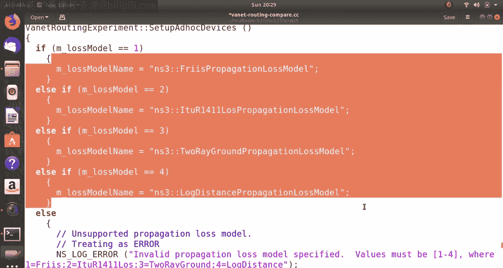

我们可以通过命令行参数运行不同协议的仿真进行比较：
1.  **AODV (默认)**: `./waf --run "scratch/vanet-routing-compare --protocol=2"`
2.  **OLSR**: `./waf --run "scratch/vanet-routing-compare --protocol=1"`
3.  **DSDV**: `./waf --run "scratch/vanet-routing-compare --protocol=3"`
4.  **DSR**: `./waf --run "scratch/vanet-routing-compare --protocol=4"`
5.  **无路由协议**: `./waf --run "scratch/vanet-routing-compare --protocol=0"`

运行后，终端会输出关键性能指标，例如不同距离（50m, 100m, ..., 500m）下的BSM包投递率（PDR）和网络总吞吐量（Goodput）。初步观察显示，在本示例的短时仿真中，DSR协议的吞吐量表现最佳。

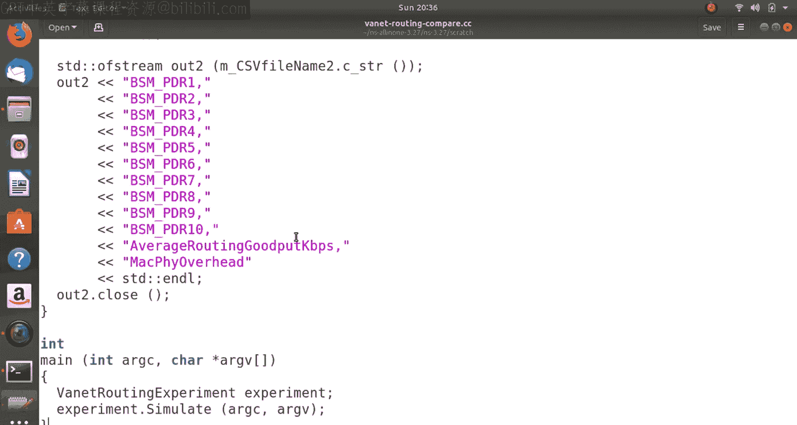

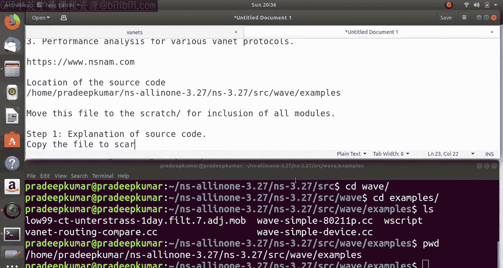

### 生成的文件

仿真运行后会生成多个文件，用于进一步分析：
*   `vanet-routing-compare.mob`: 节点移动轨迹文件，记录每个时间点节点的位置和速度。
*   `vanet-routing-output.csv` 和 `vanet-routing-output2.csv`: 主要的性能指标CSV文件，包含每秒的接收包数、发送包数、投递率等详细数据。
*   `vanet-animation.xml`: 网络动画文件，可通过NetAnim工具可视化仿真过程。
*   `.pcap` 文件: 如果启用，会生成数据包捕获文件，可用于Wireshark分析。

### 网络动画可视化

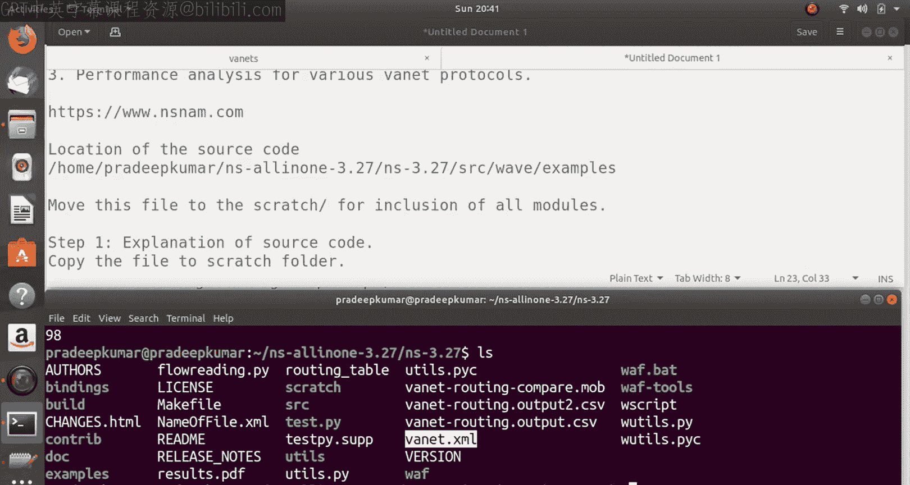

通过修改源代码，在仿真运行前添加网络动画接口，可以生成 `.xml` 动画文件。使用NetAnim工具打开此文件，可以直观地观察车辆节点的移动和它们之间的数据包交换过程。这对于理解网络动态和调试非常有帮助。

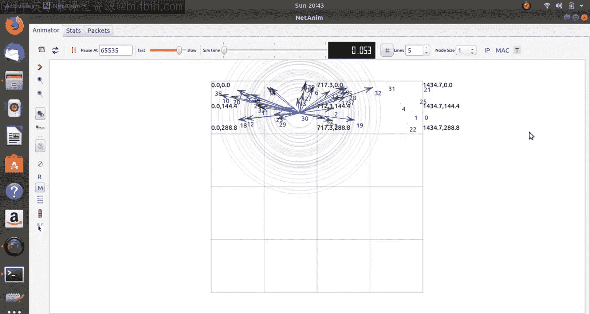

## 总结

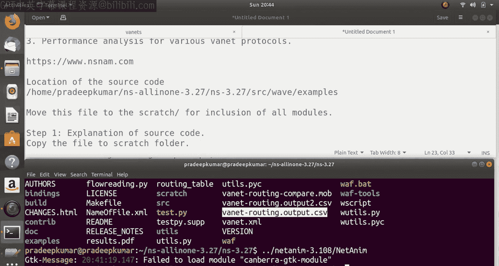

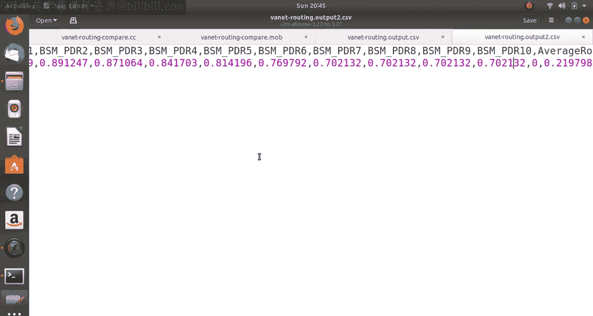

本节课中我们一起学习了ns-3中VANET路由比较示例的第一部分。我们详细解读了超过1500行的源代码结构，了解了如何配置车辆网络仿真参数，以及如何运行仿真来比较AODV、OLSR、DSDV和DSR等路由协议。我们还看到了如何通过命令行覆盖默认参数，并初步查看了仿真输出的结果文件和简单的网络动画。

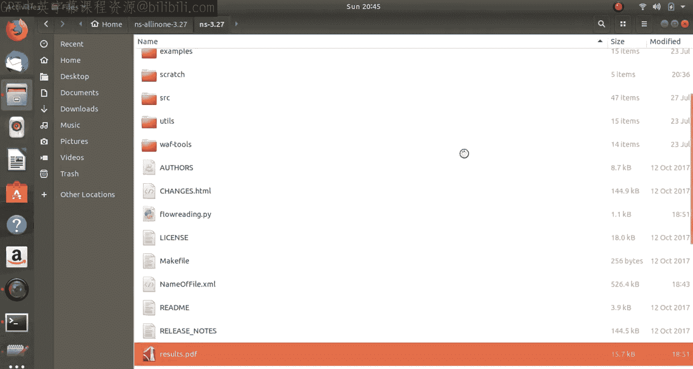

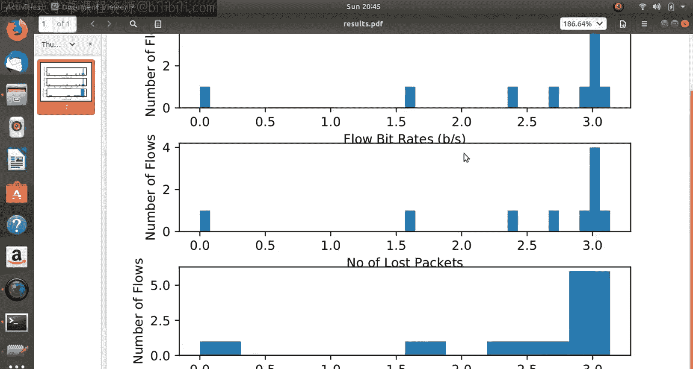

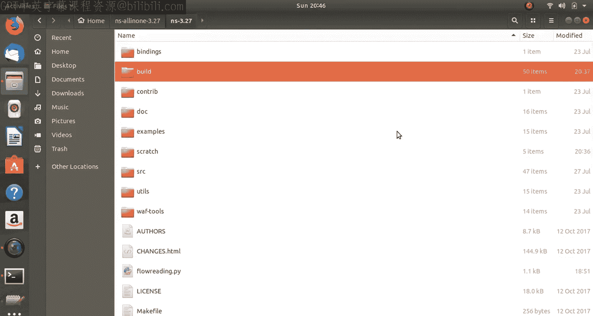

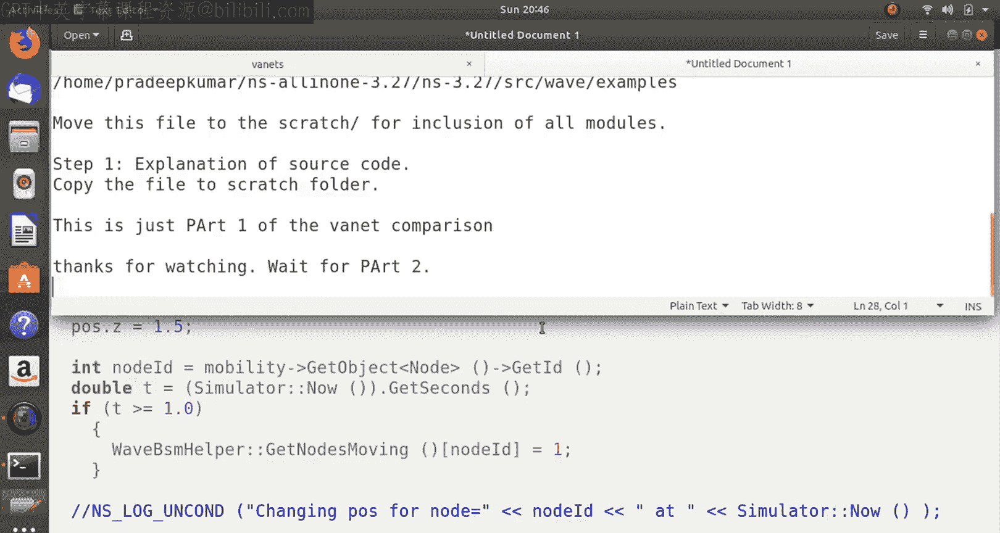

在接下来的第二部分，我们将深入探讨如何利用SUMO（Simulation of Urban Mobility）和OpenStreetMap创建更真实的城市交通场景，并详细分析生成的CSV数据，绘制如吞吐量、时延、包投递率等关键性能指标的图表，从而完成完整的VANET路由协议性能评估。