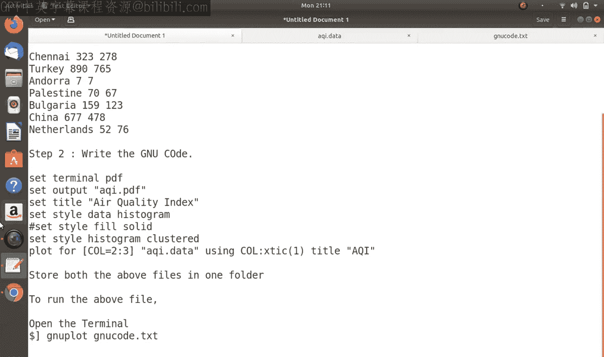
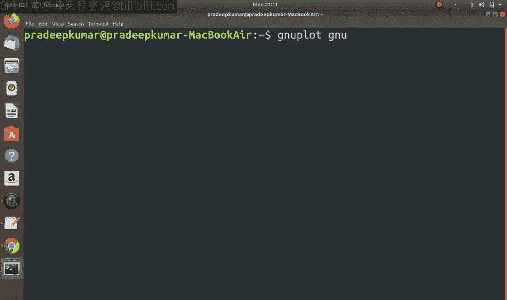
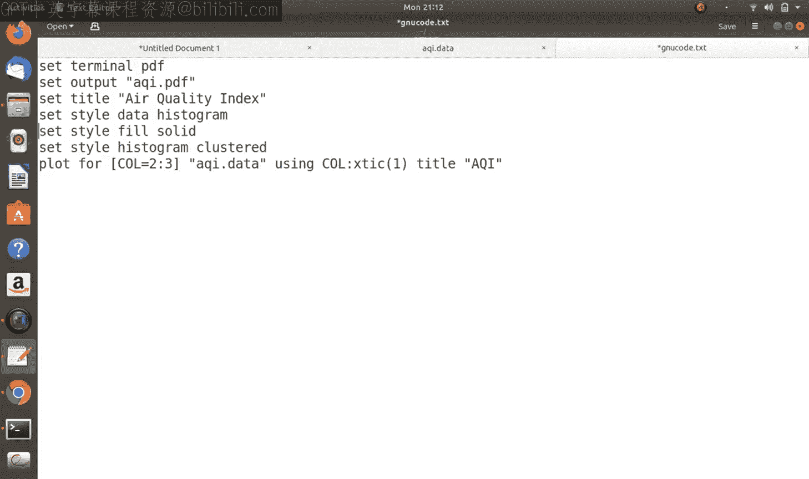
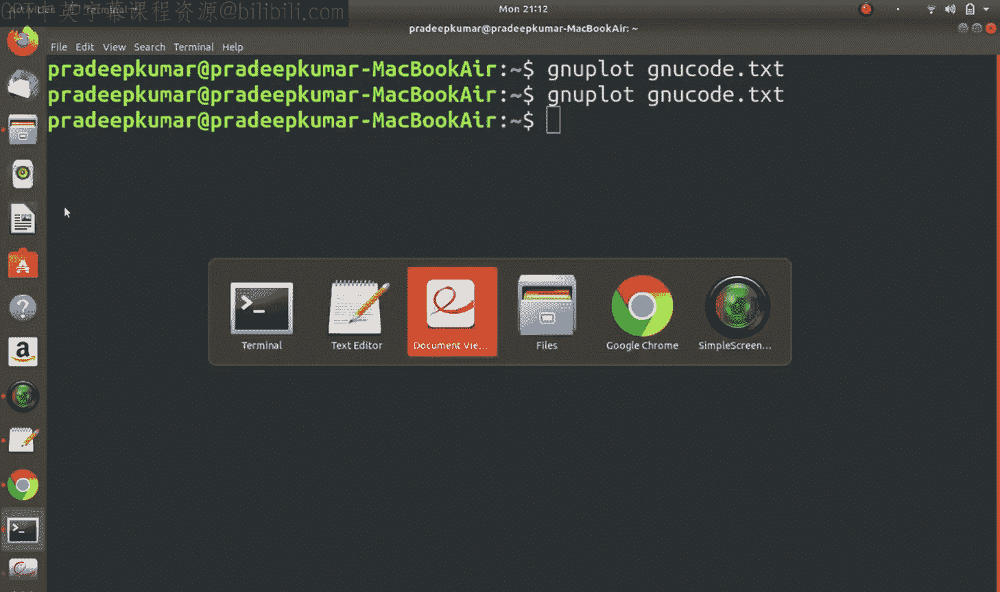
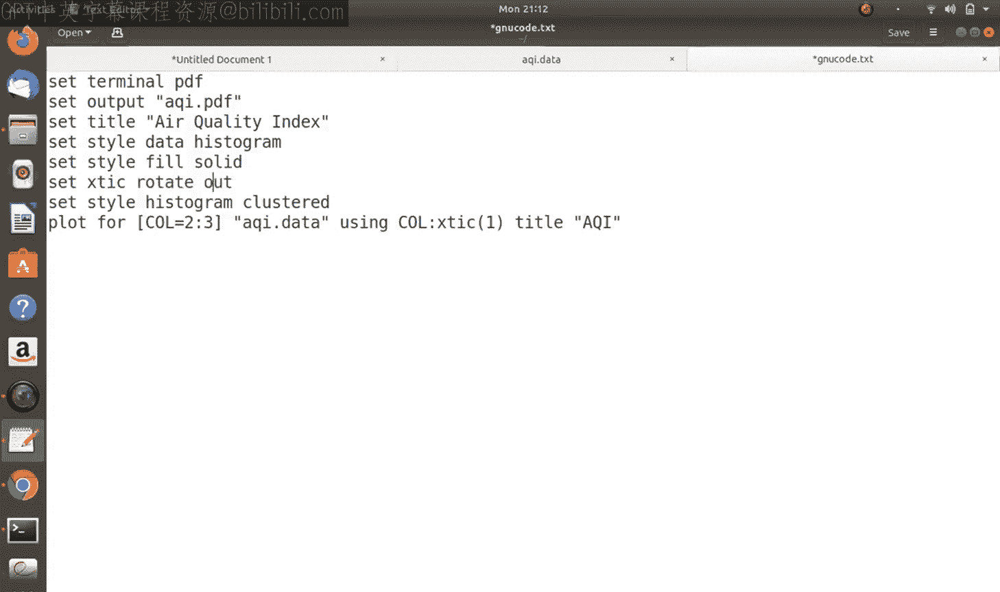
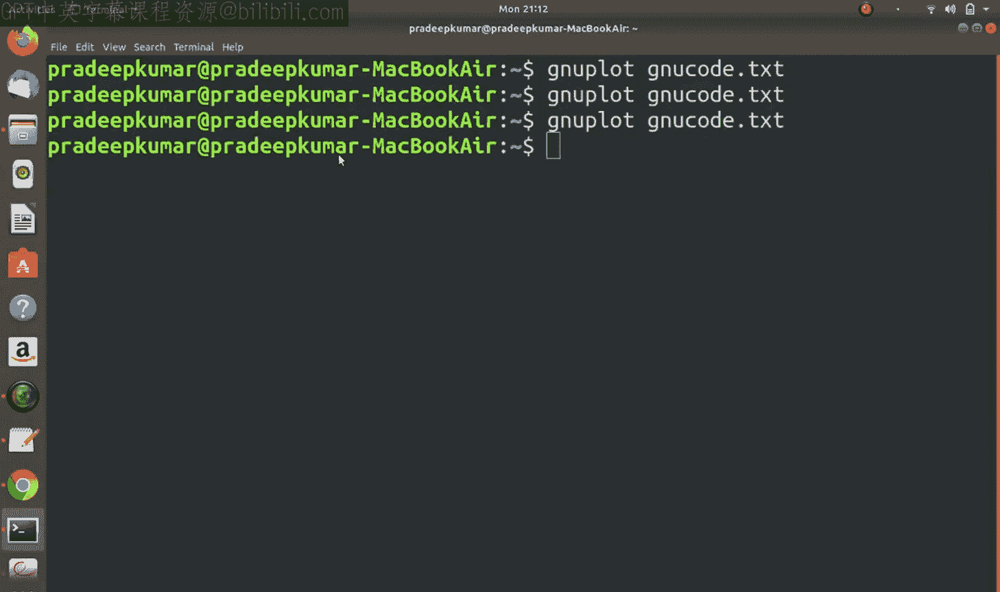
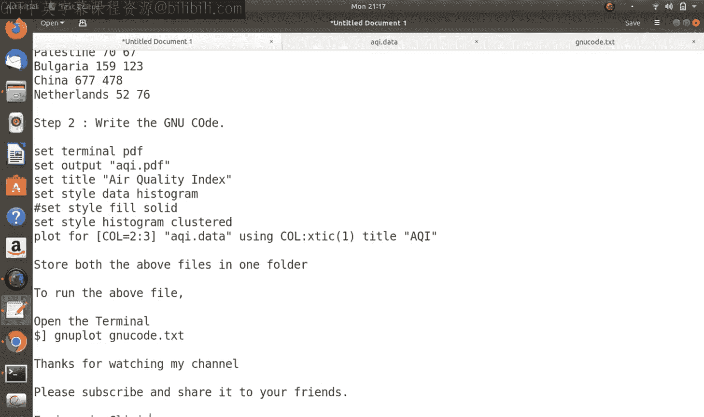

# 11：使用Gnuplot绘制直方图 📊


在本节课中，我们将学习如何使用Gnuplot工具绘制直方图。直方图是数据可视化的重要方式，能够直观地展示数据的分布情况。我们将从创建数据文件开始，逐步编写Gnuplot脚本，最终生成清晰的直方图。

## 概述

本节课是Gnuplot系列教程的第二部分，重点介绍直方图的绘制方法。我们将使用一个关于全球主要城市空气质量指数的数据集作为例子，演示如何创建数据文件、编写Gnuplot脚本，并生成包含多个数据系列的直方图。

## 第一步：创建数据文件

绘制直方图的第一步是准备数据。我们将创建一个文本文件，其中包含城市名称以及对应的空气质量指数数据。以下是数据文件的示例内容：

```
Chennai 323 278
Turkey 93 89
Andorra 7 7
Palestine 70 67
Bulgaria 159 123
China 6 8
Netherlands 52 76
```

在这个例子中，第一列是城市名称，第二列是本周的空气质量指数，第三列是上周的空气质量指数。我们将这个文件保存为 `aqi.data`。

## 第二步：编写Gnuplot脚本

接下来，我们需要编写一个Gnuplot脚本来绘制直方图。脚本将指定输出格式、图表标题、样式以及要绘制的数据列。

以下是脚本的基本结构：

```gnuplot
set terminal pdf
set output "aqi.pdf"
set title "Air Quality Index"
set style data histogram
set style histogram clustered
plot "aqi.data" using 2:xtic(1) title "This Week", \
     "" using 3 title "Last Week"
```

在这个脚本中：
- `set terminal pdf` 指定输出格式为PDF。
- `set output "aqi.pdf"` 设置输出文件名。
- `set title "Air Quality Index"` 设置图表标题。
- `set style data histogram` 指定使用直方图样式。
- `set style histogram clustered` 指定使用簇状直方图。
- `plot` 命令用于绘制数据，`using 2:xtic(1)` 表示使用第二列数据，并将第一列作为X轴标签。

## 第三步：运行脚本并查看结果

将脚本保存为 `gnuplot_script.txt`，然后在终端中运行以下命令：

```bash
gnuplot gnuplot_script.txt
```

运行后，将生成一个名为 `aqi.pdf` 的PDF文件，其中包含绘制的直方图。您可以使用PDF查看器打开文件，检查图表的显示效果。

## 第四步：优化直方图样式

默认生成的直方图可能没有填充颜色，看起来不够直观。我们可以通过添加 `set style fill solid` 命令来为直方图填充颜色：





```gnuplot
set style fill solid
```

更新脚本后，再次运行Gnuplot命令，生成的直方图将具有填充颜色，更加清晰易读。





## 第五步：旋转X轴标签

如果城市名称较长，可能会导致X轴标签重叠。我们可以通过旋转X轴标签来解决这个问题：





```gnuplot
set xtic rotate out
```

添加这行命令后，X轴标签将以垂直方向显示，避免重叠。

## 第六步：在同一文件中包含数据

除了将数据保存在单独的文件中，我们还可以将数据直接嵌入Gnuplot脚本。以下是示例：

```gnuplot
set terminal pdf
set output "aqi_embedded.pdf"
set title "Air Quality Index"
set style data histogram
set style fill solid
set xtic rotate out

plot "-" using 2:xtic(1) title "AQI"
Delhi 100
Chennai 88
Mumbai 87
Pune 67
Madrid 90
e
```

在这个脚本中，`plot "-"` 表示数据来自脚本内部。数据行以 `e` 结束。这种方式适用于数据量较小的情况。

## 总结

本节课中，我们一起学习了如何使用Gnuplot绘制直方图。我们从创建数据文件开始，逐步编写了Gnuplot脚本，并通过优化样式和旋转标签提升了图表的可读性。最后，我们还介绍了如何将数据直接嵌入脚本中。掌握这些技巧后，您可以根据自己的需求绘制各种直方图，更好地展示和分析数据。



希望本节课对您有所帮助！如果您有任何问题或建议，请在评论区留言。感谢观看！