# 15：使用NS3和SUMO进行VANET仿真 🚗

在本节课中，我们将学习如何使用网络模拟器NS3和交通模拟器SUMO来创建一个车辆自组织网络仿真场景。我们将通过一个具体的例子，演示如何从生成交通场景到在NS3中运行仿真的完整流程。

## 概述

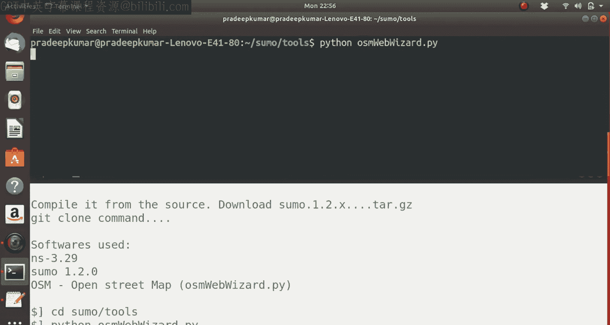

VANET仿真结合了交通流动态和网络通信行为。本节教程将分步指导您如何利用SUMO生成真实的城市交通数据，并将其转换为NS3可用的节点移动性模型，最终在NS3中运行并可视化仿真。

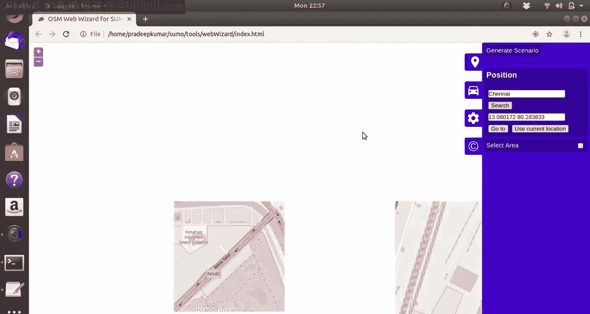

---

## 步骤一：使用SUMO生成交通场景 🗺️

首先，我们需要使用SUMO软件生成一个基础的交通仿真场景。SUMO提供了多种方式创建场景，本教程将使用其内置的Web向导工具，这是一种快速生成交通场景的简便方法。

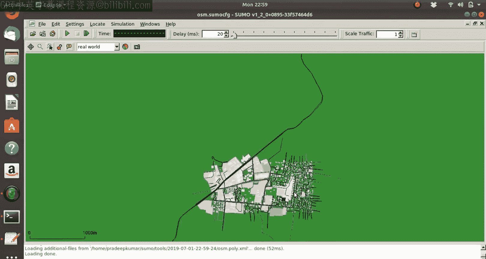

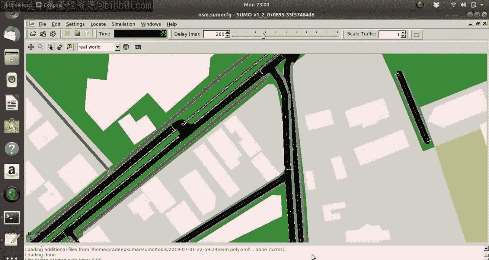

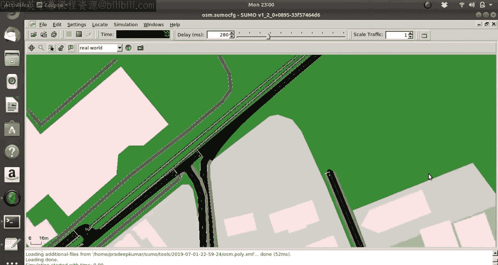

**注意**：请确保您已从源代码编译安装了SUMO（例如1.2.x版本），而不是通过简单的`apt install`命令安装，以便能够使用所有扩展功能。

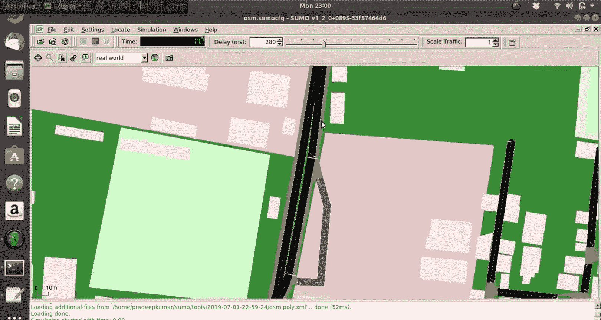

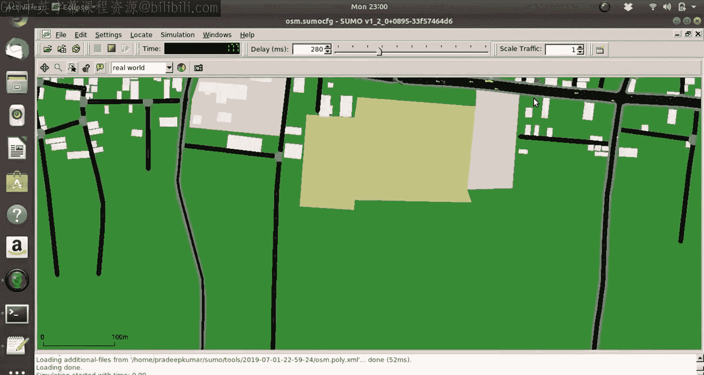

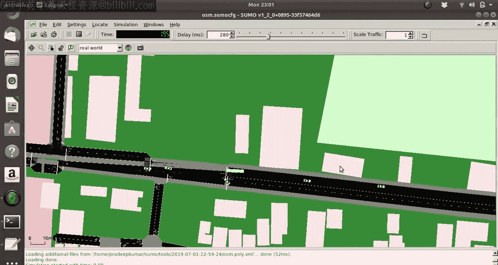

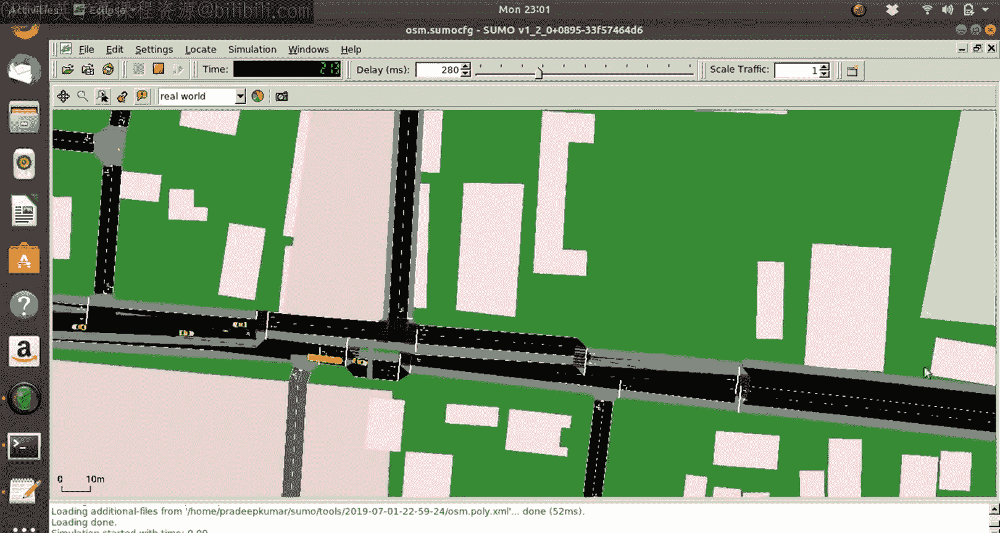

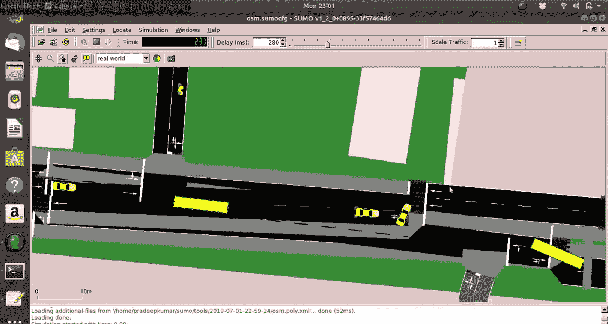

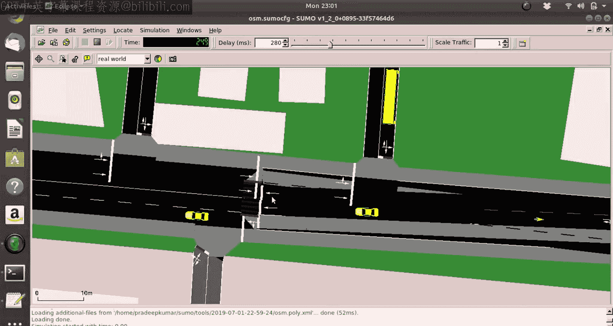

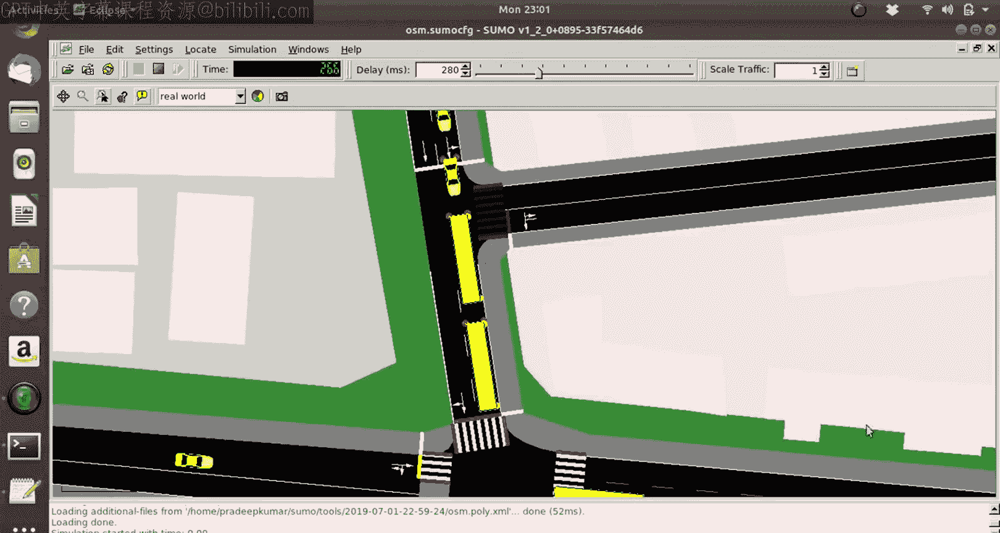

以下是生成场景的具体操作：

1.  进入SUMO的`tools`目录。
2.  运行Web向导Python脚本。
    ```bash
    cd sumo/tools
    python3 sumo-web-wizard.py
    ```
3.  脚本将自动打开浏览器窗口，显示地图界面。
4.  在地图上选择或搜索您想要仿真的区域（例如“Chennai”）。建议选择较小的区域以降低后续处理的复杂度。
5.  在右侧面板中，自定义仿真的车辆类型和数量，例如小汽车、公交车、摩托车等。
6.  点击“Generate Scenario”按钮，SUMO将生成配置文件并自动打开`sumo-gui`可视化界面。
7.  在`sumo-gui`中，您可以调整仿真延迟（如设为30毫秒以更接近实时），然后运行仿真，观察交通流的运行情况。

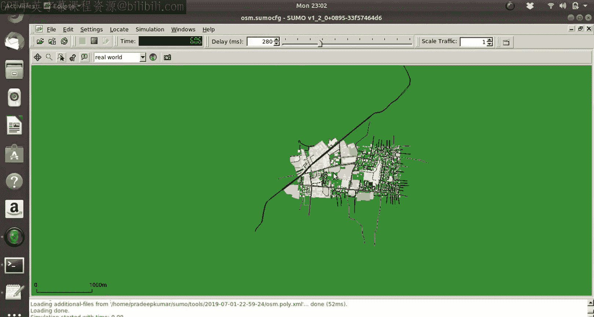

完成此步骤后，SUMO会在特定目录（通常以时间戳命名）下生成一系列配置文件，其中`sumo.cfg`文件对我们至关重要。

---

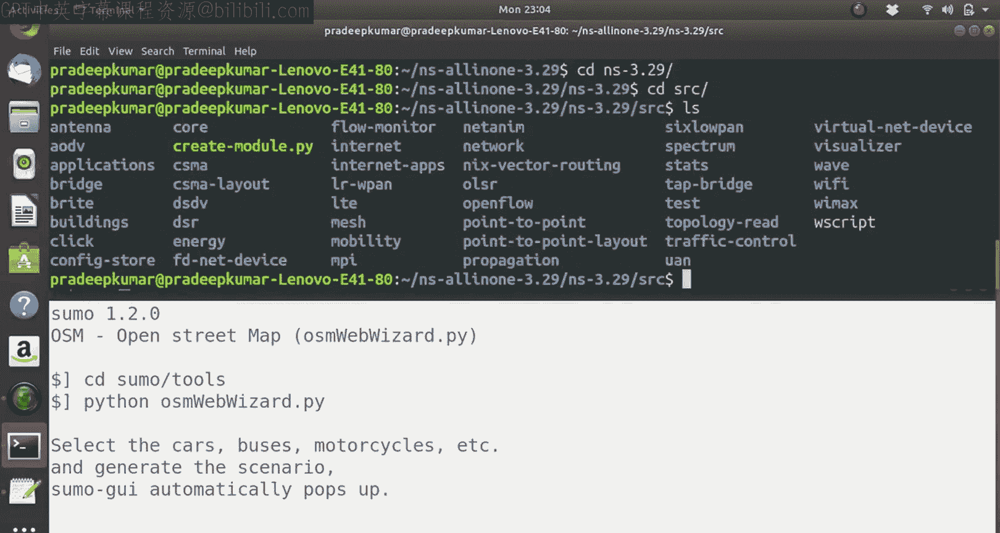

## 步骤二：创建移动性轨迹文件 📁

上一节我们生成了交通场景，本节中我们来看看如何将这些数据转换为NS3能够理解的节点移动轨迹。

我们需要将SUMO的输出转换为两种格式：供NS3读取的移动性跟踪文件，以及供网络动画工具`NetAnim`使用的XML文件。

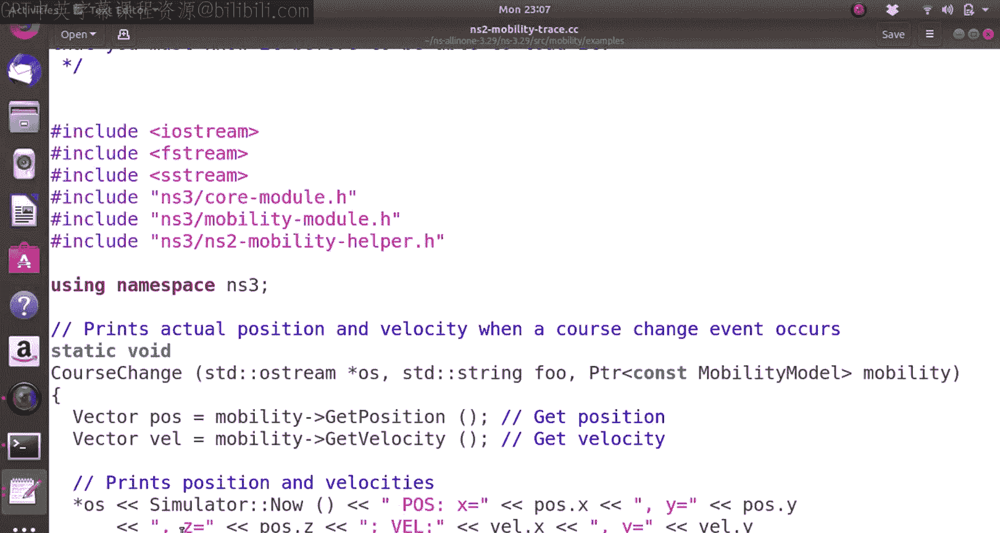

**操作流程如下：**

1.  **生成`trace.xml`文件**：使用`sumo`命令处理上一步生成的`sumo.cfg`配置文件，输出详细的轨迹XML文件。
    ```bash
    sumo -c sumo.cfg --fcd-output trace.xml
    ```
    此命令可能会产生一些警告信息，通常可以忽略。生成的`trace.xml`文件包含了所有车辆在每个时间步的位置信息。

2.  **转换为NS2格式的移动性文件**：SUMO的`tools`目录下提供了`traceExporter.py`工具，可以将`trace.xml`转换为NS3兼容的NS2格式移动性文件。
    ```bash
    cd sumo/tools
    python3 traceExporter.py -i trace.xml --ns2mobility-output=mobility.tcl
    ```
    执行后，将得到`mobility.tcl`文件。您需要打开此文件，查找并记录其中的节点总数（例如`$node_(1813)`表示有1813个节点），这个数字在下一步中需要用到。

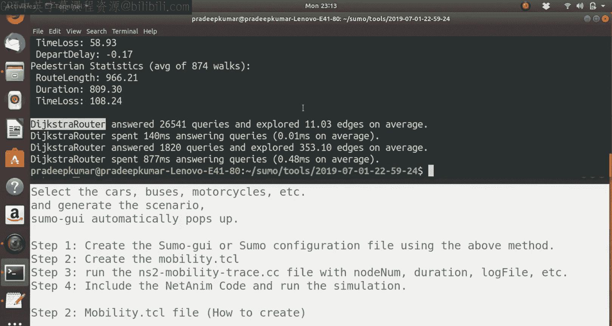

3.  **移动文件**：为了便于NS3访问，建议将生成的`mobility.tcl`文件移动到您的NS3工作目录或Home目录下。

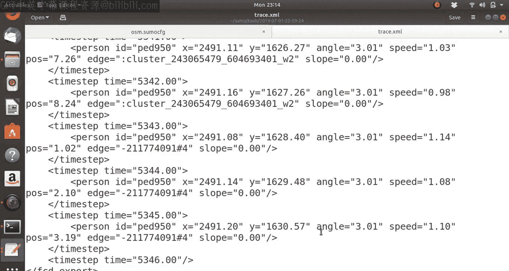

---

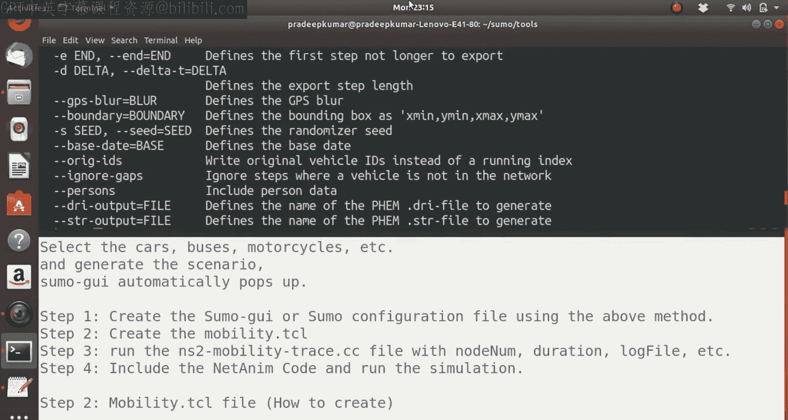

## 步骤三：运行NS2移动性跟踪示例 🏃‍♂️

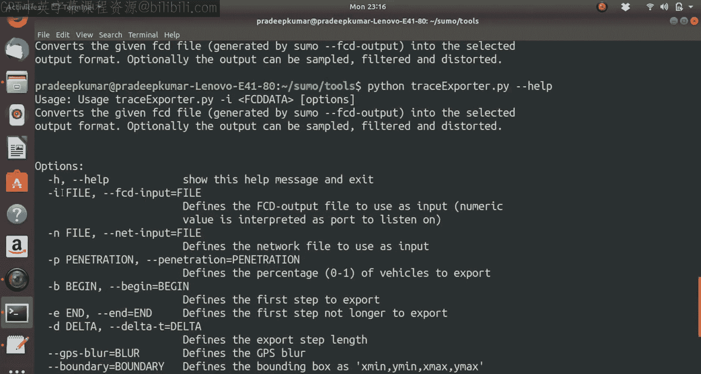

现在，我们已经有了描述车辆移动的轨迹文件。接下来，需要在NS3中运行一个示例程序来加载这些数据，并验证其是否正确。

NS3源码中提供了一个名为`ns2-mobility-trace`的示例程序，位于`src/mobility/examples/`目录下。我们需要将其复制到`scratch`目录并运行。

**具体步骤如下：**

1.  将`ns2-mobility-trace.cc`示例文件复制到NS3的`scratch`目录。
    ```bash
    cp src/mobility/examples/ns2-mobility-trace.cc scratch/
    ```
2.  进入NS3主目录，使用`waf`命令运行该程序。命令格式需要指定轨迹文件路径、节点数量、仿真时长和日志文件名。
    ```bash
    ./waf --run "scratch/ns2-mobility-trace --traceFile=/path/to/mobility.tcl --nodeNum=1813 --duration=100 --logFile=ns2-mob.log"
    ```
    *   `--traceFile`：指定`mobility.tcl`文件的完整路径。
    *   `--nodeNum`：填入第二步中查到的节点总数。
    *   `--duration`：设置仿真时长（秒）。
    *   `--logFile`：指定运行日志的输出文件名。

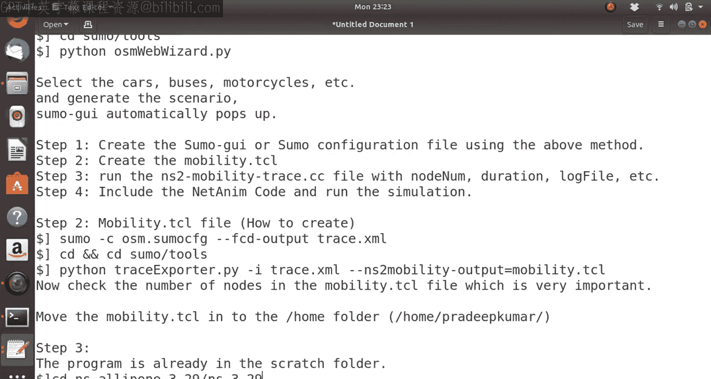

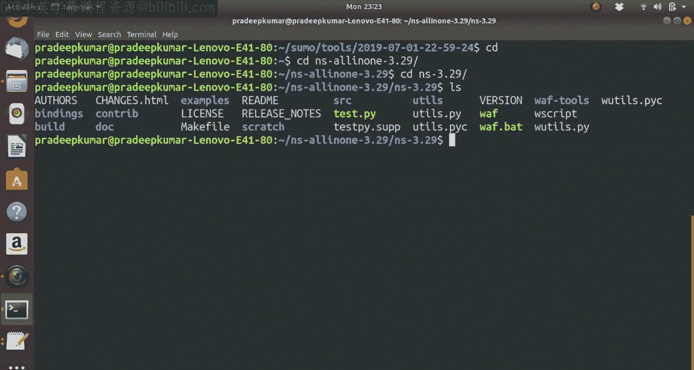

程序运行后，会在终端打印每个节点的位置和速度信息。运行完毕会生成日志文件，表明移动性数据已成功导入NS3。

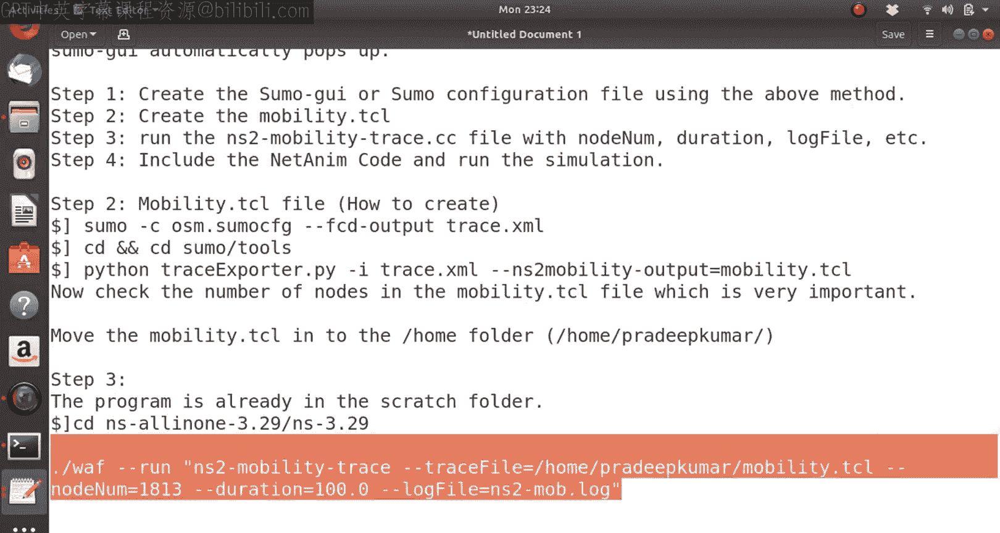

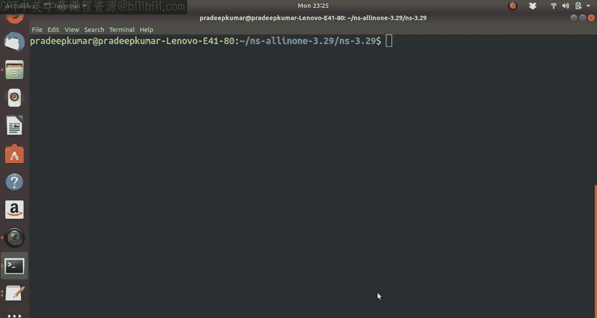

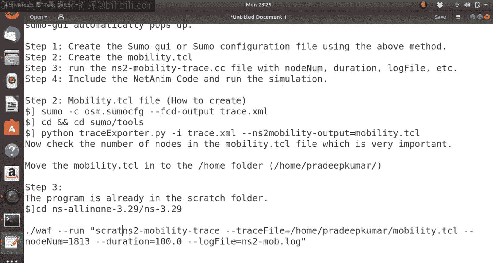

---

## 步骤四：集成网络动画并运行完整仿真 🎬

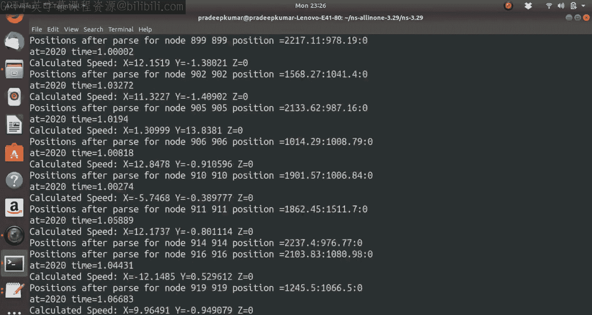

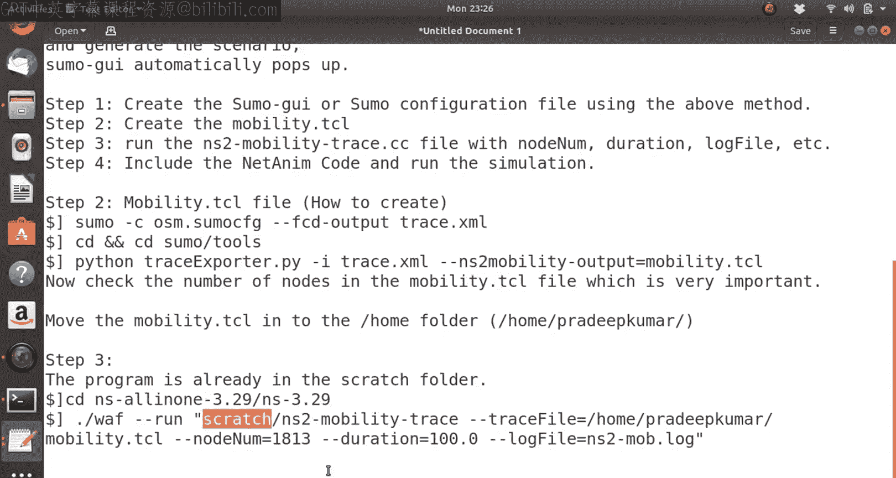

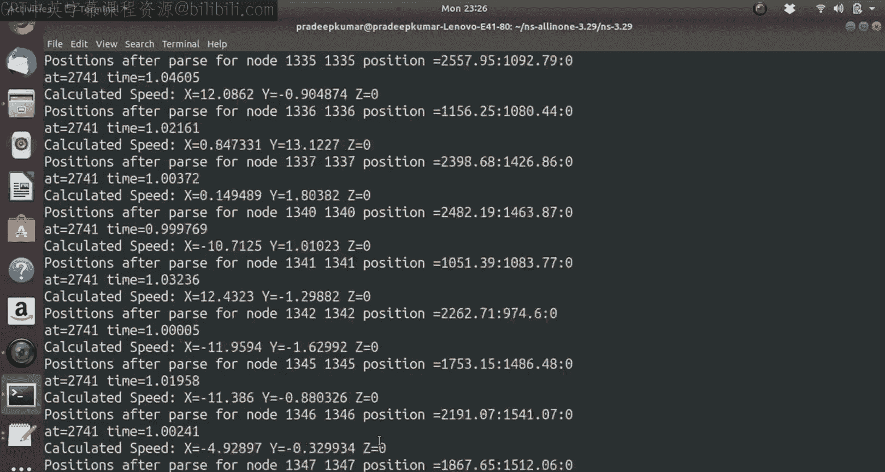

最后一步，我们将修改上一步使用的示例代码，为其添加网络动画支持，从而能够可视化地观察车辆的移动过程。

我们需要在`scratch/ns2-mobility-trace.cc`源代码中添加`NetAnim`相关的代码。

**修改方法如下：**

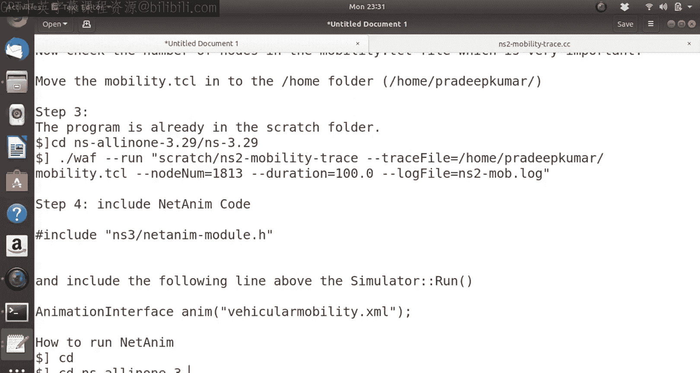

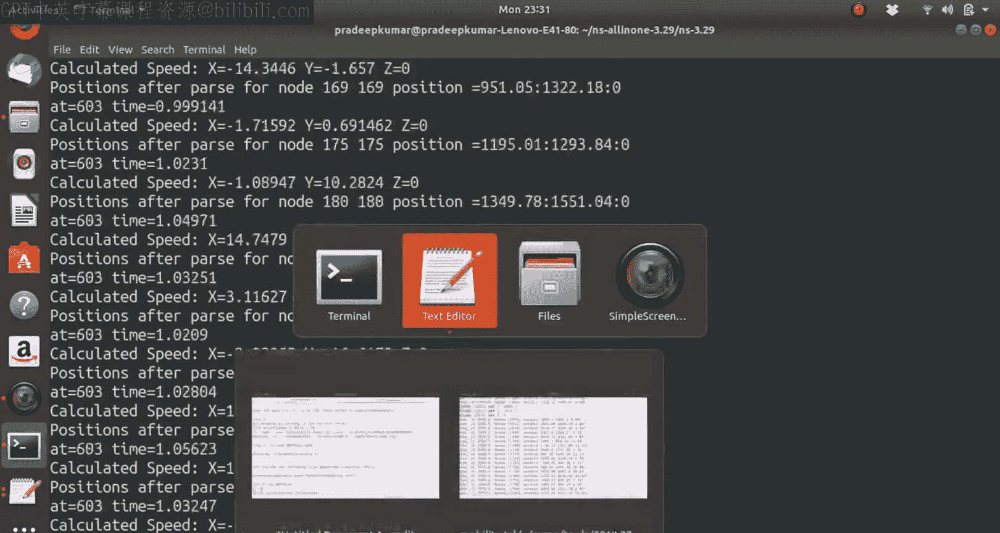

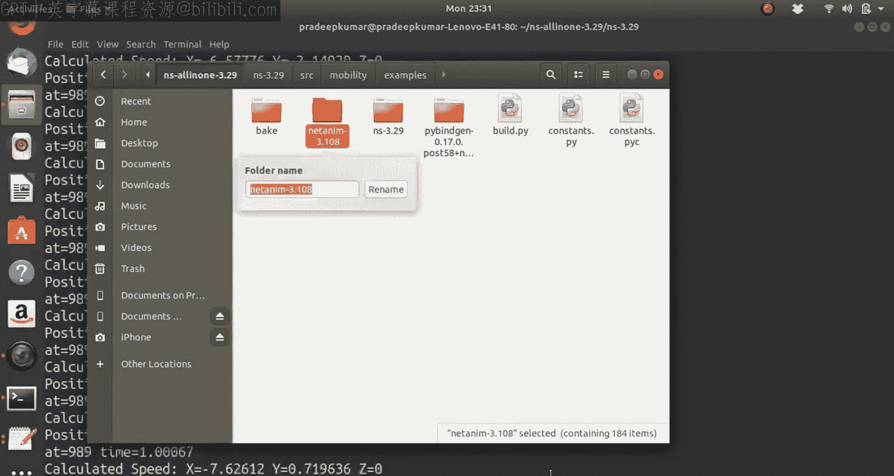

1.  在源代码文件开头添加NetAnim的头文件。
    ```cpp
    #include "ns3/netanim-module.h"
    ```
2.  在主函数`main()`中，在`Simulator::Run();`语句之前，添加以下代码来设置动画接口并指定输出文件。
    ```cpp
    AnimationInterface anim ("vehicular-mobility.xml");
    ```
3.  修改后的代码结构大致如下：
    ```cpp
    // ... 其他头文件 ...
    #include "ns3/netanim-module.h"

    int main (...)
    {
        // ... 原有的节点创建、移动性模型设置等代码 ...

        // 添加NetAnim设置
        AnimationInterface anim ("vehicular-mobility.xml");

        Simulator::Run ();
        Simulator::Destroy ();
        return 0;
    }
    ```
4.  保存文件后，重新使用与步骤三相同的`waf`命令编译运行程序。
    ```bash
    ./waf --run "scratch/ns2-mobility-trace --traceFile=/path/to/mobility.tcl --nodeNum=1813 --duration=100 --logFile=ns2-mob.log"
    ```
    此次运行除了之前的日志，还会生成一个名为`vehicular-mobility.xml`的动画文件。

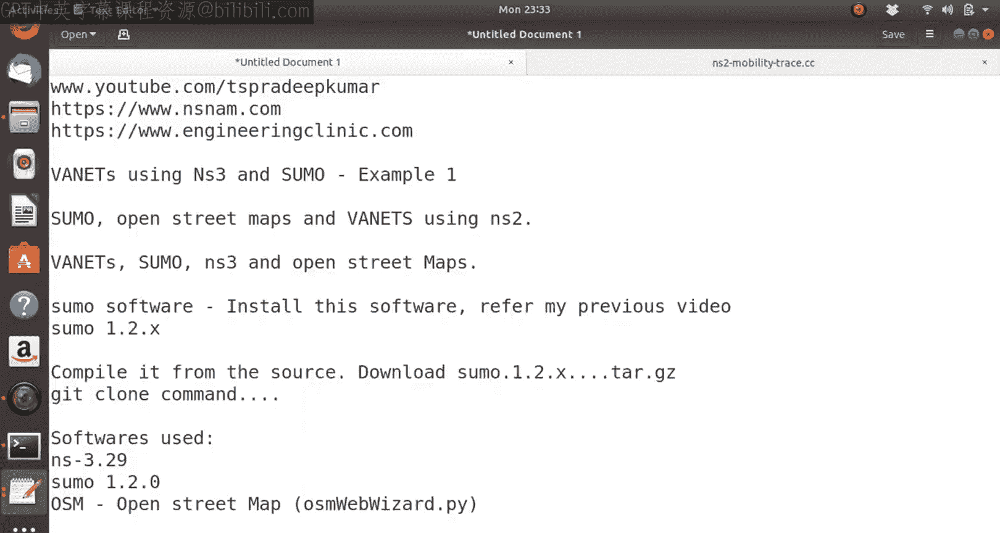

5.  **使用NetAnim查看动画**：
    *   进入NS3的`netanim`目录。
    *   运行NetAnim应用程序。
    *   在NetAnim界面中，通过`File` -> `Open` 选择刚才生成的`vehicular-mobility.xml`文件。
    *   您可以调整节点显示大小，然后播放动画，观察车辆节点的移动情况。

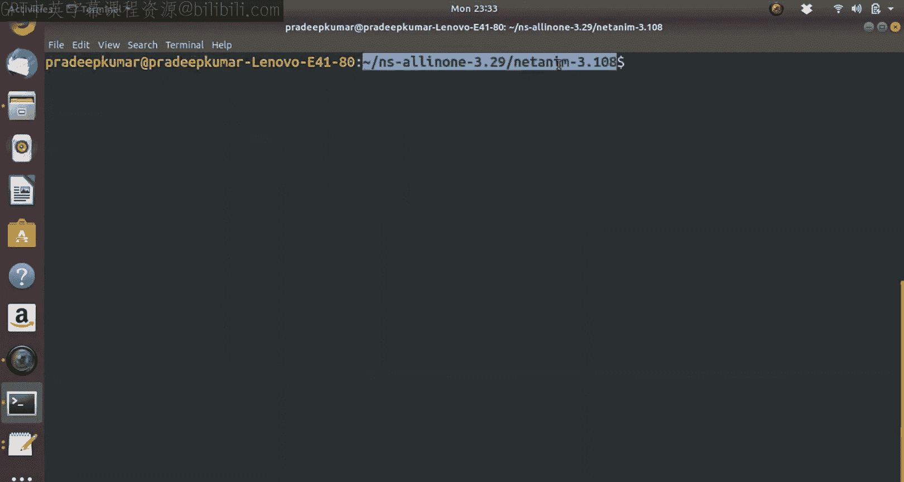

---

## 总结

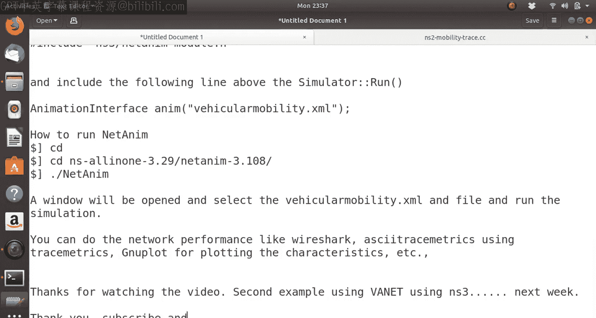

本节课中我们一起学习了使用NS3和SUMO进行VANET仿真的完整工作流程。我们首先利用SUMO的Web向导生成了一个基于真实地图的交通场景，然后通过工具将交通数据转换为NS3可用的移动性轨迹文件。接着，我们运行NS3的示例程序加载该文件，并最终通过集成NetAnim模块，实现了仿真过程的可视化。这个流程为分析VANET环境下的网络协议性能奠定了坚实的基础。您可以在此基础上，进一步集成网络协议栈，使用Wireshark或流量监测矩阵等工具来分析网络性能。