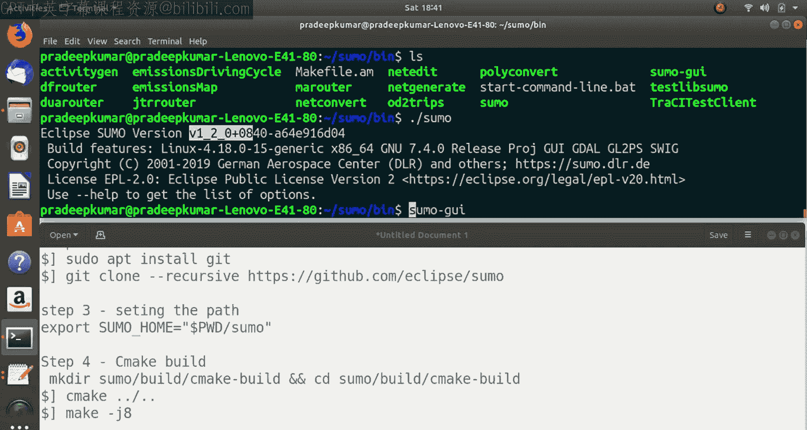
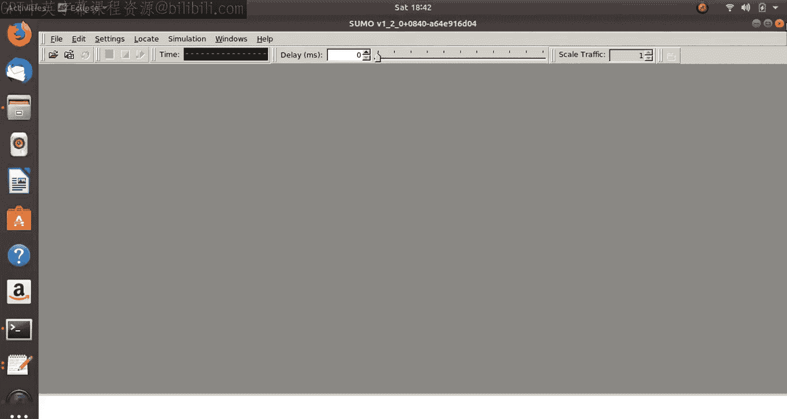
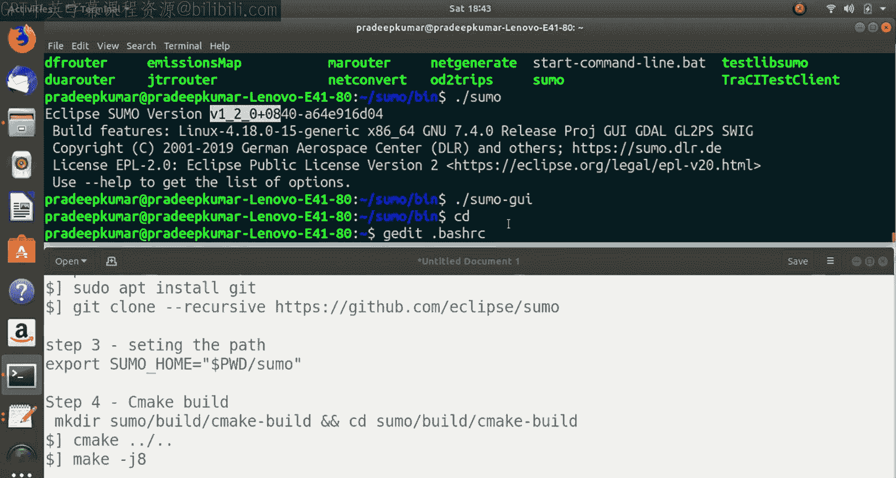
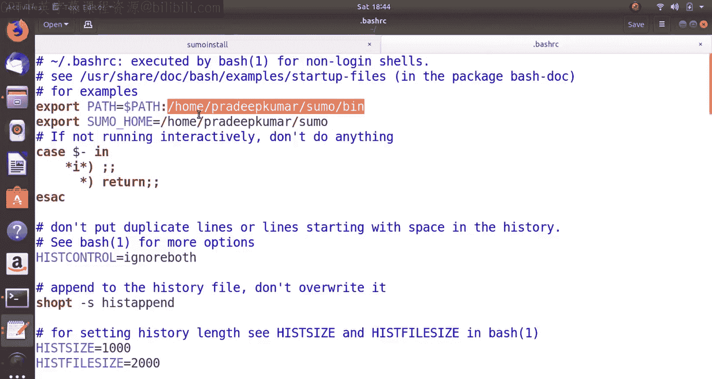
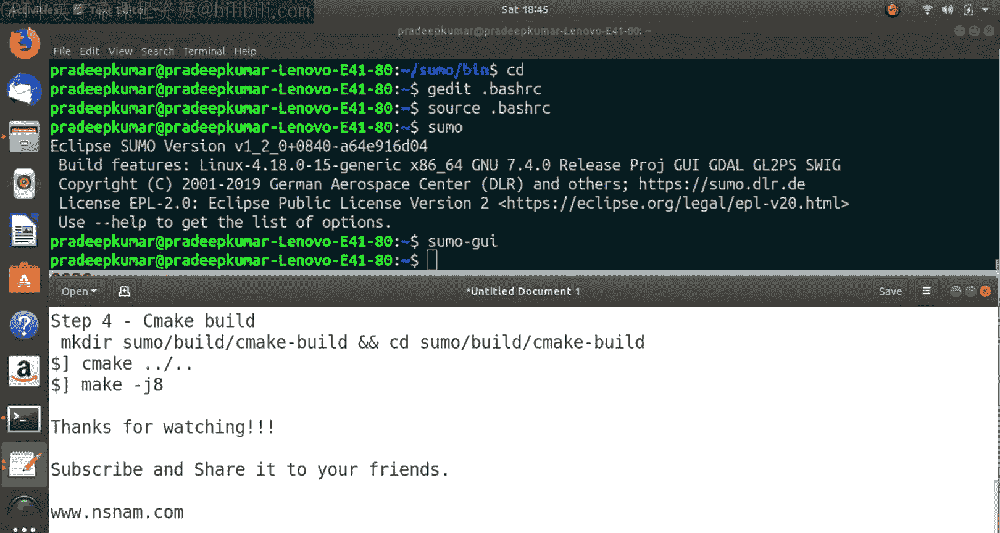

# 16：在Ubuntu中安装SUMO 1.2.0 🚗

## 概述
在本节课中，我们将学习如何在Ubuntu操作系统中安装SUMO（Simulation of Urban Mobility）软件。SUMO是一款用于交通建模、车辆连通性和网络建模的强大工具。我们将重点介绍从源代码编译安装的方法，以便未来能够扩展和使用SUMO的各种软件包。

## 安装步骤总览
安装过程主要分为五个步骤：
1.  安装必要的依赖软件（Prerequisites）。
2.  从GitHub下载SUMO源代码。
3.  设置环境变量路径。
4.  使用CMake进行编译配置。
5.  执行编译和安装。

接下来，我们将详细讲解每一个步骤。

## 第一步：安装依赖软件
首先，我们需要更新系统软件包列表并安装SUMO编译所需的所有依赖项。以下是需要安装的软件包列表：

*   `cmake`
*   `python`
*   `g++`
*   `libxml2-dev`
*   `libfox-1.6-dev`
*   `libgdal-dev`
*   `libproj-dev`
*   `libgl2ps-dev`
*   `swig`

您可以使用以下命令一次性安装它们：
```bash
sudo apt update
sudo apt install cmake python g++ libxml2-dev libfox-1.6-dev libgdal-dev libproj-dev libgl2ps-dev swig
```
此过程大约会下载800MB的数据。安装完成后，我们就可以进行下一步了。

## 第二步：下载SUMO源代码
上一节我们安装了所有必要的依赖项，本节我们将从GitHub获取SUMO的源代码。

在下载之前，请确保您的系统已经安装了`git`工具。如果没有，请先运行：
```bash
sudo apt install git
```
安装好git后，使用以下命令克隆SUMO的仓库。`--recursive`参数确保所有子模块和文件都会被完整下载。
```bash
git clone --recursive https://github.com/eclipse/sumo
```
命令执行后，会在当前目录下创建一个名为`sumo`的文件夹，其中包含了SUMO的全部源代码、工具（`tools`）和数据（`data`）目录，这些在后续使用中非常重要。

## 第三步：设置环境变量
源代码下载完成后，我们需要设置一个重要的环境变量`SUMO_HOME`，它指向SUMO的根目录，许多SUMO工具在运行时需要这个变量。

设置方法如下，请确保您在包含`sumo`文件夹的目录下执行：
```bash
export SUMO_HOME="$PWD/sumo"
```
这条命令将当前目录下的`sumo`文件夹路径赋值给`SUMO_HOME`变量。

## 第四步：配置编译环境
设置好路径后，我们需要为编译创建一个独立的构建目录，并使用CMake生成编译配置文件。

进入SUMO源代码目录，并创建一个`build`文件夹：
```bash
cd sumo
mkdir build
cd build
```
然后，运行CMake命令来配置项目。`..`表示配置文件位于上一级目录（即`sumo`根目录）。
```bash
cmake ..
```
如果所有依赖项都已正确安装，此命令应能顺利完成，不会报错。这为下一步的实际编译做好了准备。

## 第五步：编译与安装
配置成功后，就可以开始编译SUMO了。我们使用`make`命令进行编译。



为了加快编译速度，可以利用多核处理器。`-j`参数后的数字表示并行编译的任务数，通常设置为处理器核心数的2倍。例如，对于4核机器，可以使用：
```bash
make -j8
```
如果您不确定，也可以直接使用`make`命令，但编译时间会更长。

编译过程需要一些时间。完成后，您会在`build/bin`目录下看到生成的可执行文件，如`sumo`和`sumo-gui`。





## 验证安装与设置永久路径
编译安装完成后，让我们来验证一下。进入二进制文件目录并运行SUMO查看版本：
```bash
cd bin
./sumo --version
```
您应该能看到类似`SUMO 1.2.0`的版本信息。同样，可以检查`sumo-gui`。

目前，我们只能在`bin`目录下通过`./sumo`运行。为了方便在任何地方都能使用`sumo`命令，需要将其路径添加到系统的`PATH`环境变量中。



编辑用户主目录下的shell配置文件（例如`~/.bashrc`）：
```bash
nano ~/.bashrc
```
在文件末尾添加以下两行，请将`/home/yourusername/sumo`替换为您实际的SUMO源代码绝对路径：
```bash
export PATH="$PATH:/home/yourusername/sumo/build/bin"
export SUMO_HOME="/home/yourusername/sumo"
```
保存文件后，运行以下命令使配置立即生效：
```bash
source ~/.bashrc
```
现在，您可以在终端任何位置直接输入`sumo`或`sumo-gui`来启动软件了。即使重启计算机，这个设置也会自动加载。

## 总结
本节课中，我们一起学习了在Ubuntu系统中从源代码编译安装SUMO 1.2.0的完整流程。我们首先安装了所有必要的依赖包，然后从GitHub克隆了源代码，接着设置了`SUMO_HOME`环境变量，并通过CMake和Make工具完成了编译。最后，我们将SUMO的可执行文件路径添加到系统`PATH`中，实现了全局调用。



SUMO是一款功能强大的交通模拟软件，广泛用于城市交通建模、公共交通调度等领域。在接下来的课程中，我们将探索如何将SUMO生成的交通数据（如车辆、行人轨迹）导入到NS3网络模拟器中，从而研究车联网等场景下的网络性能。