# 21：NS3入门介绍 🚀

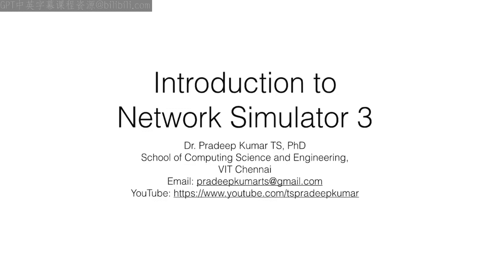

在本节课中，我们将学习网络模拟器3（NS3）的基本概念、核心抽象模型以及其工具集。我们将了解NS3是什么，它如何工作，以及如何利用它进行网络研究和教育。

---

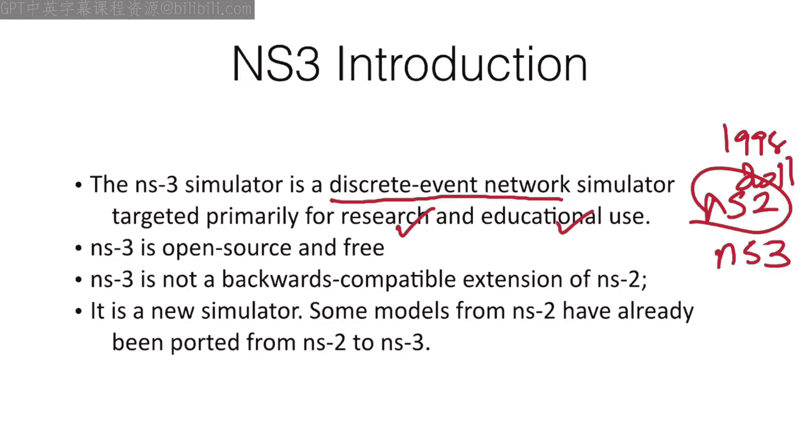

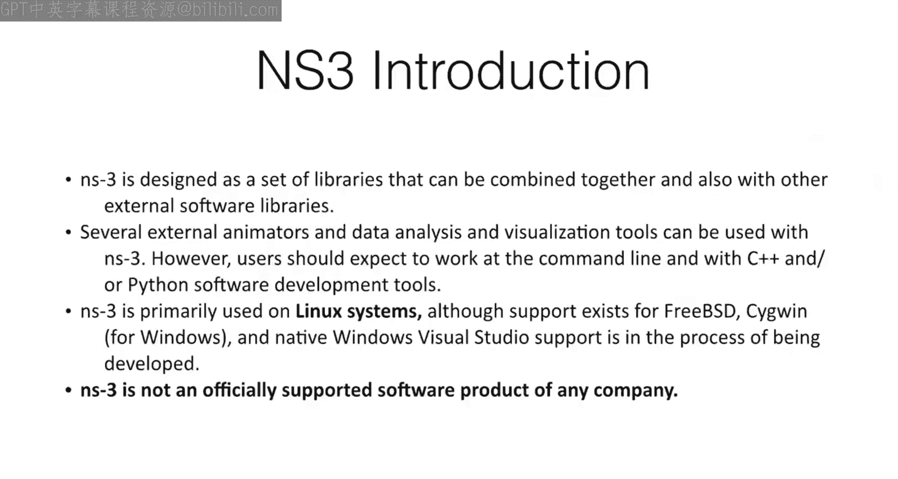

## 概述

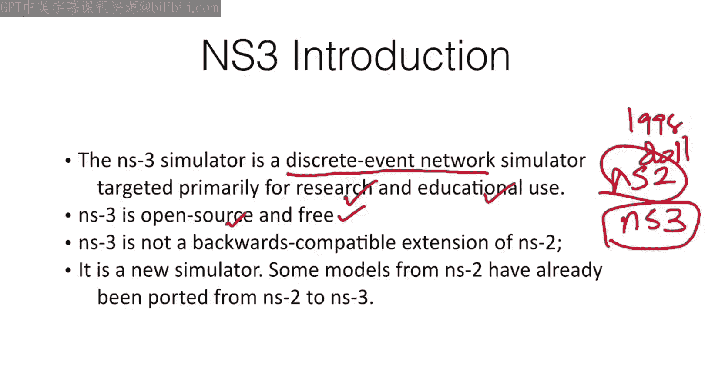

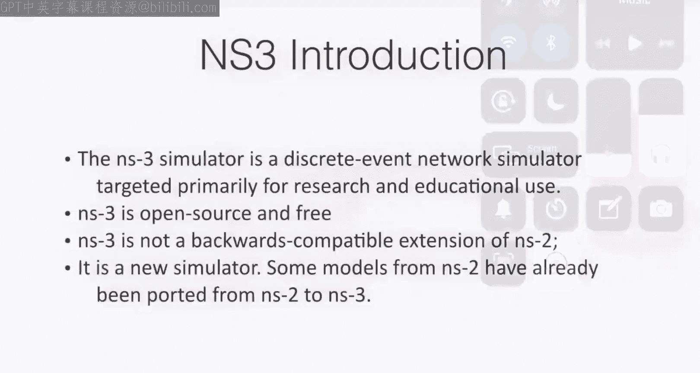

NS3是一个主要用于研究和教育目的的开源离散事件网络模拟器。它允许用户在部署真实网络设备前，通过模拟来测试和验证网络设计。与早期版本NS2不同，NS3是一个全新的模拟器，虽然部分模型从NS2移植而来，但它并非NS2的向后兼容版本。

---

## NS3简介

NS3是一个**离散事件模拟器**。这意味着模拟过程由一系列离散的事件驱动，每个事件在特定的模拟时间点发生。这种模拟方式高效且精确。

NS3的设计目标是成为一套可组合的库，能够与其他外部软件库协同工作。它不是一个独立的软件，而是可以与多种第三方工具（如动画器和数据分析工具）集成。然而，使用NS3需要熟悉命令行操作，并具备C++或Python的软件开发基础。

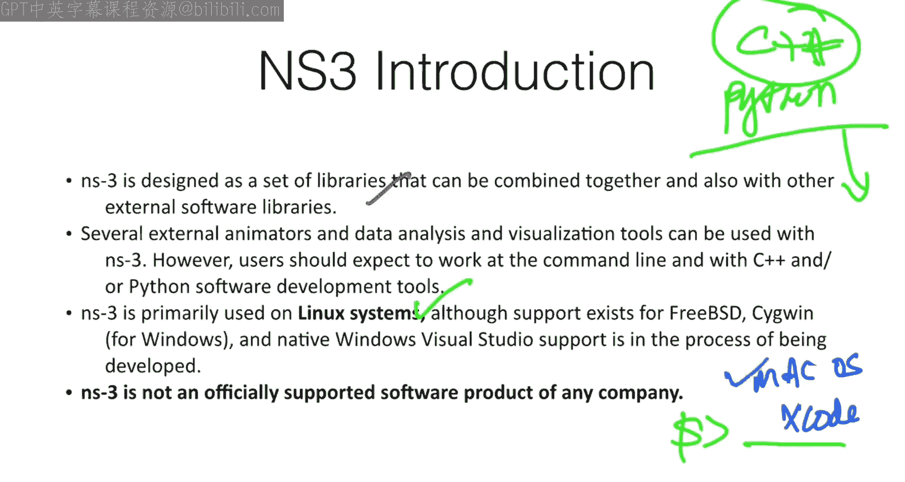

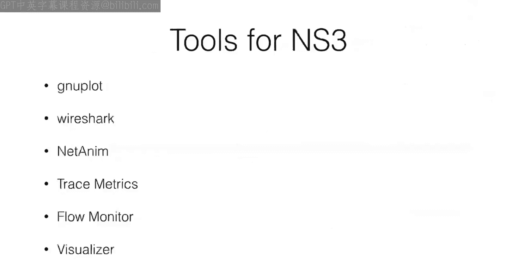

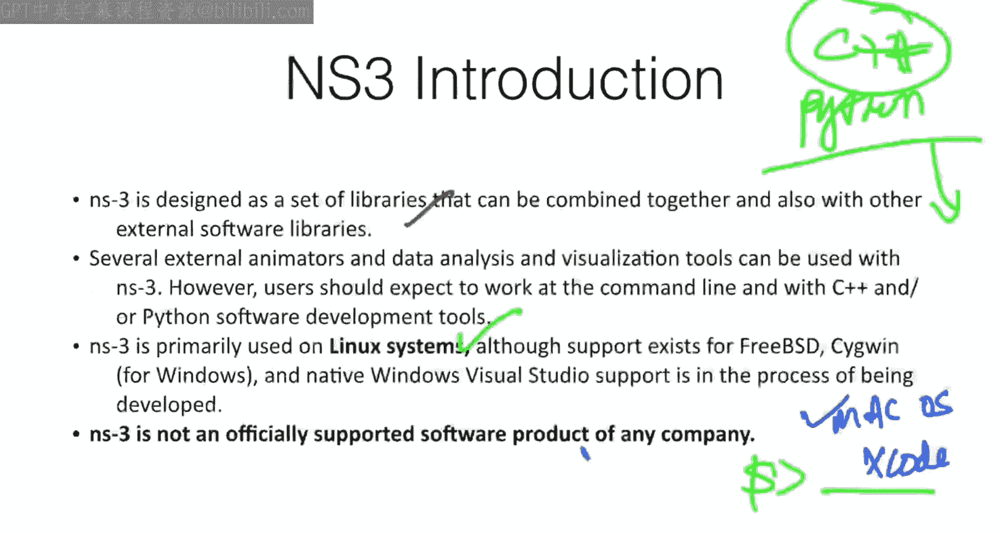

> **注意**：NS3主要在Linux系统上运行。虽然可以在macOS上配置（需要安装Xcode），但目前对Windows的官方支持仍在开发中，因此建议使用Linux系统以获得最佳体验。

---

## NS3工具集 🛠️

以下是本课程中将学习使用的一些核心工具：

*   **Gnuplot**：用于绘制网络性能特征图。
*   **Wireshark**：用于捕获和分析网络数据包。
*   **NetAnim**：网络动画工具，用于可视化模拟过程。
*   **Trace Metrics**：用于处理NS3的ASCII跟踪文件。
*   **Flow Monitor**：一个强大的工具，用于监控数据流，统计丢包率、传输速率、接收速率等。
*   **PyViz**：另一个实时网络动画可视化工具。

此外，我们还会学习其他软件，如`escapes`、`gcc`等。

---

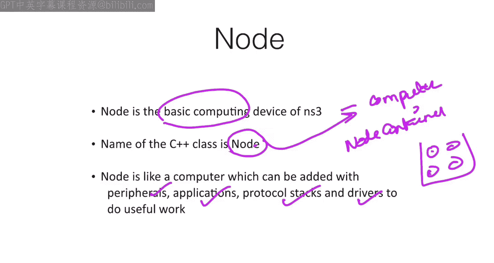

## NS3的核心抽象模型 🧱

NS3通过提供完整的源代码，让用户能够深入理解、修改甚至从头开发网络协议。其整个库围绕五个核心抽象类构建：

### 1. 节点 (Node)

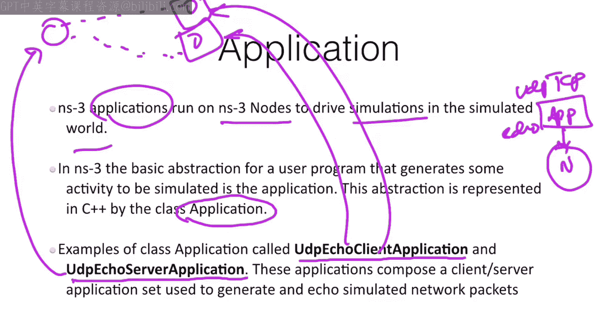

节点是NS3中的基本计算设备，可以将其理解为一台计算机。

*   **C++类名**：`Node`
*   **功能**：节点可以像真实计算机一样，安装外围设备、应用程序、协议栈和驱动程序。
*   **容器类**：`NodeContainer`，用于管理多个节点。

### 2. 应用程序 (Application)

应用程序运行在NS3节点上，用于驱动模拟世界中的网络行为。

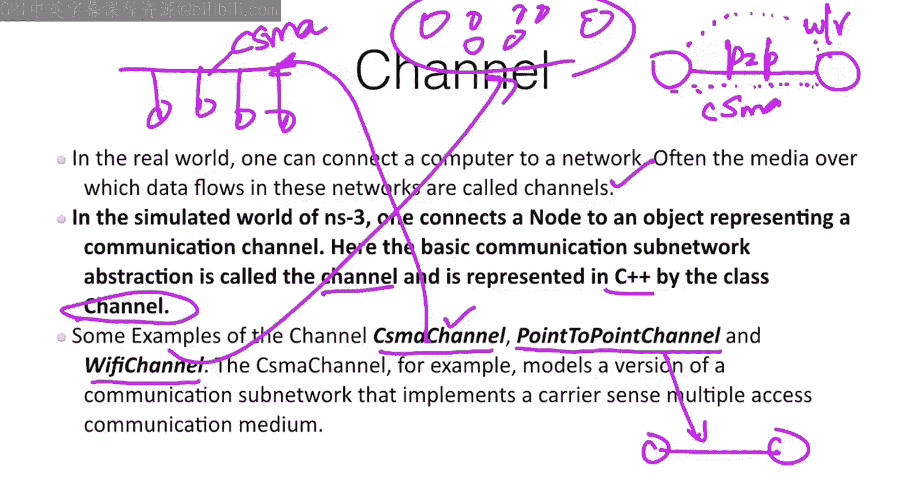

*   **C++类名**：`Application`
*   **示例**：
    *   `UdpEchoClientApplication` (UDP回声客户端应用)
    *   `UdpEchoServerApplication` (UDP回声服务器应用)
*   **作用**：例如，一个节点运行回声服务器，另一个节点运行回声客户端，两者之间可以模拟网络通信。

### 3. 信道 (Channel)

信道代表了节点之间的通信媒介或路径。

*   **C++类名**：`Channel`
*   **类型**：
    *   **点对点信道 (PointToPointChannel)**：直接连接两个节点。
    *   **CSMA信道 (CsmaChannel)**：模拟基于总线（如以太网）的多节点共享信道。
    *   **Wi-Fi信道 (WifiChannel)**：模拟无线通信媒介。
*   **作用**：定义了数据在节点之间传输的物理或逻辑媒介。

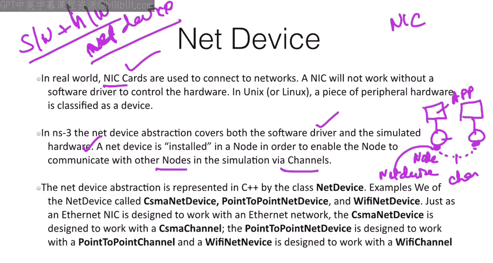

### 4. 网络设备 (NetDevice)

网络设备是软件驱动和模拟硬件的结合体，相当于计算机中的网卡（硬件）及其驱动程序（软件）。

*   **C++类名**：`NetDevice`
*   **功能**：网络设备安装在节点上，使节点能够通过信道与其他节点通信。它是节点与信道之间的接口。

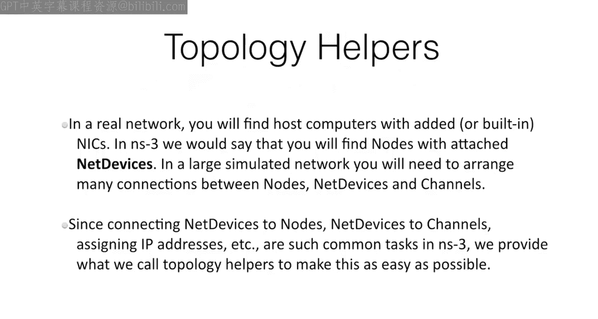

### 5. 拓扑助手 (Topology Helpers)

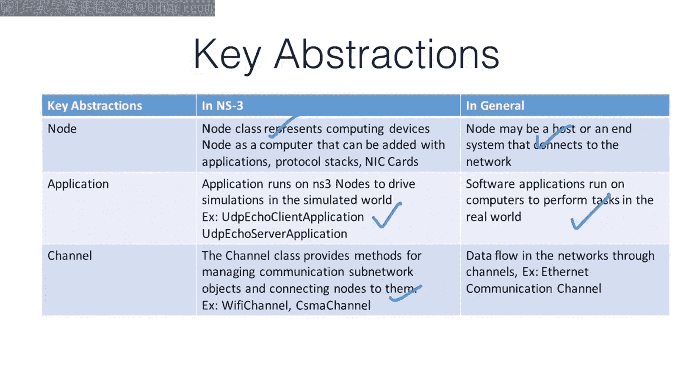

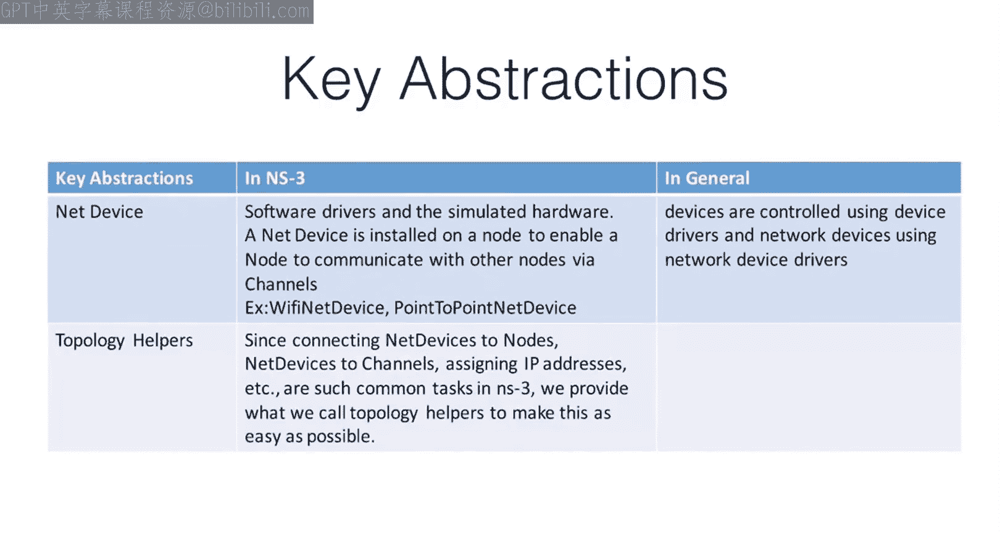

在大型模拟网络中，手动配置众多节点、设备和信道之间的连接非常繁琐。拓扑助手类提供了便捷的方法来快速构建复杂的网络拓扑。

*   **作用**：帮助用户自动化和简化网络拓扑的创建过程，例如决定数据包从源节点到目的节点的最佳或备用路径。

---

## NS3模型与构建系统

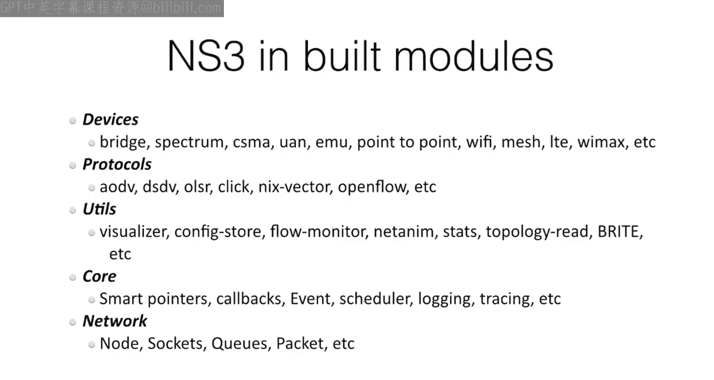

NS3内置了大量现成的网络模型，用户无需从头实现即可直接使用。

*   **设备模型**：网桥、路由器、频谱设备等。
*   **协议模型**：AODV、DSDV、OLSR等路由协议，以及OpenFlow等。
*   **支持工具**：核心模块支持回调、事件调度、日志记录等。

### 如何构建NS3应用

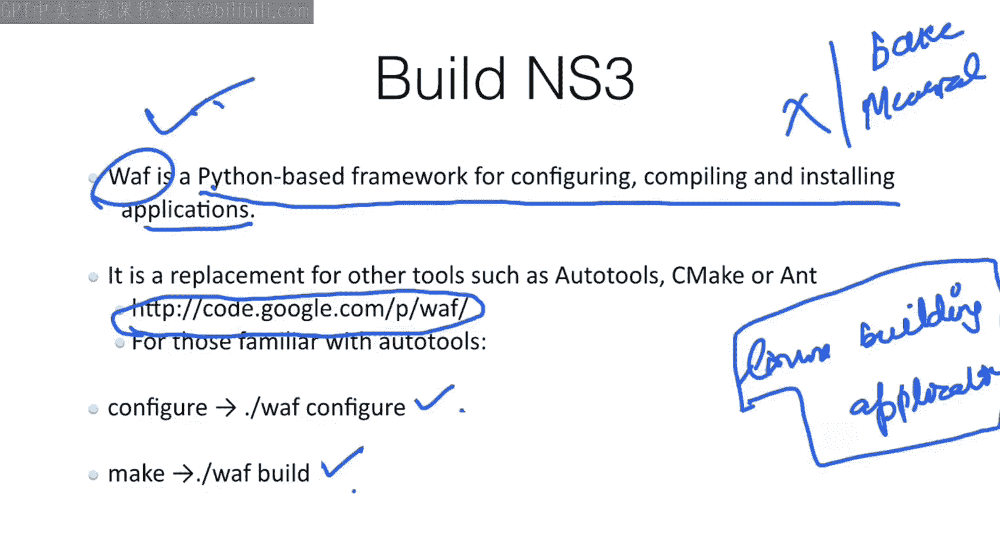

NS3使用一个名为`waf`的Python构建框架。

1.  **配置**：在NS3根目录下运行 `./waf configure`，检查并配置编译环境。
2.  **编译**：运行 `./waf build` 来编译整个NS3系统或特定的模块。
3.  **运行示例**：编译成功后，可以运行示例程序，例如 `./waf --run hello-simulator`。

典型的开发流程是在Linux环境下，进入NS3的工作目录（例如 `~/ns-allinone-3.27/ns-3.27`），使用上述`waf`命令进行操作。

---

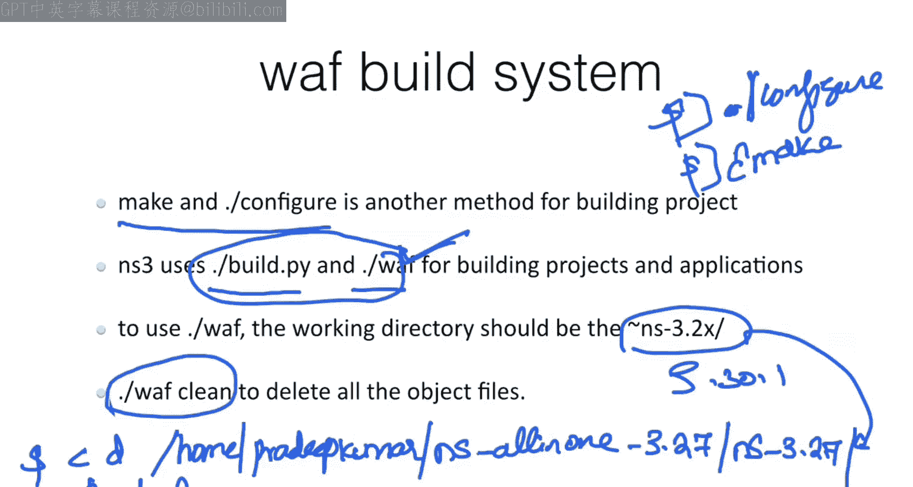

## 总结

本节课我们一起学习了网络模拟器3（NS3）的基础知识。我们了解到NS3是一个开源的离散事件模拟器，其核心是五个抽象概念：**节点**、**应用程序**、**信道**、**网络设备**和**拓扑助手**。这些抽象帮助我们以编程方式构建和模拟复杂的网络。同时，我们还简要介绍了NS3丰富的工具集和基于`waf`的构建系统。

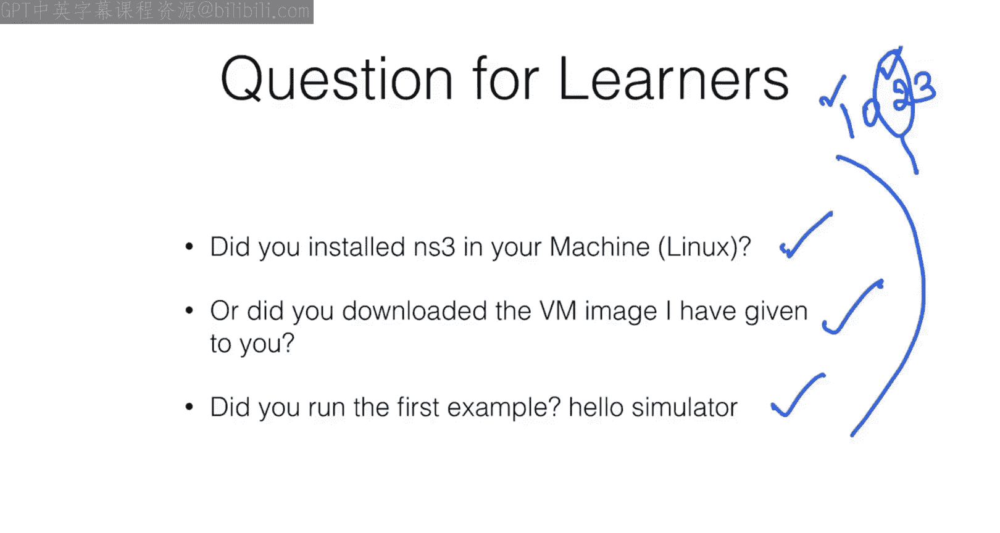

建议学习者动手安装NS3（或使用提供的虚拟机镜像），并尝试运行第一个示例，为后续的实践操作打下基础。在接下来的课程中，我们将通过具体示例深入NS3的模拟世界。