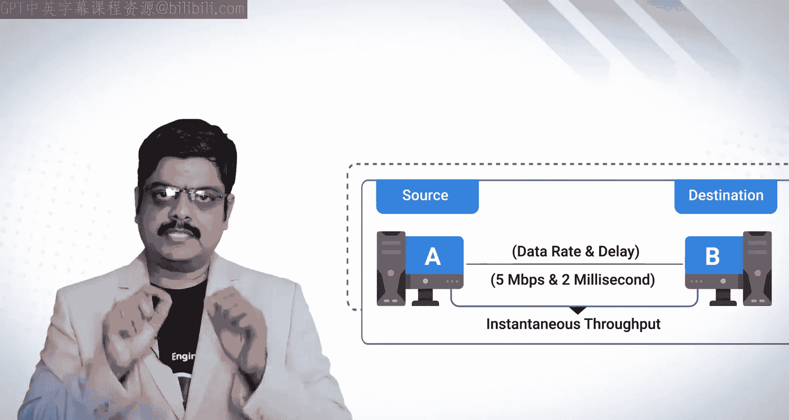
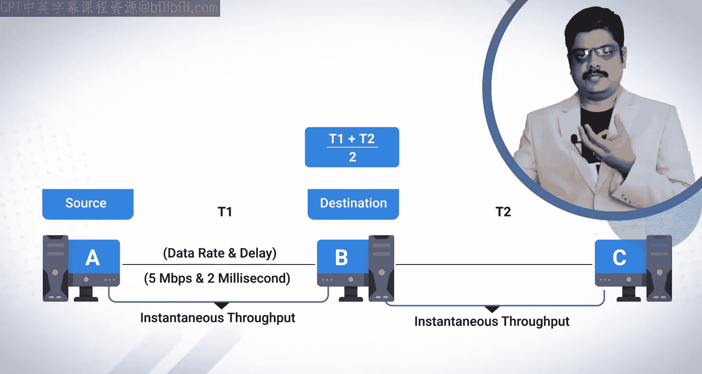
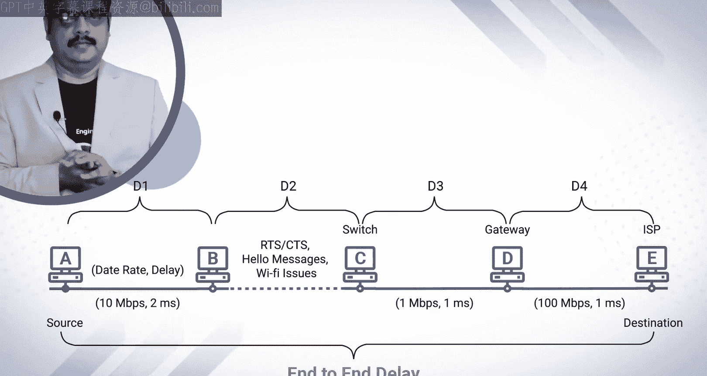
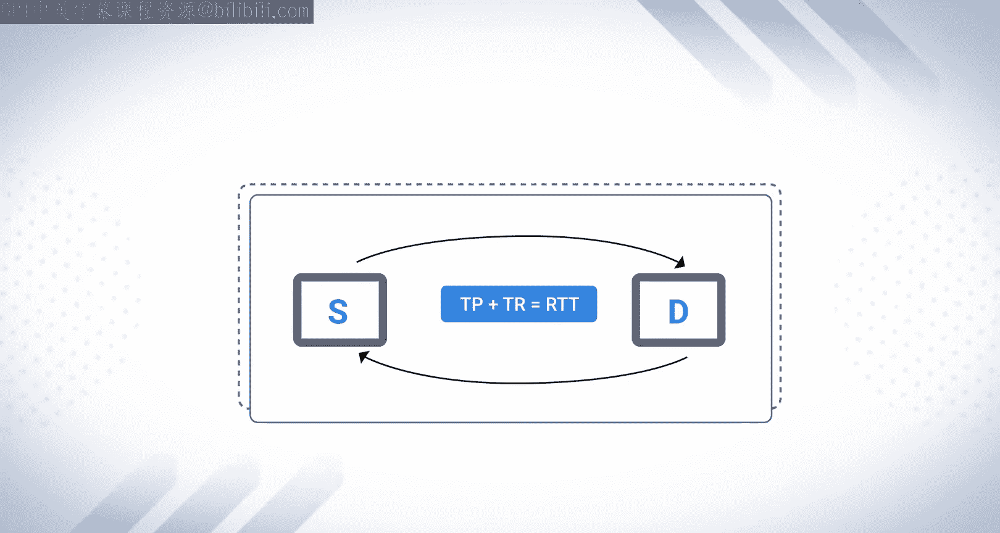
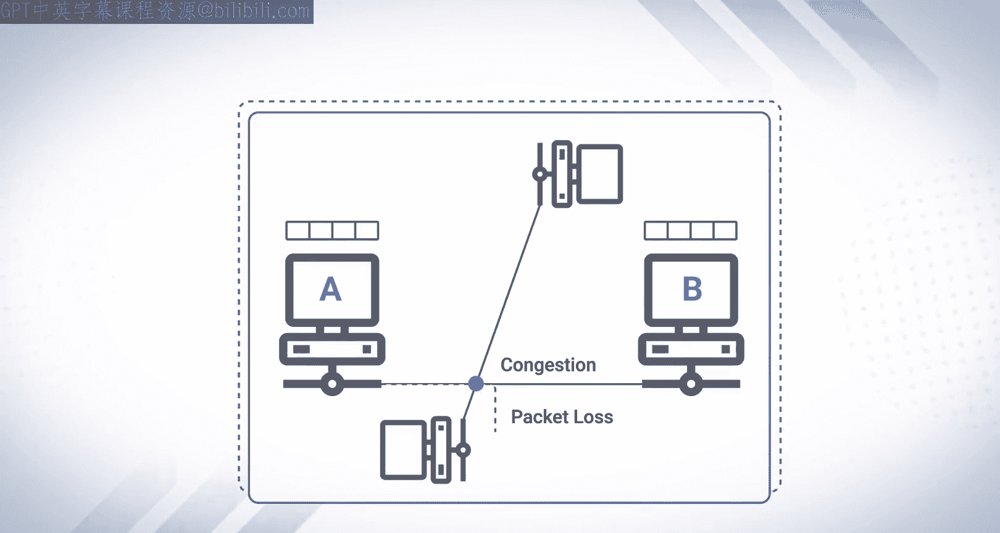
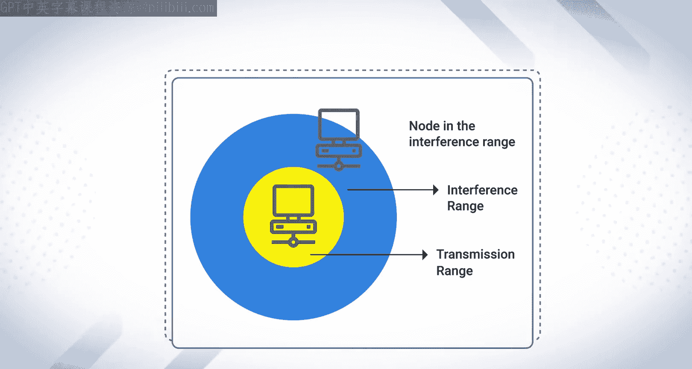
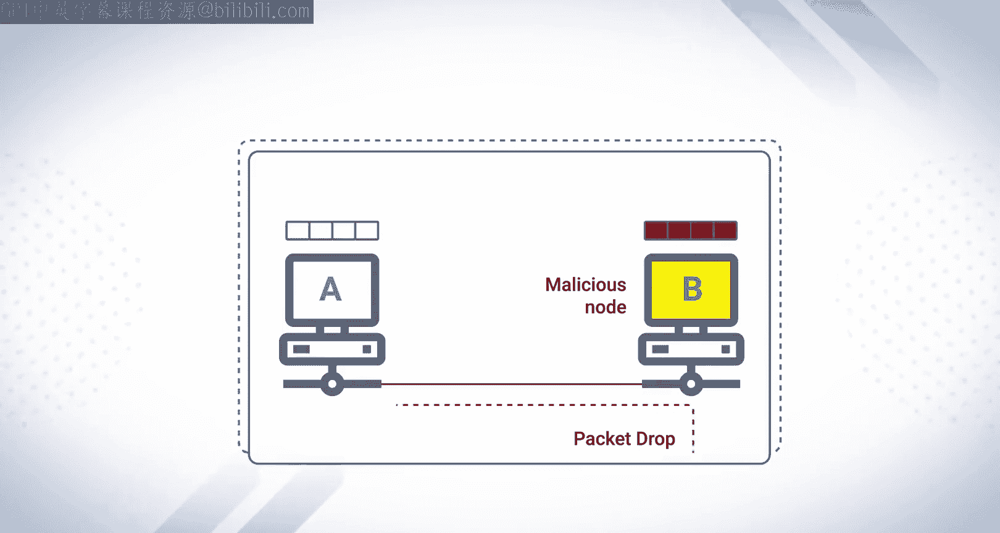

# 31：网络性能指标

在本节课中，我们将学习网络性能评估中常用的核心指标。这些指标对于理解和优化有线及无线网络的性能至关重要。

## 概述

网络性能指标是衡量网络通信质量与效率的关键参数。无论是对于有线网络还是无线网络，理解这些指标都有助于我们诊断问题、优化配置。本节课程将详细介绍吞吐量、延迟、丢包率、抖动等核心概念。

---

## 吞吐量 📈

吞吐量是衡量网络性能的基础指标。它指的是在单位时间内，从一个网络节点成功传输到另一个网络节点的数据量。

吞吐量通常以**比特每秒**或**字节每秒**为单位。小写字母 `b` 代表比特，大写字母 `B` 代表字节。例如，`Mbps` 表示兆比特每秒，`MBps` 表示兆字节每秒。

**公式**：`吞吐量 = 传输的数据量 / 时间`

### 吞吐量与有效吞吐量

与吞吐量相关的一个概念是**有效吞吐量**。两者的区别在于：
*   **吞吐量**：衡量的是通过网络链路传输的所有数据总量，无论其是否有用。
*   **有效吞吐量**：特指在应用层，成功传输到目的地的**有用信息**的数据量。

有效吞吐量通常只在应用层进行测量，而吞吐量可以在网络层、传输层等各个层面进行测量。

### 瞬时吞吐量与平均吞吐量

为了理解吞吐量的计算，我们来看一个例子。

假设节点A和节点B通过一条有线链路连接。该链路的**数据速率**为 5 Mbps，**延迟**为 2 毫秒。这意味着网络可以在 2 毫秒内将 5 Mb 的数据从 A 点传输到 B 点。基于这些值，我们可以计算出从源节点到目的节点传输数据包的速度，这被称为**瞬时吞吐量**。

现在，考虑一个更复杂的场景：节点A连接到节点B，节点B再连接到节点C。A到B的瞬时吞吐量为 `T1`，B到C的瞬时吞吐量为 `T2`。那么，从A到C的**平均吞吐量**可以通过计算 `T1` 和 `T2` 的平均值来获得。

**公式**：`平均吞吐量 = (T1 + T2) / 链路数量`

吞吐量是一个强大的性能指标。网络中的高延迟、大量数据包拥塞以及缺乏拥塞控制机制，都会显著影响吞吐量。

---

## 端到端延迟 ⏱️

上一节我们介绍了吞吐量，本节我们来看看另一个关键指标：延迟。延迟，特别是**端到端延迟**，是指数据包从源节点传输到目的节点所花费的总时间。

端到端延迟是路径上所有链路和中间节点产生的延迟之和。延迟主要分为两种类型：

1.  **传输延迟**：在特定链路上发送一个数据包所需的时间。如果以速率 `R`（比特/秒）发送 `B` 比特的数据，则传输延迟为 `B / R`。
    **公式**：`传输延迟 = 数据包大小 / 链路带宽`

2.  **传播延迟**：信号在物理介质中传播所花费的时间。它取决于链路的长度和信号在介质中的传播速度（例如，光在光纤中的速度）。

### 延迟计算示例

让我们通过一个例子来计算端到端延迟。考虑一个从源节点 `S` 到目的节点 `D` 的网络路径，中间经过节点 A、B、C。

*   S -> A：有线链路，带宽 10 Mbps，延迟 2 ms
*   A -> B：无线链路（延迟可变，此处假设为特定值）
*   B -> C：有线链路，带宽 10 Mbps，延迟 1 ms
*   C -> D：有线链路，带宽 100 Mbps，延迟 1 ms

假设我们测量或估算出每段链路的延迟分别为 `D1`、`D2`、`D3`、`D4`。那么，从 S 到 D 的端到端延迟就是这些延迟值的总和。

**公式**：`端到端延迟 = D1 + D2 + D3 + D4`

---

## 响应时间/网络延迟 🔄

响应时间，也称为**网络延迟**，在技术上是指系统对给定输入做出反应所需的时间。在网络中，它衡量的是数据到达其目的地所需的时间。

网络延迟通常以**往返时间** 来衡量。RTT 是指信息从源到达目的地，然后再返回源所需的总时间。这类似于使用 `ping` 命令测试网站时得到的时间。

**公式**：`RTT = 数据包前往目的地的耗时 + 数据包返回源地的耗时`

较低的 RTT 值意味着更好的网络响应速度和更快的互联网连接。高延迟是影响吞吐量的主要因素之一，通常由链路拥塞引起。

---

## 数据包丢失与丢弃 📦

接下来，我们探讨数据包丢失和丢弃这两个相关但略有不同的概念。

*   **数据包丢失**：指在网络中传输的数据包未能到达目的地。丢失可能发生在路径的任何地方。
*   **数据包丢弃**：通常发生在网络节点（如路由器）的接口处。当接口的缓冲区已满，无法容纳新到达的数据包时，该数据包就会被丢弃。

数据包丢失可能由多种原因造成，例如链路拥塞或无线网络中的无线电干扰。数据包丢弃则通常是由于接收节点的缓冲区溢出，或者节点出于安全策略等原因主动拒绝数据包。

---

## 数据包投递率 📊

数据包投递率是衡量网络可靠性的重要指标。它是目的节点成功接收的数据包数量与源节点发送的数据包总数之比。

**公式**：`PDR = (成功接收的数据包数 / 发送的数据包总数) * 100%`

理想的 PDR 是 100%，表示所有发送的数据包都被成功接收。PDR 下降通常意味着网络性能变差。

---

## 抖动 🎵

抖动是评估网络性能，尤其是对 VoIP、视频通话等实时多媒体应用至关重要的一个参数。当数据包到达目的地的时间间隔不均匀时，就会发生抖动。

抖动是由于某些数据包被延迟、丢失或失序到达，导致信息混乱造成的。例如，在语音通话中，高抖动会导致声音断断续续。

典型的网络抖动应低于 30 毫秒。如果抖动在 30 到 75 毫秒之间，可能会影响通话质量。超过 75 毫秒则通常需要采取措施改善网络。

抖动可能由网络拥塞、无线信号不稳定或硬件性能不佳引起。减少抖动的方法包括：
*   在网络设备上配置**抖动缓冲区**。
*   升级互联网服务或硬件（如路由器）。

---

## 总结

在本节课中，我们一起学习了评估网络性能的核心指标：
*   **吞吐量**：单位时间内成功传输的数据量。
*   **有效吞吐量**：应用层成功传输的有用数据量。
*   **端到端延迟**：数据包从源到目的地的总耗时。
*   **响应时间/延迟**：通常用往返时间衡量。
*   **数据包丢失与丢弃**：数据包未能到达目的地的不同情形。
*   **数据包投递率**：衡量网络传输可靠性的比率。
*   **抖动**：数据包到达时间的变化，影响实时应用。

理解这些指标将帮助您更好地分析、诊断和优化网络性能。在未来的课程中，我们将结合无线网络的具体场景进一步探讨这些性能指标的应用。