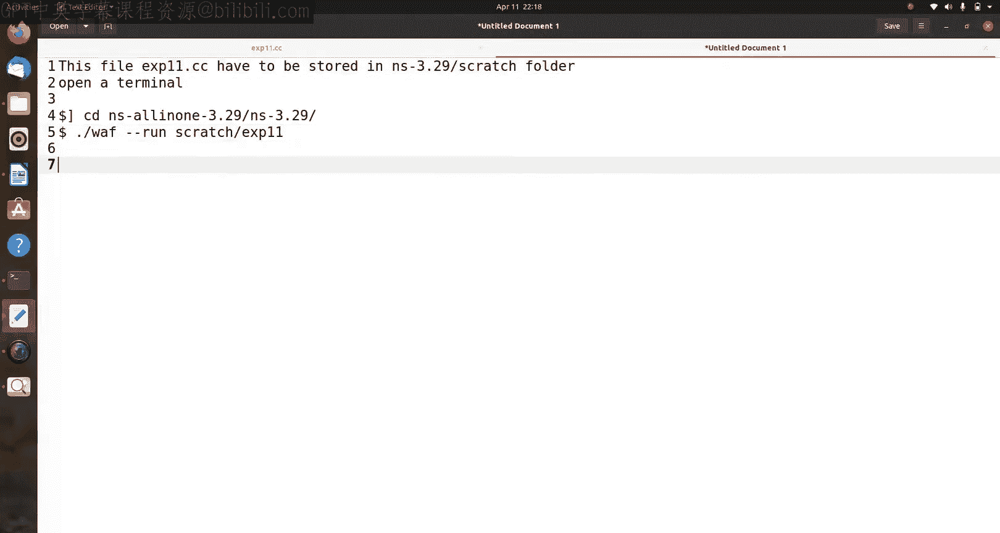
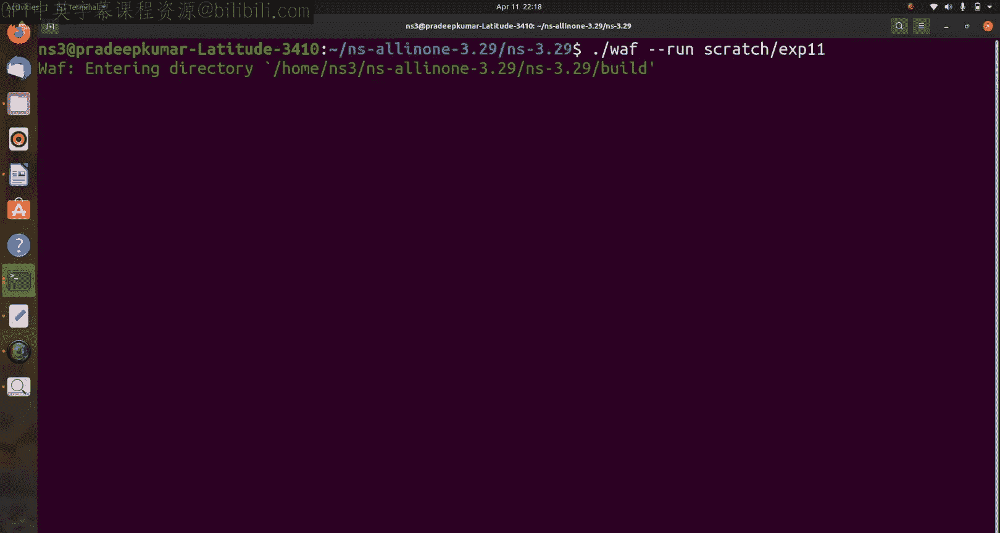
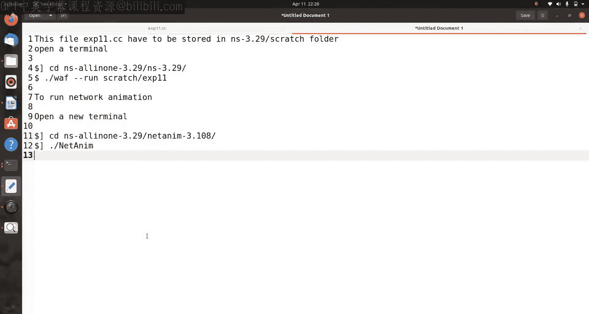
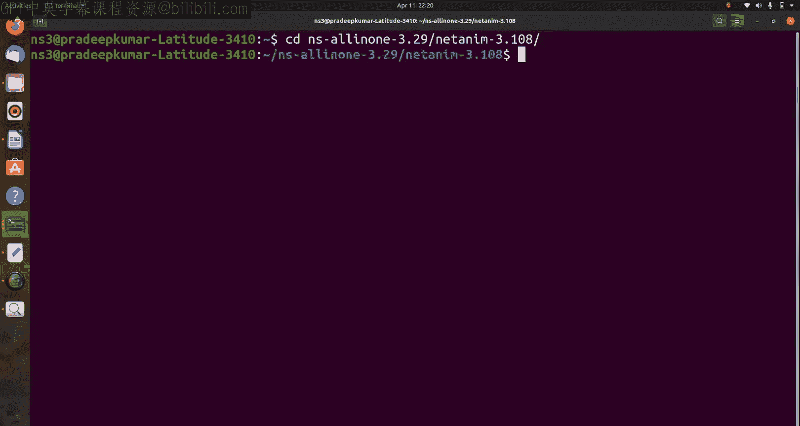
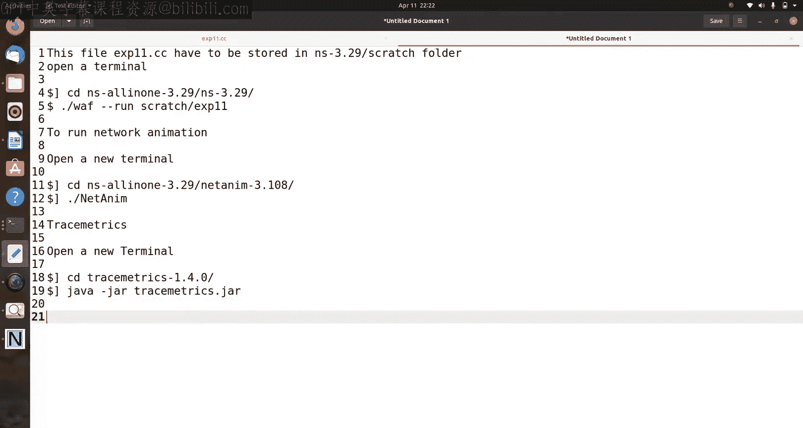
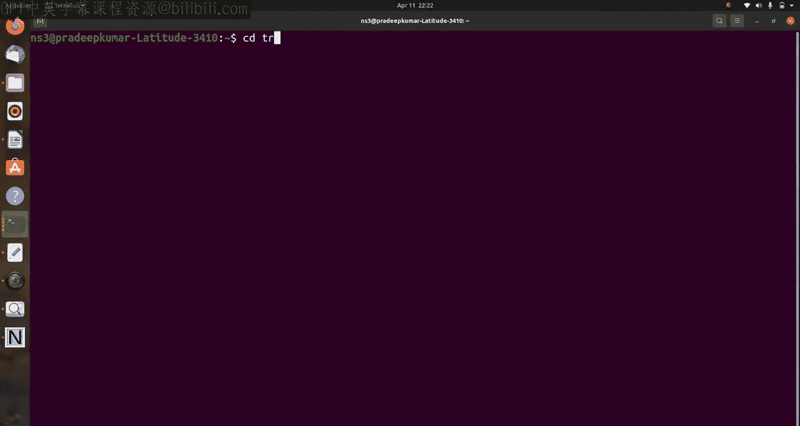
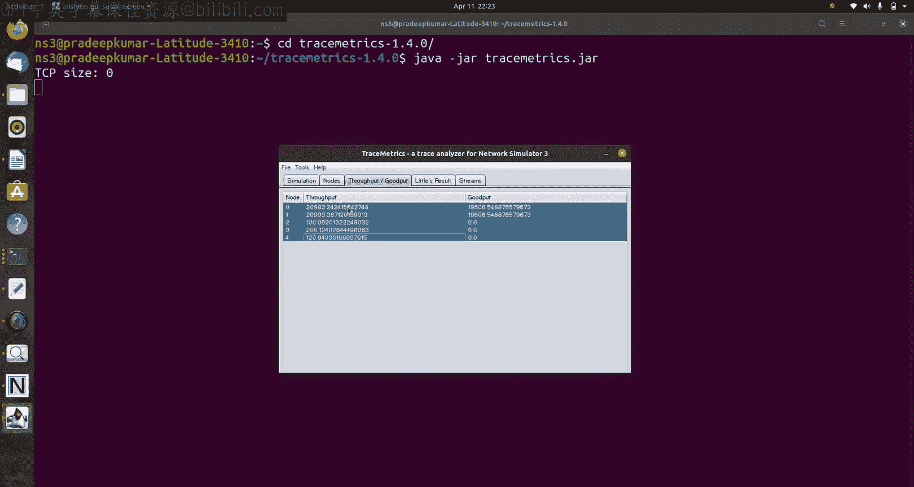
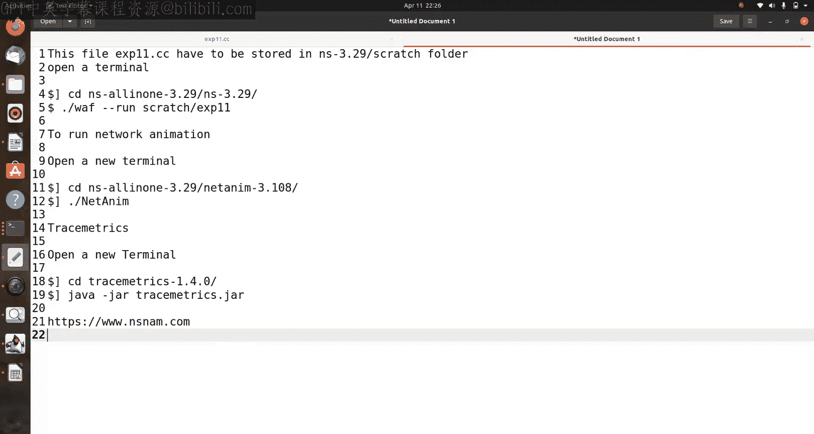

# 32：NS3中的链路状态路由与有线网络 🌐

## 概述
在本节课中，我们将学习如何在网络模拟器3（NS3）中实现**链路状态路由协议**，并应用于一个有线网络场景。我们将通过构建一个包含五个节点和六条链路的网络拓扑，配置每条链路的带宽和延迟参数，然后运行模拟来观察数据包的传输路径，并分析网络性能。

## 网络设计与链路状态路由原理
上一节我们介绍了链路状态路由的基本概念。本节中，我们来看看如何在NS3中具体实现它。

链路状态路由协议（如OLSR）的核心思想是每个路由器都了解整个网络的拓扑结构，通过交换链路状态信息，每个节点可以独立计算到所有目的地的最短路径。计算最短路径的常用算法是**Dijkstra算法**，其核心公式是寻找从源节点到所有其他节点的最小成本路径。

我们将设计一个包含五个路由器（R0, R1, R2, R3, R4）的网络。目标是找出从R1到R2的最优路径。根据配置的链路成本（由带宽和延迟决定），路径可能有两种选择：
1.  R1 -> R0 -> R2
2.  R1 -> R4 -> R3 -> R0 -> R2

通过模拟，我们可以验证NS3中的路由协议是否会选择理论上的最短路径。

以下是网络拓扑中每条链路的特性配置：

*   **R0 - R1**: 延迟 2ms, 带宽 10 Mbps
*   **R1 - R4**: 延迟 10ms, 带宽 5 Mbps
*   **R4 - R3**: 延迟 2ms, 带宽 2 Mbps
*   **R3 - R0**: 延迟 5ms, 带宽 5 Mbps
*   **R0 - R2**: 延迟 1ms, 带宽 1 Mbps
*   **R2 - R3**: 延迟 50ms, 带宽 50 Mbps

## 模拟实现步骤
要实现并观察这个链路状态路由模拟，我们需要完成以下几个核心步骤。

以下是具体的操作流程：

1.  **编写源代码**：创建一个C++程序来定义网络拓扑、节点、链路、应用层流量并启用路由协议。
2.  **编译程序**：使用NS3的编译系统（`./ns3`）来编译我们编写的源代码文件。
3.  **运行模拟**：执行编译后的程序，生成跟踪文件和数据包捕获文件。
4.  **可视化与分析**：使用NetAnim工具查看网络动画，使用Trace-Metric等工具分析吞吐量等性能指标。

## 源代码详解
现在，让我们深入查看实现上述设计的NS3源代码的关键部分。

首先，程序包含了必要的头文件，并定义了诸如数据包大小、数据速率等参数。我们使用`NS3`命名空间。

```cpp
// 示例参数定义
uint32_t packetSize = 210; // 字节
std::string dataRate = "448kbps"; // UDP流量生成速率
```

接着，创建五个网络节点。

```cpp
NodeContainer c;
c.Create(5); // 创建5个节点：R0, R1, R2, R3, R4
```

然后，定义节点之间的连接（链路），总共六条。

```cpp
NodeContainer n01 = NodeContainer(c.Get(0), c.Get(1));
NodeContainer n14 = NodeContainer(c.Get(1), c.Get(4));
// ... 类似地定义 n43, n30, n02, n23
```

配置链路状态路由和互联网协议栈。

```cpp
// 启用链路状态路由协议 (OLSR)
OlsrHelper olsr;
// 创建静态路由辅助器，并与OLSR一起添加到协议列表中
Ipv4StaticRoutingHelper staticRouting;
Ipv4ListRoutingHelper list;
list.Add(staticRouting, 0);
list.Add(olsr, 10);
// 在所有节点上安装互联网协议栈
InternetStackHelper internet;
internet.SetRoutingHelper(list);
internet.Install(c);
```

接下来，使用`PointToPointHelper`为每条链路设置具体的延迟和带宽。

```cpp
// 配置 R0-R1 链路
PointToPointHelper p2p01;
p2p01.SetDeviceAttribute("DataRate", StringValue("10Mbps"));
p2p01.SetChannelAttribute("Delay", StringValue("2ms"));
NetDeviceContainer d01 = p2p01.Install(n01);
// ... 类似地配置其他五条链路
```

为所有网络设备分配IP地址。

```cpp
Ipv4AddressHelper ip;
ip.SetBase("10.1.1.0", "255.255.255.0");
Ipv4InterfaceContainer i01 = ip.Assign(d01);
ip.SetBase("10.1.2.0", "255.255.255.0");
Ipv4InterfaceContainer i14 = ip.Assign(d14);
// ... 为所有链路分配IP地址
```

创建UDP应用，从节点1向节点2发送数据。

```cpp
// 设置UDP服务器（接收端）在节点2上
uint16_t port = 8000;
PacketSinkHelper sink("ns3::UdpSocketFactory", InetSocketAddress(Ipv4Address::GetAny(), port));
ApplicationContainer sinkApp = sink.Install(c.Get(2));
// 设置UDP客户端（发送端）在节点1上
OnOffHelper client("ns3::UdpSocketFactory", InetSocketAddress(i02.GetAddress(1), port));
client.SetAttribute("DataRate", StringValue(dataRate));
client.SetAttribute("PacketSize", UintegerValue(packetSize));
ApplicationContainer clientApp = client.Install(c.Get(1));
```

为了可视化，我们使用`AnimationInterface`并设置节点位置。

```cpp
AnimationInterface anim("lsr-animation.xml");
anim.SetConstantPosition(c.Get(0), 0, 50);   // R0
anim.SetConstantPosition(c.Get(1), 50, 100); // R1
anim.SetConstantPosition(c.Get(2), 50, 0);   // R2
anim.SetConstantPosition(c.Get(3), 50, 0);   // R3 (调整后)
anim.SetConstantPosition(c.Get(4), 100, 50); // R4
```

最后，设置模拟时间并启动模拟。





```cpp
Simulator::Stop(Seconds(30.0));
Simulator::Run();
Simulator::Destroy();
```

## 编译与运行模拟
源代码准备就绪后，下一步是将其编译并运行。





首先，将源代码文件（例如`exp11.cc`）保存到NS3目录下的`scratch/`文件夹中。然后打开终端，导航到NS3根目录进行编译。

```bash
cd ns-allinone-3.29/ns-3.29
./ns3 run scratch/exp11
```

编译成功后，程序会自动运行。运行结束后，会在当前目录生成跟踪文件（如`lsr.tr`）、数据包捕获文件（`lsr.pcap`）和网络动画文件（`lsr-animation.xml`）。

## 结果可视化与分析
模拟运行完成后，我们可以通过多种方式直观地查看和分析结果。





**1. 使用NetAnim查看网络动画：**
在终端中启动NetAnim，并加载生成的XML文件。

```bash
cd netanim-3.108
./NetAnim
```
在NetAnim界面中打开`lsr-animation.xml`文件，即可播放模拟动画。你可以看到数据包根据链路状态路由协议计算出的路径在网络中移动，验证R1到R2的数据流主要经由R0转发。



**2. 使用Trace-Metric分析吞吐量：**
Trace-Metric是一个基于Java的工具，用于分析NS3的跟踪文件。

```bash
cd trace-metric
java -jar trace-metric.jar
```
在打开的界面中，选择生成的`lsr.tr`文件。工具会解析文件，展示诸如节点吞吐量等信息。从分析结果可以看出，节点0、1、2有较高的吞吐量，而节点3、4的吞吐量较低，这与我们的网络流量路径（R1->R0->R2）相符。

**3. 绘制吞吐量图表：**
可以将Trace-Metric输出的吞吐量数据导出为CSV格式，然后使用电子表格软件（如LibreOffice Calc）绘制图表。图表会清晰显示各节点在模拟期间的吞吐量差异，直观反映网络流量的分布情况。



## 总结
本节课中我们一起学习了在NS3中配置和运行链路状态路由协议的全过程。我们从设计一个有线网络拓扑开始，为每条链路设置了带宽和延迟参数。然后，我们详细讲解了实现该模拟的NS3源代码，包括创建节点、配置链路、安装协议栈、设置应用以及启用可视化。接着，我们完成了程序的编译和运行。最后，我们利用NetAnim工具观察了数据包的路由路径，并使用Trace-Metric工具分析了网络的吞吐量性能。通过这个完整的示例，你可以掌握在NS3中进行路由协议仿真和基础网络性能分析的方法。