# 35：在Ubuntu中安装NS3（NS-3.35与NS-3.37）🚀


在本教程中，我们将学习如何在Ubuntu 22.04 LTS操作系统上安装两个版本的网络模拟器NS3：**NS-3.35**和**NS-3.37**。我们将从系统准备开始，逐步完成下载、编译和测试安装的全过程。

## 概述与准备工作

上一节我们介绍了本教程的目标。本节中，我们来看看安装前的准备工作。安装两个版本的原因是：NS-3.36及之后的版本从Waf构建框架切换到了CMake框架。为了同时支持基于旧Waf框架和新CMake框架的协议与应用实验，我们需要安装两个版本。

首先，假设你刚刚全新安装了Ubuntu 22.04。你需要更新系统包管理器并安装一系列NS3依赖的软件包。

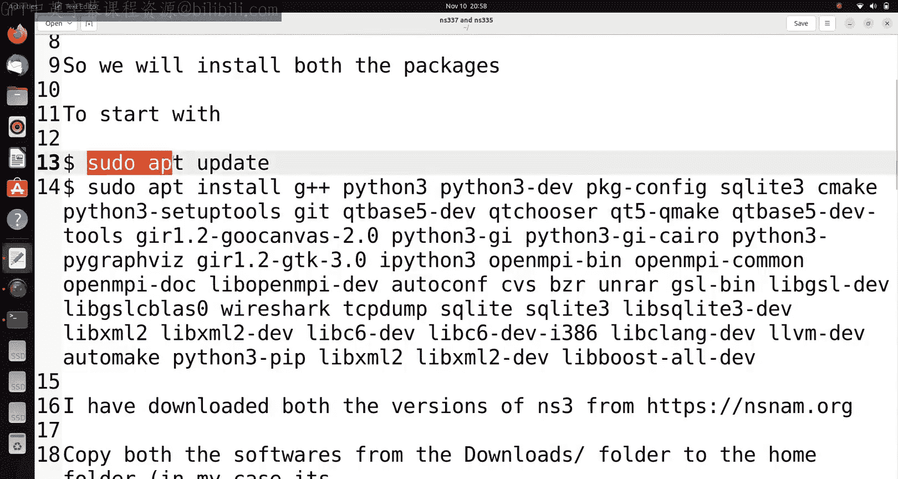

以下是需要执行的初始命令和软件包列表：

```bash
sudo apt update
sudo apt install -y g++ python3 python3-dev pkg-config sqlite3 cmake python3-setuptools git qtbase5-dev qtchooser qt5-qmake qtbase5-dev-tools gir1.2-goocanvas-2.0 python3-gi python3-gi-cairo python3-pygraphviz gir1.2-gtk-3.0 ipython3 openmpi-bin openmpi-common openmpi-doc libopenmpi-dev autoconf cvs bzr unrar gdb valgrind uncrustify doxygen graphviz imagemagick texlive texlive-extra-utils texlive-latex-extra texlive-font-utils dvipng latexmk python3-sphinx dia gsl-bin libgsl-dev libgslcblas0 tcpdump sqlite sqlite3 libsqlite3-dev libxml2 libxml2-dev libgtk2.0-0 libgtk2.0-dev vtun lxc uml-utilities libboost-all-dev
```

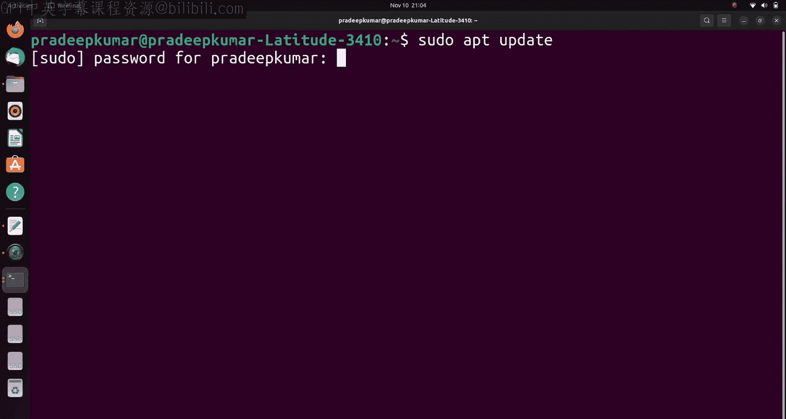

这个安装过程可能需要一些时间，具体取决于你的系统配置和网络速度。

## 下载与解压NS3源码

准备工作完成后，我们需要获取NS3的源代码。你可以从nsnam.org官网下载，也可以从提供的博客或Github仓库获取。

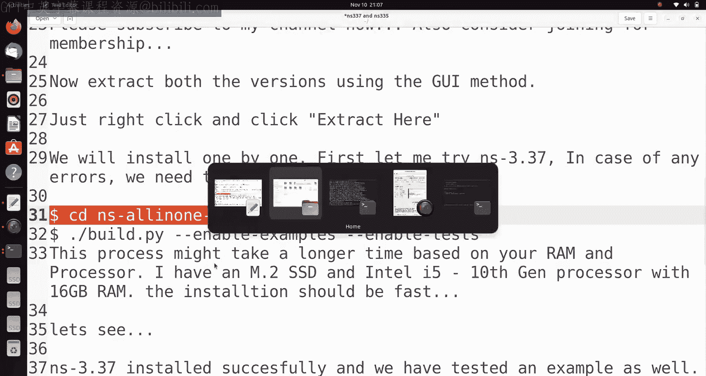

假设我们已经将`ns-allinone-3.37.tar.bz2`和`ns-allinone-3.35.tar.bz2`两个压缩包下载并放到了用户主目录（`/home/`）下。

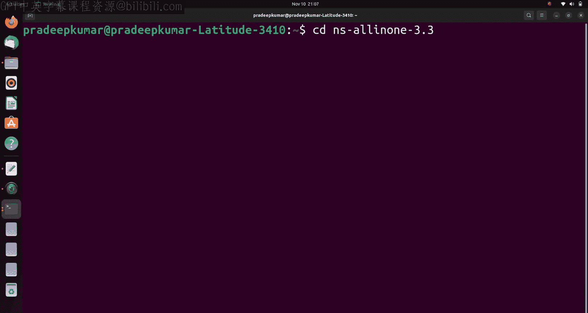

以下是解压文件的步骤：

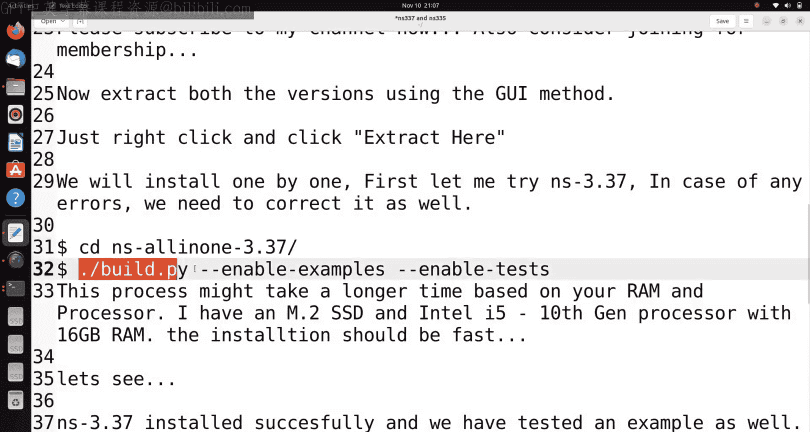

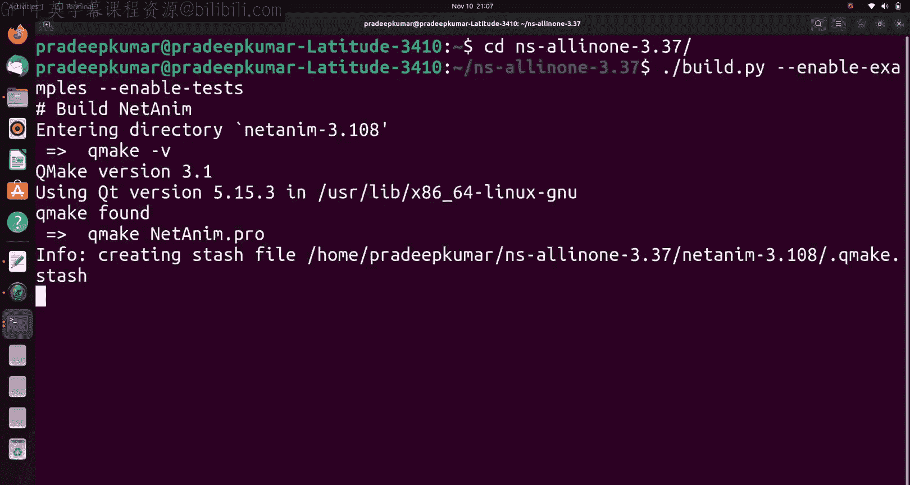

1.  在文件管理器中，分别对两个压缩包右键点击，选择“提取到此处”。
2.  解压后会生成两个文件夹：`ns-allinone-3.37`和`ns-allinone-3.35`。

现在，我们已经准备好了两个版本的源代码。

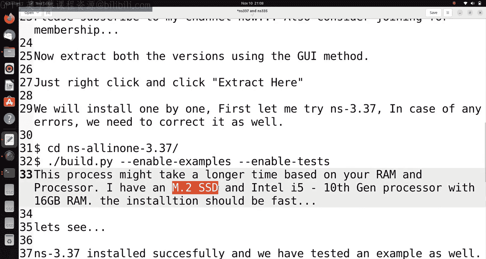

## 安装NS-3.37（CMake框架）

上一节我们准备好了源代码。本节中，我们首先安装基于CMake框架的NS-3.37。

进入NS-3.37的目录并执行构建命令：

```bash
cd ns-allinone-3.37
./ns3 configure --enable-examples --enable-tests
./ns3 build
```

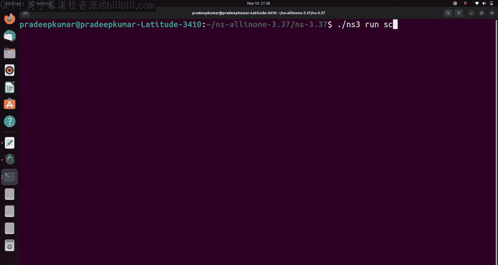

这个过程可能需要15到35分钟，时间长短取决于你的系统是使用SSD还是传统硬盘。

构建完成后，我们需要验证安装是否成功。

以下是测试安装的步骤：

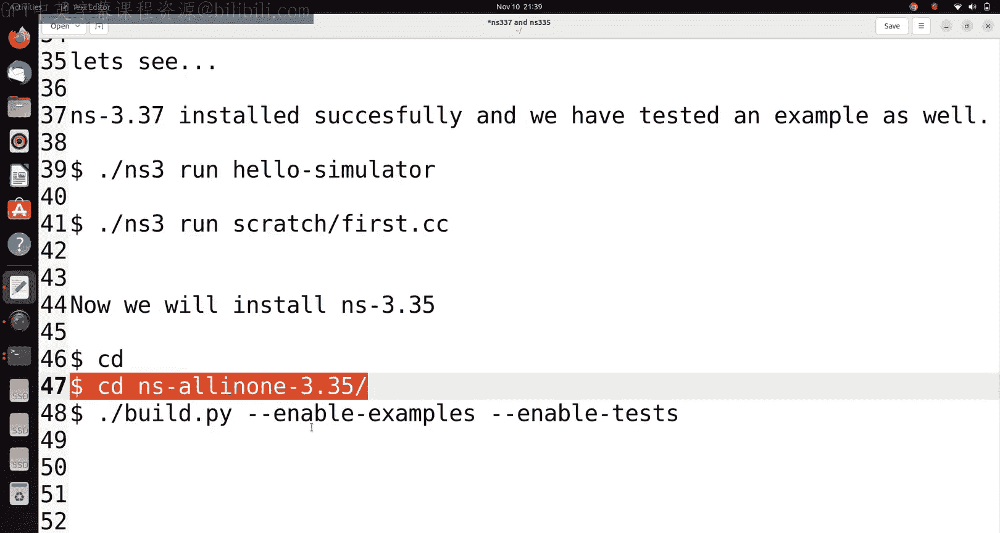

1.  运行一个简单的示例：`./ns3 run hello-simulator`。如果输出包含“Hello Simulator”，则初步成功。
2.  运行教程中的示例。首先将示例文件复制到scratch目录：`cp examples/tutorial/first.cc scratch/`。
3.  运行该示例：`./ns3 run scratch/first`。如果程序能成功编译并运行，输出网络配置信息，则说明安装成功。
4.  此外，可以测试网络动画工具NetAnim：进入`netanim`目录并运行`./NetAnim`，检查软件是否能正常启动。

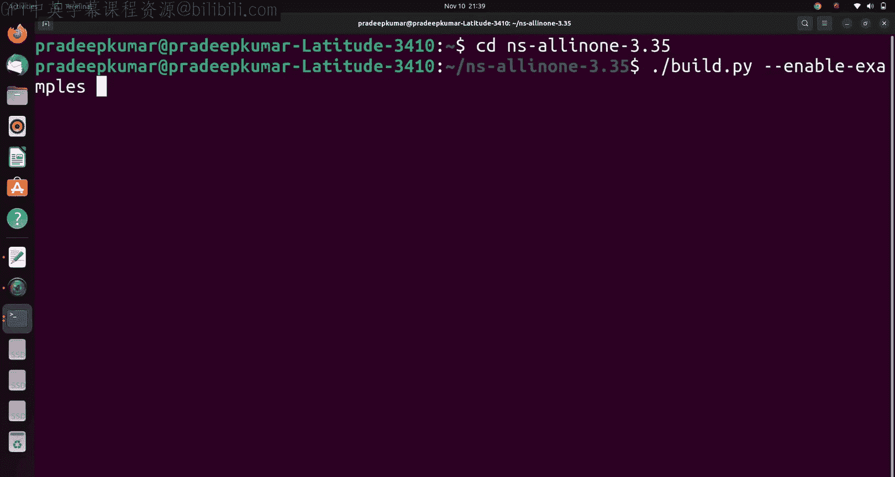

如果以上测试都通过，说明NS-3.37已成功安装。

## 安装NS-3.35（Waf框架）及问题解决

成功安装NS-3.37后，我们接下来安装基于旧版Waf框架的NS-3.35。步骤类似，但可能会遇到一个特定的错误。

首先，进入NS-3.35目录并开始构建：

```bash
cd ../ns-allinone-3.35
./ns3 configure --enable-examples --enable-tests
./ns3 build
```

在构建过程中，你可能会遇到一个“Python binding generation error”。这是因为Python版本兼容性问题。

以下是解决此错误的步骤：

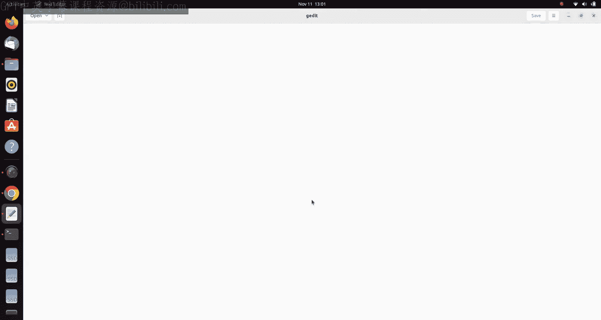

1.  找到并编辑文件：`ns-3.35/bindings/python/ns3ns3gcccpython/cppyy/cp.py`。
2.  定位到第42行附近。将原来的 `collections.Callable = collections` 这一行删除。
3.  在相应位置添加以下两行代码：
    ```python
    import collections.abc
    collections.Callable = collections.abc.Callable
    ```
4.  保存文件，然后重新运行构建命令：`./ns3 build`。

修正错误后，构建过程应该能顺利完成。

## 验证NS-3.35安装

构建完成后，同样需要对NS-3.35进行验证。注意，运行命令使用的是`waf`而不是`ns3`。

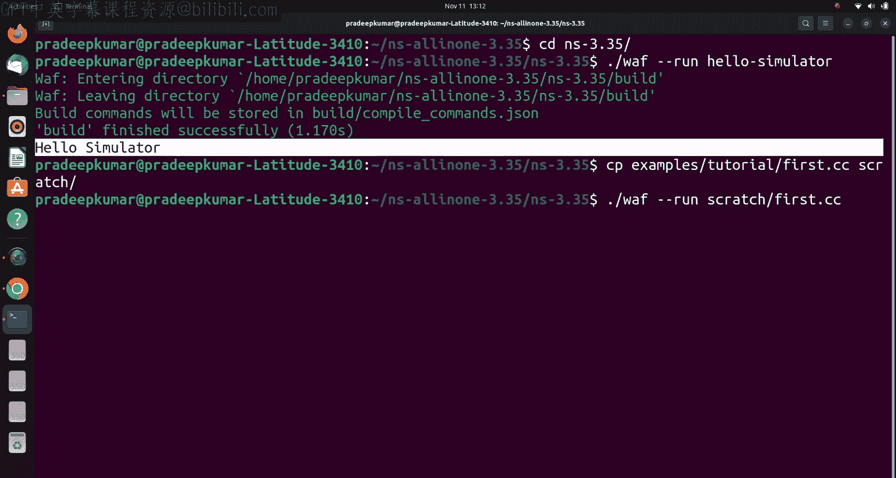

以下是验证安装的步骤：

1.  运行基础测试：`./waf --run hello-simulator`，应输出“Hello Simulator”。
2.  复制并运行`first.cc`示例：`cp examples/tutorial/first.cc scratch/`，然后执行`./waf --run scratch/first`。
3.  测试Python脚本的运行。复制Python示例：`cp examples/tutorial/first.py scratch/`。
4.  运行Python脚本：`./waf --run scratch/first.py`。注意，对于Python文件，运行命令中不需要额外的`--pyrun`参数，`waf`会自动识别。

如果所有命令都能成功执行并产生预期输出，则表明NS-3.35也安装成功。

## 总结

本节课中，我们一起学习了在Ubuntu 22.04系统上安装NS-3.35和NS-3.37两个版本网络模拟器的完整流程。我们首先准备了系统环境，然后分别下载和解压了源代码。接着，我们逐步编译并安装了基于CMake框架的NS-3.37，并进行了测试。随后，我们处理了安装基于Waf框架的NS-3.35时可能遇到的Python绑定生成错误，并最终成功验证了两个版本的安装。

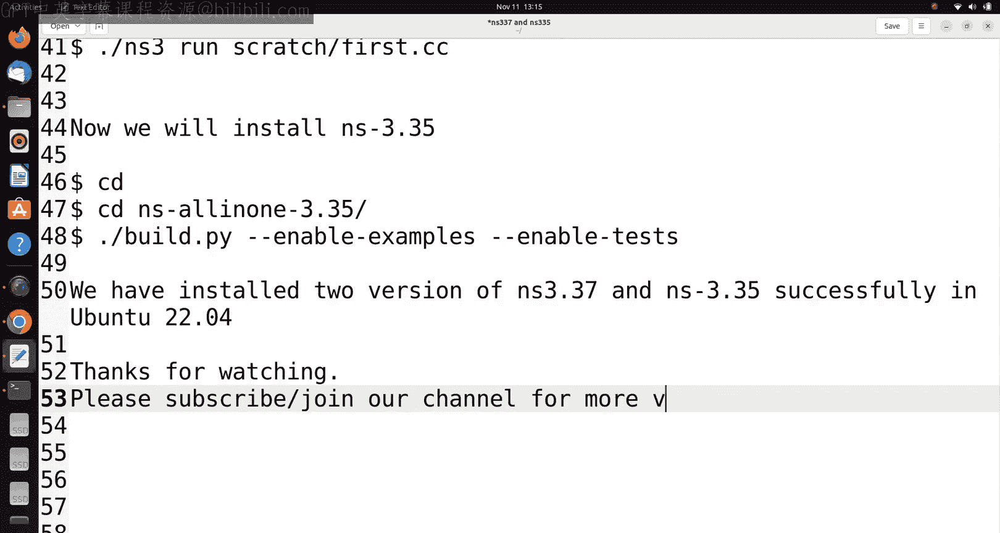

现在，你的系统上已经同时具备了新旧两种构建框架的NS3环境，可以用于支持不同框架下的网络协议与应用的仿真实验。如果在安装过程中遇到其他问题，可以参考相关社区或博客寻求帮助。