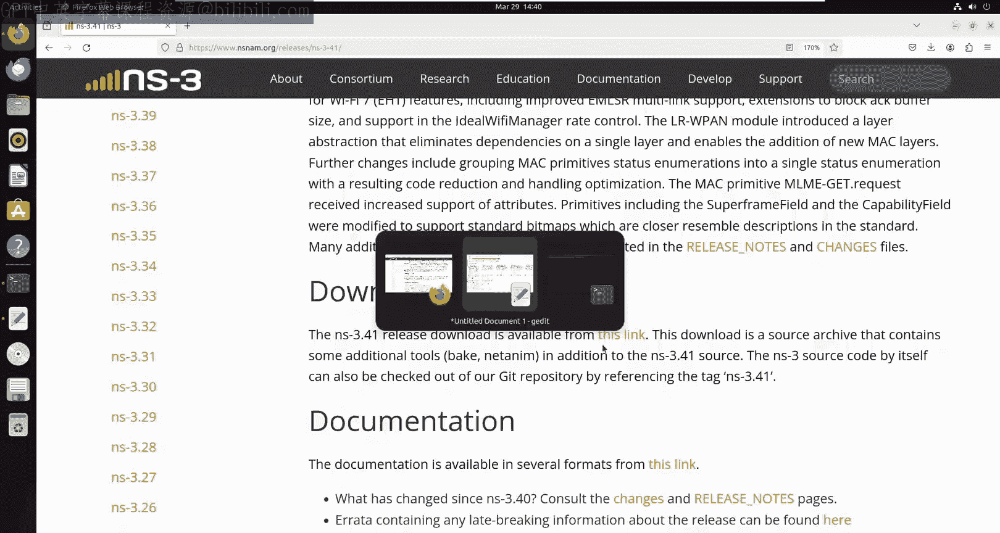
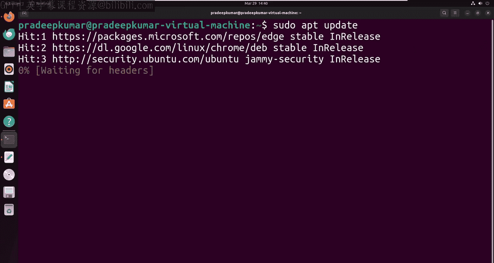
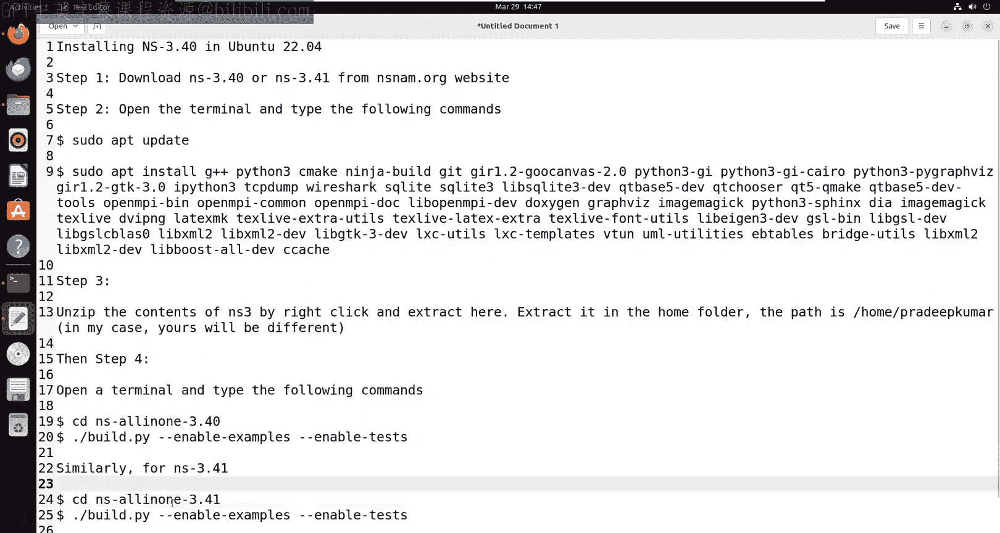
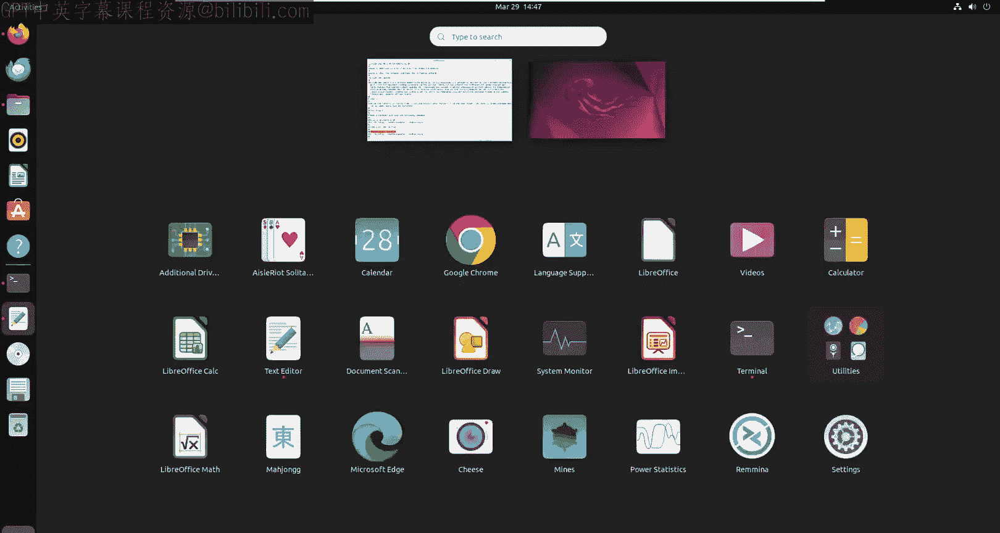
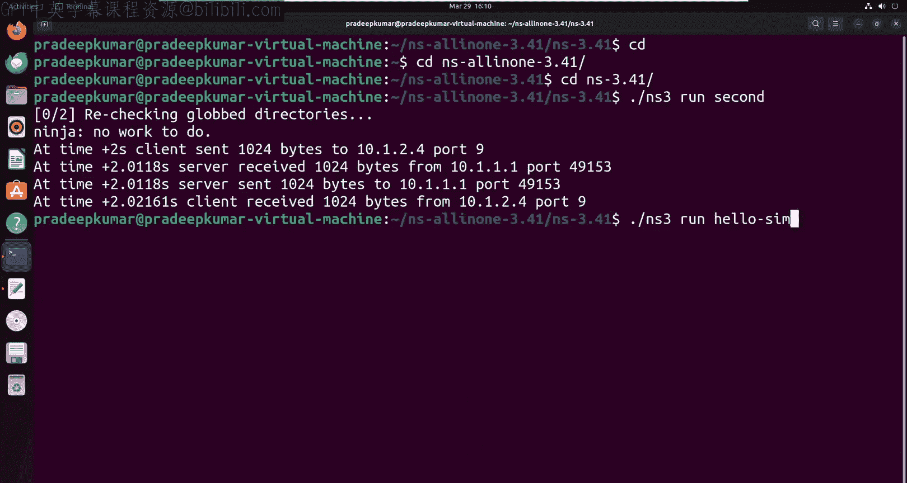

# 41：在Ubuntu 22.04中安装ns-3.41 🖥️

在本节课中，我们将学习如何在Ubuntu 22.04操作系统中安装网络模拟器ns-3，具体版本为ns-3.41。我们将从下载软件包开始，逐步完成所有必要的系统更新、依赖库安装以及最终的编译和测试过程。

## 概述与准备工作

首先，我们需要下载ns-3.41的安装包。我们将访问官方网站 `nsnam.org` 来获取最新版本。本教程的步骤同样适用于ns-3.40版本。

下载完成后，我们将把软件包存储在本地文件夹中并进行解压。

## 第一步：更新系统与安装依赖



在开始安装ns-3之前，必须确保系统已更新，并安装所有必要的依赖软件包。以下是需要执行的命令。

打开终端，输入以下命令来更新系统软件包列表：

```bash
sudo apt update
```

更新完成后，我们将安装一系列运行ns-3所必需的软件包和第三方库。一次性安装所有依赖可以避免未来可能出现的兼容性问题。



以下是需要复制并粘贴到终端中执行的完整安装命令：

```bash
sudo apt install -y gcc g++ python3 python3-dev pkg-config sqlite3 cmake build-essential libgtk-3-dev libboost-all-dev libgsl-dev libxml2-dev libreadline-dev valgrind gdb qt5-default mercurial git ca-certificates
```

该命令的执行时间取决于您的网络速度。所有软件包安装完成后，终端会显示相应的完成提示。

## 第二步：准备ns-3安装包

假设我们已经从网站下载了 `ns-allinone-3.41.tar.bz2` 文件，它通常位于“下载”文件夹中。

为了操作方便，建议将此文件移动到用户的主目录（`/home/你的用户名/`）。然后，在该文件上点击右键，选择“提取到此处”选项进行解压。

解压完成后，您将在主目录中看到一个名为 `ns-allinone-3.41` 的新文件夹。这就是我们将要安装的ns-3软件目录。

## 第三步：编译与安装ns-3

现在，我们需要在终端中编译ns-3的源代码。请打开一个新的终端窗口，新终端默认会指向您的主目录。

首先，使用 `cd` 命令进入解压后的ns-3目录：

```bash
cd ns-allinone-3.41
```

进入目录后，执行以下配置和编译命令。此命令启用了示例程序和测试套件：

```bash
./build.py --enable-examples --enable-tests
```





**请注意**：命令中的单词之间不应有多余的空格。

此编译过程可能需要大约20分钟，具体时间取决于您的计算机性能。在我的测试中，大约花了15分钟完成。

## 第四步：验证安装

编译安装完成后，我们需要验证ns-3是否已正确安装并可以运行。我们将运行两个内置的示例程序进行测试。

首先，确保您仍在 `ns-allinone-3.41` 目录中。然后运行第一个示例：

```bash
./ns3 run first
```

接着，运行第二个示例：

```bash
./ns3 run second
```

如果安装成功，您将在终端中看到相应的输出结果。例如，程序可能会输出“hello simulator”等信息，这表明ns-3模拟器已成功安装并可以正常工作。

## 总结



本节课中，我们一起完成了在Ubuntu 22.04系统上安装ns-3.41的全过程。我们学习了如何更新系统、安装必要的依赖库、解压软件包、编译源代码，并通过运行示例程序来验证安装是否成功。现在，您已经拥有了一个可以正常工作的ns-3网络模拟环境，可以开始进行后续的网络协议仿真实验了。