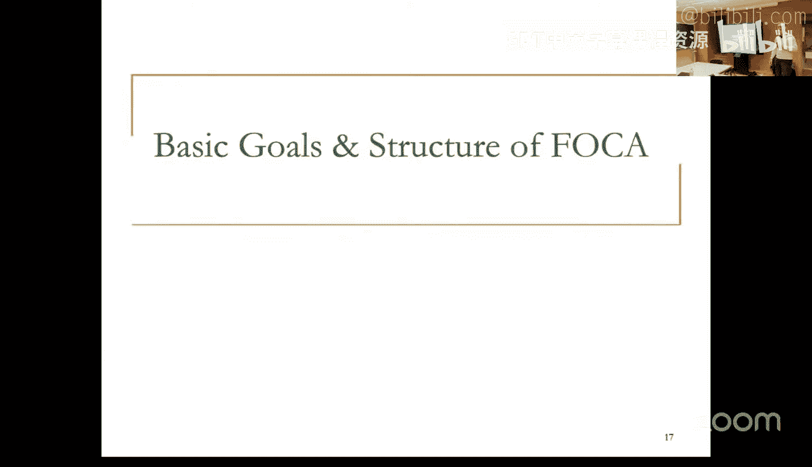
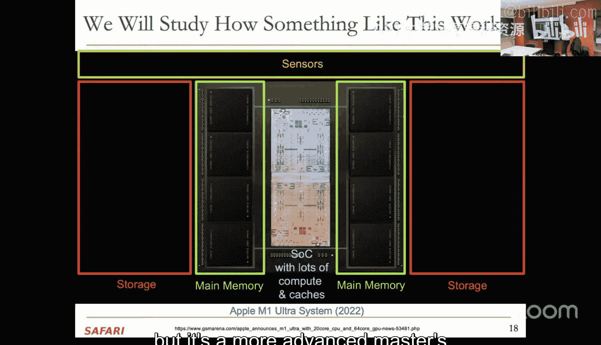
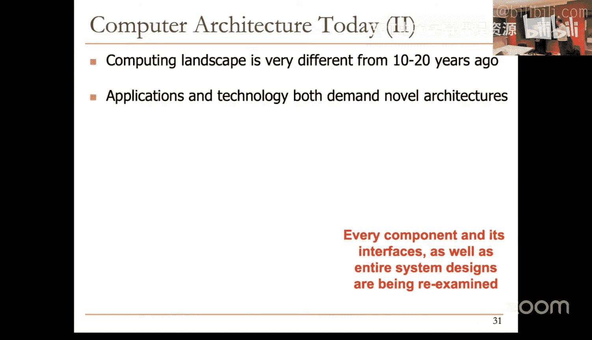
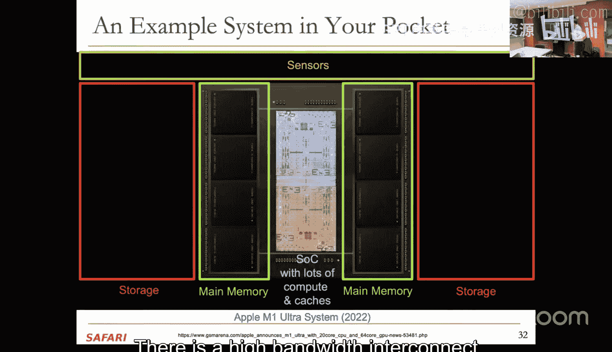
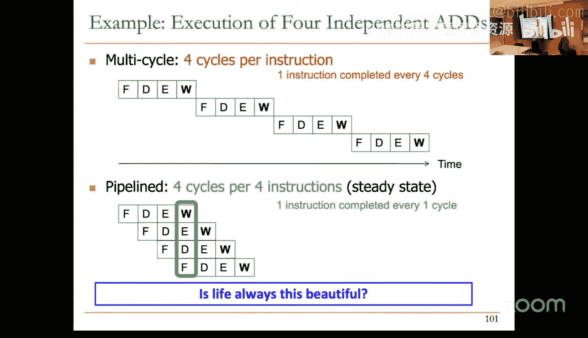
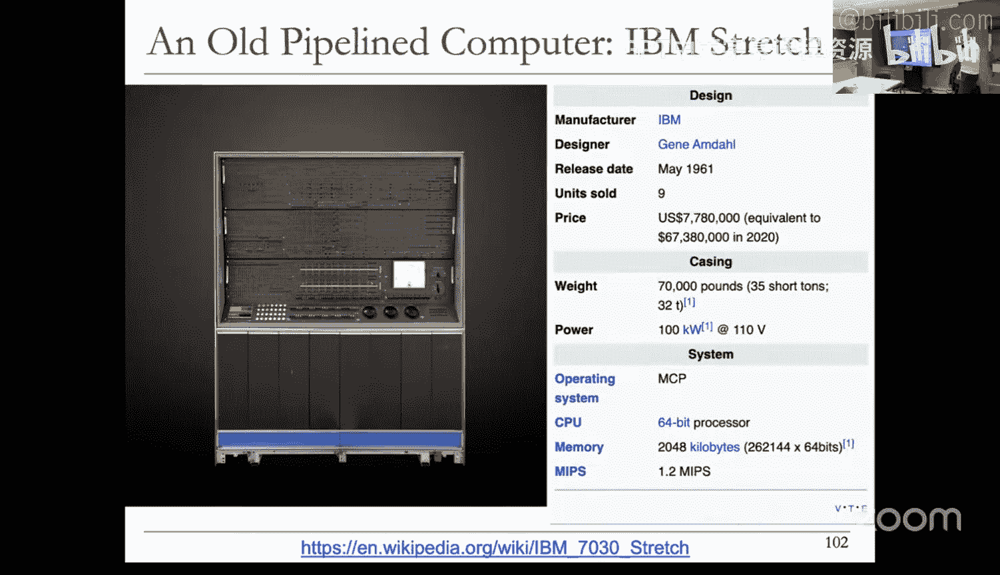
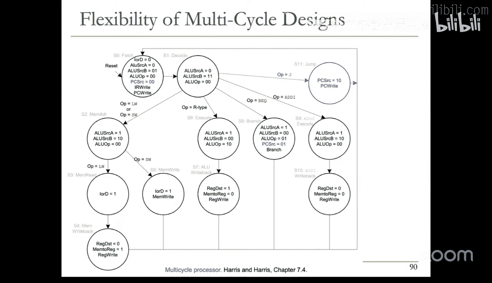

# ETHZ《计算机架构基础》：1：现代微处理器设计

## 概述
在本节课中，我们将学习计算机架构的基础概念，特别是现代微处理器的设计原理。我们将从计算机架构的定义开始，探讨指令集架构与微架构的区别，并分析单周期、多周期以及流水线处理器的设计思想、优缺点和性能考量。课程旨在为理解更高级的处理器设计（如乱序执行）打下坚实基础。

---

## 计算机架构的定义与重要性

计算机架构是设计和选择硬件组件、定义硬件-软件接口，以构建满足特定功能、性能、能耗和成本目标的计算系统的科学与艺术。

为什么学习计算机架构？我们致力于构建更好的系统：使其更快、更便宜、更小、更可靠。通过利用底层电路的进步并分析工作负载，我们可以以更优的方式支持新的应用，例如机器学习、大型语言模型和个性化基因组学。理解计算机的工作原理对于优化现有系统和推动创新至关重要。

当前的计算领域与10到20年前大不相同，应用和技术需求催生了新的架构。每个组件及其接口，乃至整个系统设计，都在被重新审视。

---

## 指令集架构与微架构

**指令集架构** 是软件与硬件之间的契约，它规定了程序员对硬件行为的假设。**微架构** 则是指令集架构在特定设计约束和目标下的具体硬件实现。

一个简单的类比是汽车：油门踏板是司机（程序员）的接口，而引擎的内部机械或电子实现则是微架构。司机无需了解引擎内部，但了解内部机制可能有助于更高效地驾驶。

*   **ISA示例**：加法指令的操作码、通用寄存器的数量。
*   **微架构示例**：执行乘法指令所需的周期数、寄存器文件的端口数量、是否采用流水线。

微架构的变化通常比ISA更快，因为改变微架构无需修改庞大的上层软件栈。

---

## 冯·诺依曼模型与指令处理

经典的冯·诺依曼模型有两个关键属性：
1.  **存储程序**：指令和数据存储在同一存储器中。
2.  **顺序执行**：指令严格按顺序执行，前一条指令完成后才能开始下一条。

处理一条指令意味着根据ISA的规范，将**程序可见的架构状态** 转换为新的架构状态。架构状态包括内存、寄存器和程序计数器。

微架构则定义了如何实现这种转换。它可以使用程序不可见的**微架构状态** 来优化执行速度。

---

## 单周期微处理器

在单周期微处理器设计中，每条指令在一个时钟周期内完成。整个数据通路是组合逻辑，在周期结束时更新架构状态。

**关键问题**：时钟周期时间由执行时间最长的指令决定。例如，如果访存指令需要600皮秒，而加法指令只需400皮秒，时钟周期也必须设为600皮秒。

**设计原则分析**：
*   **关键路径设计**：违反。为最坏情况优化，拖累了常见情况。
*   **常见情况设计**：违反。未针对执行频率高的指令进行优化。
*   **平衡设计**：可能违反。资源可能未被均衡利用。

单周期设计时钟频率低，硬件成本高（需要多个ALU等资源以避免复用）。

---

## 多周期微处理器

多周期设计将指令处理分解为多个阶段（状态），每个阶段在一个较短的时钟周期内完成。不同指令所需的周期数不同。

**优势**：
*   **更高的时钟频率**：周期时间由最慢的阶段决定，而非最慢的指令。
*   **硬件复用**：例如，单个ALU可以在不同周期用于不同目的。
*   **灵活性**：易于处理耗时不确定的操作（如远程内存访问），只需在等待状态中循环即可。

**劣势**：
*   **硬件开销**：需要额外的寄存器存储中间结果。
*   **时序开销**：每个周期都有锁存数据的开销，随着周期变短，开销占比增大。
*   **有限并发性**：任何时刻只使用了机器的一小部分硬件。

多周期设计遵循冯·诺依曼顺序执行模型，通过一个有限状态机来控制指令处理的各个阶段。

---

## 从多周期到流水线

多周期处理器的主要局限是硬件利用率低。当一条指令处于解码阶段时，取指硬件是空闲的；当它执行时，访存硬件是空闲的。

**核心思想**：流水线化。像工厂装配线一样，让不同的指令同时处于处理过程的不同阶段。
*   当指令I在解码时，取指下一指令I+1。
*   当指令I在执行时，解码指令I+1，取指指令I+2。
*   以此类推。

理想情况下，一个K级流水线可以将吞吐量提高K倍（每个周期完成一条指令），但每条指令的延迟（完成所需时间）可能因流水线寄存器开销而略有增加。

---

## 流水线处理器的挑战与理想条件

实现高效流水线需要满足几个理想条件，但指令处理往往并不完美：

1.  **相同操作**：流水线应重复执行相同的操作序列。但不同指令（如加法与加载）需要的阶段可能不同，导致某些流水段空转（**外部碎片**）。
2.  **操作独立**：流水线中的指令应彼此独立。但实际程序中指令间存在数据依赖和控制依赖，这会导致**流水线冲突**，必须通过停顿或转发技术解决。
3.  **均匀划分**：处理过程应能被均匀地划分为耗时相等的阶段。但硬件模块（ALU、内存访问）的延迟不同，导致时钟周期由最慢阶段决定，其他阶段出现空闲时间（**内部碎片**）。

---

## 性能评估框架

一个通用的性能公式是：
**程序执行时间 = 指令数 × 平均每条指令周期数 × 时钟周期时间**

*   **单周期**：CPI = 1，但时钟周期时间很长。
*   **多周期**：CPI > 1（每条指令需多个周期），但时钟周期时间短。
*   **理想流水线**：CPI ≈ 1（吞吐量高），时钟周期时间短（但比多周期略长，因流水线寄存器开销）。

设计微架构时，需要在CPI和时钟周期时间之间进行权衡。

---

## 总结

本节课我们一起学习了现代微处理器设计的基础。我们从计算机架构的广义定义出发，明确了ISA与微架构的角色。接着，我们深入分析了三种基本的处理器设计模型：
1.  **单周期设计**：概念简单，但因最坏情况决定性能而效率低下。
2.  **多周期设计**：通过将指令分解为阶段提高了时钟频率和硬件复用率，但硬件利用率和并发性仍有限。
3.  **流水线设计**：通过重叠执行多条指令大幅提高了吞吐量，是高性能处理器的基础，但也引入了依赖冲突和流水线碎片等挑战。

理解这些基础模型及其权衡，是接下来学习更复杂技术（如流水线冲突解决、分支预测和乱序执行）的关键。在下一讲中，我们将深入探讨流水线处理器的具体实现及其面临的问题。