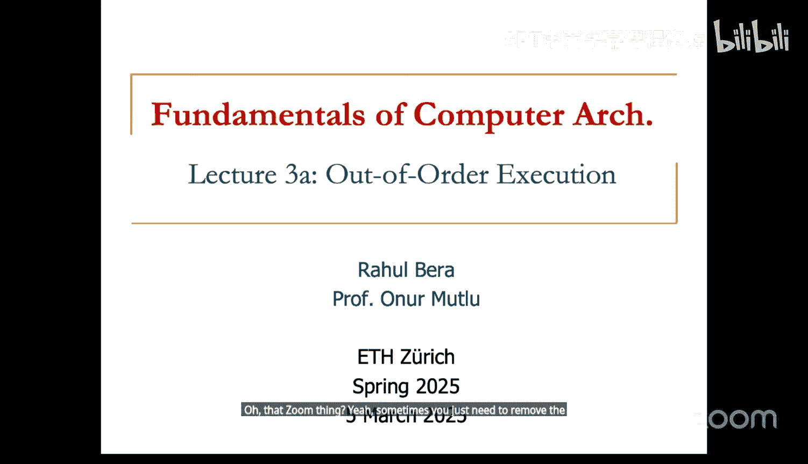
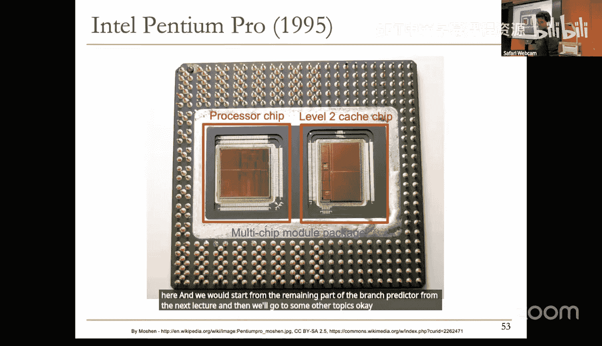

# ETHZ《计算机架构基础》：L3：乱序微处理器设计 II 与分支预测

## 概述
在本节课中，我们将继续学习乱序执行微处理器的设计细节，并深入探讨现代处理器中一个至关重要的性能优化技术：分支预测。我们将从乱序执行的硬件实现机制开始，然后分析控制流依赖带来的挑战，并介绍如何通过分支预测来缓解这些挑战。

## 乱序执行回顾与算法形式化

上一节我们介绍了乱序执行的基本概念，本节中我们来看看其核心算法——Tomasulo算法的具体形式化描述。

Tomasulo算法的核心思想是：如果保留站条目可用，则在重命名指令后，将重命名后的操作插入到保留站中。这仅在保留站条目可用时发生。保留站条目本身可能成为资源依赖的来源。如果保留站条目不可用，则流水线会停顿。

指令在保留站中等待，直到其所有源操作数就绪。它通过监听公共数据总线来跟踪源操作数的就绪状态。每当一条指令执行完毕，它就会在总线上广播其结果标签。任何等待该结果的指令都会捕获该值，并标记其对应的源操作数为就绪。一旦指令的所有源操作数就绪，它就会被分派到功能单元开始执行。执行完成后，该指令会再次广播其结果，并更新寄存器重命名表，回收其标签。

以下是Tomasulo算法中保留站条目的关键字段描述：
*   **Op**： 操作码。
*   **Qj, Qk**： 将产生源操作数的保留站编号。如果为0，则表示源操作数已就绪或在Vj/Vk中。
*   **Vj, Vk**： 源操作数的值。
*   **Busy**： 指示该保留站条目是否被占用。

## 乱序执行示例分析

让我们通过一个具体的程序片段来模拟Tomasulo算法的执行过程。

考虑以下指令序列：
1.  `MUL R3, R1, R2` // R3 = R1 * R2
2.  `ADD R5, R3, R4` // R5 = R3 + R4
3.  `ADD R7, R2, R6` // R7 = R2 + R6
4.  `ADD R10, R8, R9` // R10 = R8 + R9
5.  `MUL R12, R7, R10` // R12 = R7 * R10
6.  `ADD R5, R5, R11` // R5 = R5 + R11

假设初始时所有寄存器值有效，且保留站为空。模拟过程如下：

*   **周期1**： 取指`MUL`。
*   **周期2**： 解码`MUL`。检查保留站（乘法单元）有空闲条目。检查源操作数R1和R2，在寄存器重命名表中均为有效值。因此，该指令源操作数立即可用，被分派到乘法单元开始执行（假设乘法延迟为6周期）。同时，将目标寄存器R3重命名为该保留站条目的标签（例如`X`），并在寄存器重命名表中将R3标记为无效，指向标签`X`。
*   **周期3**： `MUL`继续执行。解码`ADD R5, R3, R4`。检查加法保留站有空闲条目。检查源操作数：R3在寄存器重命名表中无效，其标签为`X`，因此该源操作数未就绪；R4有效。将目标寄存器R5重命名为新条目标签（例如`A`）。该指令因等待R3而无法执行。
*   **周期4**： `MUL`继续执行。`ADD R5, R3, R4`在保留站中等待。解码`ADD R7, R2, R6`。其源操作数R2和R6均有效，因此该指令被分派到加法单元开始执行（假设加法延迟为4周期）。目标寄存器R7被重命名为标签`B`。
*   **周期5-7**： 指令继续执行或等待。`ADD R10, R8, R9`被解码，其源操作数均有效，被分派执行。目标寄存器R10被重命名为标签`C`。
*   **周期8**： `MUL`指令执行完成。它在公共数据总线上广播标签`X`和结果值（R1*R2）。正在等待源操作数标签`X`的指令（即`ADD R5, R3, R4`）捕获该值，并更新其对应的源操作数值。现在该指令的两个源操作数均已就绪。
*   **周期9**： `ADD R5, R3, R4`因其操作数就绪而被分派执行。同时，`ADD R7, R2, R6`执行完成，广播标签`B`和结果值。`MUL R12, R7, R10`指令正在等待标签`B`，因此捕获该值。但它仍在等待另一个源操作数（标签`C`）。
*   **后续周期**： 过程以此类推。`ADD R10, R8, R9`完成后广播标签`C`，使`MUL R12, R7, R10`就绪并执行。最后一条`ADD R5, R5, R11`需要注意：它读取R5，而R5的最新生产者是标签`A`（第二条指令），但该指令自身又写R5。因此，在解码时，它首先获取R5的当前重命名标签`A`作为源操作数，然后立即将R5重命名为自己的保留站标签`D`，作为新的生产者。

通过这个例子，我们可以看到指令如何根据操作数就绪情况而非程序顺序被动态调度执行，从而隐藏了长延迟操作（如乘法）带来的停顿。

## 支持精确异常的乱序处理器

上一节我们看到了基本的乱序执行机制，本节中我们引入对精确异常的支持，这是现代处理器的必备特性。

在仅支持乱序执行的模型中，指令一旦执行完成就立即更新架构状态（寄存器文件）。但这会导致问题：如果一条后续的、在程序顺序上更早的指令发生异常，处理器状态将无法回滚到一个一致的、所有先前指令已提交的状态。

解决方案是引入**重排序缓冲区**。ROB是一个循环缓冲区，指令在解码后被按程序顺序分配一个ROB条目。指令乱序执行完毕后，其结果并不直接写回架构寄存器文件，而是写入其ROB条目。仅当指令到达ROB头部（即所有之前的指令都已提交）时，才将其结果从ROB写回架构寄存器文件并提交。这保证了指令的提交（即架构状态的更新）严格按程序顺序进行。

因此，现代乱序处理器通常维护两个寄存器文件：
*   **前端寄存器文件/重命名寄存器文件**： 存储着包括推测结果在内的最新寄存器值。指令解码时从这里读取源操作数，指令执行完成后将结果写回这里。它支持乱序读写。
*   **架构寄存器文件**： 存储已提交的、确定的架构状态。只有当指令从ROB提交时，才将结果写回这里。它只按顺序更新。

当发生分支预测错误或异常时，处理器需要刷新流水线中该错误路径之后的所有指令。恢复过程包括：将架构寄存器文件的内容复制到前端寄存器文件（从而回滚所有未提交的推测状态），然后从正确的地址重新开始取指。

## 分支预测导论

控制流依赖，尤其是条件分支，是限制处理器指令级并行性的主要瓶颈。分支指令的下一条指令地址在分支条件被解析之前是未知的，这会导致流水线停顿。

分支预测的目标是在分支指令被解码甚至取指之前，就预测其执行方向（跳转或不跳转）以及可能的跳转目标地址，从而让取指单元能够不间断地工作。

分支预测不准确的代价非常高。假设一个20级流水线、5路超标量的处理器，一次分支预测错误需要刷新后续20个周期内已取入的指令（20 * 5 = 100条指令槽位）。即使预测准确率达到99%，性能损失也可能高达20%。因此，高精度的分支预测对性能至关重要。

## 分支预测基础

一个完整的分支预测机制需要在取指阶段提供三类信息：
1.  当前取指的指令是否是分支指令？
2.  如果是条件分支，它的方向是跳转（taken）还是顺序执行（not taken）？
3.  如果预测为跳转，它的目标地址是什么？

以下是解决这些问题的基本硬件结构：

*   **分支目标缓冲区**： BTB是一个缓存结构，以指令地址（PC）的一部分作为索引。它存储之前遇到的分支指令的跳转目标地址。如果在BTB中命中，则表明当前指令很可能是分支指令，并直接给出预测的目标地址。
*   **方向预测器**： 同样以PC索引，预测条件分支的方向。最简单的形式是1位“上次结果”预测器。
*   **下一地址选择逻辑**： 结合BTB命中信号和方向预测器的结果，决定下一个取指地址是PC+4（顺序地址）还是BTB提供的目标地址。

## 静态分支预测

静态分支预测在编译时或由程序员指定，无需运行时硬件支持。其方法简单但灵活性有限。

以下是几种常见的静态预测策略：
*   **总是预测不跳转**： 预测所有分支都不跳转，继续顺序执行。适用于编译器将大概率执行的路径布局为fall-through的情况。
*   **总是预测跳转**： 预测所有分支都跳转，使用BTB中的目标地址。对于循环结束分支（向后跳转）通常有效。
*   **向后跳转/向前不跳转**： 基于观察：循环结束的分支（目标地址小于当前PC）通常跳转；条件判断分支（目标地址大于当前PC）通常不跳转。
*   **基于剖析的预测**： 编译器使用代表性的输入集运行程序，收集分支行为剖面，并根据此剖面在编译时决定每个分支的预测方向，并将提示信息编码在指令中。
*   **基于程序分析的启发式预测**： 编译器根据代码模式应用启发式规则，例如预测“小于零”的分支为不跳转，或保护循环的条件分支为跳转。

## 动态分支预测

动态分支预测在处理器运行时进行，能够根据程序的实际执行历史自适应地调整预测，通常能获得比静态预测高得多的准确率，但需要额外的硬件资源。

### 基本动态预测器

*   **上次结果预测器**： 使用1位饱和计数器记录每个分支上次的执行结果，并预测本次相同。对于稳定（总是跳转或总是不跳转）的分支效果很好，但对于交替跳转的分支（如T, N, T, N...）准确率只有0%。
    *   **状态机**： `预测T -> 实际T -> 保持预测T`；`预测T -> 实际N -> 切换为预测N`。

*   **两位饱和计数器预测器**： 也称为**双模态预测器**。使用2位状态机，为预测改变引入了“惯性”，避免因单次结果波动而立即翻转预测。
    *   **状态**： `强不跳转 (SN)` -> `弱不跳转 (WN)` -> `弱跳转 (WT)` -> `强跳转 (ST)`。
    *   **规则**： 只有当实际结果与当前弱状态相反时，才会切换到另一个弱状态；实际结果与强状态相同则保持，相反则退化为弱状态。这提高了对轻微波动分支的预测稳定性。

### 利用相关性的高级预测器

基本预测器只考虑分支自身的近期历史。许多分支的行为与其他分支或自身更早的历史相关。

*   **全局历史预测器**： 发现分支结果可能与其他分支的结果相关（全局相关）。它维护一个**全局历史寄存器**，记录最近所有分支的执行结果（例如，每位记录一个分支是T还是N）。用GHR的内容作为索引，去访问一个模式历史表，该表的每个条目是一个2位饱和计数器。这样，预测基于“在特定的全局分支历史上下文下，该分支通常如何行为”。
    *   **公式表示**： `Prediction = PHT[GHR]`，其中`PHT`是模式历史表，`GHR`是全局历史寄存器。

*   **局部历史预测器**： 发现分支结果可能与其自身过去多次执行的结果相关（局部相关）。它为每个分支维护一个**局部历史寄存器**，记录该分支最近几次的执行结果。用LHR的内容索引一个局部模式历史表，进行预测。
    *   **公式表示**： `Prediction = PHT_i[LHR_i]`，其中`PHT_i`是分支`i`的私有模式历史表，`LHR_i`是分支`i`的局部历史寄存器。

现代高性能处理器的分支预测器通常是这些基本结构的复杂组合（如锦标赛预测器、感知机预测器等），并具有多级结构，以同时捕获局部和全局相关性，实现极高的预测准确率（>95%）。

## 总结

本节课中我们一起学习了乱序微处理器设计的核心算法——Tomasulo算法的具体工作流程，并通过示例加深了理解。我们看到了如何通过重排序缓冲区在乱序执行中实现精确异常，这是现代处理器可靠性的基石。随后，课程转向了另一个性能关键主题：分支预测。我们分析了分支预测的必要性和巨大性能影响，介绍了静态和动态预测的基本方法，并探讨了如何利用局部历史和全局历史相关性来构建更精准的动态分支预测器。理解这些机制是掌握现代高性能CPU设计精髓的关键。