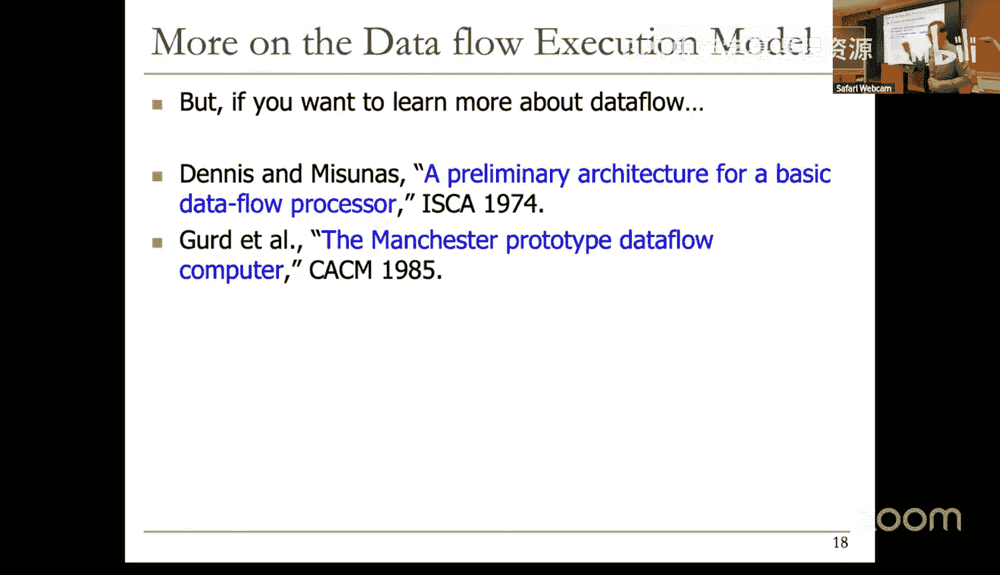
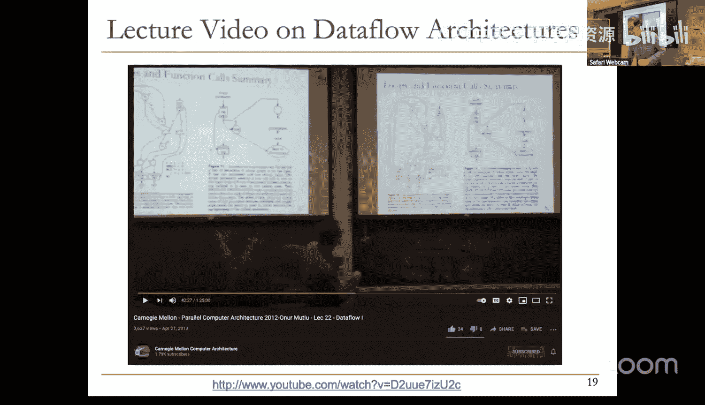
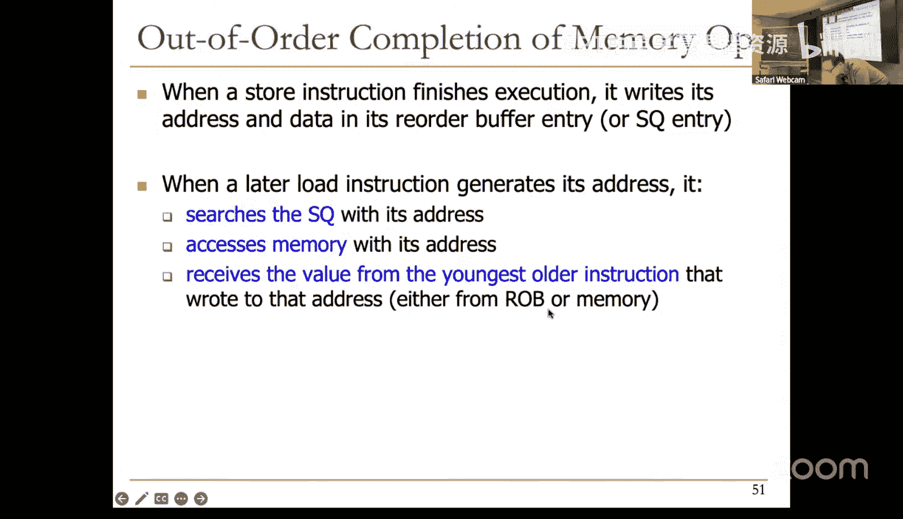
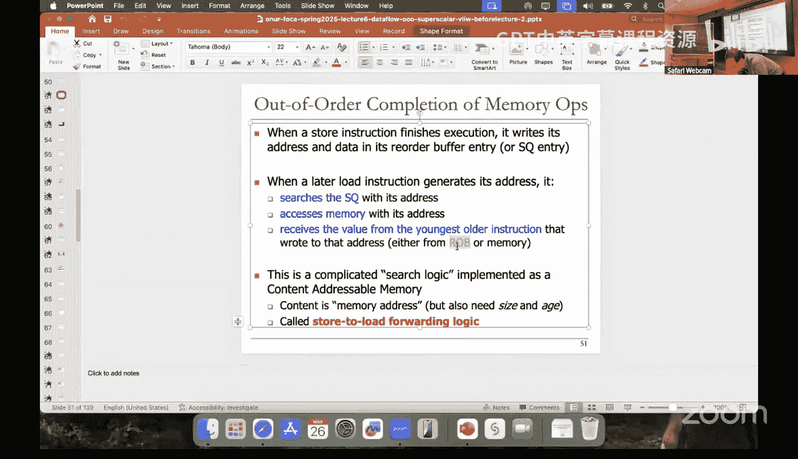
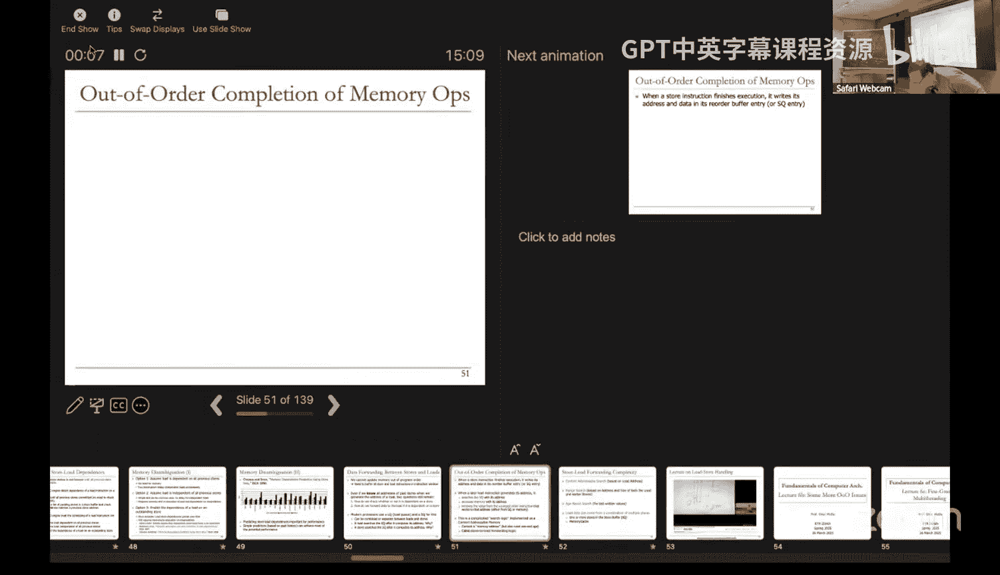
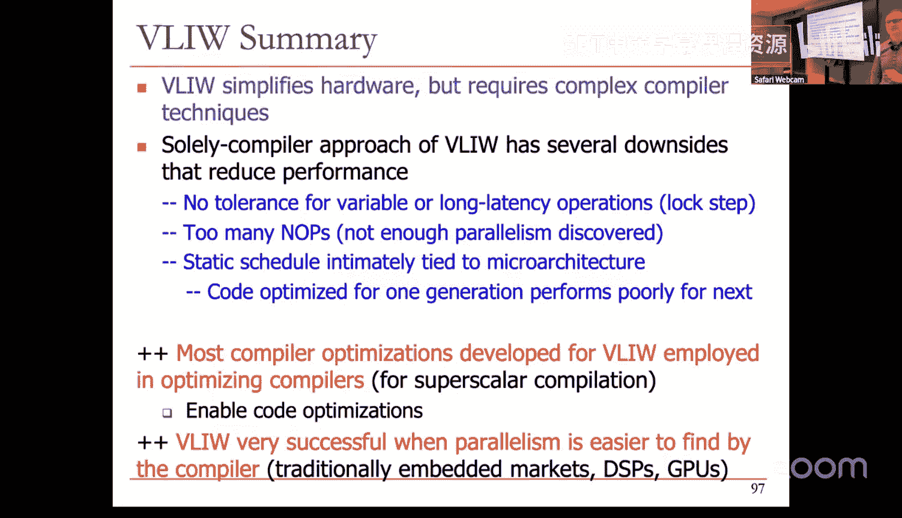

# ETHZ《计算机架构基础｜ETH Fundamentals of Computer Architecture 2025》中英字幕 p06 Lecture 6_ Dataflow, Superscalar, VLIW (Spring 2025).zh_en -BV1Xc19BnET7_p6-

It's already on。 I it good Okay， cool thanks cool cool thanks this Yeah。

 this one this one is better than the other one okay I might use this one at some。

You'll know it anyway。一社。because say。you have this presentation today。Yeah。Okay。Now。

 fewer people today， is it because of the rain？I don't know。🎼Yeah。🎼，🎼，Okay。

 I think we can get started， everything is good online， right okay？

Okay welcome to our sixth lecture today we're going to cover a variety of ideas actually。

Before we move on to other ideas， of course， but I wanted to。Have a nice flow of ideas here。

 I didn't include one of the ideas over here in this title because it didn't fit but we'll start with data flow。

And then we're going to talk a little bit more about restricted data flow。

 which is what we built Auto order execution is really a restricted data flow engine。😊。

And then we're going to talk a little bit about issues in out of order execution that are probably the most hairy issues。

 which is load store handling。Which is also one of the most difficult thing in data flow and then we'll talk about some other ideas。

 well let's talk with data flow。So you remember this slide。

 this is all it took to enable out of order execution， linking the consumer of value to the producer。

 we call this registry naming and then we've buffer the instructions until they're ready in the reservation stations。

😊，And then we kept track of the readiness of the instructions while they're waiting in the reservation stations or the readiness of the values in the register file。

And once an instruction made its value available， it's broadcast its tag， if you remember。

 and each instruction that's waiting for that tag captured the value and made that particular source up and ready。

 and we had a fourth point which is an instruction when all of the source opera。

 source values of an instruction become become ready then you dispatch the instruction。

 we call this the wake up and select because you wake up an instruction but many instructions maybe woken up in the same cycle。

Even thousands of instructions if you have thousands of instruction or reservation stations they need to select or schedule one of them to a given functional unit okay so this is really the core of auto word execution and this is to jog your memory this is all familiar right and you know the concepts we're going go a little bit deeper this is my slightly cleaner summary basically we have registertry renaming buffer and reservation stations tag and value broadcast and wake up and select。

And we have also discussed that Autoboard executions really restrict the data flow and Autoor engine processing engine dynamically builds a data flow graph of a piece of the program without actually graphically displaying it to you right and the data flow graph is really limited to the instruction window instruction window is all instructions that are decoded but not yet retired all instructions you can examine the processor essentially by just looking at them you can reverse engineer what's going on and we kind of did this exercise if you remember with our did you do this exercise at that time。

😊，Maybe okay great， we all have some example questions to have you do this exercise again。

 but this is a fun exercise actually to do you see you're given this machine and based on what you see over here and based on all of the operational principles that we've described on how an Autoboard execution machine operates。

 you can easily draw the data flow graph for the executing code。😊，Whatever you can see， of course。

 right？And maybe you will also be able to provide the executing code and sequential order。😡。

Now that's difficult， this is easy， the first one is easy based on what you see over here unless there are some absolutely weirdered cases。

 but you should be able to reconstruct the rate of flow gap。

 but going to sequential code is difficult。😊，Sometimes because。

What's happening here in the execution engine is out of order。

Remember you fetch the instructions you rename them and you put it into the reservation stations and at that point everything's out of order execution it's based on data flow principles it's not based on control flow principles we got rid of the control flow that's why reconstructing the control flow orders is difficult in some cases it may be possible in some cases it may not be possible in some other cases and this was a data flow graph with my not so great handwriting as you can see of the previous thing and you can you can do it on your own right do you agree okay。

😊，So basically you can easily reverse engineer a data flow graph of the executing code by looking at what's going on。

 for example， by just looking at over here this instruction and reservation station A one of its all print is not ready left all print is not ready right all print is ready it's values for it probably got it from the register file so you can actually think about that you can see that it could be a register for but it's waiting for tag X and x is actually in this reservation station so this multiply is going to supply this value source ones value to this ad and reservation station A and that's the process to which you can construct the data flow graph completely。

😊，Okay and that's the data flow graph and you can actually construct a sequential code as well okay so this is the summary you have data flow now i'm going to actually generalize it basically in data flow availability of data determines the order of execution and that's essentially what's happening in the core of order machine and the data flow node fires sources already and when we're talking about the data flow node it could be an instruction。

😊，And programs are represented as data flow gas of node， which is essentially what we have over here。

 right？It just happened that an auto order machine convert a sequential program to this thing。Okay。

Now， data flow at the ISA level， which I'm going to talk about， has not been as successful。😡。

We didn't talk about data flow at the ISA level， have you talk about that in any of your courses。

 okay？Not probably not because it's not been as successful and we're going to talk about why it has not been successful。

 but dataflow implementations at the microarchitect level while preserving controlflow sequential execution semantics of the One Neman model have been very successful because they basically shielded the programmer。

😊，And any other part of the software stack from this mess， which is。I of this mess。

This is not a mess in a sense， but we'll talk about why this becomes a mess if you don't have any ordering。

 the problem with this is there is no ordering over here， right？😡，Okay。

So AutoW execution is the prime example there's another place where this dataflow model has been very successful。

 especially more recently people have figured out how to map programs。

 dataflow programs to reconfigurable hardware substrates like FPGs and sometimes Asics of course and this has been very successful recently because this way you can map this data flow graph I'm going back again but you can map the dataflow graph directly into hardware you can instantiate for example all of these different functional units and connect the things together and provide the inputs and the hardware basically supplies the output right there is no control flow associated with it at that point it's purely dataflow and the beauty is there's no control flow overhead associated with it also right you just supply the inputs the hardware executes the data flow graph and the data comes out。

😊，Sounds good， but it's very hard to do it in the general case for everything in the world。Okay。Okay。

 so let's talk about the data flow execution model of a computer， any questions so far？Yes。

 how is this spent with FQJ？Aputators are really static in like how you program them doing execution。

Yeah you do you mean you have like always the same operation orders that's right you basically instantiate the state of flow graph and supply the inputs input may change of course。

 but you program the hardware such that it does this。Okay。

If you need to change the data flow graph then you need to go through some reconfiguration procedure which will take time。

 there's that overhead， of course， right？So this works nicely if all you're doing is something like this right if you all are doing this。

 for example， matrix multiplication。😡，And you actually kind of have a very nice data of low graph that you optimized for it。

 you just supply the inputs and get the output from an FPGA Aic would probably be better。

 but we will discuss in a later electro systolic arrays will be actually quite good for that purpose also。

Okay， very good questions okay so basically we've seen the one Neman model that's what we started with actually this fundamental computer architecture class in this case an instruction fetch and executing control flow order right specified by something called the program counter or instruction pointer。

😊，And you have sequential execution unless you explicitly change the order which using a control flow instruction。

 whereas data flow model， which a completely different model， and alternative to this。

 it was developed later than the Woon Neman model，on Neman model。

 Walon Neumman and his friends were developing this in 1940s。Data flow folks like Jack Dennis Arvin。

 they were developing these in the 1960s or so part of the reason why has not been maybe as successful that's good to think about it's later but basically in this model an instruction especially and executing dataflow now what does this mean when its up end are。

😊，Now we said just vegetables do all right， I just didn't say execute。

So that's a very interesting important distinction。So in other words， there is no program counter。

 there is no instruction pointer that coordinates things instruction ordering。

 fetch and execution is specified complete divide data of flow dependence。😡。

Each instruction specifies which other instruction should receive the result。An instruction can fire。

 whenever all its opera are received， fire means fetch and execute。

And potentially many instructions can execute at the same time this way。

 just like we see in automotive order execution， a very limited map。😊。

Does that make sense so you could see actually the whole system being represented as a data flow graph right this thing could actually be represented as data flow graph operating system could be a data flow graph programs could be a data flow graph and they all should are firing the node and the programs as well as the operating system would be firing based on when the data value is available it's actually not a not a bad model because in the end we supply data and that's how programs move。

Okay， so inherently the so are more parallel if you think about it。😡，Okay。

 let's take a look at an example of this this is a one Ne program it's doing something maybe nothing that interesting but consider that I have A and B that are the inputs to this program and Z is the only output to the program in a sense I only care about those right in the program as a I have two inputs one output everything else is there for intermediate values right。

So this is sequential clearly， that's one aspect of the program each instruction is executed in order。

 at least from the ISA perspective。What is the significance of the program order here？In a sense。

 there is no significance right as long as I get the correct value I don't really care about the significance direction。

 but of course there's another answer when I'm debugging this program。

 if I actually have a program order， it's much easier for me to debug this program because that enables me to think。

😊，Oh， at this point， this instruction should be executed and nothing else should have been executed right。

 we talk about precise exceptions for that particular reason。😊。

So but other than that there is no other significance I would say what is the significance of the storage locations this is actually more important for perhaps data flow at this point so if you think about the storage locations we have a w over here that multiple that is at storage the result of v multiply by 2 and then w is input to the next instruction and V is also input to the next instruction and then y is calculating V plus w and then z is doing x times1 so other than Z and A and B everything else is there for communication。

😊，Meaning those register values are really used for communicating data between instructions。😡。

And that's the of data the source of data core of data flow。😡。

There's communication that you need to do between instructions。

 do that communication through dataflow arts。😡，You don't necessarily need register for that purpose。

Okay， and this is the data flow version of this program in a graphical data flow interface。

 there could be another ISA specification which I will briefly mention， but we will not go into。

 but if you look at this program it achieves the same thing。😊。

You have A and B and Z you don't need to name these perhaps right internal intermediate values but it's also inherently more parallel right there is no ordering that's specified between this and this the only ordering is the availability of B and A if for example B arrives early this can fire early if for example A arrive is early unfortunately this cannot fire because it needs B also right？

So basically the thinking is that a node can get fetched and executed only when there are tokens in its arc。

 so you have basically nodes that are presented as circles over here。

 and then you have arcs that are connecting the nodes。😊。

And the availability of data on all input nodes enables the node to fire and produce an output token in its result node。

Makes sense。Okay， you can go through this， but you can see that this's inherently parallel。

 there is no origining。Okay， so I guess I'll ask you which model is more natural to you as a programmer who says sequential？

Yes， probably who says data flow。Okay you're not coming in living for in a different world yet yeah it's good to think about it。

 I think why is this more natural is it because we've been educated with it forever。😊。

And we have not seen this as much。Or is it because theres something fundamentally better or fundamentally more human in this。

 is it the nature versus nurture problem， right？😡，I don't think I' know want the answer。

If you're always educated dataflow， maybe you about start thinking about things this way。

Okay so basically let's talk about this model a little bit more in a data flow machine a program consists of data flow node and a data flow node fires gets fetched and executed when all of its inputs already I already said a lot of this when all inputs have tokens essentially so let me give you an example representation of a data flow node this is the graphical representation of the instruction。

😊，It has two inputs， one output， as you can see， and this is the ISA representation with some encoding。

It has an up code for multiply and it has one data value for this left up argument one and whether it's ready or not。

AndIt has another data value for the rightal print and whether it's ready or not。

You can see the ready bits over here， and then it has a curious thing thats says destinational result this is basically the address of the instruction who should receive。

Who should receive the token of the token？😡，Does that make sense。

 so that is the instruction that should receive the output token and if all of its tokens are ready it should be woken up at that point and it can actually get fetched and executed and you can connect all of these instructions this way。

Makes sense。Okay this may not be the best representation clearly there are a lot of data representationplication which we're going to also talk about later on from a modern setting。

 but this is one representation and you can imagine building programs using a relatively small set of primitives we're going to actually play a game soon with these primitives so pay attention to these notess。

So that was an operate instruction right you're operating on two data values multiply you could imagine add et ceter。

 now there's a conditional you can actually do conditional nodes and data flow also this one you can see that this one has two inputs。

X and F not F there's a boolean input over here on the right and there's a data input on the top data or control input you can think of it that way and the semantics of this data flow notice it fires when both of its input tokens are ready available。

And what it does is if。If the control input is false。

The input data x over here is past to the false path。

Meaning the full destination that's indicated by that direction right so the encoding of is slightly different from the multiply you otherwise the input is passed to the true path right this way you can actually make decisions right？

This this instruction so you can actually connect the data flow node over here。

 another node over here， actually graph over there in graph over here。

 you can say if this value is false， then this part of the data flow graph should be executed。

With this input otherwise this part of that data flow graph should be should receive this input and get executed so that's a decision so how do you actually generate that boolean value that controls the decision so it can have relational operators that look like this this is greater than operator it basically fires when both of its input tokens already ready as you can see and it basically checks whether the left input token is greater than in terms of data value the right input token and if that's the case it generates a true token otherwise it generates a false token okay so it can imagine many different ways of doing this。

Or many other types of relational operators clear。I like this barrier synchronization。

 how many of you have studied barrier synchronization。

okay you didn't take any apparel programming course yet or maybe they don't get to barrier synchronize there's a way of synchronizing programs or threads so if different threads are computing different things for example so you think of think of these arcs as coming from different data flow graphs right they could be you can think of that part of the data flow graph could be like a thread in our control flow thinking right and each of them are computing something and they all operating they all are look different maybe they all have different latencies etc and then you want to start the next level of computation next data flow graphs only after all of those threads complete their results because you may actually need to change something right so that's the idea of various synchronization start the next part of the task only when previous parts are all complete。

And this means that you have three outputs， three inputs in this particular case and all of the。

Inputs get copied to the outputs only when all inputs are available。Okay。This way。

 when all of the all this part of the program over here is complete。

 you can start the next part of the program， okay？Okay， so you could actually。

 you can see that these data flows can be arbitrarily complex also， which is fun to think about。Okay。

 my goal is not to go into a lot of parallel programming and data flow。

 but this is good to think about they're also intimately related。Okay。

 maybe I'll give you a task right now and give you a couple of minutes to think about it。

 so this is a simple data flow program。😊，As a hint。

 it's basically demonstrated in an iterative manner。But we have two inputs， one is over there， one。

 it's immediately available， the other is n， it's also immediately available。

 n is a non negative integer。And。We have one output out。😡。

Then the question I have for you over here is what is the value of out assuming this operates based on the data of flow principles？

Now maybe I'll explain a couple of these nodes over here some things maybe a little bit different。

 but basically maybe I'll walk through walk you through it a little bit so that you can think about it so this n gets copied to both of its output when n is available and n is immediately available so this node fires immediately。

😊，And then the token over here， which is n essentially copy node does n over here and n over here。

 this n goes to this branch node and this branch node is testing whether the boolean is true or not and we don't have that value available because there's a data flow chain over here clear。

But now let's follow this path， this is testing if n is greater than zero， and that's the case。

 so this generates a true token over here， that true token gets copied over here and over here。

Assuming n is greater than0， I just assume that implicitly So if we just assume that n is greater than 0 then if n is greater than0。

 you get a true token over here guys which means that this one gets passed to this true path and we don't change the output he So this one gets passed over here。

 but this multiply cannot fire because there is no token available over here yet so's follow this path So there is a true over here。

 an n gets copied So clearly n gets copied to the true output over here so we don't forget forget about that part。

 now we have n over here we copy n again So n goes over here。 n goes over here。

 So this node can fire there was one over here if you remember one times n is。😊，N。

 so you multiply as a multiplication node and then n gets circulated to。

Over here now so this becomes n in the let's say second iteration now let's look at what's happening over here n gets got copied over here we decrement it this note fire immediately because it's a unary note as you can see it's a decrement node so n minus one。

Get circulated over here and then you go through the same exercise over and or。

 it's an iterative computation， as you can see。Have you figured out yet？

What does this do yes yes it's n factorial assuming n is a non negative integer this computes n factorial and I giving you the first iteration assuming it's a n is greater than0 in the second iteration what happens maybe other people have also figure it out but I'll quickly mention it in the second iteration what happens is you have now n over here that goes over here and you have n minus one gets copied。

😊，Assume that M1 is also greater than zero or now so this becomes true okay I went ahead of myself you really fire this node first because this node cannot fire until this boolean is available see data flow is actually you need to operate like a data flow machine otherwise you may make mistakes so you get n minus one you're assuming n minus1 is greater than zero you copy it you get two over here two over here and n minus1 gets copied over here so you have remember n over here this was true n times n minus1。

😊，Get circulated back。Over here and you decrement n minus1。

 which becomes n minus2 Now you get the idea right you're multiplying n times n minus1 times n minus2 until。

This input becomes zero。When this becomes zero， this becomes false， this becomes false。

The value that comes from here gets killed， that's the killing basically you don't generate a token output and the value the value that comes from here。

 which is really am factorial goes to the output。Okay。

 so this is one way of implementing a factorial in dataflowlo it may not be the best way。

 but I'll let you think about better ways。😡，Okay。Okay basically the takeaway is that there is an IA level tradeoff that we're making and we assume one Norman model we assume a program counter right do we want a program counter in the ISA if the answer is yes you like to end up with control driven sequential execution and we already talk about all of this I will not harp on it if the answer is no you go back to data drivenve parallel execution now there are actually other kinds of models over here also I will not talk about what data flow is one of the dominant models。

😊，As we have discussed。And there are many， many high level tradeoffs over here。

 which I will not really go into like ease of programming， which one is easier to program。

 assuming your ISA is sequential versus data flow。😡。

I think most people think a sequential is easier to program and you guys seem to think that way also。

 which one is easy to compile into or can we make it easier for people to compile things into this model so that they don't need to deal with it as much。

Wwhichhich one has better performance in the end， which one extracts parallel and better。

 inherently data flow looks more parallel right， especially if you have parallelism in your program。

Which one more hardware complexity once you implement this。

 so there are a lot of questions over here。😡，So but I will give you the high level advantage。

 so the reason why restricted data flow implementing and art ofboard execution is because we can tolerate latency by exploiting irregular parallelism。

 you don't depend on regular parallelism like we will see later on。😊，In the end。

 only real dependence is constrained processing。And you can expose more pm than one moment model。

 that's a huge advantage。But if you have data flow at the ISA level。

 there are many disadvantages also。I'll go through this relatively quickly。

 you've seen more precise exceptions， right， precise state semantics。

We've seen the importance of the sequential execution model， even in sequential execution model。

 you may break it if you want to exploit parallelism。At least at the my architect level。

 but here at the ISA level there's no semantics in fact people have tried to impose some sort of semantics ordering semantics to the data of flow IA is very。

 very difficult。To do。You have to restrict parallelism in some way and you have to change the grand laity。

 et ceter， so you could do it at a course grand laity。

 you could have course grand laity sequential execution。

 which clearly restricts your parallelism right？But if you don't have this precise state semantics。

 debugging becomes very difficult， interrupt and exception handling becomes very difficult， et cea。

It turns out people actually built these data flow machines。

 which is also very interesting for many years from 1970s until early 2000s。

And what they ended up with a lot of a hardware overhead。

Imagine the internal part of the Outward execution machine that we have today exploded everywhere。

So whenever you're fetching instructions， you have to do tag matching for example。

 or whenever you actually decide yeah， exactly， whenever you were trying to fetch an instruction。

 you need to do tag matching to figure out whether the opera already ready。

So there's a lot of storage and also there's another interesting problem that they had。

 which is too much perils。😡，Meaning at some point there were actually so many instructions ready and to be woken up that these taggged matching stores became huge。

So they couldn't store everything in a small buffer。

 so they needed to actually have hierarchies of these reservation stations， let's say， right？

Today we don't have that problem because we have a sequential model that's bounding what we can do right。

 whereas in dataflow ISAs， imagine a huge data flow graph， right？😊。

you can have millions of nodes in that data flow gap and you could be executing over here something。

 you could be executing over here something over here something is based on pure availability to your data。

So you have no control over that pers unless you explicitly stop that and once you stop that。

 which one to continue becomes also a little bit。Bd because you have no ordering。

And also how to enable mutable data structures with things that get modify themselves I will not go through this。

 but there are a lot of interesting things over here that are that's。😡。

Are beyond the scope of this course。Okay， so the key takeaway。

 I think is people have made a similar trade off at the micro architectureitect level。

 we know ISA was micro architectureure。Exposing the programmer to a dataflow execution order turned out to be at least currently a bad idea。

Although it's very interesting， I think， conceptually， but exposing doing exactly the same thing。

 almost exactly the same thing， meaning executing the instructions in data flow order。

 while obeying the semantic specified by the ISA sequentialal semantic specified by the ISA has been extremely successful。

😊，And that's what I would like to end with almost。😡。

But if you're really interested there's a lot more on dataflow。

 these are some very interesting papers this is one of the original actually it's the original paper I think in ECO one on static data flow。

And then people have built data flow computers and I used to talk more about data flow in my parallel computer architecture class。

 which we don't have here really。

But I will say that these are some works from Yale Pat and his students at Berkeley。

 where they actually proposed how to take。A sequential ISA complex ISA。

 there are actually a lot of ideas in these papers。

 but these papers are the earliest papers that I could find that take a sequential ISA。

Converted to data flow nodes internally， they actually talk a lot about data flow terminology over here。

 data flow nodes and tables awaiting firing， for example。

 while at the same time providing precise exceptions。

So Auto of order execution ideas were there in the 1960s。

 in fact IM 369 and implemented the out of order Tommoso's algorithm that we have studied， right？

But they didn't know how to handle precise exceptions， they basically said， okay。

 we're going to keep exceptions in precise。In fact。

 they had to get special permission from IBM headquarters to enable that。

And they were given the special permission， which is good， they explored a lot。

 but those machines were not very successful if you think about it commercially because it was a nightmare to program。

😊，But it was very good for innovation。😊，So fast forward， let's say 20 years or so。

 these folks have figured out how to do autoboard execution with precise exceptions and that actually made all the difference so I'd recommend people to take a look at these papers actually these are some of the very interesting papers in micro architectureiture。

And you can see some of their modern looking designs over here。

And they have retrospectives on this also if you're interested in looking at that。Absolutely yes。

Well， okay， that's a very good question it's good to。😊，Out of order was there。😡，呃。

SoAnd then people develop the ISA level data flow model。

And these concept got merged in a nice way in these works。

 I would say okay I don't know which one came first I don't want to make that argument at this point。

 but basically they actually influenced each other and the key was really putting the。

Sequential ISA model with data flow restricted data flow exploitation and microarchitecture with precise exceptions so you preserve the precise exceptions and there are also a lot of other things over here that I will actually these papers cover a lot of things that we're going to cover now and we covered before they also talk about taking an ISA and breaking it into micro operations for example。

 you have complex operations or even simple operations you need to break it into micro operations which everyone does today as we have seen and these papers are actually describing that actually describe a complete execution model from the ISA micro architectureecture。

That's why I would recommend these they may be hard to eat and you can see the figures are not the best。

😊，そ。Oh yeah， well， okay。Okay。If there are no more questions。

 I'm going to jump into a little bit more automotiveor execution issues because it follows nicely from data flow。

Okay so let's talk about a little bit more out of order and then we're going to switch gears so this was this is also a slide that you've see is our initial out of order execution machine you have register a stable reservation station another reservation station modern machines are much bigger as we will quickly look at and then we added the architectural register file and the reorder buffer for precise exceptions remember that。

😊，And of course， we still need to have the reservation station somewhere。

 so this was our ouroric machine with precise exceptions。😊。

I'm going to talk about two issues in this machine。😡，One is value replication。

This is what I think Rahul did not talk about right did he get into maybe a little bit， okay。

 I'll go through the drill really quickly then。😊，Basically， if you think about it。

 if you actually carry values into all of these structures， front and register file。

 backend register file， registration stations， which could be a lot， and reorder buffer。

 then values are replicated everywhere， right？😡，嗯。So modern machines actually get rid of these replicated values what they have is pointers to values in a centralized storage and that centralized storage is called a physical register file today this makes the physical register file and more of a bottleneck let's say but still people do it because it saves a lot of area in the end so you have physical registers and each physical register has some value and the values are only stored over here unless they're bypassed of course somewhere and the frontend register map now it becomes an alias table map it basically maps the architectural register to the physical register theorder buffer doesn't store any values it basically has pointers to the physical register file。

And the architectural register file which towards the architectural state has pointers to the physical register file。

 so some of the registers over here are part of the architectural state meaning committed state and some of the registers are here actually part of the renamed state meaning they're being written by instructions that are in flight in the machine hopefully this makes sense right？

Since they whole covered some of this I'll go through the drill quickly but basically we have reorder buffer to support in order retirement。

 we have a single register file to store all registers both speculative and architectural registers and InfP are still separate of course。

 and we have two register map to store pointers of the physical register file the front end is used for renaming instructions。

The architectural visitor map or backend map is used for maintaining precise state。Okay。

And this design avoids value replication。😡，Which is good so let me walk you through it quickly so what you do at deco or renaming is you allocate a destination physical register to this architectural destination register and you do decoding and renaming just like we've seen in Thomas's algorithm you read and update the frontend register map。

😊，And then instructions go into the reservation stations， they don't store values。

 but they store physical register IDs pointing to the physical register file and after they get woke up and selected for execution right before execution。

 they access the register file to get the source values， okay。

And then they go to the functional units and after execution。

 they access the physical register file to write the result value， okay？😊。

And at the retirement time when an instruction finishes execution。

 it updates the architectural history map with this destination physical register。

 okay so basically you with a level of injection you solve their application problem it when。😊。

Is it let's the buffer yes it gets kicked out of the reorder buffer basically it has a physical register I in the reorder buffer it uses that to update exactly exactly so physical register I is used as tags also yes exactly so this actually has also the nice benefit that physical register I can be used as a tag。

😊，Now you don't need to use the tax from the reservation stage。

 you have one unified place where you can rename things this has another benefit。

Which you could have independently， but now you can actually do two things or kill two birds with one stone。

😊，Okay， so this is what this nice Intel paper from like 25 years ago describes right in Pentium3 this was not the case what I just suggested was not the case you had a retirement architect register file and you had a reorder buffer and this is what things looked like you had a single map and reorder buffer you contained the values。

😊，Whereas in Pentium4 architecture， what I just described happened。

 you have a single physical register file and you have the front end Regstrliaius table pointing to some registers for renaming and you have the backend Regliaius table pointing to register that our architecture okay。

Okay and if you actually read the papers that I mentioned。

 you will see similar things you have single register files everywhere。

 maybe these are not the best ones but let me show you okay this is from my runite execution paper this is my interpretation of Pentium for at the time which we built our models based on。

 but you can see that there's a physical register file that that comes after the reservation stations reservation stations are also called schedulers and they have an integer register file and then execution units you go to the execution units after you read your source registers from the FPR integer files。

Okay， there are beautiful papers here， which I will flash， but I will not talk about。

But we don't have really time to cover a lot of these。Like， I think this is what Rauls Jo also。Okay。

 now let's talk about perhaps the hairies issue involved in designing an auto order processor。

 I mean there are a lot of hairy parts clearly branch prediction is one of the hairy parts。

 but I think this is one of the real hardest parts because it's very， very hard to scale。

You hold and talk about this， right？Okay， we're going to talk about memory。

 essentially load storehand。So far we really considered reries and we said renaming regries。

 et cetera， but what about memory right？And there are fundamental differences between registers and memory register dependences are known statically compiler actually allocates to registers right memory depends are determined dynamic at least most of them right because the memory addresses are determined using base plus offset addressing as I have some register value and you don't know the value of the register at compile time right？

😊，Statically， you cannot do that analysis easily。Register state is small memory state is huge as we know。

 register state is not visible to other threads or processors。

 whereas memory state is usually shared when you have shared memory multipros。😡。

Now we're not going to deal with this one， although this actually causes complications in workstore handling as well。

 especially when you think about coherence， which you may talk about in a later lecture。

We're going to talk about still single processor basically you need to obey just like we obey register dependences。

 you need to obey memory dependence in auto order the machine as well。And try to do so， of course。

 while providing high performance。😡，And the problem is memory address is not known until a load or store instruction executes。

 in other words its address is computed this is very different for registers right when youcode the register when you decode an instruction you know which registers it' accessing so you can actually do all of this renaming and linkedIn instructions。

😡，Whereas you figure out the address only after an instruction gets executed a load or store instruction gets executed that's why this makes this twist makes this a very interesting problem and also a very hard problem at the same time so there are multiple corollries over here one is renaming memory addresses is difficult people have tried this it's not perfect it cannot be perfect it can be speculative and there are papers on memory renaming that i'm not going to cover more add more complexity and existing processes do some of this。

The second coroller is determining the dependence or independence of loads and stores has to be handled after their partial execution。

We'll see more of this right so whenever。Okay， maybe I'll I don't know if we need switch to over here。

 but you have a store instruction over here and you have a load instruction and this comes out of order。

This let's say this is computing some address， some address generation。

And you don't know the address of this。But this word address may be available much earlier。

 you know the address address is， I don't know，80。Because this law instructor executed much earlier because it was the part of a independence chain。

That was， okay， sorry， he went very quickly， but the switching overhead is not that great as you know。

😊，So basically， this load may have computers address。😊。

Before the store has computed its address because it depend on something that's long latency here now what happens over here is this load。

 you know its address。But you don't know whether this law is dependent or independent of the store。

So the question is， are you going to execute the orouts？

You may guess that this the store is not going to store to any bits that this law is going to read from。

 so it's independent。If you guess right you could start the execution on this early that's good if you get wrong to bad right you did something wrong so that's the fundamental problem basically because of auto order execution okay how do we get back here？

呃。There should be a better reconfiguration， this the reconfiguration overhead of FPGs。

 as you can see。😊，I don't know how to do that yet though yeah basically that's the fundamental problem we're going to try to look at。

And okay， thanks， is it all good， okay， go all good yeah。

And the third coroller is when a load has its address ready。

 there may be older stores with unknown addresses in the machine， that's that example specifically。😊。

Like。There are other issues also but I will not I will keep it simple for now so the question is basically when do you schedule a load instruction and auto of order execution engine？

😡，And I already gave with problem a younger Lord can have its address ready before an older store's address is no。

 this is also known the memory disambiguation problem， it's a mouthful。

It's called the unknown address problem in the papers that I mentioned to you earlier in the HP papers restricted data flow they call the unknown address problem in 1984 they say this problem should be solved。

 it's a very important problem， so read those papers they're actually kind of like the Bible for design of microproster design except nothing was designed at that point。

 this was 1985 right？I like the unknown editor better， but this is the term that's tick。

 that's stuck。Okay， so there are multiple approaches， you could be conservative。

 you could say I'm going to store this load until all previous stores have computed their addresses and even retired from the machine in fact。

Computing their addresses is not enough because you still need to check the addresses there needs to be some logic to check addresses。

 but if all load all of the stores have retired from the machine then you know that load does not depend on any other store right so that's the easiest that's the most conservative solution right。

😡，The previous one， all of the previous stores have computed their addresses and I have a buffer to check whether the address is match or done't match add some complexity。

 but a little bit less conservative， still conservative。

Aggressive could be assume that the load is independent of unknown address scores and schedule the load right away and if you made a mistake。

 well flash the pipeline， we know how to flush the pipeline， we do it for branch mis predictiondis。

 let's do it for memory dependence mis predictiondictions also right。😡，Okay。

There's an intelligent one of course， in between， predict with a more sophisticated predictor if the load is dependent on any unknown address store。

 if you think it's dependent。😊，Wait for that store， assuming you can actually identify that。

 otherwise scheduled。And if you made a mistake， then basically。

 I guess if you made a mistake by scheduling it， that means it was dependent so you need to flush the pipeline。

 if you made a mistake by predicting that it was actually dependent whether when it's actually not dependent。

 then you basically they took a conservative action， you lost some performance rate。

Okay so they are very interesting papers that are written on all of these but let's go into a little bit more detail。

 so essentially a lot dependence status is not known until all previous store addresses are available and there are two questions over here how does the out order engine detect dependence of a load instruction on a previous store and how does the out order engine treat the scheduling of a load instruction with respect to previous stores I think these are two different questions right you need to detect and you also need to do something about it。

😊，So the first option is， as we said， is the most conservative option you wait until all previous stores are committed so you don't need to check for。

That's very， unfortunate， that's extremely bad in terms of performance。

It turns out the other option is keep a list of pending stores in a store buffer and check whether load add matches a previous store at。

😡，Does that makes sense， so you have a list of all stores in the machine I have switch I don't know how to handle this but。

This is called a storm up。And store buffer is kind of like a reorgder buffer except it's specialized for stores。

You have the address that the store is writing to， you have the size。

 and maybe you decide stores the data value also， and you have some valid bits saying that this is a valid entry and then you have a heads and then you have a tail。

 let's say。And these are all the pending stores in my machine currently。

And there should be also an identifier of the instruction ID， something like that。

 or reorder buffer ID， you'll see that because you need to compare whether you're older or younger than the store。

 right？🎼At some point， yeah， so basically if a Lord needs to check。

I think I'm going to go through the sellls and then we're going to take a break later on。

 but do you have a Lord address？If you want to check whether you're dependent on a previous store。

Well， I guess there is also an address valid that you need to have right multiple vs because this entry could be valid point but whether the address is valid meaning ready is another question。

 whether the data is valid is another question over here so I could have ignored all those control bits but I didn't。

😊，So basically， when you get a load with an address。

 you need to compare to all of these addresses over here to find the youngest matching matching store。

Now thiss the youngest matching story。That's not enough what if you store multiple store what if you're loading。

 let's say one byte。😊，Sorry， what if you're loading four bytes and there are four stores over here supplying each of those bikes right you're loading something like this。

 one， two， three， four and one of these bytes should be coming from， I guess here。

 the other bite should be coming from here， the other bitete should be coming from here here so you really need to match multiple entries over here。

It's not a single match。So multiple matches are possible and that's also not enough because there could be a range match right you need to do a range search this。

This load address is a range right you have an address and let's say address plus four。

 you need to load those bytes， whereas some of the stores may be storing， let's say。

 the address plus three address plus5， right？I don't know this depending on the ice no no。

 the start for the pre just for checking the dependence of the load added no no range no no four bys so I'm talking about the grand layer to a bytes right now is each of this is a byte so a a plus1 a plus two a plus three actually it should be a plus three whereas another store maybe starting from a plus B。

 especially if you have unalwined loads and stores a plus3 a plus4 a plus5 a plus6 a plus7 right。首ごな。

Now how do you figure out that range overlaps？And then okay。

 I think I' already said the youngest batch so they actually this design is very complex as you can see right I just gave you a sketch of it。

😊，But this is real， this is what people design and people have opened up a lot of algorithms to try to simplify it。

😡，Simplification usually involves using things like bloom filters， et cetera， right？😡，Okay。

 so that was the option too， which I kind of got ahead on myself， but let's。

Let's go through the second one， so hopefully this's clear right？😊，And hopefully gives you an idea。

 I'm not suggesting you should design the load store engine right now。

 but if you go through and start designing it， you will see what I mean。Okay。

 okay now that was part of the issue right the other issue is you can assume the load is depend on all previous stores。

 you can assume load is independent on all previous stores and you can predict the dependence the question is how do you actually do that。

😊，Let's talk about this second part here if you assume the load is depend on all previous stores。

 there's no need to recovery， but this is too conservative。

 I think we've discussed this if you assume load is independent of all previous stores。

 then it's simple and can be common case there is no delay for independent loads。

 but it requires recovery and reexution of load and depends on misprediction。

It turns out neither of these options are good。😡，And prediction of the dependence of a load and an outstanding story is more accurate and it turns out load story depends is persist over time if you think about for example function calls。

 you write some values on the stack because you don't want to overwrite them in the function called and then you load them back at the end of the function call clear there's a very predictable dependence right on the stack。

And such predictable defenses may be not as predictable。

 but such predictable defense also exist in the control flow， et ce。

 but still you may make mistakes and this requires recovery and execution。So for example。

 Alpha 21264， that beautiful processor that I showed you the picture of initially assume that whenever you so it has a table。

 initially it assumed that a load is independent of all of the stores in the machine。

 but if it figures out that that was a mistake so you need to have a mechanism to figure it out。

 meaning whenever so okay， how do you figure it out there's another question right？

You execute a store。So this was a load checking stores。

 how do you figure out that you have misspeculated a load。

 you basically said I scheduled the load early assuming that doess not depend on its store whenever the store executes there needs to be a checking mechanism right。

😡，So there's another thing that's called a load buffer， which is not going to fit over here。

 sorry about that but。😊，Whenever a store executes。It does a similar search。On the load addresses。

And checks， are there any loads that actually executed？That I'm overriding the value of。

And those loads are wrongly executed that。Of course the values may matter actually。

 so you can actually check the values also so if you want to optimize you can do a lot of things clear。

 but that's the reason why they have a load bump also。Okay， okay， sorry， thanks。You know。

 fast configuration overhead， yeah。Okay， so you can see that this is a fascinating topic right and people have written a lot of papers。

 this paper by Moio was in thisca 1997 was a really important paper because it was the subject of a patent dispute between University of Wisconsin and Apple and also Intel I think and I think those companies had to pay a lot of money to the University。

😊，And then there' is this other paper from Christry and Em。

 but this is one example of why we are discussing this is really important how we handle this even in an old relatively old processor we're talking about 1990s over here today actually this become even more important because we have much larger instruction windows right these are instruction windows maybe 809000。

😊，Maybe they simulated 256 I don't know， but if you look over here， if you do no speculation。

 your IPC is low， if you do a naive speculation，😊，You assume they're independent。

 yeah it's better actually， but still it's not good if you do perfect speculation you get a huge boost。

😊，And they propose a mechanism that uses past history to achieve most of the potential performances at the time。

Okay。Okay， maybe I'll finish this and then we'll take a break。

 what do you guys think that'll be a clean finishing。

OkayClearly we cannot update memory out of I said most of what I wanted to say so it's going to go quickly clearly we cannot update memorymy out of program order that's not what we want to do so you need to buffer all store and load instruction instruction window so even if you know all addresses of past stores when we generate the address of a lowtooth questions still remain how do you check whether or not it is dependent on a store which is what we look at over here even if you know all of the addresses over here you still need to do this check。

If one of them is unknown。You not only do the check， but also do a prediction。😡，呃。

And then the question is， how do you forward the data to the load if it's dependent on its store？😡。

So basically if we use a load queue and a store queue for this， it can be combined or separate。

 most designs today are separate actually。😡，Because it's just too complex to combine them。

 it's not combining them has kind of the advantage that you have kind of a nice numbering。

Across a single queue right basically you have an LSQ load store queue as opposed to having mean just a store offer same value but just two tags for the no。

 no， basically each entry belongs to either a load or store。Yeah。

 as opposed to having a store buffer or load buffer okay the benefit of combining them is basically have a nice clean let's say。

 you know exactly the ordering between the loads and the stores。I don't know what To is technical me。

 sorry。Like time wise you understand theest exactly， you know， you know exactly yeah。

 exactly sequential order base， but you have that because these are allocated in sequential order yeah。

Okay。Okay， I think I've said this already a load searches the SQ after it computefuses address。

 which we have kind of done over there and a store searches the LQ after it's compute the address and we've also kind of did over here。

And the reasons are a little bit different。Okay。So when a store instruction finishes execution it writes its address and data in its reorder buffer or store queue entry。

 let's say I call it store buffer， but it's also called store queue when a later load instruction generates its address。

 it searches the store queue with its address。Access is memory with the status also。😡。

Receives the value from the youngest older instruction that wrote to that address either from the storekyio this should be Toio over here。

 like I don't know if I can clearly fix this。

Okay， I'm going to do it。

I mean， there was an earlier version of all of these when everything was in the reorder buffer。

 that's why this reorder buffer remains。Yeah。

Your slideshow， Okay， thank you。Okay， and we said that this is a complicated search logic and it's can be implemented as a contentdisciplinary and content is memory addresses we have seen was address。

 but also note that that address， how big is that address right？I mean， you do this。

In the virtual ladderer space， virtual ladders are for equals， for example。That's a huge tag。Right。

So you okay， anyway， too late。😊，But you also need to have the size and the age。

 which is kind of written over there with my poor handwriting。

And this is also called the shorterer load forwarding logic。😡。

So basically this kind of summarize everything I've said。

The complexity comes from the fact that there's a content addressable search based on load database。

 I'm ignoring the store searching for loads， which is kind of going to be similar。诶。

You do a range search based on the address and size of both the load and the earlier stores it's age based search for less written value。

 so you need to actually check all of the entries and check which one's older。

 which one's younger right you don't want to forward。😡。

A value from a store that's younger than the load clearly need to keep track of the ages fetch order。

And this is something that I did not talk about load data can come from a combination of multiple places。

 it can actually come from one or more stores over here fine right as we have seen over here but。😡。

What are three of these bikes？😡，Comes from three stores over here and one bitete comes from a memory。

Meaning cash， so you still need to have the logic to actually ring the data and merge the data。

So you need to access the cash also。So you don't get away from that。O。So theres more in this。

 but I think I've given you all of the key ideas， maybe there's a little bit more detailed description in this lecture。

 it's a short lecture if you're interested you can take a look at it。😊。

But that brings us to the end of the， let's say， some more out of order issues。

Any questions before we take a break yes the platform yes't really mess？It is， and that's what's x86。

😀Ha。😊，You don't want to have this right， or because you don't really have benefits from yes。Well。

 in the past， the argument was it's easier to write programs， right？

You don't need to deal with alignments et ceter， I think today it's much easier I agree that I think in today's world。

 the benefits are much less clear。But remember，6 was designed in 1970s， right？😊，Yeah。

 but that's a very good point。That complicates a lot of other things also because now you can actually that actually complicates your cache design very quickly before we take a break in your cache a load may be accessing two cash blocks right because a load is not necessarily aligned in the cache block boundary so you access one cache block in one cache set and in another cache block another set so if you look at exceed6 processor they need to support all of this in their caches so there cache are fundamentally more complicated than ISAs that don't have unaligned access support。

Yes， I one question okay， so yeah have all of this bookkeeping helps。

So forwarding and that gives us performance benefits。

 but the starting point was we don't want to update memory state in a speculative state but what if be like。

If the memory system will allow us to send speculative maybe like a confirmation that speculatives up because we specully modify memory state anyway it's just that we don't update the value you don't update the data value I mean the problem over there is others can observe that right it breaks I mean you have to change the interface you have to change the model in one known model it's not a lot。

You should not do it basically in one normal model。

In another model you have to change it and you have to really still be very careful right once you update it。

 what if some other processor consumes that value rate？😊。

What if it's part of the shared data structures？And you may not be able to then it becomes a cat and mouse game right you basically say。

 okay， I updated you specificallyly， but I want to fix it。😡。

Can you actually trace that value now you have to have data flow across all of those pro？

So that becomes very messy， I think。It goes into a lot of the data flow issues and speculation and data flow。

Okay， it's a good place to take a break， let's take a 10 minute break， be back at 1525。

And then we're going to cover some more concepts。ね。I don't know。I mean， maybe yeah。

 but you need to be very careful with the updating speculative updating of states is very dangerous yeah yeah。

 you don't want to do that if you want to probably put a lot of offers for everybody all levels of cash plus something is。

😊，Yeah don't even simplifyimplifiess the benefit of that。

It may push the complexity somewhere else if the spec can still get spec the course not forward want to forwarding because exactly you forwarding all of then。

The only thing that would help with it in your out cash。

And also theMaybe the younger specors most there， so you don't have to keep track of anything。

 but then you have to experience that。I know what you want unless you can get that's it without performing you can get rid of it。

 of course， but then thanks right you just aulative to your L get。

but I think there's value in the data flow models， maybe not the control flow plus all of this。

Especially with Tim and Na， there's a lot of opportunity。对。So one thing that okay， yeah。

 we don't update the data。在。We the memory that causes such you're not your value is value。

Your memory system cannot accommodate spec。Yeah，'m good to think about that's why these are fundamentals yes because that was the starting point I was like maybe。

😊，okay， maybe we can push somewhere guess people have look at this also yeah yeah。

 there's work but in general that。Yeah， its it hass a lot more complexity in those systems。😊。

They're not adopted and people have also started perfecting a lot of these right like they use they don't use exactly this sort of search。

 they use balloon filters， they use speculation within that。

 they use a lot of other things which are quite interesting。😊。

So they have scaled up the structures to 150 or so it used to be 24 or 48。

The load yeah store buffer is usually smaller because it's more complex， but used to be 24。

 I think they're scaled up by more draw magnitude okay， somewhere between5 x let's say。

With a lot of tricks yeah， but still this is the limiter in the end Yeah exactly you have to do that whatever gigHtz you're supporting that's another problem Well there's a lot of internal speculation going over here I'm sure some security researchers will figure out some side channel and make a big deal out of it our side channels。

😊，Those forwarding such challenges。は。😊，Yeah。但是呢觉得运做。の I challenges。

My comment was not directed at you don't we it was not directed at anyone it's just there's just so much speculation modern professors that you can find sidehow everywhere of course right。

😊，应该是啥个应该。Yes。感0。And there some risk。It China。我嗯。That's much about。不 just want see。also alsoさ。ありますば。

Yeah its things storage buffer， which is。府你知得你嘢。一全呢。But。如果啲咧啊。我南。嗯。Yeah order。公消息食接通知啊。same storage。

buffer structure and then you trying figure out what because the then。does it fit into？😊，1206年到。

边百分之三。そなかね。后 my question呢对个。リブ分。你系。你回咁咁。ああアイ。I'm trying to formulate my question I'm trying to figure out where in the timing the storage buffer and load buffer come into play because I'm trying to trying to get it my head like because you have your out of order execution or stuff you have your reader buffers vi out of of execution so as an example。

 we have a brand new execution of whatever instruction hold the instruction set and most likely out of order you want to bring out all your load load instructions out first this can take a lot fetch for memory so you calculate the addresses you send it out。

 basically get your courier boy to go out there， grab the data and then that data is then stored where once it's finally being accessed from storage is it gets stored into the load buffer which is like if yes's right when you get load you you put the load exactly so it gets put into load buffer it gets written in the load buffer load buffer and then once。

😊，And then low buffer is like so you have like your capsule of out emotions。

 you don't want to get a mix of game stuff。And then this whole data sets are they a outside within the upper this is within the upper we've been so you out of more machine within and then the load buffer and the buffer have。

 I'm assuming the electricity That's great Okays cool so that way you once in the rear buffer。

 you have the tags and they fire and it And then they gather that data from the load buffer。

actually load buffer doesn't need to you can actually store it and not necessarily I track of the essentiallys part of the schedule deal with deal with memory different。

 these are all concept but this is part of your schedule else once buffer。

 think about you I'm just trying to sure， sure， connect things together okay。😊，ItSo let's start。

yeah yeah， there are a lot of issues in auto order execution as you can see I mean。

 you need to think about it and you actually if you really need to if you really want to know about it you got to design an auto order machine and work on it it is fun to do it but if you think about it one of the questions like one of your colleagues was asking was what is this a part of like is this a part of is this a reservation station in a sense a reservation station actually right if you think about it this is how you determine whether a load can execute right it's really part of the auto order core auto order scheduling engine a part that we really did not talk about we talk about ads and multiplies。

😊，Go deal with the registers but this is the part we didn't really talk about and this is the part that's really more messy。

How do you， how do you get a load executed， how do you get a store executed， right？

And I did give you the full picture because a full picture will take days and days and days。

 and this would be a course on just automotiveward execution， right？Okay， but yeah， think about it。😊。

It's better to like focus on the ideas， but maybe at some point it's good to have an automotive implementation as part of the lab。

 what do you think？😊，Yeah， it's good to be in the full project， yeah。😊，I did that in my undergrad。

 so I had I implement an out order processor， which was fun。And in very luck。

It was lot and see it's easy。Even in C this part is complex， you know？😊，But in very log。

 you can imagine how much more complex it is。Okay now let's move on to other ideas this requires some more time to sink in I believe we talked about fine grade multi threadreading but I want to quickly go to give you the basic idea again because we're going to revisit it when we talk about GPUs because all GPUs implement this today but the idea is much older than GPUs and the idea in fine grade multithing remember we talked about it so that we can we don't need to deal with data and control dependence right and the idea is to fetch different fetch from a different thread every cycle such that no two instructions from a thread are in the pipeline concurrently and if you satisfy that constraint that means that you don't need to do any branch prediction control dependence prediction or data dependence checking because you guarantee that the no two instructions from the same thread are in the pipeline concurrent it kind of looks like this basically if your pipeline looks like this you basically have instructions from different streams。

So for this to work， of course， the hardware needs to have multiple thread contexts。😡。

Architectural states program counter plus registers birth threat。And。

The implicit assumption is that threads are completely independent。

 but we know that that's not necessarily the case they can communicate through memory so memory still becomes a problem over here so this thing doesn't go away and we find game multi threadreading okay。

😊，But maybe you can handle it a little bit less heavily， let's say。

 because it may not be as impactful and performs。So no instruction is fetched from the same thread until the prior branch or instruction from the thread completes。

 actually it should be instruction。If you're dealing if you're doing this just four branches it could be branches of course no logic basically a huge benefit is there's no logic that's needed for handling control and data depends within a threat and you get high thread level throughput every cycle you're pitching from some other threat right this is the reason why GPU is implemented well both of these are actually reasons why GPU is implemented。

😊，As we will see， of course， the downside single threat performance suffers。

So if your pipeline is 15 deep， you're fetch from the same instruction every 15 cycles thread。

 the same thread every 15 cycles。You get extra logic for keeping thread context。

 which may be expensive depending on how big your register file is。

 and you get throughput lost when there are not enough threads to keep the pipeline full。Makes sense。

 right？Like the good news in graphics processors was the reason they went to this reality is。

 they were pressing huge number of pixels and there's a lot of parallelism。

 data low parallelism which could be exploited with many threads and that's what actually gave rise to the modern GPU programming models as we will discuss in a couple of lectures。

So this is a good model for that type of systems。So the basic idea is each pipeline stage has an instruction from a different。

 completely independent thread， assuming thiss your pipeline。😊。

So this means that you need to replicate a program counter and register file for each thread and you need to add multiplexors and control。

Okay， I've given you all of these ideas I think， so this was actually proposed in the 1960s。😊。

Berton Smith did a lot of work on actually popularizing it in his heterogeneous element processor and later in his work in Terra Computer and Cray。

 but basically you can tolerate control and data depends resolution latencies by overlapping latency with useful work from other threads。

You also improve pipeline utilization by taking advantage of multiple threads。

 you improve thread level throughput， but sacrifice per thread throughput and latentence。

Just an example， you can see that you need to replicate program counters。

 you need to replicate general purpose register registers。

 you need to clearly have multiplexors to select the threads。

 multiplexers to select which register to read from， so it comes at a complexity。

This was San Niagara which was one of the earliest multi corere properties， it's not the earliest。

 I think IBM actually is earlier in its pursuit。What it did was essentially it was fine grain multitrait。

It was actually one of the Wiimpiest processors their goal was to。

Their goal was to actually execute commercial workloads where they thought thread level parallelism was much more important than instruction level parallelism and they designed this process and over time they figured out this was a bad idea and they added more instruction level parallelism techniques so these are the folks actually that eventually added run ahead execution and that added other stuff to actually keep the results in the pipeline so that they could get instruction level parallelism from runed execution also but their initial design was like this very simple pipeline and you can see that I think there had four threads yeah yeah you can see that there are four threads。

That you could switch between， you can see that the register files are multiplied by two。

 everything is multiplied by two， essentially。sorryrry。

 not to multiply by the number of threats that you support。Okay， including store buffer。

 as you can see。Okay， I think I've given you a lot of these advantages。

 so I will not talk about these again I've given you all of these advantages。

 disadvantage I've also given you extra hardware complexity。😊，With multiple hardware contexts。

 reduce single thread performance， if you cannot overcome that which I think Sun figured that out。

 that's not very good， GPUs have not figured this out yet because they still have a lot of parallelism and they execute workloads that are quite parallel so they haven't gone to the at least in the core graphics pipeline。

 they haven't gone to exploiting techniques like instructional appism techniques like our execution right。

诶。Okay， and you also get， I think this was mentioned in one of the earlier lectures when I brought up fine grain multi threadreading。

 you get resource contention between threads and caches and ma rate。

So we haven't replicated the caches and memory。Cs and memory are still steady。

 but you may need to increases because now you're supporting working sets from multiple threads。

 right as opposed to executing a single thread。And it depends on checking logic。

 if mean threads still may be needed。😊，For loads and stores， right？

Does that sound good I've gone through this route really quickly because we went through the idea but and I also have redundancy in the slides。

 but just is an important concept that we will get back to when we talk about GPUs。Okay。

 and there are more lectures if you're interested。Okay， any questions？Okay。

 if this was a multi thread lecture I would not stop at fine grain multi thread I would talk about like simultaneous multi thread et cetera but so there are a lot of different methods of multi thread fine grain multi thread is one example。

 which essentially。ItMake use of a simple pipeline right and basically kind of roundro ins that across different threads that's what you're kind of doing if you think about simultaneous multi tradinging or what Intel calls hyper threadread you have a heavy out of order machine already out of order superscalear machine and the realization in that is this may not be very well utilized by a single threat so let's add more threads。

And we can actually fetch from different threads at different cycles。

 and they could be executing in the out of order substrate。Concurrently。

That's the idea of simultaneous multi thread。It's a very different starting point and very different goal。

 but still you need to have thread context to enable that because it's also a concurrent thread execution。

But again， maybe in a later lecture， we'll talk about that。

So there are many different forms of threat okay i'll also talk about superscale clusters very quickly this's also a relatively easy idea but we have not shown this picture yet but we're actually covering some of the different approaches to instruction level concurency we start with multicycle pipelineing auto order execution data flow fine grain multi threading and we're going to cover VLIW time permits today at least part of it。

😊，And then we're going to move to SD pressing systolic arrays later on。

 but let's talk about superse execution， I've actually mentioned this but let's formalize it very quickly the idea here is very simple you fetch thecode execute retire multiple instructions per cycle that's the idea as opposed single instructions NY superse means and instructions per cycle。

so clearly to be able to do this， you need to add the hardware resources for doing so whenever you want to exploit more parallelism。

 like in fine grain multi thread or superscale， you need to add more hardware。

Hardware performs the dependence checking between concurrent efficient instructions this is the key we're going to contrast this with theIW very。

So you need to add logic not only to support multiple instructions per cycle。

 but also depend checking logic to check dependencies in instructions that you're concurrently fetched。

I should also mention that superscalealar execution and Auto order execution are orthogonal concepts。

 so you can have an in order super scalar machine and an out of order scalar machine。

It's perfectly possible to all of those， but sometimes people mix these。

So you can have all four combinations of this Cartesian product essentially。Okay。So very quickly。

 you need to have multiple copies of the data path。

 you can fetch Decode to execute multiple instructions per cycle。And you can see that。

dependences make it tricky to dispatch multiple instructions the same second basically with the same PC you can fetch two instructions from two consecutive locations let's say right and then you need to have enough ports in the register file to fetch the necessary outs。

 enough write ports， enough read ports etc， enough AL use to execute two instructions enough data memory ports etctera it's a simple in order processor so it's easy to see this but in an out order processor this complexity bowls up a little bit。

Okay， I already said this， but maybe we'll take a essentially you need to have depend section between concurrently fashion instructions。

So this is one example very quickly from a Harrison Harris book， that's a DDCA book。

 digital design and Comp architecture book， if you look at this MIPS code。

 it's nicely written such that consecutive two instructions can be executed independently because they're independent of each other。

That sounds nice， the ideal IPC is two and you get two IPc assuming you have a2 a super scaling machine here。

But life is not always that beautiful。You may actually have somebody may have supplied your code that looks like this and in this case the ad is dependent on the load because load produces t0 and ad reach t0 clearly ad cannot be scheduled in the same cycle as the load so you basically waste some cycles。

 so even this in order superscalealar cluster your actual IPC becomes 1。

2 in this piece of code right。Very close to one， even if you have two way super scalealar。

 so this shows you the importance of quote scheduling in order super scaleal。😡，Does that make sense？

With Out of order， it's actually much nicer cleaner because you can exploit latency。

 so Auto word execution doesn't have that huge of a performance dependence on code scheduling in the end。

Because we do dynamic scheduling right that's the name of the other word here if you have an in order super scalar if you want to really get the benefits of the machine。

 you should do do good static scheduling of code。😊，Okay， basically the question is。

 can you reorder the instructions to get IPC equals to， I don't remember the answer。

 but you can probably tweak that。Okay， so we can employ everything we discussed in supersar clusters for handling flow dependencies。

 essentially， so you can have a supersar processor with fine grain multi thread for example etcter。

 but I will not talk about this， hopefully this is clear these are you can do value prediction in a supers processor。

 you can do autoor superscalear which is detecting the dependence that move out of the way etc。😊。

Okay， let's talk about trade offs clearly superscalealar is good for higher instruction tro you cannot get more than one instruction per cycle。

😡，If you cannot fetch more than one instruction per cycle right you're not going to magically create those instructions。

 you're limited by how many instructions you can fetch per cycle。

That's that's called Fl's bottleneck， by the way， in with a reference to Mike Flint who has done a lot of work on computer arithmetic and who was actually responsible for the。

SMD MIMD terminology， CD terminology， which we may talk about when we get to GPs。So clearly。

 we want to fetch more than one instructions per second。

Higher IPC means higher instructions per cycle and lower CPI。

And we call the execution time of a program right， whats super scale does it reduces the average CPI or improves the average IPC。

😊，To disadvantage you get higher complexity for dependence checking right now you cannot do what we just discussed in out of word execution right in out ofward execution what we were doing was we were renaming a single instruction a single cycle。

Now， imagine renaming tennis fractions of a singles。How do you do that？

You don't want to serialize that process。So you need to have additional hardware dependence checking logic that checks。

Quickly， combinational logic that says quickly， which instructions are dependent on each other。

So imagine extending that renaming process to 10 instructions per cycle。

Either your cycle time will increase or you need to have more pipeline stages to do rename and existing processes kind of do both。

😡，You have multiple stages for renaming if you look at Pentium4 for example。

 decoding and renaming takes multiple stages。But they also need to extend the clock cycle a little bit。

Okay。Again， it's not just something I won't go into。

 but if you design auto to order superscalealar posture， your headache increases。

 that's the takeaway。But your performance also increase， that's the good part。😊。

Your headache doesn't come without benefits， let's say。Okay。Okay， registry。

 I already said all of these， I think I already said that also， yeah。😊。

More hardware resources are needed clearly for defense checking as well as executing instructions concurrent。

Okay， so Intel Pentium was an in order superscalear machine。

 which was very much depend on the compiler， so they had these two pipelines。

 I guess U pipeline y pipeline and these were two different instructions that would go and they actually developed a lot of compiler technology to make sure this gets good performance but they also Alpha 21164 is also in order superscalealar these are just some example machines again you don't need to know all of these clearly but it's good to know the history a little bit。

And Intel figured out that okay， this is just too hard to get performance on so let's move to auto of order execution。

 so they were quite influenced by those H papers， for example， that I mentioned and。

They did design the first let's say commercially success auto order machine。

 like today all high performance processor lot of order get the for 21264。

And the superscalealar width is increasing， so I'll go through this quickly。

 but if you look at superscalealar width over here。It's eight white。

 right at some point people were joking nobody would build something that's more than four white。

 we already at eight white and maybe 16 white soon。

So8 instructions per cycle and actually that's the fetch fetch width clearly that bottle exploit of what you can do。

 but internally the width is much larger， right？😡，So this is the internal width。

 assuming this is true because this is a reverse engineer at Co Apple is not telling you what they do internally。

 but you can see the internal width。😊，I don't know， can you count？Maybe at least 10 over there。Yeah。

 probably bigger。And you can see that actually storerque queue size and load queue size that they have。

 this is not the latest processor， but you can see 1 hundred storerque queue and 150 load queue。

 so that kind of jives with what I said it's harder to design the storeque queue than the load queue。

Okay。Okay， do we have time to go through BIW， any questions？Yes。

 so the advantage of superscalealar out of photo processor where regular out of water processors is that you can prevent instruction buffer star。

 is that something that you actually observe。Well， I wouldn't put the advantage that way。

 clearly that's one of the advantages， but I would think about it this way。it's a cu， right？

You can can get out。Something only at the rate at which you put in something right if you're putting one instruction per cycle you're going to get out at most one instruction per cycle so the advantage is really throughrupput。

If you can put in 10 instructions per cycle， you can get out the  tennis instructions per cycle now there could be cases out of order in the maximum in some cases you can fish multiple instructions per cycle that's true。

But on average， you're not going to get more than one。Does that make sense？So it's true。

 but in the end。Yeah。So even if you're not starving your instruction buffers， you'll get benefits。

 but if you're starving your instruction buffers， you'll also get benefit from super scaling。😡，Okay。

 any other questions？Otherwise I'll move to VIW since we have time at least I'll give you the basic concepts because and the reason I wanted to cover things in this order is because it comes from basically the data flow which is quite complex and then we went into complexity that's present in existing process which are quite complex because they're actually really doing data flow this is all these are all issues in data flow all of these issues that we discussed again amplified in data flow if you think about data flow and then superscalear adds even more complexity but people who are not always thinking about this way。

Let's talk about a different way of thinking， and that's the VLIW。But before that。

 we covered a lot of these， as you can see。Okay， what is ELIW？Essentially。

 we've talked about superscalear just now， superscale says hardware fetches multiple instructions and checks dependencies between them。

VLIW is a completely different philosophy。It basically says hardware should be simple。

 software should be smart。😡，Software packs instructions in a larger instruction bundle to be fetched and executed concurrently。

And hardware fetches and executes them concurt hardware doesn't need to do any dependence checking。

 basically。That sounds good and the concurrenly fetch instruction。

 the VLIW model actually in the realL VLIW model there's no dependency checking that you want in hardware。

Simple hardware complex compiler。Does that sound good or complex programmer？

Hopefully just a compiler because if you pump us on the program， it's not easy。Okay。

 so this is my pictorial view of VLIW you have a single program counter that specifies multiple operations。

 multiple instructions， this is the bundle that I was talking about and these are completely independent operations。

😊，And it's the compiler responsible or the programme is responsible to figure out how to pack independent operations together。

 if you can find assuming your fetch like BIW width is four。😡。

You should find four instructions to be fetched concurrently that are completely independent of each other。

Makes sense。There are other benefits over here， the compiler can actually know the structure of the machine also and basically say oh I'm going to align the instruction so load units is only over here so it can pack the load instruction only over here。

Meaning， whenever you fetch the instruction， you have a direct path to the execution unit。

That's not kind of the case and auto we didn't talk about this in detail。

 but if you think about autoor superse proceduress。

 you fetch instructions and you need to have kind of a routing network to decide which instruction goes where right in the reservation stations you need to decide where which reservation station to put things into and that actually is not let's say cheap people do it but they have to do it。

With VLIW， you can simplify even that part。 You get rid of the routing network because the compiler knows the structure of the hardware such that。

If the load unit is only here， for example。The compile doesn't put the load over here。

 it puts it over here makes sense， that gets rid of some complexity in heart。

 so that's in line with the philosophy。And this is introduced by Josh Fisher in this beautiful paper in ISca 1983。

 you can see that a very long instruction work guide architectures and the ELI 512 ELI is enormously long word instructions and this nice paper Josh Fisher is a nice writing style which will not get accepted at conferences today。

Okay， but if you look over here， why is it called very long instruction word。

 it's not just one instruction it's multiple instructions packed。😊，As a single bundle。Okay。

So I've already said this basically packed together by the compiler。

 multiple independent instructions， packed instructions can be logically unrelated and we're going to contrast this with CID soon in CD vector process。

 instructions need to be the same operational need to be the same here， there is no such restriction。

And compilers find these and independent instruction。

 aesthetic statically schedules or packs or bundles them into a single VLIW instruction。

So traditional characteristics of VIW， you still have multiple instruction fiction execute like super scaling。

 you have multiple functional units。😊，All instruction in a bundle are execute on lockstep。

 either all or non complete and you go to the next instruction instruction in a bundle aesthetic statically are statically aligned to be directly supplied to the functional units。

 I already said that。You can still pipeline things， of course。

 right there you can have a very deep pipeline that is executing these instructions。

But if one instruction stalls for some reason， all of the other instructions need to stall and this becomes a problem with memory instructions。

 so memory is always the problem when we get to memory this becomes tougher。😡，So for this to work。

 the compiler needs to know the。Like it could clear the dependence characteristic of the instructions as well as the latencies of instructions because in in a like in an。

In a full VLIW machine， the compiler schedules every single execution slot in the machine。

 not just which instruction gets bundled together， but what is the next instruction？

Is the next instruction， if I have a pipeline， for example。

 how do I fill the pipeline such that nothing needs to solve？😡，Okay。We've seen this earlier。

 like code scheduling to actually make sure you don't need to detect any stalls。

 it's the same philosophy take to the extreme。Okay。

 so this is an example of the light that we performed with bundles very quickly again。

 these three could be different bundles and assuming the compile did a nice job， you get perfect IPC。

😊，Okay， so what is lockstep， lockstep is all or non execution。

 if any operation haveIW instructions stalls， all concurrent operations stalled。😡。

In a truly real IW machine， the compile handles all dependency related stalls。😡。

Hardware doesn't perform any dependence of chicken。Which is kind of idealistic。Of course。

 once you get into variable latency operations memory stalls。You start wondering， right？Basically。

 if you have a cache miss， hardware needs to do something。

 at least it needs to stall the machine such that nothing moves on， right？

But then that the lock step part kicks in at that point and nothing in the machine moves on until that bundle finishes。

Okay， if you want to know more about the philosophy。

 this is a paper written by Josh Fisher in 1984 and you can see the philosophy right parallelel processinging a smart compiler and a dumb machine。

Very different from what we have built。So far。But it has a lot of impact also， as you will see。

So philosophy is actually similar to reduced instruction set computers， which。

Essentially advocate simple instruction and simple hardware right risk is really originallyly developed up by John Cockt IM IM 801 Min computer is an example except here you have multiple instructions in parallel and viaIW。

😊，Okay so what is the philosophy of risk essentially compiler does the hard work to translate high level language code to simple instructions in fact John Kok went to a huge extreme he basically had this thought process where what if the compiler actually generated every control signal in the machine。

😊，It's a complex compileilr。But the hydr can be very simple， you may have very few control signals。😡。

Okay that led to a lot of compiler technology development clearly。

 so you can reorder simple instructions for high performance that's what risk is and hardware does little translation and decoding so it's very simple。

VIW takes it kind of to the next step， compile as the hard work to also find instruction level parallelism。

😡，To schedule everything concurrently， right？And hardware stays as simple as possible execute each instruction a bundle and lock step so hopefully this is clear right so what is what is good about this in hardware now hardware can be simple higher frequency easier to design low power you don't need to deal with anything of this hopefully right。

😊，But the performance may not be high and we will see that so this is from Josh Fisher's original paper I don't know if I want to say anything over here maybe yeah okay。

There is one central control issuing a single long instruction per cycle。

 each long instruction can many tight decoupd independent operations， tight decoupd means lock step。

 each operation requires a small statically predictable number of cycles to execute。This is the part。

That is not true necessarily in many many operations， right。

 so statically predictable is the difficult part。Okay。So commercially。

 people have tried to build these actually。Josh Fisher himself started companies for example he built 28 white VLIW machines like 28 this is more than his enormously longword instructions Bob route did a lot of work also similarly they developed a lot of let's say VIW compilers we're going to talk about that briefly I mean there are other also most successful ones are commercially these digital signal processor and embedded processor and some GPUs that used to employ viaIW they have been quite successful so there's a lot of interesting history in VIW in my opinion that's good to think about so Intel IA 64 was not fully viaIW but it was based on VIW principles they called it epic explicitly parallel instruction computing。

😊，Basically， they violated the fundamental principle of VLIW instruction bundles can have dependent instructions。

😊，Because they figured out so okay， that what's the problem like why why do you want to have this right if you have let's say a semi mile machine even a four wide machine if what if the compile cannot find instructions to schedule concur？

😡，Well， what does it do it in the certain knobs？😡，So you may have a four wide BLIW machine with on average you have three knobs per cycle that doesn't sound very good。

 so Intel said basically can we're going to specify these dependencies explicitly in these bundles。

So a few bits in the instruction format specify explicitly which instructions in the bundle are depend on which other ones。

And they had a lot of other stuff for compiler support in the end this was not commercially successful。

 they built titanium machines， a lot of people made fun of it as titanium titanic machines or something like that。

 et， but I think this was all of this is really in my opinion very good effort people should be trying out new ideas and failing because if you don't try out clearly you're not going to fail。

😊，But this failure actually led to a lot of interesting developments。

 so I'm going to talk about that quickly before we finish so the huge advantage of reality of course simple hardware right no need for dynamic scheduling compile as the scheding。

😊，Noor need for depends checking again simple hardware no renaming actually people have developed a lot of compiler based renaming techniques to enable this no need for alignment distribution so simple hardware in the end the huge advantages simple hardware right the disadvantage compiler needs to find an independent operations for if it can add in nodes in a VIW instructions and people actually try to figure out how to reduce it so a lot of compiler development technique compiler scheduling techniques have been developed to。

😊，Improve parallelism， instruction level parallelism in a single cycle。

And these are actually used in many compilers today。😡，So this clearly， if this doesn't work。

 you get parallelism loss and also you increase the code size because you need to encode the knobs。

So people have come up with smartnob encoding techniques for VIW machines so that you don't need to encode a lot of Knbs。

😡，Which doesn't sound good clearly， right？And also there's another disadvantage which is hard to get away from unless you have a dynamic compiler you to recompile when your execution with instruction latencies and functional units change。

So if you want to improve the micro architectureitecture。

 now your compiler or program is tightly coupled with your micro architectureitecture。

 so you have to change your compiler and also you have to recompile it， right？😡。

So that's a disadvantage clearly， but this is kind of an example of a tightly decoupd hardware software code design while still having an ISA。

😡，Okay， so a lock step execution causes independent operations to stall and no instructions can progress until the long latency instruction completes and this becomes a problem with memory。

So once you have a load long latency cash miss in a VLIW machine， everything stalls in the machine。

Because everything is statically scheduled right that's one huge disadvantage compared to out of order execution so compiler doesn't know how to deal with variable latency operations and the right and that was actually by design right if you remember what Josh Fisher wrote over here。

Each operation requires a small statically predictable number of cycles to execute。

 loads violate both of these。😡，Well， statically predictable， they violated。

 they're basically variable latency and sometimes they're not small at all。Okay。

 so that's why Out of execution was quite successful compared okay， so let me summarize。

This is a one slide summary the impact of theIWIS， it simplifies hardware and requires complex compiler techniques。

And the solelyle compiler approach of the LIW has several downsides that reduce performance。

 I think one of the most important ones I mean， of course there are business concerns right。

 it's hard to recompile et ceter， code， it's hard to change the ISA apart from all of those business concerns。

The lack of tolerance for variable and loan latency operations。

 this lock step property in general has been a problem with this。

 it's very hard to tolerate variable latency and many operations that we deal with are really variable lat loads。

Too many knobs has been a problem， not enough perismm discovered and the third issue is static schedule is intimately tied to the micro architectureitecture。

 so you optimize the code heavily for this generation and then you come up with a better micro architectureitecture。

The code that you optimize very nicely performs fully for the next generation， right？

Thats that's almost always not the case when you actually develop a new micro architecture for an out of order processor。

 right？😡，🎼Okay but the huge advantage of theIW has been on the compiler and software side let me finish this and then we'll be done basically that's why I have plus pluses over here most compiler optimizations developed for VLIW are actually employed and optimizing compilers for superscalear compilation as well so they've had superscale processors especially in order superscalear processor but also auto order superscale processors theyve enabled to code optimizations also if we had time to go through slides I would show you one example with super block compilation so it's been actually very influential in compiler development。

And also theIW is very successful and parallelism is easier to find by the compiler traditionally there are some markets that do this like it's a small market。

 I would say， but you need to write。😊，Code that's not dependent on dynamic effects。

 maybe realtime code right in automotive markets you see that sometimes although that market is also quite changing it's not as it used to be but some embedded markets used to have code that is very static and as a result it's mapped nicely to be aIW as a result these companies like TI for example they developed a lot of AIW processors and DSPs。

And GP early GP。Okay， this is a good place to stop， we'll pick it up next time and continue。

Okay， I'll see you next week。