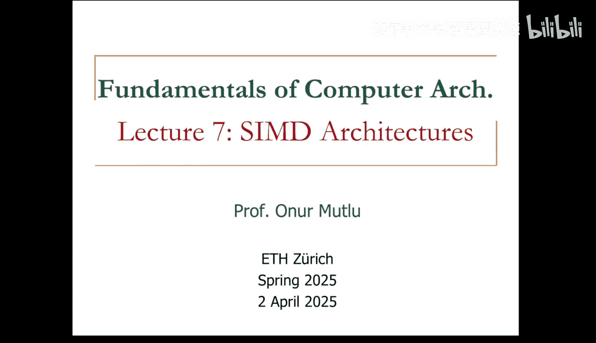
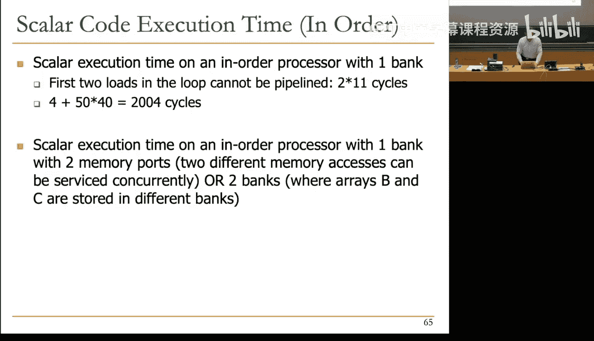
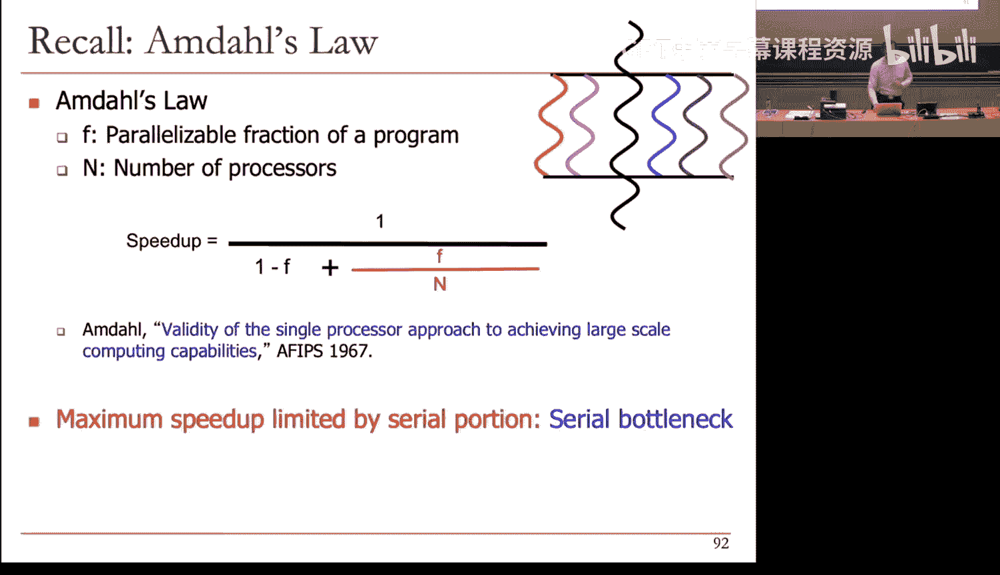
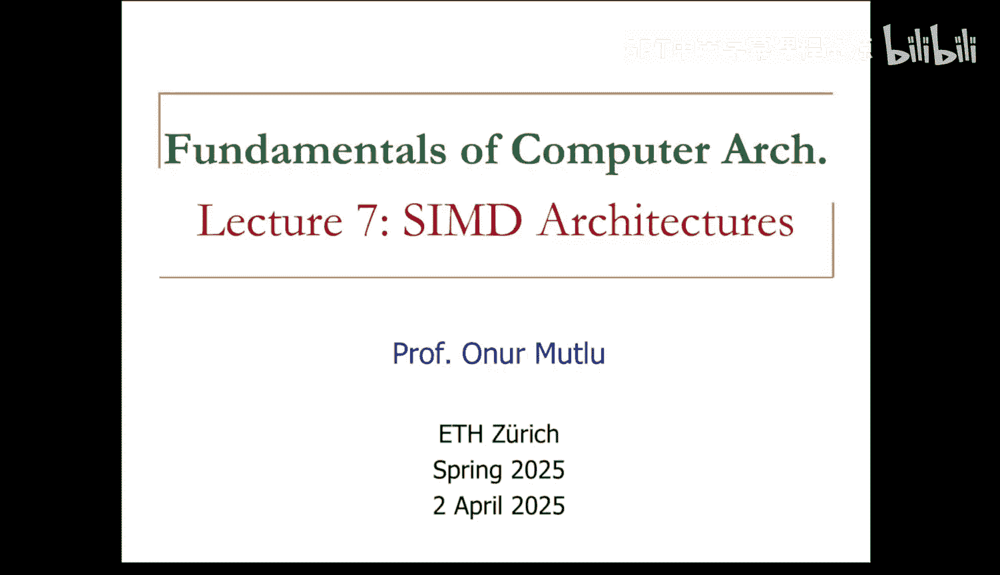

# ETHZ《计算机架构基础｜ETH Fundamentals of Computer Architecture 2025》中英字幕 p07 Lecture 7_ SIMD Architectures (Spring 2025).zh_en -BV1Xc19BnET7_p7-

But today we're going to cover another fascinating concept。

 which is the paradigm of single instruction， multiple data processing that has influenced computer architectures quite a bit。

 essentially all computer architectures have this today that was not true in the past but。😊。

It was so important that every computer architecture has built single instruction multi data support。

Either as part of a separate processor， like a GPU or as part of a separate functional unit。

 like a CD functional unit today。But before we get to that， this is where we are。

 essentially we're covering execution paradigms and we have SD architectures and graphics processinging unitss which build on SD architectures left。

😊，Today and next week， essentially， we've covered everything else except for decoupled access and execute。

 which。😊，I'm going to refer you to this optional lecture， it's only 11 or 12 minutes。

This another paradigm that's actually used in existing systems， the idea of decoupling access。

 memory access and execute so that they can run asynchronously to each other so that you can overlap the latencies of ME and execution units in different ways。

 essentially that's the idea basically but this short lecture goes into a little bit more detail。

 if you will。😊，Now before we start Cdy， let's wrap up systolic arrays。

 we've covered systolic arrays and VLIW yesterday and we were discussing essentially。😊。

Cyto Care is our specialized architectures to accelerate specialized computations。

 and this was the computation we looked at yesterday。😊。

And we also said these have influenced real systems。

 I want to talk a little bit more about the real systems because we kind of rushed through it yesterday。

 but essentially this TPU that was developed by Google starting in 2014-15 and it was described in the Cisco 2017 paper is essentially a systolic array。

 basically you can even read that they say systolic data flow of the matrix multiply unit software has the illusion that each 256 byte input is red at once。

 and they instantly update one location of each 256 accumulator Rams， basically they accumulate。

 do multiply and accumulate to do a matrix multiplication essentially。😊，Again。

 I won't go into the details， but you can see how they do it it's transparent to the software so they basically translate and multiply and accumulateulator operation。

 a large one， a matrix multiplication essentially to this sytolic computation using a lot of support in the system。

 so this is the systolic computation unit。😊，And this is actually somewhat similar to what we have discussed exact data flow and exactly what is accumulated inside each unit is different。

 of course， because you can actually design systemto carries for matrix multiplication in many。

 many different ways。😊，But you can see that this is the support that they provide according to them this the matrix multiply unit。

 and you can see that there's a lot of support to input the data into this unit and also input the weights that they're multiplying things with because this is really doing matrix multiplication for convolutions for example。

 like we discussed yesterday， so you need to actually feed the weights and feed the data vectors from here and then get the data out from here。

😊，Okay， I won't go into the details， you can read the paper if you're interested。

 but it's doing essentially matrix multiplication， yes。😊。

Not necessarily not necessarily so they're probably taking advantage of the reordering internally as long as you get the right result it doesn't matter which order you follow but yeah if you think about that in a Wo Nor architecture you have a sequential order dictated by the program right you have to obey that order because that's the architecture you have here a lot of things can be happening concurrently。

😊，So that's one of the other benefits of systolic architectures if you're not tied to an order。Okay。

 so they later so the reason they built this was to actually accelerate inference first as well and then training next in the Google data centers because they're doing a lot of data analytics clearly internally and later they and they basically said。

😊，We don't want to we have so much infrastructure that we can actually amortize the cost of building our own chips。

😡，And that's why they actually did this， so they actually amortize the cost of building they on just total total cost of ownership as opposed to getting GPUs from someone else。

 for example， and they kept building this。 this is TU2。

 they actually do training on this one as opposed to just inference in neural networks and they basically increase the memory bandwidth as you can see so providing data into the systolicic a is still important even though sytolicic array is more efficient than a general purpose processor like a CPU in terms of how much benefit。

 how much computation it does on a given data element that it fetches from memory like we discussed yesterday。

 it still needs a lot of data because these are quite data intensive applications so they basically replace the traditional memories with high bandwidth memories as you can see they actually add floating point operations and they increase the computational power and then TU3 has even higher bandwidth and larger memories。

 more matrix units as you can see not just two systolic arrays but four systolic arrays now and then the tariff flops is increasing and this is the latest one。

That they have exposed at least and they're targeting many。

 many applications over here you can see that the total tariff flops per chip has increased well almost increased by almost three times as you can see over here so they've been improving this over time and you can read more papers about it so they're in quite public about it even though they don't disclose exact details they talk about some of the things that they've done but I will also mention that we've been analyzing these TUs in my research group together with Google as you can see in this work and we've been finding that a lot of the issues that they have is really due to memory and we're going to talk about memory after next lecture hopefully we're going to go into the memory design and this is to motivate the importance of memory basically you can see that all of these chips are increasing their memory bandwidth making memory more expensive increasing their memory capacity yet they still need more memory so in large machine learning models especially for for example long short termm memories transformers etc。

Basically more than 90% of the entire system energy spent on memory。

Okay we'll get back to that so now this is systolic arrays as I mentioned yesterday sytolic arrays are not the only machine learning accelerators now we're going to see the SD paradigm that people have been using to accelerate machine learning because CD is actually a very good fit for doing convolution type parallel operations matrix multiplication and yesterday we saw that how you can convert convolution to matrix multiplication as well right remember that slide where I showed you that you can go back to that so basically people have been using CD architectures and this is later today I will show you that at the core of it this is many processors inside well this is the new version if you will this is many processors inside and each processor is a SD processor internally and they communicate with each other。

😊，So it actually consists of multiple paradigms， it's a multi processorcessor of CD processors or vector processors。

 if you will。And this is designed as a Vfrscale chip and there are lots of units over here according to Crebra's 850。

000 cores， and this is large amounts of on chip memory。

 40 gigabytes of memory SRM on top of the chip so they're putting large amounts of computation memory together。

 but this is a different approach clearly compared to thestoicase。

 and you can learn more about this in this talk that was delivered by the CEO or CTO of that company。

😊，Okay I should also say that people have been using FPGs for this。

 Microsoft has developed this brain wave system that they call essentially they use FPGAs as a substrate to accelerate machine learning operations and they do multiple things partly they do some specialized data flow mapping as you can probably see somewhere over here I mean you need to read the paper but the paper doesn't give a lot of detail。

 but they do partly data flow mapping directly accelerate part of the data computation。

 but they also put soft SID units on the FPJ just like you're doing in your labs right now。

 you're putting a soft processor。😊，MIPS processor on the FPG right you're not mapping accelerating an application you're basically implementing a processor on the FPG substrate。

 they actually have a CD processor and the FPG substrate also at the end of this lecture we may get back to it even though we're not going to go into much detail because they don't go into much detail anyway。

😡，Okay， but you can see that now there are multiple ways of accelerating things and clearly SMD plays a large role and the reason is SMD is very good at exploiting a particular type of parallelels which is called data parallelism。

 if you will， essentially you're doing many， many of the same operations on different data elements。

😊，And GPUs exploit the same type of app perels。I call this regular parallelism also。

 of course there are many types of regular parallelism in this particular case you're doing the same operations on many pieces of data elements。

😊，So we're going to talk about that， but before we talk about that let's talk about the taxonomy of computers we've been actually covering different types of computers and this paper that's a seminal paper by Mike Flynn you can see that almost 60 years ago categorizes computers into four different categories in terms of。

😊，How many how many instructions do what to how many pieces of the data elements So you have instructions on the x axis and the data elements on the y axis and the simplest machine is doing single a single instruction operates on a single data element This is a scalar machine like we have seen right the ISA is doing thisEssential you do and a essentially each。

Each opera has a single data once， right？This is the traditional ad we have C。

 and we've accelerated this using Autoor execution， for example。And then there's Sd。

 which we're going to see in this case， a single operation， each up is not a single element。

 but it's really a vector of elements， so it's many elements at the same time So you're operating on vectors essentially。

 and there are two types of these array pro and vector pros and this is a distinction of a puristt and we're going to see the distinction。

😡，Every processor essentially does the same operation to different elements in the same time across different elements。

 vector processor does the same operation on different elements across time， essentially。😊。

Ms D is interesting。 This is kind of similar to systolic arrays。

 You have multiple instructions that operate on single data element。

 Basically you feed a single data element and then different instructions operate on it until you get the results。

 This is very similar to the systolic array， and I'll show you a picture somewhat similar。

 a generalized picture soon。😊，So the closed form is really a systolic area streaming processor and finally MIMD。

 you have essentially multiple instructions or multiple instruction streams operating on multiple data elements。

 you can think of this as a multiprocesor or a multi threaded processor essentially。😊。

And these are four different types of paradigms these can be combined with each other you can have a processor that has all four of these in and some some systems some associateCs today actually have that today like the Apple M1 has all of them I believe okay so if you're interested you can look at this paper the terminology is a little bit different but I've given you the gist of it so this is the example that this paper gives in terms of what is misD multiple instructions operating on single data you have data storage you bring the data。

😡，And then you have some processing elements， operates on the data passes the data。

 passes the let's say modified data to the next processing element。

 passes the modified data to the next processing element et cetera。

 so this's very similar to systolic array like we've seen yesterday so that's a generalized sytolic array because you could as I mentioned yesterday these syto processing elements can be programmable using instructions as well so if you haven't attended yesterday's lecture that's yesterday's lecture and this is C we you're going to cover today and if you look at this picture that is provided in that paper you have this instruction unit instruction it sends the same instruction to different data elements essentially。

😊，So these different execution units get different data elements from the opera store。

 this doesn't make it very clear， but we're going to make it clear soon and this is similar to what we're going to call an array processor and these processing elements functional units have very limited communication between them in fact we'll see no communication initially in our processors。

😡，Does that make sense？Okay， so these are the paradigms essentially。

 so we're going to look at the Sd paradigm。😡，And I mentioned that CD exploits data parallelism and what does this mean essentially've been so far we've been always exploiting concurrency right different sorts of concurrency out of order execution。

 for example， exploits concurrency that's irregular。

 it builds a data flow graph and tries to figure out which one can be executed。

 you're really trying to find which instructions can be executed concurrently。😊，Here in SMdi。

 the type of concurrency we exploit is fundamentally different。

 it arises from the semantics of the program performing the same operation on different pieces of data。

 essentially， that's why it's called single instruction operates on multiple data。😊。

An example is thatt product of two vectors or whatever you do on vectors actually applies nicely。

 that's why one of the processes is going to be called vector processors。😡。

Now contrast this with data flow in data flow concurrency really arises from executing different operations in parallel in a data driven manner。

 basically data gets available， it's actually fire an instruction and these instructions have no relationship to each other that are fired except they happen to have their data ready at a given point in time。

😊，It could be completely different instructions， basically。

Contras this with thread parallelism at a higher level， this is multiple instruction。

 multiple data the concurrency arises from executing different threads of control and parallel。

 different tasks in parallel and again these may have nothing to do with each other。😊。

But we're going to get back to GPUs because GPs are going to combine CD and threadread pearls in a very particular way soon。

😡，Okay， basically simply exploits operation level parallelm on different data。

 same operations can currentlyrent apply to different pieces of data。😡。

This is really still a form of instruction level parallel because you can think of these operations as instructions。

 except and instructions is combined， collapsed such that it applies to many。

 many different pieces of data。😡，Basically instruction happens to be the same。😡。

Meaning that you don't need to decode the same instruction many， many times。

 So imagine that you're actually adding two vectors of 1 billion elements。😡，In a scalar processor。

 you would be decoding the same instruction add instruction 1 billion times fetching and decoding in this case we're going to see you fetch and decode the a instruction only once。

😡，And it's going to control a billion data elements to be added so that's where the efficiency really comes from you don't you basically don't waste time figuring out oh I'm doing this operation basically you know that you're doing this operation on a billion data elements so you're not going to waste time figuring out what you're going to do to all of those elements you're going to do that only once so you're basically amortizing the cost of control because you're doing the same thing across billions of elements right。

😡，So that's the beauty so if your vectors are larger。

 this becomes more efficient as you can see right if your vectors are smaller。

 this starts resembling a scalar processor in the limit if your vectors are size of one。

 meaning a single element in each vector， this is a scalar proster。😡。

Okay so basically this is what we discussed this is a processing paradigm a single instruction operates on multiple aid elements and this can be done in time and space actually a lot of things can be done in time and space。

 we can revisit some of the discussions we have had for earlier paradigms in terms of time and space but here it fits very nicely basically we're going to have multiple processing elements for sure execution units just like we've been having so far and we're going to explore this time space dual in how do we handle the vectors。

😊，Is it an array processor？The same instruction operates on multiple data elements at the same time using different spaces or processing elements。

 if you want。 So you have an array of processing elements that can do the same thing。😡。

And a single instruction instructs them to do exactly the same thing concurrently at the same time。😡。

To all of those data elements， different data elements， we're going to see this picture also。😡。

Vector plaster， on the other hand， is more frugal in the sense that。😡，呃。

You don't need to have many different processinging elements that do exactly the same thing。

 you can have only one。😡，But you reuse that crossing element in time。😡，Every single cycle。You do。

The same operation on different data elements in consecutive cycles。

 basically the same instruction operates on multiple data elements in consecutive time steps using the same space crossing on it This is why vector processor were initially more popular because they were more hardware efficient。

 You don't need to replicate the same functional unit many times can you can just have one ad unit and a vector operations can be pipeline through it。

😊，But then array processor became more popular as we could put more transistors on a chip today's processors are a combination of both if you look at a GPU。

 it's not a vector processor， it's not an array processor。

 it's a vector and array processor basically。😡，And we will see that also。

Basically can do both time and space type of processing so before I show you this time space dual I need to define one more thing because I think it's important basically we're going to operate on vectors right we're not going to operate on scalar value so far we've been operating on scalar values and these scalar values are stored in registers and whenever we access a scalar value we say register one。

😊，Okay， and Reg one gives us one element。 Now the question is how do you get many elements right if you're going to operate on many elements。

 your registers also should store many elements， essentially。

 instead of having a scalar value and our register。

 we're going to have vector registers So each vector data register holds N Mbit values。😡。

And is the vector length or maximum vector length you can have in an instruction。

 Each register essentially stores a vector。 So this is register V 0。 We're gonna call it v 0。

 because vector register is 0。 In fact， I'm gonna call V R 0 in the next slide。

 V 1 is another vector register。 V 2 is another vector register。😊。

So not a single scalar value as we saw before， you can see that this is v0 zero element。

 v zeros first element and v0s and minus first element。😡，And then you feed the processing elements。😊。

One by one， every clock cycle you feed it with one element and the pressing element can be pipeline as you can see right and these are completely independent operations you're adding for example v0 to v1 clearly the operations that happen on different elements vector zero zero elements plus vector1 zero element is independent of vector zeros first elements added to vector ones first elements so it can deeply pipeline this whatever functional unit to this it could be square root your favorite functional unit。

😡，So this is the idea basically， this is the idea of a vector register and the result is stored in a vector register。

 the zero element gets stored and vector the sum of these zero elements get stored in destination register v2s zero element。

 okay。😡，So just extend the scalar value to a vector value and this is our simple vector program to illustrate the difference between an array processor and a vector processor to begin with。

😊，So this is our instructions the it's something very simple based it's a four element array a。

 you first load it from memory into a vector register。

 I didn't name the vector register just one vector register whatever。

 because that's the only thing we're going to use actually and then we add one to each element。

 this a vector add。😊，Every element is incremented by one。😡。

And then every elements after being incremented by one multiplied by two， as you can see。

 so there are dependencies clearly， and then restore store the resulting elements。

Into the array again， into memory。Okay， so this is basically our scalar Actually。

 you can take the scalar program and just vectorize it， right， That's the idea。😊，Okay。

 let's see how this executes on an array processor versus the vector processor。

V length in this case is four， I'm going to define that more formally so。

 but basically an array processor can do the same operation across multiple processing elements at the same cycle in the same time basically so all of these processinging elements are capable of executing all of these instructions so these are BP processinging elements expensive。

😡，So in the first cycle， we can execute four loads。

Now what does this mean we're basically loading element zero from memory into vector register zero element in this processinging element。

 element one from memory in vector register element one in this processinging element and then element two here and element three here okay concurren now it looks beautiful and we're done with the instruction。

😡，Because we have perils， right？And then。We take elements2 and incremented by one in this processinging element。

 element one and incremented by one in this processinging element and element two and element three concurrently again。

 and then multiply each element by two。😊，In concurrently， in different crossing elements。

And then do the store of the resulting value concurrently to different locations in memory。

 consecutive locations in memory。Makes sense right so basically this is beautiful and this is the fastest you can get this program using this paradigm。

 if you will。😡，Okay， so let's take a look at how vector processor does it vector processor is frugal as I said。

 crossing elements are simpler， you have only one load element。

 one element one processing element that can do add one processing element that can do multiply and one processing element that can do stores so you don't have this luxury if you will。

 so you have to perform consecutive operations on consecutive elements in in time right。😡。

So this is in the first cycle， you start loading the first element。

From address A to the vector register zero element。In the next cycle， you load。😊，Element one， okay。

 concurrently this result is done hopefully and you can add one to it right so you are operating on zero element and adding one to it in the add unit。

😊，And then in the next cycle， you're loading the second element in the load unit。

 adding one to the first element in the add unit and multiplying the zero element by two in the multiply unit。

😡，And then this is the steady state， if you will， you're loading the third element。

 adding to the second element， multiplying the first element and storing the zero element。😊。

And then you keep doing this Okay， you can see that vector processorer takes longer because its resources are。

 let's say， more frugal。It's not as expensive as array processor。

 but this is the time space difference。 If you look at our vector processor。

 you do the same operation at a given time， and this is the time axis over here and this is the space axis。

But if you look at a vector processor， you do different operations at a given time， right？😊。

And in the steady state， you're still doing four our patients。😡。

But that steady state may take some time to reach the vector process， as you can see。Okay。

 so if you look at the space， you do different operations in the same space in the array processor。

Whereas vector processor， you do the same operation in the same space。

 which is really the huge cost efficiency of a vector process。

 that's why vector processor have been really popular。

Until we were able to actually increase the functional units significantly in our systems。😊，ok。😊。

So as we will see later on， we're going to combine these at the end of this lecture and GPUs will combine both。

😡，Okay， so now let's contrast this to VLIW yesterday I showed you this picture， we looked at VLIW。

 we had a single program counter that would fetch a long instruction word right multiple independent operations are packed together into a long instruction。

😡，And these independent operations had nothing to do with each other， right？几。😊，Aray processing。

 let's just look at array processing in this particular case， if you look at a program counter。

 it specifies a single operation， except the single operation gets expanded to multiple different data elements。

😊，So this is the contrast between VLIW and the N processor VLIW actually can exploit more general purpose parallelism as you can see。

 as long as it's discoverable by the compiler and packable into instructions like this。

 VLIW guarantees that these can be concurrently executed。😡，The rateproer also guarantees that。

This instruction specifies four operations in this case vector length is four that can be concurrently executed because they're independent of each other because of a different semantic property in the first case the compiler in VIW。

 the compiler guarantees that these are semantically independent。😡，In this case。Again。

 the compiler or the programmer guarantees that these are operating on different data values， right？

😡，So in this sense， they're similar， but similar in the sense that they're doing multiple operations per cycle。

 except。😊，The relationship between the operations， in this case is you're doing the same operation。

 single operation on multiple different data lines。😊，Makes sense hopefully。

And we're going to see that BIW was actually developed。😡。

To fix the problems that RA processor is having。I'm going to read a part of the VLIW paper that is very。

 let's say， not harsh， but realistically hard on an array processor。Unfortunately。

 our process have been quite successful， but BLIW is not。

Because it relies on some parallelism that's a lot harder to discover。

 even though it's much more general purpose， no question about that。

 this is much more general purpose as you can see right。

 but this is much harder to do from a compiler or programmer perspective and this is much easier if your problem fits this parallels exist in all images all videos if you're doing the same operation on many。

 many images or many， many parts of an image yeah millions of pixels that you're operating on right that's your vector basically。

Whereas this one is。Okay， so VIW back so we we'll get back to VIW now let's talk about vector process in a little bit more detail I'm going to start with vector processors。

 but everything I say is really applicable to array processors is just you just need to expand it in space as opposed to time。

😊，So what is a vector vector is really a one- dimensional area of numbers this is a math definition and clearly many scientific and commercial programs use vectors there are many of them that's why people have' developed seem the extensions that we're going to talk about at the end of this particular lecture but let's look at this example this example averages two vectors right it basically takes the element wise average of two 50 element vectors A and B are both 50 element vectors at least you're working on 50 elements at a time and storing the average into the C vector。

😊，So a vector processor is one whose instructions operate on vectors rather than staor values。

 so you take vector registers essentially， so there are some basic requirements for this。

 let's define these clearly vector registers， that's why that was important to define even before I define the array processor on vector processor you need to load and store vectors。

 you need vector registers。😡，And these clearly contain vectors。 Okay sounds good。

 Now I've kind of introduced the vector length register。

 you need to operate on vectors of different lengths。

 and this is really why you need the vector length register。😊。

There are instructions that set the vector length register so that you can say， oh， at this point。

 am I operating on vectors that are of length4 at this point。

 am I operating on vectors that are of length000。😡，There's clearly a maximum vector length。

 And that's really determined by the。Number of elements in a vector register， right it could be 64。

 for example， we will see in K it's 64， but it could be a much larger as well。

Now GPUs are nice they eliminate the vector length it's easier to program Okay。

 so and then there's a vector stride register this is something I'll introduce how many of you know the notion of stride。

😊，Okay， good you're going to learn something again。

 so basically elements of a vector might be stored apart from each other in memory。😊。

And vectors stride register denotes how far apart from each other。

 they should normally be stored regularly apart from irregular storage we're going to handle later with some different types of instructions which we're going to introduce later。

 but basically stride is a distance in memory between two elements of a vector and we're going to see why this changes stride is not always one if it's one actually it's nice basically consecutive elements of the vector that you're operating on actually stored in consecutive locations in memory。

😡，This actually has a lot of benefits， as we will discuss。But your stride is not always one。

 and I'll show you a very basic example， matrix multiplication， our favorite program these days。😡。

So let's take a look at A and B matrices， both are stored in memory in row major order。

 do you know the terminology your major？Calllum major。No， okay， you're going learn more。

 but basically row major or order means that consecutive elements in the same row are stored in consecutive locations in memory column major means exactly opposite consecutive elements in the same column are stored in consecutive locations and this is a huge implication in terms of locality。

 perfetuibility， caching etc we're not going to deal with that we're going to talk about strike。😡。

So let's take a look at two matrices that we're going to multiply， this is a matrix。

 this is a zero element over here， this is the B matrix this is b zero element they're in row major order so the first row of a a0 is stored in consecutive location as you can see the first element is in location zero the next element and location one the next element is location two these are offsets from beginning of a of course right and then the first element in the next row starts from location offset6。

😊，And if you look at B0， sorry， matrix B， the first row is very similar。

 it has 10 elements in arrow and they're in consecutive order， the next row starts from offset 10。😡。

So clearly this is what they look like basically， I didn't show the entire thing over here because I don't have space。

 but a starts from some location and this is these are the offsets of the elements。😊。

where they are and this is what they correspond to in the matrix B starts from some location in memory and these are the offsets of the element and this is what they correspond to in terms of the visual structure of the matrix so clearly a is a  four by six matrix four rows by six columns b is a6 by 10 matrix and you can multiply them because these six is match right and you get a result C of four by 10。

Now let's take a look at how you would do that。😡，So this is basically to be able to multiply these。😊。

What you really need to do is to take the dot product of each row vector of a with each column vector of B。

 so what you're doing a matrix multiplication is really the to get one location and the C matrix。

 you need to take the dot product of this row zero。😡，With this column zero and B， okay。

 so let's take a look to be able to do that， you need to load a zero zero into vector register V1 or whatever vector register。

😡，Meaning this a0 through a5， offset0 through offset five。😡，And these are consecutive in memory。

 each time you increment the address by one to access the next column right or next element in the row clearly it the next column。

😡，So this is a case where we have a stride of one。 consecutive elements are in consecutive locations。

 The distance in memory is one apart in terms of the address。Now， if you're loading b column zero。

 that's not the case， as you will see。😡，If basically we want to load B0 offset 0， B 10， B20， B30。

 B40， b 50 into the second vector so that we can actually do vector vector。t product。😊。

Now clearly they're far apart from each other right so each time you need to implementement the address by 10 to access the next row and accesses have a stride of 10 in this case。

😡，O。😊，So basically， you need to have different stride supports。 You can say that， oh。

 why don't we layout B in column major order。 Yes， you can do that。

 But what if you start doing multiplying B with some other matrix， right。

 You cannot basically have the best of all worlds at a given time。 You will。

 you will always need to have some support for strides。

And this is something that has actually bothered many people， people have tried to develop many。

 many ways of overcoming this issue as we will see later on。

 but right now I'm just defining the strike， I'm not talking about why this is good or bad。

 but stride of one can be good because this is better caching characteristics also as we will see later on。

😡，Okay， so that's right essentially now let's talk about some other characteristics of vector processors a vector instruction performs an operation on each element in consecutive cycle that's how we defined it so because of this we can pipeline the vector functional units and each pipeline stage operates on a different data element essentially。

😊，And vector instruction is a lot of deeper pipelines actually。

 you can have a0 well if you have a huge vector， let's say a million element vector。

 a0 deep pipeline is not that bad right because you don't ever flush this pipeline at all。😊。

So basically the main reason is you don't have any dependencies within the vector inter vector dependencies。

 you don't need to check for them， there's no hardware interlocking in the vector we're talking about applying the function。

 there's no control flow within a vector and this' is going to be a lot of good things as we will see we're going to eliminate a lot of the control flow from a scalar program soon。

😡，And there's a known strip， right you know the strip， this allows easy calculation。

 address calculation for all vectors。😊，Like if you go back over here。

 you always calculate the address by incrementing it by one over here right here when youre loading this column。

 you always calculate the next address by incrementing it by 10。😡。

So you have a known stride essentially。So that helps actually easy loading of vectors into registers cache or memory。

😡，Or even early loading or prefeting because these are really predictable addresses。

 we're going to talk about prefeting at one of the latest lectures。

 but this sort of predictable stride or constant stride helps a lot。😡。

But we will see that the address generation unit is essentially you have a base address and then you keep adding the stripe to it and I'm going to show you an example of that。

😡，Everything is clear so far。Now it's beautiful， right as you can see。

 all of these things are good for designing a high performance processor， heavily pipelined。

 no dependencies to check， no control flow。😊，What else you would ask for。

 you should ask for basically large vector length。If your vector lengths are smaller then these unfortunately do not work very well。

 well， basically you cannot pipeline very deep clearly。😡。

you can pipeline but you don't benefit from it， let's say okay so what are the advantage of vector processor essentially this the lack of dependencies within a vector enables pipelineing parallelization pipelineing is actually in time if you will and then parallelization is in space so you can actually do array processing as well as vector processing which is nice and you can have very deep pipelines without the penalty of deep pipelines except for of course the sequencing overhead right and the hardware overhead and kind of ignoring that but the performance penalty other performance penalty like flushing the pipeline you don't need to do that。

😊，Each instruction generates a lot of work， lots of operations basically。

 and as we discussed earlier， this reduces the instruction fetch requirements you don't need to fetch and decode。

😡，诶。An instruction for every patient， you can amortize the cost of fetch and decode across lots of work。

 essentially。😡，And this actually leads to high energy efficiency per operation and if someone asks you why our GPUs energy efficient。

 this is the main reason basically， they can amortize the cost of lots of operations across a single control。

 let's say。😡，Otherwise there are a lot of reasons why GPU should not be energy efficient。

 I can name you many， but because of this， they can actually expose a lot of work without doing a lot of overhead。

😡，You're really spending a lot of energy on the computation， if you will。Okay。

 no one need to explicitly code loops， and we will see this very soon with an example。

 you can have very few branches in the instruction sequence because we're going to eliminate branches。

😡，Because if you think about a scalar program， what you do is that you loop and you do the same thing on many。

 many elements of a vectorite。 Now， we're going to specify this as。

You do one operation a vector and then the next operation and then the next operation。

 and then branch is only one thing at the end that you do after 1 million operations。

 let's say per vector。😡，And you have a highly regular memory access pattern because of the strides that we had looked at earlier。

 and this is going to benefit us soon。😡，Of course， there's a disadvantage like every idea we have downsides and upsides and the huge downside of vector pro is it doesn't always work right。

 it works if parallelism is regular。Data and CD parallelismm。

 if you can fit your parallelm to this paradigm， it works nicely。😊，Meaning vector patients。

 but unfortunately it's very， very inefficient if parallelism is irregular like some of the programs that we have looked at if you're searching for a teen a linked list lots of dependencies and you cannot parallelze for example very well。

😊，Too bad。So you need to learn， you need to know if you can vectorize the program。

 we're going to talk about vectorizable loops， so your loops need to be vectorizable for this to work。

😡，And this is exactly why the VLIW paper says this。To program a vector machine。

 the compiler or a headquarter must make the data structures and the code fit nearly exactly the regular structure built into the hardware that's hard to do in the first place and just as hard to change one tweak and the low level code has to be rewritten by a very smart and dedicated programmer who knows the hardware and often the subtleties of the application area and this is actually a very nice description of。

😡，Why some applications don't fit vector processors， but if they fit。

 they fit greatly if they don't fit。😡，These problems up。

And Josh Fisher poses VLIW as a solution to this， but it has its own problems， as you know。

 right now， right？😊，And if he continues open， the rewritinging is extremely difficult， et cetera。

 et cetera。Okay， and that's the recommended paper， you can read more about it。Okay。

 so we should before moving on， we should actually not get too excited because there's MD D law。

 which you have。😊，Reviewed and we looked at this before。

 basically vector processing works well in the parallelizable fraction of the program。😡。

In the serial part， you don't have a lot of data parallelism。😡，In the paraizable fraction， ideally。

 you should be able to speed up with the number of processinging elements that you have。😡。

So this is M D Law， M Dl law says that the paralyizable fraction of the program can be sped up by N。

 assuming you have N processors。😡，Even this is ideal if you take the advanced architecture course。

 we're going to talk about why that's ideal， but assume that this is true for now as n goes to infinity this goes to zero so your speed up at the limit as n goes to infinity is really bound by F。

 which is a paralyizable fraction if your paralyizable fraction is 50% your speed up is at most two。

😡，That doesn't sound good now right with infinite number of processinging elements。

 your speed up is only two if your parallellyizable fraction is 50%。

 so your parallellyizable fraction needs to go up very high if you really want to benefit if it goes up to 99% now your maximum speed up is。

😡，Hundred， right？If it's 99。9%， it's thousand0，99。99%， it's 10，000。

 that sounds great now now we're talking。But the problem is 99。

99% is very hard to get right basically that means that you need to do very very little work in serial part of the program and serial part of the program can be just distributing tasks to many many processors right and that can take time right you need to really really minimize it so that's why MDda's law is so strong。

😡，So basically that's what this says maximum speed up is limited by serial portion。

 this's called the ce bonic and this serial bonic term especially came about because of vector pros。

 people have basically said， oh we have the serial bonic， what do we deal with it？😊，As we will see。

 C's solution wants to actually design the fastest scalar machine of its time。😡。

Craray designed the fastest supercomputers。 They were actually fastest vector processors。

 and they were also a fastest scalar processors at the time。😊。

So that they could get away get out of the cereal bottleneck very quickly as much as possible。😡。

So a basically all parallel machines suffer from the serial body， whenever you're paralyzing code。

 it doesn't matter how you're paralyzing it， you suffer from this。😡，Okay。

 that's why this paper was read earlier， right？How many people did this for you？

Or you don't remember some people， okay， maybe it's been so long that you don't remember。Okay。

 okay so this sort of issues actually are really really interesting and this is not the only thing this is a lecture from our computer architecture course where we discuss a lot more because it's not just about the serial bine。

 I'll give you just some critical thinking this F divided n is not true also in single instruction multiple data processinging f divide F divide by n is actually relatively true because you're really paralyzing the operations concurrently across multiple data elements and that's the closest you can get probably to f divide by n in S processors。

😊，But we will see a lot of other issues。Okay， and if you're interested you can look at those lectures right now okay。

 so that was one limitation basically a parallelization if you cannot fit your application to vector postures。

 you suffer， you don't get benefits。😊，And MDda's law is one reason why you suffer。

 there could be other reasons why you suffer because you could not really get to a parallelzization level that with your programming skills。

 right？😡，And GPUs actually suffer from this also if you want to program a GPU。

 you'd better be an expert to actually maximize your parallels Okay。

 another limitation or downside is， as we will see memory bandwidth can easily become a bottleneck。

 especially if you don't have balance between compute operations and memory operations。😡。

And especially data is not mapped appropriately to memory banks。

 we're going to talk a lot about this actually starting today。

 but we're going to see memory structure a lot more。

 but one of the major reasons major places where memorymi became a bottleneck first was really vector process because these are pushing the limits right you're really with one single instruction you're unleashing so many memory operations right I want to load a billion elements from memory。

😊，How does your memory system support that the most sophisticated memory systems initially were in vector processors and we're going to talk about some of those ideas。

 but now of course they're in all processors today。😡，Because yeah。

 we are executing all sorts of code today in all processor， essentially。Okay。

 so let's go into vector processinging more depth unless there are questions。

Okay so we're going to talk about vector data registers a little bit more we have essentially each vector data register holding n embit values and you can see that you have the vector register zero vector register one。

 you can have a vector register set essentially vector register file as we have seen。😊。

And then we have vector control registers， vector length， vector strideite。

 we've already talked about this， and then I'm going to introduce vector mask because you should be able to do conditional operations。

😡，Or makes。Meaning if you have a vector of how do you basically do a conditional operational vector。

 if something is true， increment this value in this element， otherwise do not increment this value。

 for example。😡，Basically you have a vector mask register that says that computes a mask as to whether the operation should be done on the vector or not。

 and then based on that mask you apply the operation to the vector and if the bit in the mask is one。

 the operation is done if the bit in the mask is zero。

 the operation is not done this is a form of conditional execution or predicate execution and this was also developed in vector process first and then they went into other high performance processor but they were not very successful in other highper processors。

😡，Okay， so let's we're going to get back to this， we're going to see how to program using vector masks。

😡，So maximum vector length can be n， this is， as I said earlier。

 a maximum number of elements stored in a vector register。

 and you can see n over here in these vector registers。😡。

Vectctor mask register VMask indicates which elements of a vector to operate on。😡。

And this is set by vector test instructions。 This is very similar to compare instructions in scalar Ias。

 for example， here we set。Every element of the vector mask by comparing。

Every element of a vector register K to0。😡，Now， what is the result of the operation if the。

Eleement I of vector register k is equal to zero， then element I of vector mass is set to1 otherwise it's set to zero okay so basically it's a bit vector there's a bit vector specifying whether the condition that you tested was true for each element of the vector。

😡，And then you can use this to perform conditional operations， essentially after this。

 after you set the mask， if you do a vector ad。😡，The vector adds。

 the addition will take place only for those elements where the vector mask with the corresponding element of the vector mask is set to one。

😡，Okay。😊，That's beautiful。 We're going to get back to this。

Now let's let's look at the vector function units a little bit more。

 essentially we feed data from vector registers into two ports of the vector function unit that are pipeline as you can see。

 and eventually the results comes out and each element in a pipeline manner gets to the next vector to the destination vector register right this is the operation here I'm kind of pictorially depicting vector one multiplied by vector 2 stored into vector 3 register3。

😊，And in this case we're looking at a sixt multiplication pipeline right after six cycles。

 the first element result is available and placed into the destination registers or zero element I should say the zero element results is available and it's placed in the destination register zero element and every cycle because of the pipeline you get one element per cycle right initially you fill the pipeline。

 but you get one element per cycle outputput from the functioning based on all the pipeline in principle this is true fact。

😊，And here， the control of this steep pipeline of the functioning units is simple because elements in vector are independent。

😡，Okay， good and this is an example of a real machine K1。

 you can actually see a version of this in the cap building how many of you have seen it that's the yellow machine okay good。

😊，Have you operated it？I don't know if it's operational。 it's old， as you can see。

 but let's take a look at what this entails。 So a vector processor。

 a vector processor is not ever a vector processor， only a vector processor。

 I should say it's also a scalar processor。😊，Because you need to do both operations right as you can see over here there's a vector unit vector registers similar to what we have described and this particular processor had8 64 element vector register。

 each element had 64 bits you can see that for its time this is actually pretty powerful。😊。

At very similar times we were talking about four bits， eight bits in microprocess， right？😡。

And the goal was really to do supercomputer type of applications， right， scientific simulations。

 et cea。😊，Okay， 16 memory banks， we're going to talk about that so memory needs to be heavily banked so that you can actually get one element per cycle from memory how do you sustain one element per cycle is important。

😊，For vector processor for every processors you need more than one element per cycle from memory okay for vector processor we start with one element per cycle。

 but this also has scalar registers so there's actually a scalar unit over here。😊。

You can see that it has eight 64 bit scalar registers。

 very similar to scalar IA like MIPS we have seen。😊。

And then there's also an address unit that does address computation and address registers。

 and then there's a floating point unit at the time also so it's a pretty beefy processor for its time and it's actually。

 well it's actually multiple chips because of times right 1970s but it's a processor overall。

 and you can see that it's very heterogeneous。😊，So heterogeneity is really built into this processor to begin with。

But the main core is really the vector processing part that does hopefully most of the computation if you're doing computation here。

 you're really doing exercising the serial ball net。😊。

And that's why these folks designed this scalar processor to be the fastest of its time。

Which is fascinating， right， you should be doing operations always here。😡，But when you go here。

 youve got to get out quickly， so design the scalar unit to be fastest。😡，Okay。Okay。

 that's the importance of Amdal's law。Okay so if you're interested。

 you can actually read this beautiful paper that describes the K1 system and this is the machine that you may have seen and you may have read about it I'm not going to talk about it as's a block diagram of the same thing in a nicer way let's say from I think you can actually find information of that maybe there's a booklet over there maybe I'm remembering some other place there might be a booklet okay so you can read more about it crray basically has designed many many vector processor it's not that important in terms of what they've designed here but it's important historically and they have a lot of functional units as you can see let's take a look basically these are address functional units kar functional units vector functional units which we're going to talk a lot about today。

 but there's also floating point functional units as you can see and they specify the time in terms of clock periods vector functional units for example yeah。

😊，Okay， there's more and you can see that the memory is actually important and IO is important。

 so it's a full system essentially we're going to see more of this later。😊，Okay。

 I'll give you some story over here， which actually gives the idea of MDDA's law really nicely。

 Seymour Cray was a very principal designer， if you will。

 he was the early designer of the supercomputers and he asked this question。

 which is always good to think about。😊，If you're ping a field， which would you rather use？😡。

To strong oxen？Or 1024 chickens。And this is a fundamental problem that keeps coming up right。

 do you use two powerful single core processors or do you use millions of powerless simple processors？

😊，And the answer is。It depends， right， as always。😊，Basically， maybe plying a field。

These guys are better they know what they're doing and their higher performance right and they can be a lot more energy efficient also as we've discussed yesterday right because they finished the job much earlier where these chickens will run around and they will never finish the job so you'll be expandingending energy on the chickens forever。

😡，And then eventually you decide to eat them， maybe I don't know， maybe not。

 but basically they will never finish the job right， Okay。

 so this is the joke of it so it's good to think about this picture when you have a problem at right what do you use。

 What kind of pro you use。😊，Victor processors try to do this and how the auto of order superscale process may be trying to do this。

 right？Anyway。But Seymour Cray was a smart person or the designers of early supercomputers。

 very smart people， so they actually designed both。

We want to tab all chickens as well as the strong oxen Okay。

 let's talk about memory banks because this is going to be important How do you load and store vectors from and to memory。

😊，And this requires loading and sting multiple elements， you don't want just a single element。

 we want many elements and we want to sustain a throughput right we show that the throughput of the functional units can be one element per cycle really easily。

😡，Now， how do you ensure that maybe gets you one element per cycle？In every cycle。

 because we're going to be loading millions and billions of elements potentially right。😡。

So elements are separated from each other by a constant distance。

 we're going to assume this initially this is called a stride if this is not true it's going to become a bit harder as we will see。

 we're going to assume a stride of one for now for simplicity later I'm going to generalize this。😡。

And basically elements can be loaded in consecutive cycles if we can start the load of one element per cycle。

 so basically every cycle you start the load of one element and hopefully you get the result after n cycle n is the memory latency memory latency is hard to reduce for reasons we'll discuss later。

 so we should be able to start one element per cycle and get one element per cycle one memory operation per cycle and get one element per cycle every cycle essentially。

😡，So that's basically our goal。😡，So the problem is how do we achieve this with a memory that takes more than one cycle to access right if you have a monolithic memory system。

 you ask Memi， give me one element per cycle， let's say 11 cycles later it gives you one element。😡。

But during these 11 cycles is busy。You cannot give it's another。Request。

 so you need to wait for 11 cycles。😡，So if you have a monoic memory system with a single port。😊。

Your outputput is one element every 11 cycles so now how do you get to one element per cycle if your memory is 11 cycles。

 let's say。😡，And the answer is really banking the memory。

Of course you can say more ports to memory yes and that's expensive。

 you can basically have lots of ports， 11 port so that you can start one element per cycle such that once you get the first element you started you can start the next one because one port will become free so you need the 11 port essentially if your memory is 11 cycles but another solution is banking the memory which is a cheaper solution and interleave the elements across banks and we're going to use the solution and we're going to look at that again so if you miss this today which hopefully you won we're going to see this again when we talk about the memory systems。

😊，But this is the idea of memorybank， so remember we had memory address register and memory data register and we assume memory is monolithic。

😊，Now we're not going to assume that we're going to have 16 banks in this particular case and have a memory address register for each and a memory data register for each。

😡，But we're going to have a shared data bus and shared address bus across those because these are actually very。

 very expensive。So if you think about Memy， this is really the MEmy chip。Well。

 I guess this is the memory chip boundary don I should have had that over here and this is the CPU boundary and they communicate with each other with the address and Data bus and increasing the size of the address and data bus actually hurts your cost a lot because these actually add pins to the chips。

😡，And if you add pins， your cost increases， in this case， we're not going to add pins。

 we're going to start or send one address per cycle， it's going to target one particular bank。😡。

And then we can get one data element per cycle from the MDR only from one particular bank。

 but we should be able to send one address per cycle to different banks。😡。

That way we can start the operation or the memory access of a bank。In the first cycle。

And then if we need data from the next bank， we can start the memory access from that memory access from that bank in the next cycle。

 we can start the memory access from the next bank in the next cycle。

 so we can actually start memory accesses one memory access per cycle from different banks。😊。

And each bank takes 11 cycles。You just need 11 banks， right， but of course 11 is not a great number。

To distribute your addresses system still because our addresses are fundamentally powers of two。

 so that's why I have 16 over here。😊，Okay， so basically memory is divided into banks that can be accessed independently。

😡，But banks share address and data buses to ensure that memory chip pins are not increased。

 we're going to talk about that a lot when we talk about memory design next week。

 we'll start next week。This way you can start and complete one bank access per cycle。

 That sounds good so far。But under what conditions becomes an issue？

We'll talk about that basically under under this condition。

 you can sustain and concurent accesses if all and go to different bankss。😊。

So I'm going to finish the vector memory system and then we're going to take a break orre almost done basically if you look at a vector memory system you have the next address is previous address plus the stripe。

😊，So address calculationc is very simple， you have a base address and then add Strtripe to it。

 and that's your next address， and then you keep adding stripe to the next address that you generate。

😡，And every cycle you la it， initially you start with a base address。

 hopefully that goes to this bank。😡，You increment it by stride hopefully it's one let's say that goes to this bank in the next cycle you inement by the strip that goes to this bank and then this bank this bank this bank so consecutive access is go to consecutive banks as a result you can sustain one memory access per cycle and one word one element per cycle but this of course requires what I just formalized over here right if your stride is one。

😊，And consecutive elements。Are allocated to different banks。In other words， in memory terminology。

 consecutive elements are interleaved across the banks。

And number of banks is greater than equal to bank latency。

Then you can sustain one element pipe per cycle throughput。 if any of these is not true。

 this equation gets broken and you cannot sustain that throughput。

 and I'm going to generalize the stride later on。😡，Side one is nice， but strideide one is not enough。

If consecutive elements are all in the same bank， somebody did not do the data mapping well。😡，To bad。

 you're back to one element every 11 cycles， and this is what Josh Fisher was talking about in that paper。

😡，He was saying if you don't have the programmer knowing where to map the data。😡。

You're going to get a terrible result and that terrible result could be one element every 11 cycles right so data mapping is this is what is being referred to it's not really mapping of operations to function it。

 it's really mapping of data to memory banks。😡，And if you mess this up， everything else。😡。

Is messed up in a vector processor， including a GPU， if you're programming a GPU。

 how many people program GPUs here？Okay you know the importance of this probably data mapping somewhat okay it depends on what kind of performance you want to get if you want to get the highest performance this is really extremely important and we will see this soon again okay this is a great place to take a 10 minute break。

😊，So we're going to be back at 25 past and then we're going to actually go through this code and execute on a vector processor。

 but this is a scalar code so we're going to see the scalar execution first there were some good questions about programability of systolic arrays and how much performance you would get。

 we did not cover a lot of programbil issues， but even for systolic arrays if you really want to get high performance you need to orchestrate your data as we discussed and make sure that you actually fit your matrix operations in a pipeline manner into this matrix unit if you will。

 that we discussed with TU for example。😊，So programming these more specialized or different paradigms is not as easy as programming the Wo Ne architectures that we have seen。

😡，Okay， so now now that we know about banks don't forget about the banks。

 let me go back actually just to remind you so just to make things a bit more clear over here here we're dividing a monolithic memory into 16 pieces right so imagine the memory that we kind of thought as monolithic。

😊，It has two to the end locations， we're dividing it into 16 different pieces。😡。

So this has two to the n divided by 16 locations。 This has another to the n divide by 16。

 This has another to the n divide by 16 dot dot dot right。

 So each piece has some part of the memory main memory。

 and now we need to lay out the data such that we can sustain one。

Aess or one element provided by memory per cycle and for that you need essentially these to be satisfied if stride is one consecutive elements need to be interlead across banks and number of banks need to be greater than equal to bank la then you can sustain one element per cycle throughput and this is what I'm going to assume when I say you have n banks if you will。

Okay， but now let's start with an example of the benefits。

 at least the performance benefits of a vectorter processor and this is some scalar code。

And we're going to look at the performance of the scalar code on simple machines first。

 and this is the element wise average that I showed you earlier。😊。

If you actually write this element wise average loop in scalar code you write a loop basically right and this shows each instruction is latency in clock cycles so this is。

😊，You basically initialize 50 the loop boundary and then addresses of A。

 B and C into registers and each of them take one cycle。

 this is the loop initialization and then within the loop what you need to do is load one element from RAA。

And increment the address with which you load from RAA and here we actually combine multiple instructions using an addressing mode called auto increment addressing if you actually are always incrementing the address by one。

While you're using the old address or value of r1， you also increment r1 basically so this instruction does multiple things。

 it loads the memory locations specified by R1 which is really the address of a initially and then increments r1 by one so that you go to the next element in the vector we're assuming that the elements are stored consecutively so that way you load the first element from vector A and then you load the second first element from vector or zero element I should say zero element from vector a zero element from vector B。

😡，Each of these take 11 cycles， as you can see。And then you add them up。

 so there's a dependence between these two and put the result into r6， these are scalar code。

 there's no vector happening over here， there's no vector code。

 it takes four cycles and then there's a dependent shift， you shift it by one。

 meaning divided by two。😊，One cycle， assume that and then you store the result of the shift operation to the memory location specified by c into element zero to begin with and then you increment the address by one okay。

😡，So that takes 11 cycles and then there is this monstrous decrement and branch if not zero instruction。

 which a nice instruction， you decrement our zero and branch if it's not zero。

 meaning keep itating the loop until。😊，R 0 becomes 0， right， So you count down from 50。

To execute this on every single element。 And this takes two cycles。 Okay。

 so this is what you would do in a scalar processor， right？You could write it this way。

And we actually saved some instructions as you can see using auto increment addressing。

 we don't have these instructions， we have a relatively special purpose branch， etc。

 and this also auto increment by the way。😊，Okay， so if you look at this。

 you execute 304 dynamic instructions， right this is a lot。We will。

 we will reduce it down to 7 with vector coat。It's going to be beautiful from that perspective。

 so it's going nice it's going to be nice from the energy efficiency perspective。

 but before we get to that get to this let let's do some rough analysis in terms of how long it takes to execute this code on a scalar processor in order processor with one bank。

😡，Moolithic memory basically essentially if you have monothic memory first two loads in the loop cannot be pipeline。

 so each of them takes 11 cycles and roughly the entire loop takes。😊。

The some of these cycles over here， so it's really 22 26， 27， 29 40 cycles。

 you could potentially pipeline the branch， but eventually you need to resolve it okay let's take 40 cycles or the loop and you do the loop 50 iterations so it takes 2000 cycles initially you need to initialize these instructions so it's four instructions so it takes basically 2004 cycles okay we're going reduce this with vector processor but you could reduce this actually if you if you have a in order processor with a better memory system。

😊，Let's take a look in order pipeline processor， so scalear execution time on an in order processor with one bank。

 but two memory ports。Such that two different memory accesses can be serviced concurrently or two banks where arrays。

 B and C are stored in different banks。😡，Okay。😊，嗯。No， that should be A and B， right？

Okay， what happened？Okay， I'm fixing。Online， okay， because A and B。

 those are the things that we actually load with the load instructions。

Where are we？Okay， so basically A and B are in different banks such that you start the first load。😊。

In the first cycle。And then you start the next load pipeline， the next load。

 the next cycle such that both of the loads together take 12 cycles one of them takes 11 cycles and the other one takes one more cycle after that。

 right but then you cannot parallellyze anything else because everything else is dependent afterwards if you remember this code。

😊，So basically these two together take 12 cycles now and then 16， 17， 29， 31。Okay， sorry。

 I missed something over here a 30， I think right，12，16，17， yeah，1930， Okay， that's better。

 So 30 seconds， you could potentially do some more pipeing。

 but it's not going to significantly reduce this， but。

Without going through the machine details too much。😡，It takes about 1，500 cycle， right total。

Now we're going to reduce this with vector process of course。

 Autoor execution etcter can help you a little bit more right if you have a larger window but in this case Autoward execution is not that great because everything in the loop except for this branch and these two loads are independent but this there is a dependence chain over here right the next iteration of the loop is independent of course Autoward execution enables you to go to the next iteration of the loop so it can paralyze loop iteration that's one of the benefits of autoward but it's going to be expensive clearly with autoward execution so it can do more performance analysis which we're not going to do right now。

😊，We're going to compare this to a vector pass。So if for this to work on a vector past。

 the loop needs to be vectorizable and what does this mean a loop is vectorizable if each generation is independent of any other。

 in this case that's true absolutely。😡，So if you look at the loop。

 you will say each iteration is independent because it's operating on different elements， right？😊。

So if you really want to program of vector password， you need to do this loop dependence analysis。

 nicely。If you want to design a compiler that automatically vectorizes parallellyzes code。

 that compiler needs to do the dependence analysis and turns out this's not easy unless the code is as simple as this。

 for example。😡，So if you vectorize this loop， this is what the vectorized loop looks like。

 it's going much simpler。😡，This is basically so vector length our vector length is 50 we set initialized vector length register that way our vector stride is one because we laid out nicely our arrays。

😊，And then the first instruction is vector loads into v0 vector register0， starting from address A。

 and this automatically says that load the next 50 elements starting from address A into vector Reg0。

 so how long will it take the first element will come after 11 cycles。

 assuming the same memory system。😡，And you get one element per cycle。In the next consecutive cycles。

 so basically this will take 11 plus 49 cycles， right vector length minus1 because the first element comes after one and then the remaining 49 elements takes 49 more cycles to come。

😊，Okay， so if your vector length was 30， you would basically plug in your vector length over here。😊。

Now， if it was actually larger than your vector register length。

 you need to restructure your program as we will see later。😡。

But it's not that bad the core of your program will still be this。😡，Okay， this is this instruction。

The next instruction is vector loads， basically load the elements of RAB into vector register 1。

The next instructions of vector add add vector register zero to vector register  one。

 put the result into vector register2 again this is first results will be available after four cycles because that's the latency of the adder and then the remaining 49 results of the addition will come。

😊，In 49 consecutive cycles， vector length minus one cycles。

And then next you take the of the result that's in vector register two shift each element by one。😊。

And this takes you can see one plus 49 cycles because the first shift finishes after one cycle and then you get 49 other shift results in 49 consecutive cycles。

 and then the last one is a vector store， which takes the result of the shift in vector register3 and place it in the memory starting from the address of C okay。

😊，Whi is very similar in terms of latency to the vector loads。

 as you can see because it takes 11 cycles to write the first element and then 49 more cycles to write the consecutive elements。

😊，Okay。😊，This sounds good now。And you can see immediately that there's no branch here。

 we got rid of the branch， and we have only seven dynamic instructions。😊。

Two of them are set up instructions and the remaining five are actually the。

Instructions that do the bulk of the work。Now this is where the energy efficiency comes from。

 you can see that the control overhead of 300， I don't remember 14 instructions is gone。

And this is a very small vector， right you're doing this only on 50 elements。

 imagine you're doing this on much larger vectors。😊，Okay。

 so now let's take a look at how long it takes to execute this code。😡。

Initially we're going to assume a very simple vector presser。

 not even forwarding of data so this is called chaining in vector pressing。

 I don't like this terminology necessarily but you will see why it exists there's no data forwarding between vector functional units you have to finish all vector length of operations in one functional unit before you can start another operation on the same vector registergistry essentially you cannot forward a neutral elements from one functional unit to another function。

😊，Okay， basically the output of a vector function it cannot be used as the direct input of another。

 the ground laity of weighting is really the entire vector register， if you will。😊，Yeah， basically。

 the entire vector register needs to be ready before any element of it can be used as part of another operation。

😡，And we're also going to assume one memory port， one address generator per bank。😡。

This is a good assumption in general， but we're going to fix that we're going to add more to this later on。

😊，And we're going to assume 16 memory banks， in this case， a word lead。

 meaning consecutive elements of an array are stored in consecutive banks。😊。

And this is going to help us to get consecutive elements and consecutive cycles clearly。

 because each bank access latencies 11 cycles。😊，And the first element takes 11 cycles in one bank zero。

 the next element takes。It comes back after one more cycle in bank one。

 next sum comes back after one more cycle in bank two， et ceter， right。

So basically we're pipelining the memory system as well as you can see using bank。😡。

Okay so this is the execution time of the code basically if you remember these are the two setup instructions。

 I don't show them over here vector length and vector straight one cycle each。

 this is the vector load。😊，So vector load of a into vector register0。

 the first element comes after 11 cycles， and because memory system is interleaved nicely and the data is mapped nicely。

 consecutive elements come in consecutive 49 cycles。😊，Serviced in。

Consecutive banks essentially and then it wraps around of course right because you keep interleaving across banks。

 but because your access latency is 11 your memory bank number should be 60 if if your memory bank account was eight you would have a stall of three cycles。

😊，You would service eight requests and then install three cycles and then you keep doing that basically。

But that's not what we depict picked over here， Okay， so that's vector load。😊。

And because we have only one memory port， we cannot start the next load concurrently。

 because all of these banks are now busy servicing the elements for this vector load， right？😡。

So the next vector load can start after the at this point。😊。

I guess you could potentially schedule a bit earlier but I'm making it a little bit easier over here to analyze basically the next vector load comes starts the next element of the next vector load comes after 11 cycles and the consecutive elements come after 49 cycles now after this data is done you can start the add operation which adds vector0 to vector 1 the first element finishes after four cycles the consecutive elements come in 49 cycles and then we can start the shift there's no data forwarding we're going to fix this with data forwarding you start the shift in one cycle the first element comes and then after 49 cycles and consecutive 49 cycles you get consecutive 49 results of the shift and then the store the same story basically。

😊，Basically， without doing a lot of effort， this is the result you get 2585 cycles。😊。

Now you can say maybe you can start this load earlier and you would be right right。

 you can actually start this load a bit earlier but it's not going to save you more than 10 cycles。

 let's say okay， so not bad。😊，But now we have a beefF memory system clear。😡。

So we've already reduced the 1500 cycles to 285 cycles and we are also more energy efficient probably because we're not decoding a lot of instructions。

 we don't have any branches， etc ceter。😡，So why 16 banks。

 hopefully this is clear right now we have an 11 cycle memory access latency。

 having 16 banks that ensures that there are enough banks to overlap enough memory operations to cover the memory latency。

😊，And the above assumes units right basically that's what we're assuming and this is correct for our example program。

😡，If strideide is greater than one， then how do you ensure you can access one element per cycle when memory licensees 11 cycles？

Well。Then need to be more careful， we're going to get back to that。

Okay so let's talk about how to improve the performance of this people are fine with this so far right so we're going to improve the performance of this by vector chain to begin with so if you look at this let's take a look at the result of the first elements this is the ad vector registertry zero vector registertry one the first element is really available over here。

😊，You can actually start to shift right after that and shift the first element by one， right？😡。

But we're waiting for the entire vector register to become ready because we're waiting for the entire vector register。

😡，We can we don't have to do that we can basically forward this result to the shift unit and again similarly shift we can start the store right after the first elements basically we can do element twice forwarding of results and that's what we're going to do that's the idea of vector chainney。

😡，It's the fancy word for data forwarding， we're going to forward data from one vector function unit to another and this is one example over here。

 you do a load into vector X1 and forward it element twice to this multiply unit and forward the result of the multiply unit element twice to the add units。

😡，So if you look at this， this is vector one load unit is loading。😊。

And it's also sending the result of the multi units， I mean， this is pictorial， of course。

 in hardware， In Maxes， et cea， which we're not showing over here。

 just like the forwarding that we did for the pipeline processor。😡，Basically， this is what you do。

 Every element goes to this multiply units in a pipeline manner。

Such that you don't wait for this entire register to be full。😡，Similarly the result。

Of this multiplication unit is also supplied to the ad unit， every element consecutive cycles。

 such that the ad units can overlap execution with the multipier and which overlaps execution with the load okay so while the vector results are coming out they're coming into these different functional units and this is going to paralyze the backend of our program。

😊，Meaning actually after you get the first element of the second load you can start the shift sorry this ad right because you have the first element of vector1 you already had the first element of vector0 you basically add that and then in consecutive cycles you get the second element third element fourth element fifth element up to the 50th element or 49th element right so basically you overlap the lat you start the vector a right after the first element comes you start the vector shift right after the first element is produced by the add vector add functional unit。

😊，And then you can potentially start。The store instruction first element after the shift is done。

 but unfortunately we have a resource conflict over here in the memory。

We're going to talk about that， you cannot start this vector store because we have only one port to the bank that's what we said。

😡，做。That's why we wait over here， but even if with that weight。

 even without beefing up our re system more， this vector data forwarding brought us to 182 cycles from 285。

😡，That seems like a good win and again， if your vector lengths are larger。

 the benefits are going to be larger。😡，Okay， not bad。

Now let's take tackle the memory system a little bit。

 so we could not paralyze this load and this load and deficiencies in our memory system actually caused us to wait in the store。

😊，So these two loads cannot be pipelined and these this load and store cannot be pipeline。

 essentially we don't have enough ports。😡，In the memory system for this basically we had each memory bank has a single port that was our strict assumption and this led to the memory band with bottlelinkck and we assume that this port is shared by Read and Wright。

😊，So we're going to assume now two load ports and one store port in each bank。

 more expensive memory system。😡，And this will enable us perfect pipelining right now。

 so this is basically you start the first load。😊，In cycle one。

 the second load is completely independent of the first load， it can go to the other port。

 other load port， so you start the next load， so basically you almost completely overlap the latency of these two loads because they access two different ports in memory of course two different ports is expensive right clearly two different ports is really yeah two different address buses and two different data buses。

😡，But then of course it's shared across banks， but still it's expensive。

 but you could paralyze and you don't have the problem with this vector store。

 you can start this vector store anytime because it goes to its own bank， right？

Sorry on port not on bank clearly different elements in the vector store go to consecutive banks as we have discussed so basically。

You can paralyze。Almost completely any number of loads as long as you have one port servicing it and stores also。

😡，So this brings us to 79 seconds and this is if you compare it to 1504。

 that's 19x performance improvement。😊，W is not bad。You could say that okay。

 this is maybe unfair comparison we beefed at the memory system， yes。

 but you could also say that the in order processor was not going to utilize that memory system anyway。

😡，Because it's not capable of doing so。 Auto order processor， maybe。

You need a bigger instruction window， but in order processorer give this memory system to the in order processor it's not going to do much。

 it's going to do a little bit by by the first two loads actually， but not that much。😡。

Does that make sense？Okay。Okay， so this is the advantage of vector process， as you can see。

 large performance improvements and large efficiency improvements。😊。

Now let's tacklele some questions that make programming a bit more harder also。

 so what if number of data elements are greater than number of elements that have vector？😊。

This is relatively easy， you need to break the loop such that each iteration operates on number of elements in to register。

 for example， if you have 512 data elements。😡，That you're operating on for some reason。

 and you have 64 element vector registergistries。😊。

You basically need to have a loop of the code that we kind of showed。

 you need to have eight iterations where vector length is 64。

 and you need to have one iteration where vector length is 50。😊。

Now the downside is these eight iterations where vector length is 64 is nice because you don't need to change the vector length。

😊，But when you change the vector length， a lot of things in the machine changes right you were assuming some vector length and you change the vector length。

 you need to actually wait a lot， it includes a lot of stalling I'll let you think about that。

 but this is called vector strip mining and it's actually coming from the mining terminology you have some really interesting part of the mine gold to reach the gold you got to get rid of the chaff right so you basically strip mine the top of the mountain and then you reach the gold what is gold。

😊，Gold is。E durations where vector length is perfect。

The rest is dust or whatever your strip mining right if you if you read this basically it's a you remove the soil and rock overing the mineral deposit。

 which is the gold。😊，Okay， people are very inventive as you can see， right？😊，Okay。

 so now let's talk about some more thorny issues， what affect data is not stored in a strideed fashion in memory。

 What if you have irregular memory access to a vector。😡，Basically， the idea is to use inject。

 remember the load indirect that we introduced in LC3， it's going to come back to us right now。

 we're going to do inject loads。😊，So we're going to use indirect to combine or pack elements into vector registers。

 these are called scatter gather operations， they're very popular today because of sparse matrices especially which is used in machine learning quite a bit basically yeah this says that doing this also helps with avoiding users computational sparse vectors basically instead of if you have a vector you have a billion elements。

😡，Only three of them are nonzero。It doesn't make sense to go through all billion elements and do operations on a billion elements。

 right？😡，Assuming that zero doesn't contribute to your computation。

 which is not the case in most cases， multiplication， for example， zero is useless， right？

You gather only those three elements， put them， pack them into a vector register and operate only on those three elements。

 That's the idea basically and then you scatter them back to memory where they were supposed to be。

 That's the idea basically。😡，So this could be extremely advantageous in those situations。

 as you can see right。But it's not the only case where it could be advantageous as we will see。

 I'm going to actually show you another example， which is these inject accesses。

 so let's assume that you want to vector this loop， somebody gave you this loop。😊。

And somebody asks you is this specizable， your answer should be yes。😡。

Why because group its are independent of each other。😡，Clearly。

 there's an injection over here that makes things a little bit more complicated so we need to do something about it。

 which we did not do before but。😡，Whether or not this is vectorizable is not questionable。

 it is vectorizable。😡，So basically， we're going to introduce this index loading structure。😡。

What we will do is so D vector。😡，The D vector is essentially we load the indices。Into this D vector。

Essentially， yeah， and then we do a load in direct。😊，From Rrc based。

 what this instruction will do is so here you have a vector of indices。😡，That a specified ID。

And then we do a load inject where you take Rrc and add the index to it and for each element of each vector of this vector and then load it into consecutive elements of vector C over here。

 okay。And then you can actually do the rest， the rest is easier， of course。

 the rest is what we have seen。😊，These are this is the different part basically you need to load the indices and then you do a load inject now let's take a look at an example essentially these are often implemented hardware to handle these sparse vectors as we as I mentioned or inject indexing。

😊，Vectctor loads and storage use an index vector， which is added to the base register to generate the addresses。

 Let's take a look at an example of a scatter， not scatter。So this is our index vector。

 these are the locations。😡，From a base address。That we're going to store this data vectorctor to。

 Now this is a simple example。 We have only four elements， but what this means is that。😡。

The vector should be stored this way in memory。At base location。

 which needs to be specified somewhere plus zero， we should store 3。14 at base plus2。

 we should store 6。5 at base plus6， we should store 71。2 at base plus 7 we should store 2。

71 and the rest we don't touch。😡，Okay。😊，So basically， this is a vector， this is a vector。

 you just need to do store。😡，Base plus basically each。

 the operation is a vector store and this vector store takes a base address and adds it to the element of the index vector。

 calculates the address and stores the data over there basically you're scattering the data using this vector scattered store operation。

😡，That makes sense hopefully， right？Okay， yeah， there is very similar except you to the opposite。

 You can actually use the same example to gather from memory， you don't have this data vectorctor。

 you're going to populate the data vector， You give it an index vector and you load。😡。

Using the base addresses， each consecutive element as the base address。

 consecutive operation add the base address to these different indices and you load from these different indices into the data vector。

😊，Okay， you can convince yourself that this is relatively easy and clear this example doesn't do justice to because it's an eight element。

 we show eight elements and four of them are we don't care。

 but whenever you look at an example like this think about the example I provided you have a billion elements。

 only three of them are really numbers that you operate on nonzes let's say。😊，Okay。

 let's talk about some other things， conditional operations。

 we've already talked about this actually， but I just want to give you an example。

 what if some operations patients should not be executed on a vector based on a dynamically determined condition like this sort of again if somebody asks you is this vectorizable you will say absolutely yes because luiterations are independent of each other but there's some conditional flow execution if。

😊，An element is not zero， then you store the result of this multiplication into the destination B vector。

 as you can see， if an element is zero of AI， then you don't actually do the store。😡。

So basically the idea is to use math operations， you set the vector mass register。

 it's a bit bitm determining which data elements should not be acted upon。😡。

So this is how you would translate this code， you vector load v0 v1， A and B， as we normally do。

 and then we set the vector mass register by checking whether each element of vector 0 is not equal to zero。

 as you can see based on this condition， this sets the vector mass register elements corresponding to not equal to zero being true are set to1。

😊，And this vector everything after this takes into effect depending on this vector mask。

 so for example， when you do this vector multiply you do this multiplication。

 but only the elements for which the mask bid is set，😡，Actually， updates。The corresponding elements。

Makes sense， right， The multiply takes effects only four elements for which the mass bit is set。

 basically for for all of those elements where the mass bid is not set。

 the multiply doesn't take effects。😡，So this is conditional execution that's true for store also actually。

😡，So in order to be able to go back to unconditional execution。

 you need to reset the vector mass register to all onces。😡。

So if your vector mass register is all zeros， these are actually noobs。😡，Right。Makes sense， right。

 you still execute them， but in effect there are no ops because all of the elements in the vector max is charge zeros。

😡，So this is actually predicate execution， we did not cover predicate execution much when we talked about branch prediction。

 but essentially this is converting。😊，A branch instruction into data flow。

 right That vector mask is providing conditions。And those conditions。

Decide whether an operation takes effect on an element。😡，There's no branch。

It's all data flow right it's all dependent on the vector mask register so this is beautiful and this is where predicated execution has been extremely successful execution is really predicated on the mask bit if the mask bid is one。

😡，But actually it applies to all our patients in a vector process if I did not talk about this。

 but here the vector mask is all once。😡，That's why all of these are unconditional。

 but once you change the vector mass scan vector mass changes a little bit。

 if some element has a corresponding element in the vector mass that's zero。

 then that doesn't take into effect。😡，Okay， so this is another example with masking。

 this is actually more sophisticated， but I won't give you the code。

 you can write the code and this is again vectorctorizable。

 but nowre we're checking if AI is greater than BI。😊，If that's the case we set CI to B AI。

 otherwise we set CI to B BI。😡，What we need to do is we need to compare A and B to get the V mask。

 and then we do a mass store of a into C， and then we complement v mask that's else。

 and then we do a mass store of B into C。 And then once you go out of this。😡，Lup。

 let's say you set the Vmaster all once。And this is what you do。

 so you can actually do operations on the mask vector also。

 so basically you're doing precate computation on the mask vector mask vector。 This is very powerful。

 In fact， our mya had conditional execution All these processors。

 but then they got rid of it because it was very difficult in a scalar processor。

 but a vector processor makes a lot of sense because it gets rid of these branch instructions completely。

Okay， so basically this is the execution if this is your A vector and B vector。

 this is what your V mask will be and you can again convince yourself by comparing AI greater than equal to BI。

😡，So how do you implement these mass vector instructions as simple as implementation would be。

 execute all of the operations。😡，But turn off result right back according to the mask。

 So these are the mask bits。😡，Elements corresponding to the elements going into the functional units。

 so let's assume that there's a multiplication you do all of the multiplications。

 but before you write to the write the elements into the vector register you check whether the mask is zero or 1 if it's zero you don't write the element to the vector register element entry if it's one you do。

😡，Now this may be very energy and efficient as you can see。

 because if your vector mask is zero for almost all the elements。

 you're doing lots of computation you're functioning it， but you're not writing back the results。😡。

So another implementation is this density time implementation where you first scan the mask vector。😊。

And you figure out which ones are actually ones。😡，And only execute those operations in the vector that are once。

😡，That's the idea which one is better， it depends on basically the complexity of the scanning and also how much。

 how many zeros you have in the mask。😡，Okay， so I'll let you think about that。

So there's some other issues， so stride and bankk， let's revisit this。😡，So actually。

 we've assumed tried one， but。As long as the stride and bank account are relatively prime to each other。

 such that they're not divisible with each other and there are enough banks to cover the bank access latency you can sustain one element per cycle throughrupput This is the real generalization You need your stride and bank count to be relatively prime How do you make sure that happens。

😡，Good luck。😊，Especially if you have a two to the power of n number of banks。

 this is very difficult to achieve。😡，If your banks can be a prime number。Well。

 that becomes interesting now， but then how do you do the address mapping with the prime number？😡。

Okay so basically we talked about the row major column major。 I'm not going to talk about this。

 I'm gonna to talk about a few more things before we finish， you can leave if you need to leave。

 but I'm almost done。 So basically you need to change the stride when accessing your row versus column and we've already seen this Basically this is very difficult。

 the purpose of the initial example was very difficult different strides can lead to bank conflicts。

 this is Str of one， this says Str of 10。 But now when you start doing something else。

 when you start multiplying this vector with this array with some other array。

 then you may actually start getting bank conflicts。

 So basically how do you minimize them has actually concerned vector posture designs a lot。

 and a lot of what has been implemented in vector pro trickled into our systems today because we need actually to minimize bank conflicts。

 more banks We have more banks today， expensive more ports in each bank expensive Better data layout to match the access pattern。

 how do you do that You need a hero programmer for that。Is this always possible， maybe not？😡。

Better mapping of address to bank。 Now this becomes interesting。

 People are actually proposed a lot of mathematical， randomized address mapping schemes。

 you take an address and memory controller randomizes the address mapping in a predictable function。

 of course， such that the probability of conflict produces as much as possible。

And this is a beautiful paper that talks about the idea， you may recall the name Bob Ra。

 this is the person who developed lot of the VLIW processors also but he had actually worked a lot on vector processors in the past and you can see that there are a lot of mathematical theory that goes into randomizing the address mapping function to banks。

 which address should go to which bank basically we're going to get back to this in memory system。😊。

So let me呃。Shall we take a couple of more， I think we' already？A couple more min more。

Who says we should take a couple more minutes to finish this part， otherwise， okay。

 some people who says I want to go， if you want to go， you can go no problem with that。Okay。

 let me finish since more people raise their hands this is interesting because this is going to finally put things together so array versus vector proor is really a distinction a purest distinction most modern proors are actually a combination of both they exploit data parallelm in both time and space now let's take a look at this。

😊，And one of the reasons is array processorors are actually too idealistic right if your vector length is 100。

 it's very difficult to get 1000 processinging elements。

 Well today you can actually let's say a million， a million of vector length。

 a million processinging elements that do everything that's very difficult to get。 So in the end。

 you really need to pipeline like a vector pro does。So let's take a look at this instruction。

Vctor add ABC。 So this is a vector execution， right。

 consecutive elements go to go to the same functional unit in consecutive cycles。That's time。Now。

 this is what really happens in existing systems。 You have some number of。

A functional units that can execute the same function。And you feed。Some elements in parallel。

 as you can see， the first four elements in parallel。

 but then you pipeline the remaining months in parallel across these functional units。

 so you can see that you're exploiting both space。😡，App parallelism in both space and time。

That sounds good。Now you can also customize the register file。

 registers that are numbered or elements that are numbered 0，4， 8， 12， 16， 2024， go to this one。😡。

The other ones go here， basically there's a function there's a mapping there's a partitioning of the register file across these functional units now not all registers need to feed all functional units this makes it a little bit more harder to program also actually later so basically this is what a GPU kind of looks like today you have a partitioned vector registers as you can see and you have what's called a lane a lane is essentially functional units that operate on a piece of the register file and you can actually have multiple functional units as you can see over here。

😡，Okay so well you can also think of this as a functional unit that is like an array processor。

 array functional unit， but then each there's a lane in each one and you actually pipeline the results in each one but then you also exploit the space parallels so let's take a look at an example over here you can overlap the execution of multiple vector instructions we have an example machine over here that has 32 elements per vector register and eight lanes。

😊，And we're going to look at。How you do the load units。 So eight planes in the first cycle。

 you send eight elements in the next cycle， the next eight elements， the next cycle， the next one。

 next one。 and then you can start the multiply concur， and then you can start the add。

In the next cycle basically， so if you look at this， the instruction level parallelism you get。

In the steady state is 24 operations per cycle， while you issue one vector instruction per cycle。

So this is quite good， if you will。Okay。I'll do this also very quickly as I said you can automatically vectorize code。

 this is a perfectly vectorctorzable loop if you look at the scalar code， this is what you do。

 you load the first element from a， you load from B， you add them up， you store into C。

 this iteration first rate I mean going the branch over here。😊，This is the second generation。Now。

 automatic lectureization， or if you're recizing your program。

 you realize that these are independent。😡，And you put the loads across different its together。

 that's what we're really doing actually， this is scalar code。😡，But you can take scalar code。

 do the dependence analysis and put the loads together and vectorize them so this is a vector load。

 this is another vector load， a vector ad， a vector store。

 youre really fusing iterations when you think scalar when you think vector you don't even start with scalar of course right that's the idea So vectorization is really a compile time reordering of this operation sequencing but this requires extensive loop dependence analysis to make sure that different iterations are independent of each other So let me summarize basically vector and Cd machines are really good at exploiting regular data parallelism you perform the same operation on many data elements this improve performance simplifies design。

😊，Improves the energy efficiency。But performance improvement is limited by vectorability of codes and scalar operations limit vector machine performance。

 and always remember MD's law， 99。9%。😡，And K1 was the fastest scalar machine of its time。

 Scalar was written in large in capitals for a reason。

So many existing ISA is actually ever influenced by vector machines。

 they started including these C operations， that's what we're going to talk about next in the next lecture。

😡，And then GPUs are clearly modern vector plus array machines that actually have a different programming paradigm and we're going to talk about that。

 but these are actually these have been there before GPUs became popular， let's say。

 but these are actually vector instructions in a limited way。😡，ok。

So this is where I' will stop。

