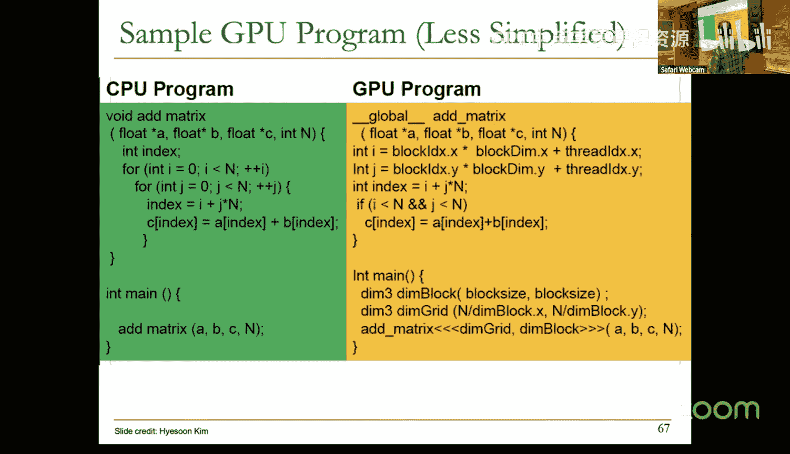
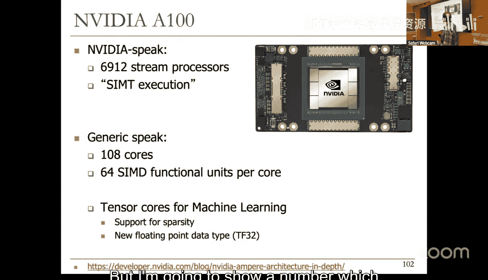
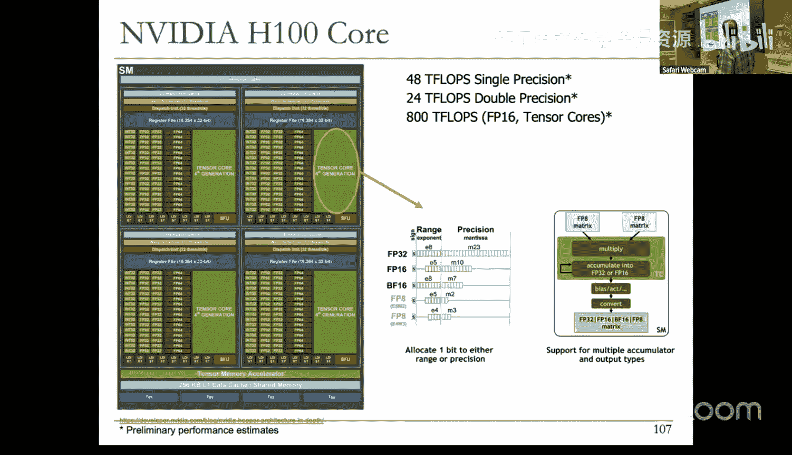
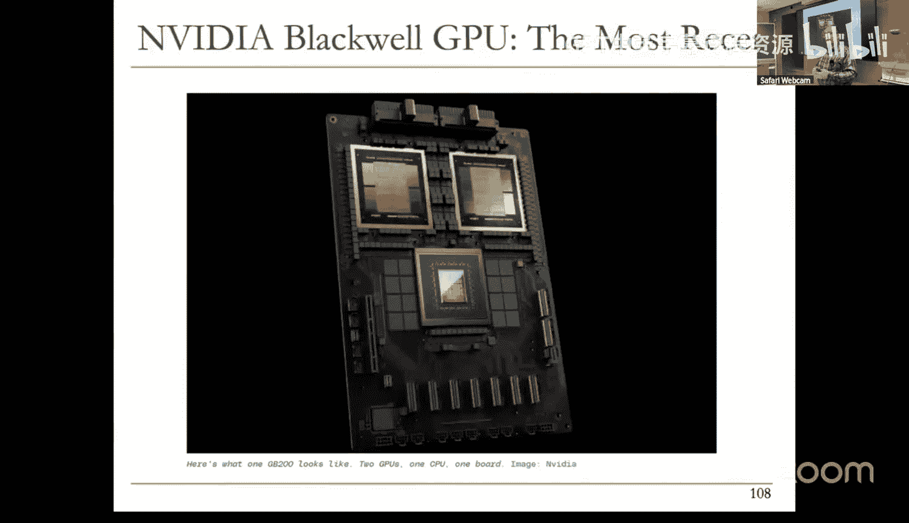
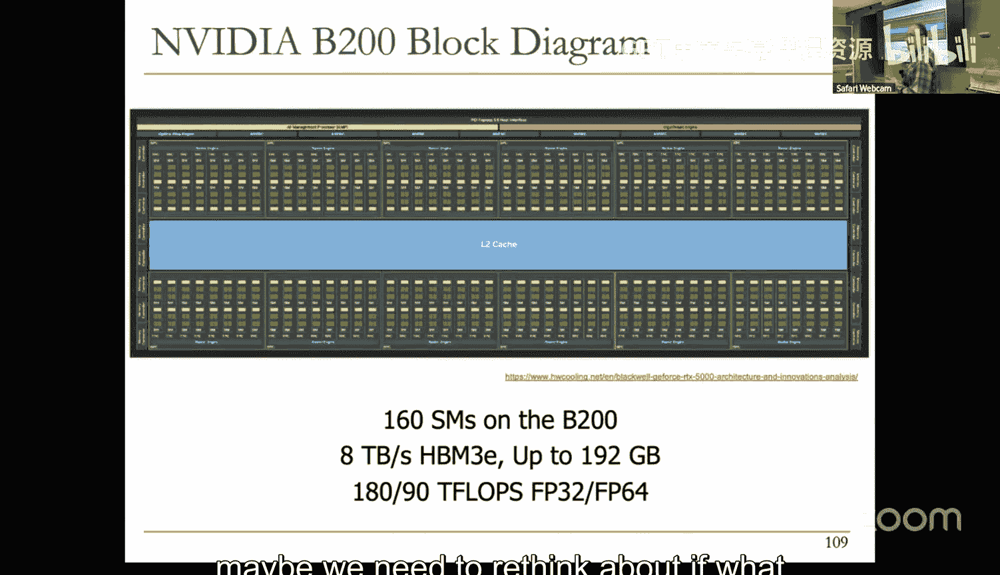
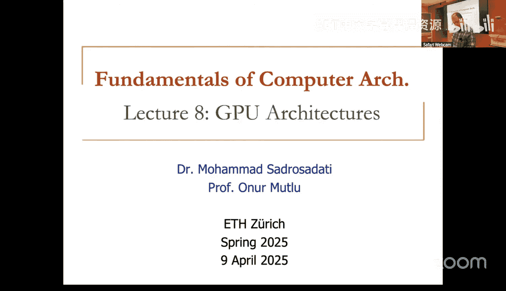

# ETHZ《计算机架构基础》课程：第8讲：GPU架构 🚀

## 概述
在本节课中，我们将学习图形处理单元（GPU）的架构。我们将基于上周关于SIMD执行、向量处理器和阵列处理器的内容，深入探讨GPU如何结合这些概念，并通过编程模型的创新使其更易于使用。GPU是现代高性能计算和图形处理的核心，理解其工作原理对于计算机架构的学习至关重要。

---

## 回顾：SIMD与数据级并行
上一节我们介绍了SIMD（单指令多数据）架构，它是利用数据级并行的有效方式。向量处理器和阵列处理器是实现SIMD的两种主要硬件形式。

*   **阵列处理器**：拥有多个强大的处理单元，每个单元可以独立执行操作，实现空间上的并行。
*   **向量处理器**：通过流水线化的功能单元，对向量数据的不同元素依次执行相同操作，实现时间上的并行。

这两种架构都依赖于高带宽的内存和寄存器访问，以保持流水线充满数据。它们的性能优势在于能够分摊指令获取和解码的开销，但在处理不规则数据并行时效率会降低。

---

## 从SIMD到SIMT：编程模型的演进
本节中，我们来看看GPU如何通过改变编程模型来简化并行编程。关键在于区分**编程模型**和**执行模型**。

*   **编程模型**：程序员如何表达代码，例如顺序执行、数据并行（SIMD）或多线程（MIMD）。
*   **执行模型**：硬件如何实际执行代码，例如乱序执行、向量处理或多线程处理。

GPU采用了一种称为**SPMD（单程序多数据）**的编程模型。程序员编写一个看似标量的程序（一个“内核”），这个程序将被成千上万个线程同时执行，每个线程处理不同的数据片段。硬件则动态地将这些线程分组，以SIMD（在GPU术语中常称为SIMT，单指令多线程）的方式执行。

**核心优势**：
1.  **线程独立性**：每个线程可以独立执行，甚至执行不同的控制流路径，这比传统的SIMD编程更灵活。
2.  **灵活的线程分组**：硬件可以动态地将执行相同指令的线程分组，形成**线程束（Warp，NVIDIA术语）**或**波前（Wavefront，AMD术语）**，这是GPU执行SIMD操作的基本单位。

---

## GPU架构核心：线程束与细粒度多线程
以下是GPU架构如何利用线程束和细粒度多线程来隐藏延迟并提高利用率。

*   **线程束（Warp）**：一组（通常是32个）执行相同指令的线程。它是GPU调度和执行的基本单位。
*   **细粒度多线程**：当一个线程束因内存访问等长延迟操作而停滞时，GPU调度器会立即切换到另一个就绪的线程束，从而保持计算单元的忙碌，有效隐藏延迟。

为了实现快速的上下文切换，GPU拥有**巨大的寄存器文件**，用于存储所有活跃线程的上下文。例如，一个GPU核心可能拥有256KB的寄存器文件。

**执行流程示例**：
假设一个线程束有32个线程，而SIMD执行单元宽度为8个通道（即8个处理单元）。那么，完成这个线程束的一条指令需要4个周期（32/8=4）。通过在不同的周期交错执行不同线程束的指令，GPU可以同时利用空间（多个处理单元）和时间（流水线）上的并行性。

---

## GPU编程模型：从内核到线程束
程序员使用如CUDA或OpenCL等框架进行GPU编程。以下是编程层次结构：

1.  **网格（Grid）**：一个内核调用的所有线程块。
2.  **线程块（Block）**：一组线程，它们可以共享一块快速的内存（共享内存）。线程块被分配到GPU的流多处理器（SM）上执行。
3.  **线程（Thread）**：最基本的执行单元。程序员为单个线程编写内核代码。

硬件负责将线程块内的线程分组为线程束。**关键约束是：一个线程束中的所有线程必须来自同一个线程块**，以确保内存访问和同步的正确性。

**地址计算**：每个线程通过其唯一的线程ID来访问不同的数据元素，例如访问数组 `A[thread_id]`。这使得内存地址计算非常简单高效。

---

## 处理控制流分歧
在传统的SIMD中，处理分支（如if-else语句）是复杂的，因为所有数据通道必须执行相同的指令路径。GPU的SIMT模型通过硬件处理**分支分歧（Branch Divergence）** 使其对程序员透明。

**工作原理**：
当一个线程束遇到分支指令时，线程可能根据各自的数据选择不同的路径。GPU硬件会：
1.  先执行选择路径A的所有线程，暂时禁用选择路径B的线程。
2.  然后执行选择路径B的所有线程，暂时禁用选择路径A的线程。
3.  在分支重新汇合点，所有线程恢复同步执行。

虽然这简化了编程，但会导致线程束利用率下降（部分线程被禁用）。因此，编写分支较少的GPU内核对性能至关重要。

---

## 高级调度与优化技术
为了进一步提升性能，研究人员和工业界提出了多种优化技术。

*   **动态线程束形成/压缩**：将来自不同线程束但执行相同指令且线程ID不冲突的活跃线程合并成一个新的、利用率更高的线程束。
*   **两级轮询调度**：为了避免大量线程束同时到达长延迟操作（如内存访问）而导致调度器“饥饿”，将线程束分组调度，确保总有可用的计算密集型线程束来隐藏延迟。

这些技术旨在提高SIMD单元的利用率和整体系统吞吐量。

---

## GPU架构实例与发展
GPU架构在不断演进，核心数量、内存带宽和计算能力持续增长。我们以NVIDIA的几代架构为例：

*   **Fermi（2009）**：引入了L2缓存，支持更高效的细粒度多线程。
*   **Volta（2017）**：引入了**张量核心（Tensor Core）**，专门用于加速矩阵乘加运算，极大提升了深度学习性能。
*   **Ampere（2020）**：增强了对稀疏矩阵运算的支持。
*   **Hopper（2022）**：支持更低精度（如FP8）的数据类型，以适应AI训练和推理的需求。
*   **Blackwell（2023）**：通过芯片间高速互连（如NVLink），将多个GPU连接成强大的计算集群，以应对大模型对内存容量和算力的双重需求。

现代GPU不仅是图形处理器，更是通用的高性能并行计算平台。

---

## 总结
本节课中我们一起学习了GPU架构的核心原理。我们从SIMD和向量处理器的回顾开始，探讨了GPU如何通过SIMT编程模型将数据并行性抽象为多线程，从而简化了并行编程。我们深入了解了线程束、细粒度多线程、分支分歧处理等关键概念，并看到了GPU如何通过巨大的寄存器文件、高带宽内存层次结构以及先进的调度策略来实现极高的吞吐量。最后，我们回顾了GPU架构的演进历程，看到了它如何通过集成专用加速器（如张量核心）和增强互连技术来持续满足日益增长的计算需求。理解GPU架构对于设计高效并行算法和系统至关重要。