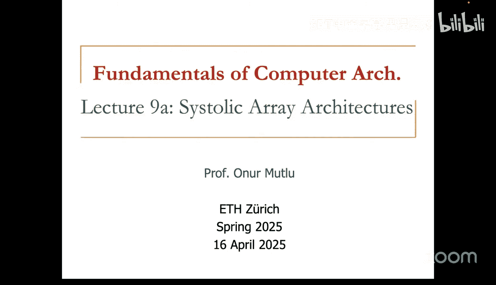
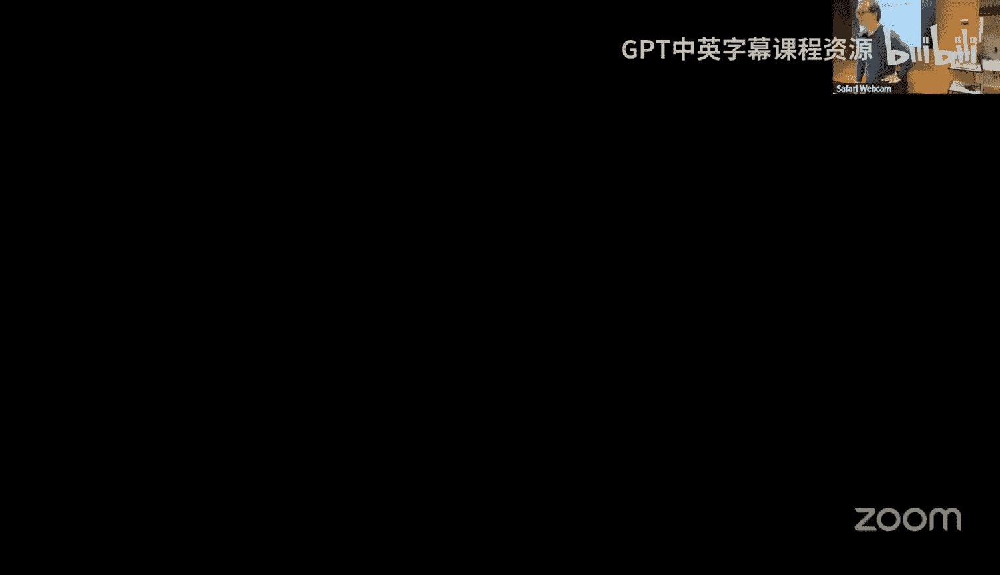
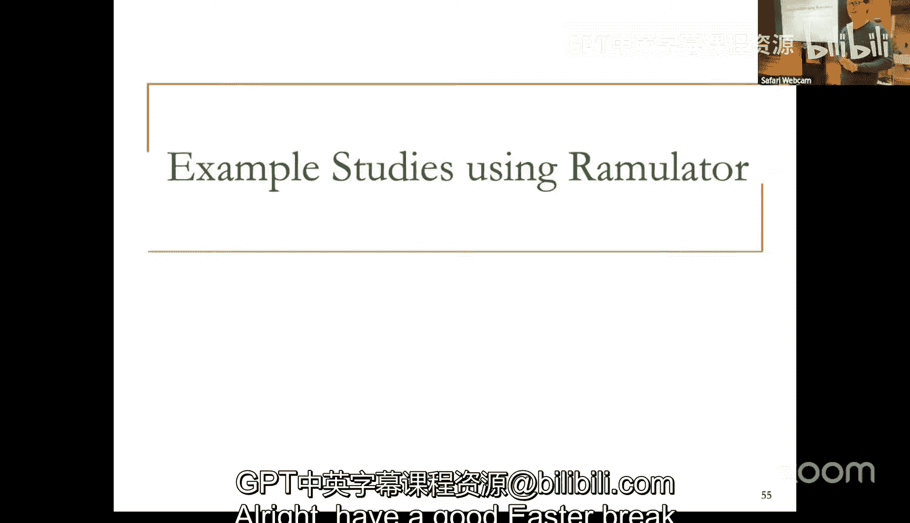

# ETHZ《计算机架构基础｜ETH Fundamentals of Computer Architecture 2025》中英字幕 p09 Lecture 9_ Systolic Arrays and Simulation (Spring 2025).zh_en -BV1Xc19BnET7_p9-

Okay。

your three project。はい大丈夫。我在十。実しまい。That is a good approach。Where are the SaOnly one。Asオッケ。

You got the latest flight though。For both for a to send them like 20 million。

I wont throw them my latest too， have something to this。Okay， that phone will work。なな最。

My own computer， I forgot to charge excuse me。也是他。I don't know the I have if you havent I mean。

 it's not urgent as's not but want last。😊，have put现嘢。

Maybe we can charge mine and then I don't have a much。You don'tて nice。Thanks。😊，Why it warm here。あ。

Thanks， we can take it once it's a bit charged Okay， or second done。は。What is this。Okay。

 how do we clean it， Is it easy。这 is他。With this sir that thing Oh okay， go ahead。

 I'll let I'll let you decide I might， I don't know。

 that's why I don't want to clean it on the critical path。I may not also oh' see。

 normally the previous course should clean it but。Everything is okay online， we' start in a minute。

Youチ上 a good time。Yeah， sure， you can hear me， right？I didn't do anything to this， you can hear me。

Oh good， yes， I'm speaking。とこす。But no okay， takes a while。 Yeah， yeah， okay。It looks much better。

Thanks clean。诶か。咁。Thanks yeah。嗯的。St hands。🎼。Okay。So。My been charging。Okay， let's get started。

 may you have a smaller crowd today， is there a reason for that？

all day soon。

。Not yet， you know，18th is when the holiday starts now， okay， anyway。

I hope people who are not coming to class are following。Online。

 I know some people always come to class， that's great it's good tell people who interact and express interest。

Okay， so today we're going to jump into systolic arrays。😊。

And this is probably the last model we will cover in terms of execution paradigms。

Last week we covered GPUs previous week Cdy， were they interesting？

Yeah so we covered a lot of things I mean we may cover multi threadreading at some point but let's see we don't have a lot of lectures in this course so if you're interested in multi threadreading probably computer architecture the place to go to but before I start zoom always place tricks okay I will tell you that we have a lot of research opportunities if you're interested in doing research and the topics we've covered and also a lot of topics that we didn't cover like a lot of topics in computer architecture memory storage security systems and also bio informformatic please feel free to contact us we have a lot of opportunities you can of course take our seminar course some of you are doing it computer architecture course which are more which is more advanced seminar course and more paper reading。

You can do the readings and assignments， but essentially if you want to do research， talk to us。😊。

And there are us meaning me， Muhammamed， other people who are part of the group of Constantino。

 Constantinos here， and there are other people who come sometimes。

There are many exciting projects and research topics and again I'm not going to read all of these。

 but we do a lot of work on new future computing systems。

 I'm especially interested in new execution paradigms like in memory computing that are different from everything that we're talking。

 more memory centric computing paradigms。😊，And also we do a lot of work on hardware， robustness。

 safety， security， et cetera， and heterogeneous systems， yeah， okay。

 and also architectures for important workloads， hardware software co design。

So there's a limited list so if people are usually ask us like okay if I want to do a thesis with you what do I do basically talk with us is the right answer over here。

 you can of course go and look at what we do this is this is our publications list there are a lot of things over there that you may want to look There's also a somewhat up- to dateate thesis list but it's really not up to date in the end because it's very hard to keep it up to date it's more important to do do work then keep the thesis list up to date so talking with us is the best way and maybe we can recommend some papers etc and you can learn about us I mentioned this in the first lecture but there's a lot of information on our website about our group and these are some people。

😊，Look， Constantinoius is there in 2020。😀Yeah。😊，That's him。A younger version， yeah， okay。

 but basically we have a bunch of。😊，Things that describe our research。

 these are really newsletters that we release almost every year。Well。

 one of them is coming up in 2025 as you can see you can based on last time prediction。

 you can predict when it might be coming next and we have a lot of videos but you can talk to us also so there's a lot of materials on what we do。

 our mindset etcter。😊，And if you're interested in doing a PhD at some point。

 we do that also and I'm proud of all my PhD students and postdocs。

 I think postdocs is not a complete list， but we need to complete it at some point。

 the font size will become a little smaller than if we do that and they've done a lot of outstanding work and right now they're leaders in academia and industry。

Okay。Now if you're an ETH student you don't necessarily need to apply talking with us the easiest way。

 but if you're an online person somewhere else other than ETH。

 this is how we can get to know you if you're at ETH you have kind of an advantage clearly right because you're taking this class we can see you we can talk more easily but if you're not at ETH and it's harder to do that so you need to apply in that case。

😊，And the application site is already there， okay， okay， with that out of the way。

 and I'd encourage people who are interested in doing research to try doing research。😊。

If you are not confident， let's say it's okay like when I read my first research page I didn't understand anything which is fine。

 I mean's that's how you learn right the learning curve is high but once you actually overcome some activation potential you can do a lot of exciting things I think so in the end there's no pain no game。

😊，you got to have some pains on that you can actually get to a point where you can actually lead the field threat。

😊，It just doesn't happen， I mean， unless you're absolutely randomly lucky in some way。

 that also happens， but the probability of that is very， very low。Okay。Okay。

 so now we've covered everything up to here。 I'm not going to cover decoupled access execute。

 You can take a look at the。😊，Maybe we can premiere a very short lecture on that I'm going to cover sytoic arrays because this is a topic that's really critically important。

😊，え？Like in a sense， I'm a very principled architect， I like principles。

And I've been covering systolic arrays since 2009 when I was teaching at Carnegie Mellon and people were asking。

 why are you covering these things， nobody does this。

Today a lot of people do it why was I covering this because I thought it was a principled architecture。

 it's very important for accelerating some workloads and if you have a principled architecture at some point it could actually be beneficial。

😊，So I'm going to cover this， but now today is not 2009， today is 2025。

 so you'll see examples of real systoic arrays employed for machine learning。

 especially Google does that a lot， but there are other companies that employed as well。😊。

Today it's actually when you do machine learning， it's really a combination of Sdy and systolic arrays。

 even at Google， even though they start with systolic arrays。

 they added SMD units also because they wanted to reduce the overheads， in fact。

 we will see that Google uses VLIW S and sstolic arrays in their TUs。

 all three paradigms are there together。😊，And then there's a host CPU that controls it。

 so there's all of these paradigms are also there。😊。

So basically what you learned actually is real in real systems and you're going to learn a very important one。

 I think。😡，Okay， so these are readings， this is I mean there's nothing required but I would suggest reading this is this beautiful paper by HQ it's not the first paper。

 he is really the inventor of hisystoic eras and he did this in 1970s with Charles Liersson and then this is a nice paper that summarized it and then these are Google papers that actually introduced their TU and also talk about someU2 TU2 on TU V3。

😊，It has a Google bias， so be careful。Sometimes when I read some of these papers， I mean。

 I cringe because there are some things in there that are interesting。

I can imagine a video of people reading them also。Okay。

 it's good to think about that okay so let's go into systoic arrays okay basically if you want to talk about systoic arrays you have to think about general purpose versus special purpose systems right so clearly we talk a lot about general purpose systems I can execute anything these are very flexible they can execute any program they're easy to program and use but they don't provide the best performance and efficiency on anything essentially。

😊，They're good at average performance in efficiency。

And then on the very extreme end you have special purpose application specific integrated circuits。

 maybe Serus is not the best example for this， but Cerus has some special purpose if you want to be really special purpose you burn the program into hardware that's the real ASIic in the end and then you're very efficient and high performance for that thing that you burned into hardware you don't have any control overhead you don't have any instructions let's say everything just flows maybe but it's very difficult to program and use and it's very inflexible you may run only one program or a limited set of programs now this is more on the special purpose and because it's really unable to execute everything and then you can basically think about where the other things lie some of these are some of these used to be very special purpose GPUs but they became more and more general purpose by adding new things FPGAs you could argue they're actually general purpose but maybe they're not good at executing everything etc so it's good to think about where do these things lie there's not a clear spectrum over here but this is definitely general purpose rate if you want to be special purpose completely。

You just burn the program into the heart。Okay， so systolic arrays are closer to this end。

 essentially， basically they're very special purpose engines， and they're really not like GPUs or SD。

 they're an execution model。😊，Essentially， they implement an execution model called systolic computation。

 this is different from One Neman， different from data flow and different from what we looked at with GPUs like CD CT paradigmise。

😊，And they're initially designed as special purpose X。

 and they're today used as special purpose X also。😊。

And the reason they were designed was actually for convolutions filtering pattern matching。

 special purpose matrix vector computation， image and vision processing。

 signal processing pattern recognition and machine learnings essentially all of those today that's why they've been successful let's say with the rise of machine learning so today they are currently heavily used in machine learning in specialized accelerators so their general execution model is actually can be generalized so we' will actually generalize their execution model to more pipeline processing not the pipeline hardware but pipeline processing pipeline parallel programs and we will see that these could be useful for other purposes as well and I truly believe that I think we need to look at more of these systolic computation examples in other programs as well。

😊，Okay。And we will see some of this later in the lecture so what is the motivation for these essentially the original motivation was to design accelerator that is simple regular because that's one of the benefits of designing accelerator right so you can if you're simple and regular you can do things much more efficiently perhaps so you keep the unique parts small and regular。

😊，You want high concurrency， high performance and accelerator clearly。

 and you want to tolerate the memory issues， so you' be want to balance computation and memory bandwidth。

And we're going to talk about that， we're going to talk a lot more about memory when we go into the future。

 in fact， in this lecture I added some slides that talk about memory also。😊。

So basically the idea is to replace a single processing element with a regular array of processing elements and carefully orchestrate the flow of data between the processing elements such that you have tightly coupled computation that happens in the processing elements and you fetch the data only once computation happens in this。

 let's say array of processing elements and then you write the result back to memory。😊。

This way you don't need to fetch everything back and forth from memory。Okay， basically。

 collectively these processinging elements transform a piece of input data before outputting it to memory。

😡，And the benefit is to maximize computation down a single piece of data element brought for memory。

😊，Makes sense right and you can also think about it maximizing the arithmetic intensity of the program。

 you bring one bite of data and you do a lot of operations on it and then you push it out to memory。

😡，That's what you would like， of course， it works if you have that sort of computation。😡。

So this is a picture from the paper that I recommended from H Kung essentially he motivates this this way also。

 you have a processinging element and memory and if you have only one processinging element you may actually need to keep fetching data。

 you do something you fetch data， you do something and you write back to memory。

 you fetch data again you do something and then you write back basically in this picture you have a vector of processinging elements or one dimensional array of processinging elements and this processinging elements does something to the data passes on to the next processinging element which does something else。

 pass on to the next one， next one， next one， next one and you basically put it out to memory after a long time and in this case you basically multiply the millions of operations per second by 6x because you have six processinging elements right。

😊，Okay so that's the basic principle and that's the real basic goal in the end and HCKung actually has done a lot of theoretical work on balancing IO and compute needs。

 this is very important actually in my opinion today we're very imbalanced with memory access versus compute and he has done a lot of interesting work in this area。

😊，Okay， so if you why systolic， basically， you can think of the memory as the heart。😡。

And you can think of the data as the blood and you can think of the processinging elements as a cells。

 and memorymmi essentially pulses data through the processinging elements right and this is how he motivates it all。

Okay， so essentially data flows from the computer memory in arithmic fashion passing through many processinging elements before it returns to memory。

And I've already said this right， it's similar to blood flow， different cells plus to blood。

 and it can be many dimensional just like the blood flow and we will see some many dimensional examples too。

😊，So essentially we've discussed this why I already said all of these。

 I think this sort of design satisfies those requirements assuming your computation matches this sort of computation paradigm。

Okay I think I already said all of this so you can ask what is the difference from pipelining it's actually pipelining at a different level right not the pipeing that we saw pipeing we're not pipeing instruction execution we're really pipeing the flow of data across many different computations that's the idea over here but compared to pipeing we have seen the difference is these are individual programming processing elements they could very very powerful basically if you look at the pipeline that we have seen it's a stage that can do only some part of the instruction here these could be actually very powerful right if you think about it。

😡，Erayse structure also can be nonlinear and multidimensional。

 we have not seen that in pipeing pipelineing is very linear right we're going to see multidimensional arrays that can communicate with each other。

 so it's really a processing paradigm as opposed to improving the instruction execution execution of instructions and people parting them into smaller stages。

😡，It's going to be multidirectional and different speed also。

 the connections between processinging elements and processinging elements actually if you generalize us they can have local memory and execute kernels rather than a piece of the instruction。

😊，So that's the key difference from pipeing， hopefully this is clear。

 probably obvious to a lot of you guys because you've seen pipelining and we've discussed it。

Okay let's take a look at an example systoic computation again convolution is one of the computations that's done。

 this is used in a lot of things like filtering pattern matching correlation。

 polynomial evaluation and now machine learning convolutional neural networks for example which is essentially using a lot of these concepts in the end a lot of yeah and many image processinging tasks actually did this even before the rise of large neural networks for example and I said machine learning over here so what is convolution we're going to see this as an example later on but essentially you have a sequence of weights or vector of weights you have an input sequence or a vector of input data and you compute this essentially。

😊，TheresSome multiplication we're going to see this a little bit more soon。

 but let me motivate this a little bit more after more recently people have figured out how to use these convolutional neural networks to。

😊，Really do some computation on images and figure out essentially what the image looks like right you may be familiar with Lynette。

😡，This is one of the， let's say， smaller， not so deep neural networks that was introduced initially。

And what you do in some of the layers of this neural network。

 there are many layers in the neural network， you basically do some convolution computation and you do some sampling and then you do some more convolution and then you do some more sampling and then you do some more computation and then eventually you figure out what the output may be right it could be an AB。

C， D， EF whatever， whatever you're trying to recognize in this case you may be trying to recognize letters or digits in fact line it was for digits。

So basically what is convolution in one of these steps it's very simple in the end。

 this is an example， this is the input that you have。

 you could think of it as a two dimensional array part of an image for example。

 and then you apply a filter to it you apply some kernel to it so these are the essentially the weights this is the input these are the weights and you apply it to different parts of the image。

😊，In a sense， you conul the image to an up。That's the idea and you can see this is basically doing that the filter goes through different parts of the image and it's applied and then you compute every single output element。

😊，Make sense， right，Clearly you could do this with the matrix multiplication also and we're going to see that。

😊，呃。Okay。I mean， I don't need to talk about a lot of things over here。Okay。

 so this is another example I like this one because you could compute the values if you're interested。

 I didn't do that so there might be errors here， but you can do it， I think。😊，I hope it's right。

 I think I did for one and then I didn't do it for the rest。😊，Okay。Okay， and this is。

 if you're interested， this is actually Lynette Jan Len has。

 he is one of the like inventors of the deep neural networks has a website where he actually talks about how this works。

et cetera we're not going to talk about that， but again if you look at this convolution operation what you're doing is you have some input features。

 input data， you have some filters that look like this and they could be of different sizes we're showing small sizes over here and then you want to compute some output and the computation is you take。

😊，These input features and essentially comm them multiply them with the convolution filters and each input over here is the multiplication so you can actually do the computation over here if you multiply this。

Let me see。Yeah， essentially you can follow the green ones over here。

 this output over here is really an output of these three different filters apply to that element or these parts over here。

😊，Hopefully， that makes sense。 In fact， you can do the computation。

 perhaps So what we're doing is really multiplying this and this。 And if you do that， you get。😊，Yes。

2 tooth。7even。If you do that element by element multiplication， right， you get7 in the end。

 If you do this multiplication， you get three more to one and these are0。

 So the multiplication gets zero。 and if you do this one you get。Only two， seven， three。

 two should be 12， okay。Hopefully that made sense right and then you apply basically for every single element this one moves over here so that you could compute this element。

 all of them move over here and also if you want to compute this element this filter moves down here。

😊，And all of these filters move on and then you do the same multiplication and then if you want to compute this element。

 this filter moves down to this lower quadrant over here。

 so hopefully it makes sense and you can hopefully verify us in the first iteration of the slide we had some error so that was a bit annoying。

 but this should be error free。😊，But this is one way of doing computational of convolution。

 Another way of doing computational convolution is essentially what we saw matrix multiplication。

 which is very well done in GPs， for example， potentially。

 you could basically translate this convolution into。😊，Something that looks like this。

You basically have these filters laid out horizontally as a vector。

This is the other filter over here which we didn't look at and then you also look at the input features laid out horizontally like this right so you take this this this that's one horizontal and then you take this this this that's another horizontal etc well in that case is vertical depends on which one you do first right one of them can be vertical one of them is horizontal and then you basically multiply this vector by this vector and essentially you get the same thing at the end。

Hopefully that makes sense so you could use a systolic array to do something similar to this or you could use a GPU or a systolic array to do something this like this also so it's good to think about transforming computational so we're going to look at a systolic array that does something like this first。

😡，Makes sense。Okay。So I think it's also motivational and that's one of the reasons I won' to talk about research at the beginning of this because computer architecture has actually played a lot of role in machine learning。

 sometimes machine learning people don't realize that。

 but basically the reason Alex not got developed was because some folks at the University of Toronto and you will see who those are took an architecture course programming GPUs course and they basically figured out how to develop the implementation of a deep convolutional neural network。

 how to train it。😊，Such that it can provide much better accuracy in recognizing images we're talking about 2010。

😡，And they went and published this paper。whichhich is a very important paper。

 it's essentially the Alexnet paper， which won the competition of recognizing images。😊。

We're talking about 2012 and after this actually neural this is probably the turning point where after which neural networks really took off。

After this there are other people like Google Ne， Google developed up this Google Nes which basically make things deeper and deeper and then other people they all up other things。

 essentially if you look at the history， this is the Alexnet paper previously people were using some shallow networks etc and with the deep neural networks they reduced the error in classification of images significantly as you can see and over time people added more and more layers to these networks which are essentially doing a lot of convolution and other stuff and today the accuracy is better than human。

Yeah， I don't know if you believe that。Yeah， these are error rates basically 28% error went down to 3。

6% error， of course， this is all dependent on the image data set， right？😊。

So maybe difficult images humans are much better。That's why you sometimes go to a website and the machine asks you。

To check what is this in the image and they train neural networks based on your responses hoping that you actually gave the right response So if you want to confuse them give the wrong response all the time。

😊，Yeah。yeah， maybe， yeah， as long as you can tolerate that， right？

Okay so there's a lot more literature on neural networks， but that's not the purpose of this。

 but the key thing is there's a lot of convolution that's happening the blue layers and these different networks are convolutional layers so it's an important computation so there are also other computations which we're not going to go through。

😊，Okay， so let's take a look at how systo carriesries execute a simple convolution basically this is again a copy paste from the H k paper essentially we're going to see how a systoicary can be designed to execute。

😊，This multiplication between two vectors it's a different type of multiplication as you will see it's not element y okay so this is these are the outputs that we want so if you look at the y vector okay let me go back so we're computing Y Yi is really a combination of a lot of things w1 w to wk but then Xi X plus1 so you can see that you're multiplying and then y2 is like this assuming you have three elements in w oh what happened and three elements in x this is what y elements should be。

😊，You can verify that， but I think it's correct。And this is how you can design a very simple processinging element or systolic array that can do this computation nicely。

 so let's take a look at each element over here， this is the processinging element。😊。

And it's very specialized， as you can see， it can do， it stores the weight。😡，Over here。

 each of them stores a different weight， so this is how we combine them later。

 but assuming it stores weight W。It has two inputs， x in and y in。That we want。

 and then it has two outputs， x out and y out。Okay。

 let's take a look at what y out is y out is basically y in。😡，Plus， weight times exit。

 so you do this multiplication based on two inputs and you produce an output。😡。

That's the computation it's very specialized as you can see。

And the other computation that you do is really passing the data。To the other side。

 essentially exal is assigned exit。So there's no computation over there。

 you're just moving the data so that the next pressing elements can get that data。😡，That's the idea。

So can you can think of this as a weight stationary thing， right， essentially weights are loaded。

or maybe even hard hardburn into the hardware， but probably that's not a good idea today。

 but you have your weights in these processinging elements and you connect them like this。😡。

And now the problem becomes， how do you supply the data so that you get the right outputs， right？😡。

So you supply the data the left from these inputs， these are the X in。

 and it turns out to you need to supply the data x1 first。And then you need to have one， let's say。

 one cycle where you don't supply anything。And then you supply x2。

 and then one cycle you don't supply anything， and then you supply x3。

 we're going to solve this problem in the next slide by decoupling multiplication and addition。

But if you do this。Eventually， at some point， x1 will reach。W1 right。

 and then at the same time when x1 reaches this pressing element that stores W1， you supply y1 also。

 so you need to orchestrate the data flow。s that the data the input data that you want comes to the right pressing element at the right time right so you're kind of pumping data if you think you're pumping x's from here。

 you're pumping outputs from here and when x1 comes over here after some number of cycles because this is only three so then y1 there should be some signal saying that oh。

 I actually get the output over here and then this computes essentially what you want right W1 plus x1。

😡，呃。And then passes the output， which is y out over here。Makes sense。

 right so now we have w1 x one over here。😡，And then this moves over here and the x2 moves over here right one cycle later。

 so now you have w1 x1 over here and then you add to it W2 x2。😡。

Hopefully that makes sense and then that goes over here when that comes over here you get xt over here and then you add W3 xt and it can also go through the other parts when you supply Y2 et ce Yes Yeah exactly exactly you can think of it it's essentially empty you can also think of it another way right you basically sample the output at the right times。

😊，Right。Does that make sense？Yeah you need to basically I have a little bit more complexity to start the competition。

 but yes， you're really doing competition so that's y1 and y2 you can actually do something similar so when when actually you supply Y2 at the right place and this becomes W1。

😊，X2 right x2 will arrive over here and when x2 arrives here， you should also input the y1。

 let's say， and then you'll compute w1 x2 right。All place shiftedEx， exactly。Exactly yes。Yeah。Okay。

 hopefully it's clear， this is， I think very clever。And it's very minimal hardware， right。

 you don't need much hardware for this。And HD Kongung in another figure shows that how you can actually。

Do things better so you can actually implement adder and multiplier separately to allow overlapping of addition and multiplication executions Again。

 I will not go through this in detail， but essentially。Thing are a bit decoupled over here。

 you have the multiplication， you have the addition over here， but you can see that you have。呃。Yeah。

 essentially you have w1 x1 and you add to add that to y1 over here。

 but you need a little bit more complexity by adding latches to be able to decouple things again I will not go through this you can study it in the paper。

 but it's very simple concepts of by latching， you can decouple things a little bit。

And get a lot more perils。Okay。So basically hopefully it's clear that you need to carefully orchestrate when data elements are input to the air rate。

😊，So okay let me go back to this so this is very specialized you can you can change this right you can actually make it something compute something else。

 it doesn't have to be convolution it could be something else but convolution is a nice example。

 it could be also a matrix multiplication as we will see something else essentially so it could be anything if you think about it right it could be any specialized hardware over here as long as you can orchestrate the data nicely。

😊，Meaning that your computation needs to be systolic or regular。

So it's a different type of regularity if you think about it。SMD， as we have seen with CMD and GPUs。

It was some sort of regularity， data parallel regularism。

 you can probably map that over here also in fact you can。

 but this is still slightly different in the way it exploits that regularity。😡，Okay。

And basically you need to orchestrate when data elements are input to the end and when you capture the output。

 essentially， that's the y is coming from the right， if you remember。

And this becomes more difficult or more involved， you need to be al let's say careful if you increase your array dimensionality。

 this was a one dimensional array of crossing elements。

 if you do two dimensional as we will see soon， you need to be a bit more careful。

 but again you need to orchestrate the data elements and output。😊。

It's become more difficult if pricing elements are less predictable in terms of latency。

 then you attach stalls， et ceter。😡，Not good for sytlic carriess in general。

 but it's possible to do also。😡，Let's take a look at matrix multiplication again this sort to be simple again。

 but I think in general the concept is simple， but if you want to do this matrix multiplication A and B and you need to define how you do it there are multiple ways of doing it actually one way of doing it is basically saying keep the final result in the processing element another way of doing it is actually move the final result somewhere else right so there could be multiple ways of doing systolic computation matrix multiplication。

😊，But again， we you're going to use a processinging element that looks like this。

This is actually a previous exam question， I think in one of our DDCA exams， if I remember correctly。

Basically what we have is r R is the result that we're going to have inside the processinging element at the end of the systolic computation。

 hopefully， for example， for one element r should be the dot product of this vector a00 a01 a02 with B00 b0 B10 B20 right that's essentially c00。

To get C00， you need to multiply this vector with this vector， right？

This row vector with this column vector okay okay， so this processinging element can actually accomplish by putting together these crossing elements in a three by three setup and orchestrating the data movement of A's and b's into those crossing elements you can do what do the matrix multiplication it's a very simple processinging elements again it's basically。

😊，Let's start with what it passing data it passes the left input M to the。

Right output p or you can think of it it's basically this is the this is the west input and this goes the east output right p equals m and it passes the let's say north。

Input to the self outputq equals n that's easy and then it accumulates in R so a result gets updated as result which is initially zero plus m times n it multiplies the let's say east and north inputs right。

O。😊，We should have named these as northeast west south right that would have been better for explanation next time Okay so this is the systoic array that does' it for three by three but you can generalize it of course if you want to essentially。

😊，You have this three by three， eventually this three by three array store C00， C01， C02， C10， C11。

 c12。And ideal we would like to get this computation done to be able to get that computation done。

 this is how you feed the data。😡，You feed the first row of a matrix like this a0 or0 first and this is the time as you can see at time zero first cycle。

 you feed a00 and the next cycle you feed a01 and next cycle you feed a02 and similarly at time0 you feed b00 and this one accumulates into it a00 times b00 which is what we want。

😊，And so this is easy for the next one， you basically don't feed a zero。😊。

Over here because initially there' is nothing here right you need to wait a little bit and this one will come one cycle later assuming these are all single cycle operations and that's true for this vector this row vector so initially you don't feed anything so that you wait for what comes from the y。

😊，dimensionmens right so basically you stagger the feeding of the rowwise input by one cycle so that things come at the right time when you have both data elements right and you do the same thing for the column inputs also if you think about it and you can convince yourselfsve that this will compute。

Essentially this。Basically， in the first cycle or cycle zero， this will be a00， b00。

And in the next cycle， everyone will move by one， so a00 will come over here。😡，B011 will be here。

 so this will compute a00 times b01， which is again what we want。While that's happening。

 this will add to a00， b00， a01 times me10。😡，And that's what we want。Because you have a 0，0， B 0。

0 over there。 and then you add to it A 0，1， B10。 and you're accumulating essentially basically the dot product of those two vectors。

 Okay， so this one way of doing system computation is beautiful， as you can see。 And clearly。

 as matrix size grows， you can paralyze a lot more。😊。

But there people have developed up other ways so that you don't keep the things id， et cetera。

 right now there's a lot of idness potentially here。😡，Okay， make sense， right？Beautiful。

That's why it's principle， and that's why。😊，That's why we taught it for many years okay so if you look at H Kung's paper there's a lot of interesting things over here he talks about different systolic arrays two dimensional and we looked at but doesn't have to be two dimensional it could be diagonal etc ceter I'm going to talk about actually and there's a lot of interesting discussion over here that I'm not going to go into he talks about the matching of memory speed versus computation speed etctera which are really important things actually and you need to do that in sytolic arrays。

😊，So he has this nice example， I like this one you can actually chain together multiple different types of systolic arrays to really form powerful specialized systems。

 for example， this particular systolic array is producing on the flyly least squares fit to all the data that has arrived up to a given moment。

😊，So it could be ingesting data from a sensor and you try to like model what kind of distribution there is in that data and want if least square fit is what you want。

 this is a beautiful， very specialized， let's say combination of systolic arrays that can do that。

So it could come up with a lot of interesting things。People don't do this yet， but I like it。

 but here you can see that you're orchestrating data such that the data comes at different points and then you need to do some buffering。

😊，Also to do orchestration of data when you communicate between different systoic arrays， right？Okay。

 if you're interested there's a lot of interesting stuff in that paper that's why it's recommended Okay so basically that's it I mean that's just solid computation for you The rest is going to be some generalization and also what's done today but let's talk about pros and cones of this clearly this is a very principled approach the principle is really to efficiently make use of limited memory bandwidth that was the reason this was developed so is that you actually make do a lot of computation on a single element fetched right。

😊，Or if you think of another way， you balance your computation and Io bandwidth available。

 you don't want IO bandwidth to be a bottleneck basically。😡，Or memory bandwidth， I mean。

 people use Io bandwidth and memory bandwidth interchangeably in the old days， especially。Okay。

 it's specialized computation should fit the PE organizational functions and it can make it very。

 very lean right if you think about it there is no instruction here right there's no instruction overhead。

😊，All of that is gone if you look at a modern CPU as we looked at there's a lot of instruction processing overhead right no instruction。

 it's just data comes in， there's some operation done and then data comes out。😡，Okay。

 so basically efficiency is very high， it's very simple design。

 high concurrency and high performance if you design well especially。

 so it's basically good to do more with less memory bandwidth requirements。😊。

The downside is also specialized， essentially that's an upside as well as downside because now what if your problem doesn't fit into it or you cannot find a good way of fitting it？

Essentially， it's not generally applicable because of this reason。😊，I mean。

 even data paradigm C is not generally applicable， right， if you don't have enough data parallelism。

😡，A GPU is very wasteful， a CD engine is very wasteful because for example。

 if you're running scalar code on a GPU is terrible because you use only one SiD lane。

That's exactly why when Cray designed its computers in 1970s， the Cray one， for example。

 it was a heterogeneous machine。They had a vector engine。

And they had a scalar engine and their scalar engine was faster than anybody's scalar engine at the time because they were very aware of MDDA's law。

 they basically said， oh， we can paralyze our quote but in the end our performance is very limited by how much we can paralyze。

 there's a scalar component that's going to bottleneck us。

 so let's make the scalar engine as fast as possible。

So Craig was another person who was very smart in terms of designing simple computers， yes。😊，Well。

 not necessarily you can design a installed array without a GPU right。

 it's actually used I don't know if it's disclosed necessarily。

 but it's used in a lot of matrix computation units， for example， accelerators， even in CPUs today。😊。

Pieces of the CPUs， potentially。Yeah， usually matrix about authentic today， right， exactly。😊。

Sa it again。We're going to talk about that yes yeah。😊，Okay。So okay。

 let me generalize it before we talk about that basically they're very popular because of matrix multiplications that we do in machine learning。

 but it's not the only way， so other people， for example， we discussed last time cerebras。

 for example， they use SD units。😊，Modern GP modern TUs use a combination of it。

I think modern GPUs also use a combination of things， right with the tensor cores， et cetera。

So in the end， a combination of multiple paradigms are。

 but I'm going to give you a very concrete example that explains things nicely from the TPU world。😊。

Because GPO doesn't like to disclose a lot of stuff。

Okay so let's generalize it basically you can do more program mode so you can actually turn this into a little bit more general paradigm you still need to orchestrate the data moment essentially each programming element be can store multiple weights as opposed to a single weight in fact weights can be selected on the fly it could have a small memory if you think about it and this easy implementation because when you do adaptive filtering you may want to use different weights and when you want to do actually more general you may want to do different kinds of filters you may want to apply different kind of filters to image because you're doing different operations different on the image so you don't want your weights to be let's say single or hardwired。

😊，And if you take this further now each programming element can have its own dedicated data and instruction memory。

 maybe again specialized but data memory can store partial temporary results and constants and if you do this now it becomes a general model like stream processing pipeline parallels more generally I think I like calling it stage execution essentially you divide your computation to stages and each stage does something and you can specialize your processing element for that particular stage assuming you're executing that stage many。

 many times for example and then one stage passes the outputpost to the next stage and there are models like this like pipeline parallel pipeline program this is again high levelvel programming model but this sort of programming model matches nicely the underlying structure of a systo array so in this case basically you have a loop。

You can divide your loop into three different code stages， let's say。😡。

And these stages are executed sequentially right ABC ABC， ABC， ABC。

 and it turns out maybe you divide your code such that you have very good locality over here。

 you always a always executes on some piece of memory B always executes on some other piece of memory and C always executes on some other piece of memory and they actually communicate with each other nicely and then you keep executing this so one way of doing this is basically programming this is basically A's are always executed on processor zero such that you exploit the locality across A。

😊，Bs are always executed in processing one and C's are always executed in processor two， right。😊。

And people do this actually in pipeline parallel models， assuming you can parallellyze it this way。

and now you need to communicate between a0 b0 c0 so this looks like very good systolic computation rate if you think about it。

 let me actually look at this a little bit more， essentially we divideliberation to stages。😊。

And you could have threats。Execute stages on different course。And now I'm generalizing。

 that's why I'm using this terminology and the core or a processing element can be specialized for the computation that execute on that。

 right？😡，And then you have basically some communication mechanisms within so this is s computation if you do this and this is one example I mean there are many examples actually compression decompression are very good examples for these things。

 but when you do file compression for example assume that you're doing a lot of compression operations and decompression operationss you may ask me when video processinging is a great example for this thing actually if your're YouTube for example designing。

😊，These things you don't want to do anything in software。

 you basically do a hardware design in fact Google has produced a video engine which operates somewhat using similarly to systolic principles。

 I mean not exactly with this because this is just my example from 2010 or so but essentially you have a lot of files coming through or pieces of files and you want to essentially compress them or decompress them。

You can design a systolic hardware that basically does different things in different stages and each stage can be very very customized to what you do This is a software view of things。

 but you can imagine a hardware view of things also and if you're interested。

 I didn't put the slide over here， but Google has a VU paper video processinging unit paper and Isca 2021 that operates on similar principles。

Okay。So I basically imagine this happening on many， many files。😡，And that's YouTube for you。Okay。

 okay， so I think we we've said a lot of this so I'll go through this again relatively quickly。

 essentially we have a special purpose however which is high efficiency。😊。

If you generalize it and you make multiple use of each data item。

 you better use a Mary benefit high concurrency and regular design。

 which sounds great for a specialized hardware right regular design enables it to be easier to implement。

😡，Clearly。So the disadvantage is， again， you need regular parallelism。

 some sort of regular parallelism， and you need to orchestrate the data。

Special purpose is not generally applicable， and also you need software and programmer support to become more general purpose rate。

😡，O。And if you want to actually fit a problem that doesn't fit， good luck。

That's basically the trouble。😡，Sometimes I mean this， even though this model looks nice， for example。

 partitioning a loop over here， it may not always be easy， right。

 especially if you have a lot of dependencies。😡，If the loop is not easy to paralyzze。

 you have a lot of trouble in the end。That's where the out of order process all the data flow paradigms shine。

Because you cannot paralyze things easily。At the software level。

 or you cannot basically figure out what model fits well。

Okay let me give you a little bit of history this was developed by H Kung in the 80s and he was a professor at CMU and he basically designed one of the earliest prototype of the systolic array let me finish until we get the TPU and then we'll take a break but basically I like these works because it's very interesting early works and the goal was to really accelerator very similar to a TPU as we will see soon and this was a simple one and at the time we were talking about 1980s right so everything is big at that time so the machine is also big but you have a host machine and you have a linear or 10 cells each cell as 10 megaflog which is thing today clearly but it's big at that time it's also a programmable processor and they also designed a high levell language and optimizing compile to program the systolic array to make it easy for you one and the goal was to really accelerate vision and robotics tests and they actually had good success they describe it in this paper and this is what the thing look like it's essentially the systolic array that we've seen right？

😊，嗯。And they called it the warp processor。And each cell looked like this so there's some more programamblety as you can see right there's there's some memory。

 for example， over here there's some Q for y and x， there's some addresses。

 there's some address generation unit so there's some。Add and multiply registers， et cetera。

 so basically if you think about it it's a little bit more complicated so that you can actually program it。

😊，And you can read the paper， which is very interesting。But it's essentially the same idea。

Of a TPU TpU is actually more specialized， Maybe I'll go through this and then well take a break because it's kind of a nice transition。

 This TPU when it was introduced in 2017。😊，It's essentially doing matrix multiplication similar to what we've discussed。

 the feeding of the data is a little bit different。

 but basically if you read this systolic data flow of the matrix multiply in it and you can see that software has the illusion that each 256 by input is read at once and they instantly update one location of each of 256 accumulator ramps。

😊，That's essentially doing what we have seen maybe slightly differently。😊，You can read it。

Let me see if I want' to say anything over here。Okay， I don't I don't。

 I'll let you read it because it's essentially the same concept but you can read it。

 so basically what we've seen over here is real today。😊，And this was the first， let's say。

 big processor。This is a very interesting paper you can read it right now。

 in fact I got to learn that this is the most cited Iska paper ever。😊，In history。

 even though it it was in 2017， so it had a lot of impact if citations are a measure of impact。😊。

Which is interesting。😊，Partly because it's also from Google。Yeah okay anyway。

 but if you look at this， this is the systolic array matrix multiplication and at the time it was 64K per cycle they reduced it over time because they figured out it's better to do smaller matrices and paralyzed many of them which is interesting so if you read the later Google papers they talk about that and was initially just a systoic arrays we'll see in the next version it's something else but there's a lot that goes into making this work if you think about there's some memory you need to fetch fetch from DDR3 in the first version into a weight fetcher and then put the weights inside and and then orchestrate the data so they actually built a programming model compiler just like H Kunddt in 1980s。

😊，It's the beauty of being an academic， I think you envisioned in the 1980s and somebody built it 30。

 40 years later。So it's good to be patient。He may be dead by them but H was still well alive so that's good okay anyway you can read more about it but later Google improved this。

 for example， they added more Tp chips today actually it's much bigger they changed DDR3 basically weight fetching was too slow with DDR3 so they added high bandwidth memory they added more floating point operations they increased essentially a lot of things and they designed for training and inference versus only inference so this was version two today we're at version6 I think so you can see that they wanted to paralyze a lot of matrix operations and if you look at each。

😊，Obviously， they call Tensor cord， which is unfortunate because they had to clarify it to the black diagram of a tensor core。

 our internal development name for a TU core， and not related to the tensor cores of NVDdia GPUs。😊。

Can check on with better names okay anyway， I mean I like this I'm just joking。

 it's interesting that two folks come with a similar same name， right？😊。

It's also interesting that these guys want to claim the name after someone else did it anyway。

 they're interesting but if you look at this the really interesting part is it's a combination of a lot of paradigms now we have high bandwidth with memory and you have a vector unit this is Cdy like last week similar to GPUs。

😊，And then you have a matrix multiply unit， which is essentially a sytolic array。

 and the vector unit really controls a matrix multi unit。 What is not shown here is。😊。

The core sequencer， which is really VLIW。So what we've seen VLIW also exists in existing systems because their compiler compiles into this VLIW thing and they don't talk a lot about how they handle a lot of things。

 of course， but essentially software managed instruction memory execute scalar operations using a 4K。

 32 bit scalar data memory， it's not shown here， somewhere some other figure， and 32。

 32 bit scalar registers I'm4 with the vector instructions of the VPU。😊。

So you get a vector instruction inside yourIWM forwarded over here and then that one can forward it to the matrix multiply units or execute them so there's some complexity in mold yes mentioned smalleres。

😊，So EI that we just got multiple small matrices within the one command or is it。Yeah。

 basically the encoding of the instruction specifies the small matrices， yes， exactly。Yeah。

 not multiple matrices， but I don't know exactly you need need to go through it yes yeah。😊，Yeah。

 but that's yeah so this is and then what does the senseensus and video GP use is not the same？So it。

 it's a bit different。sor， I think Tensor core and N media GP is not as powerful。

 It's really just I maybe Mohammad can correct me， but I think a tensor core in M media GP does just matrix multiplication。

 right， Yeah， this one is basically they called the the whole， let's say this is。

 I would say this is a much more powerful core。😊，It's a bit unfortunate that they both called their tennis court。

 but I didn't do that yeah。And then they connect many of these things okay so later they actually figured out that that much you need more memory。

 so they actually increased the memory， they went to higher like higher bandwidth with HPM。

 they added more matrix units， they increase the processinging capabilities so basically these things are getting bigger。

😡，This is one of the latest one they published on and you can see that in a single board you can have one x of flops of computation again you can look at these and if you're interested they're actually interesting papers。

😊，Some of them are hard to eat， I think， but you can take a look like this one's interesting。

 this one's also interesting， but they actually have optical interconnect to communicate across the TUs as well。

😊，And this is one slide that I just found a couple of days ago on they actually have some version that they didn't describe。

 but they keep improving it， as you can see。Okay， okay。

 this is a good place to take a break because now we're going to deconstruct some of this TPU stuff and show that it's even though it's actually very efficient that computation maybe it can be a lot more efficient。

😊，So let's take a break for 10 minutes， we'll be back at 17 and we'll continue。Yeah。Book。8月25。对。

Hopefully not today， that's good。Its scheduled for7 of May。Okay。

 so it's that's what the paper alongside I told Mohamd。Okay， okay course okay。

 I we can change it then right， or do you think。If it's possible to change you， it's what。呃这什。

we do we can swap it with someone else or add it as another presentation sometime。No。

 we don't have any more probably。donWe have one with three so we can split this。And add this one。

But my question was basically if you want or， whether to not leave it or session in between only one I agree。

 but then someone needs to move right the last there again papers。That could be good my checking。

T0 papers would be good yes， I agree。So it， I mean， those are related to each other actually。😊。

What is for sale It's okay， Okay， okay， then I think， but yeah， do something reasonable。 Yeah。

 I think it's okay。 it's okay。 as long as if you can maintain the topic a little bit。 that'd be good。

 But even if you cannot what can you do， sure。😊，对。No do this。いてて。嗯ん。I like我 you。

Where are the Greek guys。Three I saw them and they didn't come。😊，Okay， okay。

 why didt you tell them when askedal Yeah， exactly， Are they outside， Yes， true。 Yes， tell them。😊。

I'm not sure where they are。They were setting up their desktops。 Okay， and that's not a good result。

 I think， I think now they're doing progress。 Okay， they could do it here also。 Yeah。

 I just let me let me leave you to them。 Okay， I'm not gonna add fuel to the fire。' not a fire。😊。

Yeah。面么的。You what， we are loyal。not thing there's a reason why he steer。たいそ。2一。All right。

 so I'll see you soon。嗯。Oh。密汁。But Saturday is split of them。I'll schedule many people there。

 I think I'll schedule many people there。Including the Greek guys， the traitrs。嗯。Yeah。Like。啊。

They can do the progress reports。Maybe必。财不。Exactly， that's the purpose of this。I think it's time。

Almost。I think so I would like to。 I'm going slowly。You're going to switch to it at some point。

 Yeah yeah，'ll see when we get to it。N are you online。 Oh good。How about now。You can， Yes， okay。

 I don't know what online。Yes。应该是。还 know didn。I。Okay。If it's working， let's continue。 Okay。

 so we basically covered systolic arrays and you can see that。It's actually interesting。

 I think machine learning exploration uses hisytoic arrays at the core of the matrix computation。😊。

But you also have other paradigms surrounding it and controlling it。

So existing machine learning consists of multiple paradigms， Cd plus systolic。

 and some include VLIW also， which is interesting， I think。

But let's deconstructed so this is a study that we did with Google。

 especially for edge models I'll go through this relatively quickly to especially foreshadow what we're going to discuss later what is the future basically so if you look at a Google HtpU。

😊，Essentially when you so Google released the Cloud TPU whereP。

 HTPU is very specialized for edge devices， like if you're in the field。

 let's say and if you want to do some machine learning inference。

 this is a smaller version of the TPU essentially with much lower energy and cooling requirements and we analyze this for edge machine learning models that are used at Google at the time。

 this is a paper that summarized a lot of the results which is very interesting I think。

 but essentially it's very memory bond。😊，And this is going to be what we'll discuss later。

 more futuristic models， so if you analyze different models that are executed， some of them are CNNN。

 some of them are transduucers， LSTMs， etc ceter， long short termm memories。

 especially on large models， if you characterize the energy consumption on this HPU。

 you see that most of the energy is really spent on going to DUM and off chip Interconnect to get the input data and to get a lot of things essentially parameters。

That's true for other models also， but not as dramatically， let's say。Okay。

 so basically there's a lot of analysis in the paper。

 essentially the HPU or a TPU is a one size fits all accelerator。😊。

Whereas if you look at these models， this is looking at two different metrics for each model layer in this case for different models。

 on the y axis we have arithmetic intensity flops per white on the x axis we have parameter footprint essentially how large are your parameters input parameters to the model and you can see that there's a huge difference。

 huge spectrum over here and a huge spectrum over here。😊。

Some of these models have some of these layers have very high arimetic intensity。

 very low parameter footprint， great fit for a TPU。😊，So this area is probably not a bad fit for TU。

 but if you go to this area， you have very， very little arithmetic intensity。

 you do only one flop per byte and your parameter footprint is very large because of the way models are constructed。

 of course you could improve arimetic intensity with some techniques as well but this is what we had at the time。

😊，And basically if you look at a single layer or single model within each model across different layers。

 you also have a lot of variation so this is a multiply and accumulate operations so there's a huge variation as you can see this is the arimetic intensity there's also a huge variation across different layers so the question is does it make sense to have a single accelerator to cater to this huge variation inside the models and across the models。

😊，And the basic idea here is basically no， instead of designing a Malthic accelerator。

 we could design a family or a different types of accelerators to cater for different types of families。

😊，And in this particular case， we kept a very lean version of the HTPU to handle compute centric。

accelerationccelation， meaning these are the things that don't have a lot of memory intensity。

And you can simplify this a lot is one of the reasons they make the TPU bigger is because they cater for many intensive parts。

😊，But if you actually design an excccelator only for compute intensity。

 you don't need to have a huge let's say memory for example and you can reduce the array size also。

 so basically that's the idea again we may go into this one we talk about memory centric computing and we also design two other systolic arrays in the 3D stack D and very close to memory so that we can actually do more datacentric acceleration for layers that have a lot of memory intensity。

 very low arithmetic intensity for example。😊，And you have a scheduler that schedules the different malls and layers to different families。

Okay， so if you do that， the question becomes， how do you identify the families。

 you can do this classification online or offline again based on the。Arithmetic intensity。

 we have parameter footprint， we have some classification of these different layers into compute centic versus data centric。

 and then we ship them to different accelerators。😊。

And if you do that you get actually significant energy consumption reductions improvements and also throughput improvements and again I will not harp on these numbers you can read the paper for more detailed but you can customize a lot more and these are we're still using only systolic arrays so systolic array compute centric syto array and two data centric sytolic arrays theyre data centric they're two different ones because we try to cater for different types of intensities and different types of data flow。

😊，Hopefully this is interesting。So this is a more researchy thing as you can see。

 it's always good to ask the question， is this enough right， is this good enough。

 that's how you make things better by questioning things。😊。

Okay I think these guys also asked the question like is is this good enough and they came up with a very different approach I think Muhammad discussed this last time but I'm not going to go through it in detail essentially they have a wayer scale approach。

 so they have a huge chip like this， which is a lot of implications of course on cooling reliability etc。

 but their main goal was to actually overcome the memory bottleneck that we were we also discussed right essentially they wanted to put a whole lot of compute together with as close as possible to a whole lot of memory。

😊，In the end it's a different approach for executing matrix multiplication or neural networks。

 so they have a MIMD machine as we have seen last time and each MID machine consists of SD processors。

 so this doesn't have systolic arrays， but it's good。😊，Essentially， if you want to be more efficient。

In the computation， maybe you have a systolic array。

 You still have the MD Sd and systolic array paradigm。 It's possible to do it trick。

 They just at least so far based on what they expose， they don't really。

Do a systolic erase inside their system。Okay。Okay there's more on the topic。

 so I think Muhammad left with the slide， but last time it may not have made sense right now you know GPUs and systolic arrays。

 there's also FPGs which I'll have one slide on and there'll be the last slide so the question is which one's better for machine learning which one's better for different workloads。

😊，What types of parallelism or what type of parallelism does each one exploit。

 what are the trade offs I'm not answer any of these。

 but these are actually really good questions to ask and these are questions people are asking in the field also。

And you can see that it's kind of a mix of different models that people employ today to do the best。

诶。People have used FPGs also for neural network exploration。

 this is a nice paper from Microsoft on using FPGs they call this project brainwave so that they can accelerate computation again basically they map matrix vector multiplication into hardware directly。

😊，I mean， you could implement a historical area on FG also right you could implement a GPU and FPG but they actually implemented this directly so if you're interested you can take a look。

😊，Of course， FPJs have other implications as well they're quite generally reconfigurable。

 so maybe the implementation of this on an FPJ is not very efficient。😊。

But I think internally at Microsoft， this had a lot of impact， I don't know if it's still used。

It may not be the most efficient implementation in the end。

Because of the very general purpose design of a PGs today， right？

If you if you design a sytolic array。😡，Just for matrix computation。

 it's very different from configuring lookup tables and connections in FPGA which has a lot of overhead right and if your goal is to maximum efficiency and maximum performance FPG is a lot of things let's say that are controlling the reconfigurable。

😊，But they have interesting results。Okay， so that brings me to the end， any questions。

 any other questions on Systoic erase？We can overlap some latency or is it easy to find where it this。

 Okay， I see myself。Oh， is this correct。 That's 9 A。 Okay， I'll let you find what 9 B。

Maybe somewhere else。嗯。How did it come over there？Magic。Share， I think， did you share。Okay。

 you share afterwards。Okay， we have 34 minutes to cover。Simulation。

 clearly we're not going to cover everything in simulation。😊。

But it's important to discuss this because you're going to do some more simulation for your later laps。

I don't know if I'll be able to cover the em later， but let's see。Okay， cool， thanks。Well。

 you've been doing simulation so， but I think it's a more formal lecture on simulation。😊。

And I like this because this is really where you can invent new things and how you can really explore new ideas。

 I think you cannot implement hardware for everything right every idea you have if you had to implement hardware。

😊，You would be very limited to idea throughput right your idea throughput is very low in that case and there are things that you cannot test in real hardware。

 how do you test them？😊，Like if you have some futuristic idea like a systolic array。

 initially you may not be able to implement hardware， but you test them in simulation right。😊，Okay。

 so I'm going to focus on memorymism especially but that'll become come a little bit later。

 so how do the question is how do we evaluate new ideas for new architectures， right？😊，呃。

Another way of asking this question is how do we assess how an idea will affect the target matrix X？

😡，So there are many potential evaluation methods， some of which are not used as much in architecture when you design a new architecture。

 when it's theoretical proof。😊，Depending on what you are investigating， what exists is。

 this may be difficult， especially our performance energy consumption， this may be difficult。

 may be okay to prove some security characteristics， etc ceter， for example。

 but theoretical proof was usually much tougher for performance energy welllish。

An optical modeling an estimation， you have some an optical model that you design and based on some assumptions that you make you can guess what the performance could be what the energy could be this could be useful for regular things so if you have very regular computation for example matrix multiplication with some assumptions you can perhaps get some good analytical model that describes a hardware maybe a systolic array I don't know。

Looks like we have more visitors coming。Magically。Magic。Yeah， okay。And simulation。

 which is what we're going to talk about， is you can do this at varying degrees of abstraction and accuracy。

😊，But they missed the systo part of lecture you。Which was arguably the more interesting one right I like this one because this is also going to enable other ideas so basically you can do this at varying degrees of abstraction accuracy and that's what we're going to talk about today。

😊，But there's also other things that you could do， you could prototype with a real system。

 for example， if PJs are very good for this purpose。

 I think you can do a lot of prototyping of new ideas。😡，Again， depends on the idea。

If the idea is completely， let's say different， you may not be able to get the benefits on prototyping。

You may get close enough， maybe。So there's a danger of evaluating new ideas with existing hardware。

 right that's always because what you're envisioning is a very different hardware。😡。

If it could be done with existing hardware， then you could do it。😡。

So evaluating very different new ideas with existing hardware is usually difficult。😊，Okay。

 and then you could go and really implement your idea。

 and this is of course probably the most expensive。😊，Way of testing your idea。And if you fail。

 and also it takes a long time to do this real implementation right。

So anytime I have an idea which one do use becomes a question and usually especially with forward looking ideas。

 you need to do these two， probably analytical modeling and simulation。😊。

I'm going to talk about simulation， but I don't thinkical modeling is increasingly important too。

 but it has a lot of limitations in terms of what you can model over here。😊，Okay。

But let me talk about a prototyping platform， so this is something that you can use clearly for some things。

 right？😡，And we actually did have a lot of prototyping platforms using FPGs to test the EM chips。

And this is a lot of benefits， we have a lot of papers， I'm not going to talk about them right now。

 but maybe in a future lecture we'll discuss so these are a lot of FPGs connected to PC and FPJs do something testing memory chips is one example。

 we released the softT infrastructure which is actually a programmable memory controller where you can test test DM chips。

😊，You can read papers about it there's also a newer version of this Dm vendornder with multiple FBG prototypes in fact there's an HM prototype also essentially you can test the DDR 3 LPDDR DDR4 HM chips。

And what is this useful for basically discovering new things like Grohammer。

 figuring out different kind of error mechanisms？😡。

And these are some papers that I will not go through right now discovering new problems and I like this actually because by doing this sort of prototyping。

 you can discover new things that other people may not have discovered so that's the benefit of I think prototyping or designing platforms that could be useful for understanding what already exists。

We also discovered like you can actually do bitvis operations in DMM by violating the timing parameters。

 we may again talk about that later on， and you can do simultaneous raw activation。

 row copyping inside real DM chips， come DMM without changing the DMM chips。

It's also interesting and more recently we looked at other redistance issues which make things much worse so you can study a lot of interesting things with real prototyping platforms also so this not to mean that they are not useful。

 they're very useful but it may be very difficult to use this sort of prototyping platform for some other purpose so it all depends on your purpose in the end if your purpose is to come up with a completely different architecture。

 maybe this is not easy on a prototyping platform。Okay。

 so another thing that you could also do with prototyping platforms is。

You could do more N2 evaluations if it's possible to do so in this work we introduced a FPJbased framework and the idea is to hopefully evaluate some N20 applications if you can port to it so what this FPG has is as a risk five processor in it it is a memory controller all of them are memory controller is programmable essentially you can run a full application a full operating system and the idea is whenever the risk five processor executes a memory copy instruction it ships it to the memory controller and the memory controller copies the data internally inside the DM without actually bringing any data to the processor so we do memory copies inside DM we're going maybe talk about that later on but you could do some things in real prototypes and this is actually very useful and the reason you could do it in this case is because we could violate some timing parameters and DM so that you can do back to-back row activations in a single sub and do the copy so there's a lot of interesting things。

Over here and this may become more interesting later on when we talk about memorycentric computing so there are limited things that you can do with real prototypes even with like looking at emerging paradigms。

 there's another thing that this does which is really generates random numbers so when the application has a random function called we ship it to the memory controller memory control violates some timing parameters in DM produces random numbers because violation of some timing parameters leads to some cells to fail randomly and if you can actually identify which cell say randomly you can have a random number generation inside the DM chips and then you can supply that to the program that's running on the risk by posture so it could evaluate some things assuming you can do it existing hardware。

It's also fascinating。Okay， so if you're interested there's a lot of all of these tools are open source and you can find them and we actually these are real results this is basically copy initialization and throughput if you do it by offloading copy initialization to the memory controller you improve throughput significantly for these micro benchmarkchmarks。

😊，And the reason is this processor is a wimpy， very simple processor。😊。

If it was actually like if were using all of the techniques that we developed in this lecture。

 out of order execution， et cetera， tolerating latencies。

 then this number would go down by an order of magnitude， but still you would get a lot of benefit。😊。

Okay。So basically the。😊，You can can benefit from real prototype。

 but the difficulty in architectural evaluation is really there are many difficulties。

 one of the difficulties is the answer is usually workload dependent。😊，Cashching， for example。

 pipelining。Any idea we talked about， well， we didn't talk about some of these。

 but this is a slide from some other lecture， but we're going to talk about some of these light drop。

😊，Workloads change essentially you may say， okay， I want to evaluate these workloads but five years down the road workloads may change right。

 you may design for example for machine learning inference but then training becomes important and you may need to design something else。

😡，Your workload may be a neural network， but later it could be an LLM。And 10 years down the road。

 hopefully it's not a dumbbell lamb， hopefully it's a much better thing。😊。

And system has many design choices and parameters also， and so basically as an architect。

 you need to decide many ideas and many parameters for design right。😊。

It's not used to evaluate all possible combinations in the end， right？😡。

And system parameters may also change right so there's a lot of things that may change in the end and I think if you design a good simulator you can explore a lot of these so I call this field of dreams。

😡，So essentially， if you're an architect， if you're designing a new chip or new idea and a research。

 you're really dreaming， you're trying to create something right？😊，And simulation is， I think。

 a key tool of the architect because it allows the evaluation understanding of nonexistent systems。😡。

It enables you to explore many dreams。😡，Potentially。

It gives you a reality check of your dreams also if assuming that you design the similulator reasonably。

😊，It enables you to decide which dream is better， which is nice， I think。

But it also enables you to fool yourself with false dreams or bad dreams， let's say。

 so basically if you don't have a good simulator， you may actually make a bad decision， right？😊。

So that's why I think this is really an interesting topic and design of simulators is really important for enabling the good things while hopefully avoiding the bad things。

 right？😊，Okay， so we're going to talk a little bit about high levelve simulation the simulation happens at many levels also like if you design an RTL code。

 for example， is transfer level very log and then you simulate it。

 that's one level there's a lower level you can actually have circuit simulation right you could actually you don't have to stop at RTL right why not show look at all of the circuits and look at all of the analog simulate everything in analog right you could do that also except it's much slower so basically as you go into the lower and lower levels you become slower and slower high level simulation is faster and that's one of the benefits。

😊，Basically， low level simulation， RTL is one example of it。

 but there is actually the lower level sulator simulations also that you could do。😊。

It's intractable for design space exploration， it's too consuming to design Neval it essentially。

 especially when you have a large number of workloads to test。😡。

Especially if you want to predict the performance of a good chunk of a workload in a particular design。

 basically takes a lot of time to actually assimilate it。

 especially as your RTL code or pro gets more and more complex right。😊。

And if you want to consider many design choices， so a lot of things multiply in the end and this is just an example from caches right there are many things and even in a single cache。

😊，And then there's memory controllers， there's in order versus Autoboard execution。

 there's reservation station sizes， most store queuees， et。

So you don't want to basically do a very slow simulation to decide things basically our goal is to explore design to us quickly to see their impact on the workloads we're designing the platform for。

😊，So that helps that's where high level simulation is very beneficial right and then there are many goals in simulation also right people use simulation for many reasons one goal is to explore design space quickly to see what you want to really implement right potentially implement an next generation platform or proposes an next big idea to advance the state of the art in both cases you really want a quick design space exploration but maybe in research you want an even quicker one right because you really exploring big things that are harder to even implement an RTL right if you come out with some new idea how do you implement an RTL to begin with you have to explore a lot of things with it。

😊，So the goal here is to mainly see the relative effects of the design decision。

 the goal is not to really fine tune， oh， if I do this， I get 0。01% right？😡。

That's not the goal over here。But there is a case where that goal is also important where for example。

 you design a simulator to match the behavior of an existing system， you implemented a processor。

 the best processor of its time， let's say， and then you want to calibrate your as similulator so that you can actually debug and verify it at the cycle level accuracy。

😊，And。So that you can propose small tweaks to the design that can make a difference in performance energy right so here you're operating at a very with a very different goal。

😡，And the goal in this case is very high accuracy in the simulation of player because you want to matchsh the system and you want to understand its bottle next in simulation because you don't have enough visibility into the real hardware that you implemented。

😊，But in a simulator you can modify things and see that visibility right if you match your the systems' behavior then you can actually do a lot of interesting things still over here and this is very useful for designing the next generation of your processor。

😊，For example there could be other goals in between actually and there are other goals you can refine the explored design space without going into full detailed cycle accurate design so that you can make the next level of decisions you can gain confidence in your design decisions made by higher level design space exploration so usually you have a progressiveor refinement and simulation if you go design hardware。

😊，there are some simulators that are very high level they could be merged with analytical models actually and these give you like high level things and then there's a next level of simulation that's a little bit more detailed and then there's next level of simulation that's a little bit more detailed and then you have RTL at the bottom so you progressively actually go from the highest level to the lowest level when you're getting closer to releasing your product clearly but also having these different levels of simulation enables you in the end real hardware enables you to go back and fix the simulators so it's a nice loop and if you have a long tradition of designing procedures you can actually fix a lot of things make your simulators much better over time。

😊，Makes sense。Okay， so essentially there are trade offs and simulations and usually there are three metrics or at least three metrics to evaluate the simulator。

 how fast your simulator is， how flexible it is， and how accurate it is。😊。

Accuracy may be tough if you're looking at that future system， right？

But basically how fast the simulator runs， it could be measured in different ways。

 this many instructions per second， I can simulate this many cycles per second。

 or this is the slowdown compared to real system。How flexible is how quickly can you modify the simulator to evaluate different algorithms and design choices and accuracy is how accurate are the performance and energy numbers versus a real design。

 it's also called simulation error。😊，Okay。😊，And the relative importance of these metrics depends on essentially where you are in the design process and why your goal is clear。

😡，Maybe I don't care about。Speed as much， but usually you do usually you have a requirements with these and usually you can get two of these and not three of these is one of those things where you can get two of these。

😊，Did you get all three？I think if you get the second one， there's a height sense you get tone three。

If you get the second one flexibility， you get all three， good luck。😀はは。😊，Okay。

 we'll need to look at that in more detail， I think it's tough。Yeah。

Maybe he's going to give a lecture on how he gets all three later， not right now。😊，Okay。

 basically it's usually a trade off， for example， speed and flexibility affect how quickly you can make design decisions and trade offs。

😊，Accuracy affects how good your design decisions might end up being。😡。

And how fast you can build your as similulator so simulator design time is another metric。

 basically how fast you build your as similulator in fact。

 this is really important because if you're designing it。😡。

Reelatively different architecture if you don't have a good simulator for it。

 you may not be able to start right and this is what happened to Intel a while ago when they were moving from Pentium Pro to Pentium 4。

 for example， they didn't have a very good simulator。

For Pentium4 and eventually some very smart simulator designer architect came and fixed it so they didn't have a disaster today they have other disasters not related to simulation I think。

😊，Okay。So flexibility also affects how much human effort you need to spend modifying the simulator。

 that's also important right。Because if it's not flexible and if you want to really look at an idea。

 then you may actually need to go and spend a lot of effort to change the simulator。😡，Okay。

 essentially you can trade off between these three things to achieve design exploration and decision goals in the end。

And I don't believe we can get all three at the same time。Depending of， what you define as accuracy。

 right？😊，If you can tolerate some inaccuracy， you can maybe get three。Okay， so high levelsim。

 the key idea is to raise the abstraction level to give up some accuracy to enable speed and flexibility and hopefully quick simulator design。

😡，So the advantages， I think we kind of talked about it。

 you can still make the right trade offs hopefully and can do it quickly， right？😊。

All you need is modeling the key high level factors。

 you can omit coronary case conditions that doesn't happen， for example， a lot。😡。

And that's actually a good start， what happens and what doesn't happen as long as you make a good decision of that。

 you can get rid of a lot of things that are not needed to be modeled， at least initially right。😊。

So all you need to get at this level with high level sum is to get the relative trans accurately you don't need exact performance numbers。

 maybe like if I have IDA， IDIB， I don't care if it's well I only care that A should be much better than B right as long as I get that right。

 maybe I make the right decision。😡，The disadvantage of course yeah you may make the wrong decision if your ass simator is not good enough right so that's always a danger and it's always good to know that it's a danger and be very careful in designing a similulator in in terms of what you can omit what you cannot omit。

 for example， for example， if your workload has a lot of。😊，TlB misses。

 and if you don't model the TLB， you may be in four troubles， right？

So virtual memory performance can be important and you can talk to Constantinos about that。

So basically， how do you ensure you get the relative trends accurately， right？

So I mentioned this earlier， but view simulation as a progressive refinement。

 you start with very high level models and then you develop medium level models that are less abstract。

 you go to low level models， and then eventually you get a real design right hopefully at some point。

😡，As you refine， abstraction level reduces as you go from basically top to bottom。

 accuracy hopefully increases。😊，But not necessarily， again， if you're not careful。

 they are actually very interesting works that sometimes appear and they show that， oh。

 if I can model things at a higher level， abstract level， I actually get less error。😊。

Because sometimes I make the wrong things over here when I model things， whoa。

 so maybe that's what you're thinking。That's possible。

 but when you go from the top to the bottom your flexibility reduces and let me give you one example of what I meant。

 so you model energy for example， right？😡，One way of modeling energy is modeling everything that happens and。

😡，Taking the energy of looking at how many times you exercise each component。😡。

And then multiplying the times you exercise each component by the energy consumed to do that sort of exercise like accessing。

 for example， using your ALU for example， you can multiply it with some energy。

 add to it how many times you use your floating point to it and the energy associated with it add to it the cache is basically you do all of those a lot of accounting and in the end you get an energy number。

 this many energy right an abstract model may you do none of that it basically looks at IPC。

 this is my instructions per cycle and this is my average energy and that may be more accurate。

Because assuming you get a good average number right in the end。

 a very detailed model needs to have very good numbers and very good modeling of a lot of things。

 but an abstract model that's tuned based on a lot of data，😊，Can be potentially better。

 and I think I have seen this many times with energy especially Okay， but it doesn't mean that。

That's always the case if you do everything right me。

 the intuition says that lower levels should give you better accuracy。😡，Okay。

 flexibility also reduces as you go from top to bottom， but speed likely reduces。

 well speed also reduces probably， but except for real design， real design speed is probably faster。

😊，So once you get the real design， then you can run programs and you can get real numbers。

 and then you can start tuning the other models， right？Okay。

 so you close the loop basically once you get their real design， you can close the loop。

 otherwise you're completely the open loop， right？😡，Okay。

 basically you can loop back and fix higher level models。😡，Okay。

 so I think making the best of architecture is really being comfortable at all levels of refinement。

 which is very interesting including analytical models， I don't include analytical models。

 but high level models can include analytical modeling as well。😊，It's including the extremes。

It's good to know when you use what type of simulation and more generally what type of evaluation methods。

 including prototyping。😡，And again， there are a variety of evaluation methods available， right？

Any questions？Okay， I'll go through some general issues in architectural simulation。

 but I'm not going to go through everything over here because there's a lot。😡，Over here， but again。

 in the end， goal of simulation dictates many things that drives many design choices and what' simulator to build or use and remember the metrics。

😡，And there are many possible goals over here， entire system performance estimation。

 component performance estimation， you just do profiling for statistics。

 understanding bottleonics of existing system， these are some of the things that I added over here。

And in simulation just like in prefeting there is what how where and when what do you simulate do you simulate a component or the full system do you simulate programs or traces how do you simulate it there are many choices over here functional timing。

 event driven cycle bicycle how do you just take maintenance and recovery again I'm not going to go through all of these design choices unfortunately we don't have time where do you simulate do you simulate in software or do you actually use hardware acceleration。

😊，It's also good to think about that right you could simulate using FPGs for example and when do you do things in simulation so when you go into the guts of simulation。

 you could actually play a lot of tricks because in the end you're simulating a program。😊。

And you could execute that program and figure out what the program is supposed to produce and you have actually a lot of oracle information you take an instruction。

 let's say you execute it at the front end of the simulator and you know exactly what will happen with that instruction。

😡，And then you can model the timing of what happens based on that information and you could actually do a lot of interesting studies like if I actually had a perfect bench predictor。

 this is what the performance would be， if I actually had a perfect cache this is what the performs。

 or you could execute completely like a real machine。😡，OK。So the inputs can be also varying。

 so the simulator can take input as input program binary or multiple program binaries。

 it could take as input system state or checkpoint or some sort of trace。

So there are a lot of options over here， the outputs can be functional program results and statistics about functional execution or you could have timing related outputs。

 these are performance and then there's energy of course right？😊，For example。

 you can get the execution time program， system throughput of all programs and many statistics about timing and performance events。

 I didn't even include energy over here， but there could be many， many things over here clearly。😊。

So these are some issues again， we don't have time to cover everything but。

Functional simulation essentially simulates things functionally like what should the results be and this is good for。

 for example， verifying in instructions of architecture。😡。

This is also good for integrating to a timing simulator， so timing gives you a timing。😡。

You execute a full system versus component do you really want the full system sometimes or do you want to just model memory for example。

 what should be models becomes important do you model the operating system completely。

 do you model the virtual machines， do you model the memory allocator Conino does a lot of work in this area so you can talk to him if you're interested in doing research in this area。

He's the one to talk then he probably has the magic of like stabilityty accuracy and speed。😊。

Which I'm going to ask about later also。Okay。Do you simulate a complete workload or do you sample pieces of it。

 how do you form the workload to simulate， what parts to simulate there are a lot of interesting things over here and people actually looked at a lot of different ways of doing it because if you simulate a complete workload it could be very long right even if you do high level simulation forget about RTL。

😡，Because modern workloads have trillions and trillions and trillions。

 like if you look at machine learning training， right？Even on a real machine， this takes days。

 months。Imagine simulating it with 10x slow down， 10x is not slow actually。Now multiply that by 10x。

 that's not good right， multiply that by 10x that's terrible， you will never get a result basically。

😡，Well， never is be too strong， but you will not get a result for some several years， maybe。Okay。

 so basically sampling is important or figuring out what to simulate and how to project the performance from smaller pieces of a program is important。

Warm up is also an important issue right how do you actually warm up simulateimd structures。

 cache as branch predictors， what do you simulate， what system state you simulate is important。😊。

Okay again there are a lot of questions over here， but we don't have a lot of time。

 but this is just to give you an idea of a lot of the issues over here right this is actually a simulator that was used very popularly in computer architecture it's called simple Scalar you may have heard of it how many people heard about that。

😊，Okay， there's one person， okay， more than one person。It's not used that much anymore。

 but it was actually a very simple way of modeling at least the core of a system you can see that there are different even within that simple model there were even simpler models。

 for example there's a functional model over here there's some functional model with some safety checks etc。

 there's some lots of statistics enabled theres some cache statistics enabled cache simulator and then out of order simulator so you can see at the time this is old was an old slide from Todd Austinten who was one of the developers of the simulator you can see that the number of lines is actually very small compared to a real processor today。

😊，But this was used for a lot of architectural studies at some point。

It didn't have very good memory model。It didn't model at least the initial models were actually this was very corecent if you actually had a lot of cash misses the model was actually pretty bad so think about that also some maybe you don't model a lot of components so I think there are a lot of papers that reach strong conclusions。

 especially when programs are memory bottle。😊，Okay。

 so your simulator may actually affect other things as you can see right if you use a simulator without really understanding what it does。

 I don't think this is an inherent problem with the simulator it's a problem with the use of the simulator right you should not take a simulator and use it for a purpose that it's not modeling。

😡，I don't take， for example， some simple scalar and models。

Details about how the memory system should be designed。 That's a bad idea。But people may do that。

 and。Maybe that's their fault。It's good to think about that， right？

So don't use anything out of its purpose， you need to really understand what's going on in the simulator otherwise。

😡，If you take it as a black box， you can feed programs and get outputs and modify some things。

 maybe you may reach completely wrong conclusions。😡，Okay， so there's also functional versus timing。

 I think I'm going to skip this but you can take a look at it because we don't have time。

 but this is another example where people use FPGAs so they you could actually implement some of the timing model in the FPGA。

😊，え。Essentially you have a functional model， functional model put the traces。

 provide some traces in the FPJ you have a timing model of an out order processor and you accelerate that timing。

 for example， you accelerate the cache simulation， for example。

 by exploiting a lot of parallels and where you could do this with a GPU also it。

So they're interesting things， you can read papers on this topic also。Okay。

 there are more issues like validation of accuracy， how do you validate the accuracy。

 this is always a problem。😊，What do you validate against？We validate against their real system， okay。

 you could do that， but what if that's not your purpose。

 but if you're designing systems 10 years down the road。

 a completely different system like processing inside memory right。😡，Well。

 what do you validated against， it doesn't exist？So you need to think about that， I think。😊。

And a lot of things are enabled by this sort of thinking， basically。

 I don't want the existing system， I want something different。😡。

And that's how we get the Auto word execution right。

 if you look at original Auto order execution papers， they don't even have a lot of numbers。

 this is the system that I want to design。😊，Because of these principles and later they simulateim。

And over time， basically there's more evidence that this is a good idea and then at some point it's implemented then you can validate that's the point when you can validate and even what you validate is a particular implementation of the idea right it's not really the idea itself in the end。

😊，Okay， or the general idea itself accelerating simulation， people have looked at this a lot。

 like with software matters， better software engineering that's really important。

 but also hardware support。😊，Hardware support， of course， if you can do that。

 that could be very useful because now you may actually have a prototype。

I thought I was hearing myself。Trace driven versus execution driven again。

 you can capture some trace and you drive what is modeled in simulation。😊。

Or the simulator itself executes the program and determines what is executed。😡。

So if you actually execute the program you you can model some things more easily potentially like wrong path right if you actually have a branch mis predictiondiction。

 if you execute the program， you could steer the program to the wrong path also and see what happens in the wrong path right。

 but if you don't execute the program what if all you have is a dynamic trace that you captured after the execution of a program on a real system。

 you don't know what to execute。😊，On the wrong path right。

 because the system didn't go to the wrong path because you cannot capture unless you capture a wrong path trace。

 which many systems you cannot capture that thing。Okay。Okay， there are other details。

 but I will skip this one also right there's a lot of interesting issues basically how do you do state maintenance and recovery。

 how do you model this predicted execution。😊，What kind of like simulation do you do cycle by cycle simulation。

 every cycle you simulate everything， which is very。

 let's say not scalable or do you do event driven simulation。

 basically you have some event queuees and whenever an event happens you launch some part of simulator。

😊，Okay， let me go through an example simulator and then we'll be done。😡。

This is good because I have only two minutes and I can do it a two minute， let's see。

 but this is a simulator that you're going to use， I think in a later lab， is that correct okay？😊。

Basically this is a simulator that we developed because we felt that it was missing in architecture and the idea it's a ramulator。

 so it's a RAM simulator or DM simulator or a memory simulator in general and at the time we developed it this was actually based on our original simulators from 2006 that I developed or co-develop that Microsoft research and we extended it with my students and eventually we decided to release it to the community。

😊，Essentially Dm landscape is changing there are new memory controller designs that are produced and we wanted a fast and easy extent simulator for modeling all of these different types of Dm we're going to talk about memory and processinging in memory later on but。

😊，This is a fascinating landscape people have been developing a lot of new DM interfaces and new ideas in DM and our goal was to actually provide support for many DM standards and Ramator provide that support we have a new version that provides better support。

 let's say。😡，And also be as fast as possible， at least the initial ramator was 2。

5 x faster than the fastest open source simulator at the time。

 and we also want it to be more modular and extensible now initial raator is still more modular and extensible compared to other simulators but the new ramator is much much better from that perspective。

😡，And this is the kind of study that you can do， for example， on spec workload on some workloads。

 you can basically run programs and you can test many different types of the year。😡。

And you can see what kind of performance you get， for example， in this case。

 we showed that if you use DDR4 instead of DDR3， you get a little bit of performance。😊。

If you use HM instead of DDR3， you get a lot more performance and some applications you get a lot more performance because they need a lot of bandwidth needs。

😡，If you use LPDDR4 you lose some performance right， so you can actually do this sort of studies。

 these studies you cannot do in a real system because there is no real system that has all these memory interfaces。

😊，Good luck designing something like that thatll be the most expensive system of the world。Okay。

 so this is ramulator， this is the paper and the source code and you're can look at it。

 it's integrated as simulators， but we have a new version。😊。

Well we have a emator project course also， if you're actually interested。

 you can take a look at it online， but Ramator2 improves upon Ramator to make it more modern in the sense that it uses better software engineering principles like this is released eight years after the first raator。

 it also uses like a lot of features of the C++。Language is also more modular and hopefully better extendable。

So if you're interested well， it will not be a bonus assignment， but it will be a real assignment。

 but you can also review the emator and emator or two papers when you actually do your real assignment。

 okay？So this is a great place to stop， we'll pick it up next week。😊。

Oh not next week next week is Easter okay yeah not next week， next next week， basically so yeah。

 you can rename next to next next automatically。😊，All right。

 Ill have a good Easter bake and we'll see you in two weeks。😊。

