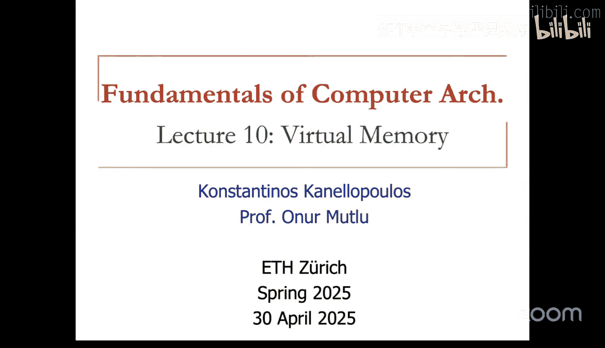
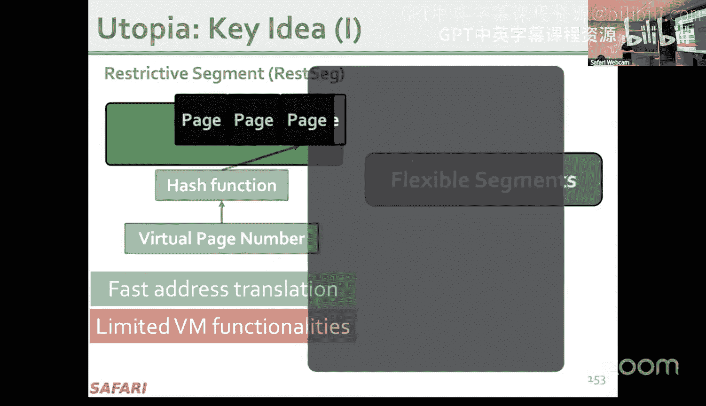
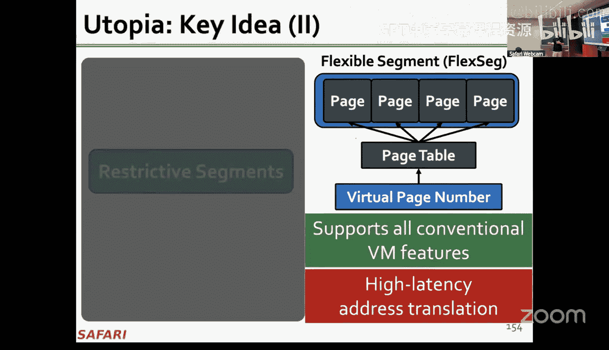
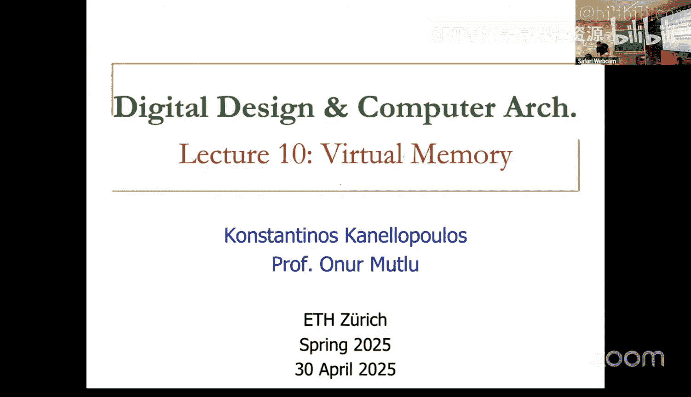

# 计算机架构基础：10：虚拟内存 🧠

## 概述
在本节课中，我们将要学习计算机系统中一个至关重要的概念——虚拟内存。虚拟内存为程序员提供了一个看似无限大的内存空间，而实际上，物理内存的容量要小得多。我们将探讨虚拟内存的工作原理、它带来的好处、以及为了实现它，硬件和操作系统需要如何协同工作。

---

## 为什么需要虚拟内存？🤔

上一节我们介绍了程序员视角下的理想内存。然而，现实中的物理内存是有限的。虚拟内存的出现，正是为了解决物理内存的局限性所带来的诸多问题。

在仅有物理内存的系统中（如早期计算机），程序员需要直接管理物理地址，这带来了以下困难：
*   **内存管理复杂**：程序员需要自己处理数据在有限物理内存中的存放和移动。
*   **缺乏隔离性**：多个程序可能使用相同的物理地址，导致数据被意外覆盖，无法保证进程间的安全隔离。
*   **难以共享**：进程间共享代码或数据需要显式的、复杂的同步机制。
*   **可移植性差**：程序需要为不同物理内存大小的系统进行专门适配。

虚拟内存的核心思想，就是为每个程序提供一个独立的、巨大的**虚拟地址空间**，并通过一个映射机制，将其动态地映射到有限的**物理地址空间**上。这样，程序员就无需关心物理内存的具体细节。

---

## 虚拟内存的基本概念 🧩

本节中，我们来看看虚拟内存是如何组织和管理地址空间的。

### 分页机制
虚拟内存将虚拟和物理地址空间都划分为固定大小的块，称为**页**。虚拟地址空间中的块叫**虚拟页**，物理地址空间中的块叫**物理页帧**。操作系统负责维护虚拟页到物理页帧的映射关系。

一个典型的页大小是 **4 KB**。这意味着一个 32 位的虚拟地址（4 GB 空间）会被划分为：
*   **虚拟页号**：高 20 位，用于查找映射。
*   **页内偏移**：低 12 位，因为 2^12 = 4096 (4 KB)，偏移量在映射过程中保持不变。

**公式**：`物理地址 = 物理页帧号 * 页大小 + 页内偏移`

### 页表
操作系统使用一个称为**页表**的数据结构来存储所有虚拟页到物理页帧的映射关系。每个进程都有自己的页表。

页表的每个条目称为**页表项**，通常包含：
*   **有效位**：指示该虚拟页是否已加载到物理内存中。
*   **物理页帧号**：如果有效位为 1，则指向对应的物理页帧。
*   **访问控制位**：如读/写/执行权限位，用于内存保护。

当 CPU 执行一条加载或存储指令时，它使用的是虚拟地址。内存管理单元需要“查阅”页表，将虚拟地址**翻译**成物理地址，然后才能访问真正的物理内存。

---

## 页表带来的挑战与优化 🚀

我们知道了页表是地址翻译的关键。但一个简单的线性页表会非常巨大。例如，对于一个 64 位虚拟地址空间（使用 48 位有效地址）和 4 KB 页，仅一个进程的页表就可能需要 `2^(48-12) * 8字节 ≈ 32 TB` 的空间，这显然不现实。

### 多级页表
为了解决页表过大的问题，现代系统使用**多级（层次）页表**。其核心思想是：只为进程实际使用的虚拟地址区域分配页表结构，而不是为整个地址空间预先分配。

以 x86-64 系统常见的四级页表为例：
1.  虚拟地址被分成多个索引字段（例如，各 9 位）。
2.  CR3 寄存器指向顶级页目录（PML4）。
3.  依次使用各级索引在页表层次结构中“行走”，最终找到末级的页表项（PTE），获得物理页帧号。

**优势**：节省了大量内存，因为未使用的虚拟地址区域对应的中间页表根本不会被创建。
**代价**：一次地址翻译可能需要多次内存访问（页表行走），导致延迟增加。

### 加速翻译：TLB
由于页表存储在内存中，每次地址翻译都进行多级页表行走会非常缓慢。为了加速，CPU 中集成了一个硬件缓存，专门用于存放最近使用过的虚拟页到物理页帧的映射，这就是**转址旁路缓冲器**。

**工作原理**：
*   当需要翻译虚拟地址时，首先查询 TLB。
*   如果 TLB **命中**，则直接获得物理页帧号，速度极快。
*   如果 TLB **缺失**，则必须启动硬件页表行走器去内存中查找页表，找到映射后，不仅用于本次访问，还会将其存入 TLB 以备后用。

TLB 是虚拟内存性能的关键，其命中率通常非常高。

---

## 处理页错误 ⚠️

当程序访问一个虚拟地址时，可能遇到页不在物理内存中的情况，这会触发一个**页错误**。以下是处理页错误的步骤：

1.  **触发**：CPU 访问一个虚拟页，其页表项中的有效位为 0，表示该页不在物理内存中（可能在磁盘上）。
2.  **异常**：CPU 触发一个页错误异常，操作系统内核的页错误处理程序被调用。
3.  **处理**：操作系统执行以下操作：
    *   检查访问是否合法（例如，是否有写入权限）。
    *   在物理内存中寻找一个空闲的页帧。如果内存已满，则需要根据某种**页面置换算法**（如时钟算法）选择一个“牺牲”页帧，将其内容写回磁盘（如果被修改过）。
    *   从磁盘（如交换空间或文件）中将所需的页读入到上一步找到的物理页帧中。这个 I/O 操作通常由 DMA 控制器完成，以减轻 CPU 负担。
4.  **更新**：操作系统更新页表，建立新的虚拟页到物理页帧的映射，并设置有效位和权限位。
5.  **恢复**：页错误处理程序返回，导致页错误的指令被重新执行，此时翻译成功，访问得以继续。

页错误处理是虚拟内存实现“无限内存”幻觉的核心机制，它允许系统将不常用的页暂时移出物理内存，为更急需的页腾出空间。

---

## 内存保护与共享 🛡️

除了地址翻译，虚拟内存的另一个重要功能是提供**内存保护**。页表项中的访问控制位（读、写、执行）使得操作系统可以控制每个页的访问权限。

以下是内存保护与共享的关键点：
*   **进程隔离**：每个进程有自己的页表，因此它们的虚拟地址空间是隔离的。一个进程无法访问或破坏另一个进程的内存，除非通过操作系统显式设置的共享机制。
*   **权限控制**：例如，代码页可以标记为“只读+可执行”，防止被意外修改；栈页可以标记为“可读可写但不可执行”，防止代码注入攻击。
*   **共享内存**：通过让不同进程的页表项指向同一个物理页帧，可以高效地实现进程间的代码共享（如共享库）或数据共享。

---

## 现代优化与研究方向 📈

虚拟内存系统仍在不断演进以应对新的挑战。以下是一些重要的优化和研究方向：

*   **大页**：使用更大的页（如 2 MB 或 1 GB 的“大页”）可以减少页表项的数量和 TLB 缺失率，从而提升大数据集应用的性能。Linux 中的**透明大页**特性可以自动尝试将小页合并为大页。
*   **TLB 预取与管理**：更智能的硬件或软件策略来预测并预加载可能需要的 TLB 条目。
*   **异构内存系统**：随着新型非易失性内存、加速器自带内存的出现，虚拟内存系统需要更高效地管理这些异构的物理内存资源。
*   **虚拟化环境**：在虚拟机中，存在“客户机虚拟地址 -> 客户机物理地址 -> 主机物理地址”的两层翻译，带来了额外的复杂性和开销，需要硬件（如 Intel EPT/AMD NPT）和软件的协同优化。

---

## 总结 🎯

本节课中我们一起学习了虚拟内存这一计算机架构的基石。我们了解到：

1.  **目标**：虚拟内存通过硬件和操作系统的协作，为每个进程提供了巨大、私有且受保护的地址空间幻觉。
2.  **核心机制**：**分页**机制将地址空间划分成页，通过**页表**维护虚拟页到物理页帧的映射。
3.  **关键硬件**：**MMU** 负责地址翻译，**TLB** 作为翻译缓存极大提升了性能。
4.  **关键软件事件**：**页错误**处理程序负责动态地将数据在磁盘和物理内存之间调度，并更新页表。
5.  **重要功能**：除了地址扩展，虚拟内存还提供了至关重要的**内存保护**和**共享**功能。
6.  **持续演进**：面对新的硬件和工作负载，虚拟内存系统通过大页、更智能的算法等不断优化。

虚拟内存完美体现了计算机系统中软硬件协同设计的智慧，它使得我们的程序能够更简单、更安全、更高效地运行。